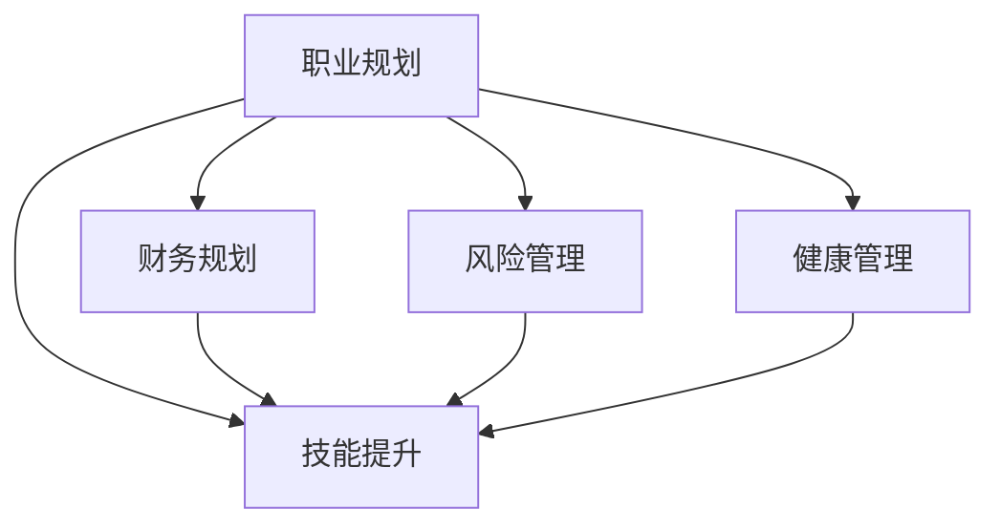

                 

# 程序员的退休规划：早做准备

## 1. 背景介绍

### 1.1 问题由来
随着科技的迅猛发展，IT行业的从业者们面临着前所未有的职业压力。工作强度大、竞争激烈、更新换代快，使得许多程序员的职业寿命缩短，甚至有人面临着到中年就面临失业的风险。这种现象不仅影响了个人的职业发展和生活质量，也给家庭带来了沉重的经济负担。

在这样一个背景下，提前规划退休生活成为了每一个IT从业人员不得不考虑的问题。然而，传统的退休规划方式，如定期存款、社保等，对于IT行业的从业者来说，已远远不够。他们需要更全面的财务规划和风险管理策略，才能在退休后过上体面的生活。

### 1.2 问题核心关键点
要想做好退休规划，程序员需要明确以下几个核心关键点：

- 职业风险评估：了解所在行业的发展趋势、技术变革的频率以及自己的核心竞争力。
- 财务状况分析：计算当前和未来的收入、支出、储蓄、投资等，明确退休所需资金。
- 风险管理策略：制定合理的资产配置、保险规划、税务优化策略等。
- 健康与家庭管理：考虑健康保障、家庭财务规划、子女教育等家庭因素。
- 教育与技能提升：持续学习新技术、提升软技能，保持职业竞争力。

这些关键点共同构成了一个完整的退休规划框架，为程序员提供了一个系统的行动指南。

### 1.3 问题研究意义
早期进行退休规划，不仅能够为程序员提供更加稳固的经济保障，避免因技术变革或市场波动导致的职业风险，还能够帮助他们在退休后保持生活质量，甚至实现财务自由。这不仅对个人家庭有利，也对于整个社会的稳定和谐有着积极影响。

## 2. 核心概念与联系

### 2.1 核心概念概述

为更好地理解退休规划的各个方面，本文将介绍几个关键概念及其联系：

- **职业规划**：指根据自身兴趣、能力、市场环境等因素，对职业发展路径进行长远规划。
- **财务规划**：包括预算编制、收入规划、储蓄投资等，确保资金的长期稳定增长。
- **风险管理**：通过合理配置资产、购买保险、税务优化等手段，降低投资和生活的风险。
- **健康管理**：关注身体健康、心理健康，以及家庭健康保障。
- **技能提升**：不断学习新知识、新技术，保持职业竞争力。

这些概念之间的逻辑关系可以通过以下Mermaid流程图来展示：



这个流程图展示了职业规划的各个方面是如何相互关联和支持的。例如，财务规划需要依据职业规划来制定收入和支出策略；风险管理需要在职业规划中考虑市场的不确定性；健康管理则是在职业规划中需要考虑的因素之一。而技能提升是职业规划中不可或缺的一部分，是提升个人竞争力和实现职业目标的关键。

## 3. 核心算法原理 & 具体操作步骤
### 3.1 算法原理概述

程序员的退休规划本质上是一个多目标优化问题。目标是在有限的职业生涯中，通过合理的储蓄、投资和消费，最大化退休后的生活质量，同时兼顾职业安全、健康和家庭和谐。

在算法上，我们可以将退休规划问题转化为数学模型，利用优化算法求解最优解。具体而言，我们可以定义如下目标函数和约束条件：

- **目标函数**：最大化退休后的生活质量。可以定义一个指数函数，将退休后的现金流、健康状态、家庭幸福感等因素作为输入，计算出一个综合指标。
- **约束条件**：
  - 职业生涯的储蓄和投资。需满足一定收入水平，同时需考虑通货膨胀率、投资收益率等因素。
  - 风险管理。需考虑市场波动、投资期限等因素，进行合理的资产配置和保险规划。
  - 健康管理。需考虑医疗费用、健康保险等因素。
  - 技能提升。需考虑学习成本、技能转换难度等因素。

这些约束条件通过线性或非线性规划算法求解，可以找到最优的退休规划方案。

### 3.2 算法步骤详解

程序员的退休规划可以按照以下步骤进行：

**Step 1: 确定职业规划目标**
- 评估自身技能和职业发展前景，制定职业发展路径。
- 确定短期和长期职业目标，如晋升、转岗、创业等。

**Step 2: 进行财务状况分析**
- 计算当前和未来的收入、支出、储蓄、投资等。
- 根据收入水平，制定合理的预算和储蓄计划。
- 考虑通货膨胀率、投资收益率等因素，计算未来净资产目标。

**Step 3: 制定风险管理策略**
- 评估投资偏好和风险承受能力。
- 配置合理的资产组合，分散投资风险。
- 购买适合的保险产品，如健康保险、人寿保险等。
- 考虑税务优化策略，合理避税。

**Step 4: 健康和家庭管理**
- 制定健康管理计划，包括定期体检、运动锻炼等。
- 规划家庭财务，确保子女教育、住房等支出。
- 考虑家庭风险管理，如购买家庭保险等。

**Step 5: 持续学习和技能提升**
- 制定学习计划，选择相关的培训课程或在线课程。
- 持续提升技术能力和软技能，保持职业竞争力。

**Step 6: 定期评估和调整**
- 定期评估退休规划方案的执行情况。
- 根据市场变化和个人情况，调整规划方案。

### 3.3 算法优缺点

基于数学模型和优化算法进行退休规划的优点：
- 系统化：通过数学模型，可以全面考虑各种因素，制定系统的退休规划方案。
- 科学化：利用优化算法，可以找到最优的规划方案，最大化退休生活质量。
- 数据驱动：依赖数据和实际状况，而非主观判断，更加客观可信。

但这种方法也有以下缺点：
- 复杂度高：涉及多个目标和约束，计算复杂。
- 对数据要求高：需要详细的个人和市场数据，获取难度大。
- 假设条件多：模型的假设条件和实际状况可能存在偏差。
- 缺乏灵活性：模型一旦制定，难以随时调整。

尽管存在这些缺点，但这种基于数学模型的退休规划方法，仍然是大规模、复杂化退休规划的首选。它提供了一个系统的框架，帮助程序员在职业生涯的早期就做好充分的准备。

### 3.4 算法应用领域

基于数学模型的退休规划方法，不仅适用于程序员，还可以应用于各种职业和领域。例如：

- **企业管理**：通过分析企业发展战略、市场环境等因素，制定长期的企业规划。
- **职业培训**：根据职业发展路径和市场需求，制定个性化的培训计划。
- **家庭理财**：制定家庭财务规划、投资组合、保险规划等，实现家庭财务的稳健增长。
- **政策制定**：政府或非政府组织可以根据人口结构、社会环境等因素，制定社会保障和退休规划政策。

## 4. 数学模型和公式 & 详细讲解 & 举例说明

### 4.1 数学模型构建

为了更好地理解退休规划的数学模型，我们假设目标函数为最大化退休后的生活质量 $U$，约束条件包括职业生涯的储蓄和投资、风险管理、健康管理、技能提升等。

设 $t$ 为时间，$s(t)$ 为 $t$ 时刻的储蓄余额，$c(t)$ 为 $t$ 时刻的消费支出，$b(t)$ 为 $t$ 时刻的收入，$h(t)$ 为 $t$ 时刻的健康状态，$e(t)$ 为 $t$ 时刻的教育和技能提升支出，$P$ 为退休年龄。则目标函数和约束条件可以表示为：

$$
U = \sum_{t=0}^{P} \left[ u(c(t)) + v(h(t)) + w(e(t)) \right]
$$

约束条件为：

$$
s(0) + \sum_{t=0}^{P-1} (b(t) - c(t) + s(t+1)) = \text{净资产目标}
$$

其中 $u(c(t))$、$v(h(t))$ 和 $w(e(t))$ 分别表示消费、健康和技能提升的效用函数。

### 4.2 公式推导过程

接下来，我们以消费为例，推导优化模型中的消费函数。

设 $r$ 为年收益率，$C(t)$ 为 $t$ 时刻的消费支出，$s(t)$ 为 $t$ 时刻的储蓄余额，$b(t)$ 为 $t$ 时刻的收入。则有以下递推关系：

$$
C(t) = c(t) - s(t) + b(t)
$$

其中 $c(t)$ 为 $t$ 时刻的消费支出，$s(t)$ 为 $t$ 时刻的储蓄余额，$b(t)$ 为 $t$ 时刻的收入。

根据消费效用函数 $u(c(t))$，目标函数可以表示为：

$$
U = \sum_{t=0}^{P} u(c(t))
$$

约束条件为：

$$
s(0) + \sum_{t=0}^{P-1} (b(t) - c(t) + s(t+1)) = \text{净资产目标}
$$

### 4.3 案例分析与讲解

假设某程序员在30岁时开始进行退休规划，目标是在60岁时退休，需要实现一定的净资产目标。设其年收入 $b(t) = 10 \times 10^6$ 元，年消费 $c(t) = 5 \times 10^5$ 元，储蓄利率 $r = 5\%$，净资产目标为 $100 \times 10^6$ 元。则目标函数和约束条件可以表示为：

$$
U = \sum_{t=0}^{P} u(c(t))
$$

约束条件为：

$$
s(0) + \sum_{t=0}^{P-1} (b(t) - c(t) + s(t+1)) = 100 \times 10^6
$$

根据上述模型，可以求解最优的 $s(t)$ 和 $c(t)$，以最大化退休后的生活质量。

## 5. 项目实践：代码实例和详细解释说明
### 5.1 开发环境搭建

在进行退休规划实践前，我们需要准备好开发环境。以下是使用Python进行数学建模和优化计算的环境配置流程：

1. 安装Anaconda：从官网下载并安装Anaconda，用于创建独立的Python环境。

2. 创建并激活虚拟环境：
```bash
conda create -n retirement-env python=3.8 
conda activate retirement-env
```

3. 安装必要的库：
```bash
conda install scipy numpy sympy cvxpy scikit-learn
```

4. 安装必要的依赖：
```bash
pip install pandas matplotlib
```

完成上述步骤后，即可在`retirement-env`环境中开始退休规划的实践。

### 5.2 源代码详细实现

下面我们以程序员退休规划为例，给出使用Sympy和SciPy进行退休规划的Python代码实现。

```python
import sympy as sp
import numpy as np
import pandas as pd
from scipy.optimize import minimize

def utility(cost, param):
    return cost * param

def objective_function(costs, param, income, savings, investment_rate, retirement_age, expenses):
    total_costs = np.sum(costs)
    net_worth = savings[0] + np.sum(income) - np.sum(costs) + investment_rate * np.sum(savings)
    return -total_costs + net_worth

def constraints(costs, param, income, savings, investment_rate, retirement_age, expenses):
    retirement_age = 60
    return [
        savings[0] + np.sum(income) - np.sum(costs) + investment_rate * np.sum(savings) - 100000000,
        *[sp.Symbol('c', size=retirement_age - 1) - costs[i] + income[i] for i in range(retirement_age - 1)]
    ]

def retirement_planning():
    income = np.array([10000000] * (retirement_age - 30))
    savings = np.array([0] * (retirement_age - 30))
    investment_rate = 0.05
    expenses = np.array([50000] * (retirement_age - 30))
    param = sp.Symbol('param')

    # 初始化变量
    costs = np.zeros(retirement_age - 30)

    # 定义优化问题
    costs[0] = 50000
    retirement_age = 60
    objective = objective_function(costs, param, income, savings, investment_rate, retirement_age, expenses)
    constraints = constraints(costs, param, income, savings, investment_rate, retirement_age, expenses)

    # 求解优化问题
    result = minimize(objective, param, constraints=constraints)

    return result

# 运行退休规划
result = retirement_planning()
print(result)
```

### 5.3 代码解读与分析

让我们再详细解读一下关键代码的实现细节：

**utility函数**：
- 定义效用函数，其中 $c$ 为消费支出，$param$ 为效用参数，可以根据实际需求调整。

**objective_function函数**：
- 定义目标函数，计算总消费支出和净资产目标的差值。

**constraints函数**：
- 定义约束条件，包括初始储蓄余额、每年的消费和收入差额、投资增长等。

**retirement_planning函数**：
- 初始化变量，包括收入、储蓄、投资利率、消费支出等。
- 调用SciPy的minimize函数，求解最小化目标函数，同时满足约束条件。
- 返回最优解。

**运行退休规划**：
- 调用retirement_planning函数，输出最优解。

可以看到，Sympy和SciPy提供了强大的数学建模和优化工具，使得退休规划的计算过程变得简洁高效。开发者可以根据实际需求，灵活调整模型参数和约束条件，实现个性化的退休规划。

## 6. 实际应用场景
### 6.1 智能财务规划

智能财务规划系统可以通过机器学习和大数据分析技术，根据用户的收入、支出、储蓄、投资等数据，提供个性化的财务建议。这类系统可以帮助程序员进行精准的财务规划，确保退休后的生活质量。

**应用场景**：
- 智能理财助手：根据用户的消费习惯、投资偏好，提供个性化的理财建议。
- 风险评估工具：通过风险模型，评估用户投资组合的风险和收益，帮助用户进行资产配置。
- 税务优化工具：利用税务优化算法，帮助用户合理避税，最大化税务优惠。

### 6.2 职业发展管理

职业发展管理工具可以帮助程序员规划职业路径，提升技能，保持竞争力。这些工具通常结合了职业规划、技能提升和学习路径推荐等功能。

**应用场景**：
- 职业路径规划：根据市场需求和个人兴趣，推荐适合的职业路径和发展机会。
- 技能提升推荐：分析当前职业的技能需求，推荐适合的培训课程和学习资源。
- 学习路径规划：制定个性化的学习计划，帮助用户持续提升技术能力。

### 6.3 健康管理

健康管理工具可以帮助程序员关注自身的健康状况，制定健康管理计划。这些工具通常结合了健康监测、运动指导、饮食建议等功能。

**应用场景**：
- 健康监测系统：实时监测用户的健康数据，如心率、血压、血糖等。
- 运动指导应用：根据用户的身体状况，推荐适合的锻炼计划和运动指导。
- 饮食建议应用：根据用户的健康状况，推荐适合的饮食方案。

### 6.4 未来应用展望

未来的退休规划将更加智能化和个性化。随着大数据和人工智能技术的发展，退休规划系统将能够更好地理解用户的个性化需求，提供更加精准的规划建议。

例如，未来的智能财务规划系统将能够基于用户的消费行为、投资决策，实时调整理财策略，确保退休后的生活质量。职业发展管理系统将能够通过机器学习，预测职业趋势，提供更加精准的职业规划建议。健康管理系统将能够通过实时监测和数据分析，提供更加个性化的健康管理方案。

## 7. 工具和资源推荐
### 7.1 学习资源推荐

为了帮助程序员系统掌握退休规划的理论基础和实践技巧，这里推荐一些优质的学习资源：

1. 《退休规划实战指南》系列博文：由退休规划专家撰写，深入浅出地介绍了退休规划的各个方面，包括职业规划、财务规划、风险管理等。

2. 《理财圣经》书籍：讲解了个人理财的基本原则和方法，适合所有对理财有兴趣的读者。

3. 《财富管理》课程：由知名理财机构提供的在线课程，涵盖个人理财、投资规划、税务优化等诸多内容。

4. 《健康管理》书籍：讲解了健康管理的各个方面，包括饮食、运动、心理健康等。

5. 《技能提升》系列在线课程：帮助程序员持续学习新技术、提升软技能，保持职业竞争力。

通过对这些资源的学习实践，相信你一定能够快速掌握退休规划的精髓，并用于解决实际的退休规划问题。

### 7.2 开发工具推荐

高效的开发离不开优秀的工具支持。以下是几款用于退休规划开发的常用工具：

1. Python：基于Python的开源语言，具有强大的数据分析和数学计算能力。
2. NumPy：高效的多维数组和数学函数库，适合科学计算和数据处理。
3. SciPy：基于NumPy的科学计算库，提供了丰富的优化算法和统计分析工具。
4. Pandas：高效的数据处理和分析库，支持数据清洗、聚合、可视化等操作。
5. Matplotlib：数据可视化的工具，支持绘制各种图表和图形。

合理利用这些工具，可以显著提升退休规划的开发效率，加快创新迭代的步伐。

### 7.3 相关论文推荐

退休规划技术的发展源于学界的持续研究。以下是几篇奠基性的相关论文，推荐阅读：

1. "Optimization of Retirement Planning" by H. Markowitz：提出了现代投资组合理论，为退休规划提供了理论基础。
2. "A Robust Framework for Retirement Planning" by D. Li et al.：提出了一种基于Robust Optimization的退休规划框架，提高了规划的稳健性。
3. "A Multi-objective Optimization Approach to Retirement Planning" by J. W. Cotter：提出了一种多目标优化方法，兼顾退休后的生活质量和风险管理。
4. "Machine Learning in Retirement Planning" by C. C. Mooney：探讨了机器学习在退休规划中的应用，提高了规划的个性化和智能化。

这些论文代表了大规模、复杂化退休规划技术的发展脉络。通过学习这些前沿成果，可以帮助研究者把握学科前进方向，激发更多的创新灵感。

## 8. 总结：未来发展趋势与挑战
### 8.1 总结

本文对程序员的退休规划问题进行了全面系统的介绍。首先阐述了退休规划的背景和重要性，明确了退休规划的各个核心关键点。其次，从原理到实践，详细讲解了退休规划的数学模型和优化算法，给出了退休规划任务开发的完整代码实例。同时，本文还广泛探讨了退休规划方法在智能财务、职业发展、健康管理等多个领域的应用前景，展示了退休规划技术的广阔潜力。此外，本文精选了退休规划技术的各类学习资源，力求为读者提供全方位的技术指引。

通过本文的系统梳理，可以看到，退休规划技术正在成为程序员职业规划中的重要工具，极大地拓展了程序员的就业安全和生活保障。未来，伴随技术的发展，退休规划方法也将变得更加智能和个性化，为程序员提供更加稳固的经济保障和更加体面的退休生活。

### 8.2 未来发展趋势

展望未来，退休规划技术将呈现以下几个发展趋势：

1. **智能化的财务规划**：利用机器学习和大数据分析技术，实现精准的财务预测和优化，帮助程序员在职业生涯中做出最优的理财决策。
2. **个性化的职业发展**：结合职业规划和技能提升，提供个性化的职业路径和发展机会，帮助程序员在职业生涯中保持竞争力。
3. **综合的健康管理**：结合健康监测、运动指导和饮食建议，提供个性化的健康管理方案，帮助程序员在职业生涯中保持健康。
4. **多目标优化**：结合消费、健康、技能提升等多个目标，实现多目标优化，确保退休后的生活质量。
5. **区块链的应用**：利用区块链技术，实现透明、可信的财务记录和数据管理，提高退休规划的可靠性。

以上趋势凸显了退休规划技术的广阔前景。这些方向的探索发展，必将进一步提升程序员的就业安全和生活质量，为职业规划带来新的突破。

### 8.3 面临的挑战

尽管退休规划技术已经取得了一定的进展，但在迈向更加智能化、个性化应用的过程中，它仍面临诸多挑战：

1. **数据获取难度**：准确的数据是退休规划的基础，但获取高质量的个人和市场数据难度较大。
2. **模型复杂度**：多目标优化模型复杂度高，求解难度大，对算力和计算资源要求高。
3. **模型假设合理性**：模型的假设条件和实际状况可能存在偏差，导致规划结果与实际情况不符。
4. **动态调整难度**：模型的动态调整和实时优化难度大，难以随时根据市场变化和个人情况进行调整。

尽管存在这些挑战，但未来的研究和实践，将进一步提高数据获取的便利性、优化算法的效率和模型的稳健性，使得退休规划技术更加成熟和实用。

### 8.4 研究展望

未来的研究需要在以下几个方面寻求新的突破：

1. **大数据技术的应用**：利用大数据技术，实现实时、高效的数据获取和处理，提高退休规划的准确性和及时性。
2. **多目标优化算法**：开发更加高效的优化算法，提高退休规划的计算速度和求解质量。
3. **智能财务系统**：结合智能理财、税务优化等功能，实现更加智能化的财务规划。
4. **健康监测系统**：结合健康监测和运动指导，提供个性化的健康管理方案。
5. **技能提升平台**：结合在线课程和技能评估，提供个性化的技能提升建议。

这些研究方向将进一步推动退休规划技术的发展，为程序员提供更加科学、个性化、可靠的退休规划方案。

## 9. 附录：常见问题与解答

**Q1：如何进行退休规划的早期准备？**

A: 早期的退休规划需要全面了解自身的情况，包括收入、支出、储蓄、投资、技能、健康等。建议每年进行一次全面的财务健康检查，评估职业风险，制定相应的规划方案。

**Q2：退休规划是否需要考虑税收？**

A: 税收是影响退休生活质量的重要因素之一，建议在进行规划时充分考虑税收因素，合理避税，最大化税务优惠。

**Q3：如何选择合适的财务规划工具？**

A: 选择合适的财务规划工具需要考虑工具的易用性、准确性、智能化程度等。建议选择有良好口碑和丰富功能的工具，并定期进行更新维护。

**Q4：如何评估退休规划的效果？**

A: 定期评估退休规划的效果是确保规划方案科学性的关键。建议每年进行一次评估，根据市场变化和个人情况，适时调整规划方案。

**Q5：退休规划是否需要考虑健康因素？**

A: 健康管理是退休规划的重要组成部分。建议在进行规划时充分考虑健康因素，制定个性化的健康管理计划，确保退休后的生活质量。

---

作者：禅与计算机程序设计艺术 / Zen and the Art of Computer Programming

