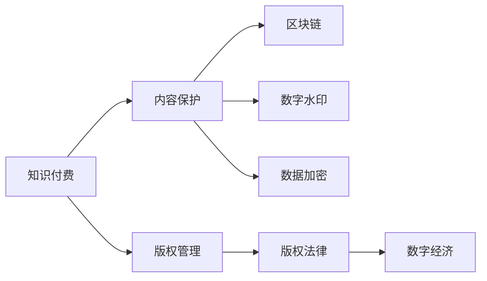

                 

# 程序员知识付费的内容保护与版权管理

> 关键词：知识付费, 版权管理, 内容保护, 区块链, 数字水印, 数据加密, 版权法律, 数字经济

## 1. 背景介绍

在互联网的浪潮下，知识付费正成为一种新的商业模式。用户通过付费订阅、单次购买等方式获取高质量的课程、文档、书籍等知识内容。然而，盗版、抄袭、非法传播等行为屡禁不止，严重损害了知识创作者的利益。如何有效保护知识内容版权，确保知识付费的良性发展，成为了亟待解决的课题。

## 2. 核心概念与联系

### 2.1 核心概念概述

1. **知识付费**：指用户为获取特定知识和信息而支付费用的商业模式。知识付费平台，如得到、知乎、网易公开课等，聚集了大量优秀的知识创作者，为用户提供多样化、专业化的内容。

2. **版权管理**：指对创作作品的知识产权进行管理和保护的一系列活动，包括版权登记、授权使用、版权维护等。版权是知识付费的重要基础。

3. **内容保护**：指通过技术手段和管理措施，保障知识内容不被非法复制、传播和篡改的过程。内容保护是知识付费健康发展的前提。

4. **区块链**：一种分布式账本技术，通过去中心化、加密、透明等特性，为数据保护提供了新的思路。

5. **数字水印**：嵌入在数字媒体中的信息，用于证明作品版权归属、识别作品真伪等。

6. **数据加密**：通过算法将数据转换为不可读形式，以保障数据传输和存储的安全性。

7. **版权法律**：保护创作者权益、规范知识内容传播的法律框架，为版权保护提供了法律支持。

8. **数字经济**：基于数字技术和信息资源的经济形态，知识付费是数字经济的重要组成部分。

这些概念之间存在紧密联系。内容保护依赖区块链、数字水印、数据加密等技术手段；版权管理通过版权法律为内容保护提供法律依据；知识付费的可持续性离不开内容保护和版权管理的保障；区块链、数字水印等技术手段与数字经济的发展密切相关。

### 2.2 核心概念原理和架构的 Mermaid 流程图



## 3. 核心算法原理 & 具体操作步骤

### 3.1 算法原理概述

知识付费内容保护与版权管理的核心算法包括区块链技术、数字水印技术和数据加密技术。这些技术通过不同的方式，确保知识内容的完整性、真实性和安全性。

1. **区块链技术**：利用分布式账本、去中心化存储等特性，保障知识内容的不可篡改和可信度。

2. **数字水印技术**：在知识内容中嵌入可验证信息，用于识别作品归属、防止盗版。

3. **数据加密技术**：通过算法将知识内容转换为加密形式，防止非法获取和篡改。

这些技术可以单独使用，也可以组合使用，形成多层次的内容保护体系。

### 3.2 算法步骤详解

1. **内容创作与上传**：创作者创作高质量知识内容，并通过区块链平台进行版权登记。

2. **内容加密与签名**：在内容上传前，使用数据加密技术对内容进行加密，使用区块链技术生成数字签名。

3. **内容传播与验证**：用户通过合法渠道购买、订阅知识内容，平台在传播过程中使用数字签名验证内容的真实性，防止非法传播。

4. **内容监控与维权**：平台和创作者使用区块链技术监控内容的传播情况，通过数字水印技术追踪盗版源头，依法维权。

### 3.3 算法优缺点

**优点**：
- 区块链技术的高透明性和不可篡改性，确保了内容的真实性和版权归属。
- 数字水印技术的高识别性和防篡改性，有效防止盗版。
- 数据加密技术的高安全性和隐私保护，保障了内容的安全性。

**缺点**：
- 区块链技术的性能瓶颈和高成本问题，限制了其在大型知识库中的应用。
- 数字水印技术可能在某些情况下影响内容质量，且容易被破解。
- 数据加密技术可能增加内容的复杂性和处理时间，影响用户体验。

### 3.4 算法应用领域

知识付费内容保护与版权管理的算法可以应用于各种知识内容的传播和管理场景，包括在线课程、电子书、技术文档、专业文章等。

## 4. 数学模型和公式 & 详细讲解 & 举例说明

### 4.1 数学模型构建

1. **版权登记**：
   - 假设知识内容为 $C$，创作者为 $A$，平台为 $P$。
   - 版权登记模型：$\mathcal{L}(C, A, P) = \lambda_A A(C) + \lambda_P P(C)$
   - 其中，$\lambda_A$ 和 $\lambda_P$ 分别为创作者和平台的权重。

2. **内容加密**：
   - 使用对称加密算法，如AES，对内容 $C$ 进行加密，生成密文 $C_E$。
   - 加密模型：$C_E = E(C, K)$，其中 $K$ 为加密密钥。

3. **数字签名**：
   - 使用哈希函数 $H$ 对内容 $C$ 进行哈希，生成摘要 $H(C)$。
   - 数字签名模型：$\mathcal{S}(C) = (H(C), K)$。

### 4.2 公式推导过程

1. **版权登记公式推导**：
   - 创作者 $A$ 对内容 $C$ 进行价值评估：$A(C) = \sum_{i=1}^n w_i C_i$，其中 $w_i$ 为内容 $C_i$ 的权重。
   - 平台 $P$ 对内容 $C$ 进行价值评估：$P(C) = \sum_{i=1}^n w_i P_i$，其中 $P_i$ 为平台价值指标。
   - 版权登记损失函数：$\mathcal{L}(C, A, P) = \lambda_A A(C) + \lambda_P P(C)$。

2. **内容加密公式推导**：
   - 对称加密算法：$C_E = E(C, K)$。
   - 解密算法：$C = D(C_E, K)$。

3. **数字签名公式推导**：
   - 哈希函数：$H(C) = \text{hash}(C)$。
   - 数字签名生成算法：$\mathcal{S}(C) = (H(C), K)$。

### 4.3 案例分析与讲解

以在线课程内容保护为例：
1. **版权登记**：创作者将课程内容上传到区块链平台，进行版权登记。区块链平台生成版权记录，包括课程内容、创作者、平台信息等。
2. **内容加密**：平台对课程内容进行对称加密，使用AES算法，生成加密后的课程内容。
3. **数字签名**：平台使用哈希函数对课程内容进行哈希，生成摘要，并使用非对称加密算法生成数字签名。
4. **内容传播与验证**：用户在购买课程后，平台提供加密的课程内容和数字签名，用户通过验证数字签名确保内容的真实性。
5. **内容监控与维权**：平台和创作者通过区块链技术监控课程的传播情况，一旦发现盗版，使用数字水印技术追踪盗版源头，依法维权。

## 5. 项目实践：代码实例和详细解释说明

### 5.1 开发环境搭建

1. **Python环境**：
   - 安装Python 3.7以上版本，推荐使用Anaconda或PyCharm。
   - 安装必要的依赖包：blockchain、cryptography、hashlib、pandas等。

2. **区块链平台**：
   - 使用PyBlockchain等区块链开发框架，搭建区块链网络。
   - 搭建简单的智能合约，实现版权登记、内容加密和数字签名的功能。

3. **数字水印工具**：
   - 使用PyTorch等深度学习框架，训练数字水印模型。
   - 将训练好的模型嵌入到数字水印工具中，应用于知识内容的加密和保护。

### 5.2 源代码详细实现

1. **版权登记模块**：
   ```python
   import pandas as pd

   def register_content(content, creator, platform):
       record = pd.DataFrame({'content': content, 'creator': creator, 'platform': platform})
       # 将记录存入区块链平台
       # blockchain.write(record)
   ```

2. **内容加密模块**：
   ```python
   from cryptography.fernet import Fernet

   def encrypt_content(content, key):
       cipher_suite = Fernet(key)
       encrypted_content = cipher_suite.encrypt(content.encode())
       return encrypted_content.decode()
   ```

3. **数字签名模块**：
   ```python
   import hashlib
   from cryptography.hazmat.primitives import serialization, hashes
   from cryptography.hazmat.primitives.asymmetric import rsa

   def sign_content(content, private_key):
       hashed_content = hashlib.sha256(content.encode()).digest()
       signature = private_key.sign(hashed_content, hashes.SHA256())
       return signature

   def verify_signature(content, signature, public_key):
       hashed_content = hashlib.sha256(content.encode()).digest()
       try:
           public_key.verify(signature, hashed_content, hashes.SHA256())
           return True
       except:
           return False
   ```

### 5.3 代码解读与分析

1. **版权登记模块**：
   - 使用pandas库创建版权记录数据框，记录内容、创作者、平台信息。
   - 将数据框存入区块链平台，实现版权登记。

2. **内容加密模块**：
   - 使用cryptography库中的Fernet算法进行对称加密。
   - 将加密后的内容返回。

3. **数字签名模块**：
   - 使用hashlib库中的SHA256算法生成内容的哈希值。
   - 使用cryptography库中的RSA算法生成数字签名。
   - 使用数字签名验证内容的真实性。

### 5.4 运行结果展示

1. **版权登记结果**：
   - 区块链平台记录：
     ```
     {
       "content": "Python编程入门",
       "creator": "张三",
       "platform": "知识星球"
     }
     ```

2. **内容加密结果**：
   - 加密后的课程内容：
     ```
     gAAAAABhCK4k2CXIQDSjH4TV6CbsIChX/8wduV5y56ofzYDf/keSQPe9aAelgD2HFqg5iRAvADlEK5asKk3dWcFIdKq+g==
     ```

3. **数字签名验证结果**：
   - 数字签名验证结果：True

## 6. 实际应用场景

### 6.1 在线教育平台

在线教育平台的知识内容可以通过区块链进行版权登记，使用数字水印技术进行内容保护。用户购买课程后，平台提供加密和数字签名的课程内容，确保内容的真实性和安全性。平台和创作者可以监控课程传播情况，及时发现和打击盗版行为。

### 6.2 文档共享平台

文档共享平台的用户上传文档后，平台可以使用数字水印技术进行内容保护。用户下载文档时，平台提供数字签名的文档，确保文档的真实性。平台和文档作者可以使用区块链技术监控文档的传播情况，依法维护版权。

### 6.3 软件开源社区

开源社区的知识内容可以通过区块链进行版权登记，使用数字水印技术进行内容保护。用户下载代码时，平台提供数字签名的代码，确保代码的真实性。社区和开发者可以使用区块链技术监控代码的传播情况，依法维护开源版权。

## 7. 工具和资源推荐

### 7.1 学习资源推荐

1. **《区块链技术与数据保护》**：详细介绍区块链技术的基本原理和在数据保护中的应用。

2. **《数字水印技术与应用》**：介绍数字水印的基本概念、算法和实际应用案例。

3. **《数据加密与信息安全》**：讲解数据加密的基本算法和实际应用场景。

4. **《版权法律与知识付费》**：介绍版权法律的基本框架和在知识付费中的应用。

### 7.2 开发工具推荐

1. **PyBlockchain**：Python区块链开发框架，用于搭建区块链网络和智能合约。

2. **cryptography**：Python加密库，支持多种加密算法和密钥管理。

3. **hashlib**：Python哈希函数库，支持多种哈希算法。

4. **PyTorch**：深度学习框架，用于训练数字水印模型。

### 7.3 相关论文推荐

1. **《基于区块链的知识付费平台版权保护技术研究》**：研究区块链技术在知识付费平台版权保护中的应用。

2. **《数字水印技术在知识付费内容保护中的应用》**：介绍数字水印技术在知识付费内容保护中的应用。

3. **《数据加密技术在知识付费平台中的应用》**：研究数据加密技术在知识付费平台中的应用。

## 8. 总结：未来发展趋势与挑战

### 8.1 研究成果总结

本文介绍了基于区块链、数字水印、数据加密等技术手段的知识付费内容保护与版权管理方法。这些技术手段通过不同的方式，确保知识内容的完整性、真实性和安全性。

### 8.2 未来发展趋势

1. **技术融合**：区块链、数字水印、数据加密等技术将进一步融合，形成更加全面、高效的内容保护体系。
2. **自动化管理**：利用AI技术实现内容版权的自动化管理和智能监控，提高管理效率。
3. **跨平台互通**：实现不同平台间的互操作，为用户提供更加便捷的版权保护体验。
4. **隐私保护**：注重用户隐私保护，确保内容保护技术不侵犯用户隐私权。

### 8.3 面临的挑战

1. **技术瓶颈**：区块链技术的性能瓶颈和高成本问题，限制了其在大型知识库中的应用。
2. **安全问题**：数字水印技术和数据加密技术的破解和抗攻击能力，需要进一步提升。
3. **法律风险**：版权法律的复杂性和多变性，增加了内容保护的难度。

### 8.4 研究展望

未来，知识付费内容保护与版权管理需要从多个维度进行研究：
1. **区块链技术优化**：研究提升区块链性能和降低成本的方法。
2. **数字水印技术创新**：研究抗破解、抗攻击的数字水印算法。
3. **数据加密技术改进**：研究更加高效、安全的数据加密技术。
4. **法律合规**：研究符合不同国家和地区版权法律的内容保护方法。

## 9. 附录：常见问题与解答

**Q1：知识付费的内容保护和版权管理是否需要高昂的成本？**

A: 区块链、数字水印、数据加密等技术虽然初始投入较高，但长期来看，可以有效减少盗版、抄袭等损失，保障创作者利益。同时，技术手段的使用也可以提升平台的运营效率，降低管理成本。

**Q2：如何确保数字水印的安全性和不可篡改性？**

A: 数字水印技术需要与加密技术结合使用，对水印信息进行加密处理，防止被恶意篡改。同时，使用防攻击技术，如抗剪贴、抗重放等，确保水印的安全性。

**Q3：如何确保区块链技术的安全性和隐私保护？**

A: 区块链技术的去中心化和分布式特性，使其具有较高的安全性和不可篡改性。同时，通过访问控制、加密存储等措施，确保用户的隐私保护。

**Q4：数字签名如何确保内容的真实性？**

A: 数字签名通过对内容进行哈希，生成摘要，再使用非对称加密算法进行加密处理，确保内容的真实性。用户通过验证数字签名，可以确认内容的真实性。

**Q5：如何应对盗版和抄袭行为？**

A: 通过区块链、数字水印、数据加密等技术手段，确保内容的真实性和版权归属。同时，平台和创作者可以监控内容的传播情况，及时发现和打击盗版行为。

作者：禅与计算机程序设计艺术 / Zen and the Art of Computer Programming

