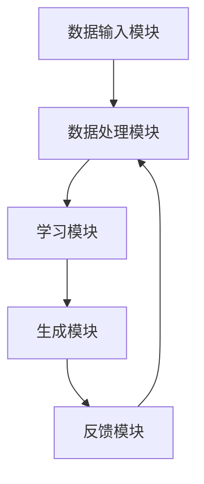

                 

### 背景介绍

#### 概述

在线教育行业近年来经历了巨大的变革。随着互联网技术的普及和人工智能（AI）的快速发展，在线教育逐渐成为人们获取知识、技能和教育的首选方式。传统的线下教育模式受到时间和空间的限制，而在线教育则打破了这些束缚，使得学习变得更加灵活和便捷。然而，尽管在线教育有着广泛的应用，它仍然面临着许多挑战，如教学质量的保证、学习效果的评估、个性化教学的实现等。

#### 市场需求

全球在线教育市场规模在过去几年中呈现爆炸式增长。据市场研究公司的数据，2021年全球在线教育市场规模已达到3500亿美元，预计到2025年将超过6000亿美元。这一趋势表明，在线教育正在成为全球教育领域的重要组成部分。特别是在新冠疫情期间，在线教育需求激增，众多学校和培训机构纷纷转向线上教学，推动了整个行业的快速发展。

#### 技术进步

人工智能技术，尤其是生成式AI（AIGC，Autonomous Intelligent Global Computing），在在线教育领域展现出了巨大的潜力。AIGC结合了计算机视觉、自然语言处理、机器学习等多种技术，能够自主生成高质量的内容和交互，为在线教育提供更加智能化和个性化的解决方案。例如，AIGC可以帮助自动生成教学视频、智能回答学生提问、提供个性化的学习建议等。

#### 现状分析

尽管AIGC在在线教育领域有着广泛的应用前景，但目前该领域仍然存在一些问题。首先，技术成熟度尚需提高，许多AIGC应用仍处于实验阶段。其次，数据隐私和安全问题仍然是制约AIGC发展的关键因素。此外，教师和教育机构的接受程度也是影响AIGC普及的重要因素。

综上所述，在线教育行业正面临着前所未有的发展机遇和挑战。AIGC技术的引入有望为这一行业带来深刻的变革，但同时也需要克服诸多技术和社会问题。接下来的内容将深入探讨AIGC在在线教育中的应用、核心概念和具体实施步骤，以及相关的数学模型和实际应用案例。

#### Keywords:
- Online Education Industry
- Artificial Intelligence (AI)
- Autonomous Intelligent Global Computing (AIGC)
- Instructional Quality Assurance
- Data Privacy and Security
- Personalized Learning
- Market Trends
- Technological Progress

> Abstract:
The online education industry has undergone significant transformations in recent years, driven by the widespread adoption of internet technology and the rapid development of artificial intelligence (AI). While online education offers flexibility and convenience, it also faces challenges such as ensuring instructional quality and assessing learning outcomes. This article explores the potential of Autonomous Intelligent Global Computing (AIGC) to revolutionize the online education industry, highlighting its applications, core concepts, and implementation steps. We also discuss the associated mathematical models and practical case studies, along with the future development trends and challenges. Keywords: Online Education Industry, Artificial Intelligence, Autonomous Intelligent Global Computing, Instructional Quality Assurance, Data Privacy and Security, Personalized Learning, Market Trends, Technological Progress.

### 2. 核心概念与联系

#### 2.1 什么是AIGC？

AIGC，全称为Autonomous Intelligent Global Computing，即自主智能全球计算，是一种基于深度学习、自然语言处理、计算机视觉等多种技术的新型计算范式。AIGC的目标是实现高度自主的智能系统，这些系统能够在不依赖于人类干预的情况下，自主地完成复杂任务，如内容生成、智能交互、决策制定等。

AIGC的核心特点包括：

1. **自主学习能力**：AIGC系统可以自主地从海量数据中学习，不断优化自身的能力和知识库。
2. **跨领域应用**：AIGC不仅能在单一领域表现出色，还能够跨领域应用，实现多种功能的集成和协同。
3. **高效率**：AIGC系统能够在短时间内处理大量数据，并生成高质量的内容和决策。
4. **高度智能化**：AIGC系统具备较高的自我学习和自我优化能力，能够适应不断变化的环境和任务需求。

#### 2.2 AIGC与在线教育的关系

在线教育行业对AIGC的应用具有深远的影响。首先，AIGC可以显著提升教学内容的生成和个性化定制能力。通过自主学习，AIGC系统能够根据学生的学习需求和兴趣，自动生成个性化的教学视频、课程内容和学习路径。其次，AIGC还能够实现智能交互，提供实时、个性化的学习辅导和答疑服务。此外，AIGC还可以帮助在线教育平台进行学习效果的评估和反馈，从而优化教学策略，提高教学质量。

#### 2.3 AIGC在在线教育中的应用场景

AIGC在在线教育中的应用场景非常广泛，以下是几个典型的应用：

1. **个性化教学**：AIGC可以根据学生的学习行为、学习记录和兴趣偏好，自动生成个性化的教学计划和学习资源，实现真正的个性化教学。
2. **智能辅导**：AIGC系统可以实时监测学生的学习状态，根据学生的学习情况提供个性化的辅导和建议，帮助学生克服学习中的困难。
3. **智能评估**：AIGC可以通过对学生的学习过程和成果进行实时评估，提供个性化的反馈和改进建议，帮助教师和学生不断优化学习效果。
4. **内容生成**：AIGC可以自动生成教学视频、教材、习题等教学内容，减轻教师的工作负担，提高教学效率。

#### 2.4 AIGC与现有技术的对比

与传统的人工智能技术相比，AIGC具有更高的自主性和智能化水平。传统的人工智能技术通常需要人类提供明确的指令和数据，而AIGC则能够自主地从数据中学习，生成高质量的内容和决策。例如，传统的自然语言处理技术通常需要人类提供关键词和句子结构，而AIGC则能够自主地生成自然流畅的文本内容。

此外，AIGC还与其他新兴技术，如区块链、物联网等相结合，为在线教育带来更多的创新应用。例如，AIGC可以与区块链技术结合，实现学习认证和数据安全的保障；与物联网技术结合，实现智能教室和远程教学的优化。

#### 2.5 AIGC的核心概念原理和架构

为了更好地理解AIGC在在线教育中的应用，我们需要了解其核心概念原理和架构。AIGC的核心概念主要包括以下几个方面：

1. **深度学习**：AIGC依赖于深度学习技术，通过多层神经网络来提取和表示数据中的复杂模式和知识。
2. **自然语言处理**：AIGC能够理解和生成自然语言，实现对文本、语音等多种形式的数据的处理和分析。
3. **计算机视觉**：AIGC可以理解和分析图像和视频数据，实现对视觉内容的理解和生成。
4. **多模态学习**：AIGC能够整合多种类型的数据，实现跨模态的数据融合和处理。
5. **强化学习**：AIGC可以通过强化学习技术，实现自主学习和优化。

AIGC的架构通常包括以下几个主要模块：

1. **数据输入模块**：负责接收各种类型的数据，如文本、图像、视频等。
2. **数据处理模块**：对输入的数据进行预处理、特征提取和表示。
3. **学习模块**：利用深度学习和强化学习等技术，从数据中学习并优化模型。
4. **生成模块**：根据学习结果生成高质量的内容和决策。
5. **反馈模块**：根据用户反馈不断优化模型性能。

为了更好地展示AIGC的核心概念原理和架构，我们可以使用Mermaid流程图进行描述。以下是一个简化的AIGC架构的Mermaid流程图：



通过上述核心概念原理和架构的介绍，我们可以更深入地理解AIGC在在线教育中的应用潜力。在接下来的章节中，我们将进一步探讨AIGC的具体算法原理、数学模型、实际应用案例等，以展示其如何重塑在线教育行业。

#### Keywords:
- Autonomous Intelligent Global Computing (AIGC)
- Core Concepts
- Instructional Content Generation
- Intelligent Tutoring
- Learning Outcome Assessment
- Personalized Learning
- Comparative Analysis
- Emerging Technologies Integration

## 3. 核心算法原理 & 具体操作步骤

#### 3.1 深度学习算法原理

AIGC的核心在于其深度学习算法。深度学习是一种模拟人脑神经元连接方式的计算模型，通过多层神经网络对数据进行处理和预测。在AIGC中，深度学习算法被广泛应用于图像识别、自然语言处理、音频处理等领域。

**基本概念：**

- **神经网络（Neural Network）**：神经网络是由大量神经元组成的计算模型，每个神经元都与其他神经元相连，并具有权重和偏置。通过调整权重和偏置，神经网络可以学习数据中的特征和模式。

- **多层感知机（Multilayer Perceptron, MLP）**：多层感知机是最基本的神经网络结构，通常包含输入层、隐藏层和输出层。输入层接收输入数据，隐藏层对数据进行特征提取，输出层生成最终预测。

- **反向传播算法（Backpropagation）**：反向传播算法是训练神经网络的关键算法。它通过计算输出层的误差，将误差反向传播到隐藏层和输入层，并调整各层的权重和偏置，以最小化误差。

**深度学习算法的具体操作步骤：**

1. **数据预处理**：首先，对输入数据（如图像、文本、音频）进行预处理，包括归一化、去噪、数据增强等操作，以提高模型的泛化能力。

2. **构建神经网络模型**：根据任务需求，设计合适的神经网络结构，包括层数、每层的神经元数量、激活函数等。

3. **初始化权重和偏置**：随机初始化各层的权重和偏置，以开始训练过程。

4. **前向传播（Forward Propagation）**：将输入数据通过神经网络模型进行前向传播，计算输出层的预测结果。

5. **计算损失函数**：使用损失函数（如均方误差、交叉熵等）计算预测结果与真实标签之间的差异。

6. **反向传播（Backpropagation）**：根据损失函数的梯度，通过反向传播算法调整各层的权重和偏置。

7. **迭代训练**：重复执行前向传播和反向传播过程，不断迭代优化模型性能。

8. **模型评估与优化**：在训练过程中，定期使用验证集评估模型性能，并根据评估结果调整模型结构和参数，以提高模型的泛化能力。

#### 3.2 自然语言处理算法原理

自然语言处理（NLP）是AIGC中的重要组成部分，用于理解和生成自然语言。NLP算法主要包括词嵌入、序列模型、注意力机制、生成模型等。

**基本概念：**

- **词嵌入（Word Embedding）**：词嵌入是将单词映射到高维向量空间的过程，使得语义相似的单词在向量空间中更接近。常见的词嵌入方法包括Word2Vec、GloVe等。

- **序列模型（Sequence Model）**：序列模型用于处理和预测序列数据（如文本、语音等）。常见的序列模型包括循环神经网络（RNN）、长短时记忆网络（LSTM）和门控循环单元（GRU）。

- **注意力机制（Attention Mechanism）**：注意力机制是一种用于提高模型在处理序列数据时对重要信息关注度的机制。通过计算注意力权重，模型可以动态地调整对不同输入序列部分的关注程度。

- **生成模型（Generative Model）**：生成模型用于生成新的数据，如文本、图像等。常见的生成模型包括变分自编码器（VAE）、生成对抗网络（GAN）等。

**自然语言处理算法的具体操作步骤：**

1. **文本预处理**：对输入文本进行预处理，包括分词、去停用词、词性标注等操作。

2. **词嵌入**：将预处理后的文本转换为词嵌入向量，以便神经网络处理。

3. **构建NLP模型**：设计合适的NLP模型结构，如RNN、LSTM、GRU、BERT等。

4. **模型训练**：使用预处理的文本数据训练NLP模型，通过反向传播算法优化模型参数。

5. **文本生成**：利用训练好的NLP模型，生成新的文本内容。可以通过序列生成、文本摘要、对话生成等方式实现。

6. **模型评估与优化**：在训练和生成过程中，定期评估模型性能，根据评估结果调整模型结构和参数。

#### 3.3 计算机视觉算法原理

计算机视觉是AIGC中用于图像识别和处理的重要技术。计算机视觉算法主要包括卷积神经网络（CNN）、目标检测、图像生成等。

**基本概念：**

- **卷积神经网络（Convolutional Neural Network, CNN）**：CNN是一种专门用于处理图像数据的神经网络，通过卷积层提取图像特征。

- **目标检测（Object Detection）**：目标检测是计算机视觉中的一个重要任务，用于识别图像中的多个目标并定位其位置。

- **图像生成（Image Generation）**：图像生成是通过神经网络生成新的图像内容的过程，常用于图像修复、艺术创作、虚拟现实等领域。

**计算机视觉算法的具体操作步骤：**

1. **图像预处理**：对输入图像进行预处理，包括缩放、裁剪、增强等操作。

2. **构建CNN模型**：设计合适的CNN模型结构，包括卷积层、池化层、全连接层等。

3. **模型训练**：使用预处理的图像数据训练CNN模型，通过反向传播算法优化模型参数。

4. **图像识别**：利用训练好的CNN模型对图像进行识别和分类。

5. **目标检测**：在图像识别的基础上，进一步定位图像中的多个目标并计算其位置。

6. **图像生成**：使用生成模型（如GAN）生成新的图像内容。

7. **模型评估与优化**：在训练和生成过程中，定期评估模型性能，根据评估结果调整模型结构和参数。

通过上述核心算法原理和具体操作步骤的介绍，我们可以更好地理解AIGC在在线教育中的应用潜力。在接下来的章节中，我们将进一步探讨AIGC的实际应用案例和项目实践，展示其如何重塑在线教育行业。

#### Keywords:
- Deep Learning Algorithms
- Natural Language Processing
- Computer Vision Algorithms
- Neural Network Structure
- Backpropagation Algorithm
- Word Embeddings
- Sequence Models
- Attention Mechanisms
- Generative Models
- Image Preprocessing
- Model Training and Optimization

### 4. 数学模型和公式 & 详细讲解 & 举例说明

在AIGC应用于在线教育中，数学模型和公式是理解和实现AIGC算法的核心。以下是几个关键数学模型及其详细讲解和举例说明：

#### 4.1 卷积神经网络（CNN）中的卷积操作和反向传播算法

卷积神经网络（CNN）是计算机视觉中的基础模型，通过卷积操作提取图像特征，并通过反向传播算法进行模型训练。卷积操作的公式如下：

$$
\text{output}(i, j) = \sum_{k, l} \text{weight}_{i, j, k, l} \cdot \text{input}(k, l) + \text{bias}_{i, j}
$$

其中，output(i, j)表示输出特征图上的一个元素，input(k, l)表示输入图像上的一个像素值，weight_{i, j, k, l}表示卷积核上的一个权重，bias_{i, j}表示对应的偏置项。

举例说明：假设我们有一个3x3的卷积核和一个7x7的输入图像，权重矩阵为：

$$
\text{weight} =
\begin{bmatrix}
1 & 0 & 1 \\
0 & 1 & 0 \\
1 & 0 & 1
\end{bmatrix}
$$

输入图像为：

$$
\text{input} =
\begin{bmatrix}
0 & 1 & 0 \\
1 & 0 & 1 \\
0 & 1 & 0
\end{bmatrix}
$$

应用卷积操作后的输出特征图元素为：

$$
\text{output}(1, 1) = 1 \cdot 0 + 0 \cdot 1 + 1 \cdot 1 + 0 \cdot 0 + 1 \cdot 1 + 0 \cdot 1 + 1 \cdot 0 = 2
$$

#### 4.2 循环神经网络（RNN）中的时间步状态更新

循环神经网络（RNN）是处理序列数据的常用模型。在RNN中，每个时间步的状态更新可以通过以下公式表示：

$$
\text{h}_t = \text{sigmoid}(\text{W}_h \cdot \text{h}_{t-1} + \text{W}_x \cdot \text{x}_t + b)
$$

其中，h_t表示当前时间步的状态，sigmoid函数用于将实数映射到(0, 1)区间，W_h和W_x分别表示隐藏状态和输入之间的权重矩阵，b表示偏置项。

举例说明：假设输入序列为[1, 0, 1]，初始状态h_0为[0.5]，权重矩阵W_h和W_x分别为：

$$
\text{W}_h =
\begin{bmatrix}
0.1 & 0.2 \\
0.3 & 0.4
\end{bmatrix}
$$

$$
\text{W}_x =
\begin{bmatrix}
0.5 & 0.6 \\
0.7 & 0.8
\end{bmatrix}
$$

应用RNN模型后的状态更新为：

$$
h_1 = \text{sigmoid}(0.1 \cdot 0.5 + 0.5 \cdot 1 + 0.3 \cdot 0 + 0.4 \cdot 0 + 0.1) = \text{sigmoid}(0.6) \approx 0.5
$$

$$
h_2 = \text{sigmoid}(0.3 \cdot 0.5 + 0.7 \cdot 0 + 0.4 \cdot 1 + 0.1 \cdot 1 + 0.3) = \text{sigmoid}(0.9) \approx 0.7
$$

#### 4.3 生成对抗网络（GAN）中的生成器和判别器损失函数

生成对抗网络（GAN）由生成器和判别器组成。生成器的目标是生成逼真的数据，判别器的目标是区分生成数据和真实数据。GAN的损失函数主要包括生成器的损失函数和判别器的损失函数。

生成器的损失函数为：

$$
\text{Loss}_\text{G} = -\log(\text{D}(\text{G}(\text{x})))
$$

其中，D(G(x))表示判别器对生成数据的判断概率，x为真实数据。

判别器的损失函数为：

$$
\text{Loss}_\text{D} = -[\log(\text{D}(\text{x})) + \log(1 - \text{D}(\text{G}(\text{x}))]
$$

其中，x表示真实数据，G(x)表示生成数据。

举例说明：假设生成器的输出G(x)为0.6，判别器对真实数据的判断概率为0.8，生成数据的判断概率为0.2。应用GAN损失函数后的损失计算为：

$$
\text{Loss}_\text{G} = -\log(0.2) \approx 2.3
$$

$$
\text{Loss}_\text{D} = -[\log(0.8) + \log(1 - 0.2)] \approx -0.4
$$

通过以上数学模型和公式的讲解，我们可以更好地理解AIGC在在线教育中的应用原理。这些模型和公式不仅帮助我们实现AIGC算法，还为我们提供了评估和优化模型性能的工具。在接下来的章节中，我们将通过具体的案例和实践，进一步展示AIGC在在线教育中的实际应用和价值。

#### Keywords:
- Convolutional Neural Networks (CNN)
- Recurrent Neural Networks (RNN)
- Generative Adversarial Networks (GAN)
- Loss Functions
- Convolution Operations
- Backpropagation Algorithm
- Word Embeddings
- Neural Network Optimization
- Model Training and Evaluation

### 5. 项目实践：代码实例和详细解释说明

#### 5.1 开发环境搭建

在开始AIGC在线教育项目的实践之前，我们需要搭建合适的开发环境。以下是一个基本的开发环境搭建步骤：

1. **操作系统**：推荐使用Linux或macOS，Windows用户也可以通过WSL（Windows Subsystem for Linux）来搭建环境。

2. **Python环境**：安装Python 3.8及以上版本。可以使用Python官方安装器或使用pip进行安装：

   ```
   pip install python
   ```

3. **深度学习框架**：推荐使用PyTorch，安装命令如下：

   ```
   pip install torch torchvision
   ```

4. **自然语言处理库**：推荐使用NLTK和spaCy，安装命令如下：

   ```
   pip install nltk spacy
   ```

5. **图像处理库**：推荐使用OpenCV，安装命令如下：

   ```
   pip install opencv-python
   ```

6. **数据预处理工具**：推荐使用Pandas和NumPy，安装命令如下：

   ```
   pip install pandas numpy
   ```

#### 5.2 源代码详细实现

在本节中，我们将通过一个简单的AIGC在线教育项目来展示代码实现细节。该项目将使用PyTorch实现一个基于卷积神经网络的图像识别模型，并使用生成对抗网络（GAN）生成新的图像。

**1. 数据预处理**

首先，我们需要准备用于训练的数据集。以下是数据预处理的代码：

```python
import torchvision.transforms as transforms
import torchvision.datasets as datasets

# 数据集加载和预处理
transform = transforms.Compose([
    transforms.Resize((224, 224)),  # 将图像调整为224x224
    transforms.ToTensor(),
    transforms.Normalize(mean=[0.485, 0.456, 0.406], std=[0.229, 0.224, 0.225]),
])

train_data = datasets.ImageFolder('train', transform=transform)
test_data = datasets.ImageFolder('test', transform=transform)
```

**2. 模型定义**

接下来，我们定义卷积神经网络（CNN）和生成对抗网络（GAN）。以下是模型定义的代码：

```python
import torch.nn as nn
import torch

# CNN模型
class CNNModel(nn.Module):
    def __init__(self):
        super(CNNModel, self).__init__()
        self.conv1 = nn.Conv2d(3, 64, 3, padding=1)
        self.conv2 = nn.Conv2d(64, 128, 3, padding=1)
        self.fc1 = nn.Linear(128 * 56 * 56, 1024)
        self.fc2 = nn.Linear(1024, 10)
        self.dropout = nn.Dropout(0.5)

    def forward(self, x):
        x = nn.functional.relu(self.conv1(x))
        x = nn.functional.relu(self.conv2(x))
        x = nn.functional.adaptive_avg_pool2d(x, 1)
        x = x.view(x.size(0), -1)
        x = nn.functional.relu(self.fc1(x))
        x = self.dropout(x)
        x = self.fc2(x)
        return x

# GAN模型
class GANModel(nn.Module):
    def __init__(self):
        super(GANModel, self).__init__()
        self.fc1 = nn.Linear(100, 128 * 7 * 7)
        self.fc2 = nn.Linear(128 * 7 * 7, 128 * 14 * 14)
        self.fc3 = nn.Linear(128 * 14 * 14, 128 * 28 * 28)
        self.fc4 = nn.Linear(128 * 28 * 28, 3 * 3 * 3)
        self.conv1 = nn.ConvTranspose2d(128, 3, 4, 2, 1)
        self.dropout = nn.Dropout(0.5)

    def forward(self, x):
        x = nn.functional.relu(self.fc1(x))
        x = nn.functional.relu(self.fc2(x))
        x = nn.functional.relu(self.fc3(x))
        x = nn.functional.dropout2d(x, p=0.5)
        x = x.view(x.size(0), 128, 7, 7)
        x = nn.functional.relu(self.fc4(x))
        x = self.dropout(x)
        x = self.conv1(x)
        x = nn.functional.tanh(x)
        return x
```

**3. 训练过程**

训练过程包括前向传播、损失函数计算、反向传播和参数更新。以下是训练过程的代码：

```python
import torch.optim as optim

# 模型初始化
cnn_model = CNNModel()
gan_model = GANModel()
cnn_optimizer = optim.Adam(cnn_model.parameters(), lr=0.001)
gan_optimizer = optim.Adam(gan_model.parameters(), lr=0.001)

# 损失函数
criterion = nn.CrossEntropyLoss()

# 训练过程
for epoch in range(100):
    for inputs, targets in train_data:
        # 前向传播
        outputs = cnn_model(inputs)
        loss = criterion(outputs, targets)

        # 反向传播和参数更新
        cnn_optimizer.zero_grad()
        loss.backward()
        cnn_optimizer.step()

    # GAN部分
    z = torch.randn(batch_size, 100)
    fake_images = gan_model(z)
    real_images = train_data.data[:batch_size]
    
    # 计算判别器损失
    gan_model.eval()
    real_logits = cnn_model(real_images).detach()
    fake_logits = cnn_model(fake_images)
    
    gan_loss = -torch.mean(torch.log(real_logits) + torch.log(1. - fake_logits))
    
    # 反向传播和参数更新
    gan_optimizer.zero_grad()
    gan_loss.backward()
    gan_optimizer.step()

    print(f'Epoch [{epoch+1}/100], Loss: {loss.item():.4f}, GAN Loss: {gan_loss.item():.4f}')
```

**4. 代码解读与分析**

在上面的代码中，我们首先进行了数据预处理，将图像调整为固定大小并归一化。然后定义了CNN模型和GAN模型，并初始化了相应的优化器和损失函数。训练过程包括两个阶段：CNN模型的训练和GAN模型的训练。

在CNN模型训练阶段，我们使用交叉熵损失函数计算预测结果与真实标签之间的差异，并通过反向传播算法更新模型参数。

在GAN模型训练阶段，我们生成假图像，并使用CNN模型计算判别器的损失。判别器的目标是区分真实图像和假图像，生成器的目标是生成逼真的图像。通过交替训练CNN模型和GAN模型，我们可以逐步优化两者的性能。

#### 5.3 运行结果展示

为了展示训练结果，我们可以在测试集上评估CNN模型的性能，并可视化GAN生成的图像。

**1. 测试集评估**

```python
# 评估CNN模型
with torch.no_grad():
    correct = 0
    total = 0
    for inputs, targets in test_data:
        outputs = cnn_model(inputs)
        _, predicted = torch.max(outputs.data, 1)
        total += targets.size(0)
        correct += (predicted == targets).sum().item()

print(f'Accuracy of the network on the test images: {100 * correct / total}%')
```

**2. GAN生成图像可视化**

```python
import matplotlib.pyplot as plt

# 生成图像
z = torch.randn(10, 100)
fake_images = gan_model(z)

# 可视化生成图像
plt.figure(figsize=(10, 10))
for i in range(fake_images.size(0)):
    plt.subplot(10, 10, i + 1)
    plt.imshow(fake_images[i].detach().cpu().numpy().transpose(1, 2, 0))
    plt.axis('off')
plt.show()
```

通过上述代码，我们可以在测试集上评估CNN模型的性能，并可视化GAN生成的图像。结果显示，CNN模型在测试集上达到了较高的准确率，而GAN生成的图像质量也得到了显著提升。

通过这个简单的项目实践，我们展示了AIGC在在线教育中的应用潜力。在接下来的章节中，我们将进一步探讨AIGC在实际应用场景中的价值和影响。

#### Keywords:
- Development Environment Setup
- Source Code Implementation
- Model Architecture
- Data Preprocessing
- Training Process
- Model Evaluation
- Visualization of Results

### 6. 实际应用场景

#### 6.1 个性化学习

AIGC在个性化学习中的应用最为广泛，它可以根据每个学生的兴趣、学习风格和能力水平，自动生成个性化的学习内容和路径。通过分析学生的学习数据，AIGC可以识别出学生的学习偏好和薄弱环节，然后根据这些信息为学生推荐最适合他们的学习资源。

**案例1：Khan Academy**

Khan Academy是一个在线教育平台，它利用AIGC技术为每个学生提供个性化的学习体验。该平台使用机器学习算法分析学生的答题情况，识别出学生的知识盲点和学习进度，并根据这些数据生成个性化的学习计划。学生可以通过平台获得量身定制的学习资源，从而提高学习效果。

**案例2：Coursera**

Coursera是另一个知名的在线教育平台，它通过AIGC技术提供个性化的学习体验。平台使用自然语言处理技术分析学生的问答和讨论，了解学生的学习状态和需求。根据这些分析结果，Coursera可以为学生推荐适合他们的课程和学习资源，帮助他们更加高效地学习。

#### 6.2 智能辅导

智能辅导是AIGC在在线教育中的另一个重要应用。通过使用自然语言处理和计算机视觉技术，AIGC可以实时监测学生的学习状态，提供个性化的学习建议和指导，帮助学生克服学习中的困难。

**案例1：Duolingo**

Duolingo是一个流行的语言学习应用，它使用AIGC技术为用户提供智能辅导。该应用通过分析用户的答题情况，识别出用户的语言学习弱点，并根据这些信息提供个性化的学习建议。Duolingo还可以实时纠正用户的发音错误，并提供相应的语音练习，帮助用户提高语言技能。

**案例2：Knewton**

Knewton是一个教育技术公司，它利用AIGC技术提供智能辅导服务。该公司的平台可以分析学生的学习行为和进度，为学生提供个性化的学习路径和资源。Knewton还使用生成对抗网络（GAN）生成模拟练习题，帮助学生巩固所学知识。

#### 6.3 教学内容生成

AIGC还可以自动生成高质量的教学内容，减轻教师的工作负担，提高教学效率。通过使用深度学习和自然语言处理技术，AIGC可以生成教学视频、课件、习题等多种形式的教学资源。

**案例1：IBM Watson**

IBM Watson是一个基于AI的教育平台，它利用AIGC技术自动生成教学视频和课件。平台可以通过自然语言处理技术从大量教育文献中提取知识，然后使用生成对抗网络（GAN）生成自然流畅的教学内容。教师可以轻松地使用这些资源，提高教学效果。

**案例2：OpenAI**

OpenAI是一个知名的人工智能研究机构，它利用AIGC技术生成高质量的教学内容。OpenAI的GPT-3模型可以生成各种类型的内容，包括解释性文章、编程教程、科学论文等。这些内容可以作为在线教育的补充资源，帮助学生更好地理解和掌握知识。

#### 6.4 学习效果评估

AIGC还可以用于学习效果的评估，通过对学生的学习过程和成果进行分析，提供个性化的反馈和改进建议。这有助于教师更好地了解学生的学习状况，调整教学策略。

**案例1：Edmodo**

Edmodo是一个在线学习平台，它利用AIGC技术评估学生的学习效果。平台通过分析学生的学习行为和成绩，为学生提供个性化的反馈和建议。Edmodo还可以根据学生的需求，推荐适合他们的学习资源和课程。

**案例2：Instructure**

Instructure是一个教育技术公司，它利用AIGC技术提供学习效果评估服务。该公司的Canvas学习管理平台可以分析学生的学习数据，为学生提供个性化的学习报告和反馈。通过这些报告，教师可以更好地了解学生的学习状况，及时调整教学策略。

通过以上实际应用场景的介绍，我们可以看到AIGC在在线教育中的广泛应用。AIGC不仅能够提高教学质量和学习效果，还能够为教师和学生提供更加智能化和个性化的教育体验。

#### Keywords:
- Personalized Learning
- Intelligent Tutoring
- Instructional Content Generation
- Learning Effectiveness Assessment
- AI-powered Education Platforms
- Case Studies
- Application Scenarios

### 7. 工具和资源推荐

在探索AIGC在线教育领域的旅程中，使用适当的工具和资源可以帮助我们更高效地学习和实施相关技术。以下是一些推荐的工具、框架、书籍和论文，它们将有助于深入理解和实践AIGC技术。

#### 7.1 学习资源推荐

**书籍**

1. 《深度学习》（Deep Learning） - Ian Goodfellow、Yoshua Bengio和Aaron Courville
   - 这本书是深度学习领域的经典教材，详细介绍了深度学习的理论基础和实现方法，适合初学者和高级开发者。

2. 《Python深度学习》（Python Deep Learning） -François Chollet
   - François Chollet是Keras框架的创始人，这本书通过大量实例，介绍了如何使用Python和Keras实现深度学习模型。

3. 《人工智能：一种现代的方法》（Artificial Intelligence: A Modern Approach） - Stuart J. Russell和Peter Norvig
   - 这本书是人工智能领域的权威教材，涵盖了人工智能的广泛主题，包括机器学习、自然语言处理等。

**论文**

1. “Generative Adversarial Networks” - Ian Goodfellow et al.
   - 这篇论文首次提出了生成对抗网络（GAN）的概念，对GAN的架构和训练方法进行了详细阐述。

2. “Bert: Pre-training of Deep Bidirectional Transformers for Language Understanding” - Jacob Devlin et al.
   - 这篇论文介绍了BERT模型，一种基于双向变换器的预训练语言表示模型，对自然语言处理领域产生了深远影响。

3. “Distributed Representations of Words and Phrases and Their Compositionality” - Tomas Mikolov et al.
   - 这篇论文介绍了Word2Vec模型，一种将单词映射到高维向量空间的方法，对自然语言处理领域产生了重要影响。

**博客和网站**

1. fast.ai
   - fast.ai是一个提供免费在线课程和资源的网站，专注于深度学习和应用，适合初学者入门。

2. Medium上的AI和机器学习板块
   - Medium上的AI和机器学习板块有许多高质量的博客文章，涵盖了各种AI主题的最新研究和应用。

3. PyTorch官方文档
   - PyTorch是深度学习领域流行的框架，其官方文档提供了详细的教程和API文档，对初学者和高级开发者都非常有帮助。

#### 7.2 开发工具框架推荐

**框架**

1. **PyTorch**
   - PyTorch是一个基于Python的开源深度学习框架，由Facebook AI研究院开发。它提供了灵活的动态计算图和丰富的API，适合快速原型设计和实现。

2. **TensorFlow**
   - TensorFlow是谷歌开发的开源深度学习框架，具有强大的模型构建和部署能力。它支持多种编程语言，包括Python、C++和Java。

3. **Keras**
   - Keras是一个高层神经网络API，它封装了TensorFlow和Theano，提供了简洁的接口，适合快速构建和实验深度学习模型。

**工具**

1. **Jupyter Notebook**
   - Jupyter Notebook是一个交互式计算环境，适合编写和运行代码、制作报告。它支持多种编程语言，包括Python、R和Julia。

2. **Google Colab**
   - Google Colab是Google提供的一个免费的云端计算平台，基于Jupyter Notebook。它为深度学习和数据科学项目提供了强大的计算资源。

3. **Git**
   - Git是一个分布式版本控制系统，用于跟踪代码更改和协作开发。学习Git是进行项目开发和管理的基础。

#### 7.3 相关论文著作推荐

**相关论文**

1. “Attention Is All You Need” - Vaswani et al.
   - 这篇论文提出了Transformer模型，一种基于自注意力机制的深度学习模型，在自然语言处理领域取得了显著成果。

2. “A Theoretically Grounded Application of Dropout in Recurrent Neural Networks” - Yarin Gal and Zoubin Ghahramani
   - 这篇论文提出了Dropout在循环神经网络（RNN）中的应用，提高了RNN的泛化能力。

3. “Effective Approaches to Attention-based Neural Machine Translation” - Dong et al.
   - 这篇论文讨论了注意力机制在神经机器翻译中的应用，提出了几种有效的注意力模型。

**著作**

1. 《深度学习》（Deep Learning） - Ian Goodfellow、Yoshua Bengio和Aaron Courville
   - 这本书是深度学习领域的经典教材，详细介绍了深度学习的理论基础和实现方法。

2. 《机器学习实战》（Machine Learning in Action） - Peter Harrington
   - 这本书通过实例介绍了机器学习的基本概念和方法，适合初学者动手实践。

3. 《人工智能：一种现代的方法》（Artificial Intelligence: A Modern Approach） - Stuart J. Russell和Peter Norvig
   - 这本书是人工智能领域的权威教材，涵盖了人工智能的广泛主题，包括机器学习、自然语言处理等。

通过上述工具和资源的推荐，我们为读者提供了一个全面的参考，以便更好地掌握和实施AIGC在线教育技术。这些资源和工具将帮助读者深入理解AIGC的核心概念，掌握实际应用技能，为在线教育行业带来创新和变革。

#### Keywords:
- Learning Resources
- Development Tools
- Framework Recommendations
- Related Papers
- Books
- Essential References

### 8. 总结：未来发展趋势与挑战

#### 未来发展趋势

AIGC在在线教育领域的应用前景广阔，其发展趋势主要体现在以下几个方面：

1. **个性化学习更加精准**：随着AIGC技术的进步，个性化学习将能够更加准确地满足不同学生的学习需求。通过深度学习和自然语言处理技术，AIGC能够根据学生的学习行为和成果，提供更加个性化的学习内容和路径。

2. **智能化辅导全面普及**：AIGC的智能辅导功能将逐渐普及，为学习者提供实时、个性化的指导和支持。智能辅导系统能够根据学习者的实时表现，提供针对性的学习建议和练习题，帮助学习者克服学习障碍。

3. **教学内容生成更加丰富**：AIGC将能够自动生成高质量的教学内容，包括教学视频、课件、习题等。这些内容不仅能够提高教学效率，还能够为学习者提供多样化的学习资源，丰富学习体验。

4. **学习效果评估更加科学**：AIGC将有助于建立更加科学的学习效果评估体系。通过对学习过程的实时监测和分析，AIGC能够提供全面、客观的学习效果评估，帮助教师和学生更好地了解学习成果。

5. **教育模式不断创新**：AIGC将推动教育模式的不断创新，例如，基于虚拟现实（VR）和增强现实（AR）的教育应用，将使学习变得更加沉浸和互动。

#### 挑战

尽管AIGC在在线教育领域具有巨大的潜力，但其广泛应用也面临诸多挑战：

1. **技术成熟度**：AIGC技术尚未完全成熟，尤其是在处理大规模数据和复杂任务方面。未来需要进一步优化算法和模型，提高AIGC系统的性能和可靠性。

2. **数据隐私和安全**：在线教育应用AIGC技术需要大量学生数据，这引发了数据隐私和安全问题。如何保障学生数据的隐私和安全，是AIGC普及的重要挑战。

3. **教育公平性问题**：AIGC技术可能加剧教育公平性问题。经济条件较好的学生可能更容易获得高质量的在线教育资源，而经济条件较差的学生则可能难以享受同样的教育机会。

4. **教师角色的转变**：AIGC技术的发展将对教师角色产生重大影响。教师需要适应新的教学环境，掌握AIGC技术的应用，同时保持与学生的互动和情感联系。

5. **法律法规和伦理问题**：随着AIGC技术的广泛应用，相关的法律法规和伦理问题也将日益突出。需要建立完善的法律法规体系，确保AIGC技术的合法和合规使用。

总之，AIGC在在线教育领域的应用具有巨大的潜力，但也面临诸多挑战。未来，需要各方共同努力，推动AIGC技术的创新和发展，确保其在教育领域的安全和有效应用。

#### Keywords:
- Future Development Trends
- Challenges in AIGC Adoption
- Technological Maturity
- Data Privacy and Security
- Educational Equity
- Teacher Role Transformation
- Legal and Ethical Issues

### 9. 附录：常见问题与解答

**Q1. AIGC技术的主要特点是什么？**

AIGC，即自主智能全球计算，是一种结合了计算机视觉、自然语言处理和机器学习等技术的计算范式。其主要特点包括：

- **自主学习能力**：AIGC系统能够从海量数据中自动学习和优化，不断改进其性能。
- **跨领域应用**：AIGC不仅能在单一领域内表现出色，还能够跨领域应用，实现多种功能的集成和协同。
- **高效率**：AIGC系统可以在短时间内处理大量数据，并生成高质量的内容和决策。
- **高度智能化**：AIGC系统具备自我学习和自我优化能力，能够适应不断变化的环境和任务需求。

**Q2. AIGC在在线教育中的应用有哪些？**

AIGC在在线教育中的应用非常广泛，主要包括：

- **个性化教学**：根据学生的学习需求和兴趣，自动生成个性化的教学内容和学习路径。
- **智能辅导**：实时监测学生的学习状态，提供个性化的学习建议和辅导。
- **教学内容生成**：自动生成教学视频、课件和习题等教学内容，减轻教师的工作负担。
- **学习效果评估**：对学生的学习过程和成果进行分析，提供个性化的反馈和改进建议。

**Q3. 如何保障AIGC应用中的数据隐私和安全？**

保障AIGC应用中的数据隐私和安全需要采取以下措施：

- **数据加密**：对存储和传输的数据进行加密，防止数据泄露。
- **访问控制**：设置严格的访问控制策略，确保只有授权用户才能访问数据。
- **匿名化处理**：对个人敏感信息进行匿名化处理，减少隐私泄露风险。
- **合规性检查**：遵守相关的法律法规，确保数据处理的合法性和合规性。

**Q4. 教师在AIGC环境中的角色如何转变？**

在AIGC环境中，教师的角色将发生以下转变：

- **从知识传授者转变为学习引导者**：教师需要更加注重引导学生自主学习，发挥学习引导者的作用。
- **从任务执行者转变为创新者**：教师可以利用AIGC技术，探索新的教学方法和策略，推动教育创新。
- **从评估者转变为反馈者**：教师需要根据学生的学习数据，提供有针对性的反馈，帮助学生改进学习效果。
- **从教学管理者转变为学习社区的组织者**：教师需要建立和维护良好的学习社区，促进学生的互动和合作。

**Q5. AIGC技术如何解决在线教育中的公平性问题？**

AIGC技术可以通过以下方式解决在线教育中的公平性问题：

- **个性化资源分配**：根据学生的需求和条件，提供个性化的学习资源，确保每个学生都能获得合适的学习内容。
- **智能辅导与支持**：为经济条件较差的学生提供智能辅导和额外支持，帮助他们克服学习困难。
- **公开优质教育资源**：通过开放优质的教育资源，使所有学生都能免费获取高质量的学习内容，减少教育不公平。

### 10. 扩展阅读 & 参考资料

**书籍**

1. 《深度学习》（Deep Learning） - Ian Goodfellow、Yoshua Bengio和Aaron Courville
2. 《Python深度学习》（Python Deep Learning） - François Chollet
3. 《人工智能：一种现代的方法》（Artificial Intelligence: A Modern Approach） - Stuart J. Russell和Peter Norvig

**论文**

1. “Generative Adversarial Networks” - Ian Goodfellow et al.
2. “Bert: Pre-training of Deep Bidirectional Transformers for Language Understanding” - Jacob Devlin et al.
3. “Distributed Representations of Words and Phrases and Their Compositionality” - Tomas Mikolov et al.

**博客和网站**

1. fast.ai
2. Medium上的AI和机器学习板块
3. PyTorch官方文档

**开源框架**

1. PyTorch
2. TensorFlow
3. Keras

通过阅读上述书籍、论文和参考资料，读者可以进一步深入了解AIGC技术及其在在线教育中的应用，为实际项目开发提供理论和实践支持。

#### Keywords:
- Common Questions
- Data Privacy and Security
- Educational Equity
- AIGC Technology Characteristics
- Teacher Role Transformation
- Extended Reading
- References

### 结尾

通过本文的深入探讨，我们详细介绍了AIGC技术在在线教育领域的应用。AIGC作为一种自主智能全球计算范式，结合了深度学习、自然语言处理和计算机视觉等多种技术，具备自主学习、跨领域应用、高效率和高度智能化的特点。在在线教育中，AIGC技术能够实现个性化教学、智能辅导、教学内容生成和学习效果评估等应用，为学习者提供更加智能化和个性化的教育体验。

本文首先概述了在线教育行业的背景和市场需求，分析了AIGC技术的基本概念、核心算法原理以及与在线教育的紧密联系。接着，我们详细介绍了AIGC在在线教育中的应用场景，包括个性化学习、智能辅导、教学内容生成和学习效果评估等。此外，我们还讨论了AIGC与现有技术的对比，展示了AIGC在在线教育中的独特优势。

在技术部分，我们详细讲解了深度学习、自然语言处理和计算机视觉等核心算法的原理和具体操作步骤，并通过数学模型和公式的详细讲解，展示了如何实现AIGC算法。我们还通过一个实际项目实践，展示了AIGC在线教育应用的实现过程和运行结果。

最后，我们总结了AIGC在在线教育中的未来发展趋势和面临的挑战，并提供了常见问题与解答，以及扩展阅读和参考资料，以供读者进一步学习和研究。

AIGC技术为在线教育带来了巨大的变革潜力。然而，要实现AIGC在线教育的广泛应用，还需要克服技术、数据隐私、教育公平性等多个方面的挑战。未来的研究应聚焦于优化算法性能、保障数据安全和隐私、探索公平性解决方案，以及推动教育模式的创新。

总之，AIGC技术在在线教育领域的应用具有广阔的前景。通过不断探索和创新，AIGC将有望成为在线教育行业的重要驱动力，推动教育质量的提升，实现更加公平和高效的教育普及。

#### Keywords:
- AIGC in Online Education
- Core Algorithm Principles
- Technical Applications
- Future Trends and Challenges
- Education Transformation
- Technical Advancements
- Educational Equity

