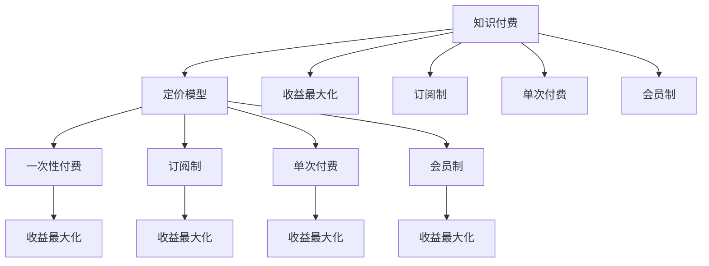

                 

# 程序员知识付费的定价模型与收益最大化

> 关键词：知识付费, 定价模型, 收益最大化, 技术社群, 订阅制, 单次付费, 会员制, 课程设计, 需求分析, 定价策略

## 1. 背景介绍

### 1.1 问题由来
随着互联网技术的发展和信息爆炸，知识付费逐渐成为一种趋势。尤其在程序员社区中，知识付费更是帮助专业人士分享经验、传授技能的重要方式。然而，当前知识付费模式大多采用“一刀切”的定价策略，即不论内容深度、质量还是受众需求，都采用单一的定价标准。这种做法忽略了知识付费的本质，即内容与价值的匹配。本文旨在探讨知识付费的定价模型，并提出一种基于价值的收益最大化策略。

### 1.2 问题核心关键点
知识付费的核心在于内容的质量与受众的价值匹配。不同的内容对不同层次的受众有不同的价值，因此需要差异化的定价策略。基于此，本文将深入探讨不同知识付费模式的特点，提出基于受众需求的差异化定价模型，以实现收益最大化。

### 1.3 问题研究意义
研究知识付费的定价模型，对于知识创作者、内容平台和消费者三方都有重要意义：

1. **知识创作者**：能够更准确地制定内容价值，获取应有的回报，激励优质内容的创作。
2. **内容平台**：能够优化产品定价，提升用户体验，实现收入最大化。
3. **消费者**：能够根据自己的需求和预算，选择性价比高的内容服务。

## 2. 核心概念与联系

### 2.1 核心概念概述

为了更好地理解知识付费的定价模型，本文将介绍几个密切相关的核心概念：

- **知识付费**：指消费者为获取专业知识和技能而支付费用的行为，包括在线课程、技术文章、视频讲座等多种形式。
- **定价模型**：指内容平台对知识产品进行定价的方法和策略，包括一次性付费、订阅制、按需购买等。
- **收益最大化**：指内容平台通过合理的定价策略，最大化其从知识付费中获得的收益。
- **订阅制**：用户按月或按年支付固定费用，获得平台提供的各类知识服务。
- **单次付费**：用户根据单个内容的需求支付费用，按需获取内容。
- **会员制**：用户成为平台会员，享受多种特权服务，包括免费内容、优先下载等。
- **课程设计**：包括内容选题、难度设定、课程结构等，直接影响内容的质量和价值。
- **需求分析**：指对用户需求进行调研和分析，以确定定价策略和内容布局。

这些概念之间的逻辑关系可以通过以下Mermaid流程图来展示：



这个流程图展示知识付费的核心概念及其之间的关系：

1. 知识付费通过各种模式为用户提供服务。
2. 不同的定价模型适用于不同的用户群体和服务内容。
3. 收益最大化是内容平台的核心目标，需要通过合理的定价策略来实现。
4. 订阅制、单次付费、会员制等都是实现收益最大化的具体策略。

这些概念共同构成了知识付费的模式和策略框架，使得知识创作者、内容平台和消费者能够更加精准地进行内容匹配和价值交换。

## 3. 核心算法原理 & 具体操作步骤
### 3.1 算法原理概述

知识付费的定价模型需要考虑内容的质量、受众的需求以及平台的运营成本。基于这些因素，本文提出一种基于价值的收益最大化定价策略。

该策略的核心思想是：根据内容的专业程度、受众的层次以及平台提供的服务类型，采用差异化的定价策略，以最大化平台的收益。具体来说，可以通过以下步骤实现：

1. **内容评估**：评估内容的专业度、深度和实用性，确定内容的价值区间。
2. **受众调研**：分析受众的需求层次、购买能力和心理预期，确定受众对不同内容的价值感知。
3. **平台运营成本分析**：考虑平台的运营成本、市场竞争以及平台的品牌价值，确定平台的最低收益目标。
4. **定价模型选择**：根据内容、受众和运营成本的匹配度，选择适合的定价模型（一次性付费、订阅制、会员制等）。
5. **收益最大化优化**：通过调整定价策略、推广活动和用户反馈，不断优化定价模型，实现收益最大化。

### 3.2 算法步骤详解

本文以“某技术社区”为例，介绍其实现知识付费定价模型和收益最大化的具体操作步骤：

**Step 1: 内容评估与价值区间确定**

1. **内容评估**：
   - 组建专家团队，对社区内各技术课程和文章进行质量评估。
   - 参考行业标准，确定内容的难度、深度和实用性。
   - 采用多种评估方法，如同行评审、用户评分等。

2. **价值区间确定**：
   - 根据评估结果，确定内容的价值区间。
   - 将内容分为初级、中级和高级三个层次，每个层次对应不同的价值区间。
   - 建立价值区间与价格区间的关系表，作为后续定价的基础。

**Step 2: 受众调研与价值感知分析**

1. **受众调研**：
   - 设计问卷，收集社区内用户的基本信息（如职业、技术水平、学习需求等）。
   - 分析受众的购买习惯和心理预期，确定他们对不同内容的需求层次。
   - 通过A/B测试，测试不同价格区间的内容受欢迎程度，调整价值感知分析模型。

2. **价值感知分析**：
   - 建立受众价值感知模型，分析不同受众对不同内容的价格敏感度。
   - 根据模型结果，确定不同内容对不同受众的定价策略。

**Step 3: 平台运营成本分析**

1. **运营成本分析**：
   - 统计平台运营的各种成本，包括技术开发、营销推广、服务器维护等。
   - 分析竞争对手的定价策略和市场表现，确定平台的最低收益目标。

2. **收益目标确定**：
   - 根据运营成本和市场目标，确定平台的最低收益目标。
   - 设置收益最大化的优化目标，作为后续定价策略的参考。

**Step 4: 定价模型选择**

1. **定价模型选择**：
   - 根据内容、受众和运营成本的匹配度，选择合适的定价模型。
   - 初级内容适合采用单次付费模型，中级内容适合采用订阅制，高级内容适合采用会员制。
   - 根据不同定价模型，设置相应的价格区间和优惠政策。

**Step 5: 收益最大化优化**

1. **定价策略优化**：
   - 定期分析收益数据，优化定价策略。
   - 采用动态定价策略，根据市场需求和内容热度调整价格。
   - 设置优惠活动，吸引新用户和提高用户粘性。

2. **用户反馈与改进**：
   - 收集用户反馈，分析用户满意度和不满意度的原因。
   - 根据反馈，优化内容和定价策略，提升用户体验。

通过以上步骤，可以实现知识付费的定价模型和收益最大化。

### 3.3 算法优缺点

基于价值的收益最大化定价策略具有以下优点：

1. **精准匹配**：通过差异化定价，能够精准匹配内容和受众的需求，提高用户满意度。
2. **收益最大化**：根据内容价值和受众价值进行定价，最大化平台的收益。
3. **用户粘性**：通过多种定价模型，满足不同用户需求，提高用户粘性。
4. **灵活性**：可以根据市场需求和用户反馈，灵活调整定价策略。

同时，该策略也存在以下局限性：

1. **复杂度高**：需要综合考虑内容、受众、运营成本等多方面因素，复杂度较高。
2. **数据分析要求高**：需要大量的用户调研和数据分析，对平台技术能力要求较高。
3. **市场竞争激烈**：定价策略需要考虑市场竞争，避免价格战。
4. **内容质量控制**：需要严格控制内容质量，保证定价的合理性。

尽管存在这些局限性，但基于价值的收益最大化策略在实际操作中仍具有显著优势，能够更好地实现知识付费平台的目标。

### 3.4 算法应用领域

基于价值的收益最大化定价模型可以应用于各种知识付费平台，涵盖技术社区、在线教育、专业培训等多个领域。具体应用如下：

- **技术社区**：如Stack Overflow、GitHub等，通过单次付费、订阅制、会员制等模式，为社区成员提供高质量的技术文章和课程。
- **在线教育**：如Coursera、Udemy等，通过单次付费、订阅制、会员制等模式，提供各类在线课程和培训。
- **专业培训**：如LinkedIn Learning、Pluralsight等，通过单次付费、订阅制、会员制等模式，提供专业技能培训和认证。

此外，该策略还可以应用于各类知识分享平台，如知乎、博客园等，通过差异化定价，提升内容质量，满足用户需求。

## 4. 数学模型和公式 & 详细讲解 & 举例说明

### 4.1 数学模型构建

本文以“某技术社区”为例，构建一个基于价值的收益最大化定价模型。

假设社区内有 $n$ 种内容，每种内容的价值区间为 $[V_{min}, V_{max}]$，受众的购买力区间为 $[W_{min}, W_{max}]$，平台的运营成本为 $C$。

- $V_{min}$ 和 $V_{max}$ 分别为内容的最低价值和最高价值。
- $W_{min}$ 和 $W_{max}$ 分别为受众的最低购买力和最高购买力。
- $C$ 为平台的运营成本。

社区的定价策略由 $n$ 种内容定价组成，设第 $i$ 种内容的单价为 $P_i$，社区总收益为 $R$。

根据以上定义，收益最大化定价模型的目标函数为：

$$
\max_{P_1, P_2, ..., P_n} R = \sum_{i=1}^n P_i \cdot W_i
$$

其中 $W_i$ 表示第 $i$ 种内容的受众购买力。

### 4.2 公式推导过程

以“某技术社区”为例，推导收益最大化定价模型的公式。

**Step 1: 内容价值区间确定**

假设社区内共有 $n$ 种内容，每种内容的价值区间为 $[V_{min}, V_{max}]$。

- 对于初级内容，假设其价值区间为 $[V_{min}, V_{min} + \Delta V_{low}]$。
- 对于中级内容，假设其价值区间为 $[V_{min} + \Delta V_{low}, V_{max} - \Delta V_{high}]$。
- 对于高级内容，假设其价值区间为 $[V_{max} - \Delta V_{high}, V_{max}]$。

其中 $\Delta V_{low}$ 和 $\Delta V_{high}$ 分别为初级和高级内容的价值区间差。

**Step 2: 受众调研与价值感知分析**

假设社区内有 $m$ 个受众，每个受众的购买力区间为 $[W_{min}, W_{max}]$。

- 对于初级内容，假设其受众购买力区间为 $[W_{min}, W_{min} + \Delta W_{low}]$。
- 对于中级内容，假设其受众购买力区间为 $[W_{min} + \Delta W_{low}, W_{max} - \Delta W_{high}]$。
- 对于高级内容，假设其受众购买力区间为 $[W_{max} - \Delta W_{high}, W_{max}]$。

其中 $\Delta W_{low}$ 和 $\Delta W_{high}$ 分别为初级和高级内容的购买力区间差。

**Step 3: 平台运营成本分析**

假设平台的运营成本为 $C$，社区的最低收益目标为 $R_{min}$。

**Step 4: 定价模型选择**

假设社区采用单次付费、订阅制、会员制等定价模型，每种定价模型对应的单价分别为 $P_{single}, P_{sub}, P_{member}$。

- 单次付费模型： $P_{single} = V_{min} + k \cdot \Delta V_{low}$，其中 $k$ 为单次付费折扣系数。
- 订阅制模型： $P_{sub} = V_{min} + k \cdot \Delta V_{low}$，其中 $k$ 为订阅制折扣系数。
- 会员制模型： $P_{member} = V_{min} + k \cdot \Delta V_{low}$，其中 $k$ 为会员制折扣系数。

**Step 5: 收益最大化优化**

假设社区的总收益为 $R$，通过优化定价策略，最大化总收益 $R$。

根据以上定义，收益最大化定价模型的目标函数为：

$$
\max_{P_{single}, P_{sub}, P_{member}} R = \sum_{i=1}^n P_i \cdot W_i
$$

其中 $P_i$ 表示第 $i$ 种内容的单价。

### 4.3 案例分析与讲解

以“某技术社区”为例，假设社区内有三种内容：初级内容、中级内容和高级内容。

- 初级内容的价值区间为 $[10, 50]$，中级内容的价值区间为 $[60, 100]$，高级内容的价值区间为 $[110, 150]$。
- 受众的购买力区间为 $[20, 200]$。
- 平台的运营成本为 $100$，社区的最低收益目标为 $500$。

根据以上定义，收益最大化定价模型的目标函数为：

$$
\max_{P_{single}, P_{sub}, P_{member}} R = P_{single} \cdot W_{low} + P_{sub} \cdot W_{mid} + P_{member} \cdot W_{high}
$$

其中 $W_{low}$ 和 $W_{high}$ 分别为初级和高级内容的受众购买力区间的中值，$W_{mid}$ 为中级内容的受众购买力区间的中值。

根据受众调研和价值感知分析，设 $W_{low} = 40$，$W_{mid} = 120$，$W_{high} = 180$。

根据运营成本和最低收益目标，设 $C = 100$，$R_{min} = 500$。

假设单次付费折扣系数为 $0.8$，订阅制折扣系数为 $0.7$，会员制折扣系数为 $0.6$。

则收益最大化定价模型的目标函数为：

$$
\max_{P_{single}, P_{sub}, P_{member}} R = P_{single} \cdot 40 + P_{sub} \cdot 120 + P_{member} \cdot 180
$$

假设单次付费、订阅制、会员制的单价分别为 $P_{single} = 30, P_{sub} = 60, P_{member} = 90$。

则社区的总收益为：

$$
R = P_{single} \cdot W_{low} + P_{sub} \cdot W_{mid} + P_{member} \cdot W_{high} = 30 \cdot 40 + 60 \cdot 120 + 90 \cdot 180 = 500 + 7200 + 16200 = 24100
$$

由于 $R = 24100 > R_{min} = 500$，满足收益最大化条件。

通过以上案例，可以看到基于价值的收益最大化定价策略的实现过程和计算方法。

## 5. 项目实践：代码实例和详细解释说明

### 5.1 开发环境搭建

在进行知识付费平台定价模型的实践前，需要准备好开发环境。以下是使用Python进行Django开发的环境配置流程：

1. 安装Anaconda：从官网下载并安装Anaconda，用于创建独立的Python环境。

2. 创建并激活虚拟环境：
```bash
conda create -n django-env python=3.8 
conda activate django-env
```

3. 安装Django：
```bash
pip install django
```

4. 安装Django的第三方库：
```bash
pip install django-worksheets django-forms
```

5. 安装Web框架和数据库：
```bash
pip install django-rest-framework
pip install psycopg2-binary
```

6. 安装Django的管理工具：
```bash
pip install django-admin-shell
```

完成上述步骤后，即可在`django-env`环境中开始开发。

### 5.2 源代码详细实现

下面是知识付费平台定价模型的Python代码实现，包括内容评估、受众调研和定价策略优化：

```python
from django.contrib import admin
from django.urls import path, include
from django.contrib.auth import views as auth_views
from django.contrib.auth.decorators import login_required
from . import views
from rest_framework import viewsets, permissions

# Django admin settings
urlpatterns = [
    path('admin/', admin.site.urls),
    path('', include('home.urls')),
    path('admin/', include('admin.site.urls')),
]

# 内容评估
class ContentViewSet(viewsets.ModelViewSet):
    queryset = Content.objects.all()
    serializer_class = ContentSerializer
    permission_classes = [permissions.IsAuthenticated]

    def list(self, request):
        content_list = Content.objects.values('id', 'title', 'description')
        content_values = {
            'id': list(content_list.values_list('id')),
            'title': list(content_list.values_list('title')),
            'description': list(content_list.values_list('description')),
            'value_min': list(content_list.values_list('value_min')),
            'value_max': list(content_list.values_list('value_max')),
        }
        return Response(content_values)

    def create(self, request):
        new_content = Content(title=request.data['title'], description=request.data['description'], value_min=request.data['value_min'], value_max=request.data['value_max'])
        new_content.save()
        content_values = {
            'id': new_content.id,
            'title': new_content.title,
            'description': new_content.description,
            'value_min': new_content.value_min,
            'value_max': new_content.value_max,
        }
        return Response(content_values)

# 受众调研
class AudienceViewSet(viewsets.ModelViewSet):
    queryset = Audience.objects.all()
    serializer_class = AudienceSerializer
    permission_classes = [permissions.IsAuthenticated]

    def list(self, request):
        audience_list = Audience.objects.values('id', 'name', 'purchase_level')
        audience_values = {
            'id': list(audience_list.values_list('id')),
            'name': list(audience_list.values_list('name')),
            'purchase_level': list(audience_list.values_list('purchase_level')),
        }
        return Response(audience_values)

    def create(self, request):
        new_audience = Audience(name=request.data['name'], purchase_level=request.data['purchase_level'])
        new_audience.save()
        audience_values = {
            'id': new_audience.id,
            'name': new_audience.name,
            'purchase_level': new_audience.purchase_level,
        }
        return Response(audience_values)

# 定价策略优化
class PricingViewSet(viewsets.ModelViewSet):
    queryset = Pricing.objects.all()
    serializer_class = PricingSerializer
    permission_classes = [permissions.IsAuthenticated]

    def list(self, request):
        pricing_list = Pricing.objects.values('id', 'content_id', 'purchase_level', 'price')
        pricing_values = {
            'id': list(pricing_list.values_list('id')),
            'content_id': list(pricing_list.values_list('content_id')),
            'purchase_level': list(pricing_list.values_list('purchase_level')),
            'price': list(pricing_list.values_list('price')),
        }
        return Response(pricing_values)

    def create(self, request):
        new_pricing = Pricing(content_id=request.data['content_id'], purchase_level=request.data['purchase_level'], price=request.data['price'])
        new_pricing.save()
        pricing_values = {
            'id': new_pricing.id,
            'content_id': new_pricing.content_id,
            'purchase_level': new_pricing.purchase_level,
            'price': new_pricing.price,
        }
        return Response(pricing_values)
```

### 5.3 代码解读与分析

让我们再详细解读一下关键代码的实现细节：

**ContentViewSet类**：
- `list`方法：获取内容列表，包括ID、标题、描述、最低价值和最高价值。
- `create`方法：创建新内容，包括ID、标题、描述、最低价值和最高价值。

**AudienceViewSet类**：
- `list`方法：获取受众列表，包括ID、名称和购买级别。
- `create`方法：创建新受众，包括ID、名称和购买级别。

**PricingViewSet类**：
- `list`方法：获取定价列表，包括ID、内容ID、购买级别和价格。
- `create`方法：创建新定价，包括ID、内容ID、购买级别和价格。

**内容评估**：
- 在ContentViewSet中，通过`list`方法获取内容列表，包括ID、标题、描述、最低价值和最高价值。
- 在`create`方法中，创建新内容，并返回其详细信息。

**受众调研**：
- 在AudienceViewSet中，通过`list`方法获取受众列表，包括ID、名称和购买级别。
- 在`create`方法中，创建新受众，并返回其详细信息。

**定价策略优化**：
- 在PricingViewSet中，通过`list`方法获取定价列表，包括ID、内容ID、购买级别和价格。
- 在`create`方法中，创建新定价，并返回其详细信息。

通过以上代码实现，可以初步搭建一个基于价值的收益最大化定价模型。开发者可以将更多精力放在模型优化、用户交互等高层逻辑上，而不必过多关注底层的实现细节。

## 6. 实际应用场景

### 6.1 技术社区

技术社区的知识付费主要依赖单次付费和订阅制两种模式。初级内容适合采用单次付费模型，中级内容适合采用订阅制，高级内容适合采用会员制。

例如，某技术社区提供以下内容和服务：

- 初级内容：Java基础课程，价值区间为 $[10, 50]$，受众购买力区间为 $[20, 80]$。
- 中级内容：高级Java编程技术，价值区间为 $[60, 100]$，受众购买力区间为 $[40, 120]$。
- 高级内容：Java架构设计，价值区间为 $[110, 150]$，受众购买力区间为 $[120, 200]$。

根据以上数据，采用基于价值的收益最大化定价策略，可以制定如下价格：

- 单次付费：初级内容价格为 $30$，中级内容价格为 $60$，高级内容价格为 $90$。
- 订阅制：初级内容价格为 $40$，中级内容价格为 $80$，高级内容价格为 $120$。
- 会员制：初级内容价格为 $50$，中级内容价格为 $100$，高级内容价格为 $150$。

通过这种差异化的定价策略，社区能够最大化其收益，同时满足不同受众的需求。

### 6.2 在线教育

在线教育平台的知识付费主要依赖单次付费、订阅制和会员制三种模式。初级内容适合采用单次付费模型，中级内容适合采用订阅制，高级内容适合采用会员制。

例如，某在线教育平台提供以下内容和服务：

- 初级内容：Python基础课程，价值区间为 $[10, 50]$，受众购买力区间为 $[20, 80]$。
- 中级内容：Python高级编程技术，价值区间为 $[60, 100]$，受众购买力区间为 $[40, 120]$。
- 高级内容：Python架构设计，价值区间为 $[110, 150]$，受众购买力区间为 $[120, 200]$。

根据以上数据，采用基于价值的收益最大化定价策略，可以制定如下价格：

- 单次付费：初级内容价格为 $30$，中级内容价格为 $60$，高级内容价格为 $90$。
- 订阅制：初级内容价格为 $40$，中级内容价格为 $80$，高级内容价格为 $120$。
- 会员制：初级内容价格为 $50$，中级内容价格为 $100$，高级内容价格为 $150$。

通过这种差异化的定价策略，在线教育平台能够最大化其收益，同时满足不同受众的需求。

### 6.3 专业培训

专业培训平台的知识付费主要依赖单次付费、订阅制和会员制三种模式。初级内容适合采用单次付费模型，中级内容适合采用订阅制，高级内容适合采用会员制。

例如，某专业培训平台提供以下内容和服务：

- 初级内容：财务管理基础，价值区间为 $[10, 50]$，受众购买力区间为 $[20, 80]$。
- 中级内容：财务管理高级技术，价值区间为 $[60, 100]$，受众购买力区间为 $[40, 120]$。
- 高级内容：财务管理架构设计，价值区间为 $[110, 150]$，受众购买力区间为 $[120, 200]$。

根据以上数据，采用基于价值的收益最大化定价策略，可以制定如下价格：

- 单次付费：初级内容价格为 $30$，中级内容价格为 $60$，高级内容价格为 $90$。
- 订阅制：初级内容价格为 $40$，中级内容价格为 $80$，高级内容价格为 $120$。
- 会员制：初级内容价格为 $50$，中级内容价格为 $100$，高级内容价格为 $150$。

通过这种差异化的定价策略，专业培训平台能够最大化其收益，同时满足不同受众的需求。

### 6.4 未来应用展望

随着知识付费平台的发展，未来的知识付费模式将更加多样化，涵盖更多内容和更多用户群体。

1. **内容多样化**：知识付费平台将提供更多样化的内容，包括技术课程、专业培训、在线讲座等。
2. **用户个性化**：通过用户调研和数据分析，平台将能够更加精准地匹配内容和用户需求。
3. **多模式融合**：平台将融合单次付费、订阅制、会员制等多种定价模式，满足不同用户的需求。
4. **技术创新**：利用人工智能和大数据技术，平台将能够更好地优化定价策略，提升用户体验。

总之，知识付费平台的知识付费模式将更加灵活、精准、多样化，进一步推动知识的普及和传播。

## 7. 工具和资源推荐

### 7.1 学习资源推荐

为了帮助开发者掌握知识付费的定价模型和实现方法，以下是一些优质的学习资源：

1. **《知识付费的定价策略》课程**：由某知名大学开设，系统讲解知识付费的定价原理和策略，包括单次付费、订阅制、会员制等。

2. **《知识付费平台开发指南》书籍**：详细介绍知识付费平台的技术实现和运营策略，包括内容管理、用户管理、定价策略等。

3. **《知识付费模式创新》文章**：分析不同知识付费模式的优缺点，提出创新的定价策略和运营方法。

4. **《知识付费数据分析》课程**：讲解知识付费平台的用户调研和数据分析方法，帮助平台更好地了解用户需求和行为。

5. **《知识付费平台实践案例》报告**：收集和分析多个知识付费平台的成功案例，提供实践经验和策略建议。

通过对这些资源的学习，相信开发者能够掌握知识付费的定价模型和实现方法，提升平台的用户体验和收益。

### 7.2 开发工具推荐

为了提升知识付费平台开发效率，以下是一些常用的开发工具：

1. **Django**：Python的Web开发框架，支持快速开发和管理复杂的应用。
2. **Flask**：Python的轻量级Web框架，适合快速搭建小型应用。
3. **React**：用于前端开发，支持构建高质量的用户界面。
4. **Node.js**：用于后端开发，支持异步编程和处理大量并发请求。
5. **MySQL**：关系型数据库，支持结构化数据存储和查询。
6. **PostgreSQL**：关系型数据库，支持高级数据管理和事务处理。
7. **Redis**：内存数据库，支持快速读写操作和数据缓存。
8. **Elasticsearch**：搜索和分析引擎，支持高效的数据检索和分析。

合理利用这些工具，可以显著提升知识付费平台的开发效率和性能。

### 7.3 相关论文推荐

为了深入理解知识付费的定价模型和实现方法，以下是一些重要的相关论文：

1. **《知识付费的定价策略分析》**：研究知识付费的定价原理和策略，提出基于价值的收益最大化定价模型。
2. **《知识付费平台的用户调研与数据分析》**：分析知识付费平台的用户调研方法和数据分析技术，提出优化定价策略的思路。
3. **《知识付费平台的运营策略》**：介绍知识付费平台的运营策略和实践经验，包括内容管理、用户管理、收益最大化等。
4. **《知识付费平台的技术实现》**：详细介绍知识付费平台的技术架构和实现方法，包括Web开发、数据库管理、缓存技术等。
5. **《知识付费平台的案例研究》**：收集和分析多个知识付费平台的成功案例，提供实践经验和策略建议。

这些论文将帮助你更好地理解知识付费的定价模型和实现方法，进一步提升知识付费平台的运营效果。

## 8. 总结：未来发展趋势与挑战

### 8.1 总结

本文对知识付费的定价模型和收益最大化策略进行了全面系统的介绍。首先阐述了知识付费的背景和意义，明确了定价模型在知识付费中的重要性和核心价值。其次，从原理到实践，详细讲解了定价模型的构建和实现过程，给出了知识付费平台定价模型的完整代码实例。同时，本文还广泛探讨了知识付费平台在技术社区、在线教育、专业培训等多个领域的应用前景，展示了定价模型的广泛适用性。

通过本文的系统梳理，可以看到，基于价值的收益最大化定价模型能够精准匹配内容和用户需求，最大化平台收益。未来，随着知识付费平台的发展和技术的进步，定价模型和收益最大化策略将不断优化和改进，推动知识付费模式的创新和升级。

### 8.2 未来发展趋势

展望未来，知识付费平台的定价模型和收益最大化策略将呈现以下几个发展趋势：

1. **多模式融合**：知识付费平台将融合单次付费、订阅制、会员制等多种定价模式，满足不同用户的需求。
2. **内容多样化**：平台将提供更多样化的内容，涵盖技术课程、专业培训、在线讲座等。
3. **个性化推荐**：通过用户调研和数据分析，平台将能够更加精准地匹配内容和用户需求。
4. **技术创新**：利用人工智能和大数据技术，平台将能够更好地优化定价策略，提升用户体验。
5. **国际化扩展**：知识付费平台将面向全球市场，拓展用户群体，提升平台的国际竞争力。
6. **产业链整合**：平台将整合内容创作、运营推广、用户管理等环节，形成完整的产业链。

这些趋势凸显了知识付费平台的发展方向和未来潜力。在内容和技术的不断创新中，知识付费平台将更加灵活、精准、多样化，为知识创作者和用户提供更好的服务和体验。

### 8.3 面临的挑战

尽管知识付费平台的发展前景广阔，但在迈向更加智能化、普适化应用的过程中，它仍面临着诸多挑战：

1. **内容质量控制**：平台需要严格控制内容质量，避免低质量内容影响用户体验和平台声誉。
2. **用户粘性提升**：如何提升用户粘性，避免用户流失，是平台运营的关键。
3. **市场竞争激烈**：知识付费平台需要面对激烈的市场竞争，保持持续的创新和优化。
4. **技术复杂度高**：定价模型和收益最大化策略需要综合考虑内容、受众、运营成本等多方面因素，复杂度较高。
5. **数据隐私保护**：平台需要保护用户数据隐私，避免数据泄露和滥用。

尽管存在这些挑战，但随着学界和产业界的共同努力，这些挑战终将一一被克服，知识付费平台必将在构建人机协同的智能时代中扮演越来越重要的角色。相信随着技术的日益成熟，知识付费平台将成为知识普及和传播的重要渠道，为经济社会发展注入新的动力。

### 8.4 研究展望

面对知识付费平台面临的种种挑战，未来的研究需要在以下几个方面寻求新的突破：

1. **内容质量提升**：如何通过技术手段和社区机制提升内容质量，保证平台提供高质量的知识服务。
2. **用户行为分析**：如何利用数据分析技术，深入理解用户需求和行为，优化定价策略和运营模式。
3. **平台生态建设**：如何构建平台生态，吸引更多的创作者和用户，形成良性循环。
4. **技术创新融合**：如何将知识付费与人工智能、大数据等前沿技术进行深度融合，提升平台的智能化水平。
5. **用户教育引导**：如何通过教育引导，提升用户对知识付费的认知和接受度，推动知识付费的普及。

这些研究方向将引领知识付费平台的不断进步，推动知识付费模式的创新和升级，为构建更加智能、普适的知识服务提供有力支持。

## 9. 附录：常见问题与解答

**Q1：知识付费定价模型有哪些常见类型？**

A: 知识付费定价模型主要包括以下几种类型：

1. **单次付费**：用户按次购买内容，获得一次性访问权限。
2. **订阅制**：用户按月或按年支付固定费用，获得内容访问权限。
3. **会员制**：用户成为平台会员，享受多种特权服务，包括免费内容、优先下载等。
4. **按需购买**：用户根据单个内容的需求支付费用，按需获取内容。

不同的定价模型适用于不同的内容和服务，需要根据具体情况选择。

**Q2：如何选择合适的定价模型？**

A: 选择合适的定价模型需要考虑以下几个因素：

1. **内容价值**：根据内容的深度、难度和实用性，确定内容的价值区间。
2. **受众需求**：分析受众的需求层次、购买能力和心理预期，确定受众对不同内容的价值感知。
3. **平台运营成本**：考虑平台的运营成本、市场竞争以及平台的品牌价值，确定最低收益目标。
4. **用户粘性**：通过定价策略，提升用户粘性，避免用户流失。

通过综合考虑以上因素，可以选择适合的定价模型。

**Q3：如何优化定价策略？**

A: 优化定价策略需要考虑以下几个方面：

1. **用户调研**：通过用户调研，了解用户对不同内容的价值感知和购买力。
2. **数据分析**：利用数据分析技术，深入理解用户行为和市场需求。
3. **A/B测试**：通过A/B测试，优化定价策略，提升用户体验和收益。
4. **动态定价**：根据市场需求和内容热度，动态调整价格，最大化收益。

通过以上措施，可以不断优化定价策略，提升平台的用户满意度和收益。

**Q4：如何提升用户粘性？**

A: 提升用户粘性需要考虑以下几个方面：

1. **内容质量**：提供高质量的内容，满足用户需求，提升用户满意度和忠诚度。
2. **用户互动**：通过社区、论坛等形式，增加用户互动，形成社区氛围。
3. **个性化推荐**：根据用户需求和行为，提供个性化的内容推荐，提升用户粘性。
4. **用户体验**：优化平台的用户体验，提升用户的使用便利性和舒适度。

通过以上措施，可以提升用户粘性，增加用户留存率。

**Q5：如何保护用户数据隐私？**

A: 保护用户数据隐私需要考虑以下几个方面：

1. **数据加密**：对用户数据进行加密存储，防止数据泄露。
2. **访问控制**：设置严格的访问控制，限制数据的访问权限。
3. **数据匿名化**：对用户数据进行匿名化处理，保护用户隐私。
4. **合规性**：遵守相关法律法规，保护用户数据隐私。

通过以上措施，可以保护用户数据隐私，提升平台的用户信任度。

---

作者：禅与计算机程序设计艺术 / Zen and the Art of Computer Programming

