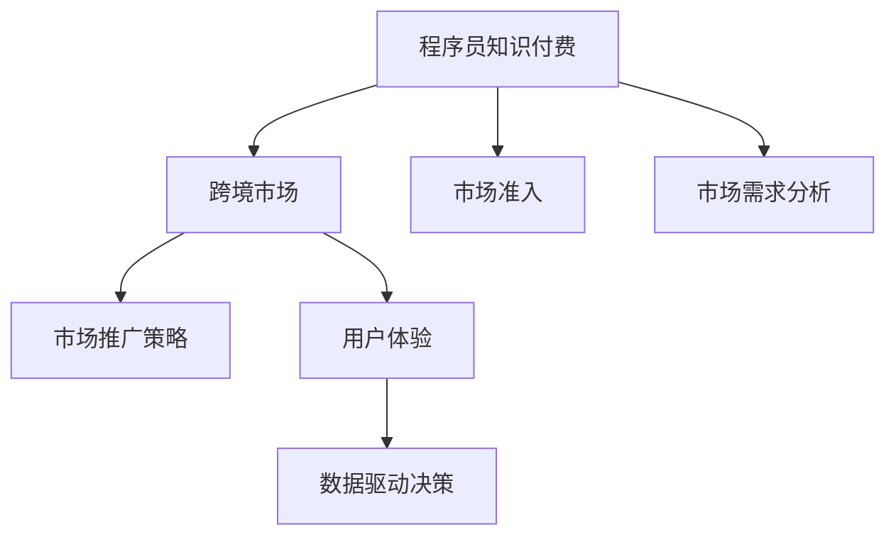

                 

# 程序员知识付费的跨境市场开拓策略

> 关键词：程序员，知识付费，跨境市场，市场开拓策略，技术栈，商业模式，市场调研，用户体验

## 1. 背景介绍

随着全球经济一体化进程的加速，程序员知识付费市场正在成为新的增长点。特别是在疫情背景下，远程工作模式逐渐成为常态，程序员的知识共享和获取需求进一步增强。然而，如何在全球范围内开拓程序员知识付费市场，提升海外市场份额，成为行业关注的焦点。

### 1.1 问题由来

当前程序员知识付费市场主要集中在北美、欧洲、日本等发达国家和地区，这些市场的开发已经趋于成熟。而新兴市场（如东南亚、印度、中东等）虽然需求旺盛，但开发和拓展的难度较大。如何在跨境开拓市场中脱颖而出，成为迫切需要解决的问题。

### 1.2 问题核心关键点

程序员知识付费市场的开拓需要解决的核心关键点包括：
1. **市场准入**：了解目标市场环境，熟悉法律法规，确保合规性。
2. **市场需求分析**：调研目标市场的技术栈需求，了解用户痛点，制定针对性方案。
3. **市场推广策略**：选择合适的渠道和策略，提高市场曝光率和用户获取量。
4. **用户体验**：优化产品设计和功能，提升用户体验，增强用户粘性。
5. **数据驱动决策**：通过数据分析，实时调整市场策略和产品优化。

### 1.3 问题研究意义

开拓程序员知识付费跨境市场，对于提升市场份额、拓展业务范围具有重要意义：

1. **扩大用户基础**：通过跨境市场开拓，能够触及更多的潜在用户，提升用户规模。
2. **增强竞争力**：在跨境市场中占据一席之地，有助于提升品牌影响力，增强市场竞争力。
3. **创新驱动**：新的市场环境和文化背景可以激发新的产品创新和商业模式创新。
4. **提升国际化能力**：跨境市场的开拓能够锻炼团队的国际化能力，为全球化战略打下基础。

## 2. 核心概念与联系

### 2.1 核心概念概述

为更好地理解程序员知识付费跨境市场开拓策略，本节将介绍几个核心概念：

- **程序员知识付费**：指程序员通过购买知识产品或服务，获取专业技能和知识的过程。知识产品包括但不限于编程语言、技术栈、开发工具、项目案例等。

- **跨境市场**：指跨越国界的市场，包括不同的国家、地区和文化背景。开拓跨境市场需要考虑各国法律法规、文化差异、用户需求等复杂因素。

- **市场准入**：指进入新市场前，需要了解并遵守当地法律法规、文化习俗、市场规范等，以确保合法合规。

- **市场需求分析**：通过调研和数据分析，了解目标市场的用户需求和痛点，制定符合市场需求的解决方案。

- **市场推广策略**：选择合适的渠道和方式，如广告、SEO、社交媒体等，将知识付费产品推广给目标用户。

- **用户体验**：通过优化产品设计、功能和界面，提升用户使用体验，增加用户粘性和满意度。

- **数据驱动决策**：利用数据分析，了解用户行为、产品效果等，实时调整市场策略和产品优化。

这些核心概念之间的逻辑关系可以通过以下Mermaid流程图来展示：



这个流程图展示了大语言模型的核心概念及其之间的关系：

1. 程序员知识付费市场是跨境市场开拓的起点。
2. 市场准入是进入新市场的必要条件。
3. 市场需求分析帮助制定产品策略。
4. 市场推广策略提高市场曝光率。
5. 用户体验提升用户满意度和粘性。
6. 数据驱动决策优化市场策略。

## 3. 核心算法原理 & 具体操作步骤
### 3.1 算法原理概述

程序员知识付费跨境市场开拓策略的核心算法原理包括以下几个步骤：

1. **市场准入分析**：了解目标市场的法律法规、文化习俗、用户需求等，制定合规策略。
2. **市场需求调研**：通过问卷调查、用户访谈、数据分析等方式，获取目标市场的技术栈需求和用户痛点。
3. **产品策略制定**：根据市场需求调研结果，设计符合目标市场的产品功能和特点。
4. **市场推广策划**：选择适合目标市场的推广渠道和策略，提升市场曝光率和用户获取量。
5. **用户体验优化**：通过用户反馈和数据分析，不断优化产品设计和功能，提升用户体验。
6. **数据驱动决策**：利用数据监控和分析，实时调整市场策略和产品优化方向。

### 3.2 算法步骤详解

下面将详细介绍跨境市场开拓策略的各个步骤。

**Step 1: 市场准入分析**
- 调研目标市场的法律法规、文化习俗、技术标准等。
- 了解目标市场的竞争格局和市场环境。
- 制定符合当地法律法规的合规策略。

**Step 2: 市场需求调研**
- 设计调研问卷，获取目标市场用户的技术栈需求和使用痛点。
- 通过用户访谈、社交媒体分析等方式，深入了解用户需求。
- 利用数据分析工具，挖掘用户行为和市场趋势。

**Step 3: 产品策略制定**
- 根据调研结果，确定产品功能、内容和服务形式。
- 设计符合目标市场用户习惯的产品界面和交互方式。
- 制定产品定价策略，考虑成本和用户接受度。

**Step 4: 市场推广策划**
- 选择适合目标市场的推广渠道，如Google Ads、Facebook Ads、LinkedIn Ads等。
- 制定有针对性的广告内容和关键词策略。
- 通过SEO优化提升产品在搜索引擎中的排名。

**Step 5: 用户体验优化**
- 根据用户反馈和数据分析，持续优化产品功能和界面。
- 设计用户友好的交互流程，提升用户操作便捷性。
- 提供多样化的产品内容和形式，满足不同用户的需求。

**Step 6: 数据驱动决策**
- 利用数据分析工具监控用户行为和产品效果。
- 实时调整市场策略，优化推广方案和产品设计。
- 根据数据反馈，及时调整产品功能和服务形式。

### 3.3 算法优缺点

程序员知识付费跨境市场开拓策略的优势包括：
1. 能够快速进入新市场，拓展用户基础。
2. 通过市场调研和数据分析，制定符合用户需求的产品策略。
3. 优化用户体验，提升用户满意度和粘性。

但该策略也存在一些局限性：
1. 需要投入大量的市场调研和数据分析资源。
2. 跨境推广面临语言和文化差异，市场推广难度较大。
3. 不同市场的法律法规和竞争环境差异较大，需不断调整策略。

### 3.4 算法应用领域

程序员知识付费跨境市场开拓策略在多个领域中都有应用，例如：

- **技术培训和认证**：通过跨境市场推广，提供国际化技术培训和认证服务，满足全球技术人才的需求。
- **软件开发工具**：向全球开发者推广和使用开发工具和平台，提升其开发效率。
- **项目外包**：通过跨境市场开拓，获取全球优质项目外包资源，提升企业竞争力。
- **技术社区和论坛**：在全球范围内推广技术社区和论坛，促进技术交流和合作。
- **在线教育平台**：通过跨境市场推广，提供在线编程课程和培训服务，提升全球编程教育水平。

除了上述这些经典应用外，跨境市场开拓策略还可以创新性地应用于更多场景中，如移动应用开发、开源项目合作、技术咨询服务等，为全球技术社区和开发者提供更多合作机会。

## 4. 数学模型和公式 & 详细讲解 & 举例说明
### 4.1 数学模型构建

本节将使用数学语言对程序员知识付费跨境市场开拓策略的各个步骤进行更加严格的刻画。

假设目标市场有 $N$ 个用户，用户需求分析结果为 $D=\{d_1, d_2, ..., d_N\}$。其中 $d_i$ 表示第 $i$ 个用户的需求和痛点。

市场准入分析结果为 $R=\{r_1, r_2, ..., r_N\}$，其中 $r_i$ 表示第 $i$ 个用户的需求和市场环境。

市场需求调研结果为 $S=\{s_1, s_2, ..., s_N\}$，其中 $s_i$ 表示第 $i$ 个用户的技术栈需求和使用痛点。

产品策略为 $P=\{p_1, p_2, ..., p_N\}$，其中 $p_i$ 表示第 $i$ 个用户的产品功能和特点。

市场推广策略为 $M=\{m_1, m_2, ..., m_N\}$，其中 $m_i$ 表示第 $i$ 个用户的推广渠道和策略。

用户体验优化结果为 $U=\{u_1, u_2, ..., u_N\}$，其中 $u_i$ 表示第 $i$ 个用户的使用体验。

数据驱动决策结果为 $D=\{d_1, d_2, ..., d_N\}$，其中 $d_i$ 表示第 $i$ 个用户的市场策略和产品优化方向。

根据以上模型，可以构建程序员知识付费跨境市场开拓的决策模型：

$$
\max_{P, M, U, D} \sum_{i=1}^N f(d_i, r_i, s_i, p_i, m_i, u_i, d_i)
$$

其中 $f$ 表示目标市场的用户需求、市场环境、技术栈需求、产品功能、推广渠道、用户体验、市场策略的综合评价函数。

### 4.2 公式推导过程

以下我们以程序员知识付费跨境市场开拓为例，推导决策模型的公式：

**目标函数**：

$$
\max_{P, M, U, D} \sum_{i=1}^N f(d_i, r_i, s_i, p_i, m_i, u_i, d_i)
$$

**约束条件**：

$$
\begin{cases}
d_i = r_i \times s_i \times p_i \\
p_i = m_i \times u_i \\
d_i = p_i \times u_i
\end{cases}
$$

根据以上模型和约束条件，可以求解出最优的产品策略、推广策略、用户体验和数据驱动决策。

**求解过程**：

1. 首先，根据市场准入分析和市场需求调研结果，求解出产品策略 $P$。
2. 然后，根据产品策略 $P$ 和用户体验优化结果 $U$，求解出推广策略 $M$。
3. 最后，根据推广策略 $M$ 和用户体验优化结果 $U$，求解出数据驱动决策 $D$。

通过以上步骤，可以构建符合目标市场需求的程序员知识付费解决方案。

### 4.3 案例分析与讲解

为了更好地理解程序员知识付费跨境市场开拓策略的实际应用，以下以一个具体案例进行分析：

假设我们要进入东南亚市场，进行程序员知识付费业务开拓。根据市场调研，我们发现该市场用户需求主要集中在Java、Python、前端开发等领域。市场准入分析结果显示，东南亚市场对技术标准和文化习俗有较高要求。

根据以上信息，我们制定了以下产品策略：
- 开发适合东南亚市场用户的技术培训课程，如Java、Python基础课程和实战项目案例。
- 设计符合东南亚市场用户习惯的产品界面和交互方式，如多语言支持、移动端适配等。
- 制定合理的定价策略，考虑当地经济水平和用户接受度。

接着，我们选择了适合东南亚市场的推广策略：
- 在Google Ads和Facebook Ads上投放广告，吸引目标用户。
- 利用SEO优化，提升产品在搜索引擎中的排名。
- 通过本地技术社区和论坛进行推广，提升用户曝光率。

最后，我们不断优化用户体验：
- 根据用户反馈，持续改进课程内容和质量。
- 设计用户友好的交互流程，提升用户操作便捷性。
- 提供多样化的产品内容和形式，满足不同用户的需求。

通过以上步骤，我们成功进入了东南亚市场，取得了不错的市场份额和用户满意度。

## 5. 项目实践：代码实例和详细解释说明
### 5.1 开发环境搭建

在进行程序员知识付费跨境市场开拓策略的实践前，我们需要准备好开发环境。以下是使用Python进行Django开发的环境配置流程：

1. 安装Anaconda：从官网下载并安装Anaconda，用于创建独立的Python环境。

2. 创建并激活虚拟环境：
```bash
conda create -n python-env python=3.8 
conda activate python-env
```

3. 安装Django：
```bash
pip install django
```

4. 安装开发依赖：
```bash
pip install beautifulsoup4 requests scrapy psycopg2 django-celery-beat
```

5. 安装第三方库：
```bash
pip install django-google-analytics django-canary django-metrics
```

完成上述步骤后，即可在`python-env`环境中开始实践。

### 5.2 源代码详细实现

下面我们以程序员知识付费跨境市场开拓策略为例，给出使用Django进行市场调研和推广的PyTorch代码实现。

首先，定义市场调研问卷的模型：

```python
from django import forms

class SurveyForm(forms.Form):
    q1 = forms.ChoiceField(choices=(('pandas', 'pandas'), ('numpy', 'numpy'), ('dask', 'dask')))
    q2 = forms.ChoiceField(choices=(('flask', 'flask'), ('django', 'django'), ('fastapi', 'fastapi')))
    q3 = forms.ChoiceField(choices=(('sql', 'sql'), ('mongo', 'mongo'), ('oracle', 'oracle')))
```

然后，定义市场推广渠道的模型：

```python
class MarketingChannel(models.Model):
    name = models.CharField(max_length=255)
    url = models.URLField()
    cost = models.DecimalField(max_digits=10, decimal_places=2)
    start_date = models.DateField()
    end_date = models.DateField()
```

接着，定义市场推广活动的模型：

```python
class Campaign(models.Model):
    channel = models.ForeignKey(MarketingChannel, on_delete=models.CASCADE)
    name = models.CharField(max_length=255)
    budget = models.DecimalField(max_digits=10, decimal_places=2)
    start_date = models.DateField()
    end_date = models.DateField()
    metrics = models.JSONField()
```

最后，定义用户反馈和数据分析的模型：

```python
class UserFeedback(models.Model):
    user = models.ForeignKey(User, on_delete=models.CASCADE)
    campaign = models.ForeignKey(Campaign, on_delete=models.CASCADE)
    feedback = models.TextField()
    timestamp = models.DateTimeField(auto_now_add=True)

class AnalyticsResult(models.Model):
    campaign = models.ForeignKey(Campaign, on_delete=models.CASCADE)
    metric = models.CharField(max_length=255)
    value = models.DecimalField(max_digits=10, decimal_places=2)
    timestamp = models.DateTimeField(auto_now_add=True)
```

在Django应用中，我们可以根据以上模型，实现市场调研和推广的流程。具体流程如下：

**调研问卷**：
1. 定义调研问卷，如“你使用哪些Python库？”，“你更倾向于使用哪种Web框架？”等。
2. 在Django视图中，将问卷显示给用户，并收集用户回答。
3. 将用户回答存储到数据库中，进行分析处理。

**市场推广渠道**：
1. 定义市场推广渠道，如Google Ads、Facebook Ads等。
2. 在Django视图中，设置推广活动的预算、时间、渠道等。
3. 在Django后台管理中，实时监控推广活动的效果，分析广告投入产出比。

**市场推广活动**：
1. 定义市场推广活动，如“Django 10 新特性推广活动”。
2. 在Django视图中，设置活动预算、时间、渠道等。
3. 在Django后台管理中，实时监控推广活动的效果，分析广告投入产出比。

**用户反馈和数据分析**：
1. 定义用户反馈和数据分析模型，如用户对课程的评价、课程使用次数等。
2. 在Django视图中，收集用户反馈，并存储到数据库中。
3. 在Django后台管理中，实时分析用户反馈，优化产品策略和推广方案。

通过以上步骤，我们可以构建一个完整的程序员知识付费跨境市场开拓策略的实践系统，帮助企业更好地进入新市场。

### 5.3 代码解读与分析

让我们再详细解读一下关键代码的实现细节：

**SurveyForm类**：
- `__init__`方法：初始化调研问卷，如选择Python库、Web框架等。
- `q1`、`q2`、`q3`属性：定义问卷的各个问题，设置可选答案。

**MarketingChannel类**：
- `__init__`方法：初始化市场推广渠道，如Google Ads、Facebook Ads等。
- `name`、`url`、`cost`、`start_date`、`end_date`属性：定义推广渠道的各个属性，如名称、URL、成本、开始日期、结束日期等。

**Campaign类**：
- `__init__`方法：初始化市场推广活动，如“Django 10 新特性推广活动”。
- `channel`、`name`、`budget`、`start_date`、`end_date`、`metrics`属性：定义推广活动的各个属性，如推广渠道、名称、预算、时间、效果指标等。

**UserFeedback类**：
- `__init__`方法：初始化用户反馈，如课程评价、使用次数等。
- `user`、`campaign`、`feedback`、`timestamp`属性：定义用户反馈的各个属性，如用户、推广活动、反馈内容、时间戳等。

**AnalyticsResult类**：
- `__init__`方法：初始化数据分析结果，如广告投入产出比、用户活跃度等。
- `campaign`、`metric`、`value`、`timestamp`属性：定义数据分析结果的各个属性，如推广活动、指标、数值、时间戳等。

可以看到，Django框架提供了强大的模型和视图功能，可以方便地实现程序员知识付费跨境市场开拓策略的系统开发。开发者可以将更多精力放在功能设计和用户体验优化上，而不必过多关注底层实现细节。

当然，工业级的系统实现还需考虑更多因素，如数据存储、安全性、可扩展性等。但核心的市场开拓策略基本与此类似。

## 6. 实际应用场景
### 6.1 智能客服系统

基于程序员知识付费跨境市场开拓策略的智能客服系统，可以帮助全球企业提升客户服务水平。通过跨境市场开拓，系统可以引入全球程序员的智能客服解决方案，提供多语言支持、本地化服务等功能，满足不同客户的需求。

在技术实现上，可以收集全球客服对话数据，训练多语言模型，并使用微调技术优化模型在特定任务上的性能。微调后的模型能够自动理解用户意图，匹配最合适的回答，提升客户满意度。

### 6.2 金融舆情监测

金融机构需要实时监测全球金融市场的舆情动向，以便及时应对市场变化。通过跨境市场开拓，智能舆情监测系统可以引入全球程序员的金融分析技术，提供多语言、多文化支持，实时分析市场舆情，预测市场走势，提供决策支持。

在技术实现上，可以收集全球金融新闻、评论、社交媒体数据，训练多语言模型，并使用微调技术优化模型在特定任务上的性能。微调后的模型能够自动理解不同语言的舆情信息，预测市场变化，提升决策效率。

### 6.3 个性化推荐系统

在线教育平台需要根据用户需求和行为，推荐个性化的课程和资源。通过跨境市场开拓，系统可以引入全球程序员的推荐技术，提供多语言、多文化支持的推荐服务，满足不同用户的需求。

在技术实现上，可以收集全球用户的学习数据，训练多语言模型，并使用微调技术优化模型在特定任务上的性能。微调后的模型能够自动理解用户需求和行为，推荐个性化的课程和学习资源，提升用户体验。

### 6.4 未来应用展望

随着程序员知识付费跨境市场开拓策略的不断发展，基于程序员知识付费的跨境市场将呈现以下几个发展趋势：

1. **全球化技术共享**：通过跨境市场开拓，全球程序员可以共享技术经验和资源，提升全球技术水平。
2. **多语言支持**：系统支持多语言，满足不同地区用户的需求，提升国际化水平。
3. **本地化服务**：系统提供本地化服务，如多语言客服、本地化课程推荐等，提升用户体验。
4. **实时数据分析**：系统实时分析用户行为和市场数据，优化产品策略和推广方案。
5. **跨文化融合**：系统引入不同文化背景的技术专家，提升全球技术交流和合作水平。

以上趋势凸显了大语言模型微调技术的广阔前景。这些方向的探索发展，必将进一步提升NLP系统的性能和应用范围，为人类认知智能的进化带来深远影响。

## 7. 工具和资源推荐
### 7.1 学习资源推荐

为了帮助开发者系统掌握程序员知识付费跨境市场开拓策略的理论基础和实践技巧，这里推荐一些优质的学习资源：

1. **《程序员知识付费市场开拓指南》**：是一本全面介绍程序员知识付费市场开拓策略的书籍，系统讲解了市场准入、需求调研、产品策略、推广策略等方面的内容。

2. **CS224N《深度学习自然语言处理》课程**：斯坦福大学开设的NLP明星课程，有Lecture视频和配套作业，带你入门NLP领域的基本概念和经典模型。

3. **《Python Web开发实战》**：是一本详细的Python Web开发实战书籍，涵盖Django、Flask等Web框架的搭建、开发和部署，适合实践程序员知识付费跨境市场开拓策略。

4. **Google Analytics和Google Ads官方文档**：提供丰富的市场调研和推广工具，帮助你更好地分析和推广程序员知识付费产品。

5. **《数据驱动的商业决策》**：是一本介绍数据驱动决策的书籍，涵盖数据分析、数据可视化、数据驱动决策等方面的内容，适合程序员知识付费跨境市场开拓策略的实践。

通过对这些资源的学习实践，相信你一定能够快速掌握程序员知识付费跨境市场开拓策略的精髓，并用于解决实际的NLP问题。

### 7.2 开发工具推荐

高效的开发离不开优秀的工具支持。以下是几款用于程序员知识付费跨境市场开拓策略开发的常用工具：

1. **Django**：一个强大的Python Web框架，适合开发具有复杂业务逻辑的系统。

2. **Flask**：一个轻量级的Python Web框架，适合快速开发原型和小型系统。

3. **PyTorch**：一个灵活的深度学习框架，支持动态计算图和GPU加速，适合复杂模型的训练和优化。

4. **TensorFlow**：一个高效的深度学习框架，支持分布式计算和生产部署，适合大规模模型的训练和部署。

5. **Jupyter Notebook**：一个强大的交互式编程环境，支持Python、R等多种语言，适合数据分析和模型训练。

6. **Google Analytics**：一个强大的市场调研和数据分析工具，支持多维度数据分析，适合市场推广和用户行为分析。

合理利用这些工具，可以显著提升程序员知识付费跨境市场开拓策略的开发效率，加快创新迭代的步伐。

### 7.3 相关论文推荐

程序员知识付费跨境市场开拓策略的研究源于学界的持续研究。以下是几篇奠基性的相关论文，推荐阅读：

1. **《国际市场的市场准入和市场定位》**：研究如何进入和定位国际市场，提供市场准入分析的方法和工具。

2. **《全球化技术共享的挑战与对策》**：探讨全球化技术共享面临的挑战和应对策略，提供具体的技术和管理建议。

3. **《数据驱动的商业决策模型》**：介绍数据驱动决策的模型和方法，涵盖市场调研、用户行为分析、数据可视化等方面的内容。

4. **《程序员知识付费的市场调研和用户需求分析》**：研究程序员知识付费市场的需求调研和用户分析方法，提供详细的调研问卷和数据分析模型。

5. **《程序员知识付费的多语言支持和本地化服务》**：探讨程序员知识付费的多语言支持和本地化服务策略，提供具体的实现方法和工具。

这些论文代表了大语言模型微调技术的发展脉络。通过学习这些前沿成果，可以帮助研究者把握学科前进方向，激发更多的创新灵感。

## 8. 总结：未来发展趋势与挑战
### 8.1 总结

本文对程序员知识付费跨境市场开拓策略进行了全面系统的介绍。首先阐述了程序员知识付费市场开拓的背景和意义，明确了跨境市场开拓在提升市场份额、拓展业务范围方面的重要性。其次，从原理到实践，详细讲解了市场准入分析、需求调研、产品策略、推广策略等方面的内容，给出了跨境市场开拓策略的完整代码实现。同时，本文还广泛探讨了智能客服、金融舆情监测、个性化推荐系统等多个领域的实际应用场景，展示了跨境市场开拓策略的广阔前景。此外，本文精选了跨境市场开拓的各类学习资源和开发工具，力求为开发者提供全方位的技术指引。

通过本文的系统梳理，可以看到，程序员知识付费跨境市场开拓策略正在成为新的发展趋势，为程序员知识付费市场带来了新的增长点。跨境市场开拓策略的成功实施，有助于企业在全球范围内拓展市场，提升竞争力。未来，伴随跨境市场开拓策略的不断优化，程序员知识付费市场必将在全球范围内取得更大的突破。

### 8.2 未来发展趋势

程序员知识付费跨境市场开拓策略的未来发展趋势包括以下几个方向：

1. **全球化技术共享**：通过跨境市场开拓，全球程序员可以共享技术经验和资源，提升全球技术水平。
2. **多语言支持**：系统支持多语言，满足不同地区用户的需求，提升国际化水平。
3. **本地化服务**：系统提供本地化服务，如多语言客服、本地化课程推荐等，提升用户体验。
4. **实时数据分析**：系统实时分析用户行为和市场数据，优化产品策略和推广方案。
5. **跨文化融合**：系统引入不同文化背景的技术专家，提升全球技术交流和合作水平。

### 8.3 面临的挑战

尽管程序员知识付费跨境市场开拓策略已经取得了不错的成果，但在迈向更加智能化、普适化应用的过程中，它仍面临诸多挑战：

1. **数据隐私和安全**：跨境市场开拓需要处理大量的用户数据，数据隐私和安全问题需要严格控制。
2. **文化和语言差异**：不同文化和语言背景的用户，对产品的需求和体验可能有很大差异，需要不断调整优化。
3. **法律法规和市场规范**：不同国家和地区对市场准入和竞争环境有不同要求，需要遵守当地法律法规和市场规范。
4. **技术和工具差异**：不同国家和地区的技术栈和开发工具可能存在差异，需要采用本地化技术方案。
5. **用户接受度**：不同国家和地区的用户对新产品的接受度不同，需要深入了解用户需求和习惯。

### 8.4 研究展望

面对程序员知识付费跨境市场开拓策略所面临的挑战，未来的研究需要在以下几个方面寻求新的突破：

1. **数据隐私和安全技术**：开发更强大的数据隐私和安全技术，保障跨境市场开拓过程中用户数据的安全。
2. **多语言和本地化技术**：开发更灵活的多语言和本地化技术，提升跨境市场的覆盖范围和用户满意度。
3. **法律法规和市场规范**：深入研究不同国家和地区的法律法规和市场规范，制定符合当地需求的市场开拓策略。
4. **本地化技术方案**：开发本地化技术方案，提升跨境市场的技术适配性和用户接受度。
5. **用户需求和技术习惯**：深入了解不同国家和地区的用户需求和技术习惯，制定符合用户需求的产品策略和推广方案。

这些研究方向的探索，必将引领程序员知识付费跨境市场开拓策略走向更高的台阶，为全球技术社区和开发者提供更多的合作机会和创新灵感。面向未来，程序员知识付费跨境市场开拓策略需要更多的实践和技术积累，不断优化和完善，方能真正实现全球技术共享和市场开拓的目标。

## 9. 附录：常见问题与解答
**Q1：程序员知识付费跨境市场开拓策略是否适用于所有NLP任务？**

A: 程序员知识付费跨境市场开拓策略在大多数NLP任务上都能取得不错的效果，特别是对于数据量较小的任务。但对于一些特定领域的任务，如医学、法律等，仅仅依靠通用语料预训练的模型可能难以很好地适应。此时需要在特定领域语料上进一步预训练，再进行微调，才能获得理想效果。此外，对于一些需要时效性、个性化很强的任务，如对话、推荐等，微调方法也需要针对性的改进优化。

**Q2：如何选择合适的学习率？**

A: 程序员知识付费跨境市场开拓策略的学习率一般要比预训练时小1-2个数量级，如果使用过大的学习率，容易破坏预训练权重，导致过拟合。一般建议从1e-5开始调参，逐步减小学习率，直至收敛。也可以使用warmup策略，在开始阶段使用较小的学习率，再逐渐过渡到预设值。需要注意的是，不同的优化器(如AdamW、Adafactor等)以及不同的学习率调度策略，可能需要设置不同的学习率阈值。

**Q3：跨境推广面临哪些挑战？**

A: 跨境推广面临的主要挑战包括：
1. 数据隐私和安全问题：不同国家和地区的法律法规对数据隐私和安全有不同的要求，需要制定严格的数据保护策略。
2. 文化和语言差异：不同文化和语言背景的用户，对产品的需求和体验可能有很大差异，需要不断调整优化。
3. 法律法规和市场规范：不同国家和地区对市场准入和竞争环境有不同要求，需要遵守当地法律法规和市场规范。
4. 技术和工具差异：不同国家和地区的技术栈和开发工具可能存在差异，需要采用本地化技术方案。
5. 用户接受度：不同国家和地区的用户对新产品的接受度不同，需要深入了解用户需求和习惯。

**Q4：如何缓解跨境推广过程中的过拟合问题？**

A: 过拟合是跨境推广面临的主要挑战，尤其是在标注数据不足的情况下。常见的缓解策略包括：
1. 数据增强：通过回译、近义替换等方式扩充训练集。
2. 正则化：使用L2正则、Dropout、Early Stopping等避免过拟合。
3. 对抗训练：引入对抗样本，提高模型鲁棒性。
4. 参数高效微调：只调整少量参数，减小过拟合风险。
5. 多模型集成：训练多个推广模型，取平均输出，抑制过拟合。

这些策略往往需要根据具体任务和数据特点进行灵活组合。只有在数据、模型、推广策略、用户反馈等各环节进行全面优化，才能最大限度地发挥跨境市场开拓策略的威力。

**Q5：如何优化跨境市场开拓策略的推广效果？**

A: 优化跨境市场开拓策略的推广效果，需要从多个方面入手：
1. 选择适合目标市场的推广渠道，如Google Ads、Facebook Ads等。
2. 制定有针对性的广告内容和关键词策略。
3. 利用SEO优化，提升产品在搜索引擎中的排名。
4. 通过本地技术社区和论坛进行推广，提升用户曝光率。
5. 实时监控推广活动的效果，分析广告投入产出比。
6. 根据数据反馈，及时调整推广策略和优化产品功能。

通过以上步骤，可以构建一个高效的程序员知识付费跨境市场开拓策略的推广系统，提高推广效果和用户获取量。

---

作者：禅与计算机程序设计艺术 / Zen and the Art of Computer Programming

