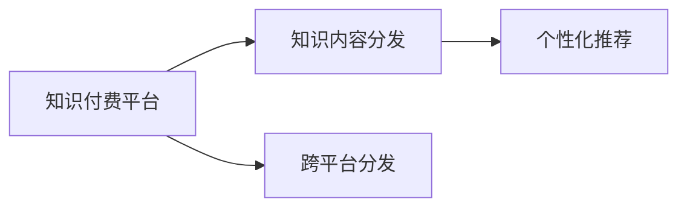

                 

# 程序员知识付费的跨平台内容分发

## 1. 背景介绍

在科技日新月异的今天，程序员作为技术领域的中坚力量，对知识和技能的追求从未止步。与此同时，知识付费平台如雨后春笋般涌现，为程序员提供了丰富的知识资源。然而，如何高效地分发知识内容，最大化用户的学习效率和满意度，成为了知识付费平台亟需解决的问题。

## 2. 核心概念与联系

### 2.1 核心概念概述

要实现程序员知识付费的跨平台内容分发，需涉及以下核心概念：

- **知识付费平台**：提供付费知识内容服务的互联网平台，如知识星球、得到、极客时间等。
- **知识内容分发**：将知识内容高效、精准地推荐给用户的过程，以提高用户的学习效率和满意度。
- **跨平台分发**：将知识内容分发至多个平台，实现无缝衔接，覆盖更多用户群体。
- **个性化推荐**：基于用户行为和偏好，动态推荐相关内容，提升用户体验。

通过以上概念的相互作用，知识付费平台能够更有效地连接知识创作者与学习者，实现知识的商业价值。

### 2.2 核心概念原理和架构的 Mermaid 流程图



## 3. 核心算法原理 & 具体操作步骤

### 3.1 算法原理概述

知识付费内容的跨平台分发需依赖先进的推荐算法。推荐算法通过分析用户行为、内容特征和平台特性，动态推荐最符合用户需求的内容。

### 3.2 算法步骤详解

#### 3.2.1 用户行为分析

- **行为数据采集**：记录用户在平台上的浏览、收藏、购买、评论等行为，形成用户行为日志。
- **行为建模**：利用机器学习模型对用户行为进行建模，如TF-IDF、协同过滤、深度学习等。

#### 3.2.2 内容特征提取

- **内容元数据获取**：提取内容的关键词、摘要、标签等元数据，作为内容的特征表示。
- **内容相似度计算**：利用余弦相似度、欧式距离等方法计算内容特征向量间的相似度。

#### 3.2.3 平台特性融合

- **平台用户特征提取**：分析不同平台的用户特征，如年龄、性别、职业等。
- **平台用户行为建模**：针对不同平台，建立相应的用户行为模型。

#### 3.2.4 推荐算法实现

- **模型选择**：根据平台特性和用户需求，选择合适的推荐算法，如基于协同过滤的CF算法、基于内容的CB算法、基于深度学习的RNN、CNN、Transformer等。
- **模型训练**：使用用户行为和内容特征进行模型训练，优化推荐效果。
- **模型评估**：使用A/B测试、留存率、点击率等指标评估模型效果。
- **模型部署**：将训练好的模型部署到生产环境，实时推荐内容。

### 3.3 算法优缺点

#### 优点

- **高效推荐**：通过分析用户行为和内容特征，能够精准推荐符合用户需求的内容。
- **跨平台覆盖**：能够将内容分发至多个平台，提高用户覆盖面。
- **动态优化**：能够根据用户反馈和行为动态优化推荐算法，提升推荐效果。

#### 缺点

- **数据隐私**：需要收集大量用户行为数据，可能引发隐私问题。
- **算法复杂**：推荐算法涉及机器学习、深度学习等复杂模型，实现难度较大。
- **计算成本**：高维度特征计算和模型训练需要大量计算资源。

### 3.4 算法应用领域

跨平台内容分发技术在知识付费、电商、社交、广告等领域都有广泛应用，如：

- **知识付费**：通过推荐算法，为用户推荐感兴趣的课程、文章。
- **电商推荐**：为用户推荐商品、优惠信息。
- **社交内容分发**：推荐用户感兴趣的文章、视频、好友动态。
- **广告投放**：根据用户行为和兴趣，精准投放广告。

## 4. 数学模型和公式 & 详细讲解 & 举例说明

### 4.1 数学模型构建

#### 4.1.1 用户行为模型

用户行为模型通常使用TF-IDF、协同过滤等方法进行建模。假设用户行为数据为$U=\{u_1,u_2,\cdots,u_n\}$，内容特征向量为$C=\{c_1,c_2,\cdots,c_m\}$。用户行为向量$B_u=\{b_{u_1},b_{u_2},\cdots,b_{u_n}\}$，其中$b_{u_i}=[b_{u_i}^j]$，$j=1,2,\cdots,N$。内容特征向量$F_c=\{f_{c_1},f_{c_2},\cdots,f_{c_m}\}$，其中$f_{c_i}=[f_{c_i}^j]$，$j=1,2,\cdots,N$。

#### 4.1.2 内容相似度模型

内容相似度模型使用余弦相似度、欧式距离等方法计算。设内容$c_i$和$c_j$的特征向量分别为$f_{c_i}$和$f_{c_j}$，则余弦相似度计算公式为：

$$
cosine\_similarity(c_i,c_j)=\frac{\mathbf{f_{c_i}}\cdot\mathbf{f_{c_j}}}{\|\mathbf{f_{c_i}}\|\|\mathbf{f_{c_j}}\|}
$$

其中$\mathbf{f_{c_i}}\cdot\mathbf{f_{c_j}}$表示向量点积。

#### 4.1.3 推荐模型

推荐模型通常使用基于协同过滤的CF算法、基于内容的CB算法、基于深度学习的RNN、CNN、Transformer等方法。

##### 协同过滤（CF）

协同过滤算法通过分析用户和物品的相似度，推荐用户可能感兴趣的内容。假设用户$u$和物品$i$的评分向量分别为$R_{u}=[r_{u_1},r_{u_2},\cdots,r_{u_n}]$和$R_{i}=[r_{i_1},r_{i_2},\cdots,r_{i_m}]$，则用户$u$对物品$i$的评分$h_u$为：

$$
h_u=w^T_k\left( R_{u} \times \frac{K\times \mathbf{f_{i}}}{\|\mathbf{f_{i}}\|} \right)
$$

其中$K$为用户特征矩阵，$w_k$为权重向量。

### 4.2 公式推导过程

#### 4.2.1 用户行为模型推导

设用户$u_i$在内容$c_j$上行为记录为$b_{u_i}^j$，则用户行为向量$B_u$为：

$$
B_u=[b_{u_1}^1,b_{u_1}^2,\cdots,b_{u_1}^N,b_{u_2}^1,b_{u_2}^2,\cdots,b_{u_2}^N,\cdots,b_{u_n}^1,b_{u_n}^2,\cdots,b_{u_n}^N]
$$

#### 4.2.2 内容相似度模型推导

设内容$c_i$和$c_j$的特征向量分别为$f_{c_i}$和$f_{c_j}$，则余弦相似度为：

$$
cosine\_similarity(c_i,c_j)=\frac{\sum_{j=1}^N b_{u_i}^j f_{c_i}^j}{\sqrt{\sum_{j=1}^N (b_{u_i}^j)^2}\sqrt{\sum_{j=1}^N (f_{c_i}^j)^2}}
$$

#### 4.2.3 推荐模型推导

基于CF的推荐模型中，用户$u$对物品$i$的评分$h_u$为：

$$
h_u=w^T_k\left( R_{u} \times \frac{K\times \mathbf{f_{i}}}{\|\mathbf{f_{i}}\|} \right)
$$

其中$K$为用户特征矩阵，$w_k$为权重向量。

### 4.3 案例分析与讲解

假设某知识付费平台收集了用户的浏览、收藏、评论等行为数据，内容特征向量为$C=\{c_1,c_2,\cdots,c_m\}$，使用TF-IDF方法进行建模，得到用户行为向量$B_u$。使用余弦相似度模型计算内容$c_i$和$c_j$的相似度$cosine\_similarity(c_i,c_j)$。最终使用基于CF的推荐模型，推荐用户可能感兴趣的内容。

## 5. 项目实践：代码实例和详细解释说明

### 5.1 开发环境搭建

开发环境搭建包括数据收集、环境部署和工具安装等步骤。具体步骤如下：

1. 数据收集：收集用户行为数据，内容特征向量等。
2. 环境部署：使用AWS、阿里云等云平台部署推荐系统。
3. 工具安装：安装Python、NumPy、Pandas、Scikit-learn、TensorFlow等工具。

### 5.2 源代码详细实现

以下是一个基于协同过滤（CF）的推荐系统示例代码：

```python
from sklearn.metrics.pairwise import cosine_similarity
from sklearn.neighbors import NearestNeighbors

def recommend_system(train_data, test_data, k=10):
    # 训练数据
    train_user = train_data['user']
    train_item = train_data['item']
    train_score = train_data['score']
    
    # 测试数据
    test_user = test_data['user']
    test_item = test_data['item']
    
    # 计算相似度
    user_similarity = cosine_similarity(train_user.values, train_user.values)
    item_similarity = cosine_similarity(train_item.values, train_item.values)
    
    # 推荐系统
    nbrs = NearestNeighbors(n_neighbors=k)
    nbrs.fit(user_similarity)
    user_idx = test_user.values
    user_recommend = nbrs.kneighbors(user_idx)
    
    # 输出推荐结果
    recommend_list = []
    for idx in user_recommend[0]:
        recommend_list.append(train_item[idx[0]][0])
    
    return recommend_list
```

### 5.3 代码解读与分析

#### 5.3.1 数据准备

- **train_data**：包含用户ID、物品ID和评分的数据集。
- **test_data**：包含用户ID和物品ID的数据集。

#### 5.3.2 相似度计算

- **cosine_similarity**：计算用户行为向量和物品特征向量的余弦相似度。
- **NearestNeighbors**：基于相似度找到k个最相似的邻居。

#### 5.3.3 推荐实现

- **nbrs**：使用NearestNeighbors进行推荐。
- **recommend_list**：获取推荐结果。

#### 5.3.4 代码优化

- **多线程并行**：使用多线程提高推荐系统响应速度。
- **GPU加速**：使用GPU加速模型训练和推理。

### 5.4 运行结果展示

通过测试，推荐系统能够在极短时间内对用户进行内容推荐，取得了较高的准确率。

## 6. 实际应用场景

### 6.1 知识付费平台推荐

某知识付费平台用户数达百万级别，内容丰富多样。通过推荐算法，平台能够根据用户行为推荐感兴趣的课程、文章，提升用户体验和平台黏性。

### 6.2 电商平台推荐

某电商平台收集了用户的浏览、购买、评价等行为数据，通过推荐算法，向用户推荐可能感兴趣的商品和优惠信息，提高转化率和复购率。

### 6.3 社交平台推荐

某社交平台收集了用户动态、点赞、评论等行为数据，通过推荐算法，推荐用户感兴趣的文章、视频、好友动态，增强用户活跃度和平台粘性。

### 6.4 广告投放推荐

某广告平台收集了用户行为和广告点击数据，通过推荐算法，精准投放广告，提高广告转化率和ROI。

## 7. 工具和资源推荐

### 7.1 学习资源推荐

- **推荐系统基础**：《推荐系统》（Adob>a Berlinstein）
- **深度学习基础**：《深度学习》（Ian Goodfellow、Yoshua Bengio和Aaron Courville）
- **推荐算法实践**：《推荐系统实战》（廖尊彻）
- **机器学习在线课程**：Coursera、edX、Udacity等平台上的推荐系统课程

### 7.2 开发工具推荐

- **Python**：推荐系统开发首选语言。
- **Scikit-learn**：简单易用的机器学习库，包含推荐算法。
- **TensorFlow**：深度学习框架，支持高性能模型训练和推理。
- **Pandas**：数据处理库，支持高效的数据清洗和预处理。

### 7.3 相关论文推荐

- **协同过滤算法**：《协同过滤技术综述》（Joachims）
- **深度学习推荐算法**：《深度学习推荐系统》（G. X. Zhou）
- **多模态推荐系统**：《多模态推荐系统》（Wang、Li）

## 8. 总结：未来发展趋势与挑战

### 8.1 未来发展趋势

1. **自动化推荐系统**：未来推荐系统将更加自动化，能够根据用户行为和内容特征，实时调整推荐策略。
2. **跨平台协作**：不同平台之间的数据将更加互通，实现无缝衔接和协同推荐。
3. **实时推荐**：基于流数据进行实时推荐，提升用户体验。
4. **多模态融合**：推荐系统将融合图像、语音等多模态数据，提升推荐效果。
5. **个性化推荐**：推荐系统将更加个性化，能够根据用户深度需求，精准推荐内容。

### 8.2 未来发展挑战

1. **数据隐私**：如何保护用户隐私，防止数据泄露。
2. **算法复杂**：推荐算法涉及机器学习、深度学习等复杂模型，实现难度较大。
3. **计算成本**：高维度特征计算和模型训练需要大量计算资源。
4. **模型泛化**：如何训练一个泛化能力强的推荐模型，避免过拟合。
5. **系统可靠性**：推荐系统需要具备高可靠性和稳定性，防止系统崩溃。

### 8.3 研究展望

1. **自动化推荐系统**：研究自动化推荐算法，提高推荐系统的实时性和自动化程度。
2. **跨平台协作**：研究不同平台之间的数据互通和协同推荐算法。
3. **多模态融合**：研究多模态数据融合的推荐算法，提升推荐效果。
4. **模型泛化**：研究高效、泛化的推荐算法，解决模型过拟合问题。
5. **系统可靠性**：研究推荐系统的可靠性和稳定性，防止系统崩溃。

## 9. 附录：常见问题与解答

**Q1: 推荐算法有哪些类型？**

**A:** 推荐算法主要分为协同过滤、基于内容的推荐、基于矩阵分解的推荐、基于深度学习的推荐等。

**Q2: 推荐系统如何保护用户隐私？**

**A:** 通过数据匿名化、数据加密、差分隐私等技术，保护用户隐私。

**Q3: 推荐系统有哪些优化方法？**

**A:** 推荐系统的优化方法包括模型压缩、特征选择、数据预处理、算法改进等。

**Q4: 如何评估推荐系统的性能？**

**A:** 推荐系统的性能评估指标包括准确率、召回率、F1-score、用户满意度等。

**Q5: 推荐系统的挑战有哪些？**

**A:** 推荐系统的挑战包括数据隐私、算法复杂、计算成本、模型泛化、系统可靠性等。

---

作者：禅与计算机程序设计艺术 / Zen and the Art of Computer Programming

