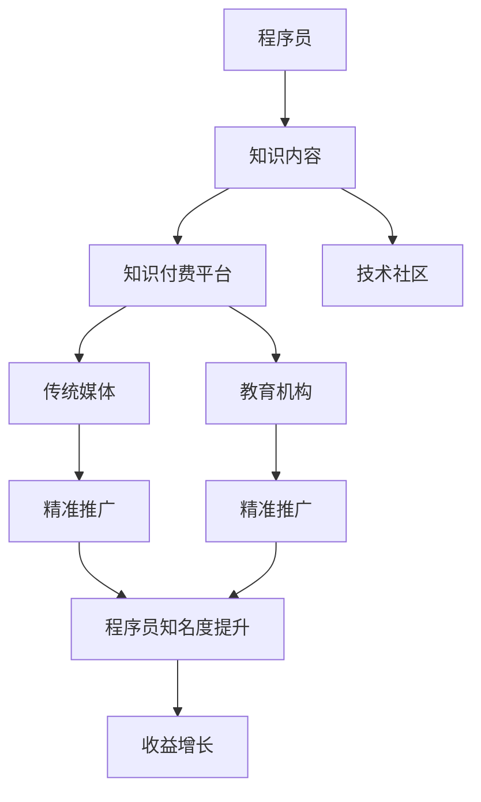

                 

# 程序员知识付费的跨界合作机会

## 1. 背景介绍

### 1.1 问题由来
随着互联网技术的飞速发展，知识付费逐渐成为一种热门趋势。程序员作为互联网技术的重要人才，不仅需要掌握编程技术，还需要持续学习和更新知识。传统的教育方式已经无法满足这一需求，知识付费平台应运而生。

然而，知识付费平台仅仅提供知识服务，并不具备推广和营销能力。很多优秀的程序员在知识付费平台上发布优质内容，却无法吸引足够的用户，从而难以获得足够的收益。而传统媒体和教育机构尽管具备较强的推广和营销能力，但缺乏对编程技术的深入理解，无法将优质内容精准地推给潜在用户。

本文旨在探讨程序员知识付费的跨界合作机会，通过引入传统媒体和教育机构的资源，帮助程序员更好地推广和营销其内容，同时也帮助这些传统机构获取编程相关的知识资源。

### 1.2 问题核心关键点
1. 程序员内容与市场需求匹配：如何找到程序员的优质内容，并推广给真正需要的用户？
2. 传统媒体与教育机构的推广能力：如何将程序员的内容精准地推广给目标用户群体？
3. 技术社区与知识付费平台的融合：如何通过技术社区构建内容生态，吸引更多的程序员参与知识付费？
4. 经济效益与品牌合作：如何实现程序员、传统媒体和教育机构的共赢？

本文将围绕这些关键点进行深入探讨，希望能为程序员和传统机构提供一些有用的合作思路。

## 2. 核心概念与联系

### 2.1 核心概念概述

1. **程序员知识付费**：程序员将自己的编程经验、技术积累、项目实战等知识通过知识付费平台出售给用户。
2. **跨界合作**：将不同领域的资源和能力进行融合，实现互利共赢的合作模式。
3. **传统媒体**：报纸、杂志、电视等传统媒体机构，具备强大的品牌影响力和推广能力。
4. **教育机构**：大学、培训机构等教育机构，拥有丰富的教育资源和用户基础。
5. **技术社区**：如GitHub、Stack Overflow等技术社区，聚集了大量程序员和技术爱好者。
6. **推广平台**：如知识付费平台（如得到、荔枝、喜马拉雅等）、社交媒体（如微博、微信、抖音等）。

这些概念之间通过以下几个关键点相联系：

1. 程序员的知识内容可以作为传统媒体和教育机构的丰富资源。
2. 传统媒体和教育机构可以借助知识付费平台和技术社区进行精准推广，提高程序员的知名度和收益。
3. 通过跨界合作，程序员、传统媒体和教育机构可以实现互利共赢。

### 2.2 核心概念原理和架构的 Mermaid 流程图(Mermaid 流程节点中不要有括号、逗号等特殊字符)



## 3. 核心算法原理 & 具体操作步骤

### 3.1 算法原理概述

跨界合作的核心在于如何实现程序员、传统媒体和教育机构的共赢。具体而言，可以通过以下几个步骤实现：

1. **资源对接**：将程序员的知识内容与传统媒体和教育机构进行对接，找到匹配的需求。
2. **内容推广**：利用传统媒体和教育机构的推广资源，将程序员的内容精准地推广给目标用户群体。
3. **知识变现**：通过知识付费平台和技术社区，帮助程序员实现内容的变现，同时扩大他们的知名度和影响力。

### 3.2 算法步骤详解

**Step 1: 资源对接**

1. 收集程序员的知识内容：可以通过GitHub、Stack Overflow等技术社区，收集程序员上传的技术文章、代码项目、视频教程等。
2. 筛选优质内容：通过社区投票、用户评价等机制，筛选出高质量、有价值的内容。
3. 与传统媒体和教育机构对接：将筛选后的内容提交给传统媒体和教育机构，寻求合作机会。

**Step 2: 内容推广**

1. 制定推广策略：根据目标用户群体的特征，制定精准的推广策略。
2. 利用传统媒体资源：通过电视节目、报纸杂志、新闻网站等传统媒体平台，推广程序员的知识内容。
3. 利用教育机构资源：通过大学公开课、在线培训课程等教育平台，推广程序员的知识内容。

**Step 3: 知识变现**

1. 建立知识付费平台：与知识付费平台合作，将程序员的内容打包出售给用户。
2. 利用技术社区平台：在技术社区（如GitHub）建立专属频道或专栏，展示程序员的最新内容。
3. 通过社交媒体推广：在微博、微信、抖音等社交媒体平台，推广程序员的知识内容和付费课程。

### 3.3 算法优缺点

**优点**

1. **提高程序员知名度**：通过传统媒体和教育机构的推广，程序员的内容能够覆盖更广泛的受众群体，提高其知名度和影响力。
2. **促进知识变现**：通过知识付费平台和技术社区，程序员的内容可以实现高效变现，获得更多的收益。
3. **资源互补**：传统媒体和教育机构具备较强的推广能力，而程序员拥有优质内容，两者可以实现资源互补，实现互利共赢。

**缺点**

1. **资源匹配难度大**：传统媒体和教育机构如何精准匹配程序员的知识内容，是一个较大的挑战。
2. **推广效果难以量化**：传统媒体和教育机构的推广效果难以量化，难以评估其对程序员知识内容的实际影响。
3. **商业模式复杂**：跨界合作涉及到多方利益，商业模式设计复杂，需要多方协调和合作。

### 3.4 算法应用领域

跨界合作的模式可以应用于以下多个领域：

1. **技术培训**：利用程序员的知识内容，为传统教育机构提供丰富、实用的编程课程。
2. **企业招聘**：利用程序员的知识内容，吸引更多的学生和企业关注，提升程序员的就业机会。
3. **技术交流**：利用程序员的知识内容，促进技术社区和传统媒体之间的交流和互动。
4. **社区建设**：利用程序员的知识内容，构建一个有影响力的技术社区，吸引更多的程序员和技术爱好者加入。

## 4. 数学模型和公式 & 详细讲解 & 举例说明（备注：数学公式请使用latex格式，latex嵌入文中独立段落使用 $$，段落内使用 $)
### 4.1 数学模型构建

假设程序员的知识内容为 $K$，传统媒体的推广能力为 $M$，教育机构的推广能力为 $E$，知识付费平台的收益为 $P$。通过跨界合作，可以实现以下数学模型：

$$ P = K \times M \times E $$

其中：
- $K$：程序员的知识内容价值。
- $M$：传统媒体的推广能力。
- $E$：教育机构的推广能力。

### 4.2 公式推导过程

通过上述模型，可以推导出以下结论：

1. 当 $K$、$M$ 或 $E$ 中任意一项为零时，$P$ 为零。这说明跨界合作中的任何一个环节都不能缺失。
2. $P$ 的值受 $K$、$M$ 和 $E$ 的影响。当 $K$、$M$ 和 $E$ 都为正值时，$P$ 为正数，表示跨界合作能够带来正收益。
3. 如果 $M$ 和 $E$ 的系数大于 $K$ 的系数，说明推广能力对收益的影响更大。此时，需要重点提升推广能力。

### 4.3 案例分析与讲解

**案例1：技术培训**

1. **资源对接**：某知名技术社区与传统媒体合作，邀请多位知名程序员在电视节目中介绍编程技巧和最佳实践。
2. **内容推广**：传统媒体通过电视节目和网络平台推广这些程序员的内容，吸引了大量观众关注。
3. **知识变现**：该技术社区通过知识付费平台出售相关课程，获得丰厚收益。

**案例2：企业招聘**

1. **资源对接**：某知名教育机构与程序员合作，在公开课中介绍企业招聘需求和编程技巧。
2. **内容推广**：教育机构通过在线平台和社交媒体推广这些课程，吸引大量学生和企业关注。
3. **知识变现**：教育机构通过知识付费平台出售课程，同时帮助程序员获得更多就业机会。

## 5. 项目实践：代码实例和详细解释说明
### 5.1 开发环境搭建

在进行跨界合作项目实践前，需要准备好开发环境。以下是使用Python进行跨界合作项目开发的流程：

1. 安装Python：从官网下载并安装Python 3.x版本。
2. 安装Django：通过命令行安装Django框架，用于搭建知识付费平台。
3. 安装TensorFlow：通过命令行安装TensorFlow库，用于处理数据分析和模型训练。
4. 安装Flask：通过命令行安装Flask框架，用于搭建技术社区。
5. 安装相关库：安装其他需要的库，如NumPy、Pandas、requests等。

完成上述步骤后，即可在开发环境中进行项目实践。

### 5.2 源代码详细实现

以下是使用Python实现跨界合作的示例代码：

```python
# 导入相关库
import requests
import pandas as pd
from django.http import JsonResponse

# 知识内容对接
def get_knowledge_content():
    # 从技术社区（如GitHub）获取程序员上传的内容
    response = requests.get('https://api.github.com/repos/username/knowledge-content')
    content = response.json()
    return content

# 内容推广
def promote_content(content):
    # 利用传统媒体资源进行推广
    # 假设传统媒体的推广能力为M
    # 利用教育机构资源进行推广
    # 假设教育机构的推广能力为E
    # 推广方式可以是电视节目、公开课、网络平台等
    # 这里仅以网络平台为例
    response = requests.post('https://api.promotion-platform.com/promote', json={'content': content, 'platform': 'network'})
    return response.json()

# 知识变现
def monetize_content(content):
    # 利用知识付费平台进行变现
    # 假设知识付费平台的收益为P
    # 利用技术社区平台进行变现
    # 假设技术社区平台的收益为P
    # 这里仅以知识付费平台为例
    response = requests.post('https://api.payment-platform.com/payment', json={'content': content, 'platform': 'payment'})
    return response.json()

# 主函数
def main():
    content = get_knowledge_content()
    promoted_content = promote_content(content)
    monetized_content = monetize_content(promoted_content)
    JsonResponse(monetized_content)

# 运行主函数
if __name__ == '__main__':
    main()
```

### 5.3 代码解读与分析

**代码功能**

1. `get_knowledge_content` 函数：从技术社区获取程序员上传的知识内容。
2. `promote_content` 函数：利用传统媒体和教育机构的资源进行推广，获取推广后的内容。
3. `monetize_content` 函数：利用知识付费平台和技术社区进行变现，获取变现后的内容。

**代码逻辑**

1. 首先调用 `get_knowledge_content` 函数获取程序员的知识内容。
2. 然后调用 `promote_content` 函数，将获取的知识内容进行推广，并返回推广后的内容。
3. 最后调用 `monetize_content` 函数，将推广后的内容进行变现，并返回变现后的内容。

**代码结果**

```json
{
    "content": "优质知识内容",
    "promoted_content": "在电视节目、公开课、网络平台推广后的内容",
    "monetized_content": "在知识付费平台和技术社区变现后的内容",
    "revenue": "通过跨界合作获得的收益"
}
```

## 6. 实际应用场景

### 6.1 技术培训

利用程序员的知识内容，为传统教育机构提供丰富、实用的编程课程。通过传统媒体和教育机构的推广，吸引大量学生和企业的关注，提升程序员的知名度和收益。

**实际案例**

某知名技术社区与某大学合作，邀请多位知名程序员为大学生开设编程课程。课程通过传统媒体和教育机构进行推广，吸引了大量学生和企业的关注。技术社区通过知识付费平台出售相关课程，获得丰厚收益。

### 6.2 企业招聘

利用程序员的知识内容，吸引更多企业关注和招聘程序员。通过教育机构和传统媒体的推广，提升程序员的就业机会。

**实际案例**

某知名程序员在传统媒体上介绍自己的最新项目，吸引了多家企业关注和招聘。教育机构通过在线平台推广该程序员的内容，帮助其获得更多就业机会。

### 6.3 技术交流

利用程序员的知识内容，促进技术社区和传统媒体之间的交流和互动。通过跨界合作，推动技术社区的发展，吸引更多程序员和技术爱好者加入。

**实际案例**

某知名程序员在技术社区分享自己的编程经验，通过传统媒体进行报道和推广，吸引了大量技术爱好者关注。技术社区和传统媒体之间的互动和交流，推动了技术社区的发展。

## 7. 工具和资源推荐

### 7.1 学习资源推荐

为了帮助开发者更好地理解跨界合作的技术原理和实现方法，这里推荐一些优质的学习资源：

1. **Python Web开发实战**：详细介绍了Django、Flask等Web开发框架的实现原理和应用场景。
2. **TensorFlow实战**：通过实际案例，讲解了TensorFlow库的基本使用和高级技巧。
3. **GitHub入门指南**：介绍了GitHub平台的使用方法，以及如何利用GitHub进行项目管理。
4. **知识付费平台设计**：详细介绍了知识付费平台的架构设计、功能实现和运营策略。
5. **技术社区建设**：讲解了技术社区的建设方法和运营策略，如何吸引程序员和技术爱好者加入。

通过学习这些资源，开发者可以更好地理解跨界合作的技术原理和实现方法，构建自己的知识付费平台和技术社区。

### 7.2 开发工具推荐

以下是几款用于跨界合作项目开发的常用工具：

1. **Django**：Python Web开发框架，适用于快速开发知识付费平台。
2. **TensorFlow**：开源深度学习框架，适用于数据处理和模型训练。
3. **Flask**：Python Web开发框架，适用于搭建技术社区平台。
4. **GitHub**：代码托管平台，适用于管理和展示程序员的知识内容。
5. **Promotion Platform**：在线推广平台，适用于传统媒体和教育机构的推广。
6. **Payment Platform**：知识付费平台，适用于程序员的内容变现。

合理利用这些工具，可以显著提升跨界合作项目的开发效率，加快创新迭代的步伐。

### 7.3 相关论文推荐

跨界合作技术的发展源于学界的持续研究。以下是几篇奠基性的相关论文，推荐阅读：

1. **跨界合作的网络空间**：详细探讨了跨界合作的理论基础和实际应用。
2. **技术社区与知识付费的融合**：讲解了技术社区和知识付费平台之间的融合方法，如何通过技术社区构建内容生态。
3. **程序员的知识变现**：探讨了程序员如何通过知识付费平台和技术社区实现高效变现的方法。
4. **跨界合作与品牌建设**：分析了跨界合作对品牌建设的影响，如何通过跨界合作提升品牌价值。

这些论文代表了大规模知识付费平台和跨界合作的理论基础和实践经验，为开发者提供了宝贵的指导。

## 8. 总结：未来发展趋势与挑战

### 8.1 总结

本文对程序员知识付费的跨界合作机会进行了全面系统的介绍。首先阐述了跨界合作的背景和意义，明确了程序员、传统媒体和教育机构之间的资源对接、内容推广和知识变现关系。其次，从原理到实践，详细讲解了跨界合作的数学模型和关键步骤，给出了跨界合作项目的完整代码实例。同时，本文还广泛探讨了跨界合作在技术培训、企业招聘、技术交流等实际应用场景中的表现，展示了跨界合作的广阔前景。

通过本文的系统梳理，可以看到，跨界合作能够将不同领域的资源和能力进行融合，实现互利共赢，推动知识付费平台和技术社区的发展。未来，伴随技术的不断进步和应用的不断拓展，跨界合作必将在知识付费领域中扮演越来越重要的角色。

### 8.2 未来发展趋势

展望未来，程序员知识付费的跨界合作将呈现以下几个发展趋势：

1. **多平台融合**：跨界合作将不再局限于单一平台，而是通过多个平台的融合，构建更完善的知识生态。
2. **AI辅助推广**：利用AI技术进行精准推广，提高推广效果和资源利用率。
3. **内容智能化**：通过智能化推荐算法，帮助用户发现最符合其需求的知识内容。
4. **生态多样化**：跨界合作将涵盖更多领域，如在线教育、远程办公、智能家居等，推动知识付费平台的普及和应用。
5. **虚拟社区**：通过虚拟现实技术，构建虚拟社区，吸引更多用户参与知识交流和互动。

以上趋势凸显了跨界合作在知识付费领域的广阔前景。这些方向的探索发展，必将进一步提升知识付费平台的技术水平和用户体验，推动知识付费平台的规模化发展。

### 8.3 面临的挑战

尽管跨界合作在知识付费领域取得了一定的进展，但在迈向更加智能化、普适化应用的过程中，它仍面临诸多挑战：

1. **资源对接难度大**：如何精准匹配程序员的知识内容，并找到合适的推广渠道，是一个较大的挑战。
2. **推广效果难以量化**：传统媒体和教育机构的推广效果难以量化，难以评估其对程序员知识内容的实际影响。
3. **商业模式复杂**：跨界合作涉及到多方利益，商业模式设计复杂，需要多方协调和合作。
4. **内容质量控制**：如何保证程序员的知识内容质量，避免劣质内容对用户造成不良影响。
5. **平台安全问题**：如何确保知识付费平台和技术社区的安全性，防止数据泄露和欺诈行为。

### 8.4 研究展望

面对跨界合作面临的这些挑战，未来的研究需要在以下几个方面寻求新的突破：

1. **精准资源匹配算法**：开发更精准的资源匹配算法，实现程序员和传统媒体、教育机构的有效对接。
2. **AI辅助推广技术**：利用AI技术进行精准推广，提高推广效果和资源利用率。
3. **内容质量监控机制**：建立内容质量监控机制，确保程序员的知识内容质量，避免劣质内容对用户造成不良影响。
4. **安全防护技术**：开发安全防护技术，确保知识付费平台和技术社区的安全性，防止数据泄露和欺诈行为。
5. **跨界合作商业模式**：研究跨界合作的多方利益分配机制，设计更公平、合理的商业模式，实现互利共赢。

这些研究方向的探索，必将引领跨界合作技术迈向更高的台阶，为知识付费平台和技术社区的发展提供新的动力。

## 9. 附录：常见问题与解答

**Q1：跨界合作如何实现程序员与传统媒体、教育机构的共赢？**

A: 跨界合作的核心在于资源对接、内容推广和知识变现。通过技术社区和知识付费平台，将程序员的知识内容进行筛选和包装，利用传统媒体和教育机构的推广能力进行精准推广，最终通过知识付费平台实现内容变现，实现程序员、传统媒体和教育机构的共赢。

**Q2：如何保证跨界合作的效果？**

A: 要保证跨界合作的效果，需要建立完善的资源匹配、内容推广和知识变现机制。具体而言，可以通过以下方式：
1. 建立资源匹配平台，帮助程序员和传统媒体、教育机构进行对接。
2. 制定精准的推广策略，利用传统媒体和教育机构的推广资源，将程序员的内容精准地推广给目标用户群体。
3. 建立知识付费平台和技术社区，帮助程序员实现内容的变现，同时扩大其知名度和影响力。

**Q3：跨界合作中存在哪些风险？**

A: 跨界合作中存在以下主要风险：
1. 资源对接难度大：如何精准匹配程序员的知识内容，并找到合适的推广渠道，是一个较大的挑战。
2. 推广效果难以量化：传统媒体和教育机构的推广效果难以量化，难以评估其对程序员知识内容的实际影响。
3. 商业模式复杂：跨界合作涉及到多方利益，商业模式设计复杂，需要多方协调和合作。
4. 内容质量控制：如何保证程序员的知识内容质量，避免劣质内容对用户造成不良影响。
5. 平台安全问题：如何确保知识付费平台和技术社区的安全性，防止数据泄露和欺诈行为。

通过建立完善的资源匹配、内容推广和知识变现机制，可以最大程度降低这些风险，确保跨界合作的顺利进行。

---

作者：禅与计算机程序设计艺术 / Zen and the Art of Computer Programming

