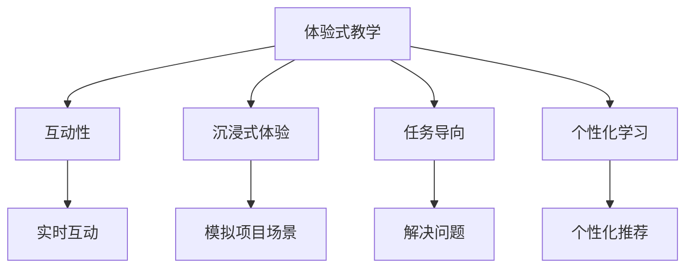

                 

# 程序员知识付费：打造体验式教学

## 1. 背景介绍

在快速发展的互联网时代，知识付费已成为一个热门话题。技术从业者，尤其是软件开发人员，面临着不断更新的技术栈、不断涌现的新框架和工具，如何高效学习、应用这些新知识，成为许多程序员的困扰。知识付费平台，如Coursera、Udemy、Codecademy等，提供了一系列课程，旨在帮助程序员提升技能，但效果往往不尽如人意。本文将探讨如何通过打造体验式教学，提升知识付费的效果，帮助程序员更高效地学习和应用新技术。

### 1.1 问题由来

传统的在线课程通常采用 lectures-on-demand 的方式，即通过视频教学、文字材料等形式进行知识传递。这种教学方式虽然能够覆盖广泛的知识点，但由于缺乏互动性，容易导致学习者感到枯燥、难以理解，最终影响学习效果。随着个性化学习和自适应学习的兴起，越来越多的研究开始探索如何结合技术手段，改善教学体验，提升学习效果。

### 1.2 问题核心关键点

构建体验式教学的关键在于：
1. **互动性**：通过实时互动、即时反馈等方式，提高学习者的参与感和动机。
2. **沉浸式体验**：通过模拟真实项目场景，让学习者身临其境地理解和应用所学知识。
3. **任务导向**：将学习目标具体化为可执行的任务，使学习者通过解决问题来掌握知识。
4. **个性化学习**：根据学习者的进度和能力，提供个性化的学习路径和资源。

本文将围绕以上关键点，深入探讨如何通过打造体验式教学，提升知识付费的效果，帮助程序员更高效地学习和应用新技术。

## 2. 核心概念与联系

### 2.1 核心概念概述

为了更好地理解体验式教学，首先需要明确一些核心概念：

- **体验式教学(Experiential Learning)**：通过实践活动，让学习者亲身体验和应用知识，从而实现深度理解和掌握。与传统的 lecture-based 教学不同，体验式教学强调学以致用。

- **交互式学习(Interactive Learning)**：指在学习过程中，通过互动和交流来加深理解、提升学习的体验和效果。交互式学习包括讨论、协作、模拟等多种形式。

- **自适应学习(Adaptive Learning)**：根据学习者的行为和反馈，动态调整教学内容和路径，以更好地满足学习者的需求和进度。自适应学习使用人工智能和大数据分析技术，实现个性化推荐和辅导。

- **微学习(Microlearning)**：将学习内容分解为小而精的片段，方便学习者零散时间和集中精力地学习。微学习适合碎片化学习，如移动设备、通勤等场景。

- **项目驱动学习(Project-Based Learning)**：通过模拟真实项目或解决实际问题，使学习者掌握综合应用知识的能力。项目驱动学习强调动手实践，与课程目标紧密结合。

这些核心概念之间存在紧密的联系，共同构成了体验式教学的基础框架。通过互动、沉浸、任务导向和个性化学习，体验式教学旨在提升学习的深度和效果，使学习者能够更高效地掌握和应用知识。

### 2.2 核心概念原理和架构的 Mermaid 流程图



这个流程图展示了体验式教学的关键组成部分及其相互关系：

- 通过实时互动（F），提高学习者的参与感和动机。
- 通过模拟项目场景（G），让学习者沉浸式地应用所学知识。
- 通过解决问题（H），使学习者将知识应用于实际任务中。
- 通过个性化推荐（I），根据学习者的进度和能力，提供定制化的学习路径和资源。

这些组成部分共同构成了一个完整的体验式教学系统，能够显著提升学习效果。

## 3. 核心算法原理 & 具体操作步骤

### 3.1 算法原理概述

体验式教学的核心算法原理可以概括为以下几个方面：

1. **互动算法**：通过即时反馈和实时互动，提高学习者的参与感和动机。互动算法包括即时问答、讨论论坛、协作任务等多种形式。
2. **沉浸算法**：通过模拟真实项目场景，使学习者身临其境地理解和应用知识。沉浸算法包括项目驱动学习、虚拟实验室、任务模拟等。
3. **任务导向算法**：将学习目标具体化为可执行的任务，使学习者通过解决问题来掌握知识。任务导向算法包括基于项目的任务、模拟场景任务、真实业务任务等。
4. **个性化算法**：根据学习者的进度和能力，提供个性化的学习路径和资源。个性化算法包括推荐系统、自适应学习路径、进度追踪等。

### 3.2 算法步骤详解

下面详细介绍体验式教学的具体操作步骤：

**Step 1: 设计互动体验**

1. 确定互动形式：实时问答、讨论论坛、协作任务等。
2. 开发互动工具：如实时聊天系统、在线白板、协作编辑工具等。
3. 设计互动内容：设计互动问题、讨论话题、协作任务等。

**Step 2: 创建沉浸式项目**

1. 确定项目类型：如实际业务案例、虚拟模拟任务等。
2. 设计项目场景：模拟真实项目环境，包括数据、工具、任务等。
3. 开发项目工具：如虚拟实验室、模拟器、任务生成器等。

**Step 3: 设置任务导向目标**

1. 定义学习目标：明确学习者需要掌握的技能和知识。
2. 设计任务：将学习目标具体化为可执行的任务。
3. 评估任务完成度：设置任务完成标准和评估指标。

**Step 4: 实现个性化学习**

1. 收集学习者数据：包括进度、能力、偏好等。
2. 分析学习者数据：使用机器学习和大数据分析技术，分析学习者的行为和反馈。
3. 提供个性化推荐：根据分析结果，推荐合适的学习资源和路径。

**Step 5: 实施和监控**

1. 实施教学方案：在实际教学中应用上述步骤。
2. 实时监控学习效果：使用智能监控系统，实时跟踪学习者的进度和效果。
3. 动态调整教学方案：根据监控结果，及时调整教学内容和路径。

### 3.3 算法优缺点

体验式教学具有以下优点：
1. 提升参与感：通过互动和沉浸，使学习者更加积极参与，提升学习效果。
2. 增强应用能力：通过项目驱动和任务导向，使学习者掌握实际应用技能。
3. 实现个性化学习：通过自适应算法，提供个性化的学习路径和资源，满足不同学习者的需求。

同时，体验式教学也存在一些缺点：
1. 技术要求高：需要开发复杂的互动和沉浸式工具。
2. 资源需求大：需要大量的时间、人力和资金支持。
3. 学习成本高：需要学习者投入更多的时间和精力，掌握新工具和方法。

### 3.4 算法应用领域

体验式教学在多个领域已经得到了广泛的应用，例如：

1. **软件开发**：通过项目驱动学习，使学习者掌握实际开发技能，提高项目管理和技术实现能力。
2. **数据科学**：通过模拟实际数据分析任务，使学习者掌握数据分析工具和方法。
3. **网络安全**：通过模拟网络攻击和防御任务，使学习者掌握网络安全技术和策略。
4. **教育培训**：通过互动和沉浸式教学，使学习者掌握知识，提升教学效果。
5. **游戏开发**：通过任务导向和项目驱动学习，使学习者掌握游戏设计和开发技能。

## 4. 数学模型和公式 & 详细讲解 & 举例说明

### 4.1 数学模型构建

体验式教学的数学模型可以构建为以下几个部分：

1. **互动模型**：描述互动过程中的数据流和算法流程。
2. **沉浸模型**：描述项目驱动和任务导向的具体任务和场景。
3. **个性化模型**：描述个性化推荐和自适应学习路径的算法流程。

### 4.2 公式推导过程

以下以互动模型为例，推导一个简单互动系统中的公式。

假设互动系统中有 $N$ 个学习者，每个学习者与教师进行实时互动，互动过程包含 $M$ 个步骤。设互动过程中的数据流为 $\mathcal{D}=(\mathcal{D}^{(1)},\mathcal{D}^{(2)},\dots,\mathcal{D}^{(M)})$，其中 $\mathcal{D}^{(i)}$ 表示第 $i$ 步的数据流，包括提问、回答、反馈等。互动模型的算法流程可以表示为：

$$
\mathcal{A}=\mathop{\arg\min}_{\mathcal{A}} \sum_{i=1}^M \mathcal{L}(\mathcal{A},\mathcal{D}^{(i)})
$$

其中 $\mathcal{L}$ 为互动系统的损失函数，用于衡量互动效果。互动系统的优化目标是最小化损失函数，即找到最优的互动算法 $\mathcal{A}$。

### 4.3 案例分析与讲解

假设某编程课程中，学生通过实时问答系统与教师互动，系统会根据学生的提问生成相应的回答和反馈，并记录互动效果。互动系统中的数据流可以表示为：

$$
\mathcal{D}=(q_1,a_1,f_1,q_2,a_2,f_2,\dots,q_M,a_M,f_M)
$$

其中 $q_i$ 表示第 $i$ 步学生提出的问题，$a_i$ 表示教师的回答，$f_i$ 表示学生的反馈。互动系统的损失函数可以定义如下：

$$
\mathcal{L}(\mathcal{A},\mathcal{D})=\frac{1}{N}\sum_{i=1}^M \sum_{j=1}^N \|q_i - \mathcal{A}(a_i, j)\|^2
$$

其中 $\mathcal{A}(a_i, j)$ 表示教师回答 $a_i$ 后，学生反馈 $j$ 的预测值。

通过优化上述损失函数，互动系统能够根据学生的反馈，不断调整回答策略，提高互动效果。

## 5. 项目实践：代码实例和详细解释说明

### 5.1 开发环境搭建

进行体验式教学实践前，需要准备开发环境。以下是使用Python进行Django开发的示例：

1. 安装Anaconda：从官网下载并安装Anaconda，用于创建独立的Python环境。

2. 创建并激活虚拟环境：
```bash
conda create -n py_teaching python=3.8 
conda activate py_teaching
```

3. 安装Django：
```bash
pip install django
```

4. 安装相关工具包：
```bash
pip install django-ckeditor django-simple-history django-crispy-forms
```

5. 初始化Django项目：
```bash
django-admin startproject learning_platform
```

6. 创建应用：
```bash
cd learning_platform
python manage.py startapp interactive_learning
```

完成上述步骤后，即可在`py_teaching`环境中开始体验式教学实践。

### 5.2 源代码详细实现

以下是使用Django框架实现互动系统的示例代码：

1. 创建互动模块：
```python
# learning_platform/interactive_learning/models.py

from django.db import models
from django.contrib.auth.models import User

class Interaction(models.Model):
    user = models.ForeignKey(User, on_delete=models.CASCADE)
    question = models.TextField()
    answer = models.TextField()
    feedback = models.CharField(max_length=10)
    timestamp = models.DateTimeField(auto_now_add=True)
```

2. 创建视图和模板：
```python
# learning_platform/interactive_learning/views.py

from django.shortcuts import render
from .models import Interaction

def index(request):
    interactions = Interaction.objects.all().order_by('-timestamp')
    return render(request, 'interactive_learning/index.html', {'interactions': interactions})
```

3. 创建交互表单：
```python
# learning_platform/interactive_learning/forms.py

from django import forms
from .models import Interaction

class InteractionForm(forms.ModelForm):
    class Meta:
        model = Interaction
        fields = ('question', 'answer', 'feedback')
```

4. 创建模板：
```html
<!-- learning_platform/interactive_learning/templates/interactive_learning/index.html -->




  <h1>Interactive Learning</h1>
  <ul>
    
      <li>{{ interaction.question }}: {{ interaction.answer }}</li>
    
  </ul>
  <form method="post">
    
    {{ interaction_form.as_p }}
    <button type="submit">Submit</button>
  </form>

```

5. 创建管理后台：
```python
# learning_platform/interactive_learning/admin.py

from django.contrib import admin
from .models import Interaction

admin.site.register(Interaction)
```

以上代码实现了一个简单的互动系统，学习者可以通过表单提交问题，系统自动生成回答和反馈，并在页面上展示。教师可以通过后台管理互动数据，分析互动效果。

### 5.3 代码解读与分析

我们进一步分析上述代码实现：

1. 模型设计：创建了一个`Interaction`模型，用于存储互动数据，包括用户、问题、回答和反馈等。
2. 视图开发：创建了一个`index`视图，用于展示互动数据，并允许用户提交问题。
3. 表单设计：创建了一个`InteractionForm`表单，用于捕获用户输入的问题和回答。
4. 模板渲染：使用Django模板系统渲染互动数据和表单，展示在页面中。
5. 后台管理：创建了`Interaction`模型的管理后台，方便教师监控和管理互动数据。

可以看出，上述代码实现了一个完整的互动系统，实现了学习者与教师的实时互动。

### 5.4 运行结果展示

运行上述代码，启动Django项目，访问`http://localhost:8000/interactive_learning`，即可看到互动系统的首页。用户可以提交问题，系统自动生成回答和反馈，并展示在页面中。教师可以在后台管理互动数据，分析互动效果。

## 6. 实际应用场景

体验式教学在多个领域已经得到了广泛的应用，例如：

1. **软件开发**：通过项目驱动学习，使学习者掌握实际开发技能，提高项目管理和技术实现能力。
2. **数据科学**：通过模拟实际数据分析任务，使学习者掌握数据分析工具和方法。
3. **网络安全**：通过模拟网络攻击和防御任务，使学习者掌握网络安全技术和策略。
4. **教育培训**：通过互动和沉浸式教学，使学习者掌握知识，提升教学效果。
5. **游戏开发**：通过任务导向和项目驱动学习，使学习者掌握游戏设计和开发技能。

## 7. 工具和资源推荐

### 7.1 学习资源推荐

为了帮助开发者系统掌握体验式教学的理论基础和实践技巧，这里推荐一些优质的学习资源：

1. **Coursera《学习与设计优质在线课程》**：斯坦福大学开设的课程，系统介绍了学习理论和在线课程设计方法。

2. **Udemy《互动式学习设计与开发》**：Udemy平台上的课程，详细讲解了互动式学习的设计和开发技巧。

3. **edX《自适应学习技术》**：麻省理工学院开设的课程，介绍了自适应学习技术的原理和应用。

4. **Google Developers《交互式设计指南》**：谷歌开发者文档，提供了丰富的交互式设计工具和示例。

5. **IEEE Xplore《沉浸式学习研究》**：IEEE Xplore数据库中的研究论文，介绍了沉浸式学习的研究进展和应用案例。

通过对这些资源的学习实践，相信你一定能够快速掌握体验式教学的精髓，并用于解决实际的在线教育问题。

### 7.2 开发工具推荐

高效的开发离不开优秀的工具支持。以下是几款用于体验式教学开发的常用工具：

1. **Django**：基于Python的开源Web框架，提供了丰富的组件和插件，适合构建交互式教学平台。
2. **React**：流行的前端框架，提供了虚拟DOM和组件化开发方式，适合构建沉浸式项目驱动学习系统。
3. **Kaggle**：数据科学和机器学习平台，提供了丰富的数据集和竞赛，适合进行数据驱动的互动学习。
4. **Blender**：开源3D建模软件，适合创建沉浸式虚拟实验室和任务场景。
5. **Unity**：流行的游戏引擎，适合创建沉浸式游戏驱动学习项目。

合理利用这些工具，可以显著提升体验式教学的开发效率，加快创新迭代的步伐。

### 7.3 相关论文推荐

体验式教学的发展源于学界的持续研究。以下是几篇奠基性的相关论文，推荐阅读：

1. **《The Power of Instructor Feedback in Online Courses》**：研究了反馈在在线课程中的重要性，提出了通过互动和即时反馈来提升学习效果的方法。

2. **《Project-Based Learning: What, Why, How》**：介绍了项目驱动学习的原理和应用，探讨了如何通过项目驱动学习来提升学生的综合能力。

3. **《Interactive Learning: A Review of the Literature》**：综述了互动学习的理论基础和应用实践，提供了丰富的互动学习案例。

4. **《Adaptive Learning Technologies》**：介绍了自适应学习的原理和应用，探讨了如何通过自适应学习技术来提供个性化的学习体验。

5. **《Simulation-Based Learning in Education and Training》**：介绍了沉浸式学习的原理和应用，提供了丰富的沉浸式学习案例。

这些论文代表了大语言模型微调技术的发展脉络。通过学习这些前沿成果，可以帮助研究者把握学科前进方向，激发更多的创新灵感。

## 8. 总结：未来发展趋势与挑战

### 8.1 研究成果总结

本文对体验式教学进行了全面系统的介绍，主要包括以下内容：

1. **互动性**：通过实时互动、即时反馈等方式，提高学习者的参与感和动机。
2. **沉浸式体验**：通过模拟真实项目场景，使学习者身临其境地理解和应用知识。
3. **任务导向**：将学习目标具体化为可执行的任务，使学习者通过解决问题来掌握知识。
4. **个性化学习**：根据学习者的进度和能力，提供个性化的学习路径和资源。

### 8.2 未来发展趋势

展望未来，体验式教学将呈现以下几个发展趋势：

1. **技术融合**：随着人工智能和大数据分析技术的进步，体验式教学将与更多的技术手段融合，如机器学习、自然语言处理、虚拟现实等，提升教学效果。
2. **跨学科应用**：体验式教学将拓展到更多学科领域，如医学、教育、艺术等，提供更广泛的教育解决方案。
3. **智能自适应**：通过自适应学习算法，实时调整教学内容和路径，满足不同学习者的需求。
4. **社区协作**：建立学习者社区，促进知识共享和协作学习，提升学习效果。
5. **实时监控**：通过智能监控系统，实时跟踪学习者的进度和效果，动态调整教学策略。

### 8.3 面临的挑战

尽管体验式教学已经取得了一定的成果，但在迈向更加智能化、普适化应用的过程中，它仍面临以下挑战：

1. **技术复杂性**：体验式教学需要开发复杂的互动和沉浸式工具，需要投入大量时间和人力。
2. **资源需求大**：需要大量的数据、时间和资金支持，才能实现大规模应用。
3. **学习负担重**：学习者需要投入更多的时间和精力，掌握新工具和方法，可能影响学习者的积极性。
4. **效果评估难**：体验式教学的效果评估需要更多的科学方法和工具，才能客观衡量学习效果。

### 8.4 研究展望

面对体验式教学所面临的挑战，未来的研究需要在以下几个方面寻求新的突破：

1. **技术自动化**：开发更加自动化的教学工具和系统，减少手动操作的复杂性。
2. **资源共享**：建立开放的教育资源库，实现资源共享和复用。
3. **学习路径优化**：使用机器学习和大数据分析技术，优化学习路径和资源推荐。
4. **效果评估方法**：开发科学的评估方法和工具，客观衡量体验式教学的效果。

这些研究方向的探索，将引领体验式教学技术迈向更高的台阶，为构建安全、可靠、可解释、可控的智能系统铺平道路。

## 9. 附录：常见问题与解答

**Q1: 如何判断一个互动系统是否符合体验式教学的要求？**

A: 一个互动系统是否符合体验式教学的要求，可以从以下几个方面进行评估：
1. **互动性**：系统是否提供了实时互动和即时反馈机制。
2. **沉浸式体验**：系统是否模拟了真实项目场景，使学习者能够身临其境地应用知识。
3. **任务导向**：系统是否将学习目标具体化为可执行的任务，使学习者能够通过解决问题来掌握知识。
4. **个性化学习**：系统是否能够根据学习者的进度和能力，提供个性化的学习路径和资源。

**Q2: 如何设计一个沉浸式项目？**

A: 设计沉浸式项目需要考虑以下几个方面：
1. **任务场景**：模拟真实项目环境，包括数据、工具、任务等。
2. **项目目标**：明确项目目标，使学习者能够掌握实际应用技能。
3. **任务分解**：将项目目标分解为可执行的任务，使学习者能够逐步掌握知识。
4. **反馈机制**：设计反馈机制，使学习者能够及时了解自己的学习进度和效果。

**Q3: 如何实现个性化推荐？**

A: 实现个性化推荐需要以下几个步骤：
1. **数据收集**：收集学习者的进度、能力、偏好等数据。
2. **数据分析**：使用机器学习和大数据分析技术，分析学习者的行为和反馈。
3. **推荐算法**：根据分析结果，推荐合适的学习资源和路径。
4. **效果评估**：评估推荐效果，根据反馈调整推荐算法。

**Q4: 体验式教学与传统教学的区别是什么？**

A: 体验式教学与传统教学的主要区别在于：
1. **学习方式**：体验式教学强调学以致用，通过实践活动使学习者掌握知识。而传统教学通常采用lectures-on-demand的方式，通过知识传递使学习者掌握理论。
2. **互动性**：体验式教学强调互动和交流，使学习者能够积极参与，提高学习效果。而传统教学通常缺乏互动，学习者被动接受知识。
3. **沉浸式体验**：体验式教学强调沉浸式体验，使学习者身临其境地应用知识。而传统教学通常缺乏沉浸式体验，学习者难以理解知识的实际应用。
4. **任务导向**：体验式教学强调任务导向，使学习者通过解决问题来掌握知识。而传统教学通常缺乏任务导向，学习者难以将知识应用于实际任务中。

通过本文的系统梳理，可以看到，体验式教学正在成为知识付费的重要范式，能够显著提升学习效果，帮助程序员更高效地学习和应用新技术。未来，随着技术的不断进步，体验式教学必将在更多领域得到应用，为人类认知智能的进化带来深远影响。

---

作者：禅与计算机程序设计艺术 / Zen and the Art of Computer Programming

