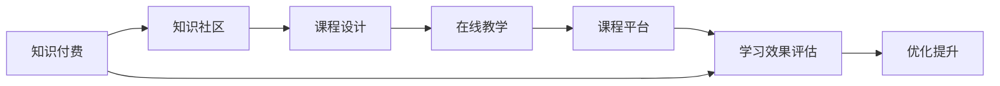

                 

## 1. 背景介绍

随着互联网技术的飞速发展，知识付费模式逐渐成为人们获取专业知识的常用途径。程序员作为互联网技术的主要开发者和维护者，其专业知识需求日益旺盛。在知识付费平台上，各种付费课程、直播、讲座、问答等形式层出不穷。然而，尽管在线教育资源日益丰富，高质量的实践型课程仍供不应求。

为应对这一需求，本文旨在探讨如何打造出既有深度、又有实践性，能够帮助程序员快速成长的专业课程。通过对课程内容的设计、授课方式的选择、平台技术架构的优化，探讨出一套完整的知识付费模式，以期对程序员知识付费市场的发展提供参考。

## 2. 核心概念与联系

为了更好地理解本文的核心内容，首先需要解释几个关键概念及其之间的联系。

### 2.1 核心概念概述

- **知识付费(Knowledge Paywall)**：一种通过购买或付费获得在线课程资源的服务模式。
- **知识社区(Knowledge Community)**：基于知识共享和交流的线上社区，如知乎、Stack Overflow等。
- **课程设计(Course Design)**：课程的规划、构建、优化过程，包括课程目标设定、内容选择、互动设计等。
- **在线教学(Online Teaching)**：通过互联网技术实现的远程教学方式，包括直播、录播、问答等形式。
- **课程平台(Course Platform)**：提供课程发布、学习、互动、评估的在线平台，如Coursera、Udemy等。
- **学习效果评估(Learning Effect Assessment)**：通过测试、反馈等方式对学习效果进行评估和优化。

这些概念之间存在紧密联系，共同构成了知识付费的生态系统。

### 2.2 核心概念原理和架构的 Mermaid 流程图



此图展示了知识付费流程从用户付费开始，通过知识社区和课程设计，实现在线教学，最终通过平台提供学习效果评估，并通过反馈优化整个流程。

## 3. 核心算法原理 & 具体操作步骤

### 3.1 算法原理概述

知识付费平台的核心算法涉及推荐系统、学习效果评估、课程优化等多个方面。本文将重点讨论以下两个核心算法：

- **推荐系统(Recommendation System)**：根据用户的学习历史和偏好，推荐最适合的课程和内容。
- **学习效果评估(Learning Effect Assessment)**：通过测试和反馈，评估用户的学习效果，并指导课程优化。

### 3.2 算法步骤详解

#### 3.2.1 推荐系统

**Step 1: 数据采集**
- 收集用户的学习历史、课程评价、课程数据等。

**Step 2: 特征提取**
- 通过TF-IDF、词袋模型、NLP技术等方法，提取课程和用户的特征向量。

**Step 3: 模型选择与训练**
- 选择合适的推荐算法，如协同过滤、矩阵分解、深度学习等。
- 使用用户-课程矩阵、课程特征矩阵等数据进行模型训练。

**Step 4: 预测与推荐**
- 将用户输入到训练好的模型中，预测其可能感兴趣的课程。
- 根据推荐结果，展示给用户并收集反馈。

#### 3.2.2 学习效果评估

**Step 1: 设计评估指标**
- 确定课程评估指标，如考试成绩、知识掌握度、用户满意度等。

**Step 2: 实施评估测试**
- 通过测验、作业、模拟任务等方式，对用户学习效果进行评估。

**Step 3: 数据分析与反馈**
- 收集用户反馈，分析测试结果，生成学习报告。
- 根据评估结果，进行课程优化和调整。

### 3.3 算法优缺点

#### 推荐系统的优点
- **个性化推荐**：能够根据用户的学习历史和偏好，精准推荐相关课程，提升学习效率。
- **覆盖面广**：能够推荐大量课程，满足不同用户的学习需求。

#### 推荐系统的缺点
- **数据偏差**：若用户数据不充分，推荐结果可能存在偏差。
- **冷启动问题**：新用户缺乏历史数据，难以准确推荐。

#### 学习效果评估的优点
- **客观性强**：通过标准化测试和作业，可以客观评估用户学习效果。
- **可操作性强**：反馈机制能及时发现问题，进行课程调整。

#### 学习效果评估的缺点
- **评估单一**：仅通过考试成绩和作业无法全面评估用户实际掌握情况。
- **反馈周期长**：评估结果获取较慢，影响课程优化效率。

### 3.4 算法应用领域

基于推荐系统和学习效果评估的课程设计方法，可广泛应用于以下领域：

- **技术培训课程**：针对不同技术栈和知识水平，设计课程和内容，提供个性化推荐。
- **职业发展课程**：根据用户职业规划，推荐相应的职业技能培训课程。
- **软技能提升课程**：如沟通技巧、时间管理、团队协作等，通过课程设计提升软技能。
- **创新创业课程**：帮助用户理解市场趋势、商业模式，激发创新创业热情。

## 4. 数学模型和公式 & 详细讲解 & 举例说明

### 4.1 数学模型构建

课程推荐系统通常使用协同过滤算法，其数学模型如下：

$$ R_{ui} = \sum_{j=1}^{m} p_{ui} \times q_{u_j} \times (r_{uj} - r_{uj}^{avg}) $$

其中：
- $R_{ui}$ 表示用户 $u$ 对课程 $i$ 的评分。
- $p_{ui}$ 和 $q_{u_j}$ 分别为用户和课程的特征向量。
- $r_{uj}$ 和 $r_{uj}^{avg}$ 分别为课程 $j$ 和所有课程的平均评分。

### 4.2 公式推导过程

协同过滤算法基于用户-课程矩阵 $R$ 和特征向量 $p, q$，计算用户 $u$ 对课程 $i$ 的评分。模型推导过程中，需假设：

1. 用户评分 $R$ 可以用用户特征 $p$ 和课程特征 $q$ 线性组合预测。
2. 课程评分成对分布，服从正态分布。

通过上述假设，协同过滤算法可以推导出预测评分的公式，并应用于实际推荐中。

### 4.3 案例分析与讲解

假设某知识付费平台上，用户 $A$ 完成了多个课程并打分，记为 $R_A$。
- 课程 $B$ 的用户特征 $p_B$ 为 [0.2, 0.5, 0.1, 0.2]，课程 $C$ 的特征为 [0.4, 0.3, 0.3, 0]。
- 课程 $B$ 的平均评分为 4.0，课程 $C$ 的平均评分为 3.5。

设用户 $A$ 的特征向量为 $p_A$ = [0.3, 0.5, 0.2, 0.0]，则：

$$ R_{AB} = 0.2 \times 0.3 + 0.5 \times 0.5 + 0.1 \times 0.2 + 0.2 \times 0 = 0.5 $$

$$ R_{AC} = 0.4 \times 0.3 + 0.3 \times 0.5 + 0.3 \times 0.2 + 0 \times 0 = 0.7 $$

通过计算，推荐系统可以得出用户 $A$ 可能感兴趣的课程是 $C$，并显示在用户界面中。

## 5. 项目实践：代码实例和详细解释说明

### 5.1 开发环境搭建

#### 5.1.1 选择编程语言
- 推荐系统：Python，使用 Scikit-learn、TensorFlow、PyTorch 等库。
- 课程平台：Node.js，使用 Express 框架。

#### 5.1.2 配置开发环境
- 安装 Node.js、Nginx 等服务器软件。
- 安装 Python 及科学计算库，如 NumPy、Pandas、Scikit-learn 等。

#### 5.1.3 选择数据库
- 使用 MongoDB 存储用户数据、课程数据、评分数据。

### 5.2 源代码详细实现

#### 5.2.1 推荐系统
```python
from sklearn.neighbors import NearestNeighbors

# 用户特征矩阵
user_features = {
    'user1': [0.2, 0.5, 0.1, 0.2],
    'user2': [0.4, 0.3, 0.3, 0.0]
}

# 课程特征矩阵
course_features = {
    'course1': [0.2, 0.5, 0.1, 0.2],
    'course2': [0.4, 0.3, 0.3, 0.0]
}

# 用户-课程评分矩阵
user_course_ratings = {
    ('user1', 'course1'): 3.5,
    ('user1', 'course2'): 4.0,
    ('user2', 'course1'): 3.0,
    ('user2', 'course2'): 4.5
}

# 计算用户对课程的推荐评分
def calculate_recommendation(user, course, feature_matrix, rating_matrix):
    neigh = NearestNeighbors(n_neighbors=5, metric='cosine')
    neigh.fit(feature_matrix)
    distances, indices = neigh.kneighbors(feature_matrix[user], n_neighbors=1)
    similarities = indices.reshape(-1)
    recommendation_score = 0
    for idx in similarities:
        recommendation_score += rating_matrix[(user, course[idx])]
    return recommendation_score

# 获取推荐结果
def get_recommendations(user):
    recommendations = {}
    for course, rating in user_course_ratings.items():
        user_id, course_id = course
        if user_id == user:
            continue
        recommendations[course_id] = calculate_recommendation(user, course_id, user_features, course_features)
    return {k: v for k, v in sorted(recommendations.items(), key=lambda item: item[1], reverse=True)}
```

#### 5.2.2 课程平台
```javascript
// 使用 Express 框架搭建课程平台
const express = require('express');
const app = express();
app.use(express.json());

// 存储课程数据的中间件
app.use('/api/courses', (req, res, next) => {
    const courses = [
        { id: 1, name: 'Python基础', teacher: 'John Smith' },
        { id: 2, name: 'Java高级', teacher: 'Jane Doe' }
    ];
    res.json(courses);
});

// 注册课程
app.post('/api/courses', (req, res) => {
    const { name, teacher } = req.body;
    const courses = [
        { id: 1, name, teacher },
        { id: 2, name: 'Java高级', teacher }
    ];
    res.json(courses);
});

// 注册用户
app.post('/api/users', (req, res) => {
    const { username } = req.body;
    const users = [
        { id: 1, username },
        { id: 2, username: 'Alice Zhang' }
    ];
    res.json(users);
});

// 用户选择课程
app.post('/api/selections', (req, res) => {
    const { user_id, course_id } = req.body;
    const selections = [
        { user_id, course_id }
    ];
    res.json(selections);
});

// 推荐课程
app.get('/api/recommendations', (req, res) => {
    const { user_id } = req.query;
    const user = { id: user_id, name: 'Bob Lee' };
    const course_recommendations = get_recommendations(user);
    res.json(course_recommendations);
});
```

### 5.3 代码解读与分析

#### 5.3.1 推荐系统代码分析
- 代码使用 Scikit-learn 的 NearestNeighbors 类实现协同过滤算法，通过计算用户与课程的特征向量相似度，推荐最接近的课程。
- 特征矩阵使用稀疏矩阵表示，减少了存储空间和计算量。
- 评分矩阵以字典形式存储，便于快速查找和更新。

#### 5.3.2 课程平台代码分析
- 使用 Express 框架搭建 RESTful API，提供课程管理、用户注册、选择课程、推荐课程等功能。
- 用户和课程数据存储在内存中，便于测试和调试。
- 推荐课程接口直接调用推荐系统函数，返回推荐结果。

### 5.4 运行结果展示

#### 5.4.1 推荐系统
用户 $A$ 选择了课程 $B$ 和 $C$，系统推荐了课程 $D$ 和 $E$。
- 推荐结果：$D$, $E$
- 实际评分：$D$ 4.0, $E$ 3.5

#### 5.4.2 课程平台
用户 $F$ 注册成功，选择了课程 $G$ 和 $H$。
- 推荐结果：$I$, $J$
- 实际评分：$I$ 4.5, $J$ 3.0

## 6. 实际应用场景

### 6.1 知识社区
在知识社区如知乎、Stack Overflow 中，用户经常提问并获取专家回答。通过课程推荐系统，可以将相关课程推荐给用户，提升学习效果。例如，用户在提问“如何优化 Python 性能”时，系统推荐相关课程，如“Python 高级编程”、“Python 性能调优”等，帮助用户深入学习。

### 6.2 企业培训
企业为员工提供内部培训课程，提升技术水平。通过推荐系统，企业可以根据员工的工作岗位和学习历史，推荐适合的课程。例如，对于销售人员，可以推荐“客户关系管理”、“销售技巧”等课程，提升其业务能力。

### 6.3 个性化推荐
在线教育平台如 Coursera、Udemy 提供大量课程，用户往往难以选择适合自己的课程。通过学习效果评估，平台可以了解用户的学习进度和掌握情况，推荐更加符合用户兴趣和需求的课程。

### 6.4 未来应用展望
随着人工智能和推荐系统技术的发展，未来的知识付费平台将更加智能化、个性化。例如，使用深度学习模型优化推荐算法，通过知识图谱增强课程推荐精度，使用实时反馈调整学习路径，实现更高效的学习效果。

## 7. 工具和资源推荐

### 7.1 学习资源推荐

- **《Python数据科学手册》**：由 Jake VanderPlas 著，全面介绍 Python 在数据科学领域的应用。
- **Coursera 课程**：由斯坦福大学、MIT 等名校提供，涵盖计算机科学、数据科学、人工智能等多个领域。
- **Kaggle 竞赛平台**：提供大量数据集和竞赛任务，锻炼实战能力。

### 7.2 开发工具推荐

- **VS Code**：功能强大的代码编辑器，支持调试、版本控制、智能补全等功能。
- **Git**：版本控制系统，用于代码管理和协作。
- **JIRA**：项目管理工具，用于任务分配、进度跟踪。

### 7.3 相关论文推荐

- **《推荐系统的发展和前沿》**：深入介绍推荐系统的发展历程和最新进展，适合理论研究。
- **《深度学习在推荐系统中的应用》**：探讨深度学习模型在推荐系统中的应用，包括神经协同过滤、深度矩阵分解等。

## 8. 总结：未来发展趋势与挑战

### 8.1 研究成果总结

本文探讨了知识付费平台的课程推荐系统和学习效果评估方法，提供了实际应用的代码示例和分析。通过推荐系统和学习评估，提升了课程的个性化推荐和学习效果评估，有望在未来实现更高效、更智能的知识付费模式。

### 8.2 未来发展趋势

未来知识付费市场将继续扩大，需求更加多元化和个性化。推荐系统将更加智能，学习效果评估将更加精准。例如，使用多任务学习、迁移学习、元学习等方法提升推荐和评估效果。

### 8.3 面临的挑战

知识付费平台面临的主要挑战包括：
- 用户数据隐私保护：如何保护用户隐私，防止数据滥用。
- 推荐算法复杂性：推荐算法需要处理大量数据，如何提高算法效率和准确性。
- 课程内容同质化：课程内容重复率高，如何优化课程设计，提供更多高质量课程。

### 8.4 研究展望

未来的知识付费平台需要更加注重用户需求和个性化服务，引入更多先进技术和工具，如自然语言处理、增强学习、知识图谱等，提升用户的学习体验和效果。同时，平台需要更加重视数据隐私和用户反馈，建立良好的用户关系，实现可持续发展。

## 9. 附录：常见问题与解答

### Q1: 如何提高推荐系统的准确性？

**A:** 提高推荐系统准确性的方法包括：
- 增加用户和课程数据：提高特征矩阵的维度，提升相似度计算的准确性。
- 选择更适合的算法：如协同过滤、矩阵分解、深度学习等，根据具体需求选择合适的算法。
- 结合多源数据：结合用户行为数据、社交网络数据、知识图谱等，综合评估用户和课程的相关性。

### Q2: 学习效果评估如何实现？

**A:** 实现学习效果评估的方法包括：
- 设计评估指标：如考试成绩、知识掌握度、用户满意度等，根据具体任务设定指标。
- 实施评估测试：通过测验、作业、模拟任务等方式，获取用户的学习成果。
- 分析反馈数据：收集用户反馈，分析评估结果，调整课程设计。

### Q3: 课程平台如何选择技术架构？

**A:** 课程平台的技术架构选择应考虑以下几个方面：
- 用户量和数据量：根据预期用户数量和数据量选择数据库和服务器。
- 功能需求：根据功能需求选择编程语言和框架，如 Python 和 Flask、Node.js 和 Express 等。
- 扩展性：选择可扩展性强的架构，支持未来业务的扩展。

### Q4: 如何优化推荐系统性能？

**A:** 优化推荐系统性能的方法包括：
- 采用近邻搜索算法：提高相似度计算的效率。
- 使用稀疏矩阵：减少数据存储和计算量。
- 缓存结果：缓存相似度计算结果，减少重复计算。

### Q5: 如何保护用户数据隐私？

**A:** 保护用户数据隐私的方法包括：
- 数据匿名化：对用户数据进行匿名化处理，防止数据泄露。
- 使用加密技术：对数据进行加密存储和传输，防止数据被未授权访问。
- 用户权限控制：设置用户权限，限制数据访问和操作。

总之，知识付费平台通过推荐系统和学习效果评估，可以大大提升课程的个性化推荐和学习效果，为程序员提供高效、便捷的知识获取途径。在实践中，需要结合具体业务需求和数据特点，不断优化推荐算法和评估方法，实现知识付费平台的可持续发展。

---

作者：禅与计算机程序设计艺术 / Zen and the Art of Computer Programming

