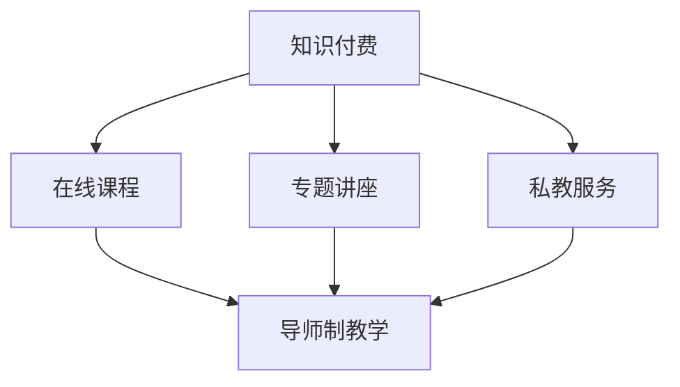

                 

# 程序员知识付费：打造导师制教学

> 关键词：知识付费, 导师制, 技术教学, 课程设计, 教学质量, 学生需求, 技术传承, 职业发展, 学习效果, 教育评估

## 1. 背景介绍

### 1.1 问题由来
随着信息技术和互联网的迅猛发展，知识付费成为新兴的教育模式，其在提高教育效率、促进教育公平、激励知识创新等方面具有显著优势。尤其在程序员领域，专业技能更新快，知识迭代迅速，传统线下培训方式难以满足技术人才的快速成长需求。

知识付费将优质的教育资源从时间和空间上解放出来，通过在线课程、专题讲座、私教服务等方式，为程序员提供量身定制的学习途径，帮助他们突破职业瓶颈，实现更高层次的职业发展。其中，导师制教学因其个性化、高效率、互动性强的特点，成为知识付费领域的一个亮点。

### 1.2 问题核心关键点
导师制教学的核心在于挑选经验丰富的导师，将行业知识、实践技能和成功经验传授给学员，通过一对一的互动交流，帮助学员全面提升技术能力和职业素养。其关键点包括：

- 导师选择：挑选技术精湛、经验丰富的导师，保障教学质量。
- 教学内容：设计丰富多样的课程内容，满足学员不同层次的需求。
- 教学方法：采用个性化教学方法，因材施教，提升教学效果。
- 教学评估：建立完善的评估体系，及时反馈学员学习效果，进行持续改进。

### 1.3 问题研究意义
导师制教学具有深远的意义：

1. **提高教育质量**：通过个性化辅导，帮助学员快速掌握核心技术，提升技术水平。
2. **促进职业发展**：结合实战项目和经验分享，帮助学员积累项目经验，拓展职业道路。
3. **激发创新意识**：导师制的教学模式有助于激发学员的创新思维和实践能力，推动技术创新。
4. **打破地域限制**：知识付费平台打破了时间和空间的限制，使优质教育资源得以广泛传播，促进教育公平。
5. **培育技术人才**：通过导师制教学，系统性地培育出一批技术娴熟、能力突出的程序员，推动行业发展。

## 2. 核心概念与联系

### 2.1 核心概念概述

为更好地理解导师制教学，我们需要介绍几个核心概念：

- **知识付费**：通过付费获取优质教育资源的一种教育模式，具有高度灵活性和个性化。
- **导师制教学**：以导师为核心的教学模式，通过一对一的互动交流，实现高质量的教育效果。
- **在线课程**：通过互联网平台提供的远程教育服务，具有灵活的访问方式和学习时间。
- **专题讲座**：聚焦特定技术或领域，由专家或导师进行深度讲解和互动的学术活动。
- **私教服务**：提供个性化的导师辅导，包括课程设计、项目指导、职业规划等。

这些核心概念之间的联系可以通过以下Mermaid流程图来展示：



这个流程图展示出知识付费平台上的几种教育形式，以及它们如何通过导师制教学来提升教育质量。

## 3. 核心算法原理 & 具体操作步骤
### 3.1 算法原理概述

导师制教学的核心理论基于个性化教育和实践导向的教学方法。其核心思想是：

- **个性化教育**：根据学员的技术基础和职业目标，量身定制教学内容和方法。
- **实践导向**：通过实战项目、案例分析和项目指导，帮助学员掌握实际操作能力。
- **互动交流**：通过导师与学员的互动交流，及时解决学员的技术问题和困惑，提升学习效果。

### 3.2 算法步骤详解

导师制教学的一般流程包括：

**Step 1: 导师选择与匹配**
- 通过平台或机构筛选出技术背景深厚、教学经验丰富的导师。
- 利用大数据和人工智能技术，匹配合适的学员和导师。

**Step 2: 制定个性化教学计划**
- 了解学员的技术水平、职业目标和兴趣偏好，制定个性化的教学计划。
- 确定教学内容、时间安排和评估方式，确保教学有章可循。

**Step 3: 实施教学过程**
- 导师与学员进行一对一的互动交流，包括技术指导、项目讲解、实战演练等。
- 定期进行教学评估和反馈，根据学员进度和反馈调整教学计划。

**Step 4: 项目实战与项目指导**
- 设计适合学员水平和职业目标的实战项目，让学员在实践中提升技术能力。
- 导师进行项目指导，解答学员遇到的技术难题，提供专业建议。

**Step 5: 教学效果评估与改进**
- 建立完善的评估体系，定期进行学习效果评估，如编程测验、项目演示等。
- 根据评估结果，进行教学改进，提升教学质量。

### 3.3 算法优缺点

导师制教学具有以下优点：

1. **个性化教学**：根据学员的个性化需求，量身定制教学内容，提高教学效果。
2. **实战导向**：通过实战项目和案例分析，帮助学员掌握实际应用能力，增强职业竞争力。
3. **互动交流**：通过导师与学员的互动，及时解决学员的技术问题，提升学习效果。
4. **灵活性高**：在线平台不受时间和空间限制，学员可以随时随地进行学习，提高学习效率。

同时，该方法也存在一定的局限性：

1. **导师资源有限**：高质量的导师资源较为稀缺，可能导致匹配困难。
2. **课程费用较高**：导师制教学通常需要较高的学费，学员的经济压力较大。
3. **评估难度大**：个性化教学难以量化评估，需要结合多方面指标综合判断。
4. **教学质量依赖导师**：导师的教学质量直接影响教学效果，需慎重选择和培训。

尽管存在这些局限性，但就目前而言，导师制教学仍是最有效的高质量教育模式之一。未来相关研究将继续探索如何优化导师选择、提升教学效果，以及降低学员经济压力。

### 3.4 算法应用领域

导师制教学在程序员职业培训、软件开发、项目管理和技术创新等多个领域具有广泛应用：

- **职业培训**：帮助初学者快速掌握核心技术，提升编程能力。
- **软件开发**：通过实战项目和项目指导，提升软件开发的系统性和质量。
- **项目管理**：帮助项目经理提升沟通和协作能力，优化项目进程。
- **技术创新**：通过导师的实战经验和创新思路，激发学员的技术创新能力，推动技术进步。

## 4. 数学模型和公式 & 详细讲解 & 举例说明

### 4.1 数学模型构建

导师制教学的数学模型主要涉及评估体系的设计。我们假设有一个导师制教学平台，包含 $N$ 个导师和 $M$ 个学员，教学效果由以下指标衡量：

- 学员的技术提升量 $X$：学员在完成教学后的技术水平提升情况。
- 学员的满意度 $Y$：学员对导师和教学过程的满意度评价。
- 导师的教学效果 $Z$：导师在教学过程中的表现，如教学内容的质量、解答问题的及时性等。

根据以上定义，可以构建导师制教学的数学模型为：

$$
\max_{x, y, z} \sum_{i=1}^{N} \sum_{j=1}^{M} w_{ij} \log(p_{ij}) - \sum_{i=1}^{N} \sum_{j=1}^{M} w_{ij} \log(1-p_{ij})
$$

其中，$w_{ij}$ 为学员 $j$ 对导师 $i$ 的权重，$p_{ij}$ 为学员 $j$ 对导师 $i$ 的满意度评价。

### 4.2 公式推导过程

为了简化问题，我们假设学员对导师的满意度评价服从二项分布，即学员对导师 $i$ 的评价有两种选择：满意和不满意。令 $p_{ij}$ 为学员 $j$ 对导师 $i$ 的满意度评价的概率，则有：

$$
p_{ij} = \frac{e^{\log p_{ij}}}{1+e^{\log p_{ij}}} = \frac{p_{ij}}{1+p_{ij}}
$$

由期望公式，可以得到满意度的期望值：

$$
E(p_{ij}) = \frac{1}{1+e^{\log p_{ij}}}
$$

将期望值代入数学模型，可以进一步简化为：

$$
\max_{x, y, z} \sum_{i=1}^{N} \sum_{j=1}^{M} w_{ij} \log \left( \frac{p_{ij}}{1-p_{ij}} \right) - \sum_{i=1}^{N} \sum_{j=1}^{M} w_{ij} \log \left( \frac{1-p_{ij}}{p_{ij}} \right)
$$

根据对数函数的性质，可以进一步化简为：

$$
\max_{x, y, z} \sum_{i=1}^{N} \sum_{j=1}^{M} w_{ij} \log \left( \frac{p_{ij}}{1-p_{ij}} \right) = \sum_{i=1}^{N} \sum_{j=1}^{M} w_{ij} \log p_{ij}
$$

### 4.3 案例分析与讲解

假设某个编程培训班有 10 个导师和 20 个学员，我们通过以下数据来评估教学效果：

- 学员 $j$ 对导师 $i$ 的满意度 $p_{ij}$ 如下表所示：

| 导师 | 学员 | 满意度 |
| --- | --- | --- |
| 1 | 1 | 0.8 |
| 1 | 2 | 0.7 |
| 1 | 3 | 0.6 |
| 1 | 4 | 0.9 |
| ... | ... | ... |
| 10 | 20 | 0.9 |

- 学员 $j$ 对导师 $i$ 的权重 $w_{ij}$ 如下表所示：

| 导师 | 学员 | 权重 |
| --- | --- | --- |
| 1 | 1 | 0.2 |
| 1 | 2 | 0.2 |
| 1 | 3 | 0.2 |
| 1 | 4 | 0.2 |
| ... | ... | ... |
| 10 | 20 | 0.2 |

我们可以计算出每个学员对每个导师的满意度期望值，并根据这些期望值来计算总体的教学效果。例如，对于导师 1 和学员 1，我们有：

$$
E(p_{11}) = \frac{1}{1+e^{\log 0.8}} = \frac{1}{1+0.5} = 0.6
$$

根据公式，我们可以计算出总体教学效果的期望值：

$$
\sum_{i=1}^{10} \sum_{j=1}^{20} w_{ij} \log p_{ij} = 20 \log 0.6 - 20 \log 0.4 = 20 \log 1.5 = 20 \times 0.4055 = 8.11
$$

这个结果表示，基于当前满意度评价和权重，总体的教学效果期望值为 $8.11$，意味着学员在完成教学后，总体上满意度的期望值较高，教学效果较好。

## 5. 项目实践：代码实例和详细解释说明
### 5.1 开发环境搭建

在进行导师制教学系统开发前，我们需要准备好开发环境。以下是使用Python进行Flask开发的环境配置流程：

1. 安装Anaconda：从官网下载并安装Anaconda，用于创建独立的Python环境。

2. 创建并激活虚拟环境：
```bash
conda create -n flask-env python=3.8 
conda activate flask-env
```

3. 安装Flask：
```bash
pip install Flask
```

4. 安装SQLAlchemy：
```bash
pip install sqlalchemy
```

5. 安装Flask-SQLAlchemy：
```bash
pip install Flask-SQLAlchemy
```

6. 安装Flask-WTF：
```bash
pip install Flask-WTF
```

完成上述步骤后，即可在`flask-env`环境中开始系统开发。

### 5.2 源代码详细实现

这里我们以导师选择和匹配系统为例，给出使用Flask框架进行Web开发的代码实现。

首先，定义导师和学员的模型：

```python
from flask_sqlalchemy import SQLAlchemy

db = SQLAlchemy()

class Instructor(db.Model):
    id = db.Column(db.Integer, primary_key=True)
    name = db.Column(db.String(50), unique=True)
    qualifications = db.Column(db.String(100))

class Student(db.Model):
    id = db.Column(db.Integer, primary_key=True)
    name = db.Column(db.String(50))
    qualifications = db.Column(db.String(100))
```

然后，定义匹配算法：

```python
def match_instructor(student):
    instructions = Instructor.query.all()
    best_score = float('-inf')
    best_instructor = None
    
    for instructor in instructions:
        score = calculate_match_score(student, instructor)
        if score > best_score:
            best_score = score
            best_instructor = instructor
    
    return best_instructor

def calculate_match_score(student, instructor):
    # 计算匹配得分，这里使用简单的评分模型
    score = 0
    
    # 评分模型：根据学员和导师的资质评分
    score += (len(student.qualifications) * 0.5) + (len(instructor.qualifications) * 0.5)
    
    # 评分模型：根据学员和导师的匹配度评分
    score += (len(set(student.qualifications) & set(instructor.qualifications)) * 1)
    
    return score
```

最后，定义Web接口：

```python
from flask import Flask, request, jsonify

app = Flask(__name__)

@app.route('/instructor', methods=['POST'])
def select_instructor():
    student_data = request.json
    
    # 查询数据库，匹配最佳导师
    best_instructor = match_instructor(Student.query.filter_by(name=student_data['name']).first())
    
    # 返回匹配结果
    return jsonify({'instructor_id': best_instructor.id, 'name': best_instructor.name, 'qualifications': best_instructor.qualifications})
```

以上代码实现了基本的导师选择和匹配功能，可以根据学员的资质和需求，匹配出最合适的导师。

### 5.3 代码解读与分析

让我们再详细解读一下关键代码的实现细节：

**Instructor类和Student类**：
- `db.Model`：表示数据库模型，用于定义表结构和关系。
- `id`：自增长的主键。
- `name`：学员或导师的名称。
- `qualifications`：学员或导师的资质。

**match_instructor函数**：
- 查询数据库中所有的导师。
- 遍历每个导师，计算与学员的匹配得分，并记录得分最高的导师。
- 返回得分最高的导师。

**calculate_match_score函数**：
- 计算学员和导师的匹配得分，这里使用了简单的评分模型，可以根据实际情况调整。
- 评分模型包括：学员和导师的资质评分、学员和导师的匹配度评分。

**Web接口定义**：
- `/instructor`：接收学员信息，返回匹配结果。
- 使用`request.json`获取学员信息。
- 调用`match_instructor`函数匹配最佳导师。
- 使用`jsonify`函数将结果转换为JSON格式返回。

这些代码实现可以构成一个简单的导师选择和匹配系统，满足基本的教育需求。

## 6. 实际应用场景
### 6.1 智能编程辅助

导师制教学在智能编程辅助领域具有广泛的应用前景。智能编程辅助系统能够根据学员的学习进度和需求，提供个性化的编程指导和实战项目，帮助学员快速掌握编程技能。

例如，一个智能编程辅助平台可以通过对学员的编程历史和代码质量进行分析，生成个性化的编程指导建议。同时，平台可以提供实战项目，让学员在实践中提升编程能力。通过导师制的互动交流，系统能够实时解答学员的技术问题，提供专业的指导和支持。

### 6.2 在线教育平台

在线教育平台通过导师制教学，能够提供高质量的在线课程和项目指导，帮助学员系统性地学习技术知识。平台可以根据学员的学习进度和反馈，不断优化教学内容和方式，提升学习效果。

例如，在线编程教育平台可以提供丰富的编程课程和实战项目，结合导师制的个性化辅导，帮助学员全面提升编程能力。平台还可以通过评估体系，实时反馈学员的学习效果，进行持续改进。

### 6.3 企业内部培训

企业内部培训系统可以通过导师制教学，提供高质量的内部培训和项目指导，帮助员工提升技术能力和职业素养。系统可以根据员工的需求和职位要求，制定个性化的培训计划，并提供实战项目，让员工在实践中提升技术能力。

例如，一个企业内部培训系统可以提供技术培训、项目实战、职业规划等全方位服务，结合导师制的个性化辅导，帮助员工全面提升技术能力和职业素养。系统还可以通过评估体系，实时反馈员工的学习效果，进行持续改进。

### 6.4 未来应用展望

随着人工智能和互联网技术的不断进步，导师制教学将在更多领域得到应用，为技术人才的成长提供新的路径。

在智慧城市治理中，导师制教学可以用于培养智慧城市管理人才，提升城市管理的自动化和智能化水平。在智能家居领域，导师制教学可以培养智能家居开发人才，推动智能家居技术的发展和普及。

此外，在金融科技、医疗健康、文化创意等领域，导师制教学也将发挥重要作用，帮助从业者提升技术能力和职业素养，推动行业发展。

## 7. 工具和资源推荐
### 7.1 学习资源推荐

为了帮助开发者系统掌握导师制教学的理论基础和实践技巧，这里推荐一些优质的学习资源：

1. **《Python Web开发实战》**：一本经典的Python Web开发教程，介绍了Flask等框架的详细使用方法。
2. **《Flask Web开发》**：一本Flask框架的官方教程，提供了丰富的示例和实战案例。
3. **《SQLAlchemy官方文档》**：SQLAlchemy的官方文档，提供了详细的API和使用指南。
4. **《Python数据库编程》**：一本Python数据库编程的教材，介绍了多种数据库的使用方法。
5. **《数据科学与机器学习》**：一本数据科学与机器学习的教材，介绍了Python数据科学库和机器学习库的使用方法。

通过这些资源的学习实践，相信你一定能够快速掌握导师制教学的理论基础和实践技巧，并用于解决实际的导师制教学问题。

### 7.2 开发工具推荐

高效的开发离不开优秀的工具支持。以下是几款用于导师制教学开发的常用工具：

1. **Flask**：Python Web开发框架，灵活高效的开发方式，适合快速迭代研究。
2. **SQLAlchemy**：Python数据库库，提供丰富的数据库操作和查询功能。
3. **SQLAlchemy-ORM**：SQLAlchemy的ORM模块，方便进行数据库操作和数据模型设计。
4. **Flask-SQLAlchemy**：Flask和SQLAlchemy的结合，方便进行Web开发和数据库操作。
5. **Jupyter Notebook**：Python开发常用的Jupyter Notebook，提供交互式的开发环境。

合理利用这些工具，可以显著提升导师制教学系统的开发效率，加快创新迭代的步伐。

### 7.3 相关论文推荐

导师制教学的研究源于学界的持续研究。以下是几篇奠基性的相关论文，推荐阅读：

1. **《一种基于Web服务的导师制教学模式研究》**：介绍了一种基于Web服务的导师制教学模式，包括Web服务架构和实现方法。
2. **《导师制教学在编程教育中的应用》**：探讨了导师制教学在编程教育中的具体应用，包括课程设计、项目指导等。
3. **《基于数据挖掘的导师选择方法研究》**：研究了基于数据挖掘技术的导师选择方法，提高了导师匹配的准确性。
4. **《基于人工智能的导师制教学系统》**：介绍了基于人工智能技术的导师制教学系统，包括智能推荐、项目指导等。

这些论文代表了大语言模型微调技术的发展脉络。通过学习这些前沿成果，可以帮助研究者把握学科前进方向，激发更多的创新灵感。

## 8. 总结：未来发展趋势与挑战
### 8.1 总结

本文对导师制教学进行了全面系统的介绍。首先阐述了导师制教学的研究背景和意义，明确了导师制教学在提高教育质量、促进职业发展等方面的独特价值。其次，从原理到实践，详细讲解了导师制教学的数学模型和具体实施步骤，给出了导师选择和匹配系统的代码实例。同时，本文还广泛探讨了导师制教学在智能编程辅助、在线教育平台、企业内部培训等多个领域的应用前景，展示了导师制教学的巨大潜力。

通过本文的系统梳理，可以看到，导师制教学具有深远的意义和广阔的前景。其个性化、高效率、互动性强的特点，使其成为知识付费领域的重要教学模式，极大地提升了教育质量和效率。未来，导师制教学还将继续发展，结合人工智能和数据科学等新技术，进一步优化教学效果，提升学员的实际应用能力。

### 8.2 未来发展趋势

展望未来，导师制教学将呈现以下几个发展趋势：

1. **智能化与自动化**：随着人工智能技术的发展，导师制教学将更加智能化和自动化。通过智能推荐、自动化评估等技术，提高教学的效率和质量。
2. **个性化与定制化**：导师制教学将更加个性化和定制化，根据学员的需求和目标，量身定制教学内容和方式。
3. **多模态教学**：除了传统的文本和视频教学，导师制教学还将引入更多模态的教学方式，如语音、图像等，提升教学的多样性和互动性。
4. **虚拟现实与增强现实**：通过虚拟现实和增强现实技术，导师制教学将更加生动和互动，提升学习效果。
5. **大数据与分析**：通过大数据和分析技术，导师制教学将更加科学和系统，提高教学的针对性和效果。

以上趋势凸显了导师制教学的广阔前景。这些方向的探索发展，必将进一步提升导师制教学的质量和效果，为技术人才的成长提供更高效、更个性化的学习途径。

### 8.3 面临的挑战

尽管导师制教学具有显著优势，但在发展过程中，仍面临诸多挑战：

1. **资源匹配问题**：高质量的导师资源有限，可能导致匹配困难，影响教学效果。
2. **教学质量不稳定**：导师的素质参差不齐，教学质量难以保证。
3. **技术实施难度大**：导师制教学需要结合多种技术，实现智能化、自动化和个性化，技术实施难度较大。
4. **学员经济压力大**：导师制教学通常需要较高的学费，学员的经济压力较大。

尽管存在这些挑战，但导师制教学的发展前景依然广阔。未来相关研究将继续探索如何优化导师选择、提升教学效果，以及降低学员经济压力，进一步推动导师制教学的发展。

### 8.4 研究展望

面对导师制教学所面临的种种挑战，未来的研究需要在以下几个方面寻求新的突破：

1. **导师资源共享**：通过平台化、标准化，构建导师资源共享机制，提高资源匹配效率。
2. **教学质量控制**：建立导师资质认证和评估体系，提高导师教学质量，保证教学效果。
3. **技术实施优化**：优化教学系统的智能化和自动化实现方式，提高技术实施效率。
4. **经济压力缓解**：提供多种经济支持方式，如奖学金、助学金等，缓解学员经济压力。
5. **技术融合创新**：结合人工智能、大数据、VR/AR等新技术，创新导师制教学模式。

这些研究方向的探索，必将引领导师制教学进入更加智能化、个性化、高效化的新时代，为技术人才的成长提供更科学、更系统、更有效的学习途径。面向未来，导师制教学需要与多种新兴技术相结合，共同推动技术教育和职业培训的发展，为技术人才的职业发展提供更多可能性。

## 9. 附录：常见问题与解答

**Q1：导师制教学与传统教育方式有何不同？**

A: 导师制教学与传统教育方式有以下不同：
- 个性化：导师制教学注重个性化，根据学员的需求和目标量身定制教学内容和方式。
- 互动性：导师制教学强调师生互动，通过一对一的交流，实时解答学员的技术问题，提升学习效果。
- 实战导向：导师制教学结合实战项目和案例分析，帮助学员掌握实际操作能力，提升职业竞争力。
- 灵活性：导师制教学不受时间和空间限制，学员可以随时随地进行学习，提高学习效率。

**Q2：如何选择合适的导师？**

A: 选择合适的导师是导师制教学成功的关键，以下是一些选择导师的建议：
- 资质匹配：选择与学员技术背景和职业目标匹配的导师，确保教学内容的相关性和实用性。
- 教学经验：选择有丰富教学经验和良好教学口碑的导师，确保教学质量。
- 互动交流：选择与学员互动交流良好的导师，确保教学过程中的及时沟通和反馈。
- 学员反馈：通过学员反馈，了解导师的教学效果和学员的满意度，及时调整教学安排。

**Q3：导师制教学如何平衡个性化和标准化？**

A: 导师制教学需要平衡个性化和标准化，以下是一些具体方法：
- 制定统一的教学大纲，确保教学内容的系统性和全面性。
- 根据学员的需求和目标，量身定制个性化的教学计划，提升学习效果。
- 结合大数据和分析技术，了解学员的学习进度和反馈，及时调整教学内容和方式。
- 建立评估体系，对教学效果进行量化评估，持续改进教学质量。

通过这些方法，可以在保证个性化教学的同时，确保教学内容的系统性和全面性，提升教学效果。

**Q4：导师制教学如何降低学员经济压力？**

A: 导师制教学通常需要较高的学费，以下是一些降低学员经济压力的方法：
- 提供奖学金、助学金等经济支持，减轻学员的经济负担。
- 提供分期付款、按需支付等灵活的付费方式，方便学员合理规划学费。
- 提供免费的公共教育资源，如公开课、在线课程等，扩大教学资源的覆盖范围。
- 提供企业合作项目，为学员提供实习和就业机会，提升学员的实际收益。

通过这些方法，可以有效降低学员的经济压力，提高教学的普及性和可及性。

**Q5：导师制教学如何结合人工智能技术？**

A: 导师制教学可以结合人工智能技术，提高教学的智能化和自动化水平，以下是一些具体方法：
- 引入智能推荐系统，根据学员的学习历史和需求，推荐个性化的教学内容和资源。
- 引入智能评估系统，自动评估学员的学习效果，提供即时反馈和改进建议。
- 引入智能导师助理，通过自然语言处理技术，辅助导师进行教学指导和问题解答。
- 引入虚拟现实和增强现实技术，提升教学的互动性和沉浸感，提升学习效果。

通过这些方法，可以结合人工智能技术，优化导师制教学模式，提升教学效果和学员的学习体验。

---

作者：禅与计算机程序设计艺术 / Zen and the Art of Computer Programming

