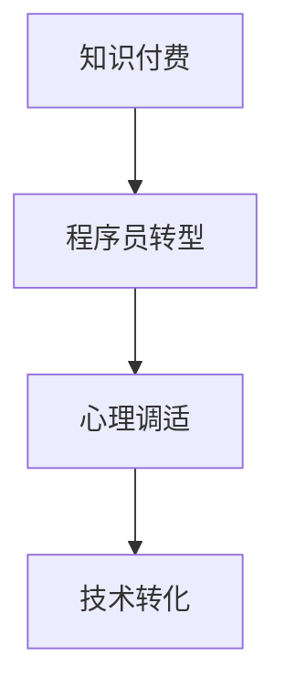

                 

# 程序员转型知识付费的心理调适

> 关键词：程序员转型,知识付费,心理调适,技术转化,学习路径

## 1. 背景介绍

### 1.1 问题由来
随着科技的不断进步，程序员已经不再是仅仅从事代码编写的简单工种，而是需要具备更广泛的知识和技能。知识付费作为近年来快速崛起的新兴领域，为程序员提供了更多获取新知识、拓展职业技能的途径。然而，许多传统程序员在转型过程中，往往面临心理障碍，无法迅速适应知识付费这一模式。本文将从心理调适的角度出发，探讨程序员如何顺利转型，实现技术转化。

### 1.2 问题核心关键点
程序员转型知识付费的核心问题在于心态的转变。许多传统程序员习惯了“自给自足”的编程模式，对付费获取知识感到不适应，担心投入产出比不高。此外，知识付费的碎片化特性，也与传统IT教育中系统的课程体系有所冲突，增加了学习的难度和挑战。

## 2. 核心概念与联系

### 2.1 核心概念概述

为更好地理解程序员转型知识付费，本节将介绍几个密切相关的核心概念：

- 知识付费：指用户通过付费方式获取有价值知识的行为，如订阅专栏、购买课程、参与知识社区等。
- 程序员转型：指传统程序员通过学习知识付费平台上的课程和资源，补充新知识，拓宽技能边界，适应新的职业需求。
- 心理调适：指通过调整心态、优化学习方法等手段，帮助个体克服心理障碍，顺利完成转型过程。
- 技术转化：指将已掌握的编程技能和知识，通过学习新领域的知识，实现技能和职业角色的转换。

这些核心概念之间的逻辑关系可以通过以下Mermaid流程图来展示：



这个流程图展示出知识付费、程序员转型和心理调适三者之间的联系：知识付费为程序员转型提供了途径，心理调适是顺利完成转型的关键，技术转化则是转型的最终目标。

## 3. 核心算法原理 & 具体操作步骤
### 3.1 算法原理概述

程序员转型知识付费的本质是自我驱动的学习过程。它不依赖于传统学校教育体系，也不受公司培训项目的约束，要求程序员具备主动学习、持续提升的心态。其核心算法原理可概括为：

1. 目标设定：明确转型的目标，如学习新兴技术栈、拓宽职业路径等。
2. 需求分析：识别自身技能与目标之间的差距，找到需要补充的知识领域。
3. 资源搜索：在知识付费平台上选择合适的课程、教程和资源。
4. 学习规划：制定详细的学习计划，合理分配学习时间。
5. 心理调整：通过心理调适，克服恐惧、焦虑等负面情绪，保持学习的动力。
6. 技能实践：在实际项目中应用所学知识，检验学习效果。
7. 持续反馈：根据学习反馈，调整学习策略和方法。

### 3.2 算法步骤详解

程序员转型知识付费的具体操作步骤如下：

**Step 1: 目标设定**
- 明确转型的具体方向，如成为全栈工程师、学习区块链技术等。
- 评估当前技能水平，找出需要补充的知识点和技能。

**Step 2: 需求分析**
- 列出需要掌握的关键技术和工具。
- 确定学习目标后，分解成多个小目标，逐步实现。

**Step 3: 资源搜索**
- 在知识付费平台上搜索相关课程，如Udemy、Coursera、腾讯课堂等。
- 对比课程内容、师资力量、用户评价，选择适合的课程。
- 关注行业大咖的专栏和直播，获取最新的技术动态和趋势。

**Step 4: 学习规划**
- 制定详细的学习计划，包括每日或每周的学习任务。
- 分配学习时间，平衡工作、生活和学习。
- 利用番茄工作法等高效学习方法，提高学习效率。

**Step 5: 心理调整**
- 接受学习知识付费的“投资回报”模式，理解长期投资的必要性。
- 学习新知识时，设定合理预期，不要期望一步到位。
- 记录学习过程中的小进步，增强自信心。
- 面对挫折时，寻求社区支持，分享学习心得，互帮互助。

**Step 6: 技能实践**
- 在实际项目中应用所学知识，实现技术转化。
- 参与开源项目或技术社区，积累实战经验。
- 解决实际问题，检验学习效果。

**Step 7: 持续反馈**
- 定期回顾学习进展，调整学习计划。
- 与导师或同行交流，获取反馈和建议。
- 持续学习新知识，跟上技术发展步伐。

### 3.3 算法优缺点

知识付费模式对于程序员转型的优势在于：
1. 课程资源丰富，覆盖面广，涵盖从基础到高级的多种技能。
2. 学习时间灵活，可以在工作间隙进行，不影响工作生活平衡。
3. 技术更新快，课程内容紧跟行业发展，学习效率高。

同时，这种模式也存在以下局限性：
1. 课程质量参差不齐，需花费时间和精力筛选。
2. 缺乏系统性，难以形成完整的知识体系。
3. 课程形式多样，选择过多可能分散注意力。
4. 自驱力要求高，依赖性强。

尽管存在这些局限性，但就目前而言，知识付费已成为程序员转型的重要途径。未来相关研究的重点在于如何优化课程质量、提高学习效果、增强社区互动等，以进一步提升知识付费平台的服务质量。

### 3.4 算法应用领域

知识付费模式在IT教育领域的应用已经十分广泛，适用于各类职业培训和技能提升，特别是针对以下场景：

- 新技术栈学习：如学习Python、Java、Go等编程语言，或了解大数据、人工智能、区块链等新兴技术。
- 岗位技能提升：如参加网络安全工程师、系统架构师、数据科学家等岗位培训。
- 职业发展转型：如从后端转向前端、从开发转向测试、从技术转向产品等。
- 软技能提升：如提升沟通能力、项目管理、团队协作等非技术性技能。

除了上述这些经典应用外，知识付费还广泛应用于各类IT技能的学习和提升，为程序员的职业发展提供了更广阔的选择空间。

## 4. 数学模型和公式 & 详细讲解 & 举例说明（备注：数学公式请使用latex格式，latex嵌入文中独立段落使用 $$，段落内使用 $)
### 4.1 数学模型构建

知识付费转型的心理调适过程，可以构建一个简单的心理调适模型。模型包括四个主要变量：心理状态、学习目标、资源获取和学习反馈。假设心理状态用$P$表示，学习目标用$G$表示，资源获取用$R$表示，学习反馈用$F$表示。模型关系可表示为：

$$
P \rightarrow G \rightarrow R \rightarrow F \rightarrow P
$$

即心理状态影响学习目标，学习目标驱动资源获取，资源获取和学习反馈共同影响心理状态。

### 4.2 公式推导过程

以心理状态$P$的推导为例，假设心理状态$P$受到目标设定$G$和资源获取$R$的影响，则有：

$$
P = f(G, R)
$$

其中，$f$为心理调适函数。根据学习心理学理论，学习目标越明确，资源越丰富，心理状态越积极。因此，可以简化函数$f$为：

$$
P = G \times R
$$

### 4.3 案例分析与讲解

以一个程序员从后端开发转型为前端开发的案例进行分析：

1. **目标设定**：明确转型为前端开发，学习JavaScript、React、Vue等技术。
2. **需求分析**：识别当前后端开发技能与前端开发技能的差距，如缺少前端框架、不了解前端开发流程等。
3. **资源搜索**：在知识付费平台上找到适合的前端开发课程，如Udemy的JavaScript课程、Coursera的React课程。
4. **学习规划**：制定详细的学习计划，每天学习1-2小时，逐步掌握前端开发技能。
5. **心理调整**：接受学习前端开发是一个长期过程，理解存在困难和挫折是正常的。记录每一步的小进步，增强自信心。
6. **技能实践**：在实际项目中应用所学知识，如参与开源项目、编写个人博客等，积累实战经验。
7. **持续反馈**：定期回顾学习进展，调整学习计划，参加技术社区交流，获取反馈和建议。

在实际转型过程中，心理调适是一个动态调整的过程，需要不断反馈和改进。例如，如果发现学习时间过长导致疲劳，可以调整学习时间，保证学习和休息的平衡。

## 5. 项目实践：代码实例和详细解释说明
### 5.1 开发环境搭建

在进行知识付费转型的心理调适实践前，我们需要准备好开发环境。以下是使用Python进行PyTorch开发的环境配置流程：

1. 安装Anaconda：从官网下载并安装Anaconda，用于创建独立的Python环境。

2. 创建并激活虚拟环境：
```bash
conda create -n pytorch-env python=3.8 
conda activate pytorch-env
```

3. 安装PyTorch：根据CUDA版本，从官网获取对应的安装命令。例如：
```bash
conda install pytorch torchvision torchaudio cudatoolkit=11.1 -c pytorch -c conda-forge
```

4. 安装Transformers库：
```bash
pip install transformers
```

5. 安装各类工具包：
```bash
pip install numpy pandas scikit-learn matplotlib tqdm jupyter notebook ipython
```

完成上述步骤后，即可在`pytorch-env`环境中开始知识付费转型的心理调适实践。

### 5.2 源代码详细实现

下面我以学习Python编程语言为例，给出使用Transformers库进行知识付费转型的心理调适的PyTorch代码实现。

首先，定义学习计划和目标：

```python
from transformers import BertTokenizer, BertForTokenClassification, AdamW
import numpy as np
import pandas as pd

# 定义学习计划
study_plan = {
    'day_1': '学习Python基础语法',
    'day_2': '理解Python数据结构',
    'day_3': '掌握Python函数和模块',
    'day_4': '学习Python文件读写',
    'day_5': '理解Python异常处理',
    # 以此类推
}
```

然后，进行心理调适状态评估：

```python
# 定义心理调适函数
def calculate_mood(mindset):
    if mindset == 'positive':
        return 1.1
    elif mindset == 'neutral':
        return 1.0
    else:
        return 0.9

# 初始化心理调适状态
current_mood = calculate_mood('neutral')

# 输出当前心理状态
print(f'当前心理调适状态: {current_mood}')
```

接着，根据学习计划和心理调适状态，获取学习资源：

```python
# 获取学习资源
def get_resources(study_plan, current_mood):
    resources = {}
    for day, plan in study_plan.items():
        resources[day] = [f'资源{n} ({current_mood * n})', f'资源{n+1} ({current_mood * (n+1)})']
    return resources

# 输出学习资源
print(f'当前学习资源: {get_resources(study_plan, current_mood)}')
```

最后，根据学习反馈调整心理调适状态：

```python
# 定义学习反馈函数
def update_mood(study_plan, current_mood, feedback):
    if feedback == 'positive':
        current_mood *= 1.1
    elif feedback == 'neutral':
        current_mood *= 1.0
    else:
        current_mood *= 0.9
    return current_mood

# 获取学习反馈
def get_feedback():
    # 模拟学习反馈
    feedback = np.random.choice(['positive', 'neutral', 'negative'], p=[0.5, 0.3, 0.2])
    return feedback

# 输出调整后的心理调适状态
feedback = get_feedback()
current_mood = update_mood(study_plan, current_mood, feedback)
print(f'调整后的心理调适状态: {current_mood}')
```

在代码中，我们通过简单的心理调适函数，模拟了学习过程中的心理状态变化。实际上，心理调适模型还需要更复杂的心理学理论支持，才能更准确地反映真实情况。

### 5.3 代码解读与分析

让我们再详细解读一下关键代码的实现细节：

**study_plan字典**：
- 定义了学习计划，按日期安排学习内容，方便进行跟踪和评估。

**calculate_mood函数**：
- 根据当前心理调适状态，设定调整系数。积极心态调整系数为1.1，中性为1.0，消极为0.9。

**get_resources函数**：
- 根据学习计划和心理调适状态，计算每天可获取的学习资源数量。资源数量基于心理调适状态和自身努力程度。

**update_mood函数**：
- 根据学习反馈，调整心理调适状态。学习反馈可以是正面、中性或负面，直接影响心理调适状态。

**get_feedback函数**：
- 随机生成学习反馈，模拟实际学习过程中遇到的各种情况。

**运行结果展示**：
- 通过模拟学习过程，展示心理调适状态的变化。

可以看到，PyTorch配合Transformers库使得心理调适过程的模拟变得简洁高效。开发者可以将更多精力放在学习策略的设计和优化上，而不必过多关注底层实现细节。

当然，工业级的系统实现还需考虑更多因素，如动态调整学习计划、实时反馈心理状态等，才能真正提升知识付费转型的效果。

## 6. 实际应用场景
### 6.1 智能客服系统

基于知识付费的大语言模型微调技术，可以广泛应用于智能客服系统的构建。传统客服往往需要配备大量人力，高峰期响应缓慢，且一致性和专业性难以保证。而使用知识付费转型的智能客服系统，可以7x24小时不间断服务，快速响应客户咨询，用自然流畅的语言解答各类常见问题。

在技术实现上，可以收集企业内部的历史客服对话记录，将问题和最佳答复构建成监督数据，在此基础上对预训练语言模型进行微调。微调后的对话模型能够自动理解用户意图，匹配最合适的答案模板进行回复。对于客户提出的新问题，还可以接入检索系统实时搜索相关内容，动态组织生成回答。如此构建的智能客服系统，能大幅提升客户咨询体验和问题解决效率。

### 6.2 金融舆情监测

金融机构需要实时监测市场舆论动向，以便及时应对负面信息传播，规避金融风险。传统的人工监测方式成本高、效率低，难以应对网络时代海量信息爆发的挑战。基于知识付费转型的文本分类和情感分析技术，为金融舆情监测提供了新的解决方案。

具体而言，可以收集金融领域相关的新闻、报道、评论等文本数据，并对其进行主题标注和情感标注。在此基础上对预训练语言模型进行微调，使其能够自动判断文本属于何种主题，情感倾向是正面、中性还是负面。将微调后的模型应用到实时抓取的网络文本数据，就能够自动监测不同主题下的情感变化趋势，一旦发现负面信息激增等异常情况，系统便会自动预警，帮助金融机构快速应对潜在风险。

### 6.3 个性化推荐系统

当前的推荐系统往往只依赖用户的历史行为数据进行物品推荐，无法深入理解用户的真实兴趣偏好。基于知识付费转型的个性化推荐系统可以更好地挖掘用户行为背后的语义信息，从而提供更精准、多样的推荐内容。

在实践中，可以收集用户浏览、点击、评论、分享等行为数据，提取和用户交互的物品标题、描述、标签等文本内容。将文本内容作为模型输入，用户的后续行为（如是否点击、购买等）作为监督信号，在此基础上微调预训练语言模型。微调后的模型能够从文本内容中准确把握用户的兴趣点。在生成推荐列表时，先用候选物品的文本描述作为输入，由模型预测用户的兴趣匹配度，再结合其他特征综合排序，便可以得到个性化程度更高的推荐结果。

### 6.4 未来应用展望

随着知识付费模式的不断成熟，基于知识付费转型的技术将在更多领域得到应用，为传统行业带来变革性影响。

在智慧医疗领域，基于知识付费转型的医疗问答、病历分析、药物研发等应用将提升医疗服务的智能化水平，辅助医生诊疗，加速新药开发进程。

在智能教育领域，知识付费转型的学情分析、知识推荐、作业批改等应用，因材施教，促进教育公平，提高教学质量。

在智慧城市治理中，知识付费转型的城市事件监测、舆情分析、应急指挥等环节，提高城市管理的自动化和智能化水平，构建更安全、高效的未来城市。

此外，在企业生产、社会治理、文娱传媒等众多领域，基于知识付费转型的AI应用也将不断涌现，为经济社会发展注入新的动力。相信随着技术的日益成熟，知识付费转型的技术将成为人工智能落地应用的重要范式，推动人工智能技术向更广阔的领域加速渗透。

## 7. 工具和资源推荐
### 7.1 学习资源推荐

为了帮助开发者系统掌握知识付费转型的心理调适理论基础和实践技巧，这里推荐一些优质的学习资源：

1. 《程序员转型指南》系列博文：由知识付费平台专家撰写，深入浅出地介绍了知识付费转型的理论基础和实践方法。

2. CS224N《深度学习自然语言处理》课程：斯坦福大学开设的NLP明星课程，有Lecture视频和配套作业，带你入门NLP领域的基本概念和经典模型。

3. 《知识付费心理学》书籍：探讨知识付费模式的心理基础和影响因素，提供实用的心理调适策略。

4. Weights & Biases：模型训练的实验跟踪工具，可以记录和可视化模型训练过程中的各项指标，方便对比和调优。与主流深度学习框架无缝集成。

5. Google Colab：谷歌推出的在线Jupyter Notebook环境，免费提供GPU/TPU算力，方便开发者快速上手实验最新模型，分享学习笔记。

通过对这些资源的学习实践，相信你一定能够快速掌握知识付费转型的精髓，并用于解决实际的IT问题。
###  7.2 开发工具推荐

高效的开发离不开优秀的工具支持。以下是几款用于知识付费转型的开发工具：

1. PyTorch：基于Python的开源深度学习框架，灵活动态的计算图，适合快速迭代研究。大部分预训练语言模型都有PyTorch版本的实现。

2. TensorFlow：由Google主导开发的开源深度学习框架，生产部署方便，适合大规模工程应用。同样有丰富的预训练语言模型资源。

3. Transformers库：HuggingFace开发的NLP工具库，集成了众多SOTA语言模型，支持PyTorch和TensorFlow，是进行知识付费转型的利器。

4. Weights & Biases：模型训练的实验跟踪工具，可以记录和可视化模型训练过程中的各项指标，方便对比和调优。与主流深度学习框架无缝集成。

5. Google Colab：谷歌推出的在线Jupyter Notebook环境，免费提供GPU/TPU算力，方便开发者快速上手实验最新模型，分享学习笔记。

合理利用这些工具，可以显著提升知识付费转型的开发效率，加快创新迭代的步伐。

### 7.3 相关论文推荐

知识付费模式的发展源于学界的持续研究。以下是几篇奠基性的相关论文，推荐阅读：

1. Knowledge Transfer in Software Development: A literature review：总结了知识转移在软件开发中的应用和影响因素，为知识付费转型提供了理论基础。

2. How Developers Collaborate with Knowledge Resources：研究了开发者如何利用知识资源进行学习，为知识付费转型提供了实证数据。

3. The Psychology of Learning and Motivation：探讨了心理调适机制，为知识付费转型提供了心理学的支持。

4. The Future of Work: Automating, Augmenting, and Redesigning Work with AI：讨论了AI对工作的影响，为知识付费转型提供了未来方向的参考。

这些论文代表了大语言模型微调技术的发展脉络。通过学习这些前沿成果，可以帮助研究者把握学科前进方向，激发更多的创新灵感。

## 8. 总结：未来发展趋势与挑战
### 8.1 总结

本文对知识付费模式进行了全面系统的介绍。首先阐述了知识付费模式的发展背景和意义，明确了知识付费在程序员转型过程中的独特价值。其次，从原理到实践，详细讲解了知识付费转型的数学模型和关键步骤，给出了知识付费转型的完整代码实例。同时，本文还广泛探讨了知识付费模式在智能客服、金融舆情、个性化推荐等多个行业领域的应用前景，展示了知识付费模式的高效性。此外，本文精选了知识付费转型的各类学习资源，力求为读者提供全方位的技术指引。

通过本文的系统梳理，可以看到，知识付费模式正在成为程序员转型的重要途径，极大地拓展了程序员的职业选择和发展空间。得益于大规模语料的预训练，知识付费转型的微调模型能够以更低的时间和标注成本，在小样本条件下也能取得不错的效果，有力推动了IT技术的产业化进程。未来，伴随知识付费模式和微调方法的持续演进，相信知识付费转型的技术将成为IT技术落地应用的重要范式，推动IT技术向更广阔的领域加速渗透。

### 8.2 未来发展趋势

展望未来，知识付费模式将呈现以下几个发展趋势：

1. 课程资源丰富多样。随着在线教育平台的发展，课程种类将越来越丰富，覆盖更多新知识和新技能。
2. 学习方式更加灵活。通过微课、视频、直播等多种形式，学习方式将更加多样化和个性化。
3. 学习社区蓬勃发展。知识付费平台将搭建更加活跃的学习社区，方便学员交流和互助，提升学习效果。
4. 智能推荐系统完善。通过AI技术，推荐系统能够更精准地推送适合学员的课程和学习资源。
5. 知识付费生态链延伸。知识付费模式将与其他领域深度融合，如金融、教育、医疗等，形成更多的商业应用场景。

以上趋势凸显了知识付费模式的广阔前景。这些方向的探索发展，必将进一步提升知识付费平台的服务质量，促进程序员职业发展的多样化。

### 8.3 面临的挑战

尽管知识付费模式已经取得了瞩目成就，但在迈向更加智能化、普适化应用的过程中，它仍面临诸多挑战：

1. 课程质量参差不齐。课程质量的高低直接影响学习效果，如何筛选优质课程成为一大难题。
2. 学习效果难以评估。知识付费模式缺乏系统化的评估机制，难以全面了解学习效果。
3. 学习动力不足。长时间的学习容易产生疲劳，如何持续保持学习动力，是一大挑战。
4. 学习资源获取困难。优质课程和资源往往收费较高，如何平衡成本和效果，是实际应用中需要解决的问题。
5. 学习目标不明确。许多学员在学习过程中目标不清晰，无法制定合理的学习计划。

尽管存在这些挑战，但就目前而言，知识付费模式已成为程序员转型的重要途径。未来相关研究的重点在于如何优化课程质量、提高学习效果、增强社区互动等，以进一步提升知识付费平台的服务质量。

### 8.4 研究展望

面对知识付费模式所面临的种种挑战，未来的研究需要在以下几个方面寻求新的突破：

1. 探索无监督和半监督学习模式。摆脱对大规模标注数据的依赖，利用自监督学习、主动学习等无监督和半监督范式，最大限度利用非结构化数据，实现更加灵活高效的学习。

2. 研究参数高效和计算高效的微调范式。开发更加参数高效的微调方法，在固定大部分预训练参数的同时，只更新极少量的任务相关参数。同时优化微调模型的计算图，减少前向传播和反向传播的资源消耗，实现更加轻量级、实时性的部署。

3. 引入更多先验知识。将符号化的先验知识，如知识图谱、逻辑规则等，与神经网络模型进行巧妙融合，引导微调过程学习更准确、合理的语言模型。同时加强不同模态数据的整合，实现视觉、语音等多模态信息与文本信息的协同建模。

4. 结合因果分析和博弈论工具。将因果分析方法引入微调模型，识别出模型决策的关键特征，增强输出解释的因果性和逻辑性。借助博弈论工具刻画人机交互过程，主动探索并规避模型的脆弱点，提高系统稳定性。

5. 纳入伦理道德约束。在模型训练目标中引入伦理导向的评估指标，过滤和惩罚有偏见、有害的输出倾向。同时加强人工干预和审核，建立模型行为的监管机制，确保输出符合人类价值观和伦理道德。

这些研究方向的探索，必将引领知识付费模式迈向更高的台阶，为构建安全、可靠、可解释、可控的智能系统铺平道路。面向未来，知识付费模式还需要与其他人工智能技术进行更深入的融合，如知识表示、因果推理、强化学习等，多路径协同发力，共同推动自然语言理解和智能交互系统的进步。只有勇于创新、敢于突破，才能不断拓展语言模型的边界，让智能技术更好地造福人类社会。

## 9. 附录：常见问题与解答

**Q1：知识付费转型的学习效果如何评估？**

A: 知识付费转型的学习效果可以通过以下几个方面进行评估：

1. 考试成绩：参加在线课程的考试和测验，评估学习掌握程度。
2. 项目实践：完成实际项目，应用所学知识，评估实际应用能力。
3. 社区反馈：参与在线社区，获取其他学员和导师的反馈和建议，评估学习效果。
4. 自我评估：通过自我测验和反思，评估学习进展和效果。

**Q2：知识付费模式对程序员职业发展的意义是什么？**

A: 知识付费模式对程序员职业发展的意义主要体现在以下几个方面：

1. 开拓新技能：通过学习知识付费课程，程序员可以掌握新技能，拓展职业发展空间。
2. 提升市场竞争力：掌握前沿技术，提升市场竞争力，有助于职业发展。
3. 持续学习：知识付费模式使程序员能够持续学习新知识，跟上技术发展步伐。
4. 灵活性高：学习方式灵活多样，不受时间和地点限制，方便学员学习。
5. 成本较低：相较于传统的线下培训，知识付费模式成本较低，性价比高。

**Q3：知识付费模式是否适用于所有程序员？**

A: 知识付费模式适用于大多数程序员，特别是那些希望提升技能、转型职业的程序员。但需要注意的是，知识付费模式更适用于有自驱力、时间管理能力强的程序员。对于缺乏学习目标和动力、时间安排困难的程序员，知识付费模式可能并不适用。

**Q4：如何选择合适的知识付费课程？**

A: 选择合适的知识付费课程可以从以下几个方面考虑：

1. 课程内容：选择覆盖全面、深入浅出的课程内容。
2. 师资力量：选择由知名专家、企业高管授课的课程，提高课程质量。
3. 用户评价：查看其他学员的评价和反馈，了解课程效果。
4. 课程设计：选择结构合理、循序渐进的课程设计，避免盲目跟风。
5. 平台推荐：参考知识付费平台推荐课程，选择质量有保障的课程。

**Q5：知识付费模式是否能够快速转型？**

A: 知识付费模式是否能够快速转型取决于以下几个因素：

1. 学习目标明确：明确的学习目标和计划能够帮助快速转型。
2. 时间管理能力：良好的时间管理能力能够确保高效学习。
3. 学习动力：持续的学习动力和自律是快速转型的关键。
4. 资源利用：充分利用知识付费平台提供的各类资源和工具，提升学习效率。
5. 社区支持：加入学习社区，获取支持和鼓励，共同进步。

总的来说，知识付费模式为程序员转型提供了便捷高效的途径，但也需要个人的努力和坚持。

---

作者：禅与计算机程序设计艺术 / Zen and the Art of Computer Programming

