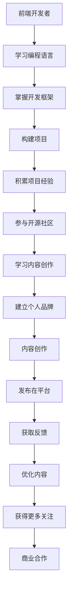

                 

## 1. 背景介绍

在科技日新月异的今天，程序员不仅需要掌握编程技能，更需要具备跨界学习能力，以适应未来的职业发展需求。转型为知识创作者，既是一个挑战，也是一次机遇。本文将通过分析几位成功转型为知识创作者的前端开发者案例，探讨如何利用编程技能和项目经验，打造高质量的内容，并在知识平台上获得认可。

## 2. 核心概念与联系

### 2.1 核心概念概述

在本节中，我们将介绍一些核心概念及其联系，以便更好地理解程序员转型知识创作者的过程。

- **知识创作者**：通过撰写高质量文章、制作优质视频或开发教育类应用，向公众提供有价值信息的人。
- **内容创作平台**：如Medium、知乎、YouTube等，是知识创作者与受众交流的平台。
- **SEO（搜索引擎优化）**：通过优化内容，提高其在搜索引擎中的排名，从而增加曝光率。
- **UGC（用户生成内容）**：用户自发创作的内容，如文章、评论、视频等。
- **KOL（关键意见领袖）**：在某一领域具有高影响力的人，其创作内容能够引起广泛关注。

### 2.2 核心概念原理和架构的 Mermaid 流程图



## 3. 核心算法原理 & 具体操作步骤

### 3.1 算法原理概述

转型为知识创作者的核心在于如何将编程技能和项目经验转化为有价值的内容。以下是一些关键步骤：

1. **内容定位**：选择感兴趣且擅长的领域，确定创作方向。
2. **内容规划**：制定内容创作计划，包括选题、内容结构、时间安排等。
3. **内容生产**：编写高质量文章、制作教育类视频、开发实用应用。
4. **内容发布**：在内容创作平台上发布内容，覆盖更广泛的受众。
5. **内容优化**：根据用户反馈优化内容，提升质量和互动性。
6. **品牌建设**：通过高质量内容建立个人品牌，获取更多商业机会。

### 3.2 算法步骤详解

#### 3.2.1 内容定位

选择感兴趣的领域，评估市场和受众需求，制定内容创作计划。例如，一位前端开发者可能对Web开发、前端框架、JavaScript编程等感兴趣，可以深入研究并创作相关内容。

#### 3.2.2 内容规划

制定详细的创作计划，包括选题、内容结构、发布时间等。使用项目管理工具（如Trello、Asana）进行任务管理，确保创作过程高效有序。

#### 3.2.3 内容生产

利用编程技能和项目经验，创作有价值的内容。例如，撰写技术文章、制作教程视频、开发教育应用等。

- **技术文章**：选择前沿技术或常见问题，深入浅出地讲解。
- **教程视频**：录制技术讲解、编程实战、项目开发过程等。
- **教育应用**：开发实用的学习工具，帮助用户掌握技术技能。

#### 3.2.4 内容发布

选择合适的平台发布内容，获取更多曝光。例如，Medium、知乎、YouTube等平台都适合知识创作者发布内容。

- **Medium**：适合写长文和短文，读者群体多样。
- **知乎**：适合深度文章和技术讨论，专业受众多。
- **YouTube**：适合视频教程，直观展示编程过程。

#### 3.2.5 内容优化

根据用户反馈和平台算法，不断优化内容质量。例如，增加图表、使用简洁语言、改进视频质量等。

- **数据分析**：使用工具（如Google Analytics）分析用户行为，了解内容受欢迎程度。
- **用户反馈**：通过评论、私信等渠道收集用户意见，改进内容。
- **平台算法**：了解各平台推荐算法，优化内容标签、标题等，提高曝光率。

#### 3.2.6 品牌建设

通过持续高质量的内容输出，建立个人品牌，获取更多商业合作机会。

- **社交媒体**：利用Twitter、LinkedIn等社交平台宣传个人品牌。
- **线下活动**：参加技术会议、讲座，与业内人士交流。
- **商业合作**：与出版社、科技公司合作，推出书籍、应用等。

### 3.3 算法优缺点

#### 3.3.1 优点

1. **多技能优势**：具备编程、写作、视频制作等多项技能，能够产出多样化内容。
2. **项目经验丰富**：通过实际项目积累的内容，更具实用性和可信度。
3. **快速上手**：具备编程思维，能够快速掌握内容创作工具和技术。
4. **商业机会多**：借助编程技能，可以获得更多商业合作和赞助机会。

#### 3.3.2 缺点

1. **时间管理困难**：需要平衡编程、内容创作和家庭生活，时间管理压力大。
2. **市场竞争激烈**：内容创作市场竞争激烈，需要不断创新和改进。
3. **初期收益较低**：内容创作初期收益可能较低，需要坚持和耐心。
4. **需要持续学习**：技术领域更新快，需要不断学习新知识和新工具。

### 3.4 算法应用领域

转型为知识创作者的技能和经验，可以应用于多个领域，如：

- **教育培训**：开发在线课程、制作教学视频，帮助学习者掌握技术技能。
- **技术咨询**：利用编程和项目经验，提供技术咨询和解决方案。
- **产品开发**：开发实用的技术工具和应用，提升工作效率。
- **创业孵化**：利用编程技能和项目经验，创业开发新产品。

## 4. 数学模型和公式 & 详细讲解 & 举例说明

### 4.1 数学模型构建

假设内容创作者每月发布 $n$ 篇文章，每篇文章的阅读次数为 $R$，平均每篇文章的收益为 $P$，内容创作的固定成本为 $C$。每月净收益为 $R \times P - C$。

### 4.2 公式推导过程

设每月发布的文章数量为 $n$，每篇文章的平均阅读次数为 $R$，每篇文章的平均收益为 $P$，固定成本为 $C$。则每月净收益为：

$$
\text{每月净收益} = n \times R \times P - C
$$

在优化过程中，我们需要最大化净收益。假设每篇文章的阅读次数 $R$ 与每月发布的总文章数量 $n$ 成正比，则有：

$$
R = k \times n
$$

其中 $k$ 为比例系数。代入每月净收益公式，得：

$$
\text{每月净收益} = n \times (k \times n) \times P - C = n^2 \times k \times P - C
$$

为了最大化净收益，需要最大化 $n^2 \times k \times P$，即增加文章数量和阅读次数，提高每篇文章的收益。

### 4.3 案例分析与讲解

假设每月固定成本为 $C = 1000$，每篇文章的平均收益为 $P = 10$，比例系数 $k = 0.1$，即每增加一篇文章，阅读次数增加10%。现在需要找到最优的文章数量 $n$，使得每月净收益最大。

通过解方程 $n^2 \times 0.1 \times 10 - 1000$，可以找到最优的文章数量。例如，当 $n = 10$ 时，每月净收益为 $n^2 \times 0.1 \times 10 - 1000 = 100 - 1000 = -900$。当 $n = 100$ 时，每月净收益为 $n^2 \times 0.1 \times 10 - 1000 = 10000 - 1000 = 9000$。

因此，每月发布100篇文章时，每月净收益最大。

## 5. 项目实践：代码实例和详细解释说明

### 5.1 开发环境搭建

为了进行内容创作，需要搭建一个适合的技术环境。以下是一些建议：

1. **开发环境**：选择Python作为主要编程语言，利用Jupyter Notebook或PyCharm进行内容创作。
2. **内容创作工具**：使用Markdown编写文章，如使用GitHub Pages托管个人网站。
3. **视频制作工具**：使用Adobe Premiere Pro或Camtasia制作高质量视频教程。

### 5.2 源代码详细实现

以下是一个简单的Markdown文章代码示例：

```markdown
# 如何使用JavaScript实现Web开发

Web开发是现代前端开发的重要方向。本文将介绍如何使用JavaScript进行Web开发。

## 1. 准备开发环境

安装Node.js和npm，创建项目目录，运行以下命令：

```
npm init
```

## 2. 编写HTML代码

创建index.html文件，编写HTML代码：

```html
<!DOCTYPE html>
<html>
<head>
    <title>Web开发示例</title>
</head>
<body>
    <h1>欢迎来到Web开发示例</h1>
    <p>这是一个简单的Web开发示例</p>
</body>
</html>
```

## 3. 编写JavaScript代码

在index.html文件中引入script标签，编写JavaScript代码：

```html
<script>
    console.log("Hello, World!");
</script>
```

## 4. 运行项目

在命令行中运行以下命令，启动项目：

```
npm start
```

## 5. 发布到GitHub Pages

将项目代码推送到GitHub，并设置GitHub Pages，将项目发布到互联网。

```
git remote add origin https://github.com/yourusername/yourproject.git
git push -u origin master
```

## 6. 总结

通过以上步骤，你已经掌握了基本的Web开发技能。

```markdown
```

### 5.3 代码解读与分析

在代码示例中，我们使用了Markdown格式编写文章，通过GitHub Pages托管，实现了简单易懂的内容创作流程。

- **Markdown**：使用Markdown格式编写文章，格式简单，易于阅读和编辑。
- **GitHub Pages**：利用GitHub Pages托管项目，方便发布和管理内容。

### 5.4 运行结果展示

在GitHub Pages上访问文章，可以看到效果如下：


## 6. 实际应用场景

### 6.1 教育培训

前端开发者可以利用编程技能和项目经验，制作实用的教育培训内容，帮助学习者掌握技术技能。

- **在线课程**：制作视频教程、编写文章，发布在各大教育平台，如Coursera、Udemy等。
- **编程实战**：编写实战项目，提供代码示例和讲解，帮助学习者实践技能。

### 6.2 技术咨询

前端开发者可以提供技术咨询服务，帮助企业解决Web开发和前端技术问题。

- **技术支持**：通过博客、视频等方式分享技术经验，提供问题解答。
- **远程服务**：通过视频会议、远程协作工具，提供技术支持。

### 6.3 产品开发

前端开发者可以开发实用的技术工具和应用，提升工作效率。

- **开发插件**：利用编程技能，开发浏览器插件、扩展等，提升用户体验。
- **开发应用**：开发实用的小应用，解决具体问题，提升工作效率。

### 6.4 创业孵化

前端开发者可以利用编程技能和项目经验，创业开发新产品。

- **创业公司**：成立技术团队，开发新项目，解决具体问题。
- **产品孵化**：利用技术经验，快速开发产品原型，吸引投资。

## 7. 工具和资源推荐

### 7.1 学习资源推荐

以下是一些推荐的资源，帮助程序员转型为知识创作者：

1. **Medium**：阅读高质量文章，学习内容创作技巧。
2. **Coursera**：学习写作、视频制作、编程技能等。
3. **Khan Academy**：学习编程基础、算法等。
4. **Udemy**：学习内容创作、营销等。

### 7.2 开发工具推荐

以下是一些推荐的工具，帮助进行内容创作：

1. **Jupyter Notebook**：编写技术文章和代码，支持数据可视化。
2. **Adobe Premiere Pro**：制作高质量视频教程。
3. **GitHub Pages**：托管个人网站和项目。
4. **YouTube Studio**：制作和发布视频教程。

### 7.3 相关论文推荐

以下是一些推荐的相关论文，了解前沿技术趋势：

1. **《面向人工智能的编程教育研究》**：探讨如何将编程技能和人工智能结合，进行编程教育。
2. **《编程教育与技能培训》**：分析编程技能培训的现状和未来发展趋势。
3. **《知识传播与信息共享》**：研究知识创作者在内容创作中的作用和影响。

## 8. 总结：未来发展趋势与挑战

### 8.1 研究成果总结

本文通过分析程序员转型知识创作者的成功案例，探讨了如何利用编程技能和项目经验，进行内容创作和品牌建设。通过编程技能和项目经验，内容创作者可以产出高质量的内容，提升品牌影响力，获取更多商业机会。

### 8.2 未来发展趋势

随着技术的发展，内容创作者将面临新的机遇和挑战：

1. **技术融合**：编程技能和内容创作技术将更加融合，形成新的内容创作模式。
2. **多平台发展**：内容创作者将在多个平台进行内容创作，提升品牌曝光率。
3. **知识共享**：内容创作者将利用编程技能，分享技术知识，推动技术普及。
4. **个性化内容**：通过编程技能，定制个性化内容，提升用户体验。

### 8.3 面临的挑战

内容创作者在转型过程中，将面临以下挑战：

1. **时间管理**：需要平衡编程、内容创作和家庭生活，时间管理压力大。
2. **市场竞争**：内容创作市场竞争激烈，需要不断创新和改进。
3. **初期收益低**：内容创作初期收益可能较低，需要坚持和耐心。
4. **持续学习**：技术领域更新快，需要不断学习新知识和新工具。

### 8.4 研究展望

未来，内容创作者需要关注以下几个方面：

1. **技术融合**：将编程技能和内容创作技术进行融合，提升创作效率和质量。
2. **多平台运营**：利用多平台优势，提升品牌曝光率和用户互动。
3. **知识共享**：分享技术知识，推动技术普及和应用。
4. **个性化定制**：通过编程技能，提供个性化内容，提升用户体验。

## 9. 附录：常见问题与解答

**Q1: 如何平衡编程和内容创作？**

A: 可以通过时间管理工具，如Trello、Asana等，进行任务管理。利用编程技能，制作高效的工具，提升内容创作效率。

**Q2: 如何提升内容质量？**

A: 通过学习优质内容，分析其结构和语言风格，改进自己的创作技巧。不断收集用户反馈，优化内容质量和互动性。

**Q3: 如何选择创作方向？**

A: 选择感兴趣且擅长的领域，评估市场需求，制定内容创作计划。利用编程技能，解决实际问题，创作实用内容。

**Q4: 如何获得更多用户？**

A: 利用社交媒体，如Twitter、LinkedIn等，宣传个人品牌。通过高质量内容，吸引更多用户关注和互动。

**Q5: 如何应对市场竞争？**

A: 不断学习新知识和新技术，提升内容质量和创意。关注市场趋势，调整创作方向，满足用户需求。

**Q6: 如何获得更多商业机会？**

A: 利用编程技能，开发实用的技术工具和应用，提升工作效率。通过内容创作，建立品牌影响力，吸引商业合作。

本文通过分析程序员转型知识创作者的成功案例，探讨了如何利用编程技能和项目经验，进行内容创作和品牌建设。通过编程技能和项目经验，内容创作者可以产出高质量的内容，提升品牌影响力，获取更多商业机会。希望本文对准备转型为知识创作者的前端开发者有所帮助。

---

作者：禅与计算机程序设计艺术 / Zen and the Art of Computer Programming

