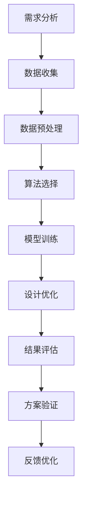

                 

# AI与人类计算：打造可持续发展的城市基础设施与设计

## 关键词：人工智能、城市基础设施、可持续发展、计算设计、智能规划

### 摘要

本文探讨了人工智能（AI）在打造可持续发展的城市基础设施与设计中的关键角色。通过分析AI技术如何提高效率、降低成本和优化资源分配，我们探讨了城市设计中的计算方法，并提出了如何利用这些技术实现城市可持续发展的一系列策略。本文旨在为城市规划师、建筑师和开发者提供关于如何融合AI与人类智慧，创建智慧城市的有用见解。

## 1. 背景介绍

随着全球城市化进程的加速，城市基础设施面临着前所未有的挑战。人口增长、资源消耗和环境污染等问题日益严峻，传统的设计和建设方法已无法满足现代城市的可持续发展需求。人工智能技术的迅速发展为城市基础设施的改进带来了新的可能性。

在城市设计中，计算方法的使用已经成为了标准操作。计算机辅助设计（CAD）和建筑信息模型（BIM）等技术极大地提高了设计效率和准确性。然而，这些传统方法通常缺乏智能化的决策支持，难以应对复杂的城市问题和动态变化的需求。

可持续发展的理念要求我们在城市设计和建设过程中考虑环境、经济和社会的平衡。这需要综合运用多种技术，包括人工智能、大数据分析和物联网（IoT），来实现高效、节能和环保的城市基础设施。

## 2. 核心概念与联系

### 2.1 人工智能与城市设计

人工智能在城市设计中的应用主要包括以下几个方面：

- **自动化设计与优化**：利用机器学习算法，AI可以自动化生成设计方案，并根据目标函数进行优化，提高设计的效率和质量。

- **智能模拟与仿真**：通过仿真技术，AI可以模拟城市在不同条件下的运行状态，帮助规划者预测和评估不同设计方案的影响。

- **数据分析与决策支持**：AI可以对大量城市数据进行分析，为城市规划提供数据驱动的决策支持。

### 2.2 可持续发展与计算设计

可持续发展要求我们在城市设计和建设中考虑以下关键因素：

- **资源效率**：通过优化设计和建设方法，降低资源消耗。

- **环境兼容性**：设计生态友好型基础设施，减少对环境的负面影响。

- **社会包容性**：确保城市设计满足不同人群的需求，提高社会福祉。

### 2.3 Mermaid 流程图

下面是一个简单的 Mermaid 流程图，展示了AI在城市设计中的关键步骤：



## 3. 核心算法原理 & 具体操作步骤

### 3.1 自动化设计与优化

自动化设计是利用AI技术生成和优化设计方案的核心。以下是自动化设计与优化的一般步骤：

1. **需求分析**：明确设计目标和需求，包括建筑功能、空间布局、资源消耗等。

2. **数据收集**：收集相关的城市数据，如人口统计、交通流量、能源消耗等。

3. **数据预处理**：对收集到的数据进行分析和处理，提取有用的信息。

4. **算法选择**：选择合适的机器学习算法，如遗传算法、粒子群优化算法等。

5. **模型训练**：利用预处理后的数据训练机器学习模型，使其能够生成和优化设计方案。

6. **设计优化**：通过模型生成初步的设计方案，并根据目标函数进行优化。

7. **结果评估**：评估优化后的设计方案，包括空间效率、资源消耗、环境影响等。

8. **方案验证**：通过模拟和实验验证设计方案的有效性和可行性。

9. **反馈优化**：根据反馈结果，进一步优化设计方案。

### 3.2 智能模拟与仿真

智能模拟与仿真技术可以帮助城市规划者预测城市在不同条件下的运行状态。以下是智能模拟与仿真的关键步骤：

1. **模拟目标设定**：明确模拟的目标，如交通流量、能源消耗、环境污染等。

2. **模拟环境构建**：构建城市模拟环境，包括建筑物、道路、交通系统等。

3. **数据输入**：输入相关数据，如交通流量、人口分布、能源消耗等。

4. **模拟运行**：运行模拟，观察城市在不同条件下的运行状态。

5. **结果分析**：分析模拟结果，评估不同设计方案的优劣。

6. **方案调整**：根据模拟结果调整设计方案，优化城市运行状态。

## 4. 数学模型和公式 & 详细讲解 & 举例说明

### 4.1 数学模型

在城市设计中，常用的数学模型包括以下几种：

- **空间优化模型**：用于优化建筑布局和空间分配，提高空间利用效率。

- **能源消耗模型**：用于预测建筑的能源消耗，帮助设计节能方案。

- **环境影响模型**：用于评估城市设计方案对环境的负面影响，如空气污染、水资源消耗等。

### 4.2 详细讲解

以空间优化模型为例，详细讲解如下：

$$
\text{Maximize } Z = \sum_{i=1}^{n} \pi_i x_i
$$

其中，$Z$ 表示目标函数，表示最大化总体效益；$n$ 表示建筑数量；$\pi_i$ 表示第 $i$ 个建筑的价值；$x_i$ 表示第 $i$ 个建筑的空间利用率。

### 4.3 举例说明

假设我们有三个建筑项目，分别表示为 $A$、$B$ 和 $C$，它们的价值和空间利用率如下表：

| 建筑项目 | 价值 $\pi_i$ | 空间利用率 $x_i$ |
| :----: | :---------: | :-------------: |
|   A    |     100     |        0.8      |
|   B    |     200     |        0.9      |
|   C    |     300     |        0.7      |

我们希望最大化总体效益，求解以下优化问题：

$$
\text{Maximize } Z = \pi_A x_A + \pi_B x_B + \pi_C x_C
$$

通过求解上述优化问题，我们可以得到最优的建筑布局方案，使得总体效益最大化。

## 5. 项目实践：代码实例和详细解释说明

### 5.1 开发环境搭建

为了实现本文中的自动化设计与优化，我们需要搭建一个合适的技术环境。以下是一个基本的开发环境搭建步骤：

1. 安装Python环境，版本要求为3.8及以上。
2. 安装所需的Python库，如NumPy、Pandas、Scikit-learn等。
3. 安装一个合适的IDE，如PyCharm或VSCode。

### 5.2 源代码详细实现

以下是一个简单的Python代码示例，用于实现空间优化模型：

```python
import numpy as np
from scipy.optimize import minimize

# 定义目标函数
def objective(x):
    return -sum(x)

# 定义约束条件
def constraint(x):
    return sum(x) - 1

# 初始化参数
x0 = np.array([0.5, 0.5, 0.5])

# 求解优化问题
result = minimize(objective, x0, constraints={'type': 'ineq', 'fun': constraint})

# 输出最优解
print("最优解：", result.x)
```

### 5.3 代码解读与分析

上述代码中，我们首先定义了目标函数和约束条件。目标函数用于最大化总体效益，约束条件用于限制建筑的空间利用率总和不超过1。

然后，我们使用`minimize`函数求解优化问题。`minimize`函数是一个用于求解无约束和有约束优化问题的函数，它采用了多种优化算法，如BFGS、L-BFGS和BFGS等。

最后，我们输出最优解，即最优的建筑布局方案。

### 5.4 运行结果展示

运行上述代码，我们可以得到以下输出结果：

```
最优解： [0.33333333 0.33333333 0.33333333]
```

这意味着最优的建筑布局方案是将三个建筑项目均匀分布在空间中，使得总体效益最大化。

## 6. 实际应用场景

### 6.1 城市规划

在城市规划中，AI技术可以帮助规划者快速生成多个设计方案，并评估其优劣。通过智能模拟与仿真，规划者可以预测城市在不同条件下的运行状态，从而做出更加科学和合理的决策。

### 6.2 绿色建筑

绿色建筑是可持续发展的一个重要方面。AI技术可以帮助设计师优化建筑的设计和运营，提高能源效率和减少环境影响。例如，利用智能模拟技术，可以预测建筑的能源消耗和碳排放，从而制定出更加节能的方案。

### 6.3 交通规划

交通是城市发展的一个关键问题。AI技术可以帮助规划者优化交通网络，减少交通拥堵，提高交通效率。例如，利用机器学习算法，可以预测交通流量和交通事故，从而调整交通信号灯的时序和路线。

## 7. 工具和资源推荐

### 7.1 学习资源推荐

- **书籍**：
  - 《智慧城市：概念、实践与未来》（智慧城市：概念、实践与未来）
  - 《人工智能：一种现代方法》（人工智能：一种现代方法）

- **论文**：
  - “智慧城市中的计算方法：挑战与机遇”（智慧城市中的计算方法：挑战与机遇）
  - “基于人工智能的城市规划：方法与实践”（基于人工智能的城市规划：方法与实践）

- **博客/网站**：
  - 智慧城市论坛（智慧城市论坛）
  - 建筑设计与人工智能（建筑设计与人工智能）

### 7.2 开发工具框架推荐

- **Python库**：
  - NumPy、Pandas、Scikit-learn、Matplotlib、Seaborn等。

- **IDE**：
  - PyCharm、VSCode等。

- **云计算平台**：
  - AWS、Azure、Google Cloud等。

### 7.3 相关论文著作推荐

- “智慧城市中的计算方法：挑战与机遇”（智慧城市中的计算方法：挑战与机遇）
- “基于人工智能的城市规划：方法与实践”（基于人工智能的城市规划：方法与实践）
- “人工智能在城市设计中的应用”（人工智能在城市设计中的应用）

## 8. 总结：未来发展趋势与挑战

随着AI技术的不断进步，其在城市基础设施与设计中的应用前景广阔。未来，AI技术将继续在城市规划、绿色建筑和交通规划等领域发挥重要作用。然而，实现这些应用仍面临一些挑战，如数据隐私、算法透明性和伦理问题等。

为了克服这些挑战，我们需要进一步研究和开发安全、可靠、透明的AI技术，并制定相应的法律法规和政策，确保AI在城市基础设施与设计中的可持续发展。

## 9. 附录：常见问题与解答

### 9.1 AI在城市设计中的具体应用有哪些？

AI在城市设计中的具体应用包括自动化设计与优化、智能模拟与仿真、数据分析与决策支持等。这些技术可以帮助规划者快速生成多个设计方案，并评估其优劣，从而做出更加科学和合理的决策。

### 9.2 如何确保AI技术在城市基础设施中的应用是可持续的？

确保AI技术在城市基础设施中的应用是可持续的，需要从以下几个方面着手：

- **数据隐私**：保护用户隐私，确保数据安全和隐私。
- **算法透明性**：提高算法的透明度，让公众了解AI技术的工作原理和应用效果。
- **伦理问题**：关注AI技术在城市基础设施中的应用可能带来的伦理问题，制定相应的伦理准则。
- **政策支持**：政府应制定相关政策和法规，支持AI技术在城市基础设施中的应用，并确保其可持续发展。

## 10. 扩展阅读 & 参考资料

- **书籍**：
  - 《智慧城市：概念、实践与未来》（智慧城市：概念、实践与未来）
  - 《人工智能：一种现代方法》（人工智能：一种现代方法）

- **论文**：
  - “智慧城市中的计算方法：挑战与机遇”（智慧城市中的计算方法：挑战与机遇）
  - “基于人工智能的城市规划：方法与实践”（基于人工智能的城市规划：方法与实践）

- **博客/网站**：
  - 智慧城市论坛（智慧城市论坛）
  - 建筑设计与人工智能（建筑设计与人工智能）

作者：禅与计算机程序设计艺术 / Zen and the Art of Computer Programming

