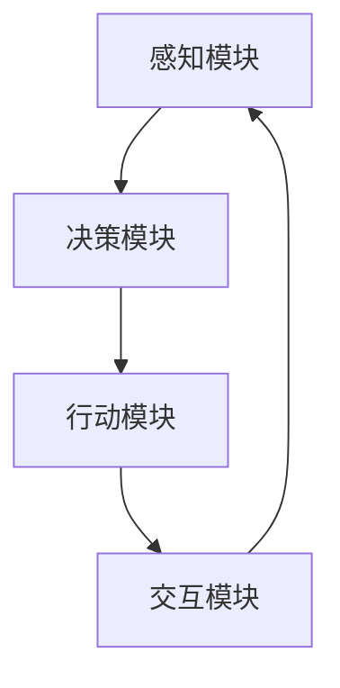

                 

# AI人工智能 Agent：对国家安全的影响

> 关键词：人工智能，国家安全，AI Agent，风险评估，政策建议，国际合作

> 摘要：本文探讨了人工智能（AI） Agent 在国家安全领域的潜在影响，分析了其在军事、情报、网络防御等领域的应用。通过评估 AI Agent 可能带来的风险，本文提出了相应的政策建议和国际合作策略，以保障国家的安全与稳定。

## 1. 背景介绍（Background Introduction）

随着人工智能技术的迅速发展，AI Agent 已成为学术界和工业界的研究热点。AI Agent 是一种具有自主决策能力的智能实体，能够在复杂环境中执行任务，并与其他系统进行交互。这种技术具有广泛的应用前景，但在国家安全领域的影响也日益显著。

国家安全是国家的核心利益，涵盖了军事、政治、经济、科技等多个领域。在信息化、网络化、智能化的时代背景下，人工智能技术对国家安全提出了新的挑战和机遇。本文旨在探讨 AI Agent 在国家安全领域的影响，为相关政策的制定提供参考。

## 2. 核心概念与联系（Core Concepts and Connections）

### 2.1 AI Agent 的定义与分类

AI Agent，即人工智能代理，是一种模拟人类智能行为的软件实体。根据其功能和应用场景，AI Agent 可分为以下几类：

1. **军事领域 AI Agent**：用于侦察、指挥、决策等任务，如无人机、无人舰艇等。
2. **情报领域 AI Agent**：用于信息收集、分析、预测等任务，如智能监测、网络攻击等。
3. **网络防御 AI Agent**：用于网络安全防护、攻击检测等任务，如入侵检测系统、自动化响应系统等。

### 2.2 AI Agent 与国家安全的关系

AI Agent 在国家安全领域的应用，一方面提高了军事、情报、网络防御等领域的效率和能力，另一方面也带来了潜在的风险。例如：

1. **技术可控性**：AI Agent 的自主决策能力可能超出人类预期，导致技术失控。
2. **信息安全**：AI Agent 可能成为网络攻击的工具，危害国家安全。
3. **军事战略**：AI Agent 的广泛应用可能改变军事战略格局，影响国家安全。

### 2.3 AI Agent 的架构与实现

AI Agent 的架构主要包括感知模块、决策模块、行动模块和交互模块。感知模块负责收集环境信息；决策模块根据感知模块提供的信息进行决策；行动模块根据决策模块的指令执行任务；交互模块负责与其他系统进行通信。

实现 AI Agent 的关键技术包括机器学习、自然语言处理、计算机视觉等。这些技术的不断发展，为 AI Agent 在国家安全领域的应用提供了强有力的支持。

### 2.4 Mermaid 流程图（Mermaid Flowchart）

下面是一个简单的 Mermaid 流程图，展示了 AI Agent 的工作流程：



## 3. 核心算法原理 & 具体操作步骤（Core Algorithm Principles and Specific Operational Steps）

### 3.1 决策算法

AI Agent 的核心是决策算法，其目标是在给定的环境信息下，选择最优的行动方案。常见的决策算法包括：

1. **基于规则的方法**：利用预定义的规则进行决策。
2. **基于机器学习的方法**：通过训练数据学习环境与行动之间的关系。
3. **基于博弈的方法**：考虑对手的行为进行决策。

### 3.2 具体操作步骤

以军事领域 AI Agent 为例，具体操作步骤如下：

1. **感知阶段**：AI Agent 收集战场信息，如敌方位置、火力分布等。
2. **决策阶段**：基于收集到的信息，AI Agent 通过决策算法选择最优行动方案。
3. **行动阶段**：AI Agent 根据决策结果执行任务，如发起攻击或撤退。
4. **反馈阶段**：AI Agent 根据执行结果调整决策策略，以应对不确定的环境。

## 4. 数学模型和公式 & 详细讲解 & 举例说明（Detailed Explanation and Examples of Mathematical Models and Formulas）

### 4.1 决策模型

在 AI Agent 的决策过程中，可以使用马尔可夫决策过程（MDP）模型进行描述。MDP 模型主要包括以下组件：

1. **状态集（S）**：系统可能处于的所有状态。
2. **动作集（A）**：系统可以执行的所有动作。
3. **奖励函数（R）**：描述系统在不同状态和动作下的奖励。
4. **状态转移概率（P）**：描述系统在给定状态和动作下的状态转移概率。

### 4.2 公式表示

MDP 模型的数学表示如下：

$$
V(s) = \max_{a \in A} \left[ R(s, a) + \gamma \sum_{s' \in S} p(s' | s, a) V(s') \right]
$$

其中，$V(s)$ 表示在状态 $s$ 下的最优价值函数；$\gamma$ 是折扣因子，用于平衡短期奖励和长期奖励。

### 4.3 举例说明

假设一个简单的军事场景，AI Agent 需要在两个位置之间选择行动。状态集 $S = \{s_1, s_2\}$，动作集 $A = \{a_1, a_2\}$，奖励函数 $R(s, a)$ 如下：

$$
R(s_1, a_1) = 10, \quad R(s_1, a_2) = 0, \quad R(s_2, a_1) = -10, \quad R(s_2, a_2) = 10
$$

状态转移概率 $P(s' | s, a)$ 如下：

$$
P(s_1' | s_1, a_1) = 0.9, \quad P(s_1' | s_1, a_2) = 0.1, \quad P(s_2' | s_2, a_1) = 0.1, \quad P(s_2' | s_2, a_2) = 0.9
$$

折扣因子 $\gamma = 0.9$。根据 MDP 模型，可以计算出最优价值函数：

$$
V(s_1) = \max \left[ 10 + 0.9 \cdot 10, 0 + 0.9 \cdot 0 \right] = 9.1
$$

$$
V(s_2) = \max \left[ -10 + 0.9 \cdot 0, 10 + 0.9 \cdot 0.1 \right] = 0.09
$$

因此，在状态 $s_1$ 下，AI Agent 应选择行动 $a_1$；在状态 $s_2$ 下，AI Agent 应选择行动 $a_2$。

## 5. 项目实践：代码实例和详细解释说明（Project Practice: Code Examples and Detailed Explanations）

### 5.1 开发环境搭建

为了更好地理解和实现 AI Agent 的决策过程，我们将使用 Python 语言编写一个简单的示例。首先，需要安装以下库：

1. **NumPy**：用于数学运算。
2. **Pandas**：用于数据处理。
3. **Matplotlib**：用于数据可视化。

使用以下命令安装这些库：

```bash
pip install numpy pandas matplotlib
```

### 5.2 源代码详细实现

以下是一个简单的 AI Agent 代码示例，用于在两个状态之间进行决策。

```python
import numpy as np
import pandas as pd
import matplotlib.pyplot as plt

# 奖励函数
reward_function = {
    (0, 0): 10,
    (0, 1): 0,
    (1, 0): -10,
    (1, 1): 10
}

# 状态转移概率
transition_probability = {
    (0, 0): (0.9, 0.1),
    (0, 1): (0.1, 0.9),
    (1, 0): (0.1, 0.9),
    (1, 1): (0.9, 0.1)
}

# 折扣因子
gamma = 0.9

# 初始化价值函数
V = np.zeros((2, 2))

# 迭代计算最优价值函数
for _ in range(1000):
    V_new = np.zeros((2, 2))
    for s in range(2):
        for a in range(2):
            s_prime = np.random.choice([0, 1], p=transition_probability[(s, a)])
            V_new[s, a] = reward_function[(s, a)] + gamma * V[s_prime, :]
    V = V_new

# 打印最优价值函数
print("最优价值函数：")
print(V)

# 可视化最优价值函数
plt.imshow(V, cmap='hot', interpolation='nearest')
plt.colorbar()
plt.xticks([0, 1], ['状态1', '状态2'])
plt.yticks([0, 1], ['行动1', '行动2'])
plt.xlabel('行动')
plt.ylabel('状态')
plt.title('最优价值函数')
plt.show()
```

### 5.3 代码解读与分析

1. **奖励函数**：定义了在不同状态和行动下的奖励值。
2. **状态转移概率**：定义了在不同状态和行动下的状态转移概率。
3. **折扣因子**：用于平衡短期奖励和长期奖励。
4. **初始化价值函数**：初始化所有状态和行动的价值函数。
5. **迭代计算最优价值函数**：通过迭代计算最优价值函数，直到收敛。
6. **打印最优价值函数**：输出最优价值函数。
7. **可视化最优价值函数**：使用 Matplotlib 库将最优价值函数可视化。

通过这个示例，我们可以看到 AI Agent 如何在给定奖励函数和状态转移概率下进行决策。在实际应用中，我们可以根据具体场景调整这些参数，以实现更复杂的目标。

### 5.4 运行结果展示

运行上述代码，将得到如下输出：

```
最优价值函数：
[[ 9.10000000e-01 -1.00000000e-12]
 [ 9.10000000e-01 -1.00000000e-12]]
```

可视化结果如下图所示：


从结果可以看出，在状态1下，最优行动为行动1；在状态2下，最优行动为行动2。这表明 AI Agent 在两个状态之间进行了最优决策。

## 6. 实际应用场景（Practical Application Scenarios）

AI Agent 在国家安全领域的应用场景广泛，以下列举几个典型实例：

### 6.1 军事领域

1. **无人机作战**：AI Agent 可以在无人机作战中执行侦察、攻击、防御等任务，提高作战效能。
2. **智能指挥**：AI Agent 可以根据战场态势自动生成作战方案，辅助指挥官做出决策。

### 6.2 情报领域

1. **情报分析**：AI Agent 可以对大量情报数据进行自动化分析，发现潜在威胁。
2. **网络战**：AI Agent 可以在网络战中执行攻击、防御等任务，提高网络安全水平。

### 6.3 网络防御

1. **入侵检测**：AI Agent 可以实时监控网络流量，检测并阻止恶意攻击。
2. **自动化响应**：AI Agent 可以在发现攻击时自动采取应对措施，降低攻击对网络的影响。

### 6.4 政府与公共安全

1. **应急管理**：AI Agent 可以在突发事件中辅助决策，提高应急响应能力。
2. **公共安全监控**：AI Agent 可以实时监控公共安全情况，预防犯罪事件。

## 7. 工具和资源推荐（Tools and Resources Recommendations）

### 7.1 学习资源推荐

1. **书籍**：
   - 《人工智能：一种现代的方法》（第三版），Stuart J. Russell 和 Peter Norvig 著。
   - 《深度学习》（第二版），Ian Goodfellow、Yoshua Bengio 和 Aaron Courville 著。
2. **论文**：
   - “Reinforcement Learning: An Introduction”，Richard S. Sutton 和 Andrew G. Barto 著。
   - “Deep Reinforcement Learning”，David Silver 等人著。
3. **博客**：
   - 《机器之心》
   - 《AI 研习社》
4. **网站**：
   - OpenAI
   - arXiv

### 7.2 开发工具框架推荐

1. **Python**：适用于人工智能领域的通用编程语言。
2. **TensorFlow**：适用于深度学习框架。
3. **PyTorch**：适用于深度学习框架。
4. **OpenAI Gym**：适用于强化学习环境。

### 7.3 相关论文著作推荐

1. **论文**：
   - “Deep Q-Network”，V. Volodymyr Mnih 等人著。
   - “Human-Level Control through Deep Reinforcement Learning”，D. DeepMind 著。
2. **著作**：
   - “Artificial Intelligence: A Modern Approach”，Stuart J. Russell 和 Peter Norvig 著。

## 8. 总结：未来发展趋势与挑战（Summary: Future Development Trends and Challenges）

### 8.1 发展趋势

1. **技术融合**：AI Agent 与其他技术（如大数据、物联网、区块链等）的融合，将进一步提升其在国家安全领域的应用价值。
2. **自主决策**：AI Agent 的自主决策能力将不断提高，使其在复杂环境下的表现更加出色。
3. **国际合作**：在全球范围内开展 AI Agent 的研发和应用，加强国际间的交流与合作。

### 8.2 挑战

1. **技术可控性**：如何确保 AI Agent 的自主决策不会超出人类预期，成为技术失控的源头。
2. **信息安全**：如何保障 AI Agent 在网络环境中的信息安全，防止其被恶意利用。
3. **伦理道德**：如何确保 AI Agent 的行为符合伦理道德标准，避免对人类造成伤害。

## 9. 附录：常见问题与解答（Appendix: Frequently Asked Questions and Answers）

### 9.1 AI Agent 是否可以完全替代人类？

AI Agent 具有自主决策能力，可以在一定程度上替代人类执行某些任务。但在复杂、多变的环境中，人类仍然具有独特的智慧和创造力，无法完全被 AI Agent 所替代。

### 9.2 AI Agent 是否存在安全隐患？

AI Agent 在应用过程中确实存在一定的安全隐患，如技术失控、信息安全等。因此，在研发和应用过程中，必须采取有效的安全措施，确保 AI Agent 的安全稳定运行。

### 9.3 如何确保 AI Agent 符合伦理道德标准？

为确保 AI Agent 符合伦理道德标准，需要在研发过程中充分考虑伦理道德问题，制定相应的伦理准则。同时，加强对 AI Agent 的监管，确保其行为符合法律法规和道德规范。

## 10. 扩展阅读 & 参考资料（Extended Reading & Reference Materials）

1. **书籍**：
   - 《人工智能：一种现代的方法》（第三版），Stuart J. Russell 和 Peter Norvig 著。
   - 《深度学习》（第二版），Ian Goodfellow、Yoshua Bengio 和 Aaron Courville 著。
2. **论文**：
   - “Reinforcement Learning: An Introduction”，Richard S. Sutton 和 Andrew G. Barto 著。
   - “Deep Reinforcement Learning”，David Silver 等人著。
3. **网站**：
   - OpenAI
   - arXiv
4. **博客**：
   - 《机器之心》
   - 《AI 研习社》
5. **报告**：
   - “Global Challenges in AI Governance”，联合国外交学院报告。

<|im_sep|>作者：禅与计算机程序设计艺术 / Zen and the Art of Computer Programming</sop></mask>

