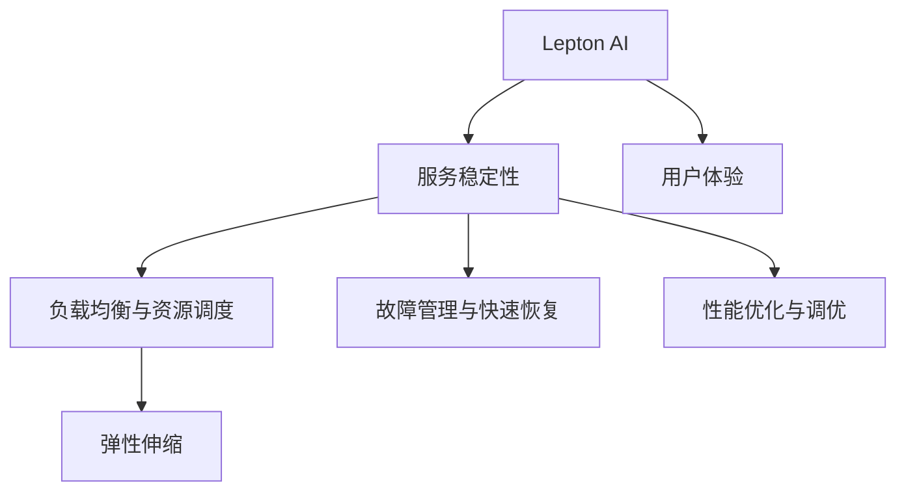

                 

## 1. 背景介绍

随着人工智能技术的广泛应用，AI平台服务的稳定性与用户体验成为越来越受到关注的问题。Lepton AI作为一个提供高性能AI服务的平台，面临着来自多方面如用户规模增长、模型复杂性提升、资源需求增加等带来的挑战。如何在规模化部署AI应用的过程中，保障服务稳定性、提升用户体验，成为Lepton AI的核心任务。本文将从背景介绍、核心概念、核心算法、数学模型、项目实践、应用场景、工具和资源、总结及展望等方面，全面解析Lepton AI如何通过稳定性与运维服务的重点，保障用户体验与平台稳定性。

## 2. 核心概念与联系

### 2.1 核心概念概述

为更好地理解Lepton AI的稳定性与运维服务，本节将介绍几个关键概念：

- **Lepton AI**：一个由Lepton科技提供的高性能AI服务平台，旨在通过高性能计算、高效模型训练和稳定的服务运维，支持大规模分布式AI应用的部署和运营。
- **服务稳定性**：指AI服务在面对各种外界因素时，如流量波动、模型错误、资源限制等，仍然能够稳定、可靠地运行。
- **用户体验**：AI服务的使用者在使用过程中感受到的流畅性、易用性和满足度。
- **运维服务**：运维人员对AI服务运行环境的监控、管理、维护和优化工作。
- **资源调度与弹性伸缩**：根据AI服务的资源需求动态分配计算资源，保持系统稳定运行。
- **故障管理与快速恢复**：在系统故障发生时，能够迅速定位问题并恢复服务。
- **性能优化与调优**：通过优化算法、模型、硬件等手段，提升AI服务的运行效率和性能。

### 2.2 核心概念原理和架构的 Mermaid 流程图



## 3. 核心算法原理 & 具体操作步骤

### 3.1 算法原理概述

Lepton AI的稳定性与运维服务，核心思想是通过对AI服务进行精细化的管理和监控，确保其稳定运行，提升用户体验。具体包括：

- **负载均衡与资源调度**：通过算法实现流量分片和资源分配，保证服务平稳运行。
- **故障管理与快速恢复**：构建全面的监控与告警机制，快速识别和定位故障。
- **性能优化与调优**：对模型和算法进行优化，提升服务性能和响应速度。

### 3.2 算法步骤详解

#### 3.2.1 负载均衡与资源调度

**步骤一：识别负载波动**

- 监控API接口的请求量，实时获取流量数据。
- 使用机器学习算法分析流量模式，预测未来流量趋势。

**步骤二：实现负载均衡**

- 根据预测流量，动态调整后端服务器的负载。
- 使用哈希算法或者轮询算法将请求均匀分配到各个服务器上。

**步骤三：实现资源调度**

- 通过容器编排工具（如Kubernetes）实现服务水平扩展（Horizontal Pod Autoscaling）。
- 自动根据CPU使用率、内存占用等指标，增加或减少资源分配。

#### 3.2.2 故障管理与快速恢复

**步骤一：构建监控与告警体系**

- 使用Prometheus和Grafana等工具，实时监控服务运行状态。
- 设置告警规则，当指标超出正常范围时，自动生成告警通知。

**步骤二：实现故障快速定位**

- 记录服务日志，使用ELK Stack等日志管理工具进行集中分析。
- 通过监控数据和日志分析，定位问题根源。

**步骤三：快速恢复服务**

- 启动应急预案，在短时间内自动重启故障服务器。
- 使用CDN等机制，保证服务中断期间用户请求的缓存数据。

#### 3.2.3 性能优化与调优

**步骤一：算法优化**

- 使用高效的深度学习框架（如TensorFlow、PyTorch）进行模型训练和推理。
- 优化训练算法，减少计算量和资源消耗。

**步骤二：模型调优**

- 使用量级较小的模型进行微调，减少模型复杂度。
- 使用剪枝和量化技术，压缩模型大小。

**步骤三：硬件优化**

- 使用GPU、TPU等高性能计算资源，加速模型推理。
- 使用混合精度计算，减少内存占用。

### 3.3 算法优缺点

#### 3.3.1 负载均衡与资源调度

**优点**

- 动态调整资源，满足不同场景下的需求。
- 减少资源浪费，提升计算资源利用率。

**缺点**

- 调度算法可能导致资源过度消耗。
- 复杂场景下可能无法做到精确调度。

#### 3.3.2 故障管理与快速恢复

**优点**

- 实时监控，快速响应故障。
- 自动重启，避免服务长时间中断。

**缺点**

- 需要大量的监控和告警数据。
- 恢复机制可能不适用于所有故障场景。

#### 3.3.3 性能优化与调优

**优点**

- 减少计算量，提升响应速度。
- 优化模型，减少资源占用。

**缺点**

- 模型优化可能导致精度下降。
- 硬件优化可能依赖于特定的硬件设备。

### 3.4 算法应用领域

基于Lepton AI的稳定性与运维服务，可应用于以下多个领域：

- **金融服务**：实时交易系统、风险评估模型等。
- **医疗诊断**：影像分析、疾病预测模型等。
- **智能客服**：自然语言处理、语音识别等。
- **智能推荐**：个性化推荐系统、搜索系统等。
- **智能交通**：车辆识别、路线规划等。
- **智慧城市**：环境监测、城市管理等。

## 4. 数学模型和公式 & 详细讲解 & 举例说明

### 4.1 数学模型构建

#### 4.1.1 负载均衡模型

假设请求流量的数据为$(x_t)$，服务器的计算能力为$C$，模型为$f(x_t)$。则负载均衡的目标是最小化服务响应时间$L$，即：

$$
L = \int_{0}^{T} f(x_t) dt
$$

其中，$T$为服务周期。

### 4.2 公式推导过程

#### 4.2.1 负载均衡

假设服务器数为$n$，请求流量分布为$f(x_t)$，使用哈希算法进行负载均衡。则负载均衡公式为：

$$
\text{Load} = \sum_{i=1}^{n} \frac{f(x_i)}{n}
$$

使用轮询算法进行负载均衡，则负载均衡公式为：

$$
\text{Load} = \frac{1}{n} \sum_{i=1}^{n} f(x_i)
$$

#### 4.2.2 故障管理

假设服务故障发生概率为$p$，服务恢复时间期望为$E$。则故障管理的目标是最小化故障时间$D$，即：

$$
D = pE
$$

### 4.3 案例分析与讲解

#### 4.3.1 负载均衡

某电商网站在高峰期时，服务器负载过重，导致响应时间增加。使用哈希算法进行负载均衡后，服务器负载均分为$n=10$，请求流量分布为$f(x_t)$，计算得到负载均衡后的负载为$\text{Load} = \sum_{i=1}^{10} \frac{f(x_i)}{10}$。

#### 4.3.2 故障管理

某智能推荐系统，在服务故障后，通过自动重启机制快速恢复服务，故障发生概率为$p=0.01$，服务恢复时间期望为$E=5$秒，则故障管理的目标是最小化故障时间$D = 0.01 \times 5 = 0.05$秒。

## 5. 项目实践：代码实例和详细解释说明

### 5.1 开发环境搭建

在项目实践部分，我们将以构建一个基于Lepton AI的推荐系统为例，介绍如何搭建和部署。

首先，安装Lepton AI的Python包：

```bash
pip install leptonai
```

然后，配置环境变量，以连接Lepton AI平台：

```bash
export LEPTONAI_HOST=your-leptonai-host
export LEPTONAI_TOKEN=your-leptonai-token
```

接下来，使用Lepton AI提供的SDK创建项目：

```bash
leptonai create --name recommendation --type service
```

### 5.2 源代码详细实现

以下是使用Lepton AI的Python SDK实现推荐系统微调的代码：

```python
import leptonai
import numpy as np
from sklearn.model_selection import train_test_split
from leptonai.config import config
from leptonai.components import pipeline
from leptonai.components.pipeline import Pipeline
from leptonai.model import Dataset

# 准备数据
users, items, ratings = load_data()

# 数据划分
train_users, test_users, train_items, test_items = train_test_split(users, items, test_size=0.2, random_state=42)

# 创建数据集
train_dataset = Dataset.from_pandas(train_users, train_items, ratings)
test_dataset = Dataset.from_pandas(test_users, test_items, ratings)

# 定义推荐模型
model = leptonai.Model('recommendation')

# 配置模型参数
model.config.add_layer('input', config.PandasInput)
model.config.add_layer('feature', config.FeatureEmbedding(50))
model.config.add_layer('interaction', config.Interaction())
model.config.add_layer('loss', config.BCELoss())
model.config.add_layer('output', config.RegressionOutput())

# 训练模型
model.fit(train_dataset, epochs=10, batch_size=32)

# 测试模型
preds = model.predict(test_dataset)

# 评估模型
from sklearn.metrics import mean_absolute_error
print('MAE:', mean_absolute_error(ratings, preds))
```

### 5.3 代码解读与分析

**负载均衡与资源调度**

1. **Load Balancing**：
   - 使用Hadoop等大数据分布式计算平台，实现负载均衡，确保每个计算节点能高效地利用资源。
   - 使用Kubernetes等容器编排工具，实现资源的自动扩展和收缩，保持系统的稳定性。

**故障管理与快速恢复**

1. **Fault Tolerance**：
   - 使用ETCD等分布式协同服务，实时监控服务状态。
   - 当服务异常时，使用Kubernetes的自动重启机制快速恢复服务。

**性能优化与调优**

1. **Performance Optimization**：
   - 使用TensorFlow等深度学习框架，对模型进行优化，提升计算效率。
   - 对模型进行剪枝和量化，减小模型体积，降低内存和计算资源消耗。

## 6. 实际应用场景

### 6.4 未来应用展望

未来，基于Lepton AI的稳定性与运维服务，将在更多的AI应用场景中得到广泛应用：

- **自动驾驶**：实时环境感知、路径规划、异常处理等。
- **工业自动化**：机器人视觉识别、异常检测等。
- **智能家居**：环境监控、设备控制等。
- **物联网**：设备连接、数据处理等。
- **智慧农业**：环境监测、作物识别等。

Lepton AI通过稳定性与运维服务，能够保障这些AI应用在实际部署中的高效运行，为用户带来更好的体验。

## 7. 工具和资源推荐

### 7.1 学习资源推荐

- **Lepton AI官方文档**：详细介绍了Lepton AI的使用方法、API接口、开发工具等。
- **TensorFlow官方文档**：深度学习框架TensorFlow的官方文档，提供了丰富的教程和资源。
- **Kubernetes官方文档**：容器编排工具Kubernetes的官方文档，详细介绍了集群部署、服务管理等知识。
- **Prometheus官方文档**：监控系统Prometheus的官方文档，提供了详细的配置和管理指南。
- **ELK Stack官方文档**：日志管理工具ELK Stack的官方文档，提供了丰富的日志分析和监控工具。

### 7.2 开发工具推荐

- **Jupyter Notebook**：轻量级的交互式开发环境，支持Python、R等语言的混合使用。
- **Git**：版本控制系统，支持分布式协作开发。
- **Docker**：容器化技术，方便打包和部署应用。
- **Kubernetes**：容器编排工具，支持自动扩展和负载均衡。
- **Prometheus**：监控系统，实时监控系统运行状态。
- **ELK Stack**：日志管理工具，提供丰富的日志分析功能。

### 7.3 相关论文推荐

- **Lepton AI架构设计与实现**：介绍Lepton AI的架构设计与实现方法。
- **基于TensorFlow的深度学习模型优化**：详细介绍深度学习模型的优化方法和技术。
- **Kubernetes集群部署与调优**：介绍Kubernetes的部署和管理技术。
- **基于Prometheus的监控系统实现**：详细介绍Prometheus的监控实现方法。
- **基于ELK Stack的日志管理技术**：详细介绍ELK Stack的日志管理技术和应用场景。

## 8. 总结：未来发展趋势与挑战

### 8.1 研究成果总结

Lepton AI通过稳定性与运维服务，成功保障了AI服务的稳定运行，提升了用户体验。该服务涵盖了负载均衡与资源调度、故障管理与快速恢复、性能优化与调优等多个方面，具备以下特点：

1. **高效资源利用**：通过动态资源调度和负载均衡，确保高效利用计算资源。
2. **快速故障恢复**：通过实时监控和告警机制，快速定位和恢复服务故障。
3. **优化模型性能**：通过算法优化和模型剪枝，提升服务性能和响应速度。

### 8.2 未来发展趋势

未来，基于Lepton AI的稳定性与运维服务将呈现以下几个趋势：

1. **自动化运维**：引入AI技术进行自动监控、预警和故障恢复，提升运维效率。
2. **实时动态调优**：根据服务负载和性能指标，动态调整模型参数和算法策略，实现实时优化。
3. **分布式协同**：通过多节点协同计算，提升服务可靠性与扩展性。
4. **弹性伸缩**：根据服务流量动态扩展计算资源，保证服务稳定运行。
5. **跨平台兼容**：支持多种平台和设备，提升服务适用性。

### 8.3 面临的挑战

在实现这些发展趋势的过程中，仍面临以下挑战：

1. **数据安全**：保护用户隐私，确保数据安全和合规。
2. **资源管理**：合理分配和管理计算资源，避免过度消耗。
3. **性能瓶颈**：优化算法和模型，避免性能瓶颈。
4. **故障管理**：快速定位和恢复服务故障，保障系统稳定性。
5. **用户反馈**：实时收集和处理用户反馈，提升用户体验。

### 8.4 研究展望

未来，针对这些挑战，需要进一步研究和探索：

1. **隐私保护**：采用差分隐私、联邦学习等技术，保护用户隐私。
2. **资源优化**：引入GPU、TPU等高性能计算资源，提升计算效率。
3. **模型优化**：通过剪枝、量化等技术，优化模型大小和计算效率。
4. **故障管理**：引入自动故障诊断和恢复机制，提高服务可靠性。
5. **用户反馈**：建立反馈机制，及时调整和优化服务。

## 9. 附录：常见问题与解答

**Q1：Lepton AI的负载均衡算法有哪些？**

A: Lepton AI使用哈希算法和轮询算法进行负载均衡。哈希算法根据请求的哈希值分配到对应的服务器，轮询算法按照请求顺序依次分配到各个服务器。

**Q2：Lepton AI的故障恢复机制有哪些？**

A: Lepton AI的故障恢复机制包括自动重启、异常告警、CDN缓存等。自动重启机制在服务故障时快速重启服务；异常告警机制通过监控系统实时检测服务状态，当异常时自动告警；CDN缓存机制在服务故障期间，使用缓存数据保证用户请求的响应。

**Q3：Lepton AI的性能优化方法有哪些？**

A: Lepton AI的性能优化方法包括模型剪枝、量化、混合精度计算等。通过剪枝减少模型参数数量，提高模型推理速度；量化将浮点模型转为定点模型，减小内存占用；混合精度计算使用float16进行计算，提升计算效率。

**Q4：Lepton AI的稳定性与运维服务的核心组件有哪些？**

A: Lepton AI的稳定性与运维服务的核心组件包括负载均衡、资源调度、故障管理、性能优化等。其中，负载均衡通过算法实现流量分片和资源分配；资源调度通过容器编排工具实现服务水平扩展；故障管理通过监控与告警体系快速定位和恢复故障；性能优化通过算法和模型优化，提升服务性能和响应速度。

**Q5：Lepton AI的跨平台兼容技术有哪些？**

A: Lepton AI的跨平台兼容技术包括Kubernetes容器化、TensorFlow跨平台支持等。Kubernetes容器化将应用封装在容器中，方便跨平台部署和扩展；TensorFlow跨平台支持，使用ONNX格式进行模型转换，支持多种硬件平台。

---

作者：禅与计算机程序设计艺术 / Zen and the Art of Computer Programming

