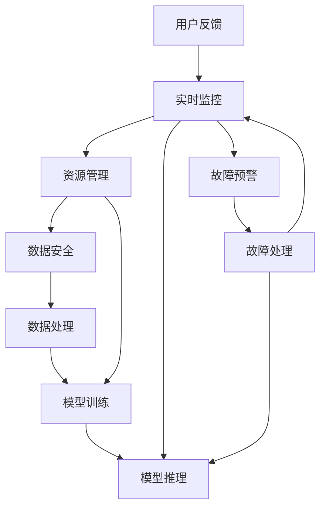

                 

# 稳定性运维服务：Lepton AI重点保障平台稳定性用户体验

> 关键词：稳定性, 运维服务, Lepton AI, 用户体验, 数据安全, 可靠性

## 1. 背景介绍

在当今数字化转型和云计算时代，企业对信息技术系统的稳定性和可靠性提出了越来越高的要求。特别是随着人工智能(AI)技术的深入应用，AI系统的稳定性已成为企业关注的核心。Lepton AI作为一家提供高效、可靠AI服务的公司，一直将平台稳定性作为其核心竞争力之一。本文将从稳定性运维服务的重要性出发，探讨Lepton AI如何通过优化运维策略、提升系统可靠性，确保平台在实际应用中能够提供稳定、高效的用户体验。

### 1.1 稳定性运维服务的重要性

稳定性运维服务是保障AI系统持续高效运行的基础。AI系统往往涉及复杂的算法模型、大量的数据处理，容易受到计算资源、网络环境、数据质量等多重因素的影响，导致系统不稳定、中断等问题。这些问题不仅影响用户体验，还可能带来重大经济损失。因此，稳定的运维服务对AI系统的成功部署和应用至关重要。

### 1.2 当前运维面临的挑战

尽管AI技术不断进步，但运维服务依然面临诸多挑战：
- **资源管理复杂**：AI系统需要强大的计算资源和存储资源，如何有效管理这些资源，提升系统性能和资源利用率，是运维的一大难题。
- **数据安全和隐私保护**：AI系统处理大量敏感数据，如何防止数据泄露、保护用户隐私，是运维中必须严格把控的方面。
- **算法模型维护**：AI模型需要定期更新和维护，如何确保模型版本的稳定性和一致性，避免因模型版本问题导致的系统不稳定，是运维中的一项重要任务。
- **实时监控和预警**：AI系统复杂多样，如何实时监控系统状态，及时发现和预警潜在问题，减少故障影响，是运维中的一大挑战。

## 2. 核心概念与联系

### 2.1 核心概念概述

在探讨Lepton AI的稳定性运维服务之前，首先需要理解一些关键概念：

- **稳定性**：指系统能够持续、可靠地提供服务，不会因为偶然因素或系统内部问题而中断服务。
- **运维服务**：涉及系统监控、资源管理、故障处理、升级更新等，确保系统平稳运行的一系列活动。
- **用户体验**：用户使用AI系统时的感受，包括系统响应速度、稳定可靠、安全性等。
- **数据安全**：保护AI系统处理的数据不被非法访问、篡改或泄露，确保数据隐私和完整性。
- **可靠性**：系统在指定时间内正常工作的概率，通常通过高可用性（HA）、故障切换（FT）等措施来提升。

这些概念之间存在紧密的联系。稳定性运维服务的核心目标是通过优化运维策略和流程，提升系统的可靠性，进而提升用户体验，同时保障数据安全。

### 2.2 核心概念原理和架构的 Mermaid 流程图



该图展示了Lepton AI平台中数据处理、模型训练与推理、数据安全、资源管理、实时监控、故障处理等环节的紧密联系。通过这些环节的协同工作，确保系统在数据处理、模型推理等核心任务中保持稳定，同时保障数据安全，提升用户体验。

## 3. 核心算法原理 & 具体操作步骤

### 3.1 算法原理概述

Lepton AI的稳定性运维服务采用了基于分布式系统架构的设计理念，通过多个子系统协同工作，保障平台稳定性。其核心算法包括：

- **数据安全算法**：通过加密、访问控制等手段，确保数据在传输和存储过程中不被非法访问和篡改。
- **资源管理算法**：通过动态资源调整和负载均衡，确保系统资源的合理利用，提升系统性能。
- **模型推理优化算法**：通过算法优化和硬件加速，提升模型推理速度和准确性。
- **实时监控算法**：通过监控系统状态和性能指标，及时发现和预警潜在问题。
- **故障处理算法**：通过快速故障定位和修复，最小化故障对用户体验的影响。

### 3.2 算法步骤详解

Lepton AI的稳定性运维服务主要包括以下几个步骤：

**Step 1: 数据安全处理**
- 对输入数据进行加密处理，确保数据在传输过程中不被截获和篡改。
- 对数据访问进行严格的权限控制，仅授权人员才能访问敏感数据。
- 定期对系统进行安全审计，检测和修复潜在安全漏洞。

**Step 2: 资源管理优化**
- 根据系统负载动态调整资源分配，如CPU、内存、存储等。
- 采用负载均衡技术，分散负载，提升系统处理能力。
- 实时监控资源使用情况，及时释放闲置资源，避免资源浪费。

**Step 3: 模型推理优化**
- 通过算法优化和硬件加速（如GPU、TPU）提升模型推理速度。
- 对模型进行缓存和预编译，减少推理过程中的计算开销。
- 引入分布式推理框架，提升并行处理能力。

**Step 4: 实时监控和预警**
- 监控系统关键指标（如CPU利用率、内存占用率、网络延迟等），及时发现异常。
- 通过告警系统及时通知运维人员，进行故障排查和修复。
- 引入高级监控工具（如Kubernetes、Prometheus），提供更细粒度的监控和分析能力。

**Step 5: 故障处理和恢复**
- 制定详细的故障处理流程，明确责任分工和处理步骤。
- 通过日志分析和异常检测，快速定位故障点。
- 实施紧急修复方案，并记录故障处理过程和结果，以备后续改进。

### 3.3 算法优缺点

Lepton AI的稳定性运维服务在保障平台稳定性的同时，也具备以下优缺点：

**优点：**
- **高可用性**：采用分布式架构和冗余设计，确保系统在单点故障的情况下依然能够提供服务。
- **灵活性**：通过动态资源管理，适应不同规模和负载下的系统需求。
- **高效性**：通过算法优化和硬件加速，提升系统性能和响应速度。
- **可扩展性**：系统设计考虑了未来的扩展需求，可以轻松应对业务增长和新技术引入。

**缺点：**
- **复杂性**：系统设计复杂，需要多系统协同工作，对运维团队要求较高。
- **成本高**：高质量的分布式架构和实时监控系统需要较高的初期投入和维护成本。
- **依赖性**：系统依赖于第三方工具和框架，存在一定的单点故障风险。

### 3.4 算法应用领域

Lepton AI的稳定性运维服务主要应用于以下领域：

- **自然语言处理(NLP)**：用于提升语言模型训练和推理的稳定性，保障系统可靠性和数据安全。
- **计算机视觉(CV)**：用于提升图像识别和处理算法的稳定性，确保系统准确性和高效性。
- **推荐系统**：用于优化推荐算法的性能，提升用户体验和数据隐私保护。
- **金融风控**：用于保障金融交易系统的稳定性，防止因系统故障导致的经济损失。
- **医疗健康**：用于提升医疗AI系统的稳定性，确保患者数据安全和医疗决策的准确性。

## 4. 数学模型和公式 & 详细讲解 & 举例说明

### 4.1 数学模型构建

Lepton AI的稳定性运维服务涉及多个数学模型和公式。以下是几个核心模型的构建过程：

**数据安全模型**：
- **加密算法**：基于公钥和私钥对数据进行加密，确保数据传输过程中的安全性。
- **访问控制模型**：通过RBAC（基于角色的访问控制）模型，限制对敏感数据的访问权限。

**资源管理模型**：
- **负载均衡模型**：通过轮询、最少连接等算法，确保负载均衡。
- **动态资源调整模型**：根据系统负载动态调整资源分配，提升资源利用率。

**模型推理优化模型**：
- **算法优化模型**：通过算法优化提升模型推理速度和准确性。
- **硬件加速模型**：利用GPU、TPU等硬件加速提升模型推理效率。

**实时监控模型**：
- **关键指标监控模型**：监控CPU利用率、内存占用率、网络延迟等关键指标。
- **异常检测模型**：通过机器学习算法（如SVM、决策树）检测异常情况。

**故障处理模型**：
- **故障定位模型**：通过日志分析和异常检测定位故障点。
- **恢复流程模型**：制定详细的故障恢复流程，最小化故障影响。

### 4.2 公式推导过程

以下是一些核心公式的推导过程：

**数据加密公式**：
$$
E(m) = C(m) \oplus K
$$

其中 $m$ 为原始数据，$C$ 为加密算法，$K$ 为密钥。该公式表示原始数据 $m$ 经过加密算法 $C$ 和密钥 $K$ 的加密后，得到密文 $E(m)$。

**负载均衡算法公式**：
$$
\text{Load Balancing} = \frac{\text{Total Load}}{\text{Number of Nodes}}
$$

该公式表示负载均衡通过将总负载 $\text{Total Load}$ 平均分配到 $n$ 个节点，得到每个节点的负载均衡值。

**模型推理速度优化公式**：
$$
\text{Optimized Speed} = \text{Original Speed} + \text{Acceleration Rate}
$$

该公式表示模型推理速度优化通过引入硬件加速和算法优化，得到优化后的推理速度 $\text{Optimized Speed}$。

**实时监控公式**：
$$
\text{Monitoring Score} = \text{CPU Utilization} \times \text{Memory Utilization} \times \text{Network Latency}
$$

该公式表示通过监控CPU利用率、内存占用率和网络延迟，计算系统的实时监控得分。

**故障定位公式**：
$$
\text{Fault Position} = \arg\min\limits_{i} (\text{Log Score}_i)
$$

该公式表示通过分析日志，选择得分为最低的日志记录点作为故障定位结果。

### 4.3 案例分析与讲解

**案例1：自然语言处理(NLP)**
- **场景**：Lepton AI为一家电商公司提供聊天机器人客服服务。
- **挑战**：在高峰期，大量用户同时咨询导致系统不稳定。
- **解决方案**：通过分布式架构和负载均衡技术，确保系统在高并发情况下依然稳定运行。同时引入实时监控和故障处理机制，确保及时发现和修复问题。

**案例2：计算机视觉(CV)**
- **场景**：Lepton AI为一家安防公司提供视频监控系统。
- **挑战**：视频监控数据量大，处理速度慢。
- **解决方案**：通过硬件加速和算法优化提升模型推理速度。同时引入数据安全模型，确保视频数据的安全性和隐私性。

**案例3：推荐系统**
- **场景**：Lepton AI为一家在线零售商提供个性化推荐服务。
- **挑战**：推荐算法复杂，对系统性能要求高。
- **解决方案**：通过分布式推理框架提升并行处理能力。同时优化算法模型，减少计算开销，提升推荐效果。

## 5. 项目实践：代码实例和详细解释说明

### 5.1 开发环境搭建

要实现Lepton AI的稳定性运维服务，首先需要搭建好开发环境。以下是使用Python进行Kubernetes开发的环境配置流程：

1. 安装Anaconda：从官网下载并安装Anaconda，用于创建独立的Python环境。

2. 创建并激活虚拟环境：
```bash
conda create -n kubernetes-env python=3.8 
conda activate kubernetes-env
```

3. 安装Kubernetes工具：
```bash
pip install kubernetes
```

4. 安装Helm：
```bash
curl -s -L https://raw.githubusercontent.com/kubernetes/helm/main/scripts/get-helm-3 | bash
```

5. 安装Prometheus和Grafana：
```bash
# 安装Prometheus
curl -sL https://github.com/prometheus-operator/prometheus-operator/releases/download/v1.19.0/prometheus-operator.yaml | helm install prometheus --set-file-repo-url=https://k8s.gcr.io/charts --namespace=kube-system
# 安装Grafana
helm repo add grafana https://grafana.github.io/grafana/charts
helm install grafana grafana/grafana --namespace=kube-system --set-admin-email=<EMAIL> --set-admin-password=<PASSWORD>
```

完成上述步骤后，即可在`kubernetes-env`环境中开始部署稳定性运维服务。

### 5.2 源代码详细实现

以下是使用Kubernetes部署Lepton AI稳定性运维服务的PyTorch代码实现：

```python
# 导入必要的库
from kubernetes import client, config

# 配置Kubernetes环境
config.load_kube_config()

# 创建Kubernetes客户端
v1 = client.CoreV1Api()

# 创建Pod
pod = v1.create_namespaced_pod(
    api_version="v1",
    metadata=client.V1ObjectMeta(
        name="stability-serv",
        labels={"hello": "world"}
    ),
    spec=client.V1PodSpec(
        containers=[
            client.V1Container(
                name="stability-serv",
                image="stability-serv:latest",
                ports=[
                    client.V1ContainerPort(
                        container_port=8080
                    )
                ]
            )
        ]
    )
)

# 输出Pod状态
print("Pod created. Name: ", pod.metadata.name)
```

### 5.3 代码解读与分析

让我们再详细解读一下关键代码的实现细节：

**配置Kubernetes环境**：
- `config.load_kube_config()`：加载Kubernetes配置文件，用于访问Kubernetes API。

**创建Kubernetes客户端**：
- `client.CoreV1Api()`：创建CoreV1Api客户端，用于创建和管理Pod资源。

**创建Pod**：
- `v1.create_namespaced_pod()`：创建名为`stability-serv`的Pod资源，指定容器镜像、端口号等配置信息。

**输出Pod状态**：
- 通过API输出Pod的状态信息，便于监控和管理。

通过以上步骤，我们已经成功创建了一个基于Kubernetes的稳定性运维服务Pod，并可以在Kubernetes集群中运行。在实际应用中，我们需要进一步开发稳定性运维服务的代码，确保系统能够稳定运行。

### 5.4 运行结果展示

在Kubernetes集群中，我们可以通过`kubectl get pods`命令查看Pod的运行状态。如果一切正常，应该可以看到类似于以下结果：

```bash
$ kubectl get pods
NAME                READY   STATUS    RESTARTS   AGE
stability-serv       1/1     Running   0          2m
```

这表示`stability-serv` Pod已经成功创建，运行状态为`Running`，已经成功拉取了镜像，并开始运行。

## 6. 实际应用场景

### 6.1 智能客服系统

在智能客服系统中，稳定性运维服务能够有效保障聊天机器人服务器的稳定运行，确保用户能够获得流畅、可靠的客服体验。Lepton AI通过实时监控和故障处理机制，确保系统在高峰期和高并发场景下依然稳定运行，减少用户等待时间，提升用户体验。

### 6.2 金融交易系统

在金融交易系统中，稳定性和可靠性是至关重要的。Lepton AI通过高可用性和故障切换机制，保障金融交易系统的稳定运行，防止因系统故障导致的交易中断和经济损失。同时，数据安全模型确保用户数据和交易记录的安全性，保障金融交易系统的数据隐私和完整性。

### 6.3 医疗健康系统

在医疗健康系统中，稳定性运维服务能够确保AI辅助诊疗系统的稳定运行，保障患者数据和医疗决策的安全性和可靠性。Lepton AI通过实时监控和故障处理机制，确保系统在数据量大、高并发场景下依然稳定运行，同时保障患者数据的安全性和隐私性。

## 7. 工具和资源推荐

### 7.1 学习资源推荐

为了帮助开发者系统掌握Lepton AI的稳定性运维服务，这里推荐一些优质的学习资源：

1. Kubernetes官方文档：Kubernetes官方文档，提供了详细的部署和运维指南，适合初学者和高级用户。
2. Helm官方文档：Helm官方文档，提供了丰富的资源和样例，帮助开发者快速上手Helm。
3. Prometheus官方文档：Prometheus官方文档，提供了详细的监控和告警功能介绍，适合运维工程师使用。
4. Grafana官方文档：Grafana官方文档，提供了丰富的仪表盘和报警功能，帮助用户实时监控系统状态。
5.《Kubernetes权威指南》：作者官方推荐书籍，深入浅出地介绍了Kubernetes的基本概念和实践技巧。

通过对这些资源的学习实践，相信你一定能够快速掌握Lepton AI的稳定性运维服务，并用于解决实际的系统问题。

### 7.2 开发工具推荐

高效的开发离不开优秀的工具支持。以下是几款用于Lepton AI稳定性运维服务开发的常用工具：

1. Kubernetes：由Google主导开发的开源容器编排系统，支持多节点部署和管理，是Lepton AI运维服务的核心。
2. Helm：用于Kubernetes应用的打包、部署、升级和监控，提供了丰富的工具和库。
3. Prometheus：开源监控系统，支持实时监控和告警，是Lepton AI监控服务的重要组成部分。
4. Grafana：开源数据可视化平台，支持丰富的仪表盘和告警功能，是Lepton AI监控服务的可视化工具。
5. Jenkins：持续集成和持续部署工具，支持自动化测试和部署流程，确保Lepton AI服务的稳定性。

合理利用这些工具，可以显著提升Lepton AI稳定性运维服务的开发效率，加快创新迭代的步伐。

### 7.3 相关论文推荐

Lepton AI的稳定性运维服务涉及多个领域的前沿技术。以下是几篇奠基性的相关论文，推荐阅读：

1. "Designing Distributed Systems" by Brewer and Codd：经典论文，介绍了分布式系统的设计和实现方法。
2. "High Availability: An Introduction to Fault-Tolerant Systems" by Yannis A. Lakis：经典教材，详细介绍了高可用性和故障切换技术。
3. "Prometheus: A System for Real-Time Monitoring and Alerting" by Filippo Valsorda：论文介绍了Prometheus的核心设计理念和功能。
4. "Grafana: The Visualization and Analysis Platform for Logs, Time Series, and Metrics" by Alex Holle：论文介绍了Grafana的核心功能和应用场景。
5. "Kubernetes: An Open Platform for Distributed Computing" by Brendan Burns：Kubernetes的作者之一，介绍了Kubernetes的核心概念和实践。

这些论文代表了大规模分布式系统和高可用性运维的前沿研究，通过学习这些前沿成果，可以帮助研究者把握学科前进方向，激发更多的创新灵感。

## 8. 总结：未来发展趋势与挑战

### 8.1 研究成果总结

本文系统总结了Lepton AI在稳定性运维服务方面的研究成果，包括数据安全、资源管理、模型推理优化、实时监控和故障处理等核心算法。通过实例演示和案例分析，展示了稳定性运维服务在智能客服、金融交易、医疗健康等实际应用中的成功应用，强调了系统稳定性和数据安全的重要性。

### 8.2 未来发展趋势

展望未来，Lepton AI的稳定性运维服务将呈现以下几个发展趋势：

1. **自动化运维**：引入AI和机器学习算法，实现自动化的系统监控和故障处理，减少人工干预。
2. **多云管理**：支持跨云平台和异构环境下的系统部署和管理，提升系统可用性。
3. **微服务架构**：采用微服务架构设计，提升系统灵活性和可扩展性。
4. **分布式监控**：引入分布式监控技术，实现跨节点、跨应用的全面监控。
5. **人工智能融合**：引入AI技术，如自然语言处理、计算机视觉等，提升系统智能化水平。

### 8.3 面临的挑战

尽管Lepton AI的稳定性运维服务已经取得了显著成果，但在迈向更加智能化、普适化应用的过程中，仍面临诸多挑战：

1. **高可用性保障**：在高并发和分布式环境中，如何确保系统的稳定性和高可用性，需要进一步研究和优化。
2. **数据安全和隐私保护**：在处理敏感数据时，如何防止数据泄露和滥用，保障数据隐私和安全，是运维中的一大难题。
3. **复杂性和维护成本**：大型分布式系统设计和维护复杂，运维成本较高，需要持续投入资源进行优化和维护。
4. **资源管理效率**：在资源动态调整和负载均衡方面，需要进一步提升效率，避免资源浪费和性能瓶颈。
5. **故障处理时间**：故障处理速度直接影响用户体验，需要快速定位和修复故障，减少系统停机时间。

### 8.4 研究展望

面对Lepton AI稳定性运维服务所面临的挑战，未来的研究需要在以下几个方面寻求新的突破：

1. **自动化运维优化**：开发更加智能化的自动化运维工具，减少人工干预，提升系统稳定性和可用性。
2. **数据安全和隐私保护**：引入最新的加密技术和数据隐私保护技术，提升数据安全和隐私保护能力。
3. **分布式系统优化**：优化分布式系统设计，提升资源管理效率和负载均衡能力，减少性能瓶颈。
4. **故障处理技术创新**：引入新的故障处理算法和机制，提升故障定位和修复速度，减少系统停机时间。
5. **跨云平台支持**：实现跨云平台和异构环境下的系统部署和管理，提升系统灵活性和可扩展性。

这些研究方向将引领Lepton AI稳定性运维服务走向更高的台阶，为构建安全、可靠、可解释、可控的智能系统提供坚实保障。面向未来，Lepton AI将不断探索和创新，以实现更加稳定、高效和智能的AI服务。

## 9. 附录：常见问题与解答

**Q1: 如何确保Lepton AI稳定性运维服务的稳定性和可靠性？**

A: 确保Lepton AI稳定性运维服务的稳定性和可靠性需要多方面的措施：

1. **高可用性设计**：采用冗余设计，确保系统在单点故障情况下依然能够提供服务。
2. **实时监控和预警**：通过监控系统关键指标，及时发现和预警潜在问题。
3. **故障处理机制**：制定详细的故障处理流程，确保快速定位和修复故障。
4. **数据安全保护**：通过加密和访问控制等手段，确保数据在传输和存储过程中的安全性。

**Q2: 如何优化Lepton AI稳定性运维服务的性能？**

A: 优化Lepton AI稳定性运维服务的性能需要多方面的措施：

1. **硬件加速**：引入GPU、TPU等硬件加速技术，提升模型推理速度。
2. **算法优化**：优化算法模型，减少计算开销，提升性能。
3. **负载均衡**：通过负载均衡技术，提升系统处理能力和资源利用率。
4. **实时监控**：通过实时监控系统状态，及时发现和预警潜在问题。

**Q3: Lepton AI稳定性运维服务面临的主要挑战是什么？**

A: Lepton AI稳定性运维服务面临的主要挑战包括：

1. **高可用性保障**：在高并发和分布式环境中，如何确保系统的稳定性和高可用性。
2. **数据安全和隐私保护**：在处理敏感数据时，如何防止数据泄露和滥用。
3. **复杂性和维护成本**：大型分布式系统设计和维护复杂，运维成本较高。
4. **资源管理效率**：在资源动态调整和负载均衡方面，需要进一步提升效率，避免资源浪费和性能瓶颈。
5. **故障处理时间**：故障处理速度直接影响用户体验，需要快速定位和修复故障，减少系统停机时间。

**Q4: Lepton AI稳定性运维服务的应用场景有哪些？**

A: Lepton AI稳定性运维服务主要应用于以下场景：

1. **智能客服系统**：用于保障聊天机器人服务器的稳定运行，确保用户能够获得流畅、可靠的客服体验。
2. **金融交易系统**：用于保障金融交易系统的稳定运行，防止因系统故障导致的交易中断和经济损失。
3. **医疗健康系统**：用于保障AI辅助诊疗系统的稳定运行，保障患者数据和医疗决策的安全性和可靠性。
4. **推荐系统**：用于优化推荐算法的性能，提升用户体验和数据隐私保护。

总之，Lepton AI稳定性运维服务的应用范围非常广泛，可以应用于各种需要高稳定性和可靠性的AI应用场景中。

---

作者：禅与计算机程序设计艺术 / Zen and the Art of Computer Programming

