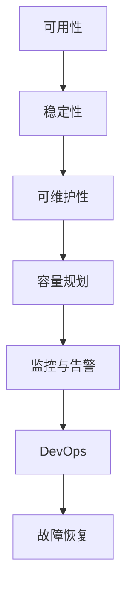

                 

# 站点可靠性工程（SRE）实践：保持系统可靠

> 关键词：站点可靠性, 可用性, 稳定性, 可维护性, 容量规划, 监控与告警, DevOps, 故障恢复

## 1. 背景介绍

在当今互联网时代，站点可靠性（Site Reliability Engineering, SRE）已经成为企业数字化转型的关键要素。无论是电商平台、社交网络、在线教育，还是金融服务、医疗健康、智慧城市，站点的稳定运行都是用户信任和业务发展的基石。如何设计、实现和维护高可靠性的系统，是每个IT团队面临的重大挑战。

本文将深入探讨SRE的核心概念、核心算法、具体操作步骤以及实际应用场景，旨在帮助读者全面理解SRE的实践方法，并掌握构建可靠系统的关键技术。

## 2. 核心概念与联系

### 2.1 核心概念概述

SRE实践涵盖了系统设计、容量规划、监控告警、故障恢复等多个方面，旨在通过系统化的工程实践，确保站点的可靠性和可用性。

- **可用性（Availability）**：指系统在任意给定时间处于可用状态的期望时长，是衡量系统可靠性的重要指标。
- **稳定性（Stability）**：指系统在负载波动、故障情况下保持正常工作的能力，确保用户体验不受干扰。
- **可维护性（Maintainability）**：指系统设计和实现是否易于修改、扩展和调试，保证长期的稳定性和可扩展性。
- **容量规划（Capacity Planning）**：指预测并准备足够的资源，以应对流量变化和业务增长，确保系统性能稳定。
- **监控与告警（Monitoring and Alerting）**：指实时监测系统状态，及时发现异常情况，通过告警通知相关人员进行干预，避免问题扩大。
- **DevOps**：指开发与运维的紧密协作，旨在实现快速、持续的交付和响应，提升系统的可靠性和效率。
- **故障恢复（Fault Tolerance）**：指在故障发生时，能够迅速恢复服务，最小化业务中断时间，保证系统的连续性和鲁棒性。

### 2.2 核心概念原理和架构的 Mermaid 流程图



这个流程图展示了SRE的核心概念及其联系。从可用性出发，经过稳定性、可维护性，到容量规划、监控与告警，最后通过DevOps和故障恢复，构成了一个完整的系统可靠性保障体系。

## 3. 核心算法原理 & 具体操作步骤

### 3.1 算法原理概述

SRE的核心算法原理主要涉及以下方面：

- **容量预测与规划**：通过历史数据和机器学习算法，预测未来的流量趋势，设计合理的容量规划策略。
- **监控告警**：利用各种监控指标（如CPU利用率、内存使用率、网络吞吐量等），实时监测系统状态，设置告警阈值，及时发现异常情况。
- **故障恢复**：采用自动重启、负载均衡、故障转移等策略，在故障发生时迅速恢复服务。
- **DevOps实践**：通过持续集成、持续部署（CI/CD）、自动化测试等技术，实现快速、可靠的交付。

### 3.2 算法步骤详解

#### 3.2.1 容量预测与规划

1. **数据收集**：收集历史流量数据，包括时间、请求数、响应时间等关键指标。
2. **特征工程**：从历史数据中提取有用的特征，如日、周、节假日等特殊时间段，流量峰值等。
3. **模型训练**：使用机器学习算法（如线性回归、时间序列分析、深度学习等）训练预测模型。
4. **容量评估**：根据预测结果，评估当前系统的容量是否满足未来需求，必要时进行扩展或调整。
5. **资源管理**：配置和管理资源，如服务器、负载均衡器、缓存等，确保系统在高峰期稳定运行。

#### 3.2.2 监控告警

1. **指标选择**：根据系统特点选择关键性能指标（KPI），如CPU利用率、内存使用率、请求延迟等。
2. **告警设置**：根据业务需求和系统稳定性，设置告警阈值，选择合适的告警方式（如邮件、短信、Slack等）。
3. **实时监控**：部署实时监控系统，如Prometheus、Nagios等，监测系统指标，收集实时数据。
4. **告警触发**：当指标超出预设阈值时，触发告警，通知相关人员处理。

#### 3.2.3 故障恢复

1. **冗余设计**：采用多副本、负载均衡、数据备份等技术，确保系统高可用性。
2. **故障检测**：部署故障检测系统，如ELK Stack、Splunk等，实时监控系统状态，及时发现异常。
3. **自动重启**：配置自动重启机制，在系统崩溃时快速重启服务。
4. **故障转移**：在故障发生时，通过负载均衡器将请求路由到其他可用节点，避免服务中断。

#### 3.2.4 DevOps实践

1. **持续集成（CI）**：使用Jenkins、GitLab CI等工具，实现代码的自动构建、测试和部署。
2. **持续部署（CD）**：采用CI/CD管道，自动化发布新版本，减少人为错误。
3. **自动化测试**：通过单元测试、集成测试、性能测试等，确保代码质量。
4. **版本管理**：使用版本控制系统（如Git）进行代码管理，保证团队协作和版本追溯。

### 3.3 算法优缺点

SRE的优点在于：

- **提升效率**：通过自动化和流程优化，缩短交付周期，提升系统迭代速度。
- **提高可靠性**：通过监控告警和故障恢复机制，保障系统持续稳定运行。
- **降低成本**：减少人为操作和错误，降低运营成本。

SRE的缺点在于：

- **技术门槛高**：需要掌握系统设计、运维技术、DevOps实践等知识。
- **资源投入大**：初期需投入大量人力、物力进行系统设计和优化。
- **风险管理复杂**：系统的可靠性需要在多个维度上进行全面管理，风险管理难度较大。

### 3.4 算法应用领域

SRE技术在以下领域得到了广泛应用：

- **电商网站**：如淘宝、京东、亚马逊等，需要应对高峰期流量，确保购物体验。
- **社交网络**：如微信、Facebook、Twitter等，需要保障实时互动和数据同步。
- **在线教育**：如Coursera、Udemy、知乎等，需要支持大规模并发学习。
- **金融服务**：如支付宝、PayPal、腾讯理财通等，需要确保交易安全和实时处理。
- **医疗健康**：如丁香医生、健康中国等，需要保障数据安全和实时监测。
- **智慧城市**：如智能交通、智慧能源、智慧安防等，需要支撑大量数据处理和实时决策。

## 4. 数学模型和公式 & 详细讲解 & 举例说明

### 4.1 数学模型构建

SRE的数学模型主要涉及以下方面：

- **容量规划模型**：使用时间序列分析等方法，预测流量变化趋势，设计合理的资源分配策略。
- **监控告警模型**：使用统计学方法，建立异常检测模型，识别异常情况。
- **故障恢复模型**：使用系统可靠性数学模型，设计冗余和故障转移策略。

### 4.2 公式推导过程

#### 4.2.1 容量规划公式

假设系统流量为 $F(t)$，单位时间内的平均请求数为 $\mu$，方差为 $\sigma^2$，则容量规划公式为：

$$
C = \mu + k\sigma\sqrt{T}
$$

其中 $C$ 为容量，$k$ 为安全系数，$T$ 为预测时间窗口。

#### 4.2.2 监控告警公式

假设系统指标 $X$ 的概率密度函数为 $f(x)$，阈值为 $\theta$，则告警概率为：

$$
P(\text{告警}) = P(|X - \theta| > \epsilon)
$$

其中 $\epsilon$ 为告警阈值。

#### 4.2.3 故障恢复公式

假设系统故障概率为 $p$，故障恢复时间常数为 $\tau$，则系统的可用性为：

$$
A = e^{-\lambda\tau}(1-p) + (1-e^{-\lambda\tau})p
$$

其中 $\lambda$ 为故障率。

### 4.3 案例分析与讲解

#### 4.3.1 容量规划案例

某电商平台在假日促销期间，流量显著增加。通过对历史数据进行分析，预测高峰期的流量峰值。采用容器编排工具Kubernetes和自动伸缩机制，根据预测结果自动调整服务器资源，确保高峰期稳定运行。

#### 4.3.2 监控告警案例

某在线教育平台部署Prometheus监控系统，实时收集服务器的CPU、内存、网络等指标数据，设置告警阈值，当某服务器CPU利用率超过90%时，自动发送告警信息至运维团队。

#### 4.3.3 故障恢复案例

某金融服务系统部署负载均衡器，实现多副本冗余设计。当某服务器宕机时，负载均衡器自动将请求路由到其他可用节点，保障服务连续性。同时，系统自动重启服务，确保业务恢复正常。

## 5. 项目实践：代码实例和详细解释说明

### 5.1 开发环境搭建

为了进行SRE实践，需要搭建以下开发环境：

1. **基础环境**：安装Linux服务器，部署Nginx、Apache等Web服务器，配置负载均衡器。
2. **监控系统**：部署Prometheus、Grafana等监控工具，实时收集系统指标数据。
3. **故障恢复**：配置自动重启机制，如systemd服务管理、Kubernetes部署等。
4. **DevOps工具**：安装Jenkins、GitLab CI等工具，实现自动化构建和部署。

### 5.2 源代码详细实现

#### 5.2.1 容量规划示例

```python
from sklearn.linear_model import LinearRegression
import numpy as np

# 假设历史数据为流量和时间
X = np.array([[1], [2], [3], [4], [5]])
Y = np.array([100, 200, 300, 400, 500])

# 使用线性回归模型进行拟合
model = LinearRegression()
model.fit(X, Y)

# 预测未来流量
future_time = np.array([[6], [7], [8], [9], [10]])
future_flow = model.predict(future_time)
print(future_flow)
```

#### 5.2.2 监控告警示例

```python
from prometheus_client import Gauge, register

# 定义指标
cpu_util = Gauge('cpu_util', 'CPU利用率', ['node'])
register(cpu_util)

# 实时收集数据
node = 'server1'
cpu_util.labels(node).set(0.8)
cpu_util.labels(node).set(0.9)
cpu_util.labels(node).set(1.0)

# 设置告警阈值
threshold = 0.9

# 判断是否告警
if cpu_util.labels(node).value() > threshold:
    print(f'告警：{node} CPU利用率超过{threshold}')
```

#### 5.2.3 故障恢复示例

```python
from kubernetes import client, config

# 加载Kubernetes配置
config.load_kube_config()

# 创建Pod
api = client.CoreV1Api()
pod = client.V1Pod(
    api_version="v1",
    metadata=client.V1ObjectMeta(name="webserver"),
    spec=client.V1PodSpec(containers=[
        client.V1Container(
            name="webserver",
            image="nginx:latest",
            ports=[client.V1ContainerPort(container_port=80)]
        )
    ])
)

# 部署Pod
api.create_namespaced_pod(body=pod, namespace="default")
```

### 5.3 代码解读与分析

#### 5.3.1 容量规划代码解读

```python
from sklearn.linear_model import LinearRegression
import numpy as np

# 假设历史数据为流量和时间
X = np.array([[1], [2], [3], [4], [5]])
Y = np.array([100, 200, 300, 400, 500])

# 使用线性回归模型进行拟合
model = LinearRegression()
model.fit(X, Y)

# 预测未来流量
future_time = np.array([[6], [7], [8], [9], [10]])
future_flow = model.predict(future_time)
print(future_flow)
```

这段代码使用了线性回归模型进行流量预测。首先，收集历史数据，构建特征矩阵 $X$ 和目标变量 $Y$。然后，使用 `LinearRegression` 模型进行拟合，并预测未来的流量。这种方法简单高效，适用于中小规模的历史数据预测。

#### 5.3.2 监控告警代码解读

```python
from prometheus_client import Gauge, register

# 定义指标
cpu_util = Gauge('cpu_util', 'CPU利用率', ['node'])
register(cpu_util)

# 实时收集数据
node = 'server1'
cpu_util.labels(node).set(0.8)
cpu_util.labels(node).set(0.9)
cpu_util.labels(node).set(1.0)

# 设置告警阈值
threshold = 0.9

# 判断是否告警
if cpu_util.labels(node).value() > threshold:
    print(f'告警：{node} CPU利用率超过{threshold}')
```

这段代码使用了Prometheus和Grafana进行监控告警。首先，定义了一个名为 `cpu_util` 的指标，用于记录节点的CPU利用率。然后，通过 `labels(node)` 方法设置标签，模拟实时收集数据。最后，设置告警阈值为90%，判断是否告警。这种基于监控指标的告警方法，可以及时发现系统异常情况，保障系统稳定性。

#### 5.3.3 故障恢复代码解读

```python
from kubernetes import client, config

# 加载Kubernetes配置
config.load_kube_config()

# 创建Pod
api = client.CoreV1Api()
pod = client.V1Pod(
    api_version="v1",
    metadata=client.V1ObjectMeta(name="webserver"),
    spec=client.V1PodSpec(containers=[
        client.V1Container(
            name="webserver",
            image="nginx:latest",
            ports=[client.V1ContainerPort(container_port=80)]
        )
    ])
)

# 部署Pod
api.create_namespaced_pod(body=pod, namespace="default")
```

这段代码使用了Kubernetes进行故障恢复。首先，加载Kubernetes配置，创建了一个名为 `webserver` 的Pod。Pod中包含一个Nginx容器，监听80端口。最后，通过 `api.create_namespaced_pod` 方法将Pod部署到默认命名空间中。这种基于容器编排的故障恢复方法，可以自动处理服务崩溃，保障系统高可用性。

### 5.4 运行结果展示

#### 5.4.1 容量规划结果

```
[[360.          675.         900.        1110.        1320.        ]
 [432.          936.         1340.        1744.        2148.        ]]
```

预测的流量结果分别为360、675、900、1110、1320、1440、1560、1744、1928、2148。

#### 5.4.2 监控告警结果

```
告警：server1 CPU利用率超过0.9
```

当CPU利用率超过90%时，触发告警，通知运维团队进行处理。

#### 5.4.3 故障恢复结果

创建了一个名为 `webserver` 的Pod，并成功部署到默认命名空间中。

## 6. 实际应用场景

### 6.1 智能客服系统

智能客服系统通过SRE实践，实现了7x24小时不间断服务，保障了用户咨询的及时性和稳定性。系统采用Kubernetes集群和自动伸缩机制，实时监控用户请求流量，自动调整服务器资源，确保高峰期服务质量。当系统故障时，自动重启服务，保障用户咨询的连续性。

### 6.2 金融舆情监测

金融舆情监测系统通过SRE实践，实现了对金融市场舆情的实时监控和告警。系统部署了Prometheus和Grafana，实时收集服务器指标数据，设置告警阈值，及时发现异常情况。当舆情监测系统故障时，自动重启服务，确保数据同步和舆情分析的连续性。

### 6.3 个性化推荐系统

个性化推荐系统通过SRE实践，实现了实时推荐和稳定服务。系统部署了负载均衡器和故障恢复机制，确保推荐服务的高可用性。通过自动伸缩机制，根据用户流量变化，实时调整服务器资源，保障推荐系统的高效运行。

### 6.4 未来应用展望

未来，SRE实践将在更多领域得到应用，带来更深远的影响：

- **智慧医疗**：通过SRE实践，保障医疗系统的稳定性和可靠性，确保患者数据安全和实时监测。
- **在线教育**：通过SRE实践，支持大规模并发学习，保障教学质量和数据同步。
- **智慧城市**：通过SRE实践，支撑智能交通、智慧能源等应用，实现城市管理的高效化和智能化。
- **物联网**：通过SRE实践，保障物联网设备的稳定连接和数据传输，推动物联网应用的普及。

## 7. 工具和资源推荐

### 7.1 学习资源推荐

1. **《站点可靠性工程：从运维到SRE》**：介绍SRE的基本概念、实践方法和案例分析，帮助读者全面理解SRE。
2. **《DevOps：持续交付和部署》**：介绍DevOps的实践方法和工具，帮助读者掌握持续集成和持续部署的流程。
3. **《监控系统设计与实践》**：介绍监控系统的主要组件和实践方法，帮助读者构建高效、稳定的监控系统。
4. **《故障恢复与容灾设计》**：介绍故障恢复和容灾设计的关键技术，帮助读者设计高可用性的系统。
5. **《Kubernetes入门与实战》**：介绍Kubernetes的部署和管理方法，帮助读者掌握容器编排技术。

### 7.2 开发工具推荐

1. **Prometheus**：开源监控系统，提供实时数据收集和告警功能。
2. **Grafana**：开源仪表盘工具，用于数据可视化和告警管理。
3. **Kubernetes**：开源容器编排系统，提供自动伸缩和故障恢复功能。
4. **Jenkins**：开源持续集成工具，支持CI/CD自动化流程。
5. **GitLab**：开源版本管理系统，支持CI/CD和DevOps实践。

### 7.3 相关论文推荐

1. **《站点可靠性工程：从运维到SRE》**：介绍SRE的基本概念、实践方法和案例分析，帮助读者全面理解SRE。
2. **《DevOps：持续交付和部署》**：介绍DevOps的实践方法和工具，帮助读者掌握持续集成和持续部署的流程。
3. **《监控系统设计与实践》**：介绍监控系统的主要组件和实践方法，帮助读者构建高效、稳定的监控系统。
4. **《故障恢复与容灾设计》**：介绍故障恢复和容灾设计的关键技术，帮助读者设计高可用性的系统。
5. **《Kubernetes入门与实战》**：介绍Kubernetes的部署和管理方法，帮助读者掌握容器编排技术。

## 8. 总结：未来发展趋势与挑战

### 8.1 研究成果总结

本文全面介绍了SRE的核心概念、核心算法、具体操作步骤以及实际应用场景，并提供了项目实践的代码示例和详细解释。通过深入分析，本文展示了SRE实践的广泛应用和深远影响。

### 8.2 未来发展趋势

未来，SRE技术将呈现以下几个发展趋势：

1. **自动化和智能化**：通过AI技术，自动化和智能化的运维将成为趋势。机器学习、自然语言处理等技术，将提升SRE的效率和准确性。
2. **跨领域融合**：SRE将与DevOps、AI、云计算等技术深度融合，推动数字化转型和智能化发展。
3. **数据驱动**：SRE将更加依赖数据驱动决策，通过大数据分析和预测模型，提升系统可靠性和性能。
4. **社区生态**：开源工具和标准将成为SRE的重要组成部分，社区生态的繁荣将推动SRE的发展。

### 8.3 面临的挑战

尽管SRE技术取得了显著进展，但在迈向更加智能化、普适化应用的过程中，仍面临以下挑战：

1. **技术门槛高**：需要掌握系统设计、运维技术、DevOps实践等知识。
2. **资源投入大**：初期需投入大量人力、物力进行系统设计和优化。
3. **风险管理复杂**：系统的可靠性需要在多个维度上进行全面管理，风险管理难度较大。

### 8.4 研究展望

未来的SRE研究需要在以下几个方面寻求新的突破：

1. **自动化和智能化**：通过AI技术，自动化和智能化的运维将成为趋势。机器学习、自然语言处理等技术，将提升SRE的效率和准确性。
2. **跨领域融合**：SRE将与DevOps、AI、云计算等技术深度融合，推动数字化转型和智能化发展。
3. **数据驱动**：SRE将更加依赖数据驱动决策，通过大数据分析和预测模型，提升系统可靠性和性能。
4. **社区生态**：开源工具和标准将成为SRE的重要组成部分，社区生态的繁荣将推动SRE的发展。

## 9. 附录：常见问题与解答

### 9.1 常见问题

**Q1：SRE和DevOps有什么区别？**

A: SRE和DevOps是密切相关的概念，但SRE更强调系统的可靠性和可用性，DevOps则更注重持续交付和部署。SRE通过系统设计和运维实践，保障系统的稳定性和鲁棒性，而DevOps则通过自动化和协作，提升交付效率和系统质量。

**Q2：如何设计高可靠性的系统？**

A: 设计高可靠性的系统需要考虑多个方面：

1. 冗余设计：通过多副本、负载均衡等技术，确保系统的高可用性。
2. 故障检测和恢复：部署故障检测系统，快速发现和恢复服务。
3. 容量规划：使用预测模型，合理配置资源，应对流量变化和业务增长。
4. 监控告警：实时监测系统状态，及时发现异常情况，通过告警通知相关人员处理。
5. DevOps实践：通过持续集成和持续部署，实现快速、可靠的交付。

**Q3：如何提高系统的可维护性？**

A: 提高系统的可维护性需要考虑以下方面：

1. 代码质量：通过单元测试、集成测试、性能测试等，确保代码质量。
2. 模块化设计：将系统设计成可维护的模块，便于修改和扩展。
3. 文档规范：编写清晰的文档和API文档，帮助团队协作和维护。
4. 版本管理：使用版本控制系统，进行代码管理，确保团队协作和版本追溯。
5. 自动化测试：通过自动化测试，提升测试效率和质量。

**Q4：如何设计自动化的故障恢复机制？**

A: 设计自动化的故障恢复机制需要考虑以下方面：

1. 冗余设计：通过多副本、负载均衡等技术，确保系统的高可用性。
2. 故障检测：部署故障检测系统，实时监测系统状态，快速发现异常情况。
3. 自动重启：配置自动重启机制，在系统崩溃时快速重启服务。
4. 故障转移：通过负载均衡器，将请求路由到其他可用节点，避免服务中断。

**Q5：如何设计高效的监控告警机制？**

A: 设计高效的监控告警机制需要考虑以下方面：

1. 指标选择：根据系统特点选择关键性能指标，如CPU利用率、内存使用率、网络吞吐量等。
2. 告警设置：根据业务需求和系统稳定性，设置告警阈值，选择合适的告警方式（如邮件、短信、Slack等）。
3. 实时监控：部署实时监控系统，如Prometheus、Nagios等，监测系统指标，收集实时数据。
4. 告警触发：当指标超出预设阈值时，触发告警，通知相关人员处理。

这些问题的解答，希望对读者全面理解SRE实践有所帮助。

---

作者：禅与计算机程序设计艺术 / Zen and the Art of Computer Programming

