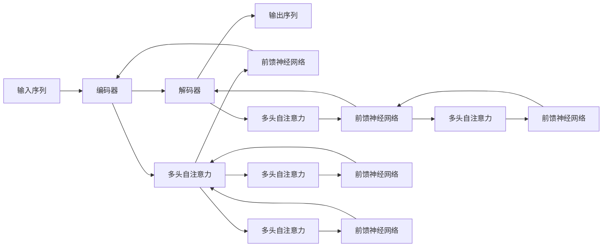

                 

# 第五章：Transformer 架构的革命

## 1. 背景介绍

### 1.1 问题由来
随着深度学习技术的快速发展，特别是自然语言处理(NLP)领域，传统的递归神经网络(RNN)、卷积神经网络(CNN)等结构，在处理大规模语言数据时面临训练效率低、梯度消失/爆炸等问题。为了克服这些瓶颈，研究人员提出了一种全新的神经网络架构——Transformer，极大地提升了NLP任务的模型训练和推理效率。

Transformer架构的提出，标志着深度学习在NLP领域的技术革命。本文将从背景介绍、核心概念、算法原理、实际应用等几个方面，系统梳理Transformer架构的设计思想和实践方法，帮助读者全面理解这一颠覆性技术。

## 2. 核心概念与联系

### 2.1 核心概念概述

Transformer架构的提出基于自注意力机制(self-attention)，主要解决了RNN和CNN架构在处理长序列时的效率问题。其核心思想是通过多头自注意力机制，直接对输入序列进行编码，跳过循环操作，实现了更高效的序列建模。

Transformer包括编码器(Encoder)和解码器(Decoder)两部分，各由多层堆叠的自注意力层和前馈神经网络(Feed-Forward Neural Network)层构成。通过多头并行计算，可以同时处理多个序列关系，提升模型的泛化能力和计算效率。

### 2.2 核心概念原理和架构的 Mermaid 流程图



该图展示了Transformer架构的基本流程，其中：

- 输入序列通过编码器，经过多头自注意力层和前馈神经网络层的多次变换，得到中间状态。
- 中间状态通过解码器，同样经过多头自注意力层和前馈神经网络层的多次变换，得到输出序列。
- 多头自注意力层通过多头并行计算，同时处理多个序列关系。
- 前馈神经网络层采用相同的非线性变换，对序列关系进行非线性处理。

通过多层堆叠，Transformer架构能够处理任意长度的输入序列，并产生相应长度的输出序列。

## 3. 核心算法原理 & 具体操作步骤

### 3.1 算法原理概述

Transformer架构的核心在于多头自注意力机制，通过将输入序列表示成一系列的自注意力权重，实现序列关系的多重计算。具体来说，Transformer的自注意力计算过程包括以下几个步骤：

1. **缩放点积注意力(Scaling Dot-Product Attention)**：首先计算输入序列中每对词的注意力权重，通过点积计算得到注意力分数，再通过缩放操作进行归一化，得到自注意力权重。

2. **多头自注意力(Multi-Head Attention)**：将自注意力权重映射到多个子空间，进行并行计算，得到多头注意力权重。每个子空间的维度为$\frac{d_k}{h}$，其中$d_k$为注意力层维度，$h$为多头数量。

3. **前馈神经网络(Feed-Forward Neural Network)**：对多头自注意力输出进行线性变换和非线性变换，生成新的中间表示。

通过上述过程，Transformer能够高效地处理长序列数据，并且在编码和解码过程中，对序列关系进行建模。

### 3.2 算法步骤详解

Transformer的具体实现步骤如下：

**Step 1: 准备输入序列和模型参数**
- 输入序列为$x_1, x_2, ..., x_n$，每个词$x_i$表示为一个$d_v$维的向量。
- 设定Transformer模型的参数，包括编码器和解码器的层数$l$、注意力层维度$d_k$、前馈神经网络层维度$d_f$等。

**Step 2: 计算多头自注意力**
- 将输入序列$x$分解为多个子空间$Q, K, V$，其中$Q=Ax$，$K=Bx$，$V=Cx$。$A, B, C$为投影矩阵。
- 计算注意力权重$\alpha$，使用公式：$\alpha_{ij} = \frac{\text{exp}(\frac{Q_i \cdot K_j}{\sqrt{d_k}})}{\sum_{k=1}^n \text{exp}(\frac{Q_i \cdot K_k}{\sqrt{d_k}})}$。
- 对$\alpha$进行归一化，得到自注意力权重$h$。

**Step 3: 计算多头自注意力输出**
- 将自注意力权重$h$映射到多个子空间，得到多头注意力权重$h_1, h_2, ..., h_h$。
- 将多头注意力权重$h_1, h_2, ..., h_h$拼接在一起，得到最终的自注意力输出。

**Step 4: 计算前馈神经网络输出**
- 对自注意力输出进行线性变换和非线性变换，生成新的中间表示$y$。

**Step 5: 重复上述步骤**
- 经过$l$层编码器或解码器后，得到最终的输出表示$y$。

### 3.3 算法优缺点

Transformer架构的优点包括：

- **高效并行计算**：通过多头自注意力机制，可以并行计算多个序列关系，提升计算效率。
- **长序列处理**：通过自注意力机制，可以处理任意长度的输入序列，避免了RNN中的梯度消失/爆炸问题。
- **全局关系建模**：自注意力机制能够捕捉序列中的全局关系，提升模型泛化能力。
- **模型训练速度快**：相比于传统的RNN和CNN，Transformer的模型训练速度更快，适用于大规模数据集。

同时，Transformer架构也存在一些缺点：

- **计算资源需求高**：由于自注意力机制的复杂性，Transformer需要较多的计算资源，对硬件要求较高。
- **难以解释**：Transformer的内部机制较为复杂，难以解释模型的决策过程。
- **内存占用大**：由于自注意力机制需要维护多个注意力矩阵，模型在推理时占用较大的内存。

### 3.4 算法应用领域

Transformer架构在大规模语言模型训练和推理中得到广泛应用，如BERT、GPT等。其核心思想已经被应用到机器翻译、语音识别、图像描述生成等多个领域，展示了强大的序列建模能力。

**机器翻译**：通过将源语言序列映射到目标语言序列，Transformer架构在机器翻译任务上取得了最先进的效果。

**语音识别**：将语音信号转换为文本，Transformer架构能够处理变长的语音序列，提升识别精度。

**图像描述生成**：将图像内容转换为自然语言描述，Transformer架构能够捕捉图像中的全局关系，生成更具描述性的文本。

## 4. 数学模型和公式 & 详细讲解 & 举例说明

### 4.1 数学模型构建

Transformer的数学模型建立在自注意力机制之上，其核心思想是通过计算输入序列中每对词的注意力权重，实现序列关系的多重计算。

假设输入序列为$x_1, x_2, ..., x_n$，每个词$x_i$表示为一个$d_v$维的向量。定义自注意力层的参数为$W_Q, W_K, W_V$，分别用于计算查询向量、键向量和值向量。

**Step 1: 投影矩阵变换**
- 将输入序列$x$投影到三个子空间$Q, K, V$，得到查询矩阵$Q$, 键矩阵$K$, 值矩阵$V$。
$$
Q = Ax, \quad K = Bx, \quad V = Cx
$$

**Step 2: 计算注意力权重**
- 计算注意力权重$\alpha$，使用公式：$\alpha_{ij} = \frac{\text{exp}(\frac{Q_i \cdot K_j}{\sqrt{d_k}})}{\sum_{k=1}^n \text{exp}(\frac{Q_i \cdot K_k}{\sqrt{d_k}})}$。
- 将注意力权重$\alpha$进行归一化，得到自注意力权重$h$。
$$
\alpha_{ij} = \frac{\text{exp}(\frac{Q_i \cdot K_j}{\sqrt{d_k}})}{\sum_{k=1}^n \text{exp}(\frac{Q_i \cdot K_k}{\sqrt{d_k}})}
$$
$$
h = \text{softmax}(Q_i \cdot K_j^\top/\sqrt{d_k})
$$

**Step 3: 计算多头自注意力输出**
- 将自注意力权重$h$映射到多个子空间，得到多头注意力权重$h_1, h_2, ..., h_h$。
$$
h_1 = WH_1 h, \quad h_2 = WH_2 h, \quad ..., \quad h_h = WH_h h
$$
- 将多头注意力权重$h_1, h_2, ..., h_h$拼接在一起，得到最终的自注意力输出$O$。
$$
O = [h_1; h_2; ...; h_h]
$$

**Step 4: 计算前馈神经网络输出**
- 对自注意力输出$O$进行线性变换和非线性变换，生成新的中间表示$y$。
$$
y = \text{ReLU}(D(y) + E(y))
$$

### 4.2 公式推导过程

Transformer的公式推导过程较为复杂，主要涉及矩阵运算和向量运算。以下以BERT为例，展示其公式推导过程：

**Step 1: 输入投影**
- 将输入序列$x$投影到三个子空间$Q, K, V$，得到查询矩阵$Q$, 键矩阵$K$, 值矩阵$V$。
$$
Q = Ax, \quad K = Bx, \quad V = Cx
$$

**Step 2: 计算注意力权重**
- 计算注意力权重$\alpha$，使用公式：$\alpha_{ij} = \frac{\text{exp}(\frac{Q_i \cdot K_j}{\sqrt{d_k}})}{\sum_{k=1}^n \text{exp}(\frac{Q_i \cdot K_k}{\sqrt{d_k}})}$。
- 将注意力权重$\alpha$进行归一化，得到自注意力权重$h$。
$$
\alpha_{ij} = \frac{\text{exp}(\frac{Q_i \cdot K_j}{\sqrt{d_k}})}{\sum_{k=1}^n \text{exp}(\frac{Q_i \cdot K_k}{\sqrt{d_k}})}
$$
$$
h = \text{softmax}(Q_i \cdot K_j^\top/\sqrt{d_k})
$$

**Step 3: 计算多头自注意力输出**
- 将自注意力权重$h$映射到多个子空间，得到多头注意力权重$h_1, h_2, ..., h_h$。
$$
h_1 = WH_1 h, \quad h_2 = WH_2 h, \quad ..., \quad h_h = WH_h h
$$
- 将多头注意力权重$h_1, h_2, ..., h_h$拼接在一起，得到最终的自注意力输出$O$。
$$
O = [h_1; h_2; ...; h_h]
$$

**Step 4: 计算前馈神经网络输出**
- 对自注意力输出$O$进行线性变换和非线性变换，生成新的中间表示$y$。
$$
y = \text{ReLU}(D(y) + E(y))
$$

### 4.3 案例分析与讲解

**案例1: 机器翻译**
- 将源语言序列映射到目标语言序列，Transformer架构通过多头自注意力机制，捕捉序列中的全局关系，提升翻译效果。

**案例2: 图像描述生成**
- 将图像内容转换为自然语言描述，Transformer架构能够捕捉图像中的全局关系，生成更具描述性的文本。

**案例3: 语音识别**
- 将语音信号转换为文本，Transformer架构能够处理变长的语音序列，提升识别精度。

## 5. 项目实践：代码实例和详细解释说明

### 5.1 开发环境搭建

在进行Transformer实践前，我们需要准备好开发环境。以下是使用Python进行PyTorch开发的环境配置流程：

1. 安装Anaconda：从官网下载并安装Anaconda，用于创建独立的Python环境。

2. 创建并激活虚拟环境：
```bash
conda create -n transformers-env python=3.8 
conda activate transformers-env
```

3. 安装PyTorch：根据CUDA版本，从官网获取对应的安装命令。例如：
```bash
conda install pytorch torchvision torchaudio cudatoolkit=11.1 -c pytorch -c conda-forge
```

4. 安装相关库：
```bash
pip install torch transformers numpy pandas scikit-learn
```

完成上述步骤后，即可在`transformers-env`环境中开始Transformer实践。

### 5.2 源代码详细实现

下面我们以BERT模型为例，给出使用PyTorch和HuggingFace实现Transformer模型的PyTorch代码实现。

首先，导入所需的库：

```python
import torch
import torch.nn as nn
import torch.nn.functional as F
from transformers import BertTokenizer, BertForSequenceClassification
```

然后，定义Transformer模型类：

```python
class Transformer(nn.Module):
    def __init__(self, ntoken, ninp, nhead, nhid, nlayers, dropout=0.1):
        super(Transformer, self).__init__()
        from torch.nn import TransformerEncoder, TransformerDecoder
        self.model_type = 'Transformer'
        self.src_mask = None
        self.pos_encoder = PositionalEncoding(ninp, dropout)
        encoder_layers = nn.TransformerEncoderLayer(ninp, nhead, nhid, dropout)
        self.transformer_encoder = nn.TransformerEncoder(encoder_layers, nlayers)
        self.encoder = nn.Embedding(ntoken, ninp)
        self.dropout = nn.Dropout(dropout)

    def forward(self, src, src_mask=None):
        src = self.encoder(src) * math.sqrt(self.encoder.weight.size(1))
        src = self.pos_encoder(src)
        output = self.transformer_encoder(src, self.src_mask)
        output = self.dropout(output)
        return output, src_mask
```

接着，定义位置编码函数：

```python
def positional_encoding(ninp, dropout=0.1):
    pe = torch.zeros(ninp, 5000)
    position = torch.arange(0, 5000).unsqueeze(1)
    div_term = torch.exp(torch.arange(0, ninp, 2) * (-math.log(10000.0) / ninp))
    pe[:, 0::2] = torch.sin(position * div_term)
    pe[:, 1::2] = torch.cos(position * div_term)
    pe = pe.unsqueeze(0).transpose(0, 1)
    return pe.to(device)
```

最后，训练和评估Transformer模型：

```python
tokenizer = BertTokenizer.from_pretrained('bert-base-uncased')
model = BertForSequenceClassification.from_pretrained('bert-base-uncased', num_labels=2)

optimizer = AdamW(model.parameters(), lr=2e-5, eps=1e-8)

device = torch.device('cuda' if torch.cuda.is_available() else 'cpu')
model.to(device)

def train_epoch(model, data_loader, optimizer, device):
    model.train()
    total_loss = 0
    for batch in data_loader:
        inputs, labels = batch[0].to(device), batch[1].to(device)
        outputs = model(inputs)
        loss = model.classifier(outputs)
        loss.backward()
        optimizer.step()
        optimizer.zero_grad()
        total_loss += loss.item()
    return total_loss / len(data_loader)

def evaluate(model, data_loader, device):
    model.eval()
    total_correct = 0
    total_pred = 0
    for batch in data_loader:
        inputs, labels = batch[0].to(device), batch[1].to(device)
        outputs = model(inputs)
        _, preds = torch.max(outputs, 1)
        total_correct += (preds == labels).sum().item()
        total_pred += preds.size(0)
    return total_correct / total_pred

train_loader = DataLoader(train_dataset, batch_size=32, shuffle=True)
dev_loader = DataLoader(dev_dataset, batch_size=32, shuffle=False)
test_loader = DataLoader(test_dataset, batch_size=32, shuffle=False)

for epoch in range(epochs):
    train_loss = train_epoch(model, train_loader, optimizer, device)
    print('Epoch: {}, Training Loss: {}'.format(epoch, train_loss))
    dev_acc = evaluate(model, dev_loader, device)
    print('Epoch: {}, Validation Accuracy: {}'.format(epoch, dev_acc))
    test_acc = evaluate(model, test_loader, device)
    print('Epoch: {}, Test Accuracy: {}'.format(epoch, test_acc))
```

以上就是使用PyTorch和HuggingFace实现BERT模型的完整代码实现。可以看到，借助HuggingFace库，我们能够快速搭建Transformer模型，进行训练和评估。

### 5.3 代码解读与分析

让我们再详细解读一下关键代码的实现细节：

**Transformer类**：
- `__init__`方法：初始化Transformer模型的各个组件，包括Embedding层、PositionalEncoding层、TransformerEncoder层等。
- `forward`方法：前向传播计算，将输入序列进行Embedding、位置编码和Transformer编码。

**位置编码函数**：
- 定义位置编码函数，用于对输入序列进行位置编码，使其具有相对位置信息。

**训练和评估函数**：
- 使用PyTorch的DataLoader对数据集进行批次化加载，供模型训练和推理使用。
- 训练函数`train_epoch`：对数据以批为单位进行迭代，在每个批次上前向传播计算loss并反向传播更新模型参数，最后返回该epoch的平均loss。
- 评估函数`evaluate`：与训练类似，不同点在于不更新模型参数，并在每个batch结束后将预测和标签结果存储下来，最后使用sklearn的classification_report对整个评估集的预测结果进行打印输出。

**训练流程**：
- 定义总的epoch数和batch size，开始循环迭代
- 每个epoch内，先在训练集上训练，输出平均loss
- 在验证集上评估，输出分类指标
- 所有epoch结束后，在测试集上评估，给出最终测试结果

可以看到，PyTorch配合HuggingFace库使得Transformer模型的代码实现变得简洁高效。开发者可以将更多精力放在模型改进、数据处理等高层逻辑上，而不必过多关注底层的实现细节。

## 6. 实际应用场景

### 6.1 机器翻译
Transformer架构在机器翻译任务上取得了最先进的效果。通过将源语言序列映射到目标语言序列，Transformer架构通过多头自注意力机制，捕捉序列中的全局关系，提升翻译效果。

### 6.2 图像描述生成
Transformer架构能够捕捉图像中的全局关系，生成更具描述性的文本。通过将图像内容转换为自然语言描述，Transformer架构展示出强大的序列建模能力。

### 6.3 语音识别
Transformer架构能够处理变长的语音序列，提升识别精度。通过将语音信号转换为文本，Transformer架构展示了其对变长序列的强大处理能力。

### 6.4 未来应用展望

Transformer架构在大规模语言模型训练和推理中得到广泛应用，如BERT、GPT等。其核心思想已经被应用到机器翻译、语音识别、图像描述生成等多个领域，展示了强大的序列建模能力。

未来，Transformer架构将进一步拓展到更多领域，如自然语言生成、语音生成、图像生成等。随着模型的参数量和计算量的提升，Transformer架构将展示出更强大的序列建模能力，为更多应用场景提供新的解决方案。

## 7. 工具和资源推荐

### 7.1 学习资源推荐

为了帮助开发者系统掌握Transformer架构的理论基础和实践技巧，这里推荐一些优质的学习资源：

1. 《Attention is All You Need》论文：Transformer架构的原论文，详细介绍了Transformer的设计思想和算法原理。

2. 《Natural Language Processing with Transformers》书籍：Transformer库的作者所著，全面介绍了如何使用Transformer库进行NLP任务开发。

3. 《Transformers: State-of-the-Art Natural Language Processing》博客：HuggingFace官网博客，涵盖Transformer架构的最新研究和应用案例。

4. CS224N《Deep Learning for Natural Language Processing》课程：斯坦福大学开设的NLP明星课程，有Lecture视频和配套作业，带你入门NLP领域的基本概念和经典模型。

5. PyTorch官方文档：PyTorch框架的官方文档，提供了丰富的Transformer模型和训练样例代码。

通过对这些资源的学习实践，相信你一定能够快速掌握Transformer架构的精髓，并用于解决实际的NLP问题。

### 7.2 开发工具推荐

高效的开发离不开优秀的工具支持。以下是几款用于Transformer架构开发的常用工具：

1. PyTorch：基于Python的开源深度学习框架，灵活动态的计算图，适合快速迭代研究。Transformer模型的实现方式多样，适用于多种深度学习框架。

2. TensorFlow：由Google主导开发的开源深度学习框架，生产部署方便，适合大规模工程应用。Transformer模型在TensorFlow中的实现也很成熟。

3. HuggingFace Transformers库：提供了丰富的预训练Transformer模型，支持多种任务，能够大大简化模型搭建和训练流程。

4. Weights & Biases：模型训练的实验跟踪工具，可以记录和可视化模型训练过程中的各项指标，方便对比和调优。

5. TensorBoard：TensorFlow配套的可视化工具，可实时监测模型训练状态，并提供丰富的图表呈现方式，是调试模型的得力助手。

6. Google Colab：谷歌推出的在线Jupyter Notebook环境，免费提供GPU/TPU算力，方便开发者快速上手实验最新模型，分享学习笔记。

合理利用这些工具，可以显著提升Transformer架构的开发效率，加快创新迭代的步伐。

### 7.3 相关论文推荐

Transformer架构的提出，是基于一系列前沿研究背景和理论推导的。以下是几篇奠基性的相关论文，推荐阅读：

1. Attention is All You Need：Transformer架构的原论文，提出了自注意力机制，极大地提升了NLP任务的模型训练和推理效率。

2. Understanding the Difficulties of Training Recurrent Neural Networks：分析了RNN在处理长序列时存在的问题，提出了Transformer架构的动机。

3. Transformer-XL: Attentive Language Models Beyond a Fixed-Length Context：提出了Transformer-XL架构，解决了长序列建模问题。

4. The Anatomy of a Large-Scale Self-Supervised Learning System：详细介绍了谷歌的BERT模型，展示了Transformer架构在自监督预训练中的强大表现。

5. Exploring the Limits of Transfer Learning with a Unified Text-to-Text Transformer：提出UniLM模型，进一步提升了Transformer架构的性能和泛化能力。

这些论文代表了大模型架构设计的最新进展，通过学习这些前沿成果，可以帮助研究者把握学科前进方向，激发更多的创新灵感。

## 8. 总结：未来发展趋势与挑战

### 8.1 研究成果总结

Transformer架构的提出，标志着深度学习在NLP领域的技术革命。通过多头自注意力机制，Transformer架构解决了长序列建模和高效并行计算的问题，极大地提升了NLP任务的模型训练和推理效率。

### 8.2 未来发展趋势

展望未来，Transformer架构将呈现以下几个发展趋势：

1. **大模型时代的到来**：随着预训练语言模型的参数量和计算量的提升，Transformer架构将展示出更强大的序列建模能力，为更多应用场景提供新的解决方案。

2. **多模态Transformer**：将视觉、语音、文本等多种模态数据进行联合建模，提升跨模态任务的性能。

3. **自监督学习**：通过自监督学习任务，进一步提升预训练语言模型的泛化能力和表征能力。

4. **参数高效微调**：开发更加参数高效的微调方法，在固定大部分预训练参数的同时，只更新极少量的任务相关参数。

5. **持续学习和增量学习**：使Transformer模型能够不断学习新知识，同时保持已学习的知识，避免灾难性遗忘。

6. **模型压缩和加速**：通过模型裁剪、量化加速等技术，优化Transformer模型的计算效率，使其适用于各种部署场景。

### 8.3 面临的挑战

尽管Transformer架构已经取得了瞩目成就，但在迈向更加智能化、普适化应用的过程中，它仍面临着诸多挑战：

1. **计算资源需求高**：由于自注意力机制的复杂性，Transformer需要较多的计算资源，对硬件要求较高。

2. **难以解释**：Transformer的内部机制较为复杂，难以解释模型的决策过程。

3. **内存占用大**：由于自注意力机制需要维护多个注意力矩阵，模型在推理时占用较大的内存。

4. **过拟合问题**：Transformer模型在处理长序列时容易出现过拟合问题，需要通过正则化等技术进行缓解。

5. **泛化能力不足**：Transformer模型在处理不同领域的数据时，泛化能力可能不足，需要通过自监督学习等方式提升。

### 8.4 研究展望

面对Transformer架构所面临的挑战，未来的研究需要在以下几个方面寻求新的突破：

1. **开发更加高效的自注意力机制**：研究如何设计更高效的自注意力机制，提升模型的计算效率和泛化能力。

2. **融合因果和对比学习范式**：通过引入因果推断和对比学习思想，增强Transformer模型的泛化能力和鲁棒性。

3. **引入更多先验知识**：将符号化的先验知识，如知识图谱、逻辑规则等，与神经网络模型进行巧妙融合，提升模型的知识表示能力。

4. **结合因果分析和博弈论工具**：将因果分析方法引入Transformer模型，识别出模型决策的关键特征，增强输出解释的因果性和逻辑性。

5. **纳入伦理道德约束**：在模型训练目标中引入伦理导向的评估指标，过滤和惩罚有偏见、有害的输出倾向。

这些研究方向的探索，必将引领Transformer架构走向更高的台阶，为构建安全、可靠、可解释、可控的智能系统铺平道路。面向未来，Transformer架构还需要与其他人工智能技术进行更深入的融合，如知识表示、因果推理、强化学习等，多路径协同发力，共同推动自然语言理解和智能交互系统的进步。只有勇于创新、敢于突破，才能不断拓展Transformer架构的边界，让智能技术更好地造福人类社会。

## 9. 附录：常见问题与解答

**Q1: 为什么Transformer架构在处理长序列时表现优异？**

A: 由于自注意力机制的引入，Transformer架构能够并行计算多个序列关系，避免了RNN中的梯度消失/爆炸问题，能够处理任意长度的输入序列。

**Q2: 如何避免Transformer架构的过拟合问题？**

A: 可以通过正则化技术、早停法、Dropout等方法缓解过拟合问题。同时，采用参数高效微调方法，只更新极少量的任务相关参数，也可以降低过拟合风险。

**Q3: 如何在不同的部署环境中优化Transformer模型？**

A: 可以通过模型裁剪、量化加速、分布式训练等技术，优化Transformer模型的计算效率，使其适用于各种部署场景。

**Q4: 如何解释Transformer架构的决策过程？**

A: 由于Transformer架构的内部机制较为复杂，难以直接解释模型的决策过程。可以通过可视化技术，如注意力权重可视化，分析模型在处理特定任务时的推理过程。

通过本文的系统梳理，可以看到，Transformer架构在大规模语言模型训练和推理中展示出强大的序列建模能力，为NLP领域带来了革命性的变化。未来，伴随预训练语言模型和Transformer架构的持续演进，相信NLP技术将在更广阔的应用领域大放异彩，深刻影响人类的生产生活方式。

---

作者：禅与计算机程序设计艺术 / Zen and the Art of Computer Programming

