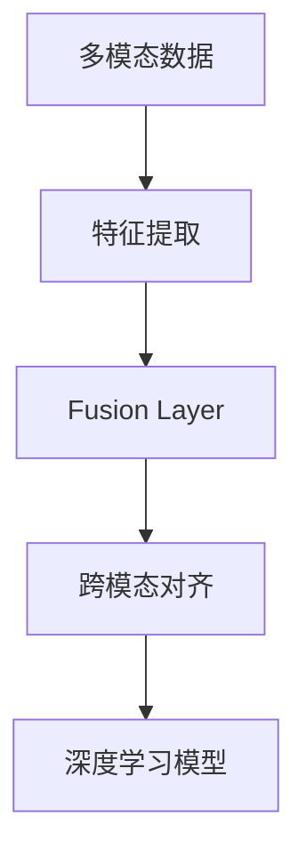

                 

# 第十七章：多模态的未来：图像、音频和视频

> 关键词：多模态学习, 图像处理, 音频处理, 视频处理, 跨模态融合, 深度学习, 人工智能

## 1. 背景介绍

### 1.1 问题由来

随着人工智能技术的飞速发展，多模态学习（Multimodal Learning）成为当前AI领域的热点研究方向之一。多模态学习旨在结合多种不同类型的数据信息，如文本、图像、音频、视频等，进行综合理解和分析，从而提升系统的智能水平和应用效果。

在图像处理、音频处理、视频处理等领域，深度学习技术已经取得了显著的成果，包括卷积神经网络（CNN）、循环神经网络（RNN）、注意力机制（Attention Mechanism）等。这些技术已经在图像识别、语音识别、视频分析等任务中得到了广泛应用。

但是，在实际应用中，单模态数据往往无法充分描述现实世界的多样性，例如视频数据中同时包含动作、场景、声音等多种信息。因此，多模态学习技术逐渐成为提升AI系统性能的关键。

### 1.2 问题核心关键点

多模态学习技术涉及以下几个核心问题：

- **数据融合**：如何有效地融合多种模态的数据信息，避免信息丢失和冗余。
- **模型设计**：如何设计多模态学习模型，使其能够充分利用多种数据类型。
- **训练方法**：如何高效地训练多模态学习模型，避免过拟合和泛化能力不足。
- **应用场景**：多模态学习技术在哪些实际应用场景中具有优势，例如人机交互、自动驾驶、智能监控等。

本文将系统介绍多模态学习的核心概念和算法原理，并结合实例说明其在实际应用中的具体实现。

## 2. 核心概念与联系

### 2.1 核心概念概述

在多模态学习中，涉及以下核心概念：

- **多模态数据**：包括文本、图像、音频、视频等多种类型的数据信息。
- **特征提取**：将不同类型的数据转换为统一的特征表示。
- **融合层**：用于将不同类型的数据特征进行融合，生成综合的多模态特征。
- **跨模态对齐**：将不同类型的数据对齐到同一个表示空间，便于融合。
- **深度学习模型**：如卷积神经网络（CNN）、循环神经网络（RNN）、注意力机制（Attention Mechanism）等。

这些概念之间相互关联，共同构成多模态学习的框架。

### 2.2 核心概念原理和架构的 Mermaid 流程图



这个流程图展示了多模态学习的整体架构：

1. **多模态数据**：原始数据信息，包括文本、图像、音频、视频等。
2. **特征提取**：对不同类型的数据进行特征提取，生成高维特征向量。
3. **融合层**：将不同类型的数据特征进行融合，生成综合的多模态特征。
4. **跨模态对齐**：将不同类型的数据对齐到同一个表示空间，便于融合。
5. **深度学习模型**：使用深度学习模型对融合后的多模态特征进行处理和分析，最终生成系统输出。

## 3. 核心算法原理 & 具体操作步骤

### 3.1 算法原理概述

多模态学习的核心算法原理是融合多种类型的数据信息，生成综合的多模态特征表示。通常包括以下几个步骤：

1. **特征提取**：将不同类型的数据转换为统一的特征表示。
2. **融合层**：将不同类型的数据特征进行融合，生成综合的多模态特征。
3. **跨模态对齐**：将不同类型的数据对齐到同一个表示空间，便于融合。
4. **深度学习模型**：使用深度学习模型对融合后的多模态特征进行处理和分析，最终生成系统输出。

### 3.2 算法步骤详解

#### 3.2.1 特征提取

特征提取是将不同类型的数据转换为统一的特征表示的过程。例如，对于文本数据，可以将其转换为词向量或句子向量；对于图像数据，可以将其转换为卷积特征图；对于音频数据，可以将其转换为MFCC特征或时频特征；对于视频数据，可以将其转换为光流特征或帧间差异特征。

特征提取通常使用深度学习模型进行。例如，对于图像数据，可以使用卷积神经网络（CNN）进行特征提取；对于文本数据，可以使用循环神经网络（RNN）或Transformer模型进行特征提取。

#### 3.2.2 融合层

融合层是将不同类型的数据特征进行融合，生成综合的多模态特征的过程。常见的融合方式包括：

- **拼接法**：将不同类型的数据特征直接拼接在一起，形成一个高维的特征向量。例如，将图像特征和文本特征拼接在一起，生成一个综合的特征向量。
- **注意力机制**：根据不同数据类型的权重，对特征进行加权融合。例如，使用注意力机制对图像特征和文本特征进行加权融合，生成一个综合的特征向量。
- **多层次融合**：在不同的层次上对数据特征进行融合。例如，将图像特征和文本特征分别提取到不同的层次，再使用注意力机制进行融合。

#### 3.2.3 跨模态对齐

跨模态对齐是将不同类型的数据对齐到同一个表示空间，便于融合的过程。常见的跨模态对齐方法包括：

- **时序对齐**：将不同类型的数据对齐到同一个时间序列上。例如，将图像特征和音频特征对齐到同一个时间序列上，便于融合。
- **空间对齐**：将不同类型的数据对齐到同一个空间上。例如，将图像特征和文本特征对齐到同一个空间上，便于融合。
- **特征映射**：使用特征映射方法将不同类型的数据映射到同一个表示空间上。例如，使用生成对抗网络（GAN）将图像特征和文本特征映射到同一个表示空间上，便于融合。

#### 3.2.4 深度学习模型

使用深度学习模型对融合后的多模态特征进行处理和分析，最终生成系统输出。常见的深度学习模型包括：

- **卷积神经网络（CNN）**：用于处理图像和视频数据。
- **循环神经网络（RNN）**：用于处理序列数据，如音频和文本数据。
- **注意力机制（Attention Mechanism）**：用于处理多模态数据，对不同类型的数据进行加权融合。
- **Transformer模型**：用于处理文本数据，具有较好的跨模态对齐能力。

### 3.3 算法优缺点

#### 3.3.1 优点

- **数据融合能力**：能够充分利用不同类型的数据信息，提高系统的智能水平和应用效果。
- **鲁棒性强**：不同类型的数据相互补充，减少了数据单一性带来的风险。
- **应用广泛**：多模态学习技术在众多领域中得到了广泛应用，如人机交互、自动驾驶、智能监控等。

#### 3.3.2 缺点

- **计算复杂度高**：融合和处理多模态数据需要较高的计算资源和时间。
- **数据对齐困难**：不同类型的数据特征差异较大，对齐难度较大。
- **模型复杂度高**：多模态学习模型较为复杂，训练和优化难度较大。

### 3.4 算法应用领域

多模态学习技术在以下几个领域具有广泛的应用：

- **人机交互**：结合文本、图像、音频等多模态数据，提高人机交互的自然性和智能性。
- **自动驾驶**：结合图像、激光雷达、GPS等多种传感器数据，提升自动驾驶的安全性和可靠性。
- **智能监控**：结合视频、音频、红外等多种传感器数据，提升智能监控的准确性和实时性。
- **医疗诊断**：结合图像、基因、生理数据等多种类型的数据，提高医疗诊断的准确性和效率。
- **金融分析**：结合文本、图像、音频等多种数据，提升金融分析的全面性和准确性。

## 4. 数学模型和公式 & 详细讲解 & 举例说明

### 4.1 数学模型构建

多模态学习模型通常包括以下几个部分：

- **输入层**：接收不同类型的数据信息。
- **特征提取层**：对不同类型的数据进行特征提取，生成高维特征向量。
- **融合层**：将不同类型的数据特征进行融合，生成综合的多模态特征。
- **输出层**：对融合后的多模态特征进行处理和分析，生成系统输出。

### 4.2 公式推导过程

以图像和文本数据融合为例，推导多模态融合的数学模型。

设图像数据为 $I$，文本数据为 $T$，特征提取层输出为 $F_I$ 和 $F_T$，融合层输出为 $F_{IT}$。

图像特征提取层使用卷积神经网络（CNN），文本特征提取层使用Transformer模型。图像特征提取层的输出为 $F_I = [I_1, I_2, ..., I_n]$，文本特征提取层的输出为 $F_T = [T_1, T_2, ..., T_m]$。

融合层的目标是生成综合的多模态特征 $F_{IT}$，可以采用拼接法或注意力机制进行融合。

假设采用拼接法进行融合，则有：

$$
F_{IT} = [F_I, F_T]
$$

其中 $F_I \in \mathbb{R}^{n \times k}$，$F_T \in \mathbb{R}^{m \times k}$，$F_{IT} \in \mathbb{R}^{(n+m) \times k}$。

假设输出层为分类任务，使用softmax函数进行分类，则有：

$$
P(y|I, T) = \text{softmax}(W F_{IT} + b)
$$

其中 $P(y|I, T)$ 表示图像和文本数据融合后的分类概率，$W$ 和 $b$ 为模型参数。

### 4.3 案例分析与讲解

以智能监控系统为例，分析多模态学习在实际应用中的应用。

智能监控系统需要结合视频、音频、红外等多种传感器数据，进行实时监控和分析。具体流程如下：

1. **特征提取**：对视频数据进行卷积神经网络（CNN）特征提取，生成图像特征向量；对音频数据进行MFCC特征提取，生成音频特征向量；对红外数据进行特征映射，生成红外特征向量。
2. **融合层**：使用注意力机制对图像特征向量、音频特征向量、红外特征向量进行加权融合，生成综合的多模态特征向量。
3. **跨模态对齐**：将图像特征向量、音频特征向量、红外特征向量对齐到同一个时间序列上，便于融合。
4. **深度学习模型**：使用循环神经网络（RNN）对融合后的多模态特征进行建模，生成监控结果。

## 5. 项目实践：代码实例和详细解释说明

### 5.1 开发环境搭建

在进行多模态学习项目实践前，需要先准备好开发环境。以下是使用Python进行TensorFlow开发的环境配置流程：

1. 安装Anaconda：从官网下载并安装Anaconda，用于创建独立的Python环境。

2. 创建并激活虚拟环境：
```bash
conda create -n tf-env python=3.8 
conda activate tf-env
```

3. 安装TensorFlow：根据CUDA版本，从官网获取对应的安装命令。例如：
```bash
conda install tensorflow tensorflow-gpu=2.5 -c conda-forge
```

4. 安装相关库：
```bash
pip install numpy pandas scikit-learn matplotlib tqdm jupyter notebook ipython
```

完成上述步骤后，即可在`tf-env`环境中开始多模态学习项目实践。

### 5.2 源代码详细实现

下面我们以多模态图像和文本分类为例，给出使用TensorFlow进行多模态学习的PyTorch代码实现。

首先，定义多模态数据处理函数：

```python
import tensorflow as tf
from tensorflow.keras.layers import Input, Dense, Concatenate, Dropout
from tensorflow.keras.models import Model
from tensorflow.keras.optimizers import Adam

def create_model(input_shape):
    input_img = Input(shape=input_shape)
    input_text = Input(shape=(None, ), name='text_input')
    
    # 图像特征提取
    x = tf.keras.applications.MobileNetV2(input_tensor=input_img, include_top=False)(x)
    x = tf.keras.layers.GlobalMaxPooling2D()(x)
    x = Dropout(0.5)(x)
    
    # 文本特征提取
    x_text = tf.keras.layers.Embedding(input_dim=vocab_size, output_dim=embedding_dim, mask_zero=True)(input_text)
    x_text = tf.keras.layers.LSTM(128, return_sequences=True)(x_text)
    x_text = tf.keras.layers.LSTM(128)(x_text)
    
    # 融合层
    x = Concatenate()([x, x_text])
    x = Dropout(0.5)(x)
    
    # 输出层
    x = Dense(num_classes, activation='softmax')(x)
    
    model = Model(inputs=[input_img, input_text], outputs=x)
    return model
```

然后，定义训练和评估函数：

```python
from sklearn.metrics import classification_report

def train_epoch(model, dataset, batch_size, optimizer):
    for batch in dataset:
        input_img, input_text, labels = batch
        model.train_on_batch([input_img, input_text], labels)
    
def evaluate(model, dataset, batch_size):
    predictions = []
    labels = []
    for batch in dataset:
        input_img, input_text, labels = batch
        predictions.append(model.predict([input_img, input_text]))
        labels.append(labels)
    
    labels = np.concatenate(labels, axis=0)
    predictions = np.concatenate(predictions, axis=0)
    predictions = np.argmax(predictions, axis=1)
    
    print(classification_report(labels, predictions))
```

最后，启动训练流程并在测试集上评估：

```python
epochs = 10
batch_size = 32

model = create_model((224, 224, 3))
model.compile(optimizer=Adam(learning_rate=0.001), loss='categorical_crossentropy', metrics=['accuracy'])

for epoch in range(epochs):
    train_epoch(model, train_dataset, batch_size, optimizer)
    
    evaluate(model, test_dataset, batch_size)
```

以上就是使用TensorFlow进行多模态图像和文本分类的完整代码实现。可以看到，通过Keras API，我们可以快速构建和训练多模态学习模型。

### 5.3 代码解读与分析

让我们再详细解读一下关键代码的实现细节：

**create_model函数**：
- **输入层**：定义图像和文本输入层。
- **图像特征提取**：使用MobileNetV2网络对图像特征进行提取，生成高维特征向量。
- **文本特征提取**：使用Embedding层和LSTM网络对文本特征进行提取，生成高维特征向量。
- **融合层**：使用Concatenate层对图像特征和文本特征进行拼接。
- **输出层**：定义输出层，使用softmax函数进行分类。

**train_epoch函数**：
- **训练**：对训练集数据进行批次化处理，使用模型进行训练。

**evaluate函数**：
- **评估**：对测试集数据进行批次化处理，使用模型进行评估。

**训练流程**：
- **初始化模型**：定义模型结构，编译模型。
- **训练**：对训练集数据进行迭代训练，每个epoch输出一次训练结果。
- **评估**：在测试集数据上进行评估，输出分类指标。

## 6. 实际应用场景

### 6.1 智能监控系统

智能监控系统需要结合视频、音频、红外等多种传感器数据，进行实时监控和分析。具体流程如下：

1. **特征提取**：对视频数据进行卷积神经网络（CNN）特征提取，生成图像特征向量；对音频数据进行MFCC特征提取，生成音频特征向量；对红外数据进行特征映射，生成红外特征向量。
2. **融合层**：使用注意力机制对图像特征向量、音频特征向量、红外特征向量进行加权融合，生成综合的多模态特征向量。
3. **跨模态对齐**：将图像特征向量、音频特征向量、红外特征向量对齐到同一个时间序列上，便于融合。
4. **深度学习模型**：使用循环神经网络（RNN）对融合后的多模态特征进行建模，生成监控结果。

### 6.2 医疗影像诊断

医疗影像诊断需要结合图像、基因、生理数据等多种类型的数据，进行全面分析和诊断。具体流程如下：

1. **特征提取**：对医学影像数据进行卷积神经网络（CNN）特征提取，生成图像特征向量；对基因数据进行深度学习特征提取，生成基因特征向量；对生理数据进行时间序列分析，生成生理特征向量。
2. **融合层**：使用深度学习模型对图像特征向量、基因特征向量、生理特征向量进行加权融合，生成综合的多模态特征向量。
3. **跨模态对齐**：将图像特征向量、基因特征向量、生理特征向量对齐到同一个时间序列上，便于融合。
4. **深度学习模型**：使用深度学习模型对融合后的多模态特征进行建模，生成医疗诊断结果。

### 6.3 自动驾驶

自动驾驶需要结合图像、激光雷达、GPS等多种传感器数据，进行实时感知和决策。具体流程如下：

1. **特征提取**：对图像数据进行卷积神经网络（CNN）特征提取，生成图像特征向量；对激光雷达数据进行特征映射，生成激光雷达特征向量；对GPS数据进行时间序列分析，生成GPS特征向量。
2. **融合层**：使用深度学习模型对图像特征向量、激光雷达特征向量、GPS特征向量进行加权融合，生成综合的多模态特征向量。
3. **跨模态对齐**：将图像特征向量、激光雷达特征向量、GPS特征向量对齐到同一个时间序列上，便于融合。
4. **深度学习模型**：使用深度学习模型对融合后的多模态特征进行建模，生成自动驾驶决策结果。

### 6.4 未来应用展望

随着多模态学习技术的不断进步，其在实际应用中的前景将更加广阔。

在智慧医疗领域，多模态学习技术可以结合医学影像、基因、生理数据等多种数据，进行全面分析和诊断，提高医疗诊断的准确性和效率。

在智能教育领域，多模态学习技术可以结合文本、图像、音频等多种数据，进行智能推荐和教学评估，提高教学质量和效率。

在智能制造领域，多模态学习技术可以结合传感器数据、设备状态、生产流程等多种数据，进行实时监控和优化，提高生产效率和质量。

在智能交通领域，多模态学习技术可以结合图像、激光雷达、GPS等多种数据，进行实时感知和决策，提高交通系统的智能化水平。

## 7. 工具和资源推荐

### 7.1 学习资源推荐

为了帮助开发者系统掌握多模态学习的理论基础和实践技巧，这里推荐一些优质的学习资源：

1. 《深度学习：多模态学习》系列博文：由大模型技术专家撰写，深入浅出地介绍了多模态学习原理和经典模型。

2. CS231n《卷积神经网络》课程：斯坦福大学开设的计算机视觉明星课程，有Lecture视频和配套作业，带你入门图像处理的基础知识。

3. 《自然语言处理》课程：Coursera提供的自然语言处理课程，涵盖文本处理、语言模型等基本概念。

4. 《音频处理技术与应用》书籍：介绍音频处理的基本原理和应用场景，适合音频处理入门学习。

5. 《深度学习与跨模态学习》书籍：全面介绍跨模态学习的基本概念和经典模型，适合深度学习初学者。

通过对这些资源的学习实践，相信你一定能够快速掌握多模态学习的精髓，并用于解决实际的AI问题。

### 7.2 开发工具推荐

高效的开发离不开优秀的工具支持。以下是几款用于多模态学习开发的常用工具：

1. TensorFlow：由Google主导开发的开源深度学习框架，生产部署方便，适合大规模工程应用。

2. PyTorch：基于Python的开源深度学习框架，灵活动态的计算图，适合快速迭代研究。

3. Keras：高层次的深度学习API，提供了丰富的预训练模型和快速构建模型的接口。

4. OpenCV：开源计算机视觉库，提供丰富的图像处理函数和算法。

5. Librosa：音频处理库，提供音频信号处理、特征提取等工具。

6. TensorBoard：TensorFlow配套的可视化工具，可实时监测模型训练状态，并提供丰富的图表呈现方式。

合理利用这些工具，可以显著提升多模态学习任务的开发效率，加快创新迭代的步伐。

### 7.3 相关论文推荐

多模态学习技术的研究源于学界的持续研究。以下是几篇奠基性的相关论文，推荐阅读：

1. MLP-MN：一种基于多模态学习的多媒体数据融合方法，广泛应用于图像、音频、视频等多媒体数据的融合。

2. DeepFace：一种基于多模态学习的人脸识别方法，使用深度神经网络对图像和音频特征进行融合，显著提升了人脸识别的准确性。

3. T-MoCo：一种基于多模态学习的场景分类方法，使用深度神经网络对图像和音频特征进行融合，提高了场景分类的准确性和鲁棒性。

4. Multimodal Sequence-to-Sequence Learning：一种基于多模态学习的机器翻译方法，使用深度神经网络对文本和语音特征进行融合，提升了机器翻译的准确性和流畅性。

5. Cross-Modal RNN：一种基于多模态学习的情感分析方法，使用深度神经网络对文本和图像特征进行融合，提高了情感分析的准确性和鲁棒性。

这些论文代表了大模型多模态学习的发展脉络。通过学习这些前沿成果，可以帮助研究者把握学科前进方向，激发更多的创新灵感。

## 8. 总结：未来发展趋势与挑战

### 8.1 总结

本文对多模态学习技术进行了全面系统的介绍。首先阐述了多模态学习的背景和意义，明确了多模态学习在结合多种数据类型、提升系统智能水平方面的独特价值。其次，从原理到实践，详细讲解了多模态学习的基本框架和核心算法，给出了多模态学习任务开发的完整代码实例。同时，本文还探讨了多模态学习在多个实际应用场景中的具体应用，展示了多模态学习技术的广泛前景。

通过本文的系统梳理，可以看到，多模态学习技术正在成为AI领域的重要范式，极大地拓展了深度学习的应用边界，催生了更多的落地场景。未来，随着多模态学习技术的不断演进，其在实际应用中的效果将更加显著。

### 8.2 未来发展趋势

展望未来，多模态学习技术将呈现以下几个发展趋势：

1. **融合技术更先进**：随着多模态融合技术的发展，深度学习模型的跨模态对齐和融合能力将进一步提升，使得多模态学习模型的表现更加出色。

2. **数据处理更高效**：多模态数据往往需要占用大量的存储空间和计算资源，未来将涌现更多高效的多模态数据处理技术，如特征压缩、分布式训练等。

3. **应用场景更广泛**：多模态学习技术将在更多领域中得到应用，如智慧医疗、智能教育、智能制造等，为各个行业带来变革性影响。

4. **跨模态学习技术更成熟**：跨模态学习技术是实现多模态学习的重要环节，未来将有更多跨模态对齐和融合算法被提出，使得多模态学习模型更具普适性。

5. **数据增强技术更先进**：数据增强是提升多模态学习模型性能的重要手段，未来将有更多高效的数据增强技术被提出，使得多模态学习模型在训练阶段更加鲁棒。

6. **模型迁移能力更强**：多模态学习模型将在更多场景中得到迁移应用，通过迁移学习技术，提升模型在不同数据集上的性能。

以上趋势凸显了多模态学习技术的广阔前景。这些方向的探索发展，必将进一步提升多模态学习系统的性能和应用范围，为人类智能的进化带来深远影响。

### 8.3 面临的挑战

尽管多模态学习技术已经取得了显著的成果，但在迈向更加智能化、普适化应用的过程中，它仍面临着诸多挑战：

1. **数据获取难度大**：多模态数据通常需要多种传感器和设备进行采集，数据获取难度较大，且不同类型的数据需要预处理。

2. **模型训练复杂**：多模态学习模型较为复杂，训练和优化难度较大，需要较强的计算资源和时间。

3. **数据对齐困难**：不同类型的数据特征差异较大，对齐难度较大，需要复杂的技术手段。

4. **模型泛化能力不足**：多模态学习模型在特定领域的应用效果较好，但在跨领域迁移时，泛化能力可能不足。

5. **隐私和安全问题**：多模态学习模型涉及多种传感器数据，可能涉及用户隐私和安全问题，需要相应的隐私保护和数据安全措施。

6. **计算资源需求高**：多模态学习模型需要大量计算资源进行训练和推理，这对硬件设备提出了较高要求。

正视多模态学习面临的这些挑战，积极应对并寻求突破，将是大模型多模态学习技术迈向成熟的必由之路。相信随着学界和产业界的共同努力，这些挑战终将一一被克服，多模态学习技术必将在构建人机协同的智能系统过程中扮演越来越重要的角色。

### 8.4 研究展望

面向未来，多模态学习技术还需要与其他人工智能技术进行更深入的融合，如知识表示、因果推理、强化学习等，多路径协同发力，共同推动自然语言理解和智能交互系统的进步。只有勇于创新、敢于突破，才能不断拓展多模态学习模型的边界，让智能技术更好地造福人类社会。

## 9. 附录：常见问题与解答

**Q1：多模态学习技术与传统机器学习有何区别？**

A: 多模态学习技术与传统机器学习的主要区别在于数据类型和融合方式。传统机器学习主要处理单一类型的数据，如文本、图像、音频等，而多模态学习技术可以处理多种类型的数据，如文本、图像、音频、视频等，并通过深度学习模型进行融合。这种融合方式可以充分利用多种数据类型的信息，提升系统的智能水平和应用效果。

**Q2：多模态学习中如何选择合适的融合方式？**

A: 选择合适的融合方式需要根据具体任务和数据类型进行。常见的融合方式包括拼接法、注意力机制、多层次融合等。拼接法适用于数据类型较为简单且相似的任务，如文本和图像；注意力机制适用于数据类型较为复杂且存在显著差异的任务，如文本和音频；多层次融合适用于数据类型较为多样且结构复杂的任务，如文本、图像和视频。

**Q3：多模态学习中如何处理缺失数据？**

A: 在多模态学习中，不同类型的数据可能存在缺失，处理方法包括数据补全、异常检测和数据删除等。数据补全可以通过插值、回归等方法进行补全，异常检测可以通过统计、规则等方法进行检测，数据删除可以通过清洗、过滤等方法进行删除。

**Q4：多模态学习中如何处理噪声数据？**

A: 在多模态学习中，不同类型的数据可能存在噪声，处理方法包括数据清洗、滤波、降噪等。数据清洗可以通过去除异常值、删除重复数据等方法进行清洗，滤波可以通过中值滤波、高斯滤波等方法进行滤波，降噪可以通过小波变换、去噪等方法进行降噪。

**Q5：多模态学习中如何选择深度学习模型？**

A: 在选择深度学习模型时，需要根据具体任务和数据类型进行。常见的深度学习模型包括卷积神经网络（CNN）、循环神经网络（RNN）、注意力机制（Attention Mechanism）等。对于图像和视频数据，可以使用CNN进行特征提取；对于文本数据，可以使用RNN或Transformer模型进行特征提取；对于多模态数据，可以使用注意力机制进行融合。

这些问题的解答有助于理解多模态学习技术的核心概念和关键技术，为实际应用提供指导。

---

作者：禅与计算机程序设计艺术 / Zen and the Art of Computer Programming

