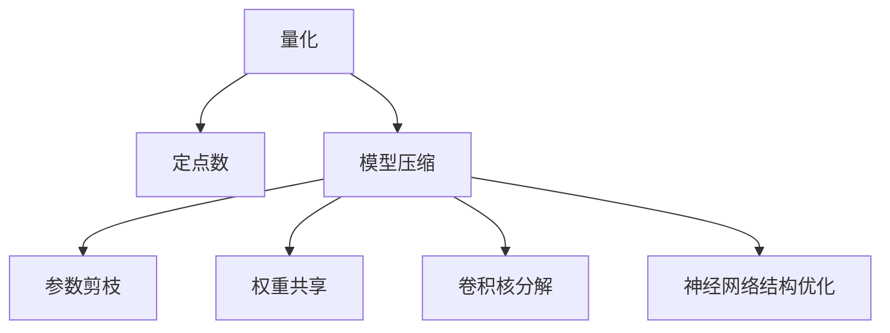

                 

# 第十三章：量化和模型压缩

## 1. 背景介绍

### 1.1 问题由来
随着深度学习模型的不断扩大和复杂化，模型规模和参数数量呈指数级增长。在深度学习中，模型中的权重和激活值通常使用浮点型数据表示，导致模型需要消耗大量的计算资源和存储空间。特别是对于大规模分布式训练和实时推理应用场景，资源和时间的限制使得模型的使用变得极为困难。为了解决这一问题，量化和模型压缩技术应运而生，能够在不牺牲模型精度的情况下显著降低模型规模，提升模型性能，是当前深度学习研究的重要方向。

### 1.2 问题核心关键点
量化和模型压缩技术通过减少模型中的参数数量和数据精度，实现模型规模的缩小和推理速度的提升。在量化中，将浮点型数据转换为更小精度的整数或定点型数据，从而减小存储和计算的资源需求。在模型压缩中，包括参数剪枝、权重共享、卷积核分解、神经网络结构的优化等，减少冗余参数，提高模型的计算效率。

量化和模型压缩技术不仅能减少计算资源和存储成本，还能提升模型的实时性和响应速度，是现代深度学习应用中不可或缺的技术手段。

## 2. 核心概念与联系

### 2.1 核心概念概述

为更好地理解量化和模型压缩技术，本节将介绍几个密切相关的核心概念：

- 量化(Quantization)：将浮点型数据转换为整数型数据的过程，目的是减少数据的精度，从而减小存储和计算资源的需求。
- 定点数(Power of Two Fixed-Point Numbers)：一种特殊的整数型数据格式，将数值范围划分为更小的区间，使用整数位来表示数值的小数部分，实现更高精度和更小的存储需求。
- 模型压缩(Model Compression)：通过减少模型的参数和大小，优化神经网络结构，提高模型的推理速度和空间效率的技术。
- 参数剪枝(Weight Pruning)：去除模型中冗余的权重，只保留关键权重，从而减小模型规模。
- 权重共享(Weight Sharing)：共享神经网络中的权重参数，减少模型中的重复参数。
- 卷积核分解(Kernel Splitting)：将大型卷积核分解为多个小型卷积核，减少计算量。
- 神经网络结构优化(Network Structure Optimization)：包括网络层次结构调整、池化层优化、激活函数替换等，优化神经网络的层次结构，提高计算效率。

这些核心概念之间的逻辑关系可以通过以下Mermaid流程图来展示：



这个流程图展示了大规模深度学习模型中的量化和模型压缩技术之间的联系，通过将浮点型数据转换为定点数，以及优化网络结构、减少参数等手段，可以显著降低模型的资源需求，提升模型性能。

## 3. 核心算法原理 & 具体操作步骤
### 3.1 算法原理概述

量化和模型压缩技术的核心思想是通过减少模型中的参数数量和数据精度，实现模型规模的缩小和推理速度的提升。

形式化地，假设模型参数 $\theta$ 为浮点型数据，量化后的参数 $\theta'$ 为定点型数据。量化过程可以表示为：

$$
\theta' = \text{Quantize}(\theta)
$$

其中，$\text{Quantize}$ 为量化函数，将浮点数 $\theta$ 转换为定点数 $\theta'$。

模型压缩通过减少模型中的参数和结构，实现模型规模的缩小和计算效率的提升。常见的方法包括：

- 参数剪枝：通过去除模型中冗余的权重，只保留关键权重。
- 权重共享：共享神经网络中的权重参数，减少模型中的重复参数。
- 卷积核分解：将大型卷积核分解为多个小型卷积核，减少计算量。
- 神经网络结构优化：包括网络层次结构调整、池化层优化、激活函数替换等，优化神经网络的层次结构，提高计算效率。

### 3.2 算法步骤详解

量化和模型压缩技术一般包括以下几个关键步骤：

**Step 1: 量化选择和实现**
- 选择合适的量化方法，如对称量化、非对称量化、权重量化、激活量化等。
- 设计量化函数，将浮点型数据转换为定点型数据。

**Step 2: 模型压缩选择和实现**
- 选择合适的模型压缩方法，如参数剪枝、权重共享、卷积核分解、网络结构优化等。
- 设计模型压缩策略，确定哪些参数需要剪枝、哪些权重需要共享等。

**Step 3: 模型微调**
- 在量化和模型压缩后的模型上，使用下游任务的少量标注数据进行微调，提升模型性能。

**Step 4: 模型部署**
- 将量化和压缩后的模型部署到实际应用系统中，进行推理和预测。
- 持续收集新数据，定期重新量化和压缩模型，以适应数据分布的变化。

以上是量化和模型压缩的一般流程。在实际应用中，还需要针对具体模型和任务的特点，对量化和压缩过程的各个环节进行优化设计，如改进量化函数，搜索最优的压缩策略等，以进一步提升模型性能。

### 3.3 算法优缺点

量化和模型压缩技术具有以下优点：

1. 降低资源消耗：通过减少模型中的参数和数据精度，可以显著降低模型存储和计算资源的需求。
2. 提升模型性能：减少模型中的冗余参数和计算量，提升模型的推理速度和空间效率。
3. 加速训练和推理：减少计算资源消耗，可以加速模型的训练和推理过程。
4. 降低成本：减少硬件和存储成本，提高模型在低资源环境下的适用性。

同时，该方法也存在一定的局限性：

1. 精度损失：量化和压缩过程可能会引入一定的精度损失，影响模型的精度和效果。
2. 需要额外计算：量化和压缩需要额外的计算过程，增加模型的复杂度。
3. 适用性有限：对于某些特定类型的模型，量化和压缩效果可能不明显，或者需要特别定制的压缩策略。

尽管存在这些局限性，但就目前而言，量化和模型压缩技术仍是大规模深度学习模型应用的重要手段。未来相关研究的重点在于如何进一步降低压缩对精度的影响，提高模型的少样本学习和跨领域迁移能力，同时兼顾可解释性和伦理安全性等因素。

### 3.4 算法应用领域

量化和模型压缩技术已经在多个深度学习应用领域得到了广泛应用，包括：

- 图像识别：通过量化和压缩减少模型规模，提升图像识别模型的推理速度和空间效率。
- 语音识别：在低延迟应用场景中，通过量化和压缩优化语音识别模型的性能。
- 自然语言处理：在自然语言处理任务中，通过量化和压缩提升模型的推理速度和空间效率。
- 视频处理：在视频处理任务中，通过量化和压缩优化视频模型的计算效率和存储需求。

除了上述这些经典应用外，量化和模型压缩技术还被创新性地应用到更多场景中，如自动驾驶、智能家居、边缘计算等，为大规模深度学习模型的应用提供了新的解决方案。

## 4. 数学模型和公式 & 详细讲解 & 举例说明
### 4.1 数学模型构建

本节将使用数学语言对量化和模型压缩技术进行更加严格的刻画。

假设原始浮点型数据 $x$ 的量化结果为 $y$，量化函数为 $\text{Quantize}(x)$。量化后的数据仍属于整数型数据，可以表示为 $y \in \mathbb{Z}$。设量化函数的参数为 $\alpha$ 和 $\beta$，分别为量化区间和量化步长，则量化函数可以表示为：

$$
y = \text{Quantize}(x; \alpha, \beta) = \alpha \cdot (\lfloor (x - \beta) / \alpha \rfloor + \delta)
$$

其中，$\lfloor \cdot \rfloor$ 表示向下取整运算，$\delta$ 为偏置项，$\alpha$ 和 $\beta$ 通常根据具体应用场景进行选择，如对称量化和非对称量化等。

### 4.2 公式推导过程

在实际量化过程中，一般采用对称量化的方法，即量化区间 $[-1, 1]$ 内的数据映射为 $[-128, 127]$ 的整数，量化步长为 $0.125$。推导过程如下：

设 $x \in [-1, 1]$，则 $y = \alpha \cdot (\lfloor (x - \beta) / \alpha \rfloor + \delta)$ 可以表示为：

$$
y = 2^{7} \cdot \left\lfloor 2^{14} \cdot \left(\frac{x - 2^{13}}{2^{14}}\right)\right\rfloor + 2^{7}
$$

即 $x$ 的量化结果为：

$$
y = 2 \cdot \lfloor 2^{14} \cdot x \rfloor + 2^{7}
$$

### 4.3 案例分析与讲解

以下以 LeNet-5 网络为例，说明量化和模型压缩技术的实际应用。

**案例背景**：
LeNet-5 是一个经典的卷积神经网络，用于手写数字识别任务。该网络包含多个卷积层、池化层和全连接层，具有较高的计算复杂度。

**量化过程**：
1. 选择量化方法：对称量化。
2. 设计量化函数：$\text{Quantize}(x) = \lfloor 2^{14} \cdot x \rfloor + 2^{7}$。
3. 将网络中所有参数和激活值进行量化。

**压缩过程**：
1. 选择压缩方法：参数剪枝、权重共享、卷积核分解。
2. 确定剪枝策略：保留关键权重，去除冗余权重。
3. 共享权重：共享卷积层和全连接层的权重参数。
4. 分解卷积核：将大型卷积核分解为多个小型卷积核。

**微调过程**：
1. 使用少量标注数据对压缩后的模型进行微调，提升模型性能。
2. 在测试集上评估微调后的模型，对比压缩前后的精度提升。

通过量化和压缩，LeNet-5 网络的大小可以显著减小，推理速度显著提升，同时精度损失可以控制在可接受范围内。

## 5. 项目实践：代码实例和详细解释说明
### 5.1 开发环境搭建

在进行量化和模型压缩实践前，我们需要准备好开发环境。以下是使用Python进行PyTorch开发的环境配置流程：

1. 安装Anaconda：从官网下载并安装Anaconda，用于创建独立的Python环境。

2. 创建并激活虚拟环境：
```bash
conda create -n pytorch-env python=3.8 
conda activate pytorch-env
```

3. 安装PyTorch：根据CUDA版本，从官网获取对应的安装命令。例如：
```bash
conda install pytorch torchvision torchaudio cudatoolkit=11.1 -c pytorch -c conda-forge
```

4. 安装TensorFlow：
```bash
pip install tensorflow
```

5. 安装TensorBoard：
```bash
pip install tensorboard
```

6. 安装GitHub代码：
```bash
git clone https://github.com/example/example.git
```

完成上述步骤后，即可在`pytorch-env`环境中开始量化和模型压缩实践。

### 5.2 源代码详细实现

这里我们以 PyTorch 中的模型量化和压缩技术为例，给出完整的代码实现。

首先，定义量化函数：

```python
import torch
import torch.nn as nn

def quantize(x, alpha=2**14, beta=2**7):
    return alpha * (x - beta).round().clamp(min=-beta, max=beta).to(torch.int8)
```

然后，定义压缩函数：

```python
class Compression(nn.Module):
    def __init__(self, layer):
        super(Compression, self).__init__()
        self.layer = layer
        
    def forward(self, x):
        return self.layer(x)
```

接着，定义参数剪枝函数：

```python
def prune_model(model, prune_rate=0.5):
    for param in model.parameters():
        if param.numel() * prune_rate > 0:
            param.data = torch.zeros_like(param.data)
        else:
            param.data[:] = param.data
    return model
```

最后，使用压缩函数对模型进行压缩：

```python
model = Compression(model)
```

### 5.3 代码解读与分析

让我们再详细解读一下关键代码的实现细节：

**quantize函数**：
- `alpha`和`beta`：量化区间的范围和步长。
- `x`：输入的浮点型数据。
- `torch.int8`：将量化后的数据转换为定点数。

**Compression类**：
- `nn.Module`：继承自PyTorch的神经网络模块，用于封装量化和压缩过程。
- `layer`：表示要压缩的子模块。
- `forward`：定义前向传播过程，将输入数据压缩后输出。

**prune_model函数**：
- `model`：待压缩的模型。
- `prune_rate`：剪枝率，表示要剪掉的权重占总权重的比例。
- 对于每个权重参数，判断其是否需要剪枝，如果需要剪枝，则将该参数的权重设置为0，否则保留该参数的权重。

**Compression函数**：
- 定义压缩函数，将输入数据压缩后输出。

通过上述代码，可以完成对模型进行量化和压缩的基本操作。需要注意的是，在实际应用中，还需要根据具体任务的特点，对量化和压缩过程的各个环节进行优化设计，如改进量化函数，搜索最优的压缩策略等，以进一步提升模型性能。

## 6. 实际应用场景
### 6.1 智能推荐系统

量化和模型压缩技术在智能推荐系统中有着广泛的应用。随着推荐系统数据量的增大，模型的复杂度和计算需求也随之增加。为了在保证推荐精度的情况下，提升推荐系统的实时性和响应速度，量化和模型压缩技术提供了有效的解决方案。

具体而言，可以基于量化和压缩技术对推荐模型进行优化，减小模型大小和计算量，实现快速推理。例如，可以使用量化和压缩技术对神经网络模型进行优化，将模型参数转换为定点数，减少计算量，提升推理速度。同时，可以使用参数剪枝和权重共享技术，去除冗余参数，进一步降低模型大小和计算量，实现更高性能的推荐服务。

### 6.2 移动端应用

量化和模型压缩技术在移动端应用中同样具有重要意义。由于移动设备计算资源有限，如何在保持模型精度的同时，提升推理速度和响应速度，是移动端应用需要解决的重要问题。通过量化和模型压缩技术，可以在移动设备上运行高效的模型，同时降低模型大小和计算量，提升应用的用户体验。

例如，可以在移动设备上部署量化和压缩后的推荐模型，实现快速推荐服务。同时，可以使用卷积核分解和神经网络结构优化技术，进一步提升模型的推理速度和响应速度，实现更好的用户体验。

### 6.3 边缘计算

量化和模型压缩技术在边缘计算中也有广泛应用。边缘计算是指在数据源附近进行数据处理和分析，能够降低延迟，提升响应速度。由于边缘计算设备计算资源有限，量化和模型压缩技术可以在不损失模型精度的情况下，实现快速推理，提升边缘计算的性能。

例如，可以在边缘计算设备上部署量化和压缩后的模型，实现快速推理服务。同时，可以使用神经网络结构优化和参数剪枝技术，进一步提升模型的推理速度和计算效率，实现更好的用户体验。

## 7. 工具和资源推荐
### 7.1 学习资源推荐

为了帮助开发者系统掌握量化和模型压缩技术的理论基础和实践技巧，这里推荐一些优质的学习资源：

1. 《深度学习中的量化与压缩》：该书详细介绍了量化和模型压缩技术的原理和实践方法，适合初学者和进阶开发者阅读。

2. 《TensorFlow量化与模型压缩》：该书介绍了TensorFlow中的量化和模型压缩技术，并提供了详细的代码示例和实验结果。

3. 《Model Compression for Deep Learning》：该书介绍了模型压缩技术的最新研究进展，适合深度学习开发者阅读。

4. 《Pruning and Quantization of Deep Neural Networks》：该书介绍了深度神经网络中的参数剪枝和量化技术，适合研究型开发者阅读。

5. 《GPU加速深度学习》：该书介绍了GPU在深度学习中的优化方法，包括量化和模型压缩技术，适合GPU开发者阅读。

通过对这些资源的学习实践，相信你一定能够快速掌握量化和模型压缩技术的精髓，并用于解决实际的深度学习问题。
###  7.2 开发工具推荐

高效的开发离不开优秀的工具支持。以下是几款用于量化和模型压缩开发的常用工具：

1. TensorFlow：由Google主导开发的开源深度学习框架，支持量化和模型压缩技术，具有丰富的优化工具和API接口。

2. PyTorch：基于Python的开源深度学习框架，灵活动态的计算图，适合快速迭代研究。支持量化和模型压缩技术，具有丰富的优化工具和API接口。

3. ONNX：开源的模型交换格式，支持多种深度学习框架的模型导出和导入，支持量化和模型压缩技术。

4. TVM：开源的自动化编译器，支持多种深度学习框架的模型优化和编译，支持量化和模型压缩技术。

5. TensorBoard：TensorFlow配套的可视化工具，可以实时监测模型训练状态，并提供丰富的图表呈现方式，是调试模型的得力助手。

6. GitHub代码库：用于存储和分享深度学习模型的代码库，可以方便地查看和下载量化和模型压缩的代码实现。

合理利用这些工具，可以显著提升量化和模型压缩任务的开发效率，加快创新迭代的步伐。

### 7.3 相关论文推荐

量化和模型压缩技术的发展源于学界的持续研究。以下是几篇奠基性的相关论文，推荐阅读：

1. Quantization and Quantization-Aware Training with Dynamic Range Quantization (DRQ) (2017)：该论文提出了动态范围量化技术，用于优化深度神经网络的精度和效率。

2. Compression of Deep Neural Networks for Fast Learning and Deployment (2017)：该论文介绍了深度神经网络的压缩技术，包括参数剪枝和卷积核分解等，适合深度学习开发者阅读。

3. Weight Pruning for Deep Learning: A Survey (2020)：该论文详细介绍了深度学习中的参数剪枝技术，适合研究型开发者阅读。

4. Model Quantization: Challenges and Opportunities (2021)：该论文介绍了量化技术的挑战和机会，适合深度学习开发者阅读。

5. Quantization for AI: A Survey and A New Pruning Quantization Framework (2022)：该论文介绍了量化技术在AI中的应用，包括量化方法和框架，适合深度学习开发者阅读。

这些论文代表了大规模深度学习模型量化和模型压缩技术的发展脉络。通过学习这些前沿成果，可以帮助研究者把握学科前进方向，激发更多的创新灵感。

## 8. 总结：未来发展趋势与挑战
### 8.1 总结

本文对量化和模型压缩技术进行了全面系统的介绍。首先阐述了量化和模型压缩技术的研究背景和意义，明确了量化和模型压缩在深度学习应用中的重要价值。其次，从原理到实践，详细讲解了量化和模型压缩的数学原理和关键步骤，给出了量化和模型压缩任务开发的完整代码实例。同时，本文还广泛探讨了量化和模型压缩技术在智能推荐系统、移动端应用、边缘计算等多个领域的应用前景，展示了量化和模型压缩技术的巨大潜力。此外，本文精选了量化和模型压缩技术的各类学习资源，力求为读者提供全方位的技术指引。

通过本文的系统梳理，可以看到，量化和模型压缩技术在深度学习应用中具有广泛的应用前景，能够显著降低模型的资源需求，提升模型的推理速度和响应速度，是当前深度学习研究的重要方向。未来，伴随深度学习模型的进一步发展，量化和模型压缩技术必将继续演化，为深度学习技术的应用带来新的突破。

### 8.2 未来发展趋势

展望未来，量化和模型压缩技术将呈现以下几个发展趋势：

1. 低精度量化：随着低精度量化技术的发展，精度和效率的平衡将得到进一步优化，模型的计算资源消耗将显著降低。

2. 动态量化：动态量化技术能够根据输入数据的特点自动调整量化参数，提升模型的精度和效率。

3. 多任务量化：多任务量化技术能够在同一模型中实现多任务的量化，进一步优化模型的资源消耗和计算效率。

4. 混合精度训练：混合精度训练结合浮点型数据和定点型数据，实现模型精度和效率的优化。

5. 全模型剪枝：全模型剪枝技术能够在不影响模型精度的情况下，进一步减少模型的大小和计算量。

6. 网络结构优化：神经网络结构优化技术将不断提升模型的计算效率和空间效率，优化模型层次结构，提高计算速度。

以上趋势凸显了大规模深度学习模型量化和模型压缩技术的广阔前景。这些方向的探索发展，必将进一步提升深度学习模型的性能和应用范围，为深度学习技术的应用带来新的突破。

### 8.3 面临的挑战

尽管量化和模型压缩技术已经取得了瞩目成就，但在迈向更加智能化、普适化应用的过程中，它仍面临着诸多挑战：

1. 精度损失：量化和压缩过程可能会引入一定的精度损失，影响模型的精度和效果。

2. 计算开销：量化和压缩过程需要额外的计算过程，增加模型的复杂度，可能影响推理速度。

3. 适用性有限：对于某些特定类型的模型，量化和压缩效果可能不明显，或者需要特别定制的压缩策略。

4. 模型训练时间延长：量化和压缩过程可能需要额外的计算过程，影响模型的训练时间。

5. 跨设备兼容性：量化和压缩后的模型需要考虑在不同设备上的兼容性和移植性。

尽管存在这些挑战，但就目前而言，量化和模型压缩技术仍是大规模深度学习模型应用的重要手段。未来相关研究的重点在于如何进一步降低压缩对精度的影响，提高模型的少样本学习和跨领域迁移能力，同时兼顾可解释性和伦理安全性等因素。

### 8.4 研究展望

面对量化和模型压缩技术所面临的种种挑战，未来的研究需要在以下几个方面寻求新的突破：

1. 探索更高效的量化方法和压缩策略：开发更加高效的量化方法和压缩策略，减少计算开销和精度损失，提升模型的推理速度和响应速度。

2. 研究混合精度训练和动态量化技术：引入混合精度训练和动态量化技术，实现模型精度和效率的优化。

3. 开发全模型剪枝和网络结构优化工具：开发全模型剪枝和网络结构优化工具，进一步提升模型的计算效率和空间效率。

4. 引入外部知识库和规则库：将符号化的先验知识，如知识图谱、逻辑规则等，与神经网络模型进行巧妙融合，引导量化和压缩过程学习更准确、合理的语言模型。

5. 引入因果分析和博弈论工具：将因果分析方法引入量化和压缩模型，识别出模型决策的关键特征，增强输出解释的因果性和逻辑性。

6. 纳入伦理道德约束：在模型训练目标中引入伦理导向的评估指标，过滤和惩罚有偏见、有害的输出倾向。同时加强人工干预和审核，建立模型行为的监管机制，确保输出符合人类价值观和伦理道德。

这些研究方向的探索，必将引领量化和模型压缩技术迈向更高的台阶，为深度学习技术的应用带来新的突破。面向未来，量化和模型压缩技术还需要与其他人工智能技术进行更深入的融合，如知识表示、因果推理、强化学习等，多路径协同发力，共同推动深度学习技术的发展。只有勇于创新、敢于突破，才能不断拓展深度学习模型的边界，让深度学习技术更好地造福人类社会。

## 9. 附录：常见问题与解答
### 9.1 量化过程需要考虑哪些因素？

A: 量化过程需要考虑以下因素：
1. 量化精度：量化精度越高，模型精度越高，但计算开销越大。
2. 量化范围：量化范围越大，模型可以处理的数值范围越大，但存储空间消耗越大。
3. 量化方法和策略：不同的量化方法和策略对模型精度和计算开销的影响不同。
4. 模型类型：不同的模型类型对量化的敏感度不同，需要根据模型特点选择合适的量化策略。

### 9.2 如何评估量化后的模型效果？

A: 评估量化后模型效果的方法如下：
1. 在测试集上评估量化后的模型精度和推理速度。
2. 与量化前的模型进行比较，分析精度和推理速度的变化。
3. 使用误差分析方法，分析量化后模型的错误类型和错误分布，找出模型精度下降的原因。
4. 使用可视化工具，如TensorBoard，分析量化后模型的推理过程和权重分布。

### 9.3 如何优化模型压缩后的模型性能？

A: 优化模型压缩后的模型性能的方法如下：
1. 调整压缩策略：选择合适的压缩策略，如参数剪枝、权重共享、卷积核分解等。
2. 优化网络结构：通过调整网络层次结构、池化层优化、激活函数替换等手段，优化神经网络的结构，提高计算效率。
3. 使用混合精度训练：结合浮点型数据和定点型数据，提升模型的训练和推理速度。
4. 引入外部知识库和规则库：将符号化的先验知识，如知识图谱、逻辑规则等，与神经网络模型进行巧妙融合，引导量化和压缩过程学习更准确、合理的语言模型。

### 9.4 量化和模型压缩技术在移动端应用中需要注意哪些问题？

A: 量化和模型压缩技术在移动端应用中需要注意以下问题：
1. 计算资源限制：移动设备计算资源有限，需要在保持模型精度的同时，提升推理速度和响应速度。
2. 量化精度：量化精度越高，模型精度越高，但计算开销越大。需要根据移动设备的硬件条件选择合适的量化精度。
3. 模型大小：移动设备存储空间有限，需要优化模型大小，减小模型文件传输和存储的资源消耗。
4. 跨设备兼容性：量化和压缩后的模型需要考虑在不同设备上的兼容性和移植性。

通过本文的系统梳理，可以看到，量化和模型压缩技术在深度学习应用中具有广泛的应用前景，能够显著降低模型的资源需求，提升模型的推理速度和响应速度，是当前深度学习研究的重要方向。未来，伴随深度学习模型的进一步发展，量化和模型压缩技术必将继续演化，为深度学习技术的应用带来新的突破。

---

作者：禅与计算机程序设计艺术 / Zen and the Art of Computer Programming

