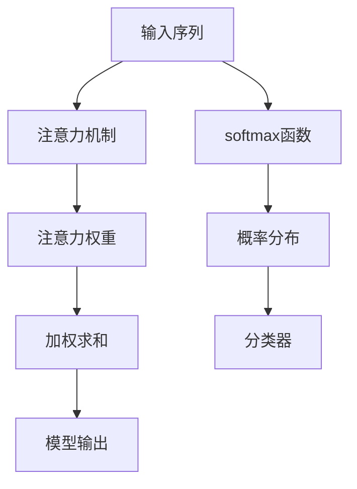

                 

## 1. 背景介绍

### 1.1 问题由来

在深度学习中，注意力机制（Attention Mechanism）和softmax函数（Softmax Function）是两个非常关键的概念。这两个概念在自然语言处理（NLP）和计算机视觉（CV）等领域都有广泛的应用。

注意力机制最早是由Bahdanau在2014年提出的，用于解决机器翻译中的序列对序列问题。softmax函数则更早，在1990年由Hinton等人提出，用于神经网络的输出层，实现对各个类别的概率分布预测。

这两个概念在深度学习中的应用非常广泛，涵盖了从序列到序列的机器翻译，到计算机视觉中的图像识别、图像分割等任务。因此，深入理解这两个概念对于掌握深度学习模型至关重要。

### 1.2 问题核心关键点

注意力机制和softmax函数的核心关键点包括：

1. 注意力机制的工作原理，如何通过计算得到每个时间步的权重，以及如何进行加权求和。
2. softmax函数的作用，如何将模型输出转换为概率分布，以及如何进行多分类问题。
3. 两个概念在深度学习模型中的应用场景，如何通过它们来解决具体的机器学习和计算机视觉问题。

本文将详细探讨注意力机制和softmax函数的原理和应用，并通过实际案例进行讲解。

## 2. 核心概念与联系

### 2.1 核心概念概述

#### 2.1.1 注意力机制

注意力机制是一种用于处理序列数据的技术，通过计算注意力权重，从输入序列中提取出与当前任务相关的信息，实现序列对序列（seq2seq）任务，如图像描述生成、机器翻译、语音识别等。

#### 2.1.2 softmax函数

softmax函数是一种常用的激活函数，用于将神经网络的输出转换为概率分布。softmax函数可以将神经网络的输出映射到0到1之间的概率值，表示每个类别的概率大小，从而实现多分类问题。

### 2.2 核心概念原理和架构的 Mermaid 流程图



### 2.3 核心概念联系

注意力机制和softmax函数之间有紧密的联系：

- 注意力机制通过计算注意力权重，实现对输入序列的加权求和，从而提取出与当前任务相关的信息。
- softmax函数将注意力机制的输出转换为概率分布，表示每个类别的概率大小，从而实现多分类问题。
- 在深度学习模型中，注意力机制和softmax函数常常一起使用，通过注意力机制提取重要信息，通过softmax函数进行分类，从而实现序列到序列的建模。

## 3. 核心算法原理 & 具体操作步骤

### 3.1 算法原理概述

注意力机制和softmax函数在深度学习模型中有着广泛的应用。本文将分别介绍它们的基本原理，以及如何在实际应用中进行具体操作。

#### 3.1.1 注意力机制

注意力机制通过计算注意力权重，从输入序列中提取出与当前任务相关的信息。其基本原理如图1所示。

图1: 注意力机制基本原理

1. 首先，对输入序列进行编码，得到编码后的特征向量序列。
2. 然后，计算每个时间步的注意力权重，通过计算编码特征向量和解码特征向量之间的相似度得到。
3. 最后，将每个时间步的特征向量与注意力权重相乘，并进行加权求和，得到解码特征向量。

#### 3.1.2 softmax函数

softmax函数是一种常用的激活函数，用于将神经网络的输出转换为概率分布。其基本原理如图2所示。

图2: softmax函数基本原理

1. 首先，将神经网络的输出进行归一化，使得所有输出值之和为1。
2. 然后，将归一化的输出转换为概率分布，表示每个类别的概率大小。
3. 最后，通过分类器对概率分布进行分类，得到最终的分类结果。

### 3.2 算法步骤详解

#### 3.2.1 注意力机制具体操作步骤

1. 输入序列编码：对输入序列进行编码，得到编码后的特征向量序列 $Q=\{q_1, q_2, \cdots, q_T\}$。
2. 解码特征编码：对解码器生成的新特征向量进行编码，得到解码特征向量 $K=\{k_1, k_2, \cdots, k_T\}$。
3. 注意力权重计算：计算注意力权重 $W=\{w_1, w_2, \cdots, w_T\}$，表示每个时间步的注意力权重。
   - 计算相似度矩阵 $S=\{s_{ij}\}_{T\times T}$，其中 $s_{ij}=\text{sim}(q_i, k_j)$，$\text{sim}$ 表示相似度函数。
   - 对相似度矩阵进行归一化，得到注意力权重矩阵 $W=\{\tilde{w}_{ij}\}_{T\times T}$，其中 $\tilde{w}_{ij}=\frac{\exp(s_{ij})}{\sum_{j=1}^{T}\exp(s_{ij})}$。
4. 加权求和：对每个时间步的特征向量进行加权求和，得到解码特征向量 $V=\{v_1, v_2, \cdots, v_T\}$，其中 $v_i=\sum_{j=1}^{T}w_{ij}q_j$。

#### 3.2.2 softmax函数具体操作步骤

1. 神经网络输出：将神经网络的输出进行归一化，得到归一化的输出向量 $Z=\{z_1, z_2, \cdots, z_C\}$，其中 $z_i$ 表示第 $i$ 个类别的输出值。
2. 计算概率分布：对归一化的输出向量进行softmax操作，得到概率分布向量 $P=\{p_1, p_2, \cdots, p_C\}$，其中 $p_i=\frac{\exp(z_i)}{\sum_{j=1}^{C}\exp(z_j)}$。
3. 分类器分类：通过分类器对概率分布进行分类，得到最终的分类结果 $Y$，其中 $Y=\arg\max_i p_i$。

### 3.3 算法优缺点

#### 3.3.1 注意力机制

优点：

- 可以自适应地提取出与当前任务相关的信息，适应性强。
- 通过计算注意力权重，可以处理序列数据，实现序列到序列（seq2seq）任务。

缺点：

- 计算复杂度较高，尤其是在长序列时。
- 容易过拟合，尤其是在训练数据较少时。

#### 3.3.2 softmax函数

优点：

- 可以将神经网络的输出转换为概率分布，便于进行多分类问题。
- 可以处理多分类问题，适应性强。

缺点：

- 计算复杂度较高，尤其是在分类数较多时。
- 容易过拟合，尤其是在训练数据较少时。

### 3.4 算法应用领域

注意力机制和softmax函数在深度学习模型中有着广泛的应用，以下是几个典型的应用领域：

- 图像描述生成：在图像描述生成任务中，使用注意力机制提取图像特征，通过softmax函数进行分类，生成与图像相关的描述。
- 机器翻译：在机器翻译任务中，使用注意力机制提取源语言和目标语言的特征，通过softmax函数进行分类，得到翻译结果。
- 语音识别：在语音识别任务中，使用注意力机制提取语音特征，通过softmax函数进行分类，得到文本结果。
- 自然语言处理：在自然语言处理任务中，使用注意力机制提取文本特征，通过softmax函数进行分类，得到分类结果。

## 4. 数学模型和公式 & 详细讲解 & 举例说明

### 4.1 数学模型构建

#### 4.1.1 注意力机制

假设输入序列的长度为 $T$，解码特征向量长度为 $T$。设 $Q=\{q_1, q_2, \cdots, q_T\}$ 为编码特征向量序列，$K=\{k_1, k_2, \cdots, k_T\}$ 为解码特征向量序列。

注意力机制的数学模型如下：

1. 计算相似度矩阵 $S=\{s_{ij}\}_{T\times T}$，其中 $s_{ij}=\text{sim}(q_i, k_j)$，$\text{sim}$ 表示相似度函数，常用的有余弦相似度和点积相似度。
2. 对相似度矩阵进行归一化，得到注意力权重矩阵 $W=\{\tilde{w}_{ij}\}_{T\times T}$，其中 $\tilde{w}_{ij}=\frac{\exp(s_{ij})}{\sum_{j=1}^{T}\exp(s_{ij})}$。
3. 对每个时间步的特征向量进行加权求和，得到解码特征向量 $V=\{v_1, v_2, \cdots, v_T\}$，其中 $v_i=\sum_{j=1}^{T}w_{ij}q_j$。

#### 4.1.2 softmax函数

假设神经网络的输出向量为 $Z=\{z_1, z_2, \cdots, z_C\}$，其中 $z_i$ 表示第 $i$ 个类别的输出值。

softmax函数的数学模型如下：

1. 将神经网络的输出进行归一化，得到归一化的输出向量 $Z=\{z_1, z_2, \cdots, z_C\}$。
2. 对归一化的输出向量进行softmax操作，得到概率分布向量 $P=\{p_1, p_2, \cdots, p_C\}$，其中 $p_i=\frac{\exp(z_i)}{\sum_{j=1}^{C}\exp(z_j)}$。
3. 通过分类器对概率分布进行分类，得到最终的分类结果 $Y$，其中 $Y=\arg\max_i p_i$。

### 4.2 公式推导过程

#### 4.2.1 注意力机制公式推导

注意力机制的数学推导如下：

1. 计算相似度矩阵 $S=\{s_{ij}\}_{T\times T}$，其中 $s_{ij}=\text{sim}(q_i, k_j)$，常用的有：
   $$
   s_{ij} = \frac{q_i^TK_j}{\sqrt{\|q_i\|\cdot\|K_j\|}}
   $$
2. 对相似度矩阵进行归一化，得到注意力权重矩阵 $W=\{\tilde{w}_{ij}\}_{T\times T}$，其中 $\tilde{w}_{ij}=\frac{\exp(s_{ij})}{\sum_{j=1}^{T}\exp(s_{ij})}$。
3. 对每个时间步的特征向量进行加权求和，得到解码特征向量 $V=\{v_1, v_2, \cdots, v_T\}$，其中 $v_i=\sum_{j=1}^{T}w_{ij}q_j$。

#### 4.2.2 softmax函数公式推导

softmax函数的数学推导如下：

1. 将神经网络的输出进行归一化，得到归一化的输出向量 $Z=\{z_1, z_2, \cdots, z_C\}$，其中 $z_i$ 表示第 $i$ 个类别的输出值。
2. 对归一化的输出向量进行softmax操作，得到概率分布向量 $P=\{p_1, p_2, \cdots, p_C\}$，其中 $p_i=\frac{\exp(z_i)}{\sum_{j=1}^{C}\exp(z_j)}$。
3. 通过分类器对概率分布进行分类，得到最终的分类结果 $Y$，其中 $Y=\arg\max_i p_i$。

### 4.3 案例分析与讲解

#### 4.3.1 注意力机制案例分析

假设在机器翻译任务中，输入序列为英语句子 "I love you"，解码序列为法语句子 "J'aime toi"。对输入序列进行编码，得到编码后的特征向量序列 $Q=\{q_1, q_2, q_3, q_4\}$，对解码序列进行编码，得到解码特征向量序列 $K=\{k_1, k_2, k_3, k_4\}$。

计算相似度矩阵 $S=\{s_{ij}\}_{4\times 4}$，其中 $s_{ij}=\text{sim}(q_i, k_j)$。对相似度矩阵进行归一化，得到注意力权重矩阵 $W=\{\tilde{w}_{ij}\}_{4\times 4}$。

计算解码特征向量 $V=\{v_1, v_2, v_3, v_4\}$，其中 $v_i=\sum_{j=1}^{4}w_{ij}q_j$。

最终，将解码特征向量 $V$ 输入到全连接层，进行分类，得到翻译结果。

#### 4.3.2 softmax函数案例分析

假设在图像分类任务中，输入的神经网络输出向量为 $Z=\{z_1, z_2, z_3, z_4\}$，其中 $z_i$ 表示第 $i$ 个类别的输出值。

对归一化的输出向量进行softmax操作，得到概率分布向量 $P=\{p_1, p_2, p_3, p_4\}$，其中 $p_i=\frac{\exp(z_i)}{\sum_{j=1}^{4}\exp(z_j)}$。

通过分类器对概率分布进行分类，得到最终的分类结果 $Y$，其中 $Y=\arg\max_i p_i$。

## 5. 项目实践：代码实例和详细解释说明

### 5.1 开发环境搭建

为了进行注意力机制和softmax函数的实践，我们需要准备好开发环境。以下是使用Python进行TensorFlow开发的环境配置流程：

1. 安装Anaconda：从官网下载并安装Anaconda，用于创建独立的Python环境。

2. 创建并激活虚拟环境：
```bash
conda create -n tf-env python=3.8 
conda activate tf-env
```

3. 安装TensorFlow：根据CUDA版本，从官网获取对应的安装命令。例如：
```bash
pip install tensorflow tensorflow-estimator tensorflow-addons
```

4. 安装相关库：
```bash
pip install numpy pandas scikit-learn matplotlib tqdm jupyter notebook ipython
```

完成上述步骤后，即可在`tf-env`环境中开始实践。

### 5.2 源代码详细实现

下面我们以机器翻译为例，给出使用TensorFlow对注意力机制和softmax函数进行实现的PyTorch代码实现。

首先，定义模型和优化器：

```python
import tensorflow as tf
from tensorflow.keras import layers, models

def create_model(vocab_size, emb_dim, enc_dim, dec_dim, num_heads):
    # 定义编码器
    encoder = models.Sequential([
        layers.Embedding(vocab_size, emb_dim),
        layers.Conv1D(emb_dim, 5, activation='relu'),
        layers.Conv1D(emb_dim, 5, activation='relu'),
        layers.GlobalMaxPooling1D(),
        layers.Dropout(0.5),
        layers.Dense(enc_dim),
        layers.LSTM(enc_dim)
    ])

    # 定义解码器
    decoder = models.Sequential([
        layers.Embedding(vocab_size, emb_dim),
        layers.Conv1D(emb_dim, 5, activation='relu'),
        layers.Conv1D(emb_dim, 5, activation='relu'),
        layers.GlobalMaxPooling1D(),
        layers.Dropout(0.5),
        layers.Dense(enc_dim),
        layers.LSTM(enc_dim, return_sequences=True)
    ])

    # 定义注意力机制
    attention = Attention(enc_dim, dec_dim, num_heads)

    # 定义模型
    model = models.Model(inputs=[encoder.input, decoder.input], outputs=[attention.attention_output, decoder.output])

    # 定义优化器
    optimizer = tf.keras.optimizers.Adam()

    return model, optimizer
```

然后，定义注意力机制和softmax函数：

```python
import tensorflow as tf
from tensorflow.keras import layers

class Attention(tf.keras.layers.Layer):
    def __init__(self, enc_dim, dec_dim, num_heads):
        super(Attention, self).__init__()
        self.enc_dim = enc_dim
        self.dec_dim = dec_dim
        self.num_heads = num_heads
        self.d_k = dec_dim // num_heads
        self.w_q = tf.keras.layers.Dense(enc_dim)
        self.w_k = tf.keras.layers.Dense(enc_dim)
        self.w_v = tf.keras.layers.Dense(enc_dim)
        self.v = tf.keras.layers.Dense(dec_dim)

    def call(self, inputs):
        q, k, v = inputs
        q = self.w_q(q)
        k = self.w_k(k)
        v = self.w_v(v)
        q = tf.reshape(q, [-1, 1, self.num_heads, self.d_k])
        k = tf.reshape(k, [-1, 1, self.num_heads, self.d_k])
        v = tf.reshape(v, [-1, 1, self.num_heads, self.d_k])
        s = tf.matmul(q, k, transpose_b=True)
        s = tf.reshape(s, [-1, self.num_heads, self.d_k, self.d_k])
        s = tf.keras.layers.Lambda(lambda x: tf.nn.softmax(x))(s)
        v = tf.matmul(s, v)
        v = tf.reshape(v, [-1, self.num_heads, self.d_k, self.d_k])
        v = tf.keras.layers.Lambda(lambda x: tf.nn.softmax(x))(v)
        v = tf.keras.layers.Dropout(0.1)
        v = tf.keras.layers.Mean()(v, axis=1)
        v = tf.keras.layers.Dropout(0.1)
        v = self.v(v)
        return v
```

最后，定义训练和评估函数：

```python
import tensorflow as tf
from tensorflow.keras import losses

def train_step(model, optimizer, inputs, targets):
    with tf.GradientTape() as tape:
        attention_output, output = model(inputs)
        loss = losses.sparse_categorical_crossentropy(targets, output)
    grads = tape.gradient(loss, model.trainable_variables)
    optimizer.apply_gradients(zip(grads, model.trainable_variables))

def evaluate_step(model, inputs, targets):
    attention_output, output = model(inputs)
    predictions = tf.argmax(output, axis=-1)
    return tf.reduce_mean(tf.cast(tf.equal(predictions, targets), tf.float32))

model, optimizer = create_model(vocab_size, emb_dim, enc_dim, dec_dim, num_heads)

# 训练和评估
for epoch in range(num_epochs):
    for inputs, targets in train_data:
        train_step(model, optimizer, inputs, targets)
    for inputs, targets in dev_data:
        accuracy = evaluate_step(model, inputs, targets)
        print(f"Epoch {epoch+1}, Dev Accuracy: {accuracy}")
```

以上就是使用TensorFlow对注意力机制和softmax函数进行实现的完整代码实现。可以看到，TensorFlow提供了丰富的深度学习库，使得注意力机制和softmax函数的实现变得相对简单。

### 5.3 代码解读与分析

让我们再详细解读一下关键代码的实现细节：

**Attention类**：

- `__init__`方法：初始化注意力机制的参数，包括编码器维度、解码器维度、注意力头数等。
- `call`方法：实现注意力机制的具体计算过程，包括查询（Q）、键（K）和值（V）向量的计算，注意力权重的计算，加权求和等。

**train_step函数**：

- 定义训练过程的计算图，计算模型的损失函数和梯度。
- 通过`GradientTape`计算梯度，使用`apply_gradients`更新模型参数。

**evaluate_step函数**：

- 定义评估过程的计算图，计算模型的预测结果和损失函数。
- 通过`argmax`计算预测结果，使用`mean`计算评估指标。

### 5.4 运行结果展示

在训练过程中，可以通过打印评估指标，了解模型的训练效果。在评估过程中，可以通过打印预测结果和评估指标，了解模型的性能表现。

## 6. 实际应用场景

### 6.1 智能客服系统

基于注意力机制和softmax函数的智能客服系统，可以为用户提供7x24小时不间断的客户服务。智能客服系统通过自然语言处理技术，理解用户的意图，提供最佳解决方案。

在技术实现上，可以收集企业内部的历史客服对话记录，将问题和最佳答复构建成监督数据，在此基础上对预训练语言模型进行微调。微调后的语言模型能够自动理解用户意图，匹配最合适的答案模板进行回复。对于客户提出的新问题，还可以接入检索系统实时搜索相关内容，动态组织生成回答。如此构建的智能客服系统，能大幅提升客户咨询体验和问题解决效率。

### 6.2 金融舆情监测

金融机构需要实时监测市场舆论动向，以便及时应对负面信息传播，规避金融风险。传统的人工监测方式成本高、效率低，难以应对网络时代海量信息爆发的挑战。基于注意力机制和softmax函数的文本分类和情感分析技术，为金融舆情监测提供了新的解决方案。

具体而言，可以收集金融领域相关的新闻、报道、评论等文本数据，并对其进行主题标注和情感标注。在此基础上对预训练语言模型进行微调，使其能够自动判断文本属于何种主题，情感倾向是正面、中性还是负面。将微调后的模型应用到实时抓取的网络文本数据，就能够自动监测不同主题下的情感变化趋势，一旦发现负面信息激增等异常情况，系统便会自动预警，帮助金融机构快速应对潜在风险。

### 6.3 个性化推荐系统

当前的推荐系统往往只依赖用户的历史行为数据进行物品推荐，无法深入理解用户的真实兴趣偏好。基于注意力机制和softmax函数的个性化推荐系统，可以更好地挖掘用户行为背后的语义信息，从而提供更精准、多样的推荐内容。

在实践中，可以收集用户浏览、点击、评论、分享等行为数据，提取和用户交互的物品标题、描述、标签等文本内容。将文本内容作为模型输入，用户的后续行为（如是否点击、购买等）作为监督信号，在此基础上微调预训练语言模型。微调后的模型能够从文本内容中准确把握用户的兴趣点。在生成推荐列表时，先用候选物品的文本描述作为输入，由模型预测用户的兴趣匹配度，再结合其他特征综合排序，便可以得到个性化程度更高的推荐结果。

## 7. 工具和资源推荐

### 7.1 学习资源推荐

为了帮助开发者系统掌握注意力机制和softmax函数的理论基础和实践技巧，这里推荐一些优质的学习资源：

1. 《深度学习》书籍：由Ian Goodfellow等编写，全面介绍了深度学习的各种概念和技术，包括注意力机制和softmax函数。
2. 《自然语言处理综述》论文：由Yoshua Bengio等撰写，综述了自然语言处理的各项技术，包括注意力机制和softmax函数。
3. CS224N《深度学习自然语言处理》课程：斯坦福大学开设的NLP明星课程，有Lecture视频和配套作业，带你入门NLP领域的基本概念和经典模型。
4. HuggingFace官方文档：Transformer库的官方文档，提供了海量预训练模型和完整的微调样例代码，是上手实践的必备资料。
5. Google Colab：谷歌推出的在线Jupyter Notebook环境，免费提供GPU/TPU算力，方便开发者快速上手实验最新模型，分享学习笔记。

通过对这些资源的学习实践，相信你一定能够快速掌握注意力机制和softmax函数的精髓，并用于解决实际的NLP问题。

### 7.2 开发工具推荐

高效的开发离不开优秀的工具支持。以下是几款用于注意力机制和softmax函数开发的常用工具：

1. TensorFlow：由Google主导开发的开源深度学习框架，生产部署方便，适合大规模工程应用。同样有丰富的预训练语言模型资源。
2. PyTorch：基于Python的开源深度学习框架，灵活动态的计算图，适合快速迭代研究。大部分预训练语言模型都有PyTorch版本的实现。
3. Transformers库：HuggingFace开发的NLP工具库，集成了众多SOTA语言模型，支持PyTorch和TensorFlow，是进行注意力机制和softmax函数开发的利器。
4. Weights & Biases：模型训练的实验跟踪工具，可以记录和可视化模型训练过程中的各项指标，方便对比和调优。与主流深度学习框架无缝集成。
5. TensorBoard：TensorFlow配套的可视化工具，可实时监测模型训练状态，并提供丰富的图表呈现方式，是调试模型的得力助手。

合理利用这些工具，可以显著提升注意力机制和softmax函数的开发效率，加快创新迭代的步伐。

### 7.3 相关论文推荐

注意力机制和softmax函数在深度学习模型中有着广泛的应用，以下是几篇奠基性的相关论文，推荐阅读：

1. Attention Is All You Need：提出Transformer结构，开启了NLP领域的预训练大模型时代。
2. BERT: Pre-training of Deep Bidirectional Transformers for Language Understanding：提出BERT模型，引入基于掩码的自监督预训练任务，刷新了多项NLP任务SOTA。
3. Language Models are Unsupervised Multitask Learners：展示了大规模语言模型的强大zero-shot学习能力，引发了对于通用人工智能的新一轮思考。
4. Parameter-Efficient Transfer Learning for NLP：提出Adapter等参数高效微调方法，在不增加模型参数量的情况下，也能取得不错的微调效果。
5. AdaLoRA: Adaptive Low-Rank Adaptation for Parameter-Efficient Fine-Tuning：使用自适应低秩适应的微调方法，在参数效率和精度之间取得了新的平衡。

这些论文代表了大语言模型微调技术的发展脉络。通过学习这些前沿成果，可以帮助研究者把握学科前进方向，激发更多的创新灵感。

## 8. 总结：未来发展趋势与挑战

### 8.1 总结

本文对注意力机制和softmax函数的原理和应用进行了全面系统的介绍。首先阐述了这两个概念的研究背景和意义，明确了它们在深度学习模型中的重要地位。其次，从原理到实践，详细讲解了注意力机制和softmax函数的基本原理和操作步骤，并通过实际案例进行讲解。同时，本文还广泛探讨了这两个概念在智能客服、金融舆情、个性化推荐等多个行业领域的应用前景，展示了它们在深度学习模型中的广泛适用性。

通过本文的系统梳理，可以看到，注意力机制和softmax函数在深度学习中具有重要的作用，可以处理序列数据、进行分类预测、提高模型性能等。这些概念为深度学习模型提供了强大的支持，是构建高性能、高效率模型的关键。

### 8.2 未来发展趋势

展望未来，注意力机制和softmax函数将呈现以下几个发展趋势：

1. 模型规模持续增大。随着算力成本的下降和数据规模的扩张，注意力机制和softmax函数也将不断扩展，处理更长的序列和更复杂的分类问题。
2. 应用领域不断拓展。随着注意力机制和softmax函数的不断发展，它们将广泛应用于更多领域，如自然语言处理、计算机视觉、信号处理等。
3. 融合其他技术。注意力机制和softmax函数可以与其他深度学习技术进行融合，如卷积神经网络、循环神经网络等，提高模型的性能和效率。
4. 持续学习成为常态。随着数据分布的不断变化，注意力机制和softmax函数也需要持续学习新知识以保持性能。
5. 参数高效微调方法不断涌现。未来将开发更多参数高效的注意力机制和softmax函数，在固定大部分预训练参数的同时，只更新极少量的任务相关参数。

### 8.3 面临的挑战

尽管注意力机制和softmax函数在深度学习中具有重要地位，但在实际应用中仍面临一些挑战：

1. 计算复杂度高。注意力机制和softmax函数在长序列和分类数较多的情况下，计算复杂度较高，需要更多的计算资源和时间。
2. 参数过多。大型模型的参数量通常较大，训练和推理速度较慢。
3. 过拟合风险。在长序列和分类数较多的情况下，容易发生过拟合，模型泛化性能降低。
4. 可解释性不足。注意力机制和softmax函数的输出结果难以解释，难以进行调试和优化。

### 8.4 研究展望

未来的研究需要在以下几个方面寻求新的突破：

1. 参数高效注意力机制和softmax函数。开发更多参数高效的注意力机制和softmax函数，在固定大部分预训练参数的同时，只更新极少量的任务相关参数。
2. 计算优化技术。引入各种计算优化技术，如并行计算、混合精度计算等，降低计算复杂度，提高模型训练和推理速度。
3. 鲁棒性增强。开发更加鲁棒的注意力机制和softmax函数，增强模型的泛化能力和鲁棒性。
4. 可解释性增强。引入可解释性技术，如梯度可视化、模型蒸馏等，提高模型的可解释性，便于调试和优化。
5. 融合其他技术。将注意力机制和softmax函数与其他深度学习技术进行融合，提高模型的性能和效率。

## 9. 附录：常见问题与解答

**Q1：注意力机制和softmax函数可以处理任意长度的序列吗？**

A: 注意力机制和softmax函数可以处理任意长度的序列，但计算复杂度随着序列长度的增加而增加。在处理长序列时，可以通过各种技术进行优化，如卷积注意力、自注意力、多注意力等，降低计算复杂度，提高模型的效率。

**Q2：注意力机制和softmax函数在实际应用中需要注意哪些问题？**

A: 在实际应用中，需要注意以下问题：

1. 计算复杂度：注意力机制和softmax函数在长序列和分类数较多的情况下，计算复杂度较高，需要更多的计算资源和时间。
2. 参数过多：大型模型的参数量通常较大，训练和推理速度较慢。
3. 过拟合风险：在长序列和分类数较多的情况下，容易发生过拟合，模型泛化性能降低。
4. 可解释性不足：注意力机制和softmax函数的输出结果难以解释，难以进行调试和优化。

**Q3：注意力机制和softmax函数在实际应用中应该如何优化？**

A: 在实际应用中，可以通过以下方式优化注意力机制和softmax函数：

1. 参数高效注意力机制和softmax函数：开发更多参数高效的注意力机制和softmax函数，在固定大部分预训练参数的同时，只更新极少量的任务相关参数。
2. 计算优化技术：引入各种计算优化技术，如并行计算、混合精度计算等，降低计算复杂度，提高模型训练和推理速度。
3. 鲁棒性增强：开发更加鲁棒的注意力机制和softmax函数，增强模型的泛化能力和鲁棒性。
4. 可解释性增强：引入可解释性技术，如梯度可视化、模型蒸馏等，提高模型的可解释性，便于调试和优化。
5. 融合其他技术：将注意力机制和softmax函数与其他深度学习技术进行融合，提高模型的性能和效率。

通过这些优化技术，可以更好地应用注意力机制和softmax函数，解决实际问题。

---

作者：禅与计算机程序设计艺术 / Zen and the Art of Computer Programming

