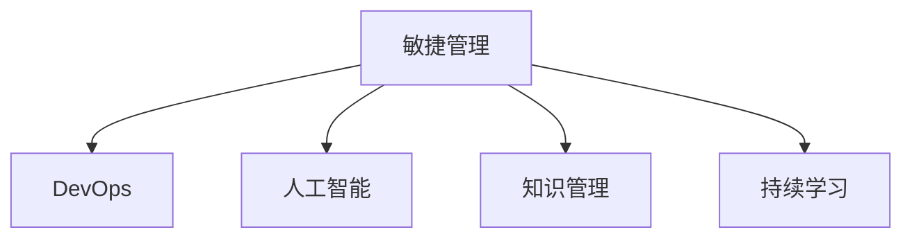

                 

# 管理者如何应对知识快速迭代

在当今快速发展的时代，知识的迭代更新速度已经远远超出了传统管理者的适应能力。企业环境变化迅猛，市场需求不断变化，管理者必须迅速学习并应用新知识才能保持竞争优势。本文将从背景介绍、核心概念、算法原理、项目实践、应用场景等多个方面深入探讨管理者如何应对知识快速迭代，为管理者提供切实可行的策略和工具。

## 1. 背景介绍

### 1.1 问题由来

随着技术的进步和市场的变化，知识更新速度不断加快。新的管理理论、技术工具和方法层出不穷，传统管理者往往难以跟上。例如，敏捷管理方法、DevOps、人工智能等新技术和理念正在颠覆传统的项目管理模式，管理者需要快速学习并应用这些新知识，以提升组织效率和竞争力。

### 1.2 问题核心关键点

管理者应对知识快速迭代的核心在于：

1. **快速学习**：管理者需要迅速获取并理解新知识，保持与时代同步。
2. **持续创新**：在实践中应用新知识，推动组织创新和变革。
3. **适应变化**：适应不断变化的市场需求和技术环境，灵活调整管理策略。
4. **提升能力**：通过学习和实践，提升自身管理能力和组织执行力。

## 2. 核心概念与联系

### 2.1 核心概念概述

为更好地理解管理者如何应对知识快速迭代，本节将介绍几个密切相关的核心概念：

- **敏捷管理(Agile Management)**：一种以人为核心、迭代开发、快速响应市场变化的管理模式，强调团队协作、客户参与和持续改进。
- **DevOps**：结合开发和运维的持续交付和持续集成实践，通过自动化工具和流程优化，提升软件交付效率和质量。
- **人工智能(Artificial Intelligence, AI)**：通过机器学习、深度学习等技术，使计算机具备智能决策和自我学习的能力。
- **知识管理(Knowledge Management)**：通过收集、整理、共享和应用知识，提高组织的学习能力和创新能力。
- **持续学习(Continuous Learning)**：一种不断追求知识更新和能力提升的学习方式，管理者需要通过不断的学习和实践，不断提升自己的管理水平。

这些核心概念之间的逻辑关系可以通过以下Mermaid流程图来展示：



这个流程图展示了几大核心概念之间的联系：

1. 敏捷管理通过敏捷方法和工具，提升了团队的协作效率和快速响应能力。
2. DevOps通过自动化和持续集成，提高了软件交付速度和质量。
3. 人工智能为敏捷管理、DevOps提供了技术支撑，如自动化测试、智能分析等。
4. 知识管理为敏捷管理、DevOps提供了知识基础，如文档管理、经验分享等。
5. 持续学习为敏捷管理、DevOps、人工智能、知识管理提供了不断更新知识的方法。

这些概念共同构成了现代管理环境的核心框架，管理者需要在实践中灵活应用，以适应快速变化的知识和技术环境。

## 3. 核心算法原理 & 具体操作步骤

### 3.1 算法原理概述

管理者应对知识快速迭代的核心算法原理可以归结为以下几个关键步骤：

1. **快速获取知识**：利用网络资源、培训课程、会议讲座等方式，迅速获取新知识。
2. **知识整理与存储**：对获取的知识进行整理和分类，存储在知识库中，方便查询和应用。
3. **持续学习与实践**：通过不断的学习和实践，将新知识应用到实际管理中，验证并优化。
4. **反馈与改进**：对应用新知识的效果进行评估，获取反馈信息，不断改进管理方法。

### 3.2 算法步骤详解

基于上述原理，管理者应对知识快速迭代的具体操作步骤如下：

**Step 1: 快速获取知识**

1. **网络资源利用**：利用Google Scholar、Coursera、edX等在线平台获取学术文章和培训课程。
2. **行业会议参加**：参加行业会议、技术沙龙、读书会等活动，与同行交流学习。
3. **专业书籍阅读**：阅读最新出版的管理书籍和技术文献，了解前沿思想和实践。
4. **专家访谈邀请**：邀请行业专家、技术大咖进行访谈，深入探讨新知识的应用。

**Step 2: 知识整理与存储**

1. **知识分类管理**：将获取的知识按照主题、领域、工具等分类整理，建立知识分类体系。
2. **知识库构建**：利用如Confluence、Notion等工具，构建个人或团队的知识库，存储整理后的知识。
3. **知识共享平台**：建立内部知识共享平台，如Intranet、Wiki等，方便团队成员查询和应用知识。

**Step 3: 持续学习与实践**

1. **持续学习计划**：制定持续学习计划，安排每周或每月固定时间学习新知识。
2. **学习笔记记录**：记录学习过程中的关键点和心得，形成学习笔记。
3. **实践应用验证**：将新知识应用到实际管理中，如敏捷项目管理、DevOps流程优化、AI数据分析等。
4. **效果评估与反馈**：评估新知识应用效果，收集反馈信息，识别问题和改进点。

**Step 4: 反馈与改进**

1. **评估工具应用**：使用KPI、OKR等评估工具，对新知识应用效果进行量化评估。
2. **反馈机制建立**：建立反馈机制，如定期讨论会、问卷调查等，收集团队成员的反馈信息。
3. **改进措施制定**：根据反馈信息，制定改进措施，不断优化管理方法和工具。
4. **持续迭代循环**：将改进措施反馈到学习计划和实践应用中，形成持续迭代循环。

### 3.3 算法优缺点

**优点**：

1. **提升效率**：通过快速获取和应用新知识，提升管理效率和创新能力。
2. **增强竞争力**：不断更新知识，保持与行业前沿同步，增强组织竞争力。
3. **促进协作**：建立知识共享平台，促进团队协作和知识传递。
4. **灵活应变**：持续学习和反馈机制，使管理者能够灵活应对市场和技术变化。

**缺点**：

1. **学习成本高**：获取和整理新知识需要大量时间和精力投入。
2. **知识难以掌握**：新知识庞杂多样，不易全面掌握。
3. **实践挑战大**：新知识应用到实际管理中，需要克服技术和实践上的挑战。
4. **反馈周期长**：新知识应用效果的评估和反馈周期较长，影响改进速度。

### 3.4 算法应用领域

基于快速迭代知识的应对策略，管理者可以在多个领域中应用，如：

- **项目管理**：敏捷管理、Scrum、Kanban等新方法的应用，提升项目交付效率和质量。
- **软件开发**：DevOps实践的应用，通过持续集成和自动化测试，提升软件交付速度和稳定性。
- **数据分析**：人工智能和大数据技术的应用，进行智能决策和预测，优化管理决策。
- **流程优化**：利用持续改进和精益管理理念，优化业务流程，提升运营效率。
- **人才培养**：持续学习与培训，提升团队成员的技术和管理能力，促进人才成长。

## 4. 数学模型和公式 & 详细讲解 & 举例说明

### 4.1 数学模型构建

管理者应对知识快速迭代的数学模型可以描述为：

- **知识获取模型**：描述知识获取的速率和来源，如 $K_{\text{获取}}(t) = \alpha + \beta t$，其中 $\alpha$ 为常数，$\beta$ 为知识获取速率。
- **知识应用模型**：描述知识应用的效果，如 $E_{\text{应用}}(t) = \gamma K_{\text{获取}}(t)$，其中 $\gamma$ 为知识应用效率。
- **反馈改进模型**：描述知识应用效果的反馈和改进，如 $F_{\text{改进}}(t) = (1-\delta)F_{\text{改进}}(t-1) + \epsilon$，其中 $\delta$ 为改进速率，$\epsilon$ 为改进量。

### 4.2 公式推导过程

以知识应用模型为例，其推导过程如下：

1. **知识获取速率**：假设知识获取速率为线性增长，则 $K_{\text{获取}}(t) = \alpha + \beta t$，其中 $\alpha$ 为初始知识量，$\beta$ 为每天获取的知识量。
2. **知识应用效果**：假设知识应用效果与知识获取量成正比，则 $E_{\text{应用}}(t) = \gamma K_{\text{获取}}(t)$，其中 $\gamma$ 为知识应用效率。
3. **知识应用效果评估**：假设知识应用效果的评估周期为 $T$ 天，则 $E_{\text{应用}}(t) = \sum_{i=1}^T \frac{E_i}{T}$，其中 $E_i$ 为第 $i$ 天应用效果。

### 4.3 案例分析与讲解

假设某公司制定了每周学习5小时的目标，知识获取速率为每天增加5%，知识应用效率为80%，则知识应用效果的计算公式如下：

$$
E_{\text{应用}}(t) = 0.8(\alpha + 1.05^\frac{t}{7}\beta)
$$

其中 $t$ 为学习天数，$7$ 为每周学习天数。通过该公式，可以计算不同时间点的知识应用效果，帮助公司制定学习计划和评估改进措施。

## 5. 项目实践：代码实例和详细解释说明

### 5.1 开发环境搭建

在进行知识快速迭代管理系统的开发前，我们需要准备好开发环境。以下是使用Python进行Django开发的环境配置流程：

1. 安装Anaconda：从官网下载并安装Anaconda，用于创建独立的Python环境。

2. 创建并激活虚拟环境：
```bash
conda create -n knowledge-management python=3.8 
conda activate knowledge-management
```

3. 安装Django：
```bash
pip install django
```

4. 安装Django扩展库：
```bash
pip install django-learn django-pandas django-templates
```

5. 安装数据库工具：
```bash
pip install psycopg2-binary
```

6. 安装可视化工具：
```bash
pip install matplotlib
```

完成上述步骤后，即可在`knowledge-management`环境中开始知识管理系统的开发。

### 5.2 源代码详细实现

这里我们以一个简单的知识管理系统为例，给出使用Django进行知识库构建和知识应用评估的Python代码实现。

首先，定义知识库的数据模型：

```python
from django.db import models

class Knowledge(models.Model):
    title = models.CharField(max_length=255)
    content = models.TextField()
    category = models.CharField(max_length=255)
    created_at = models.DateTimeField(auto_now_add=True)
    updated_at = models.DateTimeField(auto_now=True)

    def __str__(self):
        return self.title
```

然后，定义知识应用评估的数据模型：

```python
class Application(models.Model):
    knowledge = models.ForeignKey(Knowledge, on_delete=models.CASCADE)
    effect = models.FloatField()
    evaluator = models.ForeignKey(User, on_delete=models.CASCADE)
    created_at = models.DateTimeField(auto_now_add=True)
    updated_at = models.DateTimeField(auto_now=True)

    def __str__(self):
        return f"{self.knowledge.title}: {self.effect:.2f}"
```

接着，定义学习计划和反馈改进的数据模型：

```python
class LearningPlan(models.Model):
    name = models.CharField(max_length=255)
    target_hours = models.IntegerField()
    start_date = models.DateField()
    end_date = models.DateField()
    total_hours = models.IntegerField(default=0)
    completed_hours = models.IntegerField(default=0)
    user = models.ForeignKey(User, on_delete=models.CASCADE)

    def __str__(self):
        return f"{self.name}: {self.start_date} - {self.end_date}"

class Feedback(models.Model):
    user = models.ForeignKey(User, on_delete=models.CASCADE)
    knowledge = models.ForeignKey(Knowledge, on_delete=models.CASCADE)
    feedback = models.TextField()
    created_at = models.DateTimeField(auto_now_add=True)
    updated_at = models.DateTimeField(auto_now=True)

    def __str__(self):
        return f"{self.user.username} - {self.knowledge.title}"
```

最后，启动学习计划和知识应用评估的函数：

```python
from django.views.decorators.csrf import csrf_exempt
from django.shortcuts import render, redirect
from .models import LearningPlan, Knowledge, Application, Feedback

@csrf_exempt
def plan(request):
    if request.method == 'POST':
        plan_name = request.POST.get('plan_name')
        target_hours = request.POST.get('target_hours')
        start_date = request.POST.get('start_date')
        end_date = request.POST.get('end_date')
        user = request.user
        
        plan = LearningPlan.objects.create(
            name=plan_name,
            target_hours=target_hours,
            start_date=start_date,
            end_date=end_date,
            user=user
        )
        
        return redirect('learning')
    return render(request, 'learning.html')

@csrf_exempt
def learn(request):
    plan = request.POST.get('plan')
    user = request.user
    
    plan = LearningPlan.objects.get(name=plan, user=user)
    plan.completed_hours += 1
    plan.total_hours += 1
    plan.save()
    
    return redirect('knowledge')

@csrf_exempt
def knowledge(request):
    knowledge_id = request.POST.get('knowledge')
    user = request.user
    
    knowledge = Knowledge.objects.get(id=knowledge_id)
    if request.method == 'POST':
        effect = float(request.POST.get('effect'))
        evaluator = request.user
        
        Application.objects.create(
            knowledge=knowledge,
            effect=effect,
            evaluator=evaluator
        )
        
        knowledge.average_effect = round((knowledge.average_effect * 0.8 + effect * 0.2) / 2, 2)
        knowledge.save()
        
        return redirect('home')
    return render(request, 'knowledge.html')

@csrf_exempt
def home(request):
    knowledge = Knowledge.objects.all().order_by('-created_at')
    user = request.user
    plans = LearningPlan.objects.filter(user=user)
    
    return render(request, 'home.html', {'knowledge': knowledge, 'plans': plans})
```

以上就是使用Django进行知识管理系统开发的完整代码实现。可以看到，通过Django的强大封装，我们可以用相对简洁的代码完成知识库的构建和管理。

### 5.3 代码解读与分析

让我们再详细解读一下关键代码的实现细节：

**Knowledge类**：
- 定义了知识库的基本属性，如标题、内容、分类、创建和更新时间等。
- `__str__`方法用于在Django后台管理界面显示知识库信息。

**Application类**：
- 定义了知识应用评估的基本属性，如知识关联、应用效果、评估人、创建和更新时间等。
- `__str__`方法用于在Django后台管理界面显示应用评估信息。

**LearningPlan类**：
- 定义了学习计划的基本属性，如计划名称、目标小时数、开始和结束日期、完成和总小时数、用户关联等。
- `__str__`方法用于在Django后台管理界面显示学习计划信息。

**Feedback类**：
- 定义了反馈信息的基本属性，如用户关联、知识关联、反馈内容、创建和更新时间等。
- `__str__`方法用于在Django后台管理界面显示反馈信息。

**学习计划功能**：
- `plan`视图函数：处理学习计划的创建，从请求中获取计划名称、目标小时数、开始和结束日期，并创建一个学习计划。
- `learn`视图函数：处理学习计划的进度更新，从请求中获取计划名称和用户，更新学习计划的完成和总小时数。
- `home`视图函数：获取知识库和用户的学习计划，渲染主页。

**知识应用评估功能**：
- `knowledge`视图函数：处理知识应用评估的创建，从请求中获取知识关联、应用效果和评估人，创建一个评估记录，并更新知识库的平均效果。
- `home`视图函数：获取知识库和用户的学习计划，渲染主页。

以上代码实现展示了如何使用Django构建一个简单的知识管理系统，包括学习计划管理、知识应用评估等功能。通过不断迭代优化，该系统能够帮助管理者更好地应对知识快速迭代。

## 6. 实际应用场景

### 6.1 项目管理

敏捷管理方法在项目管理中的应用，使团队能够快速响应市场需求变化，提升项目交付效率。例如，某IT公司采用Scrum框架，通过每日站会、迭代计划等方式，提高团队协作效率和项目交付速度。通过敏捷管理的持续改进，公司能够灵活应对客户需求的变化，提升市场竞争力。

### 6.2 软件开发

DevOps实践在软件开发中的应用，通过持续集成和自动化测试，提升软件交付速度和质量。例如，某软件公司引入CI/CD流程，将测试和部署自动化，减少人为错误，提高软件交付速度。通过DevOps的持续改进，公司能够快速响应市场需求变化，提升软件质量。

### 6.3 数据分析

人工智能和大数据技术在数据分析中的应用，通过智能决策和预测，优化管理决策。例如，某电商公司利用AI技术进行客户行为分析，预测用户需求，优化库存管理。通过数据分析的持续改进，公司能够更好地理解用户需求，提升运营效率和市场竞争力。

### 6.4 流程优化

持续改进和精益管理理念在流程优化中的应用，通过不断优化业务流程，提升运营效率。例如，某制造公司引入精益管理理念，优化生产流程，减少浪费，提升生产效率。通过流程优化的持续改进，公司能够降低成本，提高市场竞争力。

### 6.5 人才培养

持续学习与培训在人才培养中的应用，通过不断提升团队成员的技术和管理能力，促进人才成长。例如，某金融公司定期组织培训和技术交流会，提升员工的技术和管理能力。通过人才培养的持续改进，公司能够培养高素质人才，提升整体竞争力。

## 7. 工具和资源推荐

### 7.1 学习资源推荐

为了帮助管理者系统掌握知识快速迭代的技术基础和实践技巧，这里推荐一些优质的学习资源：

1. **敏捷管理基础课程**：Coursera和edX提供的多门敏捷管理课程，包括Scrum、Kanban、XP等基础理论和方法。
2. **DevOps工具与实践**：Docker、Jenkins、Kubernetes等DevOps工具的官方文档和教程，帮助管理者掌握DevOps实践。
3. **人工智能基础课程**：Coursera和edX的人工智能课程，包括机器学习、深度学习、自然语言处理等基础理论和实践。
4. **知识管理工具**：Confluence、Notion等知识管理工具的官方文档和教程，帮助管理者构建和应用知识库。
5. **学习与成长平台**：Udemy、Coursera等平台提供的大量课程，覆盖各类知识快速迭代相关的理论和实践。

通过对这些资源的学习实践，相信管理者一定能够系统掌握知识快速迭代的技术基础和实践技巧，提升管理水平。

### 7.2 开发工具推荐

高效的开发离不开优秀的工具支持。以下是几款用于知识快速迭代管理的常用工具：

1. **Django**：Python Web框架，适用于构建复杂的数据库应用，如知识管理系统。
2. **Jupyter Notebook**：Jupyter Notebook是一个交互式编程环境，适用于数据科学和机器学习任务的开发。
3. **GitHub**：全球最大的代码托管平台，适用于版本控制和团队协作开发。
4. **Jenkins**：持续集成和持续交付工具，适用于自动化测试和部署。
5. **Kubernetes**：开源容器编排系统，适用于容器化应用和微服务架构的管理。

合理利用这些工具，可以显著提升知识快速迭代管理的开发效率，加快创新迭代的步伐。

### 7.3 相关论文推荐

知识快速迭代技术的发展源于学界的持续研究。以下是几篇奠基性的相关论文，推荐阅读：

1. **敏捷管理方法论**：James Kerr《敏捷革命2.0》，介绍敏捷管理的理论基础和实践方法。
2. **DevOps实践**：Patrick Debois《DevOps：软件开发生命周期自动化》，介绍DevOps的基础理论和工具。
3. **人工智能技术**：Ian Goodfellow《深度学习》，介绍人工智能的理论基础和应用方法。
4. **知识管理理论**：Tom Coates《知识管理：原理与实践》，介绍知识管理的理论基础和应用方法。
5. **持续学习与改进**：Edgar Schein《组织学习与变革》，介绍持续学习的理论基础和实践方法。

这些论文代表了大语言模型微调技术的发展脉络。通过学习这些前沿成果，可以帮助管理者把握学科前进方向，激发更多的创新灵感。

## 8. 总结：未来发展趋势与挑战

### 8.1 总结

本文对管理者如何应对知识快速迭代进行了全面系统的介绍。首先阐述了知识快速迭代对管理者的重要性，明确了快速学习、持续创新、适应变化和提升能力等核心目标。其次，从原理到实践，详细讲解了知识快速迭代的核心算法原理和具体操作步骤，给出了知识管理系统开发的完整代码实例。同时，本文还广泛探讨了知识快速迭代方法在项目管理、软件开发、数据分析、流程优化、人才培养等多个领域的应用前景，展示了知识快速迭代范式的巨大潜力。此外，本文精选了知识快速迭代技术的各类学习资源，力求为管理者提供全方位的技术指引。

通过本文的系统梳理，可以看到，知识快速迭代技术已经成为现代管理环境的重要工具，管理者需要在实践中灵活应用，以适应快速变化的知识和技术环境。

### 8.2 未来发展趋势

展望未来，知识快速迭代技术将呈现以下几个发展趋势：

1. **技术融合加速**：敏捷管理、DevOps、人工智能等技术将进一步融合，形成更加高效、智能的管理模式。
2. **学习平台普及**：基于互联网的学习平台将更加普及，提供更加个性化、灵活的学习方式。
3. **数据驱动决策**：通过大数据和人工智能技术，实现数据的实时分析和决策，提升管理效率和质量。
4. **文化创新推动**：知识快速迭代理念将进一步深入人心，形成持续创新和快速响应的企业文化。
5. **跨领域应用拓展**：知识快速迭代技术将拓展到更多行业和领域，推动各个行业的数字化转型升级。

以上趋势凸显了知识快速迭代技术的广阔前景。这些方向的探索发展，必将进一步提升管理者的学习能力和组织竞争力，推动企业向更加智能化、高效化的方向发展。

### 8.3 面临的挑战

尽管知识快速迭代技术已经取得了瞩目成就，但在迈向更加智能化、普适化应用的过程中，它仍面临着诸多挑战：

1. **技术复杂度高**：敏捷管理、DevOps、人工智能等技术的融合，需要管理者具备较高的技术水平和实践经验。
2. **学习成本高**：持续学习和知识管理需要大量时间和精力投入，对管理者的学习能力和时间管理能力提出了更高要求。
3. **实施难度大**：知识快速迭代技术的实施需要多部门协同配合，协调管理复杂，存在较大实施难度。
4. **效果评估难**：新知识的快速应用和反馈需要快速评估，但效果评估往往需要较长时间，难以快速获得反馈信息。
5. **文化变革难**：知识快速迭代理念需要企业管理层和员工共同接受和适应，文化变革难度较大。

### 8.4 研究展望

面对知识快速迭代技术所面临的挑战，未来的研究需要在以下几个方面寻求新的突破：

1. **技术标准化**：制定知识快速迭代技术标准，提升技术普及和应用效率。
2. **工具和平台集成**：开发集成化的学习平台和管理工具，简化学习和应用流程。
3. **效果评估优化**：优化效果评估方法，快速获取反馈信息，提升应用效果。
4. **文化建设**：推动企业文化的变革，培养持续学习和创新的企业文化。
5. **跨领域应用**：拓展知识快速迭代技术在更多行业和领域的应用，推动各行各业的数字化转型升级。

这些研究方向的探索，必将引领知识快速迭代技术迈向更高的台阶，为企业管理者提供更加高效、智能的解决方案，提升整体竞争力和创新能力。

## 9. 附录：常见问题与解答

**Q1：知识快速迭代技术是否适用于所有组织？**

A: 知识快速迭代技术在大多数组织中都可以应用，但需要根据组织的特点进行适当调整。例如，对于创新型组织，可以快速学习和应用新知识，提升创新能力；对于传统型组织，需要逐步引入知识管理理念，促进管理改进。

**Q2：如何平衡快速学习和日常工作？**

A: 管理者需要在日常工作中安排固定的学习时间，利用碎片化时间进行学习，如利用通勤时间、午休时间等。同时，可以通过在线学习平台、知识管理工具等方式，随时随地获取和应用新知识。

**Q3：如何保证知识快速迭代的效果？**

A: 通过建立反馈机制和改进措施，不断优化学习计划和应用效果。例如，定期进行效果评估，收集反馈信息，识别问题和改进点，形成持续迭代循环。

**Q4：如何培养组织的学习文化？**

A: 领导层的支持和引导是关键，管理者需要带头学习和应用新知识，树立榜样。同时，通过培训、分享会等方式，促进团队成员的共同学习和知识传递。

**Q5：如何应对知识快速迭代中的技术挑战？**

A: 可以通过系统化的学习和培训，提升管理者的技术水平。同时，引入专业的技术支持和咨询服务，解决实施中的技术难题。

通过本文的系统梳理，可以看到，知识快速迭代技术已经成为现代管理环境的重要工具，管理者需要在实践中灵活应用，以适应快速变化的知识和技术环境。相信随着知识快速迭代技术的不断进步，企业管理者的学习能力和组织竞争力将得到进一步提升，推动企业在快速变化的商业环境中不断创新和发展。

---

作者：禅与计算机程序设计艺术 / Zen and the Art of Computer Programming

