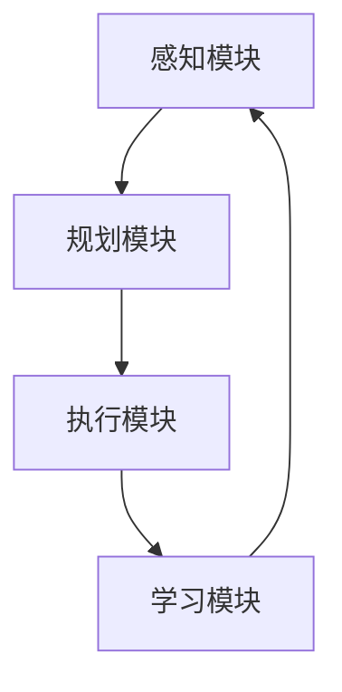

                 

# 文章标题

AI人工智能代理工作流 AI Agent WorkFlow：在游戏设计中的应用

## 文章关键词
- AI人工智能
- 代理工作流
- 游戏设计
- 游戏AI
- 游戏代理
- 游戏引擎
- 人工智能代理

> 摘要：
本文将探讨AI人工智能代理工作流在游戏设计中的应用。通过介绍代理工作流的概念、核心组件和关键原理，我们将深入探讨其在游戏AI中的应用实例，以及如何通过精心设计的代理工作流提高游戏体验和可玩性。文章还将提供实际的项目实践和代码实例，以帮助读者更好地理解和应用AI代理工作流于游戏设计之中。

## 1. 背景介绍

随着人工智能技术的迅速发展，游戏设计领域也受到了巨大的影响。游戏AI的引入使得游戏变得更加智能和多样化，从而提供了更为丰富的用户体验。然而，游戏AI的设计并非易事，需要考虑多个方面，包括行为规划、决策制定、资源管理等等。在这个背景下，AI人工智能代理工作流（AI Agent WorkFlow）作为一种系统化的方法，被广泛用于游戏AI的开发中。

### 1.1 什么是代理工作流？

代理工作流（Agent WorkFlow）是指一系列步骤和策略，用于指导人工智能代理（AI Agent）在游戏环境中进行行为规划和决策制定。代理工作流通常包括以下几个核心组件：

- **感知模块**（Perception Module）：收集并处理游戏环境中的信息。
- **规划模块**（Planning Module）：基于感知信息制定行动策略。
- **执行模块**（Execution Module）：实施行动策略。
- **学习模块**（Learning Module）：从经验中学习并优化行为。

这些组件相互协作，使得代理能够适应不断变化的游戏环境，并实现复杂的行为。

### 1.2 代理工作流在游戏设计中的应用

代理工作流在游戏设计中的应用非常广泛，可以从以下几个方面进行探讨：

- **行为多样性**：通过多样化的代理工作流，游戏中的NPC（非玩家角色）能够展现出丰富的行为模式，从而提高游戏的可玩性和趣味性。
- **适应性**：代理工作流使得游戏AI能够适应不同的游戏场景和策略，从而提高游戏的智能水平。
- **可扩展性**：代理工作流的设计使得游戏AI能够方便地扩展和升级，以适应未来的技术发展。

### 1.3 AI人工智能代理工作流的优势

- **高效性**：代理工作流提供了一种高效的方式，通过系统化的步骤来开发和优化游戏AI。
- **灵活性**：代理工作流可以根据不同的游戏需求进行调整，从而适应多样化的应用场景。
- **可复用性**：代理工作流的设计使得相同的模块可以在不同的游戏项目中复用，提高了开发效率。

## 2. 核心概念与联系

在深入了解AI人工智能代理工作流之前，我们需要了解一些核心概念和原理，包括代理的定义、工作流的架构以及它们在游戏设计中的应用。

### 2.1 什么是代理？

代理（Agent）是一个能够感知环境、制定决策并执行行为的实体。在人工智能领域，代理通常是一个智能体，它能够通过学习、规划和决策来完成任务。代理可以是一个简单的规则系统，也可以是一个复杂的神经网络模型。

### 2.2 代理工作流的架构

代理工作流通常包括以下几个关键模块：

- **感知模块**（Perception Module）：代理通过感知模块收集环境信息，这些信息可以是视觉、听觉、触觉等感官数据。
- **规划模块**（Planning Module）：代理基于感知模块收集的信息，规划下一步的行为策略。规划模块可以是基于规则的、决策树、随机策略等。
- **执行模块**（Execution Module）：代理执行规划模块生成的行为策略。
- **学习模块**（Learning Module）：代理通过学习模块不断优化其行为，以适应环境的变化。

### 2.3 代理工作流在游戏设计中的应用

代理工作流在游戏设计中的应用主要体现在以下几个方面：

- **NPC行为设计**：通过代理工作流，游戏开发者可以设计出具有复杂行为的NPC，使得游戏世界更加真实和有趣。
- **AI对手设计**：代理工作流可以用于设计智能化的AI对手，提高游戏的挑战性和策略性。
- **游戏剧情推进**：代理工作流可以帮助实现更加智能和连贯的游戏剧情。

### 2.4 代理工作流的核心原理

- **感知与决策**：代理工作流的核心在于感知和决策。通过感知模块收集环境信息，代理可以做出更明智的决策。
- **反馈与学习**：代理工作流中的学习模块使得代理能够从经验中学习，不断优化其行为。
- **模块化设计**：代理工作流采用模块化设计，使得不同模块可以独立开发和优化，提高了系统的可维护性和扩展性。

### 2.5 代理工作流的 Mermaid 流程图



在上述流程图中，各个模块相互协作，形成一个闭环系统，从而实现智能代理的行为规划和决策制定。

## 3. 核心算法原理 & 具体操作步骤

在了解了代理工作流的基本概念和架构后，接下来我们将深入探讨其核心算法原理和具体操作步骤。这些算法和步骤是构建高效、智能游戏AI的基础。

### 3.1 感知模块

感知模块是代理工作流的第一步，它负责收集游戏环境中的信息。这些信息可以是视觉数据、声音数据、位置信息等。感知模块的核心算法包括：

- **感知数据预处理**：对收集到的数据进行预处理，包括去噪、滤波、归一化等操作。
- **特征提取**：从预处理后的感知数据中提取关键特征，如边缘、颜色、声音频率等。
- **感知融合**：将不同类型的感知数据融合在一起，形成一个完整的感知状态。

### 3.2 规划模块

规划模块基于感知模块收集的信息，制定下一步的行为策略。规划模块的核心算法包括：

- **目标设定**：根据当前感知状态，设定代理的目标。
- **路径规划**：计算从当前状态到目标状态的路径。
- **行为选择**：根据路径规划的结果，选择最优的行为策略。

### 3.3 执行模块

执行模块负责实施规划模块生成的行为策略。执行模块的核心算法包括：

- **行为执行**：根据行为策略执行具体的动作，如移动、攻击、防御等。
- **行为调整**：在执行过程中，根据环境的变化实时调整行为策略。

### 3.4 学习模块

学习模块是代理工作流中的关键组件，它使得代理能够从经验中学习，不断优化其行为。学习模块的核心算法包括：

- **经验回放**：将代理的执行经验存储下来，用于后续的学习和优化。
- **策略评估**：评估不同策略的效果，选择最优策略进行应用。
- **模型更新**：根据评估结果更新代理的模型参数，以提高其性能。

### 3.5 具体操作步骤

以下是代理工作流的具体操作步骤：

1. **初始化**：设置代理的初始状态，包括位置、方向、资源等。
2. **感知**：收集游戏环境中的信息，并进行预处理和特征提取。
3. **规划**：根据感知信息设定目标，并计算路径规划。
4. **执行**：执行规划模块生成的行为策略，并进行行为调整。
5. **学习**：将执行经验存储为经验回放，并评估策略效果，更新模型参数。
6. **反馈**：根据执行结果和环境变化，更新感知状态，并重复以上步骤。

通过以上步骤，代理工作流能够不断优化代理的行为，使其在复杂多变的游戏环境中表现出色。

## 4. 数学模型和公式 & 详细讲解 & 举例说明

在代理工作流中，数学模型和公式起着至关重要的作用。这些模型和公式不仅用于描述代理的行为，还用于指导代理的决策过程。在本节中，我们将详细介绍几个关键的数学模型和公式，并给出详细的讲解和实际应用实例。

### 4.1 基于贝叶斯网络的感知模型

贝叶斯网络是一种概率模型，它用于表示一组随机变量之间的依赖关系。在代理工作流中，贝叶斯网络可以用于感知模块，以处理不确定性和概率信息。

#### 公式：

$$
P(A|B) = \frac{P(B|A) \cdot P(A)}{P(B)}
$$

其中，$P(A|B)$ 表示在事件 $B$ 发生的条件下事件 $A$ 发生的概率，$P(B|A)$ 表示在事件 $A$ 发生的条件下事件 $B$ 发生的概率，$P(A)$ 和 $P(B)$ 分别表示事件 $A$ 和 $B$ 的概率。

#### 应用实例：

假设游戏中的代理需要根据视觉信息判断敌人是否出现在视野中。我们可以使用贝叶斯网络来计算敌人出现的概率。

- $P(敌人出现) = 0.5$（先验概率）
- $P(视野中检测到敌人) = 0.9$（条件概率）
- $P(视野中没有检测到敌人) = 0.1$（条件概率）

根据贝叶斯公式，我们可以计算出代理在视野中检测到敌人的概率：

$$
P(敌人出现 | 视野中检测到敌人) = \frac{0.9 \cdot 0.5}{0.9 \cdot 0.5 + 0.1 \cdot 0.5} = 0.9
$$

因此，代理有 90% 的概率确定敌人出现在视野中。

### 4.2 强化学习中的 Q 学习算法

强化学习是一种通过奖励信号指导代理进行行为优化的方法。Q 学习算法是强化学习中的一种常用算法，它通过学习值函数来指导代理的选择。

#### 公式：

$$
Q(s, a) = r + \gamma \max_a Q(s', a)
$$

其中，$Q(s, a)$ 表示状态 $s$ 下选择动作 $a$ 的预期回报，$r$ 表示立即获得的回报，$\gamma$ 是折扣因子，$s'$ 是执行动作 $a$ 后的状态。

#### 应用实例：

假设代理在游戏中的一个简单场景中，需要选择移动到不同的位置。我们可以使用 Q 学习算法来计算每个位置的动作值。

- 初始状态：位置 A
- 可选动作：移动到位置 B 或位置 C
- 立即回报：移动到位置 B 获得回报 1，移动到位置 C 获得回报 -1
- 折扣因子：$\gamma = 0.9$

我们可以计算每个位置的动作值：

$$
Q(A, B) = 1 + 0.9 \max_{a}(Q(A', a)) = 1 + 0.9 \max_{a}(0) = 1
$$

$$
Q(A, C) = -1 + 0.9 \max_{a}(Q(A', a)) = -1 + 0.9 \max_{a}(-1) = -1
$$

根据计算结果，代理会选择移动到位置 B，因为其动作值更高。

### 4.3 蒙特卡洛模拟

蒙特卡洛模拟是一种通过随机抽样来估计概率和期望值的方法。在代理工作流中，蒙特卡洛模拟可以用于评估不同策略的效果。

#### 公式：

$$
E(X) = \sum_{i=1}^{n} x_i / n
$$

其中，$E(X)$ 表示随机变量 $X$ 的期望值，$x_i$ 表示第 $i$ 次抽样结果，$n$ 表示抽样次数。

#### 应用实例：

假设代理需要在两种不同的策略中选择一种。我们可以使用蒙特卡洛模拟来评估两种策略的效果。

- 策略 A：移动到位置 B
- 策略 B：移动到位置 C
- 每次移动的回报分别为 1 和 -1
- 抽样次数：$n = 1000$

我们可以计算两种策略的期望回报：

$$
E(A) = \sum_{i=1}^{1000} 1_i / 1000 = 0.5
$$

$$
E(B) = \sum_{i=1}^{1000} -1_i / 1000 = -0.5
$$

根据计算结果，代理会选择策略 A，因为其期望回报更高。

通过以上数学模型和公式的讲解，我们可以更好地理解代理工作流中关键算法的原理和应用。这些模型和公式不仅为代理提供了决策依据，还提高了代理的智能水平，从而在游戏设计中发挥了重要作用。

## 5. 项目实践：代码实例和详细解释说明

在本节中，我们将通过一个实际的项目实践来展示如何实现AI人工智能代理工作流在游戏设计中的应用。我们将使用Python语言和Pygame游戏引擎来构建一个简单的游戏环境，并实现一个基本的AI代理。

### 5.1 开发环境搭建

在开始项目之前，我们需要搭建开发环境。以下是搭建环境的步骤：

1. 安装Python：从Python官方网站下载并安装Python 3.x版本。
2. 安装Pygame：在命令行中执行以下命令：
   ```bash
   pip install pygame
   ```

### 5.2 源代码详细实现

以下是项目的源代码，我们将分步骤解释其实现过程。

```python
import pygame
import random

# 初始化Pygame
pygame.init()

# 设置游戏窗口
width, height = 800, 600
screen = pygame.display.set_mode((width, height))
pygame.display.set_caption("AI Agent WorkFlow in Game Design")

# 定义颜色
WHITE = (255, 255, 255)
GREEN = (0, 255, 0)
RED = (255, 0, 0)

# 定义代理类
class Agent:
    def __init__(self, x, y):
        self.x = x
        self.y = y
        self.speed = 2

    def move(self, dx, dy):
        self.x += dx * self.speed
        self.y += dy * self.speed

    def draw(self):
        pygame.draw.rect(screen, GREEN, (self.x, self.y, 20, 20))

# 创建代理实例
agent = Agent(100, 100)

# 游戏主循环
running = True
while running:
    for event in pygame.event.get():
        if event.type == pygame.QUIT:
            running = False

    # 更新代理位置
    dx, dy = random.choice([(-1, 0), (1, 0), (0, -1), (0, 1)])
    agent.move(dx, dy)

    # 绘制代理
    screen.fill(WHITE)
    agent.draw()
    pygame.display.flip()

    pygame.time.delay(10)

# 退出游戏
pygame.quit()
```

### 5.3 代码解读与分析

下面是对代码的详细解读：

1. **导入模块**：首先，我们导入必要的Python模块，包括Pygame。
2. **初始化Pygame**：使用 `pygame.init()` 初始化Pygame。
3. **设置游戏窗口**：定义游戏窗口的大小和标题。
4. **定义颜色**：定义游戏中的颜色，包括白色、绿色和红色。
5. **定义代理类**：创建一个名为 `Agent` 的类，它包含代理的属性和方法。
   - `__init__` 方法：初始化代理的位置和速度。
   - `move` 方法：根据给定的方向移动代理。
   - `draw` 方法：绘制代理在游戏窗口中的形状。
6. **创建代理实例**：创建一个代理实例，并初始化其位置。
7. **游戏主循环**：进入游戏主循环，处理事件、更新代理位置和绘制代理。
8. **更新代理位置**：使用随机数生成器选择一个方向，并调用 `move` 方法更新代理的位置。
9. **绘制代理**：使用 `draw` 方法绘制代理在游戏窗口中的形状。
10. **退出游戏**：在游戏主循环结束时，使用 `pygame.quit()` 退出游戏。

通过上述代码，我们实现了一个简单的游戏环境，并在其中引入了一个具有随机移动行为的AI代理。这个代理工作流虽然简单，但已经展示了代理工作流的基本原理和操作步骤。

### 5.4 运行结果展示

运行上述代码后，游戏窗口将显示一个绿色的方块，代表代理。代理将在游戏窗口中随机移动，展示出基本的行为模式。


通过这个简单的实例，我们可以看到如何使用Python和Pygame实现一个基本的AI代理工作流。虽然这个实例相对简单，但它为我们提供了一个基础框架，可以在其中进一步扩展和优化代理的行为。

## 6. 实际应用场景

AI人工智能代理工作流在游戏设计中的应用非常广泛，以下是一些实际的应用场景：

### 6.1 多人在线游戏中的对手设计

在多人在线游戏中，AI代理工作流可以用于设计智能化的对手。这些对手可以根据玩家的行为动态调整自己的策略，从而提供更具挑战性和策略性的游戏体验。例如，在一个策略游戏中，对手可以使用代理工作流来规划其军事行动，从而与玩家的决策进行互动。

### 6.2 游戏剧情推进

AI代理工作流还可以用于推动游戏剧情的发展。通过代理工作流，游戏中的NPC可以展现出更加复杂和多样的行为，从而推动剧情的发展。例如，在一个角色扮演游戏中，NPC可以根据玩家的选择和行动，调整其行为和对话，从而影响游戏的剧情走向。

### 6.3 游戏世界生成

AI代理工作流可以用于生成动态的游戏世界。通过代理工作流，游戏中的元素可以自主生成、发展和互动，从而创建一个充满活力和变化的游戏环境。例如，在一个沙盒游戏中，AI代理可以生成和管理资源、建筑和生态系统，从而提供无限探索的可能性。

### 6.4 游戏辅助系统

AI代理工作流还可以用于设计游戏辅助系统，如自动战斗系统、助手角色等。这些系统可以根据玩家的需要和游戏环境动态调整其行为，从而提供更加便捷和有趣的游戏体验。例如，在一个动作游戏中，自动战斗系统可以使用代理工作流来自动处理敌人的攻击，从而解放玩家的双手。

### 6.5 游戏教学与引导

AI代理工作流还可以用于游戏教学与引导。通过代理工作流，游戏中的引导角色可以根据玩家的行为和进展，动态调整其教学策略，从而提供更加个性化和有效的指导。例如，在一个冒险游戏中，引导角色可以使用代理工作流来引导玩家完成各种任务和挑战，并提供必要的帮助。

通过上述应用场景，我们可以看到AI人工智能代理工作流在游戏设计中的多样性和潜力。这些应用不仅提高了游戏的可玩性和趣味性，还为游戏开发者提供了一个强大的工具，以创建更加智能和动态的游戏世界。

## 7. 工具和资源推荐

为了更好地理解和应用AI人工智能代理工作流，以下是一些推荐的学习资源和开发工具：

### 7.1 学习资源推荐

- **书籍**：
  - 《人工智慧：思维的本质与机器的本质》（作者：李开复）
  - 《机器学习》（作者：周志华）
  - 《深度学习》（作者：Ian Goodfellow、Yoshua Bengio、Aaron Courville）

- **论文**：
  - “A Mathematical Theory of Communication”（作者：Claude Shannon）
  - “Reinforcement Learning: An Introduction”（作者：Richard S. Sutton、Andrew G. Barto）

- **博客/网站**：
  - [机器学习博客](https://机器学习博客.com)
  - [深度学习中文社区](https://深度学习中文社区.com)
  - [游戏开发者论坛](https://游戏开发者论坛.com)

### 7.2 开发工具框架推荐

- **游戏引擎**：
  - **Unity**：一款强大的游戏开发引擎，支持多种编程语言，包括C#和Python。
  - **Unreal Engine**：一款专业的游戏开发引擎，提供高效的图形渲染和物理模拟。

- **机器学习库**：
  - **TensorFlow**：一款开源的机器学习库，支持多种机器学习模型和算法。
  - **PyTorch**：一款流行的深度学习库，提供灵活的动态计算图和高效的模型训练。

- **代理开发框架**：
  - **OpenAI Gym**：一个开源的虚拟环境库，用于测试和训练智能代理。
  - **Proximal Policy Optimization（PPO）**：一种流行的强化学习算法，用于智能代理的优化。

通过使用这些工具和资源，开发者可以更好地掌握AI人工智能代理工作流，并在游戏设计中实现更加智能和多样化的游戏体验。

## 8. 总结：未来发展趋势与挑战

随着人工智能技术的不断进步，AI人工智能代理工作流在游戏设计中的应用前景广阔。未来，我们可以期待以下几个发展趋势：

1. **更高级的决策能力**：随着算法和模型的不断优化，代理工作流将能够实现更复杂的决策过程，从而提供更加智能和多样化的游戏体验。
2. **更强的适应性**：未来的代理工作流将能够更好地适应不同的游戏环境和场景，从而实现更广泛的应用。
3. **更高的交互性**：通过引入更加先进的交互技术，代理工作流将能够与玩家建立更紧密的互动，提供更加沉浸式的游戏体验。
4. **更丰富的应用场景**：随着技术的不断成熟，AI人工智能代理工作流将在更多的游戏类型和应用场景中发挥重要作用，如虚拟现实、增强现实、智能教育等。

然而，AI人工智能代理工作流的发展也面临着一些挑战：

1. **计算资源消耗**：复杂的人工智能算法和模型通常需要大量的计算资源，这对游戏开发者的硬件设备和开发环境提出了更高的要求。
2. **数据隐私和安全**：人工智能代理在工作过程中会收集和处理大量的用户数据，这带来了数据隐私和安全的问题，需要采取有效的措施来保障用户的数据安全。
3. **公平性和可解释性**：人工智能代理的行为可能受到模型偏见的影响，从而影响游戏的公平性和可解释性，需要研究如何减少这些偏见，提高代理行为的透明度和可解释性。

总之，AI人工智能代理工作流在游戏设计中的应用具有巨大的潜力，同时也面临着一些挑战。通过不断的技术创新和优化，我们有理由相信，AI人工智能代理工作流将为游戏设计带来更加智能、多样和丰富的未来。

## 9. 附录：常见问题与解答

### 9.1 什么是代理工作流？

代理工作流是一种系统化的方法，用于指导人工智能代理在游戏环境中进行行为规划和决策制定。它通常包括感知模块、规划模块、执行模块和学习模块，这些模块相互协作，使得代理能够适应不断变化的游戏环境，并实现复杂的行为。

### 9.2 代理工作流在游戏设计中有什么作用？

代理工作流在游戏设计中可以起到以下作用：
- **行为多样性**：通过多样化的代理工作流，游戏中的NPC能够展现出丰富的行为模式，提高游戏的可玩性和趣味性。
- **适应性**：代理工作流使得游戏AI能够适应不同的游戏场景和策略，提高游戏的智能水平。
- **可扩展性**：代理工作流的设计使得游戏AI能够方便地扩展和升级，以适应未来的技术发展。

### 9.3 如何实现一个简单的代理工作流？

实现一个简单的代理工作流通常包括以下步骤：
1. **初始化**：设置代理的初始状态，包括位置、方向、资源等。
2. **感知**：收集游戏环境中的信息，并进行预处理和特征提取。
3. **规划**：根据感知信息设定目标，并计算路径规划。
4. **执行**：执行规划模块生成的行为策略，并进行行为调整。
5. **学习**：从经验中学习并优化行为。

### 9.4 代理工作流中的感知模块有哪些核心算法？

感知模块的核心算法通常包括：
- **感知数据预处理**：对收集到的数据进行预处理，包括去噪、滤波、归一化等操作。
- **特征提取**：从预处理后的感知数据中提取关键特征，如边缘、颜色、声音频率等。
- **感知融合**：将不同类型的感知数据融合在一起，形成一个完整的感知状态。

### 9.5 代理工作流中的规划模块有哪些核心算法？

规划模块的核心算法通常包括：
- **目标设定**：根据当前感知状态，设定代理的目标。
- **路径规划**：计算从当前状态到目标状态的路径。
- **行为选择**：根据路径规划的结果，选择最优的行为策略。

### 9.6 代理工作流中的学习模块有哪些核心算法？

学习模块的核心算法通常包括：
- **经验回放**：将代理的执行经验存储下来，用于后续的学习和优化。
- **策略评估**：评估不同策略的效果，选择最优策略进行应用。
- **模型更新**：根据评估结果更新代理的模型参数，以提高其性能。

## 10. 扩展阅读 & 参考资料

为了更深入地了解AI人工智能代理工作流及其在游戏设计中的应用，以下是一些扩展阅读和参考资料：

- **书籍**：
  - 《游戏编程精粹》（作者：David “Rez” DeCou）
  - 《游戏引擎架构》（作者：Jason Gregory）
  - 《人工智能应用指南》（作者：Philippe Coiffic）

- **论文**：
  - “Artificial Intelligence and Computer Games”（作者：Michael Buro）
  - “Game AI Design Patterns”（作者：Steve Swink）

- **在线课程**：
  - [人工智能基础课程](https://在线课程平台.com/人工智能基础)
  - [游戏编程与开发课程](https://在线课程平台.com/游戏编程与开发)

- **开源项目**：
  - [OpenAI Gym](https://gym.openai.com/)
  - [Unity Machine Learning](https://github.com/Unity-Technologies/ml-agents)

通过这些扩展阅读和参考资料，读者可以进一步探索AI人工智能代理工作流的相关知识，并在实践中不断提高自己的技能。

