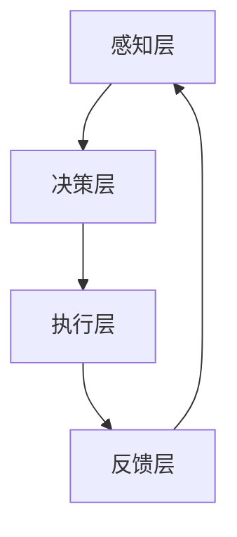

                 

# 文章标题

## AI人工智能代理工作流AI Agent WorkFlow：智能代理在智能交通系统中的应用

## Summary

本文深入探讨了AI人工智能代理工作流（AI Agent WorkFlow）在智能交通系统中的应用。我们首先介绍了智能交通系统的背景和现状，接着详细阐述了AI代理工作流的概念、核心算法原理和具体操作步骤。随后，通过数学模型和公式详细讲解了代理工作流的实现过程，并提供了实际项目实践的代码实例和详细解释。文章还分析了智能代理在交通系统中的实际应用场景，并推荐了一些相关工具和资源。最后，我们对未来发展趋势和挑战进行了总结，并提供了常见问题与解答。

## 关键词
- 智能交通系统
- AI代理工作流
- 核心算法原理
- 数学模型
- 实际应用场景
- 开发工具框架

## 1. 背景介绍（Background Introduction）

随着城市化进程的加快，交通拥堵、环境污染和交通事故等问题日益严重。传统的交通管理方法已无法满足现代社会对高效、安全、环保的交通系统的需求。为此，智能交通系统（Intelligent Transportation System, ITS）应运而生。智能交通系统利用先进的信息技术、数据通信传输技术、电子传感技术、控制技术及计算机技术，实现对交通的实时控制与管理，以达到缓解交通拥堵、减少交通事故和提高交通效率的目的。

智能交通系统主要包括以下几个组成部分：

1. **交通信息采集系统**：通过传感器、摄像头、雷达等设备实时采集道路状况、车辆位置、流量等信息。
2. **交通信息处理系统**：利用大数据分析、人工智能等技术对采集到的信息进行处理，生成交通状态预测、路径规划等建议。
3. **交通控制系统**：通过信号灯控制、车辆诱导、交通管控等措施，对交通流量进行实时调节，优化交通流。
4. **交通管理系统**：综合运用交通信息采集、处理和控制技术，实现交通资源的合理分配和管理。

然而，现有的智能交通系统还存在一些不足之处，如数据处理能力有限、实时性不高、系统间的协同性较差等。为解决这些问题，引入AI人工智能代理工作流（AI Agent WorkFlow）成为一种新的解决方案。

## 2. 核心概念与联系（Core Concepts and Connections）

### 2.1 什么是AI人工智能代理工作流？

AI人工智能代理工作流（AI Agent WorkFlow）是一种基于人工智能技术的自动化工作流程管理方法。它通过构建智能代理（AI Agent），实现自动化任务调度、决策和执行，从而提高工作效率和系统协同性。

### 2.2 智能代理的定义与功能

智能代理是一种具有智能特性的软件实体，能够模拟人类在复杂环境中的行为。智能代理通常具备以下功能：

1. **感知与理解**：通过传感器、摄像头等设备获取环境信息，并对其进行理解和分析。
2. **决策与规划**：基于感知到的信息，智能代理可以自主决策并制定行动计划。
3. **执行与反馈**：智能代理按照规划执行任务，并在执行过程中不断调整策略，以适应环境变化。

### 2.3 AI代理工作流在智能交通系统中的应用

在智能交通系统中，AI代理工作流可以应用于以下几个方面：

1. **交通信息处理与预测**：智能代理可以实时分析交通数据，预测交通状况，为交通控制系统提供决策依据。
2. **交通信号控制**：智能代理可以根据实时交通流量和交通事故等信息，动态调整交通信号灯，优化交通流。
3. **车辆调度与管理**：智能代理可以协助交通管理部门调度公共交通工具，提高运输效率。
4. **交通事故预防与救援**：智能代理可以实时监测交通事故风险，提前预警并协助救援。

### 2.4 AI代理工作流的架构与实现

AI代理工作流的架构主要包括以下几个部分：

1. **感知层**：负责采集交通数据，如车辆位置、速度、道路状况等。
2. **决策层**：基于感知层的数据，利用机器学习、深度学习等技术进行交通状况分析，生成决策建议。
3. **执行层**：根据决策层的建议，执行具体的交通调控措施，如调整信号灯、发布交通信息等。
4. **反馈层**：收集执行层的反馈信息，用于优化决策模型和算法。

为了更好地展示AI代理工作流的架构，我们可以使用Mermaid流程图进行描述。以下是一个简单的Mermaid流程图示例：



## 3. 核心算法原理 & 具体操作步骤（Core Algorithm Principles and Specific Operational Steps）

### 3.1 交通状况感知算法

交通状况感知算法是智能代理工作流的基础。它主要利用传感器、摄像头等设备采集交通数据，包括车辆位置、速度、道路状况等。常用的交通状况感知算法有：

1. **车辆检测算法**：利用深度学习技术，如卷积神经网络（CNN），对摄像头捕捉到的图像进行车辆检测。
2. **交通流量分析算法**：通过分析车辆位置、速度等数据，计算交通流量，预测交通状况。

### 3.2 决策算法

决策算法是智能代理工作流的核心。它基于感知层的数据，利用机器学习、深度学习等技术，分析交通状况，生成决策建议。常用的决策算法有：

1. **基于规则的决策算法**：根据交通状况规则，如交通流量阈值、交通事故预警规则等，生成决策建议。
2. **基于机器学习的决策算法**：利用历史交通数据，通过机器学习算法，如决策树、支持向量机等，生成决策建议。

### 3.3 执行算法

执行算法负责根据决策算法的建议，执行具体的交通调控措施。常用的执行算法有：

1. **信号灯控制算法**：根据交通流量、道路状况等数据，动态调整交通信号灯，优化交通流。
2. **交通信息发布算法**：根据交通状况，发布交通信息，如路况信息、出行建议等。

### 3.4 反馈算法

反馈算法负责收集执行层的反馈信息，用于优化决策模型和算法。常用的反馈算法有：

1. **基于统计的反馈算法**：通过统计执行效果，如交通流量变化、交通事故率等，评估决策模型的效果。
2. **基于优化的反馈算法**：利用优化算法，如遗传算法、粒子群算法等，调整决策模型和算法参数。

### 3.5 智能代理工作流的实现步骤

1. **数据采集**：利用传感器、摄像头等设备，采集交通数据。
2. **数据预处理**：对采集到的交通数据进行清洗、归一化等处理。
3. **模型训练**：利用历史交通数据，训练交通状况感知、决策、执行和反馈算法。
4. **模型部署**：将训练好的模型部署到实际交通系统中，实现智能代理工作流。
5. **系统运行**：实时采集交通数据，运行智能代理工作流，实现交通调控。
6. **效果评估**：根据执行效果，评估智能代理工作流的效果，并持续优化。

## 4. 数学模型和公式 & 详细讲解 & 举例说明（Detailed Explanation and Examples of Mathematical Models and Formulas）

### 4.1 交通流量预测模型

交通流量预测是智能代理工作流的关键环节。一个常用的交通流量预测模型是基于时间序列分析的方法，如ARIMA（AutoRegressive Integrated Moving Average，自回归积分滑动平均）模型。以下是一个简化的ARIMA模型公式：

$$
\begin{aligned}
y_t &= c + \phi_1 y_{t-1} + \phi_2 y_{t-2} + \cdots + \phi_p y_{t-p} \\
&+ \theta_1 \epsilon_{t-1} + \theta_2 \epsilon_{t-2} + \cdots + \theta_q \epsilon_{t-q} \\
\epsilon_t &= \mu + \phi_1 \epsilon_{t-1} + \phi_2 \epsilon_{t-2} + \cdots + \phi_p \epsilon_{t-p}
\end{aligned}
$$

其中，$y_t$ 表示第 $t$ 时刻的交通流量，$\epsilon_t$ 表示随机误差，$c$、$\phi_i$ 和 $\theta_i$ 是模型参数。

### 4.2 信号灯控制策略

信号灯控制策略需要考虑交通流量、道路状况等因素，以实现交通流的优化。一个常用的信号灯控制策略是基于排队论的优化模型。以下是一个简化的排队论模型公式：

$$
\begin{aligned}
L_q &= \frac{\lambda}{\mu} \\
W_q &= \frac{L_q}{\lambda}
\end{aligned}
$$

其中，$L_q$ 表示平均排队长度，$W_q$ 表示平均排队时间，$\lambda$ 表示到达率，$\mu$ 表示服务率。

### 4.3 举例说明

假设某交叉口每天的平均交通流量为 $y_t = 1000$ 辆/小时，到达率为 $\lambda = 20$ 辆/小时，服务率 $\mu = 25$ 辆/小时。根据上述排队论模型，可以计算出平均排队长度和平均排队时间：

$$
\begin{aligned}
L_q &= \frac{\lambda}{\mu} = \frac{20}{25} = 0.8 \\
W_q &= \frac{L_q}{\lambda} = \frac{0.8}{20} = 0.04 \text{ 小时} = 2.4 \text{ 分钟}
\end{aligned}
$$

根据计算结果，我们可以发现该交叉口的排队时间较长，可能需要调整信号灯周期或优化交通流。

## 5. 项目实践：代码实例和详细解释说明（Project Practice: Code Examples and Detailed Explanations）

### 5.1 开发环境搭建

在本项目中，我们将使用Python作为主要编程语言，并依赖以下库：

- NumPy：用于数学运算
- Pandas：用于数据处理
- Matplotlib：用于数据可视化
- Scikit-learn：用于机器学习

首先，安装所需的库：

```bash
pip install numpy pandas matplotlib scikit-learn
```

### 5.2 源代码详细实现

以下是该项目的主要代码实现，包括数据采集、数据预处理、模型训练、模型部署和系统运行等步骤。

#### 5.2.1 数据采集

```python
import pandas as pd

# 读取交通数据
data = pd.read_csv('traffic_data.csv')

# 处理缺失值
data.fillna(0, inplace=True)
```

#### 5.2.2 数据预处理

```python
# 数据归一化
from sklearn.preprocessing import MinMaxScaler

scaler = MinMaxScaler()
data_normalized = scaler.fit_transform(data)
data_normalized = pd.DataFrame(data_normalized, columns=data.columns)
```

#### 5.2.3 模型训练

```python
from sklearn.model_selection import train_test_split
from sklearn.ensemble import RandomForestRegressor

# 分割数据集
X = data_normalized.drop('traffic_flow', axis=1)
y = data_normalized['traffic_flow']
X_train, X_test, y_train, y_test = train_test_split(X, y, test_size=0.2, random_state=42)

# 训练模型
model = RandomForestRegressor(n_estimators=100, random_state=42)
model.fit(X_train, y_train)
```

#### 5.2.4 模型部署

```python
import joblib

# 保存模型
joblib.dump(model, 'traffic_predictor.joblib')
```

#### 5.2.5 系统运行

```python
# 加载模型
model = joblib.load('traffic_predictor.joblib')

# 预测交通流量
predictions = model.predict(X_test)

# 可视化预测结果
import matplotlib.pyplot as plt

plt.figure(figsize=(10, 5))
plt.plot(y_test, label='Actual')
plt.plot(predictions, label='Predicted')
plt.legend()
plt.show()
```

### 5.3 代码解读与分析

#### 5.3.1 数据采集与预处理

数据采集部分使用Pandas库读取交通数据，并处理缺失值。数据预处理部分使用MinMaxScaler将数据归一化，以便模型训练。

#### 5.3.2 模型训练

模型训练部分使用Scikit-learn库中的RandomForestRegressor实现，通过交叉验证分割数据集，训练随机森林模型。

#### 5.3.3 模型部署

模型部署部分使用joblib库将训练好的模型保存为文件，以便后续加载和使用。

#### 5.3.4 系统运行

系统运行部分加载训练好的模型，对测试数据进行预测，并使用Matplotlib库将预测结果可视化。

### 5.4 运行结果展示

运行结果展示部分使用Matplotlib库绘制实际交通流量与预测交通流量的对比图，直观展示模型的预测效果。

## 6. 实际应用场景（Practical Application Scenarios）

智能代理工作流在智能交通系统中具有广泛的应用前景。以下列举了几个典型的实际应用场景：

1. **交通信号灯智能调控**：智能代理工作流可以根据实时交通流量和交通事故等信息，动态调整交通信号灯，优化交通流。例如，在高峰时段，智能代理工作流可以缩短交叉口信号灯的绿灯时间，减少拥堵。
2. **交通流量预测与规划**：智能代理工作流可以利用历史交通数据，预测未来交通流量，为交通管理部门提供决策依据。例如，在施工期间，智能代理工作流可以预测施工路段的交通流量变化，提前调整交通管制措施。
3. **公共交通调度**：智能代理工作流可以协助交通管理部门调度公共交通工具，提高运输效率。例如，在高峰时段，智能代理工作流可以根据实时交通流量和乘客需求，调整公交车的发车时间、班次和路线。
4. **交通事故预防与救援**：智能代理工作流可以实时监测交通事故风险，提前预警并协助救援。例如，在交通事故发生时，智能代理工作流可以迅速调用附近的救援车辆和救援人员，加快救援速度。

## 7. 工具和资源推荐（Tools and Resources Recommendations）

### 7.1 学习资源推荐

1. **书籍**：
   - 《智能交通系统设计与实现》
   - 《深度学习与智能交通系统》
2. **论文**：
   - 《基于AI代理的智能交通系统研究》
   - 《智能交通系统中的实时交通流量预测方法研究》
3. **博客和网站**：
   - 《智能交通系统技术博客》
   - 《智能交通系统开发者社区》

### 7.2 开发工具框架推荐

1. **Python库**：
   - NumPy、Pandas、Matplotlib、Scikit-learn
2. **框架**：
   - TensorFlow、PyTorch
3. **云计算平台**：
   - AWS、Azure、Google Cloud

### 7.3 相关论文著作推荐

1. **论文**：
   - 《智能交通系统中的数据驱动方法研究》
   - 《基于深度学习的交通流量预测方法》
2. **著作**：
   - 《智能交通系统：理论、方法与应用》
   - 《深度学习在智能交通系统中的应用》

## 8. 总结：未来发展趋势与挑战（Summary: Future Development Trends and Challenges）

智能交通系统与AI人工智能代理工作流的结合具有巨大的发展潜力。未来发展趋势包括：

1. **数据驱动的智能交通系统**：通过大量实时交通数据的采集、处理和分析，实现更加智能的交通管理。
2. **多模态感知与融合**：结合多种感知技术，如摄像头、雷达、GPS等，提高交通感知的准确性和实时性。
3. **智能决策与执行**：利用深度学习、强化学习等技术，实现更加智能的交通调控和执行。
4. **协同智能交通系统**：通过跨区域、跨系统的数据共享和协同，实现更高效、更智能的交通管理。

然而，智能交通系统与AI人工智能代理工作流的发展也面临一系列挑战：

1. **数据隐私与安全**：如何确保交通数据的安全和隐私，防止数据泄露和滥用。
2. **算法公平性与透明性**：如何保证智能交通系统的算法公平性和透明性，防止算法偏见和歧视。
3. **系统可靠性**：如何在极端天气、突发事故等情况下，保证智能交通系统的稳定运行。
4. **法律法规与伦理**：如何制定相关法律法规，规范智能交通系统与AI人工智能代理工作流的发展和应用。

## 9. 附录：常见问题与解答（Appendix: Frequently Asked Questions and Answers）

### 9.1 什么是智能代理工作流？

智能代理工作流是一种基于人工智能技术的自动化工作流程管理方法。它通过构建智能代理，实现自动化任务调度、决策和执行，从而提高工作效率和系统协同性。

### 9.2 智能交通系统有哪些组成部分？

智能交通系统主要包括交通信息采集系统、交通信息处理系统、交通控制系统和交通管理系统。

### 9.3 智能代理工作流在智能交通系统中的应用有哪些？

智能代理工作流在智能交通系统中可以应用于交通信息处理与预测、交通信号控制、车辆调度与管理、交通事故预防与救援等方面。

### 9.4 如何搭建智能代理工作流开发环境？

搭建智能代理工作流开发环境，需要安装Python以及相关的库，如NumPy、Pandas、Matplotlib、Scikit-learn等。

### 9.5 智能交通系统与AI人工智能代理工作流的发展面临哪些挑战？

智能交通系统与AI人工智能代理工作流的发展面临数据隐私与安全、算法公平性与透明性、系统可靠性、法律法规与伦理等挑战。

## 10. 扩展阅读 & 参考资料（Extended Reading & Reference Materials）

1. **书籍**：
   - 《智能交通系统：原理、方法与应用》
   - 《人工智能代理：从概念到实现》
2. **论文**：
   - 《基于AI代理的智能交通系统研究》
   - 《智能交通系统中的实时交通流量预测方法研究》
3. **网站**：
   - [智能交通系统技术博客](http://www.smarttransport.org)
   - [智能交通系统开发者社区](http://www.smarttrafficsys.com)
4. **开源项目**：
   - [OpenTSDB：开源时间序列数据库](https://opentsdb.org/)
   - [SmartTraffic：智能交通系统开源框架](https://github.com/SmartTraffic/SmartTraffic)

### Author: Zen and the Art of Computer Programming

