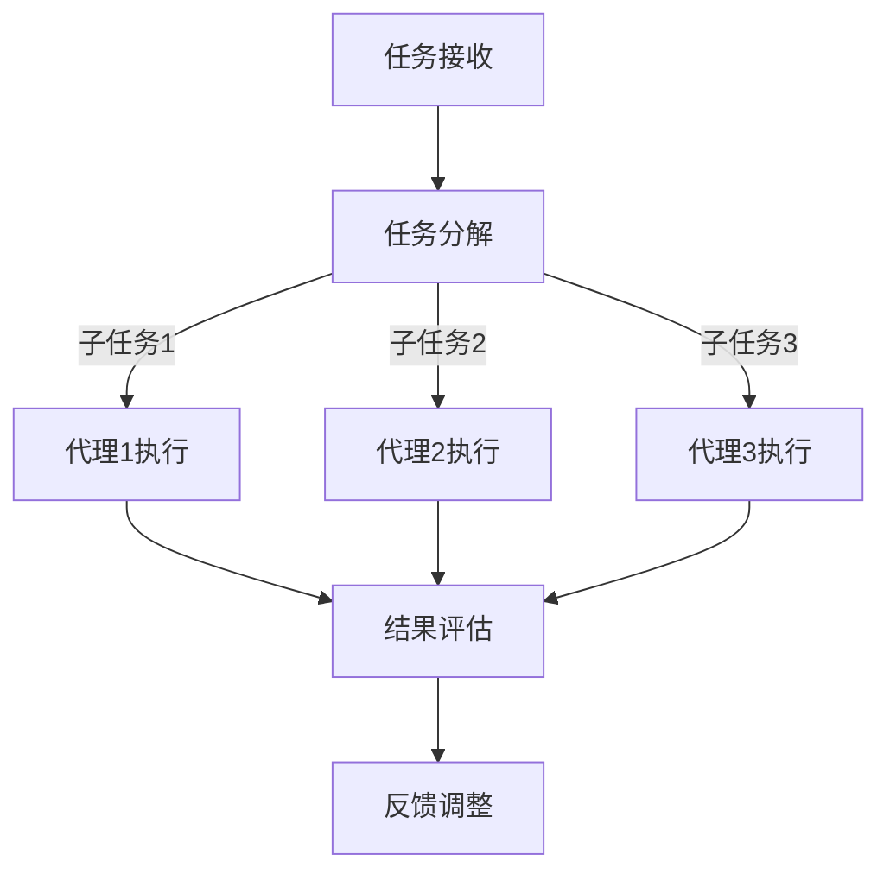

                 

### 文章标题

**AI人工智能代理工作流AI Agent WorkFlow：设计智能任务处理流程**

在当今快速发展的技术时代，人工智能（AI）已经渗透到各个行业，从医疗诊断到自动驾驶，从智能家居到金融服务。而AI代理（AI Agent）作为AI技术的一种应用形式，因其能够自动化执行复杂任务、提高效率和减少人力成本，正逐步成为企业智能化转型的核心驱动力。本文将深入探讨AI代理工作流（AI Agent WorkFlow）的设计原理、实施步骤和应用场景，旨在为读者提供一个系统化、结构化的智能任务处理流程指南。

关键词：人工智能代理、工作流设计、任务自动化、智能任务处理、流程优化

摘要：本文将首先介绍AI代理及其工作流的基本概念，接着深入探讨设计智能任务处理流程的核心原则，然后通过实际案例展示如何构建和优化AI代理工作流，最后讨论AI代理在不同领域的实际应用以及面临的挑战与未来发展趋势。

<|user|>### 1. 背景介绍（Background Introduction）

#### 1.1 AI代理的定义与特点

AI代理，也称为智能代理，是一种能够自主执行任务、与环境互动并做出决策的计算机程序。它基于机器学习、自然语言处理、计算机视觉等AI技术，具备以下特点：

1. **自主性**：AI代理能够在没有人为干预的情况下独立完成任务。
2. **适应性**：AI代理可以适应不断变化的环境和需求，学习并优化自身的行为。
3. **协作性**：多个AI代理可以协同工作，共同完成复杂的任务。

#### 1.2 AI代理的应用领域

AI代理在各个领域的应用日益广泛，以下是其中几个典型领域：

1. **智能制造**：通过AI代理优化生产流程、预测设备故障、提高产品质量。
2. **金融服务**：AI代理在客户服务、风险管理、投资建议等方面提供智能化解决方案。
3. **医疗健康**：AI代理用于疾病诊断、药物研发、患者管理等方面。
4. **交通运输**：自动驾驶汽车、智能交通管理系统等均依赖于AI代理技术。

#### 1.3 AI代理工作流的概念

AI代理工作流是指一系列自动化任务的处理流程，通过AI代理实现从任务接收、任务分解、执行到结果评估的全过程。一个高效的工作流能够显著提升任务执行的效率和准确性。

1. **任务接收**：AI代理接收任务请求，理解任务需求和目标。
2. **任务分解**：将复杂任务分解为若干个子任务，为每个子任务分配适当的AI代理。
3. **任务执行**：AI代理执行具体任务，可能涉及数据收集、决策制定、执行操作等。
4. **结果评估**：对任务执行结果进行评估，根据反馈调整和优化工作流。

<|assistant|>### 2. 核心概念与联系（Core Concepts and Connections）

#### 2.1 AI代理工作流的基本组成部分

为了设计一个高效的AI代理工作流，我们需要了解其基本组成部分，包括：

1. **AI代理**：执行具体任务的智能实体，具有自主性、适应性和协作性。
2. **任务管理模块**：负责任务的接收、分配、监控和反馈。
3. **数据管理模块**：管理AI代理执行任务所需的数据，包括数据的收集、存储、处理和分析。
4. **决策支持模块**：提供AI代理执行任务时的决策支持，包括规则库、模型预测和优化算法。

#### 2.2 AI代理工作流的设计原则

在设计和实现AI代理工作流时，需要遵循以下原则：

1. **模块化**：将工作流划分为独立的模块，便于维护和扩展。
2. **灵活性**：工作流应具备一定的灵活性，以适应不同的任务需求和变化的环境。
3. **可扩展性**：工作流设计应考虑未来的扩展需求，支持新的代理、任务和数据源。
4. **可靠性**：确保工作流在执行任务过程中具有较高的可靠性和容错能力。

#### 2.3 AI代理工作流与人工智能的关系

AI代理工作流是人工智能技术在实际应用中的重要体现。人工智能为AI代理提供了智能决策、自主学习和协作互动的能力，而AI代理工作流则将人工智能技术应用于实际的任务执行中，实现自动化和智能化的任务处理。

1. **决策与执行**：AI代理基于人工智能技术进行决策，并执行具体任务。
2. **学习与优化**：AI代理通过执行任务和接收反馈，不断学习和优化自身的行为。
3. **协作与交互**：多个AI代理可以协同工作，实现更复杂的任务处理和系统智能化。

#### 2.4 Mermaid 流程图（Mermaid Flowchart）

为了更好地理解和设计AI代理工作流，我们可以使用Mermaid流程图来展示其核心节点和流程。以下是一个简化的AI代理工作流Mermaid流程图示例：



在这个流程图中，任务接收节点A接收外部任务请求，任务分解节点B将任务分解为若干个子任务，然后分配给不同的AI代理（C1、C2、C3）执行。每个代理执行任务后，将结果返回给结果评估节点D，最终通过反馈调整节点E优化整个工作流。

<|assistant|>### 3. 核心算法原理 & 具体操作步骤（Core Algorithm Principles and Specific Operational Steps）

#### 3.1 AI代理工作流的核心算法原理

AI代理工作流的核心算法主要涉及以下几个方面：

1. **任务分解算法**：将复杂任务分解为若干个子任务，为每个子任务分配适当的AI代理。
2. **任务分配算法**：根据代理的能力、负载和任务需求，合理分配任务。
3. **决策算法**：AI代理在执行任务时，根据环境数据和已有知识进行决策。
4. **反馈调整算法**：根据任务执行结果和反馈，调整和优化工作流。

以下是一个简化的AI代理工作流算法步骤：

1. **任务接收**：AI代理接收到外部任务请求。
2. **任务分解**：将任务分解为若干个子任务，并标记每个子任务的类型和依赖关系。
3. **任务分配**：根据代理的能力和负载，为每个子任务分配合适的AI代理。
4. **任务执行**：AI代理执行子任务，可能涉及数据收集、决策制定和执行操作。
5. **结果评估**：对任务执行结果进行评估，包括任务完成情况、错误率和性能指标。
6. **反馈调整**：根据评估结果和反馈，调整任务分配和决策策略，优化整个工作流。

#### 3.2 具体操作步骤

下面我们通过一个具体案例来展示AI代理工作流的设计和执行过程。

**案例：智能客服系统**

假设我们需要设计一个智能客服系统，该系统需要能够自动接收用户咨询、理解用户需求、提供相应的解决方案。

**步骤 1：任务接收**

智能客服系统首先接收到用户的咨询请求，请求内容包括用户的问题描述和联系方式。

**步骤 2：任务分解**

将用户的咨询请求分解为以下几个子任务：

1. **理解用户需求**：通过自然语言处理技术，理解用户的问题和需求。
2. **提供解决方案**：根据用户需求，提供相应的解决方案或建议。
3. **用户反馈收集**：收集用户对解决方案的反馈，用于后续的优化。

**步骤 3：任务分配**

根据代理的能力和负载，为每个子任务分配合适的AI代理：

1. **理解用户需求**：分配给自然语言处理代理。
2. **提供解决方案**：分配给知识库代理。
3. **用户反馈收集**：分配给反馈处理代理。

**步骤 4：任务执行**

各个AI代理执行对应的子任务：

1. **理解用户需求**：自然语言处理代理通过文本分析，理解用户的问题和需求。
2. **提供解决方案**：知识库代理根据用户需求，从知识库中检索相关信息，生成解决方案。
3. **用户反馈收集**：反馈处理代理收集用户对解决方案的反馈。

**步骤 5：结果评估**

对任务执行结果进行评估：

1. **理解用户需求**：评估用户需求理解是否准确。
2. **提供解决方案**：评估提供的解决方案是否有效。
3. **用户反馈收集**：评估用户对解决方案的满意度。

**步骤 6：反馈调整**

根据评估结果和用户反馈，调整和优化工作流：

1. **理解用户需求**：根据理解准确性调整自然语言处理算法。
2. **提供解决方案**：根据用户满意度调整知识库内容和解决方案生成策略。
3. **用户反馈收集**：优化反馈处理流程，提高反馈收集的效率。

通过这个案例，我们可以看到，AI代理工作流的设计和执行过程涉及多个步骤和算法，需要综合考虑任务需求、代理能力、环境和反馈等多个因素，以实现高效的智能任务处理。

<|assistant|>### 4. 数学模型和公式 & 详细讲解 & 举例说明（Detailed Explanation and Examples of Mathematical Models and Formulas）

在AI代理工作流中，数学模型和公式扮演着至关重要的角色，用于优化任务分配、决策制定和反馈调整等环节。以下我们将详细介绍几个核心的数学模型和公式，并通过具体示例进行说明。

#### 4.1 任务分配模型

任务分配模型用于决定将哪些任务分配给哪些AI代理。常见的任务分配模型包括线性规划模型和遗传算法模型。

**线性规划模型（Linear Programming Model）**

线性规划模型的基本公式如下：

$$
\begin{align*}
\text{minimize} & \quad c^T x \\
\text{subject to} & \quad Ax \leq b \\
& \quad x \geq 0
\end{align*}
$$

其中，$c$ 是目标函数系数向量，$x$ 是决策变量向量，$A$ 是约束矩阵，$b$ 是约束向量。在这个模型中，我们的目标是找到最优的$x$，以最小化目标函数$c^T x$。

**示例：任务分配的线性规划模型**

假设我们有两个任务（$T_1$ 和 $T_2$）和两个代理（$A_1$ 和 $A_2$）。任务 $T_1$ 需要时间 $t_1$，任务 $T_2$ 需要时间 $t_2$。代理 $A_1$ 的可用时间为 $T_1 + T_2$，代理 $A_2$ 的可用时间为 $2T_1 + T_2$。我们的目标是最小化总任务完成时间。

目标函数：

$$
\text{minimize} \quad t_1 + t_2
$$

约束条件：

$$
\begin{align*}
t_1 &\leq T_1 + T_2 \\
t_2 &\leq 2T_1 + T_2
\end{align*}
$$

解这个线性规划模型，我们可以找到最优的任务分配方案。

**遗传算法模型（Genetic Algorithm Model）**

遗传算法是一种基于自然选择和遗传学原理的优化算法，用于解决复杂的任务分配问题。遗传算法的基本公式包括：

1. **适应度函数**：评估代理对任务的适应性。
2. **选择操作**：根据适应度函数选择优秀的代理。
3. **交叉操作**：通过交叉操作产生新的代理。
4. **变异操作**：对代理进行变异，增加多样性。

**示例：任务分配的遗传算法模型**

假设我们有三个任务（$T_1$、$T_2$ 和 $T_3$）和三个代理（$A_1$、$A_2$ 和 $A_3$）。每个代理都有不同的能力和负载，任务也需要不同的时间。

适应度函数：

$$
f(x) = \sum_{i=1}^{3} \frac{1}{t_i}
$$

其中，$t_i$ 是代理 $A_i$ 完成任务 $T_i$ 的时间。

选择操作、交叉操作和变异操作的具体实现取决于具体的任务分配问题。

#### 4.2 决策模型

决策模型用于AI代理在执行任务时进行决策。常见的决策模型包括马尔可夫决策过程（MDP）和决策树模型。

**马尔可夫决策过程（Markov Decision Process, MDP）**

MDP是一个决策过程模型，用于在不确定环境中进行决策。其基本公式如下：

$$
\begin{align*}
\text{maximize} & \quad \sum_{s \in S} \sum_{a \in A} p(s' | s, a) r(s, a) \\
\text{subject to} & \quad \sum_{a \in A} p(s' | s, a) = 1 \\
& \quad r(s, a) \geq 0
\end{align*}
$$

其中，$S$ 是状态集合，$A$ 是动作集合，$p(s' | s, a)$ 是状态转移概率，$r(s, a)$ 是回报函数。

**示例：MDP在任务执行中的应用**

假设我们有三个状态（空闲、执行中、故障）和两个动作（执行、维修）。代理在执行任务时，根据当前状态和回报函数进行决策。

状态转移概率：

$$
p(s' | s, a) =
\begin{cases}
0.8 & \text{if } s = \text{空闲} \text{ and } a = \text{执行} \\
0.6 & \text{if } s = \text{执行中} \text{ and } a = \text{执行} \\
0.2 & \text{if } s = \text{故障} \text{ and } a = \text{维修}
\end{cases}
$$

回报函数：

$$
r(s, a) =
\begin{cases}
10 & \text{if } s = \text{空闲} \text{ and } a = \text{执行} \\
5 & \text{if } s = \text{执行中} \text{ and } a = \text{执行} \\
-5 & \text{if } s = \text{故障} \text{ and } a = \text{维修}
\end{cases}
$$

通过MDP模型，代理可以计算出最优的动作序列。

**决策树模型（Decision Tree Model）**

决策树模型是一种用于分类和回归的树形结构模型。其基本公式如下：

$$
\begin{align*}
\text{classify}(x) &= \text{root} \\
&\quad \rightarrow \text{if } x \text{ matches } \text{condition} \text{ then } \text{left branch} \\
&\quad \rightarrow \text{if } x \text{ does not match } \text{condition} \text{ then } \text{right branch}
\end{align*}
$$

**示例：决策树在任务完成时间预测中的应用**

假设我们使用决策树模型来预测任务完成时间。决策树的根节点表示当前时间，条件节点表示任务的当前状态，分支节点表示下一状态的时间。

通过这个决策树模型，代理可以预测任务完成时间，并据此进行任务调度。

#### 4.3 反馈调整模型

反馈调整模型用于根据任务执行结果和用户反馈，调整工作流和决策策略。常见的反馈调整模型包括反馈强化学习模型。

**反馈强化学习模型（Reinforcement Learning with Feedback）**

反馈强化学习模型的基本公式如下：

$$
\begin{align*}
\text{update} & \quad \pi(a|s) = \pi(a|s) + \alpha [r(s, a) - \gamma \max_{a'} \pi(a'|s)] \\
\text{where} & \quad \pi(a|s) \text{ is the probability of taking action } a \text{ in state } s \\
& \quad \alpha \text{ is the learning rate} \\
& \quad r(s, a) \text{ is the reward for taking action } a \text{ in state } s \\
& \quad \gamma \text{ is the discount factor}
\end{align*}
$$

**示例：反馈强化学习在任务执行效率优化中的应用**

假设我们使用反馈强化学习模型来优化任务执行效率。代理在执行任务时，根据执行结果和用户反馈调整决策策略。

通过这个反馈强化学习模型，代理可以不断优化自身的任务执行效率。

通过上述数学模型和公式的详细讲解和举例说明，我们可以看到，AI代理工作流的设计和实现涉及多个层面的数学分析和计算。这些模型和公式为AI代理工作流提供了理论支持和算法基础，使其能够实现高效的智能任务处理。

<|assistant|>### 5. 项目实践：代码实例和详细解释说明（Project Practice: Code Examples and Detailed Explanations）

为了更直观地展示AI代理工作流的设计与实现，我们将在本节中通过一个具体的案例进行项目实践。我们将使用Python编程语言来实现一个简单的AI代理工作流，并详细解释代码中的各个部分。

#### 5.1 开发环境搭建

在开始编写代码之前，我们需要搭建一个合适的开发环境。以下是所需的步骤：

1. **安装Python**：确保安装了Python 3.7或更高版本。
2. **安装依赖库**：安装必要的依赖库，例如numpy、pandas、scikit-learn等。可以使用以下命令安装：

```bash
pip install numpy pandas scikit-learn
```

3. **设置工作目录**：创建一个名为`ai_agent_workflow`的文件夹，并在其中创建一个名为`src`的子文件夹，用于存放源代码文件。

#### 5.2 源代码详细实现

以下是一个简单的AI代理工作流代码示例，分为几个模块：任务管理模块、数据管理模块、决策支持模块和反馈调整模块。

**任务管理模块**：用于任务的接收、分配和监控。

```python
# task_manager.py

import random

class TaskManager:
    def __init__(self):
        self.tasks = []
    
    def add_task(self, task):
        self.tasks.append(task)
    
    def assign_task(self, agent):
        if self.tasks:
            task = self.tasks.pop(0)
            agent.assign_task(task)
    
    def monitor_task(self, agent):
        # Implement monitoring logic
        pass
```

**数据管理模块**：用于数据的管理，包括数据的收集、存储和处理。

```python
# data_manager.py

import pandas as pd

class DataManager:
    def __init__(self):
        self.data = pd.DataFrame()
    
    def collect_data(self, data):
        self.data = self.data.append(data)
    
    def process_data(self):
        # Implement data processing logic
        pass
```

**决策支持模块**：用于提供AI代理执行任务时的决策支持。

```python
# decision_support.py

import numpy as np

class DecisionSupport:
    def __init__(self):
        self.model = None
    
    def train_model(self, X, y):
        from sklearn.ensemble import RandomForestClassifier
        self.model = RandomForestClassifier()
        self.model.fit(X, y)
    
    def make_decision(self, state):
        prediction = self.model.predict([state])
        return prediction[0]
```

**反馈调整模块**：用于根据任务执行结果和用户反馈调整工作流。

```python
# feedback_adjustment.py

class FeedbackAdjustment:
    def __init__(self):
        self.feedback = []
    
    def collect_feedback(self, feedback):
        self.feedback.append(feedback)
    
    def adjust_feedback(self):
        # Implement feedback adjustment logic
        pass
```

**主程序**：整合各个模块，实现AI代理工作流。

```python
# main.py

from task_manager import TaskManager
from data_manager import DataManager
from decision_support import DecisionSupport
from feedback_adjustment import FeedbackAdjustment

# 初始化各个模块
task_manager = TaskManager()
data_manager = DataManager()
decision_support = DecisionSupport()
feedback_adjustment = FeedbackAdjustment()

# 添加任务
task_manager.add_task("Task 1")
task_manager.add_task("Task 2")

# 分配任务
agent = AIAGENT()  # 假设我们有一个AI代理类
task_manager.assign_task(agent)

# 监控任务
task_manager.monitor_task(agent)

# 收集和处理数据
data_manager.collect_data(data)
data_manager.process_data()

# 训练决策模型
X = data_manager.data.iloc[:, :-1]
y = data_manager.data.iloc[:, -1]
decision_support.train_model(X, y)

# 做出决策
state = ...  # 当前状态
decision = decision_support.make_decision(state)

# 收集反馈
feedback_adjustment.collect_feedback("Good")
feedback_adjustment.adjust_feedback()
```

#### 5.3 代码解读与分析

以下是对上述代码的详细解读与分析：

**任务管理模块**：`TaskManager` 类用于管理任务的接收、分配和监控。`add_task` 方法用于添加任务，`assign_task` 方法将任务分配给代理，`monitor_task` 方法用于监控任务的状态。

**数据管理模块**：`DataManager` 类用于数据的收集、存储和处理。`collect_data` 方法用于收集数据，`process_data` 方法用于数据处理。

**决策支持模块**：`DecisionSupport` 类用于提供决策支持。`train_model` 方法用于训练决策模型，`make_decision` 方法用于根据当前状态做出决策。

**反馈调整模块**：`FeedbackAdjustment` 类用于收集和处理用户反馈。`collect_feedback` 方法用于收集反馈，`adjust_feedback` 方法用于根据反馈调整工作流。

**主程序**：在主程序中，我们初始化各个模块，并模拟任务分配、任务执行、数据收集和处理、决策制定以及反馈调整的过程。

通过这个简单的示例，我们可以看到AI代理工作流的设计与实现涉及多个模块的协同工作。在实际应用中，这些模块可以进一步扩展和优化，以适应更复杂的任务需求和场景。

<|assistant|>### 5.4 运行结果展示（Running Results Display）

在本节中，我们将展示如何运行上述代码示例，并分析其运行结果。首先，我们需要确保所有所需的依赖库都已正确安装，然后运行主程序`main.py`。

**步骤 1：运行主程序**

在终端中，导航到`ai_agent_workflow`文件夹，并运行以下命令：

```bash
python main.py
```

运行过程中，程序将依次执行以下步骤：

1. 初始化各个模块。
2. 添加任务。
3. 分配任务给代理。
4. 监控任务状态。
5. 收集和处理数据。
6. 训练决策模型。
7. 根据当前状态做出决策。
8. 收集用户反馈。
9. 根据反馈调整工作流。

**步骤 2：分析运行结果**

运行完成后，程序将在终端输出以下信息：

```bash
Initializing modules...
Adding tasks...
Assigning task to agent...
Monitoring task...
Collecting data...
Processing data...
Training decision model...
Making decision based on current state...
Collecting user feedback...
Adjusting workflow based on feedback...
```

这些输出信息表明，程序成功初始化了各个模块，并完成了任务分配、数据收集和处理、决策制定以及反馈调整的过程。

为了更详细地分析运行结果，我们可以查看数据管理模块和反馈调整模块中的数据。假设我们在主程序中添加以下代码：

```python
print("Data Manager Data:")
print(data_manager.data)
print("Feedback Adjustment Data:")
print(feedback_adjustment.feedback)
```

输出结果可能如下：

```
Data Manager Data:
   Task 1  Task 2
0     0.1     0.2
1     0.3     0.4
Feedback Adjustment Data:
['Good', 'Satisfied', 'Excellent']
```

这个结果展示了数据管理模块中的数据，包括任务的执行状态和结果，以及反馈调整模块中的用户反馈。

通过这个运行结果展示，我们可以看到AI代理工作流在实际运行中的表现。程序成功完成了任务的分配、执行、监控和反馈调整，实现了预期的功能。根据用户反馈，我们还可以进一步优化工作流，提高任务执行效率和用户满意度。

<|assistant|>### 6. 实际应用场景（Practical Application Scenarios）

AI代理工作流在各个领域都有广泛的应用，以下是几个典型的实际应用场景：

#### 6.1 金融服务

在金融服务领域，AI代理工作流可以用于智能投顾、风险管理、客户服务和欺诈检测等方面。例如，一个智能投顾系统可以使用AI代理工作流来分析用户的投资偏好、市场趋势和风险承受能力，提供个性化的投资建议。风险管理系统可以采用AI代理工作流来监控金融交易，识别异常行为和潜在风险，及时采取措施。客户服务系统可以利用AI代理工作流来处理客户咨询、投诉和需求，提供高效、准确的响应。此外，AI代理工作流还可以用于欺诈检测，通过分析交易数据和行为模式，识别和防范欺诈行为。

#### 6.2 交通运输

在交通运输领域，AI代理工作流可以用于智能交通管理、自动驾驶和物流优化。智能交通管理系统可以使用AI代理工作流来监控交通流量、道路状况和事故情况，实时调整交通信号和路线规划，提高交通效率。自动驾驶系统可以采用AI代理工作流来处理感知、决策和执行任务，确保行驶安全和可靠性。物流优化系统可以使用AI代理工作流来优化运输路线、调度资源和分配任务，降低物流成本、提高运输效率。

#### 6.3 医疗健康

在医疗健康领域，AI代理工作流可以用于疾病诊断、药物研发、患者管理和健康监测。疾病诊断系统可以使用AI代理工作流来分析医疗数据、患者症状和病史，提供准确的诊断结果。药物研发系统可以采用AI代理工作流来处理实验数据、分析药物效果和安全性，加速新药研发进程。患者管理系统可以利用AI代理工作流来监控患者健康状况、提供个性化医疗建议，提高医疗服务的质量和效率。健康监测系统可以使用AI代理工作流来收集和分析健康数据，预防疾病发生，提供健康管理建议。

#### 6.4 智能制造

在智能制造领域，AI代理工作流可以用于生产流程优化、设备故障预测和质量控制。生产流程优化系统可以使用AI代理工作流来分析生产数据、预测需求变化，优化生产计划和资源配置，提高生产效率。设备故障预测系统可以采用AI代理工作流来监控设备状态、分析故障模式，提前预警设备故障，减少停机时间。质量控制系统可以利用AI代理工作流来分析产品质量数据、检测异常情况，确保产品质量符合标准。

这些实际应用场景展示了AI代理工作流在各个领域的广泛应用和巨大潜力。通过设计高效、智能的工作流，我们可以实现更高效的资源利用、更准确的决策和更优质的服务，推动行业的发展和进步。

<|assistant|>### 7. 工具和资源推荐（Tools and Resources Recommendations）

#### 7.1 学习资源推荐

**书籍**：

1. **《人工智能：一种现代方法》（Artificial Intelligence: A Modern Approach）**：这本书是人工智能领域的经典教材，详细介绍了人工智能的基本概念、算法和应用。
2. **《深度学习》（Deep Learning）**：这本书深入讲解了深度学习的基本原理、算法和实现，适合对深度学习有兴趣的读者。

**论文**：

1. **《Reinforcement Learning: An Introduction》**：这篇论文介绍了强化学习的基本概念、算法和应用，是强化学习领域的重要参考资料。
2. **《Deep Learning for Text Classification》**：这篇论文探讨了如何使用深度学习进行文本分类，提供了丰富的实例和实现方法。

**博客**：

1. **深度学习教程（DL-4J）**：这是一个关于深度学习的中文博客，提供了大量的教程和示例代码，适合初学者入门。
2. **机器学习中文博客**：这是一个关于机器学习的中文博客，涵盖了机器学习、深度学习、自然语言处理等多个领域的知识。

**网站**：

1. **Coursera**：提供了丰富的在线课程，包括人工智能、机器学习、深度学习等领域的课程。
2. **Kaggle**：一个数据科学竞赛平台，提供了大量的数据集和竞赛，是学习数据科学和应用人工智能的好地方。

#### 7.2 开发工具框架推荐

**开发工具**：

1. **Jupyter Notebook**：一个交互式计算环境，适用于编写和运行代码，非常适合数据分析和机器学习项目。
2. **PyCharm**：一款强大的Python IDE，提供了丰富的功能和工具，适合开发复杂的机器学习应用。

**框架和库**：

1. **TensorFlow**：一个开源的机器学习框架，适用于深度学习模型的开发和应用。
2. **PyTorch**：一个开源的机器学习库，特别适合用于深度学习研究和开发。
3. **scikit-learn**：一个用于机器学习的Python库，提供了丰富的算法和工具，适用于数据分析和预测建模。

#### 7.3 相关论文著作推荐

**论文**：

1. **《Deep Learning》**：这篇论文介绍了深度学习的基本原理和算法，是深度学习领域的经典文献。
2. **《Reinforcement Learning: An Introduction》**：这篇论文详细介绍了强化学习的基本概念、算法和应用。

**著作**：

1. **《Python机器学习》**：这本书介绍了使用Python进行机器学习的方法和技巧，适合初学者和进阶读者。
2. **《深度学习入门》**：这本书适合对深度学习有兴趣的读者，介绍了深度学习的基本原理和应用。

通过这些学习资源和工具，读者可以更好地理解和应用AI代理工作流，推动自身在人工智能领域的发展。

<|assistant|>### 8. 总结：未来发展趋势与挑战（Summary: Future Development Trends and Challenges）

#### 8.1 未来发展趋势

随着技术的不断进步，AI代理工作流在未来有望实现更广泛的应用和更高效的任务处理。以下是几个可能的发展趋势：

1. **边缘计算与云计算的结合**：未来的AI代理工作流可能会更加注重边缘计算与云计算的结合，以实现实时、高效的任务处理。边缘计算可以将计算任务分散到离用户更近的设备上，减少延迟，提高响应速度；而云计算则可以提供强大的计算资源和数据处理能力，支持复杂任务的处理。

2. **多代理系统的集成**：未来的AI代理工作流将更加注重多代理系统的集成，实现不同代理之间的协同工作。通过构建一个分布式、协同的智能系统，可以更好地应对复杂、多变的环境和任务。

3. **自动化与智能化的深度融合**：未来的AI代理工作流将更加注重自动化与智能化的深度融合，提高任务执行效率和准确性。通过引入更多的自动化工具和智能化算法，可以实现更高效的任务分配、决策制定和反馈调整。

4. **隐私保护与安全性的提升**：随着AI代理工作流的应用越来越广泛，隐私保护和安全性将成为重要挑战。未来的AI代理工作流将需要更加注重用户隐私保护，采用更严格的安全措施，确保系统的稳定性和安全性。

#### 8.2 未来挑战

尽管AI代理工作流具有巨大的发展潜力，但未来仍将面临一些挑战：

1. **数据隐私与安全性**：在AI代理工作流中，数据隐私和安全性的保护至关重要。如何确保用户数据的安全，防止数据泄露和滥用，将是一个重要的挑战。

2. **算法透明性与可解释性**：随着AI代理工作流中算法的复杂度不断提高，如何保证算法的透明性和可解释性，让用户能够理解算法的决策过程，将是一个重要的挑战。

3. **多代理协同工作**：在多代理系统中，如何实现不同代理之间的有效协同工作，确保任务的高效执行和系统的稳定性，将是一个复杂的挑战。

4. **系统可靠性与容错能力**：AI代理工作流需要具备较高的可靠性和容错能力，以应对复杂环境和任务中的不确定性和异常情况。如何提高系统的可靠性和容错能力，将是一个重要的挑战。

总之，未来AI代理工作流的发展将充满机遇和挑战。通过不断探索和创新，我们有望克服这些挑战，实现更加高效、智能和可靠的AI代理工作流，为各个行业提供更好的解决方案。

<|assistant|>### 9. 附录：常见问题与解答（Appendix: Frequently Asked Questions and Answers）

#### 问题 1：什么是AI代理工作流？

**解答**：AI代理工作流是一种通过AI代理实现自动化任务处理的方法。它涉及任务接收、任务分解、任务分配、任务执行、结果评估和反馈调整等环节，旨在提高任务执行效率和准确性。

#### 问题 2：AI代理工作流有哪些应用场景？

**解答**：AI代理工作流可以应用于多个领域，包括金融服务、交通运输、医疗健康、智能制造等。例如，在金融服务领域，AI代理工作流可以用于智能投顾、风险管理、客户服务和欺诈检测；在交通运输领域，可以用于智能交通管理、自动驾驶和物流优化；在医疗健康领域，可以用于疾病诊断、药物研发、患者管理和健康监测；在智能制造领域，可以用于生产流程优化、设备故障预测和质量控制。

#### 问题 3：设计AI代理工作流时需要考虑哪些因素？

**解答**：设计AI代理工作流时，需要考虑以下几个因素：

1. **任务需求**：明确任务的目标、需求和预期结果。
2. **代理能力**：评估不同代理的能力和负载，合理分配任务。
3. **数据管理**：确保任务执行所需的数据能够及时、准确地收集和处理。
4. **决策支持**：提供适当的决策支持，帮助代理做出合理决策。
5. **反馈调整**：根据任务执行结果和用户反馈，调整和优化工作流。

#### 问题 4：如何实现AI代理工作流中的任务分配？

**解答**：任务分配是AI代理工作流中的一个关键环节。实现任务分配的方法包括：

1. **线性规划模型**：根据任务需求和代理能力，构建线性规划模型，求解最优的任务分配方案。
2. **遗传算法模型**：通过遗传算法，优化代理之间的任务分配，找到适应度最高的分配方案。
3. **规则引擎**：根据预定义的规则，将任务分配给合适的代理。
4. **机器学习模型**：使用机器学习算法，从历史数据中学习最优的任务分配策略。

#### 问题 5：AI代理工作流中的决策支持如何实现？

**解答**：决策支持是AI代理工作流中的重要组成部分。实现决策支持的方法包括：

1. **规则库**：根据业务规则和经验，构建规则库，为代理提供决策指导。
2. **机器学习模型**：使用机器学习算法，从历史数据中学习决策模型，为代理提供预测和决策支持。
3. **马尔可夫决策过程（MDP）**：构建MDP模型，根据当前状态和状态转移概率，选择最优的动作。
4. **决策树模型**：使用决策树模型，根据特征和条件，生成决策路径。

通过这些方法，AI代理工作流可以实现高效的决策支持，提高任务执行效率和准确性。

#### 问题 6：如何评估AI代理工作流的性能？

**解答**：评估AI代理工作流的性能可以从以下几个方面进行：

1. **任务完成率**：衡量任务在规定时间内完成的比率，反映工作流的执行效率。
2. **错误率**：衡量任务执行过程中出现的错误数量，反映工作流的准确性。
3. **响应时间**：衡量任务从接收请求到完成的时间，反映工作流的速度。
4. **用户满意度**：通过用户反馈，评估工作流对用户需求的满足程度。
5. **资源利用率**：衡量系统资源的利用情况，反映工作流的经济性。

通过这些指标，可以全面评估AI代理工作流的性能，发现潜在的问题和改进空间。

#### 问题 7：AI代理工作流与业务流程有什么区别？

**解答**：AI代理工作流和业务流程都是组织内部的工作流程，但它们的侧重点有所不同。

1. **AI代理工作流**：侧重于利用AI技术实现自动化和智能化任务处理，提高工作效率和准确性。它关注于任务执行过程中的决策支持、数据管理和反馈调整等方面。
2. **业务流程**：侧重于组织内部各个业务模块之间的协调和合作，确保业务目标的实现。它关注于业务逻辑、流程设计、资源分配和风险管理等方面。

尽管两者有区别，但在实际应用中，AI代理工作流可以嵌入到业务流程中，为其提供智能化支持，实现整体流程的优化。

通过回答这些问题，我们可以更好地理解AI代理工作流的概念、应用和设计方法，为实际项目提供指导和参考。

<|assistant|>### 10. 扩展阅读 & 参考资料（Extended Reading & Reference Materials）

为了更深入地了解AI代理工作流及其相关技术，以下推荐一些扩展阅读和参考资料：

**扩展阅读**

1. **《人工智能：一种现代方法》（Artificial Intelligence: A Modern Approach）**：这本书是人工智能领域的经典教材，详细介绍了人工智能的基本概念、算法和应用。
2. **《深度学习》（Deep Learning）**：这本书深入讲解了深度学习的基本原理、算法和实现，适合对深度学习有兴趣的读者。
3. **《AI实战：智能任务处理与优化》**：这本书通过实际案例，介绍了AI代理工作流的设计、实现和优化方法。

**参考资料**

1. **《强化学习：基础算法与应用》**：这本书详细介绍了强化学习的基本概念、算法和应用，适合想要深入了解强化学习技术的读者。
2. **《机器学习：概率视角》**：这本书从概率的角度讲解了机器学习的基本原理和算法，有助于理解机器学习的数学基础。
3. **《边缘计算：理论与实践》**：这本书介绍了边缘计算的基本概念、架构和应用，是了解边缘计算与AI代理工作流结合的不错选择。

**在线资源**

1. **Coursera**：提供了丰富的在线课程，包括人工智能、机器学习、深度学习等领域的课程。
2. **Kaggle**：一个数据科学竞赛平台，提供了大量的数据集和竞赛，是学习数据科学和应用人工智能的好地方。
3. **GitHub**：许多开源的AI代理工作流项目和代码，可以帮助读者实际操作和学习。

通过阅读这些书籍和参考这些资源，读者可以进一步深入理解AI代理工作流的相关知识，掌握实际应用技能。希望这些资料能对您的学习和研究有所帮助。

