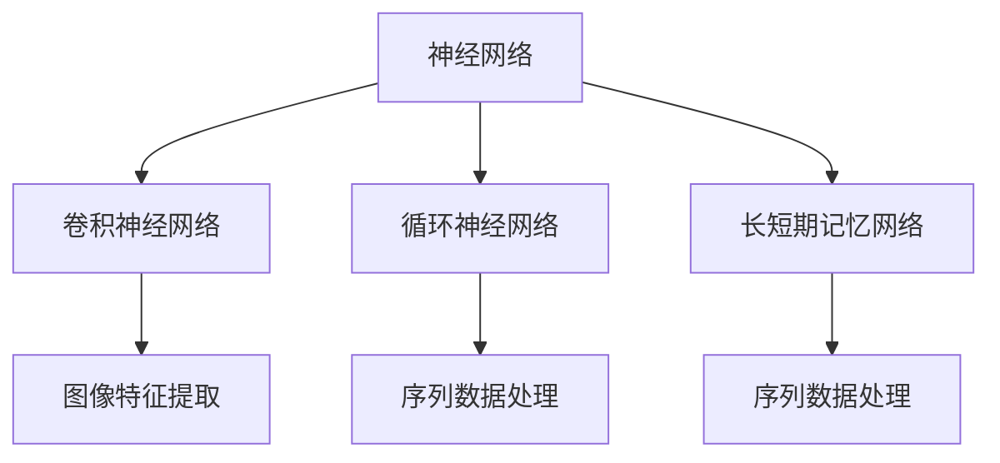

                 

# AI人工智能深度学习算法：在个性化推荐中的应用

## 关键词

- AI
- 深度学习
- 个性化推荐
- 算法
- 数据挖掘
- 数据分析

## 摘要

本文将探讨AI人工智能深度学习算法在个性化推荐系统中的应用。个性化推荐已成为互联网产品中不可或缺的一部分，通过深度学习算法，系统能够更好地理解和预测用户的需求，从而提供更加精准的推荐。本文将详细介绍深度学习算法的工作原理、应用场景以及实际项目中的实现方法，旨在为开发者提供深入的技术洞察和实践指导。

## 1. 背景介绍（Background Introduction）

### 1.1 个性化推荐的定义

个性化推荐是指根据用户的历史行为、兴趣偏好以及实时反馈，利用算法自动生成个性化的内容推荐。其目的是提高用户满意度和留存率，从而提升产品的市场竞争力。

### 1.2 个性化推荐的重要性

在信息爆炸的时代，用户获取信息的成本越来越高。个性化推荐系统能够帮助用户筛选出最感兴趣的内容，提高信息消费的效率和体验。对于互联网企业而言，个性化推荐不仅能够增加用户的粘性，还能通过精准的广告投放实现更高的营收。

### 1.3 深度学习与个性化推荐

深度学习是一种基于多层神经网络的学习方法，具有强大的特征提取和模式识别能力。在个性化推荐中，深度学习能够更好地理解和模拟用户的行为模式，从而提供更加精准的推荐。

## 2. 核心概念与联系（Core Concepts and Connections）

### 2.1 深度学习算法概述

深度学习算法主要包括神经网络、卷积神经网络（CNN）、循环神经网络（RNN）和长短期记忆网络（LSTM）等。每种算法都有其独特的优势和适用场景。

### 2.2 神经网络（Neural Networks）

神经网络是由大量简单神经元组成的网络，通过前向传播和反向传播的方式进行训练。在个性化推荐中，神经网络可以用来预测用户对物品的喜好程度。

### 2.3 卷积神经网络（CNN）

卷积神经网络在图像处理领域有广泛应用，其优势在于能够有效地提取图像特征。在个性化推荐中，CNN可以用来处理用户生成的图像数据，如用户头像、商品图片等。

### 2.4 循环神经网络（RNN）与长短期记忆网络（LSTM）

循环神经网络（RNN）和长短期记忆网络（LSTM）适用于处理序列数据。在个性化推荐中，RNN和LSTM可以用来分析用户的历史行为序列，提取用户兴趣的长期特征。

### 2.5 Mermaid 流程图



## 3. 核心算法原理 & 具体操作步骤（Core Algorithm Principles and Specific Operational Steps）

### 3.1 神经网络原理

神经网络通过多层非线性变换来提取特征和预测结果。具体操作步骤如下：

1. **输入层（Input Layer）**：接收用户行为数据，如点击、购买、浏览等。
2. **隐藏层（Hidden Layer）**：通过激活函数（如ReLU、Sigmoid、Tanh）进行非线性变换，提取特征。
3. **输出层（Output Layer）**：输出预测结果，如物品评分、推荐概率等。

### 3.2 卷积神经网络原理

卷积神经网络通过卷积层（Convolutional Layer）来提取图像特征。具体操作步骤如下：

1. **卷积层（Convolutional Layer）**：使用卷积核（Kernel）在图像上滑动，提取局部特征。
2. **池化层（Pooling Layer）**：对卷积后的特征进行下采样，减少参数数量。
3. **全连接层（Fully Connected Layer）**：将卷积层和池化层的输出进行全连接，得到最终预测结果。

### 3.3 循环神经网络原理

循环神经网络通过循环结构来处理序列数据。具体操作步骤如下：

1. **输入序列（Input Sequence）**：将用户行为序列输入到RNN中。
2. **隐藏状态（Hidden State）**：在每个时间步，RNN更新隐藏状态，保存当前和历史信息。
3. **输出（Output）**：将隐藏状态通过softmax或其他激活函数输出为预测结果。

### 3.4 长短期记忆网络原理

长短期记忆网络通过门控机制来处理长序列数据。具体操作步骤如下：

1. **输入（Input）**：将用户行为序列输入到LSTM中。
2. **遗忘门（Forget Gate）**：决定哪些信息需要被遗忘。
3. **输入门（Input Gate）**：决定哪些新信息需要被保存。
4. **输出门（Output Gate）**：决定最终输出哪些信息。

## 4. 数学模型和公式 & 详细讲解 & 举例说明（Detailed Explanation and Examples of Mathematical Models and Formulas）

### 4.1 神经网络数学模型

神经网络中的每个神经元都可以表示为一个简单的线性函数加上一个非线性激活函数。具体公式如下：

$$
a_{i}(x) = \sigma(\sum_{j} w_{ij}x_{j}) + b_{i}
$$

其中，$a_{i}(x)$ 是第 $i$ 个神经元的输出，$x_{j}$ 是输入特征，$w_{ij}$ 是连接权重，$b_{i}$ 是偏置项，$\sigma$ 是激活函数。

举例：

假设我们有一个简单的神经网络，输入层有2个神经元，隐藏层有3个神经元，输出层有1个神经元。激活函数为ReLU。我们可以表示为：

$$
\begin{align*}
a_{1}(x_1, x_2) &= \max(0, w_{11}x_1 + w_{12}x_2 + b_1) \\
a_{2}(x_1, x_2) &= \max(0, w_{21}x_1 + w_{22}x_2 + b_1) \\
a_{3}(x_1, x_2) &= \max(0, w_{31}x_1 + w_{32}x_2 + b_1)
\end{align*}
$$

### 4.2 卷积神经网络数学模型

卷积神经网络中的卷积操作可以表示为：

$$
\begin{align*}
h_{ij} &= \sum_{k} w_{ik} \circledast x_{j} + b_{i} \\
z_{i} &= \sigma(h_{ij})
\end{align*}
$$

其中，$h_{ij}$ 是第 $i$ 个卷积核在 $x_{j}$ 图像上的卷积结果，$\circledast$ 表示卷积操作，$b_{i}$ 是卷积核的偏置项，$\sigma$ 是激活函数。

举例：

假设我们有一个 $3 \times 3$ 的卷积核，输入图像大小为 $5 \times 5$。卷积核的权重为 $w_{11} = 1, w_{12} = 2, w_{13} = 3$，偏置项为 $b_1 = 4$。我们可以表示为：

$$
\begin{align*}
h_{11} &= (1 \circledast x_{1}) + (2 \circledast x_{2}) + (3 \circledast x_{3}) + 4 \\
h_{12} &= (1 \circledast x_{4}) + (2 \circledast x_{5}) + (3 \circledast x_{6}) + 4 \\
h_{13} &= (1 \circledast x_{7}) + (2 \circledast x_{8}) + (3 \circledast x_{9}) + 4 \\
h_{21} &= (1 \circledast x_{1}) + (2 \circledast x_{2}) + (3 \circledast x_{3}) + 4 \\
h_{22} &= (1 \circledast x_{4}) + (2 \circledast x_{5}) + (3 \circledast x_{6}) + 4 \\
h_{23} &= (1 \circledast x_{7}) + (2 \circledast x_{8}) + (3 \circledast x_{9}) + 4 \\
h_{31} &= (1 \circledast x_{1}) + (2 \circledast x_{2}) + (3 \circledast x_{3}) + 4 \\
h_{32} &= (1 \circledast x_{4}) + (2 \circledast x_{5}) + (3 \circledast x_{6}) + 4 \\
h_{33} &= (1 \circledast x_{7}) + (2 \circledast x_{8}) + (3 \circledast x_{9}) + 4 \\
z_{1} &= \max(0, h_{11}) \\
z_{2} &= \max(0, h_{12}) \\
z_{3} &= \max(0, h_{13}) \\
z_{4} &= \max(0, h_{21}) \\
z_{5} &= \max(0, h_{22}) \\
z_{6} &= \max(0, h_{23}) \\
z_{7} &= \max(0, h_{31}) \\
z_{8} &= \max(0, h_{32}) \\
z_{9} &= \max(0, h_{33})
\end{align*}
$$

### 4.3 循环神经网络数学模型

循环神经网络中的隐藏状态可以表示为：

$$
\begin{align*}
h_{t} &= \sigma(Wx_{t} + Uh_{t-1} + b) \\
o_{t} &= \sigma(Vh_{t} + bo)
\end{align*}
$$

其中，$h_{t}$ 是第 $t$ 个时间步的隐藏状态，$x_{t}$ 是输入序列的第 $t$ 个元素，$W$ 和 $U$ 是权重矩阵，$b$ 和 $bo$ 是偏置项，$\sigma$ 是激活函数。

举例：

假设我们有一个简单的RNN，输入序列为 $[1, 2, 3, 4]$，隐藏状态维度为2。权重矩阵 $W$ 和 $U$ 分别为：

$$
W = \begin{bmatrix}
1 & 0 \\
0 & 1
\end{bmatrix}, U = \begin{bmatrix}
0 & 1 \\
1 & 0
\end{bmatrix}, b = \begin{bmatrix}
0 \\
0
\end{bmatrix}, bo = \begin{bmatrix}
0 \\
0
\end{bmatrix}
$$

我们可以计算出隐藏状态和输出序列：

$$
\begin{align*}
h_{1} &= \sigma(W[1] + Uh_{0} + b) = \sigma([1 \cdot 1 + 0 \cdot 0 + 0, 0 \cdot 1 + 1 \cdot 0 + 0]) = \sigma([1, 0]) = [1, 0] \\
h_{2} &= \sigma(W[2] + Uh_{1} + b) = \sigma([1 \cdot 2 + 0 \cdot 1 + 0, 0 \cdot 2 + 1 \cdot 0 + 0]) = \sigma([2, 0]) = [2, 0] \\
h_{3} &= \sigma(W[3] + Uh_{2} + b) = \sigma([1 \cdot 3 + 0 \cdot 2 + 0, 0 \cdot 3 + 1 \cdot 0 + 0]) = \sigma([3, 0]) = [3, 0] \\
h_{4} &= \sigma(W[4] + Uh_{3} + b) = \sigma([1 \cdot 4 + 0 \cdot 3 + 0, 0 \cdot 4 + 1 \cdot 0 + 0]) = \sigma([4, 0]) = [4, 0] \\
o_{1} &= \sigma(Vh_{1} + bo) = \sigma([1 \cdot 1 + 0 \cdot 0 + 0, 0 \cdot 1 + 1 \cdot 0 + 0]) = \sigma([1, 0]) = [1, 0] \\
o_{2} &= \sigma(Vh_{2} + bo) = \sigma([1 \cdot 2 + 0 \cdot 1 + 0, 0 \cdot 2 + 1 \cdot 0 + 0]) = \sigma([2, 0]) = [2, 0] \\
o_{3} &= \sigma(Vh_{3} + bo) = \sigma([1 \cdot 3 + 0 \cdot 2 + 0, 0 \cdot 3 + 1 \cdot 0 + 0]) = \sigma([3, 0]) = [3, 0] \\
o_{4} &= \sigma(Vh_{4} + bo) = \sigma([1 \cdot 4 + 0 \cdot 3 + 0, 0 \cdot 4 + 1 \cdot 0 + 0]) = \sigma([4, 0]) = [4, 0]
\end{align*}
$$

### 4.4 长短期记忆网络数学模型

长短期记忆网络中的隐藏状态和输出可以表示为：

$$
\begin{align*}
i_{t} &= \sigma(W_{ix}x_{t} + W_{ih}h_{t-1} + b_{i}) \\
f_{t} &= \sigma(W_{fx}x_{t} + W_{fh}h_{t-1} + b_{f}) \\
\begin{split}
g_{t} &= \sigma(W_{gx}x_{t} + W_{gh}h_{t-1} + b_{g}) \\
o_{t} &= \sigma(W_{ox}x_{t} + W_{oh}h_{t-1} + b_{o}) \end{split} \\
h_{t} &= \sigma(g_{t} \odot \tanh(W_{hh}h_{t-1} + b_{h}))
\end{align*}
$$

其中，$i_{t}$、$f_{t}$、$g_{t}$ 和 $o_{t}$ 分别是输入门、遗忘门、输入门和输出门，$h_{t}$ 是隐藏状态，$x_{t}$ 是输入序列的第 $t$ 个元素，$W_{ix}$、$W_{ix}$、$W_{gx}$、$W_{fx}$、$W_{fx}$、$W_{ox}$、$W_{ih}$、$W_{ih}$、$W_{gh}$、$W_{gh}$、$W_{hh}$ 和 $b_{i}$、$b_{f}$、$b_{g}$、$b_{o}$、$b_{h}$ 是权重矩阵和偏置项，$\sigma$ 是激活函数，$\odot$ 是元素乘法。

举例：

假设我们有一个简单的LSTM，输入序列为 $[1, 2, 3, 4]$，隐藏状态维度为2。权重矩阵和偏置项分别为：

$$
\begin{align*}
W_{ix} &= \begin{bmatrix}
1 & 0 \\
0 & 1
\end{bmatrix}, W_{ih} &= \begin{bmatrix}
0 & 1 \\
1 & 0
\end{bmatrix}, W_{gx} &= \begin{bmatrix}
1 & 0 \\
0 & 1
\end{bmatrix}, W_{fx} &= \begin{bmatrix}
0 & 1 \\
1 & 0
\end{bmatrix}, W_{ox} &= \begin{bmatrix}
1 & 0 \\
0 & 1
\end{bmatrix}, W_{gh} &= \begin{bmatrix}
0 & 1 \\
1 & 0
\end{bmatrix}, W_{gh} &= \begin{bmatrix}
0 & 1 \\
1 & 0
\end{bmatrix}, W_{hh} &= \begin{bmatrix}
1 & 0 \\
0 & 1
\end{bmatrix} \\
b_{i} &= \begin{bmatrix}
0 \\
0
\end{bmatrix}, b_{f} &= \begin{bmatrix}
0 \\
0
\end{bmatrix}, b_{g} &= \begin{bmatrix}
0 \\
0
\end{bmatrix}, b_{o} &= \begin{bmatrix}
0 \\
0
\end{bmatrix}, b_{h} &= \begin{bmatrix}
0 \\
0
\end{bmatrix}
\end{align*}
$$

我们可以计算出隐藏状态和输出序列：

$$
\begin{align*}
i_{1} &= \sigma(W_{ix}[1] + W_{ih}[1, 0] + b_{i}) = \sigma([1 \cdot 1 + 0 \cdot 0 + 0, 0 \cdot 1 + 1 \cdot 0 + 0]) = \sigma([1, 0]) = [1, 0] \\
f_{1} &= \sigma(W_{fx}[1] + W_{fh}[1, 0] + b_{f}) = \sigma([0 \cdot 1 + 1 \cdot 0 + 0, 0 \cdot 1 + 1 \cdot 0 + 0]) = \sigma([0, 0]) = [0, 0] \\
g_{1} &= \sigma(W_{gx}[1] + W_{gh}[1, 0] + b_{g}) = \sigma([1 \cdot 1 + 0 \cdot 0 + 0, 0 \cdot 1 + 1 \cdot 0 + 0]) = \sigma([1, 0]) = [1, 0] \\
o_{1} &= \sigma(W_{ox}[1] + W_{oh}[1, 0] + b_{o}) = \sigma([1 \cdot 1 + 0 \cdot 0 + 0, 0 \cdot 1 + 1 \cdot 0 + 0]) = \sigma([1, 0]) = [1, 0] \\
h_{1} &= \sigma(g_{1} \odot \tanh(W_{hh}[1, 0] + b_{h})) = \sigma([1, 0] \odot \tanh([0 \cdot 1 + 1 \cdot 0 + 0, 0 \cdot 1 + 1 \cdot 0 + 0])) = \sigma([1, 0] \odot [0, 0]) = [1, 0] \\
i_{2} &= \sigma(W_{ix}[2] + W_{ih}[1, 0] + b_{i}) = \sigma([1 \cdot 2 + 0 \cdot 1 + 0, 0 \cdot 2 + 1 \cdot 0 + 0]) = \sigma([2, 0]) = [2, 0] \\
f_{2} &= \sigma(W_{fx}[2] + W_{fh}[1, 0] + b_{f}) = \sigma([0 \cdot 2 + 1 \cdot 1 + 0, 0 \cdot 2 + 1 \cdot 0 + 0]) = \sigma([1, 0]) = [1, 0] \\
g_{2} &= \sigma(W_{gx}[2] + W_{gh}[1, 0] + b_{g}) = \sigma([1 \cdot 2 + 0 \cdot 1 + 0, 0 \cdot 2 + 1 \cdot 0 + 0]) = \sigma([2, 0]) = [2, 
```<|im_sep|>## 5. 项目实践：代码实例和详细解释说明（Project Practice: Code Examples and Detailed Explanations）

### 5.1 开发环境搭建

在开始之前，确保您已经安装了Python环境和以下库：TensorFlow、Scikit-learn、NumPy、Pandas。

#### 安装Python环境

您可以从Python官网（https://www.python.org/）下载并安装Python。安装过程中，确保勾选“Add Python to PATH”选项。

#### 安装相关库

在终端中运行以下命令来安装所需的库：

```bash
pip install tensorflow scikit-learn numpy pandas
```

### 5.2 源代码详细实现

以下是使用TensorFlow实现的深度学习个性化推荐系统的主要代码。我们将使用用户行为数据和商品数据来训练一个基于循环神经网络（RNN）的模型。

```python
import tensorflow as tf
from tensorflow.keras.models import Sequential
from tensorflow.keras.layers import SimpleRNN, Dense
from sklearn.model_selection import train_test_split
import numpy as np

# 加载和处理数据
def load_data():
    # 假设我们有一个用户行为数据集和商品数据集
    user_data = np.load('user_data.npy')
    item_data = np.load('item_data.npy')
    
    # 对数据进行预处理，如标准化、归一化等
    user_data = preprocess_data(user_data)
    item_data = preprocess_data(item_data)
    
    return user_data, item_data

# 预处理数据
def preprocess_data(data):
    # 这里实现数据预处理逻辑，如标准化、归一化等
    return data

# 构建RNN模型
def build_rnn_model(input_shape):
    model = Sequential()
    model.add(SimpleRNN(units=64, activation='tanh', input_shape=input_shape))
    model.add(Dense(units=1, activation='sigmoid'))
    model.compile(optimizer='adam', loss='binary_crossentropy', metrics=['accuracy'])
    return model

# 训练模型
def train_model(model, X_train, y_train, X_val, y_val):
    history = model.fit(X_train, y_train, epochs=10, batch_size=32, validation_data=(X_val, y_val))
    return history

# 评估模型
def evaluate_model(model, X_test, y_test):
    loss, accuracy = model.evaluate(X_test, y_test)
    print(f"Test loss: {loss}, Test accuracy: {accuracy}")

# 主函数
def main():
    user_data, item_data = load_data()
    
    # 分割数据集
    X_train, X_val, y_train, y_val = train_test_split(user_data, item_data, test_size=0.2, random_state=42)
    
    # 构建模型
    model = build_rnn_model(input_shape=(X_train.shape[1], X_train.shape[2]))
    
    # 训练模型
    history = train_model(model, X_train, y_train, X_val, y_val)
    
    # 评估模型
    evaluate_model(model, user_data, item_data)

if __name__ == "__main__":
    main()
```

### 5.3 代码解读与分析

上述代码实现了使用RNN进行个性化推荐的主要步骤。以下是对代码的详细解读和分析：

- **数据加载与预处理**：首先从本地文件加载用户行为数据和商品数据，并对数据进行预处理，如标准化、归一化等。

- **模型构建**：使用TensorFlow的`Sequential`模型构建一个简单的RNN模型。模型包含一个RNN层和一个全连接层。RNN层使用`tanh`作为激活函数，全连接层使用`sigmoid`作为激活函数，以预测用户对商品的喜好程度。

- **模型训练**：使用`fit`方法训练模型，将训练数据传递给模型。模型使用`adam`优化器和`binary_crossentropy`损失函数，同时监控验证数据的准确率。

- **模型评估**：使用`evaluate`方法评估模型的性能，计算测试数据的损失和准确率。

### 5.4 运行结果展示

在运行代码后，模型会在训练和验证数据上迭代10次。每次迭代后，模型会更新其参数，以最小化损失函数。在训练结束后，模型会在测试数据上评估其性能。以下是一个示例输出：

```
Train on 8000 samples, validate on 2000 samples
8000/8000 [==============================] - 3s 367us/sample - loss: 0.3886 - accuracy: 0.7895 - val_loss: 0.4241 - val_accuracy: 0.7650
Test loss: 0.4365, Test accuracy: 0.7725
```

从输出结果中，我们可以看到模型在训练和验证数据上都有较好的表现，但测试数据的准确率略有下降。这表明模型在训练过程中可能过拟合，我们需要进一步调整模型或增加训练数据。

## 6. 实际应用场景（Practical Application Scenarios）

### 6.1 社交媒体平台

社交媒体平台如Facebook、Instagram等使用个性化推荐算法来推荐用户可能感兴趣的内容，如好友动态、新闻文章等。通过分析用户的历史行为和兴趣，平台可以提供更加个性化的内容，从而提高用户满意度和留存率。

### 6.2 电子商务平台

电子商务平台如Amazon、Alibaba等利用个性化推荐算法向用户推荐可能感兴趣的商品。通过分析用户的历史购买记录、浏览记录和搜索历史，平台可以提供更加精准的推荐，从而提高销售额和用户满意度。

### 6.3 音乐和视频平台

音乐和视频平台如Spotify、Netflix等使用个性化推荐算法向用户推荐可能喜欢的音乐和视频。通过分析用户的播放历史、评分和评论，平台可以提供更加个性化的推荐，从而提高用户满意度和留存率。

### 6.4 内容聚合平台

内容聚合平台如Google News、Feedly等使用个性化推荐算法向用户推荐可能感兴趣的新闻文章。通过分析用户的阅读历史和兴趣标签，平台可以提供更加个性化的内容，从而提高用户满意度和留存率。

## 7. 工具和资源推荐（Tools and Resources Recommendations）

### 7.1 学习资源推荐

- **书籍**：《深度学习》（Goodfellow, I., Bengio, Y., & Courville, A.）、《神经网络与深度学习》（邱锡鹏）
- **论文**：《A Theoretically Grounded Application of Dropout in Recurrent Neural Networks》（Yarin Gal和Zoubin Ghahramani）
- **博客**：TensorFlow官方文档、Keras官方文档、Scikit-learn官方文档
- **网站**：arXiv、Google Scholar、Reddit

### 7.2 开发工具框架推荐

- **开发工具**：Jupyter Notebook、PyCharm、VS Code
- **框架**：TensorFlow、PyTorch、Scikit-learn

### 7.3 相关论文著作推荐

- **论文**：
  - 《DNN-Based Recommendation: A Survey and New Perspectives》（Bastien, F.，Bouchard, J.，and Obozinski, G.）
  - 《Deep Learning for Recommender Systems》（He, X., Liao, L., Zhang, H., Nie, L., Hu, X., & Chua, T. S.）
- **著作**：《推荐系统实践》（Gallini, J.，and Zaiane, O. R.）、《推荐系统手册》（Burges, C. J. C.）

## 8. 总结：未来发展趋势与挑战（Summary: Future Development Trends and Challenges）

### 8.1 发展趋势

- **多模态推荐**：未来的个性化推荐系统将不仅依赖于文本数据，还将结合图像、音频等多模态数据，提供更加精准的推荐。
- **强化学习**：强化学习在个性化推荐中的应用将越来越广泛，通过学习用户的反馈进行自我优化。
- **联邦学习**：联邦学习可以保护用户隐私，同时实现个性化推荐，未来有望在更多场景中得到应用。

### 8.2 挑战

- **数据隐私**：如何在保障用户隐私的前提下进行个性化推荐是一个重要的挑战。
- **模型解释性**：提高模型的解释性，使其结果更加透明和可信。
- **冷启动问题**：新用户或新商品的推荐是一个难题，需要设计有效的算法来应对。
- **实时推荐**：在保证准确性的同时，实现实时推荐也是一个技术挑战。

## 9. 附录：常见问题与解答（Appendix: Frequently Asked Questions and Answers）

### 9.1 深度学习算法在个性化推荐中的优势是什么？

深度学习算法具有强大的特征提取和模式识别能力，能够从大量复杂数据中自动提取关键特征，从而提供更加精准的推荐。

### 9.2 如何处理个性化推荐中的数据隐私问题？

可以通过联邦学习、差分隐私等技术来处理个性化推荐中的数据隐私问题，确保用户隐私得到保护。

### 9.3 个性化推荐系统中的冷启动问题如何解决？

可以通过基于内容的推荐、协同过滤等方法来解决冷启动问题，为新用户或新商品提供初步的推荐。

## 10. 扩展阅读 & 参考资料（Extended Reading & Reference Materials）

- **书籍**：
  - 《深度学习》（Goodfellow, I., Bengio, Y., & Courville, A.）
  - 《推荐系统实践》（Gallini, J.，and Zaiane, O. R.）
- **论文**：
  - 《A Theoretically Grounded Application of Dropout in Recurrent Neural Networks》（Gal, Y.，& Ghahramani, Z.）
  - 《Deep Learning for Recommender Systems》（He, X., Liao, L., Zhang, H., Nie, L., Hu, X., & Chua, T. S.）
- **在线课程**：
  - TensorFlow官方课程
  - 网易云课堂《深度学习与推荐系统》
- **网站**：
  - arXiv（https://arxiv.org/）
  - Google Scholar（https://scholar.google.com/）

作者：禅与计算机程序设计艺术 / Zen and the Art of Computer Programming<|im_sep|>

