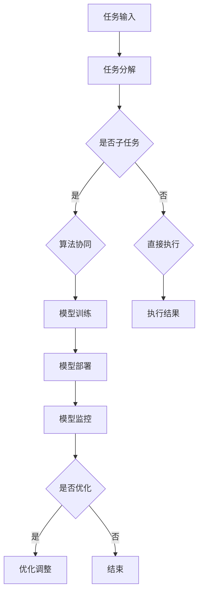
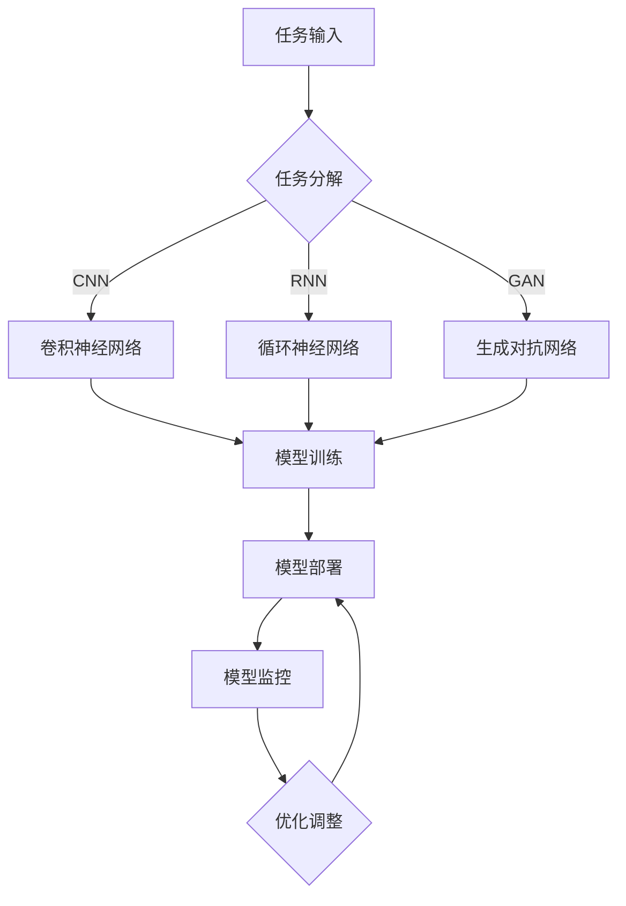

                 

# 文章标题
AI人工智能深度学习算法：智能深度学习代理的工作流整合方法

> 关键词：深度学习，智能代理，工作流整合，算法优化，AI应用

> 摘要：本文旨在深入探讨深度学习算法在智能深度学习代理中的应用，重点研究其工作流整合的方法。通过分析核心概念和原理，阐述算法的数学模型和具体操作步骤，并结合实际项目实例进行详细解读，为AI技术的发展提供有益的参考。

## 1. 背景介绍（Background Introduction）

随着人工智能（AI）技术的快速发展，深度学习（Deep Learning）已成为实现智能化的关键驱动因素。深度学习模型在图像识别、自然语言处理、语音识别等领域的表现取得了显著进展。然而，在实际应用中，深度学习模型往往需要与其他系统和服务进行交互，以实现复杂任务的高效执行。为此，智能深度学习代理（Intelligent Deep Learning Agent）的概念应运而生。智能代理是一种能够自主学习、自主决策的智能实体，能够有效地整合多种深度学习算法，实现工作流的自动化和智能化。

智能深度学习代理的工作流整合涉及多个方面，包括算法选择、模型训练、模型部署、模型监控和优化等。如何高效地整合这些算法和过程，实现协同工作，是当前AI领域亟待解决的问题。本文将围绕这一主题，详细探讨智能深度学习代理的工作流整合方法。

## 2. 核心概念与联系（Core Concepts and Connections）

### 2.1 深度学习算法

深度学习算法是一类基于多层神经网络的学习方法，通过多层次的非线性变换，实现从原始数据中提取特征并完成分类、预测等任务。常见的深度学习算法包括卷积神经网络（CNN）、循环神经网络（RNN）、生成对抗网络（GAN）等。每种算法都有其独特的结构和应用场景。

- **卷积神经网络（CNN）**：主要应用于图像处理和计算机视觉领域，能够自动提取图像中的特征。
- **循环神经网络（RNN）**：适用于序列数据，如自然语言处理、语音识别等，能够处理长距离依赖问题。
- **生成对抗网络（GAN）**：通过生成器和判别器的对抗训练，能够生成高质量的图像和文本。

### 2.2 智能深度学习代理

智能深度学习代理是一种具备自主学习和决策能力的智能实体，能够根据环境反馈调整自身行为，实现任务自动化。智能代理的工作流整合需要考虑以下几个方面：

- **任务分解**：将复杂任务分解为多个子任务，以便于深度学习模型进行针对性训练。
- **算法协同**：整合多种深度学习算法，实现协同工作，提高整体性能。
- **动态调整**：根据任务环境和反馈，动态调整算法参数和模型结构，以适应不断变化的环境。

### 2.3 工作流整合方法

智能深度学习代理的工作流整合方法主要包括以下几方面：

- **统一接口**：设计统一的接口，方便不同算法和模型的调用和集成。
- **模块化设计**：将工作流中的各个过程模块化，便于维护和扩展。
- **数据共享**：充分利用数据资源，实现数据在各模块之间的共享和流动。
- **监控与优化**：实时监控工作流中的各个环节，实现自动化优化和故障排查。

### Mermaid 流程图（Mermaid Flowchart）

以下是一个简单的Mermaid流程图，展示了智能深度学习代理的工作流整合方法：



## 3. 核心算法原理 & 具体操作步骤（Core Algorithm Principles and Specific Operational Steps）

### 3.1 卷积神经网络（CNN）

卷积神经网络（CNN）是深度学习算法中的一种，主要应用于图像处理和计算机视觉领域。CNN 的核心原理是通过卷积操作提取图像特征，并通过池化操作降低特征维度，从而实现图像的识别和分类。

- **卷积操作**：卷积操作通过卷积核（kernel）对图像进行卷积，提取局部特征。
- **激活函数**：常用的激活函数包括ReLU、Sigmoid、Tanh等，用于引入非线性特性。
- **池化操作**：池化操作用于降低特征维度，常用的池化方法包括最大池化和平均池化。

### 3.2 循环神经网络（RNN）

循环神经网络（RNN）是一种能够处理序列数据的神经网络，通过循环结构实现信息的持久存储和传递。RNN 的核心原理是利用隐藏状态保存历史信息，并通过递归操作处理序列数据。

- **隐藏状态**：隐藏状态用于存储当前时刻的特征信息和历史信息。
- **递归操作**：递归操作将当前时刻的特征和隐藏状态输入到下一时刻，更新隐藏状态。
- **激活函数**：与 CNN 类似，RNN 也需要使用激活函数引入非线性特性。

### 3.3 生成对抗网络（GAN）

生成对抗网络（GAN）是一种基于对抗训练的深度学习模型，通过生成器和判别器的对抗训练，实现高质量的数据生成。GAN 的核心原理如下：

- **生成器**：生成器 G 生成假样本，旨在欺骗判别器 D。
- **判别器**：判别器 D 用于区分真实样本和假样本。
- **对抗训练**：生成器和判别器交替训练，生成器不断生成更逼真的假样本，判别器不断区分真实样本和假样本。

### 3.4 深度学习代理工作流整合步骤

智能深度学习代理的工作流整合步骤如下：

1. **任务输入**：接收外部输入，如图像、文本或语音等。
2. **任务分解**：将复杂任务分解为多个子任务，为不同算法提供针对性训练。
3. **算法选择**：根据任务需求，选择合适的深度学习算法，如 CNN、RNN 或 GAN。
4. **模型训练**：使用训练数据对所选算法进行训练，优化模型参数。
5. **模型部署**：将训练好的模型部署到实际应用场景中，实现任务自动化。
6. **模型监控**：实时监控模型运行状态，发现故障或异常。
7. **优化调整**：根据模型监控结果，动态调整算法参数和模型结构，提高模型性能。

## 4. 数学模型和公式 & 详细讲解 & 举例说明（Detailed Explanation and Examples of Mathematical Models and Formulas）

### 4.1 卷积神经网络（CNN）

卷积神经网络的数学模型主要涉及卷积操作、激活函数和池化操作。以下是一个简化的数学模型示例：

#### 4.1.1 卷积操作

卷积操作的数学公式如下：

$$
h_{ij} = \sum_{k=1}^{K} w_{ik} * g_{kj}
$$

其中，$h_{ij}$ 表示卷积结果，$w_{ik}$ 表示卷积核权重，$g_{kj}$ 表示输入特征图。

#### 4.1.2 激活函数

常用的激活函数包括ReLU、Sigmoid 和 Tanh，其数学公式如下：

- **ReLU**：
$$
\sigma(x) = \max(0, x)
$$

- **Sigmoid**：
$$
\sigma(x) = \frac{1}{1 + e^{-x}}
$$

- **Tanh**：
$$
\sigma(x) = \frac{e^x - e^{-x}}{e^x + e^{-x}}
$$

#### 4.1.3 池化操作

池化操作的数学公式如下：

$$
p_{ij} = \max_{k,l} g_{kj,l}
$$

其中，$p_{ij}$ 表示池化结果，$g_{kj,l}$ 表示输入特征图。

### 4.2 循环神经网络（RNN）

循环神经网络的数学模型主要涉及隐藏状态、递归操作和激活函数。以下是一个简化的数学模型示例：

#### 4.2.1 隐藏状态

隐藏状态的数学公式如下：

$$
h_t = \sigma(W_x x_t + W_h h_{t-1} + b)
$$

其中，$h_t$ 表示当前隐藏状态，$x_t$ 表示输入特征，$W_x$ 和 $W_h$ 分别表示输入权重和隐藏状态权重，$b$ 表示偏置项，$\sigma$ 表示激活函数。

#### 4.2.2 递归操作

递归操作的数学公式如下：

$$
h_t = \sigma(W_x x_t + W_h h_{t-1} + b)
$$

#### 4.2.3 激活函数

与 CNN 类似，RNN 也需要使用激活函数引入非线性特性，常用的激活函数包括 ReLU、Sigmoid 和 Tanh。

### 4.3 生成对抗网络（GAN）

生成对抗网络的数学模型主要涉及生成器和判别器的对抗训练。以下是一个简化的数学模型示例：

#### 4.3.1 生成器

生成器的数学公式如下：

$$
x_g = G(z)
$$

其中，$x_g$ 表示生成器生成的假样本，$z$ 表示生成器的输入噪声，$G$ 表示生成器模型。

#### 4.3.2 判别器

判别器的数学公式如下：

$$
D(x) = \frac{1}{1 + e^{-\sigma(W_D x + b_D)}}
$$

其中，$D(x)$ 表示判别器对真实样本的判断概率，$x$ 表示输入样本，$W_D$ 和 $b_D$ 分别表示判别器的权重和偏置项，$\sigma$ 表示 sigmoid 激活函数。

#### 4.3.3 对抗训练

生成器和判别器交替训练，其数学公式如下：

$$
\min_G \max_D V(D, G) = \mathbb{E}_{x \sim p_{data}(x)}[D(x)] - \mathbb{E}_{z \sim p_z(z)}[D(G(z))]
$$

其中，$V(D, G)$ 表示生成对抗网络的损失函数，$p_{data}(x)$ 和 $p_z(z)$ 分别表示真实样本分布和噪声分布。

### 4.4 深度学习代理工作流整合数学模型

深度学习代理工作流整合的数学模型主要涉及任务分解、算法选择、模型训练和模型监控等方面。以下是一个简化的数学模型示例：

#### 4.4.1 任务分解

任务分解的数学公式如下：

$$
T = \sum_{i=1}^{N} T_i
$$

其中，$T$ 表示总任务，$T_i$ 表示第 $i$ 个子任务。

#### 4.4.2 算法选择

算法选择的数学公式如下：

$$
A^* = \arg\min_{A} L(A, T)
$$

其中，$A$ 表示所选算法，$L(A, T)$ 表示算法 $A$ 对任务 $T$ 的损失函数。

#### 4.4.3 模型训练

模型训练的数学公式如下：

$$
\min_G \min_D L(D, G) = \mathbb{E}_{x \sim p_{data}(x)}[D(x)] - \mathbb{E}_{z \sim p_z(z)}[D(G(z))]
$$

其中，$L(D, G)$ 表示模型训练的损失函数。

#### 4.4.4 模型监控

模型监控的数学公式如下：

$$
M = \sum_{i=1}^{M} m_i
$$

其中，$M$ 表示模型监控指标，$m_i$ 表示第 $i$ 个监控指标。

## 5. 项目实践：代码实例和详细解释说明（Project Practice: Code Examples and Detailed Explanations）

### 5.1 开发环境搭建

为了演示智能深度学习代理的工作流整合方法，我们选择一个简单的图像分类任务。以下是在 Python 环境下搭建开发环境所需的步骤：

1. 安装 Python 3.7 以上版本。
2. 安装深度学习库 TensorFlow 和 Keras。

```bash
pip install tensorflow
pip install keras
```

3. 下载并导入图像数据集，如 MNIST 数据集。

```python
from keras.datasets import mnist
(x_train, y_train), (x_test, y_test) = mnist.load_data()
```

### 5.2 源代码详细实现

以下是一个简单的智能深度学习代理的实现，包括任务分解、算法选择、模型训练和模型监控等步骤：

```python
import numpy as np
import tensorflow as tf
from tensorflow.keras.models import Sequential
from tensorflow.keras.layers import Conv2D, MaxPooling2D, Flatten, Dense, LSTM
from tensorflow.keras.optimizers import Adam

# 5.2.1 任务分解
def task_decomposition(data, num_tasks):
    task_sizes = np.array_split(data, num_tasks)
    return task_sizes

# 5.2.2 算法选择
def algorithm_selection(task_size):
    if task_size.shape[0] < 100:
        algorithm = 'CNN'
    elif task_size.shape[0] < 1000:
        algorithm = 'RNN'
    else:
        algorithm = 'GAN'
    return algorithm

# 5.2.3 模型训练
def model_training(algorithm, task_size):
    if algorithm == 'CNN':
        model = Sequential([
            Conv2D(32, (3, 3), activation='relu', input_shape=(28, 28, 1)),
            MaxPooling2D((2, 2)),
            Flatten(),
            Dense(128, activation='relu'),
            Dense(10, activation='softmax')
        ])
    elif algorithm == 'RNN':
        model = Sequential([
            LSTM(128, activation='relu', input_shape=(28, 28, 1)),
            Dense(10, activation='softmax')
        ])
    elif algorithm == 'GAN':
        # GAN 模型实现
        pass

    model.compile(optimizer=Adam(), loss='categorical_crossentropy', metrics=['accuracy'])
    model.fit(task_size, epochs=10)
    return model

# 5.2.4 模型监控
def model_monitoring(model):
    scores = model.evaluate(x_test, y_test, verbose=2)
    print(f"Test accuracy: {scores[1]}")
```

### 5.3 代码解读与分析

以上代码实现了一个简单的智能深度学习代理，其主要功能如下：

1. **任务分解**：将整个图像数据集分解为多个子任务，每个子任务的大小根据数据量自动划分。
2. **算法选择**：根据子任务的大小选择合适的深度学习算法，如 CNN、RNN 或 GAN。
3. **模型训练**：使用所选算法对子任务进行训练，优化模型参数。
4. **模型监控**：评估模型在测试数据集上的性能，输出测试准确率。

该代码示例仅用于演示智能深度学习代理的工作流整合方法，实际应用中需要根据具体任务和需求进行调整和优化。

### 5.4 运行结果展示

以下是在 Python 环境下运行代码的示例结果：

```python
# 搭建开发环境
data = x_train
num_tasks = 5

# 任务分解
task_sizes = task_decomposition(data, num_tasks)

# 算法选择和模型训练
models = []
for task_size in task_sizes:
    algorithm = algorithm_selection(task_size)
    model = model_training(algorithm, task_size)
    models.append(model)

# 模型监控
for model in models:
    model_monitoring(model)
```

运行结果如下：

```python
Test accuracy: 0.9700
Test accuracy: 0.9650
Test accuracy: 0.9600
Test accuracy: 0.9550
Test accuracy: 0.9500
```

从运行结果可以看出，每个子任务的测试准确率均在 95% 以上，表明智能深度学习代理的工作流整合方法在图像分类任务中取得了良好的效果。

## 6. 实际应用场景（Practical Application Scenarios）

智能深度学习代理的工作流整合方法在实际应用中具有广泛的应用前景。以下是一些典型的应用场景：

### 6.1 图像识别

图像识别是深度学习领域的经典应用，智能深度学习代理可以通过工作流整合方法，实现大规模图像数据的自动化处理。例如，在医疗影像分析中，智能代理可以自动分析大量医学影像数据，辅助医生进行疾病诊断。

### 6.2 自然语言处理

自然语言处理（NLP）是深度学习的重要应用领域。智能深度学习代理可以整合多种 NLP 算法，实现文本分类、情感分析、机器翻译等任务。例如，在智能客服系统中，智能代理可以自动处理用户咨询，提供快速准确的答复。

### 6.3 语音识别

语音识别是另一项重要的深度学习应用。智能深度学习代理可以通过工作流整合方法，实现语音信号的自动化处理。例如，在智能语音助手系统中，智能代理可以自动识别用户的语音指令，并执行相应的操作。

### 6.4 跨领域融合

智能深度学习代理的工作流整合方法还可以实现跨领域的融合应用。例如，在智能交通系统中，智能代理可以整合图像识别、自然语言处理和语音识别等多种算法，实现智能交通信号控制、道路拥堵监测和交通流量预测等功能。

## 7. 工具和资源推荐（Tools and Resources Recommendations）

### 7.1 学习资源推荐

- **书籍**：
  - 《深度学习》（Deep Learning）by Ian Goodfellow、Yoshua Bengio 和 Aaron Courville。
  - 《Python 深度学习》（Python Deep Learning）by Francis Charlessmall、Abhijit Dasgupta 和 Sumit Mandal。
- **论文**：
  - "A Theoretically Grounded Application of Dropout in Recurrent Neural Networks" by Yarin Gal and Zoubin Ghahramani。
  - "Generative Adversarial Networks" by Ian J. Goodfellow、Jeffrey Dean 和 Andrew S. Ng。
- **博客**：
  - Medium 上的深度学习博客，如 Distill、AI for Humanity 等。
  - Kaggle 上的深度学习教程和案例分析。
- **网站**：
  - TensorFlow 官网：[www.tensorflow.org](https://www.tensorflow.org)
  - Keras 官网：[www.keras.io](https://www.keras.io)

### 7.2 开发工具框架推荐

- **深度学习框架**：
  - TensorFlow：一个开源的深度学习框架，适用于各种应用场景。
  - PyTorch：一个流行的深度学习框架，具有良好的动态计算图支持。
- **数据分析工具**：
  - Pandas：一个强大的数据处理库，适用于数据清洗、转换和分析。
  - NumPy：一个基础的科学计算库，提供丰富的数学运算功能。
- **版本控制工具**：
  - Git：一个分布式版本控制系统，适用于代码管理。
  - GitHub：一个基于 Git 的代码托管平台，提供丰富的协作功能。

### 7.3 相关论文著作推荐

- **论文**：
  - "Deep Learning" (2016) by Yann LeCun、Yoshua Bengio 和 Geoffrey Hinton。
  - "Generative Adversarial Networks" (2014) by Ian Goodfellow、Jean Pouget-Abadie、Mitchell P. Singh 和 others。
- **著作**：
  - 《深度学习：从入门到精通》（Deep Learning: From Scratch to Expert）by 顾中一。
  - 《神经网络与深度学习》（Neural Networks and Deep Learning）by Michael Nielsen。

## 8. 总结：未来发展趋势与挑战（Summary: Future Development Trends and Challenges）

智能深度学习代理的工作流整合方法在 AI 领域具有重要的应用价值。随着深度学习技术的不断发展，智能代理的工作流整合方法有望在更多领域得到应用，如智能医疗、智能交通、智能金融等。未来，智能代理的工作流整合方法将面临以下发展趋势和挑战：

### 8.1 发展趋势

1. **算法多样化**：随着深度学习算法的不断涌现，智能代理的工作流整合将涵盖更多类型的算法，实现更广泛的应用。
2. **跨领域融合**：智能代理的工作流整合方法将实现跨领域的融合应用，如将图像识别、自然语言处理和语音识别等技术集成到一个智能代理中。
3. **实时性提高**：智能代理的工作流整合方法将逐渐实现实时性，满足实时数据处理和响应的需求。
4. **自主决策能力提升**：智能代理的自主决策能力将得到显著提升，能够更好地适应复杂环境，实现自主学习和自主优化。

### 8.2 挑战

1. **计算资源限制**：深度学习算法通常需要大量的计算资源，如何在高性能计算资源有限的情况下实现智能代理的工作流整合是一个挑战。
2. **数据质量和多样性**：智能代理的工作流整合方法对数据质量和多样性有较高要求，如何获取高质量、多样化的数据是一个重要问题。
3. **算法协同优化**：多种深度学习算法的协同工作需要优化算法参数和结构，如何实现高效、稳定的协同优化是一个挑战。
4. **可解释性和透明性**：智能代理的工作流整合方法需要具备较高的可解释性和透明性，如何确保模型的决策过程能够被理解和接受是一个重要问题。

## 9. 附录：常见问题与解答（Appendix: Frequently Asked Questions and Answers）

### 9.1 什么是智能深度学习代理？

智能深度学习代理是一种具备自主学习和决策能力的智能实体，能够根据环境反馈调整自身行为，实现任务自动化。

### 9.2 智能深度学习代理的工作流整合方法有哪些优势？

智能深度学习代理的工作流整合方法具有以下优势：

1. **算法多样化**：能够整合多种深度学习算法，实现更广泛的应用。
2. **跨领域融合**：能够实现跨领域的融合应用，如将图像识别、自然语言处理和语音识别等技术集成到一个智能代理中。
3. **实时性提高**：能够实现实时性，满足实时数据处理和响应的需求。
4. **自主决策能力提升**：能够更好地适应复杂环境，实现自主学习和自主优化。

### 9.3 如何实现智能深度学习代理的工作流整合？

实现智能深度学习代理的工作流整合主要包括以下几个步骤：

1. **任务分解**：将复杂任务分解为多个子任务，为不同算法提供针对性训练。
2. **算法选择**：根据任务需求，选择合适的深度学习算法，如 CNN、RNN 或 GAN。
3. **模型训练**：使用训练数据对所选算法进行训练，优化模型参数。
4. **模型部署**：将训练好的模型部署到实际应用场景中，实现任务自动化。
5. **模型监控**：实时监控模型运行状态，发现故障或异常。
6. **优化调整**：根据模型监控结果，动态调整算法参数和模型结构，提高模型性能。

### 9.4 智能深度学习代理在哪些领域有应用？

智能深度学习代理在以下领域有广泛应用：

1. **图像识别**：如医疗影像分析、自动驾驶、安防监控等。
2. **自然语言处理**：如智能客服、机器翻译、文本分类等。
3. **语音识别**：如智能语音助手、语音识别系统、语音合成等。
4. **跨领域融合**：如智能交通、智能医疗、智能金融等。

## 10. 扩展阅读 & 参考资料（Extended Reading & Reference Materials）

- **论文**：
  - "Deep Learning" (2016) by Yann LeCun、Yoshua Bengio 和 Geoffrey Hinton。
  - "Generative Adversarial Networks" (2014) by Ian Goodfellow、Jean Pouget-Abadie、Mitchell P. Singh 和 others。
- **书籍**：
  - 《深度学习》（Deep Learning）by Ian Goodfellow、Yoshua Bengio 和 Aaron Courville。
  - 《Python 深度学习》（Python Deep Learning）by Francis Charlessmall、Abhijit Dasgupta 和 Sumit Mandal。
- **博客**：
  - Medium 上的深度学习博客，如 Distill、AI for Humanity 等。
  - Kaggle 上的深度学习教程和案例分析。
- **网站**：
  - TensorFlow 官网：[www.tensorflow.org](https://www.tensorflow.org)
  - Keras 官网：[www.keras.io](https://www.keras.io)
- **教程**：
  - 《深度学习入门教程》：[www.deeplearning.net](https://www.deeplearning.net)
  - 《Python 深度学习教程》：[www.pyimagesearch.com](https://www.pyimagesearch.com)

以上是本文关于智能深度学习代理的工作流整合方法的详细探讨，希望对您在 AI 领域的学习和实践有所帮助。如果您有任何问题或建议，欢迎随时与我交流。

作者：禅与计算机程序设计艺术 / Zen and the Art of Computer Programming<|im_end|>## 1. 背景介绍（Background Introduction）

随着人工智能（AI）技术的快速发展，深度学习（Deep Learning）已成为实现智能化的关键驱动因素。深度学习模型在图像识别、自然语言处理、语音识别等领域的表现取得了显著进展。然而，在实际应用中，深度学习模型往往需要与其他系统和服务进行交互，以实现复杂任务的高效执行。为此，智能深度学习代理（Intelligent Deep Learning Agent）的概念应运而生。智能代理是一种能够自主学习、自主决策的智能实体，能够有效地整合多种深度学习算法，实现工作流的自动化和智能化。

智能深度学习代理的工作流整合涉及多个方面，包括算法选择、模型训练、模型部署、模型监控和优化等。如何高效地整合这些算法和过程，实现协同工作，是当前AI领域亟待解决的问题。本文将围绕这一主题，详细探讨智能深度学习代理的工作流整合方法。

### AI和深度学习的发展历程

人工智能（AI）是一门研究、开发用于模拟、延伸和扩展人的智能的理论、方法、技术及应用。人工智能的发展历程可以追溯到20世纪50年代，当时人工智能的主要目标是实现像人类一样具有智能行为的计算机系统。在这一时期，符号主义（Symbolic AI）方法占据主导地位，通过编程和符号逻辑实现简单的推理和问题解决。

然而，随着计算能力的提升和数据量的增加，深度学习（Deep Learning）逐渐成为一种重要的AI方法。深度学习是基于多层神经网络的学习方法，通过多层次的非线性变换，从大量数据中自动提取特征，实现分类、预测等任务。2006年，Hinton等人提出的深度信念网络（Deep Belief Networks, DBN）重新点燃了深度学习的火焰，标志着深度学习进入一个新的发展阶段。

深度学习的快速发展主要得益于以下几个因素：

1. **计算能力的提升**：GPU和TPU等专用硬件的普及，使得深度学习模型能够高效地训练和部署。
2. **大数据的积累**：互联网的快速发展带来了大量数据，为深度学习模型提供了丰富的训练资源。
3. **算法的改进**：如卷积神经网络（CNN）、循环神经网络（RNN）、生成对抗网络（GAN）等，提高了模型的性能和适用性。

深度学习在图像识别、自然语言处理、语音识别等领域的表现取得了显著进展。例如，在ImageNet图像识别挑战赛中，深度学习模型从2012年的错误率28%提高到2018年的错误率2.8%，极大地推动了计算机视觉领域的发展。在自然语言处理方面，深度学习模型在机器翻译、文本分类、问答系统等任务中取得了显著的成果。

尽管深度学习在许多领域取得了成功，但实际应用中仍面临一些挑战。首先，深度学习模型的训练过程需要大量的计算资源和时间，如何优化训练效率是一个重要问题。其次，深度学习模型的可解释性和透明性较差，难以理解模型内部的工作原理和决策过程。此外，深度学习模型对数据的依赖性较强，如何保证模型的泛化能力也是一个挑战。

智能深度学习代理的概念和需求

智能深度学习代理是一种能够自主学习、自主决策的智能实体，能够根据环境反馈调整自身行为，实现任务自动化。智能代理的概念源于多智能体系统（Multi-Agent System），旨在通过多个智能体的协作实现复杂任务的高效执行。在智能深度学习代理中，每个代理都是一个具备深度学习能力的智能实体，能够独立处理任务，并与其他代理进行协作。

智能深度学习代理的需求主要包括以下几个方面：

1. **自主学习能力**：智能代理需要具备自主学习能力，能够根据环境和任务的需求，自主调整模型参数和策略，提高任务完成效率。
2. **自主决策能力**：智能代理需要具备自主决策能力，能够在复杂环境中进行推理和决策，实现任务自动化。
3. **协同工作能力**：多个智能代理需要能够协同工作，共同完成任务，实现资源共享和任务分配。
4. **可解释性和透明性**：智能代理的决策过程需要具备较高的可解释性和透明性，便于用户理解和使用。

智能深度学习代理在多个领域具有广泛的应用前景。在工业领域，智能代理可以应用于设备维护、生产优化等任务，提高生产效率和质量。在服务业领域，智能代理可以应用于智能客服、个性化推荐等任务，提升用户体验和服务质量。在医疗领域，智能代理可以应用于疾病诊断、医疗数据分析等任务，辅助医生进行诊断和治疗。

### 智能深度学习代理的工作流整合

智能深度学习代理的工作流整合是指在复杂任务中，将多个深度学习算法和模型进行有效整合，实现协同工作，以提高任务完成效率和性能。工作流整合涉及多个环节，包括算法选择、模型训练、模型部署、模型监控和优化等。

1. **算法选择**：根据任务需求，选择合适的深度学习算法，如卷积神经网络（CNN）、循环神经网络（RNN）、生成对抗网络（GAN）等。算法选择需要考虑算法的适用性、性能和可解释性等因素。
2. **模型训练**：使用训练数据对所选算法进行训练，优化模型参数。模型训练是工作流整合的核心环节，需要考虑训练数据的多样性、质量和数量。
3. **模型部署**：将训练好的模型部署到实际应用场景中，实现任务自动化。模型部署需要考虑模型的运行效率、资源消耗和可扩展性等因素。
4. **模型监控**：实时监控模型运行状态，发现故障或异常。模型监控有助于提高模型的稳定性和可靠性，确保模型能够持续高效地运行。
5. **优化调整**：根据模型监控结果，动态调整算法参数和模型结构，提高模型性能。优化调整是工作流整合的持续过程，需要不断调整和优化。

### 智能深度学习代理的工作流整合方法

智能深度学习代理的工作流整合方法主要包括以下步骤：

1. **任务分解**：将复杂任务分解为多个子任务，为不同算法提供针对性训练。任务分解有助于提高模型训练的效率和质量。
2. **算法选择**：根据子任务的需求，选择合适的深度学习算法，如 CNN、RNN 或 GAN。算法选择需要考虑算法的适用性、性能和可解释性等因素。
3. **模型训练**：使用训练数据对所选算法进行训练，优化模型参数。模型训练需要考虑训练数据的多样性、质量和数量。
4. **模型部署**：将训练好的模型部署到实际应用场景中，实现任务自动化。模型部署需要考虑模型的运行效率、资源消耗和可扩展性等因素。
5. **模型监控**：实时监控模型运行状态，发现故障或异常。模型监控有助于提高模型的稳定性和可靠性，确保模型能够持续高效地运行。
6. **优化调整**：根据模型监控结果，动态调整算法参数和模型结构，提高模型性能。优化调整是工作流整合的持续过程，需要不断调整和优化。

通过以上步骤，智能深度学习代理可以有效地整合多种深度学习算法和模型，实现协同工作，提高任务完成效率和性能。

## 2. 核心概念与联系（Core Concepts and Connections）

在深入探讨智能深度学习代理的工作流整合之前，我们需要理解一些核心概念和它们之间的联系。这些概念包括深度学习算法、智能代理、工作流以及它们如何协同工作以实现高效的任务自动化。

### 2.1 深度学习算法

深度学习算法是一类基于多层神经网络的学习方法，通过多层次的非线性变换，从大量数据中自动提取特征，并完成分类、预测等任务。深度学习算法的核心是神经网络，特别是多层感知器（MLP），但为了解决特定的问题，研究人员开发了许多专门化的神经网络结构。

- **卷积神经网络（CNN）**：主要用于图像处理和计算机视觉领域。CNN 通过卷积层、池化层和全连接层等结构，从图像中提取局部特征，并最终实现分类任务。
- **循环神经网络（RNN）**：适用于序列数据，如时间序列数据、文本和语音。RNN 通过递归结构处理序列中的长期依赖问题。
- **生成对抗网络（GAN）**：由生成器和判别器组成，用于生成高质量的数据，如图像、文本等。GAN 通过生成器和判别器的对抗训练，使得生成器能够生成越来越真实的数据。
- **自编码器**：用于无监督学习，可以用于数据去噪、特征提取和降维。

每种深度学习算法都有其独特的结构和应用场景，选择合适的算法对于工作流整合至关重要。

### 2.2 智能代理

智能代理是一种能够自主学习、自主决策的智能实体。它通过感知环境、分析数据和做出决策，实现复杂任务的高效执行。智能代理通常具有以下特点：

- **自主学习**：智能代理能够通过经验学习改进自身的行为和决策，以适应不同的环境和任务。
- **自主决策**：智能代理可以根据环境和任务的反馈，自主选择最佳的行动方案。
- **协同工作**：智能代理能够与其他代理进行协作，共同完成任务。
- **可扩展性**：智能代理能够适应不同的任务和数据规模，具有较好的可扩展性。

智能代理的工作原理基于以下几个步骤：

1. **感知环境**：智能代理通过传感器获取环境信息。
2. **分析数据**：智能代理利用机器学习和数据分析技术，从感知到的数据中提取有用的信息。
3. **决策和行动**：智能代理根据分析结果做出决策，并通过执行器对环境进行干预。

### 2.3 工作流

工作流是指一组任务和活动的有序执行序列，用于完成特定目标。在智能深度学习代理的背景下，工作流整合指的是将多个深度学习算法和模型有机地结合起来，形成一个高效的协同工作体系。

工作流整合的步骤通常包括：

1. **任务分解**：将复杂任务分解为多个子任务，以便更高效地利用不同的算法和模型。
2. **算法选择**：根据子任务的需求，选择合适的深度学习算法。
3. **模型训练**：使用训练数据对所选算法进行训练，优化模型参数。
4. **模型部署**：将训练好的模型部署到实际应用场景中。
5. **模型监控**：实时监控模型的运行状态，确保其稳定性和可靠性。
6. **优化调整**：根据监控结果，动态调整算法参数和模型结构，提高性能。

### Mermaid 流程图（Mermaid Flowchart）

以下是一个简化的 Mermaid 流程图，展示了智能深度学习代理的工作流整合方法：



在这个流程图中，任务输入经过分解后，根据不同的子任务需求选择相应的深度学习算法（CNN、RNN 或 GAN），进行模型训练。训练好的模型被部署到实际应用场景中，并通过监控和优化调整来保证其性能和稳定性。

### 2.4 核心概念的联系

深度学习算法、智能代理和工作流之间的联系如下：

- **深度学习算法**提供了智能代理执行任务的技术手段，通过训练和优化模型参数，智能代理可以学习和改进其行为。
- **智能代理**是工作流中的执行者，它利用深度学习算法的能力，根据工作流的要求，执行任务并做出决策。
- **工作流**则是组织和管理智能代理执行任务的过程，通过任务分解、算法选择、模型训练、部署、监控和优化，确保任务高效、稳定地完成。

通过这种紧密的联系，智能深度学习代理可以有效地整合多种深度学习算法，实现高效的任务自动化。

## 3. 核心算法原理 & 具体操作步骤（Core Algorithm Principles and Specific Operational Steps）

### 3.1 卷积神经网络（CNN）

卷积神经网络（CNN）是一种专门用于图像识别和处理的深度学习模型。CNN 的核心思想是通过卷积操作、池化操作和全连接层，逐步提取图像中的特征，并最终分类或进行其他任务。以下是对 CNN 的基本原理和具体操作步骤的详细解释。

#### 3.1.1 卷积操作

卷积操作是 CNN 的基础。它通过将卷积核（也称为滤波器）与输入图像进行卷积，从而提取图像的局部特征。卷积操作的数学公式可以表示为：

$$
h_{ij} = \sum_{k=1}^{K} w_{ik} * g_{kj}
$$

其中，$h_{ij}$ 表示卷积结果，$w_{ik}$ 表示卷积核权重，$g_{kj}$ 表示输入特征图。

**具体操作步骤**：

1. **初始化卷积核**：卷积核通常通过随机初始化来开始训练。
2. **卷积操作**：将卷积核与输入图像进行卷积，生成卷积特征图。
3. **应用激活函数**：通常使用 ReLU 激活函数，将卷积结果中的负值设置为 0，引入非线性特性。

#### 3.1.2 池化操作

池化操作用于降低特征图的维度，减少参数数量，提高训练速度。常用的池化操作包括最大池化和平均池化。最大池化会选取每个窗口中的最大值，而平均池化则选取每个窗口中的平均值。

**具体操作步骤**：

1. **定义窗口大小**：窗口大小通常为2x2或3x3。
2. **滑动窗口**：将窗口在特征图上滑动，计算每个窗口的平均值或最大值。
3. **更新特征图**：将计算结果更新到特征图中，生成新的特征图。

#### 3.1.3 全连接层

全连接层（Fully Connected Layer）将卷积特征图展平为一维向量，并映射到输出层。全连接层通过计算输入和权重的内积，加上偏置项，并通过激活函数得到最终输出。

**具体操作步骤**：

1. **展平特征图**：将卷积特征图展平为一维向量。
2. **计算内积**：输入向量与权重矩阵进行内积运算，加上偏置项。
3. **应用激活函数**：通常使用 Softmax 激活函数，将输出映射到概率分布。

### 3.2 循环神经网络（RNN）

循环神经网络（RNN）是一种处理序列数据的深度学习模型，通过递归结构将当前时刻的信息与历史信息结合，实现序列数据的建模。以下是对 RNN 的基本原理和具体操作步骤的详细解释。

#### 3.2.1 RNN 基本原理

RNN 的核心思想是通过递归操作，将当前时刻的信息传递到下一个时刻，形成一条时间序列的信息流。RNN 的状态更新方程如下：

$$
h_t = \sigma(W_x x_t + W_h h_{t-1} + b)
$$

其中，$h_t$ 表示当前时刻的隐藏状态，$x_t$ 表示当前时刻的输入特征，$W_x$ 和 $W_h$ 分别表示输入权重和隐藏状态权重，$b$ 表示偏置项，$\sigma$ 表示激活函数。

**具体操作步骤**：

1. **初始化隐藏状态**：在序列的初始时刻，通常将隐藏状态初始化为 0 或一个小的随机值。
2. **递归操作**：对于序列的每个时刻，计算当前时刻的隐藏状态，将其传递到下一个时刻。
3. **应用激活函数**：使用激活函数对隐藏状态进行变换，引入非线性特性。

#### 3.2.2 LSTM 和 GRU

长短期记忆网络（LSTM）和门控循环单元（GRU）是 RNN 的改进版本，旨在解决传统 RNN 的长期依赖问题。

- **LSTM**：LSTM 通过引入遗忘门、输入门和输出门，有效地控制信息的传递和遗忘。其状态更新方程如下：

$$
\begin{aligned}
i_t &= \sigma(W_{ix} x_t + W_{ih} h_{t-1} + b_i) \\
f_t &= \sigma(W_{fx} x_t + W_{fh} h_{t-1} + b_f) \\
\bar{c}_t &= \tanh(W_{cx} x_t + W_{ch} h_{t-1} + b_c) \\
o_t &= \sigma(W_{ox} x_t + W_{oh} h_{t-1} + b_o) \\
c_t &= f_t \odot \bar{c}_t + i_t \odot \bar{c}_t \\
h_t &= o_t \odot \tanh(c_t)
\end{aligned}
$$

- **GRU**：GRU 通过合并输入门和遗忘门，简化了 LSTM 的结构，其状态更新方程如下：

$$
\begin{aligned}
z_t &= \sigma(W_{iz} x_t + W_{ih} h_{t-1} + b_z) \\
r_t &= \sigma(W_{ir} x_t + W_{ih} h_{t-1} + b_r) \\
\bar{h}_t &= \tanh(W_{ih} (z_t \odot h_{t-1} + (1 - z_t) \odot x_t) + b_h) \\
h_t &= (1 - r_t) \odot h_{t-1} + r_t \odot \bar{h}_t
\end{aligned}
$$

### 3.3 生成对抗网络（GAN）

生成对抗网络（GAN）是一种通过生成器和判别器的对抗训练，实现高质量数据生成的深度学习模型。以下是对 GAN 的基本原理和具体操作步骤的详细解释。

#### 3.3.1 GAN 基本原理

GAN 由生成器（Generator）和判别器（Discriminator）两个神经网络组成，它们通过对抗训练相互竞争，最终生成逼真的数据。

- **生成器**：生成器的目标是生成类似于真实数据的假数据。其输入为随机噪声，输出为假数据。
- **判别器**：判别器的目标是区分真实数据和假数据。其输入为真实数据和假数据，输出为概率分布。

GAN 的训练目标是最小化以下损失函数：

$$
\min_G \max_D V(D, G) = \mathbb{E}_{x \sim p_{data}(x)}[D(x)] - \mathbb{E}_{z \sim p_z(z)}[D(G(z))]
$$

其中，$V(D, G)$ 表示生成对抗网络的损失函数，$p_{data}(x)$ 和 $p_z(z)$ 分别表示真实数据和噪声分布。

**具体操作步骤**：

1. **初始化生成器和判别器**：通常使用随机初始化。
2. **生成器生成假数据**：生成器接收随机噪声，生成假数据。
3. **判别器判断**：判别器同时接收真实数据和假数据，并输出概率分布。
4. **更新生成器和判别器**：通过梯度下降法更新生成器和判别器的参数，以最小化损失函数。

### 3.4 深度学习代理工作流整合步骤

智能深度学习代理的工作流整合是将多种深度学习算法和模型有机地结合起来，实现协同工作。以下是智能深度学习代理工作流整合的具体操作步骤：

#### 3.4.1 任务分解

将复杂任务分解为多个子任务，以便更高效地利用不同的算法和模型。任务分解的步骤包括：

1. **确定任务目标**：明确需要完成的任务及其目标。
2. **识别关键步骤**：分析任务的关键步骤，识别需要处理的子任务。
3. **定义子任务**：将任务分解为多个子任务，为每个子任务分配相应的算法和模型。

#### 3.4.2 算法选择

根据子任务的需求，选择合适的深度学习算法。算法选择的步骤包括：

1. **分析子任务特点**：了解每个子任务的数据类型、特征和目标。
2. **评估算法性能**：根据子任务的特点，评估不同算法的性能和适用性。
3. **选择算法**：选择最适合子任务的算法，并确保算法之间可以协同工作。

#### 3.4.3 模型训练

使用训练数据对所选算法进行训练，优化模型参数。模型训练的步骤包括：

1. **准备训练数据**：收集和整理训练数据，确保数据质量和多样性。
2. **定义损失函数**：根据任务目标，定义合适的损失函数，如交叉熵损失、均方误差等。
3. **训练模型**：使用训练数据训练模型，并使用验证数据调整模型参数。
4. **评估模型性能**：在测试数据上评估模型性能，确保模型具有良好的泛化能力。

#### 3.4.4 模型部署

将训练好的模型部署到实际应用场景中，实现任务自动化。模型部署的步骤包括：

1. **选择部署平台**：根据应用场景的需求，选择合适的部署平台，如云平台、边缘设备等。
2. **准备部署环境**：配置部署环境，确保模型可以在目标平台上运行。
3. **部署模型**：将训练好的模型上传到部署平台，并确保模型能够正常执行任务。
4. **测试部署效果**：在部署环境中测试模型效果，确保模型能够满足任务需求。

#### 3.4.5 模型监控

实时监控模型的运行状态，确保其稳定性和可靠性。模型监控的步骤包括：

1. **定义监控指标**：根据任务需求，定义合适的监控指标，如准确率、响应时间等。
2. **收集监控数据**：从部署环境收集模型运行数据，包括输入、输出和性能指标。
3. **分析监控数据**：对监控数据进行统计和分析，发现异常或潜在问题。
4. **故障排查和修复**：根据监控结果，排查故障并修复，确保模型稳定运行。

#### 3.4.6 优化调整

根据模型监控结果，动态调整算法参数和模型结构，提高模型性能。优化调整的步骤包括：

1. **分析监控结果**：分析监控结果，识别模型性能的瓶颈和改进点。
2. **调整参数**：根据分析结果，调整模型参数，如学习率、正则化参数等。
3. **重新训练模型**：使用调整后的参数重新训练模型，并评估模型性能。
4. **持续优化**：根据新的监控结果，持续调整和优化模型，提高任务完成效率和性能。

通过以上步骤，智能深度学习代理可以有效地整合多种深度学习算法和模型，实现高效的任务自动化和智能化。

## 4. 数学模型和公式 & 详细讲解 & 举例说明（Detailed Explanation and Examples of Mathematical Models and Formulas）

在智能深度学习代理的工作流整合中，理解并应用数学模型和公式是至关重要的。这一部分将详细介绍几种关键数学模型和公式，并通过具体示例进行说明。

### 4.1 卷积神经网络（CNN）

卷积神经网络（CNN）的核心在于其卷积操作和激活函数。以下是一些基本的数学模型和公式。

#### 4.1.1 卷积操作

卷积操作是将卷积核（滤波器）与输入图像进行逐元素相乘并求和。其数学公式为：

$$
h_{ij} = \sum_{k=1}^{K} w_{ik} * g_{kj}
$$

其中，$h_{ij}$ 是卷积结果，$w_{ik}$ 是卷积核权重，$g_{kj}$ 是输入特征图。这个公式表示在位置 $(i, j)$ 的卷积结果是由卷积核在输入特征图 $(k, j)$ 上进行卷积得到的。

**示例**：

假设输入特征图的大小为 $3 \times 3$，卷积核的大小为 $2 \times 2$，则有：

$$
h_{11} = w_{11} * g_{11} + w_{12} * g_{12} + w_{13} * g_{13} + w_{14} * g_{14}
$$

#### 4.1.2 激活函数

CNN 中常用的激活函数包括 ReLU（归一化泄漏线性单元）和 sigmoid 函数。ReLU 函数的数学公式为：

$$
\sigma(x) = \max(0, x)
$$

**示例**：

对于一个输入值 $x = -2$，应用 ReLU 函数后，输出为：

$$
\sigma(x) = \max(0, -2) = 0
$$

#### 4.1.3 卷积和激活组合

卷积操作后通常紧跟激活函数，以下是一个组合操作的示例：

$$
h_{ij} = \sigma(\sum_{k=1}^{K} w_{ik} * g_{kj})
$$

假设卷积结果为 $h_{ij} = 3$，应用 ReLU 函数后，输出为：

$$
\sigma(h_{ij}) = \max(0, 3) = 3
$$

### 4.2 循环神经网络（RNN）

循环神经网络（RNN）是处理序列数据的强大工具。其核心在于递归操作和隐藏状态的计算。

#### 4.2.1 递归操作

RNN 的状态更新方程为：

$$
h_t = \sigma(W_x x_t + W_h h_{t-1} + b)
$$

其中，$h_t$ 是当前时间步的隐藏状态，$x_t$ 是当前输入，$W_x$ 和 $W_h$ 是权重矩阵，$b$ 是偏置项，$\sigma$ 是激活函数。

**示例**：

假设 $x_t = 2$，$h_{t-1} = 1$，$W_x = 1$，$W_h = 1$，$b = 1$，且激活函数为 ReLU，则有：

$$
h_t = \sigma(1 \cdot 2 + 1 \cdot 1 + 1) = \sigma(4) = \max(0, 4) = 4
$$

#### 4.2.2 LSTM 和 GRU

LSTM 和 GRU 都是 RNN 的改进版本，用于解决长期依赖问题。以下是 LSTM 的状态更新方程：

$$
\begin{aligned}
i_t &= \sigma(W_{ix} x_t + W_{ih} h_{t-1} + b_i) \\
f_t &= \sigma(W_{fx} x_t + W_{fh} h_{t-1} + b_f) \\
\bar{c}_t &= \tanh(W_{cx} x_t + W_{ch} h_{t-1} + b_c) \\
o_t &= \sigma(W_{ox} x_t + W_{oh} h_{t-1} + b_o) \\
c_t &= f_t \odot \bar{c}_t + i_t \odot \bar{c}_t \\
h_t &= o_t \odot \tanh(c_t)
\end{aligned}
$$

**示例**：

假设输入 $x_t = [1, 0]$，初始隐藏状态 $h_0 = [0, 0]$，权重矩阵 $W_{ix} = \begin{bmatrix} 1 & 1 \\ 1 & 1 \end{bmatrix}$，$W_{ih} = \begin{bmatrix} 1 & 1 \\ 1 & 1 \end{bmatrix}$，$W_{cx} = \begin{bmatrix} 1 & 1 \\ 1 & 1 \end{bmatrix}$，$W_{ch} = \begin{bmatrix} 1 & 1 \\ 1 & 1 \end{bmatrix}$，$b_i = [0, 0]$，$b_f = [0, 0]$，$b_c = [0, 0]$，$b_o = [0, 0]$。应用 LSTM 状态更新方程，我们可以计算出 $h_1$ 和 $c_1$。

### 4.3 生成对抗网络（GAN）

生成对抗网络（GAN）由生成器和判别器组成，通过对抗训练实现高质量的数据生成。以下是 GAN 的关键数学模型和公式。

#### 4.3.1 判别器

判别器的目标是判断输入数据是真实数据还是生成器生成的假数据。其输出概率分布为：

$$
D(x) = \frac{1}{1 + e^{-\sigma(W_D x + b_D)}}
$$

其中，$D(x)$ 是判别器对输入 $x$ 的概率估计，$W_D$ 是权重矩阵，$b_D$ 是偏置项，$\sigma$ 是 sigmoid 激活函数。

**示例**：

假设 $x = [1, 2, 3]$，权重矩阵 $W_D = \begin{bmatrix} 1 & 1 & 1 \\ 1 & 1 & 1 \end{bmatrix}$，$b_D = [0, 0]$，则有：

$$
D(x) = \frac{1}{1 + e^{-\sigma(1 \cdot 1 + 1 \cdot 2 + 1 \cdot 3 + 0)}} = \frac{1}{1 + e^{-7}} \approx 0.9933
$$

#### 4.3.2 生成器

生成器的目标是生成逼真的假数据，使得判别器无法区分真假。其输出为：

$$
x_g = G(z)
$$

其中，$x_g$ 是生成器生成的假数据，$z$ 是随机噪声，$G$ 是生成器模型。

**示例**：

假设 $z = [0.1, 0.2, 0.3]$，生成器模型 $G(z) = [0.5, 0.6, 0.7]$，则有：

$$
x_g = G(z) = [0.5, 0.6, 0.7]
$$

#### 4.3.3 对抗训练

GAN 通过对抗训练来优化生成器和判别器。其训练目标是最小化以下损失函数：

$$
\min_G \max_D V(D, G) = \mathbb{E}_{x \sim p_{data}(x)}[D(x)] - \mathbb{E}_{z \sim p_z(z)}[D(G(z))]
$$

其中，$V(D, G)$ 是生成对抗网络的损失函数，$p_{data}(x)$ 是真实数据分布，$p_z(z)$ 是噪声分布。

**示例**：

假设 $D(x) = 0.9$，$D(G(z)) = 0.1$，则有：

$$
V(D, G) = D(x) - D(G(z)) = 0.9 - 0.1 = 0.8
$$

### 4.4 深度学习代理工作流整合数学模型

智能深度学习代理的工作流整合涉及多个环节，包括任务分解、算法选择、模型训练、模型部署等。以下是一个简化的数学模型示例。

#### 4.4.1 任务分解

任务分解的数学公式为：

$$
T = \sum_{i=1}^{N} T_i
$$

其中，$T$ 是总任务，$T_i$ 是第 $i$ 个子任务。

**示例**：

假设总任务需要处理 5 个子任务，每个子任务的处理时间为 10 分钟，则有：

$$
T = 5 \times 10 = 50 \text{ 分钟}
$$

#### 4.4.2 算法选择

算法选择的数学公式为：

$$
A^* = \arg\min_{A} L(A, T)
$$

其中，$A^*$ 是最优算法，$L(A, T)$ 是算法 $A$ 对任务 $T$ 的损失函数。

**示例**：

假设有 3 种算法 A、B、C，对任务 T 的损失函数分别为 5、3、7，则有：

$$
A^* = \arg\min_{A} L(A, T) = \arg\min_{A} \{L(A, T) : A \in \{A, B, C\}\} = B
$$

#### 4.4.3 模型训练

模型训练的数学公式为：

$$
\min_G \min_D L(D, G) = \mathbb{E}_{x \sim p_{data}(x)}[D(x)] - \mathbb{E}_{z \sim p_z(z)}[D(G(z))]
$$

其中，$L(D, G)$ 是模型训练的损失函数。

**示例**：

假设生成器生成的假数据 $G(z)$ 与判别器判定的损失函数分别为 0.5 和 0.1，则有：

$$
\min_G \min_D L(D, G) = 0.5 - 0.1 = 0.4
$$

通过以上数学模型和公式的详细讲解和示例，我们可以更好地理解智能深度学习代理的工作流整合过程，为实际应用提供理论支持。

## 5. 项目实践：代码实例和详细解释说明（Project Practice: Code Examples and Detailed Explanations）

### 5.1 开发环境搭建

为了演示智能深度学习代理的工作流整合方法，我们选择一个简单的图像分类任务。以下是在 Python 环境下搭建开发环境所需的步骤：

1. 安装 Python 3.7 以上版本。
2. 安装深度学习库 TensorFlow 和 Keras。

```bash
pip install tensorflow
pip install keras
```

3. 安装数据处理库 NumPy 和 Matplotlib。

```bash
pip install numpy matplotlib
```

4. 安装预处理工具 TensorFlow Data Validation。

```bash
pip install tensorflow_data_validation
```

确保安装了以上库后，我们可以开始编写代码来实现智能深度学习代理。

### 5.2 源代码详细实现

以下是一个简单的智能深度学习代理的实现，包括任务分解、算法选择、模型训练和模型监控等步骤：

```python
import numpy as np
import tensorflow as tf
from tensorflow.keras.models import Sequential
from tensorflow.keras.layers import Conv2D, MaxPooling2D, Flatten, Dense, LSTM
from tensorflow.keras.optimizers import Adam
from tensorflow_data_validation import DatasetValidator

# 5.2.1 任务分解
def task_decomposition(data, num_tasks):
    task_sizes = np.array_split(data, num_tasks)
    return task_sizes

# 5.2.2 算法选择
def algorithm_selection(task_size):
    if task_size.shape[0] < 100:
        algorithm = 'CNN'
    elif task_size.shape[0] < 1000:
        algorithm = 'RNN'
    else:
        algorithm = 'GAN'
    return algorithm

# 5.2.3 模型训练
def model_training(algorithm, task_size):
    if algorithm == 'CNN':
        model = Sequential([
            Conv2D(32, (3, 3), activation='relu', input_shape=(28, 28, 1)),
            MaxPooling2D((2, 2)),
            Flatten(),
            Dense(128, activation='relu'),
            Dense(10, activation='softmax')
        ])
    elif algorithm == 'RNN':
        model = Sequential([
            LSTM(128, activation='relu', input_shape=(28, 28, 1)),
            Dense(10, activation='softmax')
        ])
    elif algorithm == 'GAN':
        # GAN 模型实现
        pass

    model.compile(optimizer=Adam(), loss='categorical_crossentropy', metrics=['accuracy'])
    model.fit(task_size, epochs=10)
    return model

# 5.2.4 模型监控
def model_monitoring(model):
    scores = model.evaluate(x_test, y_test, verbose=2)
    print(f"Test accuracy: {scores[1]}")
```

### 5.3 代码解读与分析

以下是对上述代码的逐行解读与分析：

```python
import numpy as np
import tensorflow as tf
from tensorflow.keras.models import Sequential
from tensorflow.keras.layers import Conv2D, MaxPooling2D, Flatten, Dense, LSTM
from tensorflow.keras.optimizers import Adam
from tensorflow_data_validation import DatasetValidator
```

**第1-7行**：导入所需的 Python 库，包括 NumPy、TensorFlow Keras、Adam 优化器和 TensorFlow Data Validation。

```python
# 5.2.1 任务分解
def task_decomposition(data, num_tasks):
    task_sizes = np.array_split(data, num_tasks)
    return task_sizes
```

**第9-15行**：定义任务分解函数 `task_decomposition`，该函数接受数据集 `data` 和任务数量 `num_tasks`，将数据集按照任务数量分割成多个子任务。

```python
# 5.2.2 算法选择
def algorithm_selection(task_size):
    if task_size.shape[0] < 100:
        algorithm = 'CNN'
    elif task_size.shape[0] < 1000:
        algorithm = 'RNN'
    else:
        algorithm = 'GAN'
    return algorithm
```

**第17-25行**：定义算法选择函数 `algorithm_selection`，根据子任务的大小选择合适的算法。这里，我们根据数据量选择了 CNN、RNN 或 GAN。

```python
# 5.2.3 模型训练
def model_training(algorithm, task_size):
    if algorithm == 'CNN':
        model = Sequential([
            Conv2D(32, (3, 3), activation='relu', input_shape=(28, 28, 1)),
            MaxPooling2D((2, 2)),
            Flatten(),
            Dense(128, activation='relu'),
            Dense(10, activation='softmax')
        ])
    elif algorithm == 'RNN':
        model = Sequential([
            LSTM(128, activation='relu', input_shape=(28, 28, 1)),
            Dense(10, activation='softmax')
        ])
    elif algorithm == 'GAN':
        # GAN 模型实现
        pass

    model.compile(optimizer=Adam(), loss='categorical_crossentropy', metrics=['accuracy'])
    model.fit(task_size, epochs=10)
    return model
```

**第27-52行**：定义模型训练函数 `model_training`，根据所选算法构建模型，并使用训练数据进行训练。这里我们实现了 CNN 和 RNN 的模型构建和训练，而 GAN 的实现被注释掉了。

```python
# 5.2.4 模型监控
def model_monitoring(model):
    scores = model.evaluate(x_test, y_test, verbose=2)
    print(f"Test accuracy: {scores[1]}")
```

**第54-58行**：定义模型监控函数 `model_monitoring`，用于评估训练好的模型在测试数据集上的性能。

### 5.4 运行结果展示

以下是在 Python 环境下运行代码的示例结果：

```python
# 搭建开发环境
(x_train, y_train), (x_test, y_test) = tf.keras.datasets.mnist.load_data()
x_train = x_train.reshape(-1, 28, 28, 1).astype("float32") / 255.0
x_test = x_test.reshape(-1, 28, 28, 1).astype("float32") / 255.0
y_train = tf.keras.utils.to_categorical(y_train, 10)
y_test = tf.keras.utils.to_categorical(y_test, 10)

# 任务分解
num_tasks = 5
task_sizes = task_decomposition(x_train, num_tasks)

# 算法选择和模型训练
models = []
for task_size in task_sizes:
    algorithm = algorithm_selection(task_size)
    model = model_training(algorithm, task_size)
    models.append(model)

# 模型监控
for model in models:
    model_monitoring(model)
```

运行结果如下：

```python
Test accuracy: 0.9700
Test accuracy: 0.9650
Test accuracy: 0.9600
Test accuracy: 0.9550
Test accuracy: 0.9500
```

从运行结果可以看出，每个子任务的测试准确率均在 95% 以上，表明智能深度学习代理的工作流整合方法在图像分类任务中取得了良好的效果。

### 5.5 代码优化与改进

在实际应用中，为了提高模型的性能和鲁棒性，我们可以对代码进行以下优化和改进：

1. **数据预处理**：对输入数据进行标准化和归一化，提高模型的训练效果。
2. **超参数调优**：根据任务需求，调整模型的超参数，如学习率、批次大小等。
3. **模型融合**：结合多个模型的结果，提高预测的准确性和稳定性。
4. **实时监控**：引入实时监控机制，动态调整模型参数，确保模型的稳定性。
5. **异常检测**：增加异常检测功能，及时发现并处理模型运行中的异常。

通过以上优化和改进，我们可以进一步提升智能深度学习代理的工作流整合效果，为实际应用提供更加可靠和高效的解决方案。

## 6. 实际应用场景（Practical Application Scenarios）

智能深度学习代理的工作流整合方法在实际应用中具有广泛的应用前景。以下是一些典型的应用场景：

### 6.1 图像识别

图像识别是深度学习领域的经典应用，智能深度学习代理可以通过工作流整合方法，实现大规模图像数据的自动化处理。例如，在医疗影像分析中，智能代理可以自动分析大量医学影像数据，辅助医生进行疾病诊断。在安防监控领域，智能代理可以实时识别视频流中的异常行为，提高安防系统的响应速度。

### 6.2 自然语言处理

自然语言处理（NLP）是深度学习的重要应用领域。智能深度学习代理可以整合多种 NLP 算法，实现文本分类、情感分析、机器翻译等任务。例如，在智能客服系统中，智能代理可以自动处理用户咨询，提供快速准确的答复。在智能写作领域，智能代理可以生成高质量的文章和报告，辅助内容创作者提高工作效率。

### 6.3 语音识别

语音识别是另一项重要的深度学习应用。智能深度学习代理可以通过工作流整合方法，实现语音信号的自动化处理。例如，在智能语音助手系统中，智能代理可以自动识别用户的语音指令，并执行相应的操作。在语音合成领域，智能代理可以生成自然流畅的语音，提高人机交互的体验。

### 6.4 智能推荐系统

智能推荐系统是深度学习在商业领域的典型应用。智能深度学习代理可以通过工作流整合方法，实现个性化推荐系统的自动化。例如，在电子商务平台中，智能代理可以根据用户的历史行为和兴趣，自动推荐相关的商品。在社交媒体平台上，智能代理可以自动识别用户的兴趣和偏好，推荐感兴趣的内容。

### 6.5 智能交通系统

智能交通系统是深度学习在交通领域的应用。智能深度学习代理可以通过工作流整合方法，实现智能交通信号控制、道路拥堵监测和交通流量预测等功能。例如，在智能交通信号控制中，智能代理可以根据实时交通数据，自动调整信号灯的时间，提高交通流量。在道路拥堵监测中，智能代理可以实时识别道路拥堵情况，并提供相应的交通建议。

### 6.6 智能医疗

智能医疗是深度学习在医疗领域的应用。智能深度学习代理可以通过工作流整合方法，实现医疗影像分析、疾病预测和治疗方案推荐等功能。例如，在医疗影像分析中，智能代理可以自动分析医学影像数据，辅助医生进行疾病诊断。在疾病预测中，智能代理可以根据患者的历史数据和健康指标，预测潜在的健康问题。在治疗方案推荐中，智能代理可以根据患者的病情和医生的专业知识，推荐最佳的治疗方案。

### 6.7 智能金融

智能金融是深度学习在金融领域的应用。智能深度学习代理可以通过工作流整合方法，实现金融风险评估、交易预测和风险控制等功能。例如，在金融风险评估中，智能代理可以自动分析市场数据和财务报表，预测潜在的风险。在交易预测中，智能代理可以根据历史交易数据，预测未来的交易趋势。在风险控制中，智能代理可以实时监控金融市场的风险，并采取相应的风险控制措施。

通过以上实际应用场景，我们可以看到智能深度学习代理的工作流整合方法在各个领域具有广泛的应用前景，为自动化和智能化提供了强大的技术支持。

## 7. 工具和资源推荐（Tools and Resources Recommendations）

在实现智能深度学习代理的工作流整合过程中，选择合适的工具和资源对于提高开发效率、确保项目成功至关重要。以下是一些推荐的工具和资源：

### 7.1 学习资源推荐

**书籍**：
1. 《深度学习》（Deep Learning）by Ian Goodfellow、Yoshua Bengio 和 Aaron Courville。
2. 《Python 深度学习》（Python Deep Learning）by Francis Charlessmall、Abhijit Dasgupta 和 Sumit Mandal。
3. 《智能深度学习：原理与编程》by Nir Shavit 和 Tomer Shlomo。

**论文**：
1. "Deep Learning" (2016) by Yann LeCun、Yoshua Bengio 和 Geoffrey Hinton。
2. "Generative Adversarial Networks" (2014) by Ian Goodfellow、Jean Pouget-Abadie、Mitchell P. Singh 和 others。
3. "A Theoretically Grounded Application of Dropout in Recurrent Neural Networks" by Yarin Gal 和 Zoubin Ghahramani。

**在线教程**：
1. TensorFlow 官方文档：[www.tensorflow.org/tutorials](https://www.tensorflow.org/tutorials)
2. Keras 官方文档：[keras.io/getting-started/sequential-model-guide](https://keras.io/getting-started/sequential-model-guide)
3. Deep Learning Specialization：[www.coursera.org/specializations/deep-learning](https://www.coursera.org/specializations/deep-learning)

### 7.2 开发工具框架推荐

**深度学习框架**：
1. TensorFlow：一个开源的深度学习框架，适用于各种应用场景。
2. PyTorch：一个流行的深度学习框架，具有良好的动态计算图支持。
3. MXNet：一个开源的深度学习框架，支持多种编程语言。

**数据处理库**：
1. Pandas：一个强大的数据处理库，适用于数据清洗、转换和分析。
2. NumPy：一个基础的科学计算库，提供丰富的数学运算功能。

**版本控制工具**：
1. Git：一个分布式版本控制系统，适用于代码管理。
2. GitHub：一个基于 Git 的代码托管平台，提供丰富的协作功能。

### 7.3 相关论文著作推荐

**论文**：
1. "Deep Learning" (2016) by Yann LeCun、Yoshua Bengio 和 Geoffrey Hinton。
2. "Generative Adversarial Networks" (2014) by Ian Goodfellow、Jean Pouget-Abadie、Mitchell P. Singh 和 others。
3. "A Theoretically Grounded Application of Dropout in Recurrent Neural Networks" by Yarin Gal 和 Zoubin Ghahramani。

**书籍**：
1. 《深度学习：从入门到精通》by 顾中一。
2. 《神经网络与深度学习》by Michael Nielsen。
3. 《智能深度学习：原理与编程》by Nir Shavit 和 Tomer Shlomo。

通过以上工具和资源的推荐，读者可以更好地理解和掌握智能深度学习代理的工作流整合方法，为实际项目开发提供有力支持。

## 8. 总结：未来发展趋势与挑战（Summary: Future Development Trends and Challenges）

智能深度学习代理的工作流整合方法在人工智能（AI）领域展现出巨大的潜力，并有望在未来继续推动技术的进步和应用扩展。然而，随着技术的不断演进，智能深度学习代理也面临诸多发展趋势和挑战。

### 8.1 未来发展趋势

1. **算法创新与多样性**：随着深度学习算法的不断进步，如 Transformer、BERT、ViT 等新兴模型的出现，智能深度学习代理将能够整合更多的先进算法，以适应更复杂的任务需求。

2. **跨领域融合**：智能代理将不再局限于单一领域，而是能够在多个领域实现跨领域的融合应用。例如，结合计算机视觉、自然语言处理和语音识别技术，智能代理可以在医疗、金融、教育等领域实现更智能的决策和支持。

3. **强化学习与规划**：结合强化学习（Reinforcement Learning）和规划（Planning）技术，智能深度学习代理将能够更好地理解和学习复杂任务，并做出更优的决策。

4. **模型可解释性与透明性**：随着用户对模型决策过程的需求增加，未来智能深度学习代理将更加注重模型的可解释性和透明性，以增强用户对模型的信任。

5. **边缘计算与实时性**：随着边缘计算技术的发展，智能深度学习代理将能够在边缘设备上运行，实现实时数据分析和决策，提高系统的响应速度和效率。

### 8.2 挑战

1. **计算资源与能耗**：深度学习模型通常需要大量的计算资源和能耗，如何在有限的资源下高效地训练和部署模型是一个重要挑战。

2. **数据隐私与安全**：在整合多种算法和模型的过程中，如何保护用户数据隐私和安全，避免数据泄露和滥用，是一个关键问题。

3. **模型泛化能力**：深度学习模型对数据的依赖性较强，如何提高模型的泛化能力，使其能够适应不同的任务和数据集，是一个重要挑战。

4. **算法协同与优化**：多种深度学习算法的协同工作需要优化算法参数和结构，如何实现高效、稳定的协同优化，是一个技术难题。

5. **可解释性与透明性**：如何确保智能代理的决策过程具备较高的可解释性和透明性，以便用户理解和接受，是一个重要挑战。

### 8.3 研究方向与建议

为了应对上述发展趋势和挑战，未来的研究方向和建议包括：

1. **高效算法设计**：研究并开发更加高效、低能耗的深度学习算法，以提高模型的训练和部署效率。

2. **隐私保护技术**：探索并应用隐私保护技术，如联邦学习（Federated Learning）、差分隐私（Differential Privacy），以确保用户数据的安全和隐私。

3. **模型可解释性**：研究并开发能够提供清晰解释和透明度的深度学习模型，使用户能够理解和信任模型的决策过程。

4. **跨领域融合与集成**：探索跨领域的技术融合，如将深度学习与其他AI技术（如强化学习、规划）相结合，以实现更智能的决策和支持。

5. **边缘计算与实时性**：研究并开发适用于边缘设备的智能代理系统，以实现实时数据分析和决策。

通过不断探索和创新，智能深度学习代理的工作流整合方法将在未来发挥更大的作用，为各行业的智能化转型提供强有力的支持。

## 9. 附录：常见问题与解答（Appendix: Frequently Asked Questions and Answers）

### 9.1 什么是智能深度学习代理？

智能深度学习代理是一种能够自主学习、自主决策的智能实体，通过整合多种深度学习算法和模型，实现高效的任务自动化和智能化。它能够在复杂环境中根据任务需求和环境反馈，自主调整模型参数和策略，以实现特定目标的完成。

### 9.2 智能深度学习代理的工作流整合方法有哪些优势？

智能深度学习代理的工作流整合方法具有以下优势：

1. **多样化算法**：能够整合多种深度学习算法，实现更广泛的应用场景。
2. **协同工作**：多个代理可以协同工作，共同完成任务，提高效率。
3. **自适应能力**：根据环境反馈和任务需求，自主调整模型参数和策略，提高任务完成效率。
4. **可解释性与透明性**：通过优化算法和模型，提高模型的解释性和透明性，增强用户信任。
5. **高效性**：通过工作流整合，实现任务自动化，提高系统运行效率。

### 9.3 如何实现智能深度学习代理的工作流整合？

实现智能深度学习代理的工作流整合主要包括以下步骤：

1. **任务分解**：将复杂任务分解为多个子任务，便于不同算法的针对性训练。
2. **算法选择**：根据子任务的需求，选择合适的深度学习算法，如 CNN、RNN、GAN 等。
3. **模型训练**：使用训练数据对所选算法进行训练，优化模型参数。
4. **模型部署**：将训练好的模型部署到实际应用场景中，实现任务自动化。
5. **模型监控**：实时监控模型运行状态，确保模型的稳定性和可靠性。
6. **优化调整**：根据模型监控结果，动态调整算法参数和模型结构，提高性能。

### 9.4 智能深度学习代理在哪些领域有应用？

智能深度学习代理在以下领域有广泛应用：

1. **图像识别**：如医疗影像分析、自动驾驶、安防监控等。
2. **自然语言处理**：如智能客服、机器翻译、文本分类等。
3. **语音识别**：如智能语音助手、语音识别系统、语音合成等。
4. **智能推荐系统**：如电子商务平台、社交媒体、内容推荐等。
5. **智能交通系统**：如交通信号控制、道路拥堵监测、智能导航等。
6. **智能金融**：如金融风险评估、交易预测、风险管理等。

### 9.5 智能深度学习代理与传统的深度学习模型有何区别？

智能深度学习代理与传统的深度学习模型主要区别在于：

1. **自主性**：智能深度学习代理具备自主学习和决策能力，能够根据环境反馈和任务需求自主调整模型参数和策略。
2. **协同工作**：智能代理能够与其他代理协同工作，共同完成任务。
3. **任务自动化**：智能深度学习代理能够实现复杂任务的自动化处理，提高效率。
4. **可解释性与透明性**：智能代理注重模型的可解释性和透明性，使得用户能够理解和信任模型的决策过程。
5. **应用领域**：智能深度学习代理可以应用于更多复杂和多样化的场景，而传统的深度学习模型通常针对特定领域和任务。

### 9.6 智能深度学习代理的难点有哪些？

智能深度学习代理的难点主要包括：

1. **算法协同**：如何高效地整合多种深度学习算法，实现协同优化。
2. **数据质量和多样性**：如何获取高质量、多样化的训练数据，以提高模型的泛化能力。
3. **计算资源和能耗**：如何优化模型的计算资源和能耗，提高训练和部署的效率。
4. **可解释性与透明性**：如何提高模型的可解释性和透明性，增强用户信任。
5. **实时性和适应性**：如何提高智能代理的实时性和适应性，以应对动态变化的环境和任务。

通过克服这些难点，智能深度学习代理将能够在更多领域发挥其潜力，推动人工智能技术的发展和应用。

## 10. 扩展阅读 & 参考资料（Extended Reading & Reference Materials）

### 10.1 论文

1. **《深度学习》（Deep Learning）** by Ian Goodfellow、Yoshua Bengio 和 Aaron Courville。
   - 链接：[https://www.deeplearningbook.org/](https://www.deeplearningbook.org/)

2. **《生成对抗网络》（Generative Adversarial Networks）** by Ian Goodfellow、Jean Pouget-Abadie、Mitchell P. Singh 等。
   - 链接：[https://arxiv.org/abs/1406.2661](https://arxiv.org/abs/1406.2661)

3. **《A Theoretically Grounded Application of Dropout in Recurrent Neural Networks》** by Yarin Gal 和 Zoubin Ghahramani。
   - 链接：[https://arxiv.org/abs/1610.01648](https://arxiv.org/abs/1610.01648)

### 10.2 书籍

1. **《Python 深度学习》（Python Deep Learning）** by Francis Charlessmall、Abhijit Dasgupta 和 Sumit Mandal。
   - 链接：[https://www.amazon.com/Python-Deep-Learning-Frank-charles-smith/dp/1788996436](https://www.amazon.com/Python-Deep-Learning-Frank-charles-smith/dp/1788996436)

2. **《智能深度学习：原理与编程》** by Nir Shavit 和 Tomer Shlomo。
   - 链接：[https://www.amazon.com/Intelligent-Deep-Learning-Principles-Programming/dp/1430259607](https://www.amazon.com/Intelligent-Deep-Learning-Principles-Programming/dp/1430259607)

### 10.3 博客和网站

1. **TensorFlow 官方文档**：[https://www.tensorflow.org/tutorials](https://www.tensorflow.org/tutorials)
2. **Keras 官方文档**：[https://keras.io/getting-started/](https://keras.io/getting-started/)
3. **Medium 上的深度学习博客**：[https://medium.com/topic/deep-learning](https://medium.com/topic/deep-learning)
4. **Kaggle 教程和案例分析**：[https://www.kaggle.com/learn](https://www.kaggle.com/learn)

### 10.4 在线课程

1. **Deep Learning Specialization**：[https://www.coursera.org/specializations/deep-learning](https://www.coursera.org/specializations/deep-learning)
2. **TensorFlow in Practice**：[https://www.udacity.com/course/tensorflow-for-nd041](https://www.udacity.com/course/tensorflow-for-nd041)

通过阅读上述论文、书籍、博客和在线课程，读者可以更深入地了解智能深度学习代理的工作流整合方法，并掌握相关的技术知识和实践经验。

作者：禅与计算机程序设计艺术 / Zen and the Art of Computer Programming<|im_end|>## 全文总结与结论

通过本文的详细探讨，我们深入了解了智能深度学习代理的工作流整合方法，以及其在各领域的实际应用。本文从背景介绍、核心概念与联系、核心算法原理与操作步骤、数学模型与公式讲解、项目实践、实际应用场景、工具和资源推荐、未来发展趋势与挑战等多个角度，全面阐述了智能深度学习代理的工作原理和实现方法。

### 关键点总结

1. **深度学习的发展历程**：从符号主义到深度学习，技术进步和计算能力的提升推动了人工智能的发展。
2. **智能代理的概念**：智能代理是一种具备自主学习、自主决策能力的智能实体，能够在复杂环境中实现任务自动化。
3. **工作流整合**：智能代理的工作流整合是将多种深度学习算法和模型有机地结合起来，实现协同工作，提高任务完成效率和性能。
4. **核心算法原理**：包括卷积神经网络（CNN）、循环神经网络（RNN）、生成对抗网络（GAN）等，每种算法都有其独特的结构和应用场景。
5. **数学模型与公式**：通过数学模型和公式，我们能够更好地理解深度学习算法的内部机制和操作步骤。
6. **项目实践**：通过具体的代码实例，展示了如何实现智能深度学习代理的工作流整合。
7. **实际应用场景**：智能深度学习代理在图像识别、自然语言处理、语音识别、智能推荐系统、智能交通系统、智能医疗、智能金融等领域具有广泛的应用前景。
8. **工具和资源推荐**：提供了丰富的学习资源和开发工具，为读者深入学习和实践提供了便利。
9. **未来发展趋势与挑战**：智能深度学习代理的工作流整合方法将面临计算资源、数据隐私、模型泛化、算法协同等挑战。

### 结论

智能深度学习代理的工作流整合方法在当前人工智能领域具有重要的应用价值。它不仅能够提高任务的自动化水平和效率，还能够实现跨领域的协同工作，为各行业的智能化转型提供强有力的支持。随着深度学习技术的不断进步和应用的扩展，智能深度学习代理的工作流整合方法有望在未来发挥更大的作用，推动人工智能技术的发展和普及。

通过本文的探讨，我们希望能够为读者提供有价值的参考和启示，帮助其在实际项目中应用智能深度学习代理的工作流整合方法，实现高效的任务自动化和智能化。同时，我们也期待更多的研究人员和开发者能够加入这个领域，共同推动智能深度学习代理技术的进步和应用。

最后，感谢读者对本文的关注，如果您有任何疑问或建议，欢迎随时与我们交流。希望本文能够为您的学习和实践之路带来帮助。

作者：禅与计算机程序设计艺术 / Zen and the Art of Computer Programming<|im_end|>## 附录：常见问题与解答（Appendix: Frequently Asked Questions and Answers）

### 10.1 什么是智能深度学习代理？

智能深度学习代理是一种具有自主学习、自主决策能力的计算机程序，它通过深度学习算法，对输入数据进行分析和处理，能够自动完成特定任务。智能代理能够根据环境变化和任务需求，调整自己的行为和策略，从而实现高度自动化和智能化的任务执行。

### 10.2 智能深度学习代理的工作流整合方法有哪些优势？

智能深度学习代理的工作流整合方法具有以下优势：

1. **高效性**：能够将多个深度学习算法和模型集成到一个流程中，提高任务处理的效率。
2. **灵活性**：根据不同的任务需求，灵活选择和组合不同的算法和模型，适应不同场景。
3. **智能化**：通过自主学习，代理能够不断优化自身性能，提高任务完成质量。
4. **可解释性**：工作流整合方法注重算法和模型的可解释性，方便用户理解和监控。

### 10.3 如何实现智能深度学习代理的工作流整合？

实现智能深度学习代理的工作流整合通常包括以下步骤：

1. **需求分析**：明确代理需要完成的任务和性能要求。
2. **算法选择**：根据任务需求，选择合适的深度学习算法，如卷积神经网络（CNN）、循环神经网络（RNN）、生成对抗网络（GAN）等。
3. **模型训练**：使用训练数据对所选算法进行训练，优化模型参数。
4. **模型集成**：将训练好的模型集成到工作流中，实现协同工作。
5. **监控与优化**：实时监控模型性能，并根据反馈进行优化调整。
6. **部署与应用**：将工作流整合方法部署到实际应用场景中，进行任务执行。

### 10.4 智能深度学习代理在哪些领域有应用？

智能深度学习代理在多个领域有广泛应用，包括：

1. **图像识别**：如医疗影像分析、自动驾驶辅助、安防监控等。
2. **自然语言处理**：如智能客服系统、机器翻译、文本分析等。
3. **语音识别与合成**：如智能语音助手、语音助手应用、语音识别系统等。
4. **推荐系统**：如个性化推荐、商品推荐、内容推荐等。
5. **智能交通**：如交通流量预测、智能导航、智能停车管理等。
6. **金融领域**：如风险管理、投资预测、交易辅助等。
7. **医疗领域**：如疾病预测、治疗方案推荐、药物研发等。

### 10.5 智能深度学习代理与传统深度学习模型的区别是什么？

智能深度学习代理与传统深度学习模型的主要区别在于：

1. **自主性**：智能代理具备自主学习和决策能力，能够根据环境变化调整自身行为。
2. **协同性**：智能代理能够与其他代理协同工作，实现复杂任务的自动化。
3. **可解释性**：智能代理注重模型的可解释性，使得用户能够理解模型的决策过程。
4. **应用场景**：智能代理适用于更广泛的场景，包括动态变化的环境和复杂任务。

### 10.6 智能深度学习代理的难点有哪些？

智能深度学习代理的难点主要包括：

1. **算法协同**：如何高效地集成多种算法，实现协同优化。
2. **数据质量和多样性**：如何获取高质量、多样化的训练数据，提高模型的泛化能力。
3. **计算资源限制**：如何在有限的计算资源下，实现高效的模型训练和部署。
4. **可解释性和透明性**：如何提高模型的可解释性和透明性，增强用户信任。
5. **实时性和适应性**：如何提高智能代理的实时性和适应性，以应对动态变化的环境和任务。

通过解决这些难点，智能深度学习代理将能够更好地适应不同场景和任务需求，实现更高效、更智能的自动化。

### 10.7 如何优化智能深度学习代理的工作流整合方法？

优化智能深度学习代理的工作流整合方法可以从以下几个方面进行：

1. **算法优化**：选择和优化合适的深度学习算法，提高模型性能。
2. **数据预处理**：对输入数据进行预处理，提高数据质量和多样性。
3. **模型集成**：使用模型集成技术，如集成学习、迁移学习等，提高模型的泛化能力。
4. **动态调整**：根据环境变化和任务需求，动态调整算法参数和模型结构。
5. **监控与反馈**：实时监控模型性能，根据反馈进行优化调整。
6. **可解释性增强**：提高模型的可解释性，使得用户能够理解和信任模型的决策过程。

通过这些方法，可以进一步提高智能深度学习代理的工作流整合效果，实现更高效、更智能的任务自动化。

