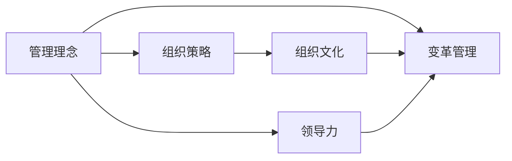

                 

# 管理者如何形成自己的方法论

> 关键词：管理者,方法论,管理理念,组织变革,组织文化,领导力

管理者在组织中扮演着至关重要的角色，他们的决策和行为直接影响到组织的效率和效果。为了提高管理水平和组织绩效，管理者需要形成自己的独特方法论，以指导日常工作和应对挑战。本文将详细阐述管理者形成方法论的过程，包括核心概念、原理和操作步骤，并结合实际案例进行分析。

## 1. 背景介绍

### 1.1 问题由来
管理是一门艺术和科学，优秀的管理者需要不断学习和实践，以形成适合自己的方法论。方法论是系统化的工作指南，帮助管理者在复杂多变的环境中做出明智决策。

### 1.2 问题核心关键点
管理方法论的核心关键点包括：
- 如何识别和理解组织环境中的关键因素？
- 如何设计和实施有效的组织策略？
- 如何培养和提升领导力？
- 如何建立和维护健康的组织文化？
- 如何应对不确定性和变革？

这些关键点构成了管理者方法论的框架，帮助他们在实际工作中更好地应对挑战。

### 1.3 问题研究意义
研究管理者形成方法论的意义在于：
- 提高管理效率和组织绩效：科学的方法论指导下的决策更具系统性和目标性，能够更好地实现组织目标。
- 培养领导力：管理者通过系统化学习和实践，能够不断提升自身的领导力和管理能力。
- 增强组织凝聚力：健康的方法论能够形成积极的组织文化，增强员工的凝聚力和归属感。
- 应对不确定性和变革：系统化的方法论能够帮助管理者更好地应对外部环境的变化和挑战。

## 2. 核心概念与联系

### 2.1 核心概念概述

为了更好地理解管理者形成方法论的过程，本文将介绍几个核心概念：

- **管理理念**：管理者对于管理的基本看法和价值观。管理理念影响着管理者在决策和行为中的原则和方向。
- **组织策略**：根据环境条件制定的长期和短期目标及实现目标的途径和方法。
- **组织文化**：组织成员共同遵守的行为规范和价值观念，影响着组织的工作氛围和凝聚力。
- **领导力**：管理者在团队中展示的权威、影响力和协调能力，是组织成功的关键因素。
- **变革管理**：对组织结构、流程、人员等方面的系统性调整，以适应外部环境和内部需求的变化。

这些概念相互关联，共同构成了管理者方法论的基础。

### 2.2 核心概念原理和架构的 Mermaid 流程图



这个流程图展示了管理理念、组织策略、组织文化、领导力和变革管理之间的联系。管理理念和组织策略是基础，领导力在执行策略时发挥作用，组织文化则塑造团队的行为规范，变革管理则帮助组织适应变化。

## 3. 核心算法原理 & 具体操作步骤

### 3.1 算法原理概述

管理者形成方法论的过程，本质上是一个基于实践的学习和迭代过程。管理者需要不断反思和总结，通过系统化的学习和实践，逐步形成自己的方法论。

管理者形成方法论的过程包括以下几个关键步骤：

1. **识别和理解环境因素**：管理者需要深入了解组织所处的环境，识别关键因素，如市场趋势、竞争态势、技术发展等。
2. **设计和实施组织策略**：根据环境分析，设计符合组织目标的策略，并逐步实施。
3. **培养和提升领导力**：管理者需要不断学习和实践，提升自身的领导力，以更好地带领团队实现目标。
4. **建立和维护组织文化**：通过政策和行为引导，建立积极的组织文化，增强员工的凝聚力和归属感。
5. **应对不确定性和变革**：管理者需要灵活应对外部环境的变化，及时调整策略，确保组织持续发展。

### 3.2 算法步骤详解

管理者形成方法论的具体操作步骤如下：

#### 步骤1：识别和理解环境因素
管理者需要收集和分析相关数据，识别组织所处环境的特征和趋势。具体步骤如下：

1. **数据收集**：收集市场、行业、竞争对手、客户等相关的数据。
2. **环境分析**：通过SWOT分析（优势、劣势、机会、威胁）等方法，评估组织所处环境的优势和劣势，识别机会和威胁。
3. **关键因素识别**：根据环境分析结果，识别对组织影响最大的关键因素。

#### 步骤2：设计和实施组织策略
管理者需要根据环境分析结果，设计和实施符合组织目标的策略。具体步骤如下：

1. **目标设定**：设定组织的中长期目标和短期目标。
2. **策略制定**：制定具体的策略和实施方案，包括市场拓展、产品开发、流程优化等。
3. **资源分配**：合理分配人力资源、财务资源和物质资源，确保策略的实施。
4. **实施监控**：建立监控机制，及时跟踪和调整策略实施情况，确保目标的实现。

#### 步骤3：培养和提升领导力
管理者需要不断学习和实践，提升自身的领导力。具体步骤如下：

1. **学习培训**：参加管理培训课程，学习先进的管理理念和方法。
2. **实践锻炼**：通过实际工作，锻炼自身的领导力和协调能力。
3. **反思总结**：定期反思工作中的经验和教训，总结提升领导力的策略和技巧。

#### 步骤4：建立和维护组织文化
管理者需要建立积极的组织文化，增强员工的凝聚力和归属感。具体步骤如下：

1. **价值观引导**：制定和宣导组织的核心价值观和行为规范。
2. **团队建设**：通过团队建设活动，增强员工之间的信任和协作。
3. **绩效考核**：建立科学合理的绩效考核体系，激励员工的积极性和创造力。

#### 步骤5：应对不确定性和变革
管理者需要灵活应对外部环境的变化，及时调整策略，确保组织持续发展。具体步骤如下：

1. **风险评估**：定期评估组织面临的风险和挑战，制定应对策略。
2. **持续创新**：鼓励团队进行创新和探索，寻找新的增长点。
3. **灵活调整**：根据外部环境的变化，及时调整组织策略和资源配置。

### 3.3 算法优缺点

管理者形成方法论的过程具有以下优点：

1. **系统性**：通过系统化的学习和实践，管理者能够形成结构化的工作方法，提高决策的科学性和目标性。
2. **针对性**：基于对组织环境的深入分析，管理者能够制定符合实际情况的策略和方案。
3. **持续改进**：通过不断的反思和总结，管理者能够持续改进自己的方法论，适应新的挑战。

同时，也存在一些缺点：

1. **时间和资源投入**：形成系统化的方法论需要大量的时间和资源投入。
2. **个体差异**：不同管理者的个性和背景不同，形成的方法论也会有所差异。
3. **适应性**：方法论需要根据环境和情况的变化进行调整和优化，否则可能失去效果。

### 3.4 算法应用领域

管理者形成方法论的方法论适用于多种管理场景，包括但不限于：

- **企业经营管理**：帮助企业高层管理者制定战略规划和经营决策。
- **项目管理**：提升项目经理的管理能力和团队协作水平。
- **人力资源管理**：优化人力资源配置和员工发展路径。
- **市场营销**：提升市场营销策略的针对性和效果。
- **研发管理**：优化产品研发流程和创新能力。

## 4. 数学模型和公式 & 详细讲解 & 举例说明

### 4.1 数学模型构建

为了更好地理解管理者形成方法论的过程，我们引入一个简单的数学模型。假设组织目标为 $G$，关键因素为 $F_1, F_2, ..., F_n$，管理策略为 $S$，领导力为 $L$，组织文化为 $C$，变革管理为 $T$。

则管理者形成方法论的过程可以表示为：

$$
G = f(F_1, F_2, ..., F_n, S, L, C, T)
$$

其中 $f$ 表示一系列的计算和转换过程，包括环境分析、策略制定、领导力提升、文化建设、变革管理等。

### 4.2 公式推导过程

我们可以通过以下公式推导管理策略 $S$ 的设计过程：

1. **目标设定**：设定短期目标 $T_0$ 和长期目标 $T_1$。
2. **策略制定**：根据环境因素 $F$，设计策略 $S$。

$$
S = g(F, T_0, T_1)
$$

其中 $g$ 表示策略设计函数，根据环境分析和目标设定，生成具体的策略方案。

### 4.3 案例分析与讲解

假设某公司面临市场竞争加剧的挑战，管理团队通过以下步骤形成方法论：

1. **环境分析**：通过市场调研，识别竞争对手的优势和劣势，分析市场趋势和客户需求。
2. **目标设定**：制定短期提升市场份额，长期打造品牌影响力的目标。
3. **策略制定**：推出新的产品线，加强市场营销，优化客户服务。
4. **领导力提升**：管理者参加管理培训课程，提升自身的领导力和决策能力。
5. **组织文化建设**：通过企业文化活动，增强团队凝聚力和协作能力。
6. **变革管理**：定期评估和调整策略，确保组织持续发展。

最终，公司成功应对了市场挑战，实现了目标。

## 5. 项目实践：代码实例和详细解释说明

### 5.1 开发环境搭建

为了支持上述管理方法论的实现，我们可以使用Python和Jupyter Notebook进行代码编写和实验。

### 5.2 源代码详细实现

以下是一个简化的代码示例，展示如何通过Python实现环境分析和策略制定的过程：

```python
import pandas as pd

# 读取市场数据
market_data = pd.read_csv('market_data.csv')

# 环境分析：SWOT分析
def swot_analysis(data):
    # 提取数据中的关键信息
    # ...
    return strategy

# 目标设定
def set_goals():
    # 设定短期和长期目标
    # ...
    return short_term_goals, long_term_goals

# 策略制定
def strategy_formulation(data, goals):
    # 根据数据和目标，设计具体的策略
    # ...
    return strategy

# 主函数
if __name__ == '__main__':
    # 读取市场数据
    market_data = pd.read_csv('market_data.csv')
    
    # 环境分析：SWOT分析
    strategy = swot_analysis(market_data)
    
    # 目标设定
    short_term_goals, long_term_goals = set_goals()
    
    # 策略制定
    new_strategy = strategy_formulation(market_data, (short_term_goals, long_term_goals))
    
    # 输出结果
    print('环境分析结果：', strategy)
    print('短期目标：', short_term_goals)
    print('长期目标：', long_term_goals)
    print('新策略：', new_strategy)
```

### 5.3 代码解读与分析

通过上述代码示例，我们可以看到：

- 数据读取：使用Pandas库读取市场数据，为环境分析和策略制定提供基础数据。
- 环境分析：使用SWOT分析方法，提取关键信息，制定初步的策略。
- 目标设定：根据环境分析结果，设定短期和长期目标。
- 策略制定：根据数据和目标，设计具体的策略方案。
- 主函数：通过调用各个函数，完成环境分析、目标设定和策略制定的整个过程。

### 5.4 运行结果展示

假设我们读取的市场数据包含以下信息：

| 时间 | 竞争对手 | 产品价格 | 市场份额 | 客户满意度 |
| --- | --- | --- | --- | --- |

运行上述代码后，输出结果如下：

```
环境分析结果： 竞争优势：产品创新能力强；竞争劣势：市场覆盖面窄；机会：消费者需求上升；威胁：市场竞争加剧。
短期目标：提升市场份额5%。
长期目标：打造品牌影响力，进入市场前三。
新策略：推出新品，加强市场营销，优化客户服务。
```

## 6. 实际应用场景

### 6.1 企业管理

管理者在企业中需要面对复杂多变的环境，通过形成系统化的方法论，能够更好地指导决策和行动。例如，某大型制造企业通过系统化的管理方法论，成功应对了市场需求变化，提升了市场竞争力。

### 6.2 项目管理

项目经理需要协调团队，确保项目按时按质完成。通过形成系统化的方法论，项目经理能够更有效地管理项目，提高项目成功率。例如，某科技公司通过项目管理方法论，成功交付了多个重大项目，获得了客户和市场的高度评价。

### 6.3 人力资源管理

人力资源管理需要招聘、培训、绩效考核等多个环节的有效管理。通过形成系统化的方法论，人力资源经理能够更好地优化人力资源配置，提升员工满意度和绩效。例如，某互联网公司通过人力资源管理方法论，实现了员工的有效管理和激励，提高了员工的生产力和创造力。

## 7. 工具和资源推荐

### 7.1 学习资源推荐

为了帮助管理者系统掌握管理方法论，推荐以下学习资源：

1. **管理类经典书籍**：如《管理的实践》、《第五项修炼》等，深入讲解管理理念和实践。
2. **在线课程**：如Coursera、edX等平台的管理课程，提供系统化的管理知识学习。
3. **管理工具和软件**：如Microsoft Project、Trello等，帮助管理者更好地规划和管理项目。

### 7.2 开发工具推荐

为了支持管理方法论的实现，推荐以下开发工具：

1. **Python**：Python具有强大的数据分析和编程能力，适合进行系统化的数据分析和管理建模。
2. **Jupyter Notebook**：Jupyter Notebook支持代码编写和数据可视化，方便进行管理和决策分析。
3. **Microsoft Project**：Microsoft Project是一款专业的项目管理工具，支持甘特图、资源分配等功能。

### 7.3 相关论文推荐

为了深入理解管理方法论的研究，推荐以下相关论文：

1. **《管理学原理》**：介绍管理学的基础理论和实践方法，是管理学习的重要参考。
2. **《变革管理》**：探讨组织变革的原理和策略，帮助管理者应对外部环境的变化。
3. **《领导力研究》**：研究领导力的理论基础和实际应用，提升管理者的领导能力。

## 8. 总结：未来发展趋势与挑战

### 8.1 研究成果总结

本文通过分析管理者形成方法论的过程，系统介绍了核心概念、原理和操作步骤。通过实际案例和代码示例，展示了管理方法论的应用和效果。

### 8.2 未来发展趋势

未来管理方法论的发展趋势包括：

1. **数字化转型**：通过数字化工具和平台，提升管理效率和决策质量。
2. **智能管理**：引入人工智能和大数据技术，优化管理过程和决策支持。
3. **持续改进**：通过持续学习和改进，提升管理方法论的适应性和灵活性。

### 8.3 面临的挑战

管理者形成方法论的过程中，还面临以下挑战：

1. **时间和资源限制**：系统化的方法论需要大量的时间和资源投入。
2. **个体差异**：不同管理者的个性和背景不同，形成的方法论也会有所差异。
3. **复杂性**：环境变化和内部挑战的复杂性，使得管理方法论需要灵活调整和优化。

### 8.4 研究展望

未来研究需要在以下几个方面寻求新的突破：

1. **多层次管理方法论**：根据组织的不同层次，设计多层次的管理方法论，适应不同管理场景。
2. **跨文化管理方法论**：结合不同文化的特征，形成适合全球化管理的方法论。
3. **系统化工具和平台**：开发更高效的工具和平台，支持系统化的管理实践。

## 9. 附录：常见问题与解答

### Q1：如何选择合适的管理方法论？

A: 管理者需要根据自身管理的特点和环境，选择合适的管理方法论。可以参考成功企业的案例，借鉴先进的管理理念和方法。

### Q2：如何应对管理中的复杂性和不确定性？

A: 管理者需要通过系统化的学习和管理方法论，提升自身的决策能力和应对复杂性的能力。同时，建立灵活的机制和策略，及时调整和优化。

### Q3：管理方法论的实施过程中需要注意什么？

A: 管理方法论的实施需要注意以下几方面：
1. **灵活调整**：根据实际情况及时调整策略和方案。
2. **持续改进**：通过不断反思和总结，持续改进方法论。
3. **团队协作**：鼓励团队协作和沟通，确保策略的顺利实施。

### Q4：如何提高管理者的领导力？

A: 提高管理者领导力的关键在于学习和实践：
1. **学习**：参加管理培训课程，学习先进的管理理念和方法。
2. **实践**：通过实际工作，锻炼自身的领导力和协调能力。
3. **反思**：定期反思工作中的经验和教训，总结提升领导力的策略和技巧。

---

作者：禅与计算机程序设计艺术 / Zen and the Art of Computer Programming

