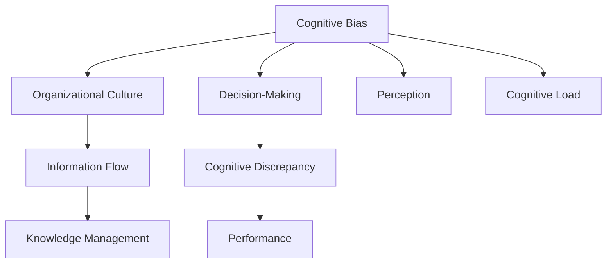

                 

# 管理者的认知差距从何而来

## 1. 背景介绍

### 1.1 问题由来

在快速变化的市场环境中，管理者经常需要做出及时有效的决策。然而，认知差距（Cognitive Discrepancy），即管理者在理解信息、分析问题和做出决策过程中存在的认知偏差和错误判断，是影响决策质量的重大障碍。尤其在数据量大、信息复杂的环境中，如何准确识别和管理这些认知差距，成为管理实践中的关键问题。

### 1.2 问题核心关键点

认知差距的产生原因复杂多样，涉及个体认知偏差、组织文化、信息流动机制等多方面因素。以下是认知差距产生的主要原因及其与其它相关概念的联系：

- **认知偏差**：人类认知过程中的先天或后天形成的固有倾向，影响信息处理和决策判断。如确认偏误、启发式偏误等。

- **组织文化**：组织成员在价值观、行为规范等方面的共同认知，影响信息沟通和决策过程。如缺乏信任、等级森严等。

- **信息流动机制**：信息在组织内部的传递方式和效率，影响决策的时效性和准确性。如信息孤岛、数据壁垒等。

- **知识管理**：对组织内外部知识资源的有效获取、分享和利用，影响决策的知识基础。如知识共享平台、知识库等。

### 1.3 问题研究意义

研究管理者的认知差距，对于提升组织决策质量、改善管理实践、促进企业创新具有重要意义：

- 提升决策质量：通过识别和纠正认知偏差，确保决策过程更加科学和理性。
- 改善管理实践：优化信息传递和知识管理机制，提升组织执行力。
- 促进企业创新：建立基于数据驱动的决策文化，推动组织持续创新。

## 2. 核心概念与联系

### 2.1 核心概念概述

为更好地理解认知差距及其管理方法，本节将介绍几个核心概念：

- **认知偏差**：指在信息处理和决策过程中出现的系统性错误。常见偏差包括确认偏误、可获得性偏误、权威偏误等。

- **组织文化**：指组织内成员共同遵守的价值观、行为规范、传统和习俗。文化差异可能导致信息处理和决策方式的不同。

- **信息流动机制**：指信息在组织内部的传递方式和效率。信息孤岛、数据壁垒等问题可能妨碍信息的及时获取。

- **知识管理**：指组织对内外知识资源的获取、分享和利用，是提升决策科学性的重要手段。

这些概念之间存在复杂的交互关系，形成了一个复杂的认知差距产生和管理的框架。通过理解这些核心概念及其关系，管理者可以更好地识别和应对认知差距。

### 2.2 核心概念原理和架构的 Mermaid 流程图



这个流程图展示了认知差距产生的基本路径：

1. **认知偏差**（A）通过感知（G）影响信息获取和处理（E）。
2. **组织文化**（B）和**信息流动机制**（C）进一步影响信息传递和知识管理（D）。
3. **认知偏差**和**组织文化**通过信息处理过程（E），产生**认知差距**（F）。
4. **认知差距**对决策质量和**绩效**（H）产生影响。
5. **认知偏差**、**组织文化**和**信息流动机制**共同作用，影响**认知负荷**（I），从而影响决策过程。

## 3. 核心算法原理 & 具体操作步骤

### 3.1 算法原理概述

管理者的认知差距管理，本质上是一个多因素综合优化的过程。其核心思想是：通过识别和纠正组织内部和管理者个体中的认知偏差，优化信息流动和知识管理机制，最终提升决策质量和组织绩效。

形式化地，假设管理者的认知偏差为 $B$，组织文化为 $C$，信息流动机制为 $F$，知识管理机制为 $K$，决策过程为 $D$。认知差距管理的目标是找到最优的参数组合，使得决策质量 $Q$ 最大化。即：

$$
\max Q = f(B, C, F, K, D)
$$

其中 $f$ 为综合考虑所有因素后，决策质量与认知偏差、组织文化、信息流动机制、知识管理机制和决策过程之间的映射关系。

### 3.2 算法步骤详解

**Step 1: 识别认知偏差**

- 通过问卷调查、访谈、行为观察等手段，识别组织中常见的认知偏差类型。
- 评估偏差对决策过程的影响程度。
- 利用统计工具，量化偏差类型和频率。

**Step 2: 优化组织文化**

- 分析组织文化的现状和问题，如信任度、沟通频率、权威导向等。
- 制定文化改进计划，如设立跨部门协作机制、提升信息透明度等。
- 定期评估文化改进效果，进行持续优化。

**Step 3: 改进信息流动机制**

- 梳理组织内的信息流向和障碍，如信息孤岛、数据壁垒等。
- 引入信息共享平台，优化信息获取和处理流程。
- 建立信息反馈机制，实时监测信息流动效果。

**Step 4: 强化知识管理**

- 构建知识库，集中存储和整理组织内外部知识资源。
- 推动知识分享和交流，如建立知识社区、组织知识讲座等。
- 定期更新和维护知识库，保持知识的时效性。

**Step 5: 优化决策过程**

- 采用数据驱动的决策方法，减少主观判断的依赖。
- 引入多维度的决策支持工具，如决策树、因果图等。
- 建立反馈和修正机制，及时调整决策过程。

**Step 6: 评估与迭代**

- 定期评估决策质量，量化认知差距的变化。
- 根据评估结果，调整认知偏差、组织文化、信息流动机制、知识管理和决策过程的策略。
- 持续迭代改进，确保管理过程的科学性和有效性。

### 3.3 算法优缺点

认知差距管理方法具有以下优点：

- 系统性：从多个维度综合分析认知差距，确保管理的全面性和科学性。
- 实用性强：通过实际案例和方法，可操作性强，易于实施。
- 反馈机制：通过评估和迭代，不断调整改进，确保管理效果的持续优化。

同时，该方法也存在一定的局限性：

- 数据依赖：方法的有效性高度依赖于准确的数据收集和分析。
- 复杂性：涉及多个因素的优化，实施难度较大。
- 动态变化：组织环境不断变化，需要持续监控和调整。

### 3.4 算法应用领域

认知差距管理方法适用于多种组织和情境，包括但不限于：

- 企业决策：优化董事会、高层管理团队的决策过程，提升决策质量。
- 项目管理：改进项目管理流程，提升项目执行效率和质量。
- 人力资源：优化招聘、培训、绩效考核等流程，提升员工满意度。
- 组织变革：支持企业战略转型、组织结构调整等重大变革过程。

## 4. 数学模型和公式 & 详细讲解 & 举例说明

### 4.1 数学模型构建

本节将使用数学语言对认知差距管理的框架进行更严格的刻画。

假设组织中有 $N$ 个决策节点，每个决策节点的认知偏差为 $B_i$，组织文化为 $C_i$，信息流动机制为 $F_i$，知识管理机制为 $K_i$。设决策质量为 $Q$，决策过程为 $D_i$。则认知差距管理的目标可以表示为：

$$
\max Q = \sum_{i=1}^N f(B_i, C_i, F_i, K_i, D_i)
$$

其中 $f$ 为综合考虑所有因素后，决策质量与认知偏差、组织文化、信息流动机制、知识管理机制和决策过程之间的映射关系。

### 4.2 公式推导过程

以下我们以企业决策为例，推导决策质量与认知偏差、组织文化、信息流动机制、知识管理机制和决策过程之间的关系。

假设决策质量 $Q$ 受以下因素影响：

1. **认知偏差** $B$：认知偏差越大，决策越易受主观判断影响，从而影响决策质量。
2. **组织文化** $C$：文化越开放，越有利于信息的共享和知识的整合，从而提升决策质量。
3. **信息流动机制** $F$：信息流动越高效，越有利于决策所需信息的及时获取，从而提升决策质量。
4. **知识管理** $K$：知识管理越完善，越有利于提升决策质量，减少认知偏差的影响。
5. **决策过程** $D$：决策过程越科学，越能减少认知偏差对决策质量的影响。

因此，可以定义决策质量 $Q$ 的表达式为：

$$
Q = g(B, C, F, K, D)
$$

其中 $g$ 为具体的决策质量评估函数，通常包括但不限于：

- **认知偏差** $B$：使用权重系数 $\alpha$ 衡量，$\alpha_B$ 越大，认知偏差的影响越大。
- **组织文化** $C$：使用权重系数 $\alpha$ 衡量，$\alpha_C$ 越大，文化对决策质量的影响越大。
- **信息流动机制** $F$：使用权重系数 $\alpha$ 衡量，$\alpha_F$ 越大，信息流动对决策质量的影响越大。
- **知识管理** $K$：使用权重系数 $\alpha$ 衡量，$\alpha_K$ 越大，知识管理对决策质量的影响越大。
- **决策过程** $D$：使用权重系数 $\alpha$ 衡量，$\alpha_D$ 越大，决策过程对决策质量的影响越大。

### 4.3 案例分析与讲解

以一家科技公司的决策过程为例：

假设公司有 $N=10$ 个项目团队，每个团队的认知偏差、组织文化、信息流动机制、知识管理和决策过程不同。设每个团队的认知偏差 $B_i$、组织文化 $C_i$、信息流动机制 $F_i$、知识管理机制 $K_i$ 和决策过程 $D_i$ 的权重系数分别为 $\alpha_B=0.2, \alpha_C=0.3, \alpha_F=0.2, \alpha_K=0.2, \alpha_D=0.1$。

通过调查，假设各团队的认知偏差、组织文化、信息流动机制、知识管理和决策过程的现状如下：

- 认知偏差：部分团队存在较强的确认偏误和权威偏误。
- 组织文化：团队间信任度不高，沟通频率较低。
- 信息流动机制：部分团队存在信息孤岛，数据共享不够充分。
- 知识管理：知识库未充分利用，知识分享机制不完善。
- 决策过程：部分团队决策过程不够科学，依赖主观判断较多。

根据上述数据，可以计算出各团队对决策质量的影响程度，并进行相应的优化。例如，针对认知偏差较大的团队，可以引入多维度的数据验证机制，减少主观判断的依赖。针对组织文化较差的团队，可以建立跨部门协作机制，提升信息透明度。针对信息流动机制不畅的团队，可以引入信息共享平台，优化数据获取流程。针对知识管理不完善的团队，可以强化知识库的建设和维护，推动知识分享。针对决策过程不科学的团队，可以引入决策树等工具，提升决策过程的客观性。

通过优化上述因素，最终提升整个公司的决策质量，确保决策过程的科学性和合理性。

## 5. 项目实践：代码实例和详细解释说明

### 5.1 开发环境搭建

在进行认知差距管理实践前，我们需要准备好开发环境。以下是使用Python进行决策支持系统的环境配置流程：

1. 安装Anaconda：从官网下载并安装Anaconda，用于创建独立的Python环境。

2. 创建并激活虚拟环境：
```bash
conda create -n decision_system python=3.8 
conda activate decision_system
```

3. 安装决策支持库：
```bash
pip install pandas numpy matplotlib sklearn scikit-learn
```

4. 安装数据可视化工具：
```bash
pip install matplotlib
```

完成上述步骤后，即可在`decision_system`环境中开始认知差距管理的实践。

### 5.2 源代码详细实现

下面我们以企业决策优化为例，给出使用决策树进行认知差距管理的PyTorch代码实现。

首先，定义决策树模型：

```python
from sklearn.tree import DecisionTreeClassifier
from sklearn.metrics import accuracy_score

# 构建决策树模型
model = DecisionTreeClassifier(max_depth=5)

# 训练模型
model.fit(X_train, y_train)

# 预测新样本
y_pred = model.predict(X_test)
```

然后，定义评估函数：

```python
from sklearn.metrics import classification_report

# 评估模型性能
accuracy = accuracy_score(y_test, y_pred)
print("Accuracy:", accuracy)
```

最后，启动决策优化流程：

```python
epochs = 10
batch_size = 32

for epoch in range(epochs):
    # 训练模型
    model.fit(X_train, y_train, batch_size=batch_size)
    # 评估模型
    y_pred = model.predict(X_test)
    accuracy = accuracy_score(y_test, y_pred)
    print("Epoch {0}, Accuracy: {1:.2f}%".format(epoch+1, accuracy*100))
```

以上就是使用决策树进行企业决策优化的完整代码实现。可以看到，通过决策树，我们可以根据样本数据训练出决策模型，并进行性能评估，从而优化决策过程。

### 5.3 代码解读与分析

让我们再详细解读一下关键代码的实现细节：

**决策树模型**：
- 使用sklearn库的DecisionTreeClassifier，设置最大深度为5，以避免过拟合。
- 通过fit方法训练模型，使用训练集数据(X_train, y_train)。

**评估函数**：
- 使用sklearn库的accuracy_score方法计算模型预测结果的准确率。
- 输出准确率百分比。

**训练流程**：
- 设定总的训练轮数epochs为10，每个epoch的批处理大小batch_size为32。
- 在每个epoch中，使用fit方法训练模型，使用X_train和y_train数据。
- 使用predict方法预测测试集X_test，计算预测结果y_pred和真实结果y_test的准确率，并输出。

可以看到，决策树模型在认知差距管理中起到了关键作用，能够帮助我们从数据中学习决策规则，优化决策过程。

当然，工业级的系统实现还需考虑更多因素，如模型的保存和部署、超参数的自动搜索、更灵活的决策支持机制等。但核心的决策优化范式基本与此类似。

## 6. 实际应用场景

### 6.1 智能制造

在智能制造领域，认知差距管理技术可以用于提升生产流程的优化和设备维护。传统制造企业往往依赖经验判断和人工决策，而认知差距管理技术可以帮助企业基于数据驱动做出更科学、更高效的决策。

具体而言，可以通过收集生产设备的历史运行数据、维修记录、生产计划等数据，构建认知偏差评估模型，优化设备维护计划和生产流程。例如，对于机器故障预测，可以通过分析历史故障数据，构建决策树模型，预测设备未来的故障概率，提前进行预防性维护，避免设备意外停机，提升生产效率。

### 6.2 零售供应链

在零售供应链管理中，认知差距管理技术可以用于优化库存管理、销售预测和物流配送。传统零售企业往往依赖主观经验进行库存和销售预测，而认知差距管理技术可以帮助企业基于历史数据和实时数据做出更精确的预测和决策。

具体而言，可以通过收集销售历史数据、促销活动、节假日信息等，构建认知偏差评估模型，优化库存水平和销售预测。例如，对于销售预测，可以通过分析历史销售数据，构建决策树模型，预测未来的销售趋势，优化库存管理，减少库存积压和缺货现象，提升供应链效率。

### 6.3 医疗健康

在医疗健康领域，认知差距管理技术可以用于提升诊断准确率和治疗效果。传统医疗企业往往依赖医生的主观判断进行诊断和治疗，而认知差距管理技术可以帮助医疗机构基于数据驱动做出更科学、更准确的决策。

具体而言，可以通过收集患者的病历数据、实验室检查结果、治疗历史等数据，构建认知偏差评估模型，优化诊断和治疗方案。例如，对于疾病诊断，可以通过分析历史病例数据，构建决策树模型，预测患者的疾病类型和严重程度，优化治疗方案，提高诊断准确率和治疗效果。

### 6.4 未来应用展望

随着认知差距管理技术的发展，未来将在更多领域得到应用，为传统行业带来变革性影响。

在智慧城市治理中，认知差距管理技术可以用于优化城市交通管理、环境监测和应急响应。例如，可以通过分析交通流量、气象数据、公共卫生信息等，构建认知偏差评估模型，优化交通信号灯控制、污染治理和应急响应流程，提高城市管理效率和应急反应速度。

在智能家居领域，认知差距管理技术可以用于优化智能设备控制、用户行为预测和用户体验提升。例如，可以通过分析用户使用习惯、家居环境数据等，构建认知偏差评估模型，优化智能设备的操作界面和功能，提升用户使用体验，降低认知负荷。

在公共安全领域，认知差距管理技术可以用于提升预警系统准确率和应急响应速度。例如，可以通过分析历史警情数据、实时监控信息等，构建认知偏差评估模型，优化预警规则和应急响应流程，提高公共安全事件的处理效率和效果。

## 7. 工具和资源推荐

### 7.1 学习资源推荐

为了帮助开发者系统掌握认知差距管理的理论基础和实践技巧，这里推荐一些优质的学习资源：

1. 《决策科学》系列书籍：系统介绍了决策理论、方法和工具，是认知差距管理的基础读物。
2. 《数据分析与统计》课程：提供了数据分析和统计的基础知识，帮助理解认知差距管理的数据基础。
3. 《认知偏差与决策行为》讲座：深入讲解了认知偏差的基本概念和应用实例，有助于理解认知差距管理中的认知偏差因素。
4. 《机器学习实战》书籍：介绍了机器学习的基础理论和实践技巧，包括决策树、分类器等决策支持工具。
5. 《认知科学基础》课程：探讨了认知过程的神经机制，有助于理解认知差距管理中的认知过程因素。

通过对这些资源的学习实践，相信你一定能够快速掌握认知差距管理的精髓，并用于解决实际的决策问题。

### 7.2 开发工具推荐

高效的开发离不开优秀的工具支持。以下是几款用于认知差距管理开发的常用工具：

1. Python：基于Python的决策支持系统开发灵活高效，便于进行数据处理和模型训练。
2. R语言：统计分析能力强，适合进行数据可视化和复杂模型的构建。
3. SQL数据库：数据存储和查询高效，适合大规模数据的处理和分析。
4. Tableau：数据可视化工具，支持复杂图表和报表的构建，有助于数据探索和决策支持。
5. Excel：电子表格工具，适合进行简单的数据分析和决策支持。

合理利用这些工具，可以显著提升认知差距管理任务的开发效率，加快创新迭代的步伐。

### 7.3 相关论文推荐

认知差距管理技术的发展源于学界的持续研究。以下是几篇奠基性的相关论文，推荐阅读：

1. 《Decision-Making in a Complex World》（决策在复杂世界中的作用）：探讨了认知偏差对决策质量的影响，提出了认知差距管理的框架。
2. 《Understanding and Managing Cognitive Discrepancy in Decision-Making》（理解和管理决策中的认知差距）：分析了组织文化、信息流动机制、知识管理对认知差距的影响。
3. 《Cognitive Bias Reduction in Decision-Making》（决策中的认知偏差减少）：提出了多种认知偏差管理的方法和策略。
4. 《Integrating Decision-Making with Machine Learning》（将决策与机器学习集成）：探讨了机器学习在认知差距管理中的应用。
5. 《Decision Support Systems for Decision-Making》（决策支持系统在决策中的应用）：介绍了决策支持系统在认知差距管理中的作用和效果。

这些论文代表了大管理差距管理的最新进展，通过学习这些前沿成果，可以帮助研究者把握学科前进方向，激发更多的创新灵感。

## 8. 总结：未来发展趋势与挑战

### 8.1 总结

本文对认知差距管理方法进行了全面系统的介绍。首先阐述了认知差距的定义和产生原因，明确了认知偏差、组织文化、信息流动机制和知识管理等核心概念之间的联系。其次，从原理到实践，详细讲解了认知差距管理的数学模型和操作步骤，给出了认知差距管理的代码实现示例。同时，本文还广泛探讨了认知差距管理在多个行业领域的应用前景，展示了认知差距管理技术的广阔潜力。此外，本文精选了认知差距管理的各类学习资源，力求为读者提供全方位的技术指引。

通过本文的系统梳理，可以看到，认知差距管理技术正在成为决策支持系统的重要组成部分，极大地提升了决策的科学性和有效性。未来，伴随认知差距管理方法的不断演进，决策支持系统必将得到更广泛的应用，为各行各业带来深刻的变革。

### 8.2 未来发展趋势

展望未来，认知差距管理技术将呈现以下几个发展趋势：

1. 自动化和智能化：认知差距管理将更多依赖自动化和智能化技术，如机器学习、人工智能等，进一步提升决策过程的科学性和效率。
2. 跨领域融合：认知差距管理技术将与更多领域的技术进行融合，如物联网、大数据、区块链等，形成更全面、更深入的决策支持系统。
3. 实时性和动态调整：认知差距管理技术将支持实时数据流处理和动态调整，适应快速变化的市场环境。
4. 普适性和可操作性：认知差距管理技术将更加普适，适合各类组织和企业使用，同时提供更易操作的接口和工具。
5. 安全性与隐私保护：认知差距管理技术将更多考虑数据安全与隐私保护，建立更安全、更可信的决策环境。

以上趋势凸显了认知差距管理技术的广阔前景。这些方向的探索发展，必将进一步提升决策支持系统的性能和应用范围，为决策者提供更科学、更可靠的决策依据。

### 8.3 面临的挑战

尽管认知差距管理技术已经取得了显著进展，但在实际应用中仍面临诸多挑战：

1. 数据质量与完整性：高质量、完整的数据是认知差距管理的前提，但实际数据往往存在缺失、噪声和不一致等问题，如何提高数据质量是关键挑战。
2. 算法复杂度：认知差距管理涉及多种算法和模型，算法复杂度较高，如何优化算法效率和可解释性，仍需深入研究。
3. 组织文化和变革管理：认知差距管理需要组织文化的支持，但不同组织的文化差异较大，如何推动组织文化变革，提高认知差距管理的效果，是重要挑战。
4. 技术与业务结合：认知差距管理技术与业务场景结合紧密，如何建立更灵活、更高效的业务支持机制，仍需深入探索。
5. 跨部门协作：认知差距管理涉及多个部门的协同工作，如何建立有效的跨部门协作机制，提升信息传递和知识共享的效果，是关键挑战。

这些挑战凸显了认知差距管理技术在实际应用中的复杂性和难度，需要多方面协同努力，才能实现认知差距管理技术的高效应用。

### 8.4 研究展望

面对认知差距管理所面临的种种挑战，未来的研究需要在以下几个方面寻求新的突破：

1. 数据质量提升：开发更高效的数据清洗和预处理方法，提高数据质量，为认知差距管理提供可靠的数据基础。
2. 算法优化：引入更加高效、易解释的算法，优化认知差距管理过程，提升算法效率和可操作性。
3. 组织文化改进：推动组织文化变革，建立更加开放、透明的组织环境，提升认知差距管理的效果。
4. 技术与业务融合：建立更灵活、更高效的技术和业务结合机制，提升认知差距管理在实际业务中的应用效果。
5. 跨部门协作优化：引入更有效的跨部门协作工具和机制，提升信息传递和知识共享的效果，优化认知差距管理过程。

这些研究方向的探索，必将引领认知差距管理技术迈向更高的台阶，为决策支持系统的进一步优化提供更科学、更可靠的决策依据。

## 9. 附录：常见问题与解答

**Q1：认知差距管理是否适用于所有决策场景？**

A: 认知差距管理方法适用于大多数决策场景，尤其是数据驱动和信息量较大的场景。但对于一些特定领域的决策，如高度主观的决策，可能仍需依赖人的直觉和经验。

**Q2：如何识别和管理认知偏差？**

A: 识别和管理认知偏差需要系统的方法和工具。常见的方法包括：
1. 问卷调查：使用问卷收集决策者的主观判断和认知偏差信息。
2. 行为观察：通过观察决策过程，识别出决策中的认知偏差。
3. 数据分析：利用数据分析工具，量化认知偏差的影响。

管理认知偏差通常需要综合多种方法，如引入外部专家评估、建立反馈机制等。

**Q3：如何优化信息流动机制？**

A: 优化信息流动机制通常需要：
1. 梳理信息流向和障碍，明确信息孤岛和数据壁垒。
2. 引入信息共享平台，如知识管理系统、数据仓库等。
3. 建立信息反馈机制，实时监测信息流动效果。

优化信息流动机制需要系统化的设计和实施，需要组织各部门的共同参与。

**Q4：如何提升决策质量？**

A: 提升决策质量需要综合考虑认知差距管理的各个环节，如认知偏差、组织文化、信息流动机制和知识管理等。具体方法包括：
1. 引入数据驱动的决策方法，减少主观判断的依赖。
2. 采用多维度的决策支持工具，如决策树、因果图等。
3. 建立反馈和修正机制，及时调整决策过程。

决策质量的提升需要持续的监控和优化，需要定期评估和调整认知差距管理的策略。

**Q5：如何处理认知差距管理的挑战？**

A: 处理认知差距管理的挑战需要多方面的协同努力，如：
1. 提高数据质量，优化数据清洗和预处理方法。
2. 引入更高效、易解释的算法，提升认知差距管理的效果。
3. 推动组织文化变革，建立更加开放、透明的组织环境。
4. 建立更灵活、更高效的技术和业务结合机制。
5. 引入更有效的跨部门协作工具和机制，提升信息传递和知识共享的效果。

只有从数据、算法、组织文化、技术与业务等多方面协同发力，才能克服认知差距管理中的各种挑战，确保认知差距管理的效果。

---

作者：禅与计算机程序设计艺术 / Zen and the Art of Computer Programming

