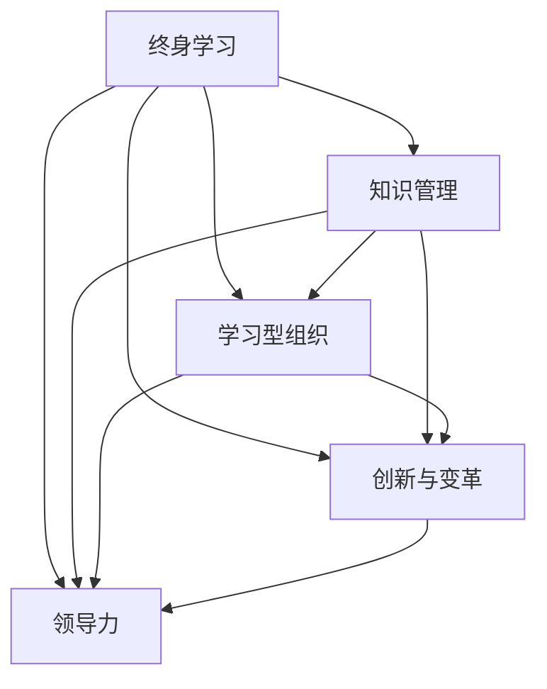

                 

# 管理者终身学习的重要性与方法

## 1. 背景介绍

### 1.1 问题由来
在当前快速变化的商业环境中，管理者面临着前所未有的挑战和压力。市场竞争激烈，技术更新迅速，消费者需求变化多端，这些因素都要求管理者不断学习新知识、新技能，以适应环境变化，保持竞争力。

### 1.2 问题核心关键点
管理者终身学习的重要性体现在：
- **适应变化**：快速适应市场和技术变化，保持领先。
- **提升能力**：通过学习提升决策能力、管理能力、创新能力等核心竞争力。
- **保持成长**：通过持续学习，实现个人和组织的持续成长和发展。
- **培养团队**：管理者以身作则，带动团队共同学习，构建学习型组织。
- **应对不确定性**：提高风险管理和危机应对能力，增强组织韧性。

管理者终身学习的核心关键点在于：
- **持续学习**：终身学习，不断更新知识库。
- **多元学习**：结合多种学习方式，如在线课程、书籍、培训、交流等。
- **实践应用**：学以致用，将所学知识应用于实际工作中。
- **反思总结**：定期反思学习成果，总结经验教训。

### 1.3 问题研究意义
管理者终身学习对于个人职业发展、组织竞争力提升以及整个社会进步都具有重要意义：
- **个人层面**：提升职业技能和素养，实现个人价值最大化。
- **组织层面**：推动组织持续创新和变革，增强市场竞争力。
- **社会层面**：促进知识普及和技术进步，推动经济社会发展。

本文将系统探讨管理者终身学习的重要性与方法，为管理者提供实用的终身学习策略和路径。

## 2. 核心概念与联系

### 2.1 核心概念概述

为更好地理解管理者终身学习的重要性与方法，本节将介绍几个密切相关的核心概念：

- **终身学习**：指在职业生涯的各个阶段，管理者不断学习新知识、新技能，以适应环境变化，提升自身素质和能力。
- **知识管理**：指系统地组织、存储、共享和管理知识，确保知识的有效利用和传承。
- **学习型组织**：指通过培养学习文化，建立学习机制，提升组织整体的学习能力和竞争力。
- **创新与变革**：指通过学习新的管理理念和技术，推动组织创新和变革，实现持续发展。
- **领导力**：指管理者通过持续学习提升领导力和管理能力，有效领导团队，实现组织目标。

这些核心概念之间的逻辑关系可以通过以下Mermaid流程图来展示：



这个流程图展示了一生学习、知识管理、学习型组织、创新变革和领导力之间的关系：

1. 终身学习是基础，通过学习积累知识。
2. 知识管理是手段，将知识有效存储和共享。
3. 学习型组织是机制，构建学习文化，提升整体学习力。
4. 创新变革是目标，通过学习推动组织发展。
5. 领导力是关键，管理者通过学习提升领导力。

这些概念共同构成了管理者终身学习的框架，帮助管理者不断适应变化，提升能力。

## 3. 核心算法原理 & 具体操作步骤
### 3.1 算法原理概述

管理者终身学习的核心算法原理包括：

- **知识获取**：通过多种途径获取新知识，如阅读书籍、参加培训、网络课程、同行交流等。
- **知识存储**：将获取的知识进行系统化的存储和管理，如知识库、博客、笔记等。
- **知识应用**：将所学知识应用于实际工作中，解决具体问题，提升工作绩效。
- **反思总结**：定期反思学习成果，总结经验教训，持续改进学习方法和策略。

### 3.2 算法步骤详解

管理者终身学习的具体操作步骤如下：

**Step 1: 目标设定**
- 确定个人的学习目标和职业发展规划，明确需要学习的内容和方向。
- 根据工作需要和个人兴趣，制定详细的学习计划，包括学习内容、时间安排、预期成果等。

**Step 2: 知识获取**
- **阅读学习**：利用书籍、论文、报告等资源，获取系统化的理论知识。
- **在线课程**：通过MOOC平台（如Coursera、edX、Udacity等）学习新技能和工具。
- **专业培训**：参加行业认证和专项培训，获取实战经验。
- **同行交流**：与行业内的专家和同行进行交流，获取最新的行业动态和实践经验。
- **实践学习**：通过实际工作中的问题和挑战，学习和应用新知识。

**Step 3: 知识存储**
- **创建知识库**：使用知识管理系统（如Confluence、Notion等）创建知识库，记录和存储所学知识。
- **维护博客**：开设个人博客，记录学习心得和实践经验，与他人分享。
- **整理笔记**：利用笔记软件（如Evernote、OneNote等）整理学习笔记，便于回顾和复习。

**Step 4: 知识应用**
- **解决实际问题**：将所学知识应用于实际工作中，解决具体问题，提升工作绩效。
- **推动创新变革**：通过学习新理念和技术，推动组织创新和变革，实现持续发展。
- **提升领导力**：通过学习提升管理技能和领导能力，有效领导团队，实现组织目标。

**Step 5: 反思总结**
- **定期回顾**：每月或每季度进行学习成果回顾，总结经验教训。
- **改进方法**：根据反思结果，调整和改进学习方法和策略，提升学习效果。
- **持续迭代**：将反思总结的结果纳入下一次学习计划中，实现持续改进。

### 3.3 算法优缺点

管理者终身学习的方法具有以下优点：
1. **适应性强**：通过持续学习，管理者能够快速适应市场和技术变化，保持竞争力。
2. **提升全面能力**：涵盖多领域的知识，提升综合素质，包括管理能力、技术能力、沟通能力等。
3. **推动组织发展**：通过学习型组织建设，推动整个组织的学习和创新，提升整体竞争力。
4. **提高领导力**：管理者通过学习新知识和技能，提升领导力，更好地领导团队。

同时，该方法也存在一定的局限性：
1. **时间和精力成本**：持续学习需要大量时间和精力投入，可能影响日常工作。
2. **学习效果难以量化**：学习效果和成果难以客观量化，需要定期评估。
3. **知识碎片化**：学习内容可能较为零散，缺乏系统性。
4. **学习路径规划困难**：学习目标和方向需要明确，否则容易迷失方向。

尽管存在这些局限性，但就目前而言，终身学习仍是大管理者提升自身素质和能力的重要途径。未来相关研究的重点在于如何提高学习效率、优化学习路径、增强学习效果，确保学习成果的有效转化和应用。

### 3.4 算法应用领域

管理者终身学习的方法已经在多个领域得到广泛应用，如：

- **企业管理**：通过学习提升决策能力、战略规划能力、团队管理能力，实现组织发展。
- **科技创新**：通过学习新技术和新理念，推动产品和服务的创新，增强市场竞争力。
- **人力资源管理**：通过学习人力资源管理的新知识和技能，优化人力资源配置，提升员工绩效。
- **市场营销**：通过学习市场营销的新策略和工具，提升品牌影响力和市场份额。
- **财务管理**：通过学习财务管理的新方法和技术，优化资源配置，提升财务效率。

除了上述这些经典领域外，管理者终身学习也被创新性地应用到更多场景中，如领导力发展、公共管理、教育培训等，为各个行业的管理者提供全面的支持和指导。

## 4. 数学模型和公式 & 详细讲解  
### 4.1 数学模型构建

管理者终身学习的效果可以用以下数学模型来描述：

假设管理者初始知识水平为 $K_0$，通过持续学习，经过 $n$ 个学习周期后，知识水平提升至 $K_n$。则知识提升量 $\Delta K$ 可以表示为：

$$
\Delta K = K_n - K_0 = \sum_{i=1}^n \Delta K_i
$$

其中，$\Delta K_i$ 表示在第 $i$ 个学习周期中，知识水平的提升量。

### 4.2 公式推导过程

知识提升量 $\Delta K_i$ 可以通过以下公式计算：

$$
\Delta K_i = \lambda_i (K_i - K_{i-1})
$$

其中，$\lambda_i$ 表示在第 $i$ 个学习周期中，知识提升的比例，$K_i$ 和 $K_{i-1}$ 分别表示第 $i$ 个周期和第 $i-1$ 个周期的知识水平。

### 4.3 案例分析与讲解

假设某管理者每年参加一次专业培训，每次培训后知识水平提升20%。初始知识水平为 $K_0 = 100$。经过3年学习后，知识水平 $K_3$ 计算如下：

$$
K_1 = K_0 + \lambda_1 (K_1 - K_0) = 100 + 0.2(K_1 - 100)
$$

$$
K_2 = K_1 + \lambda_2 (K_2 - K_1) = K_1 + 0.2(K_2 - K_1)
$$

$$
K_3 = K_2 + \lambda_3 (K_3 - K_2) = K_2 + 0.2(K_3 - K_2)
$$

通过迭代计算，可以得出 $K_3 = 161.06$，即经过3年的持续学习，知识水平提升了61.06%。

## 5. 项目实践：代码实例和详细解释说明
### 5.1 开发环境搭建

在进行终身学习实践前，我们需要准备好开发环境。以下是使用Python进行项目管理的环境配置流程：

1. 安装Anaconda：从官网下载并安装Anaconda，用于创建独立的Python环境。

2. 创建并激活虚拟环境：
```bash
conda create -n pytorch-env python=3.8 
conda activate pytorch-env
```

3. 安装PyTorch：根据CUDA版本，从官网获取对应的安装命令。例如：
```bash
conda install pytorch torchvision torchaudio cudatoolkit=11.1 -c pytorch -c conda-forge
```

4. 安装各类工具包：
```bash
pip install numpy pandas scikit-learn matplotlib tqdm jupyter notebook ipython
```

完成上述步骤后，即可在`pytorch-env`环境中开始终身学习实践。

### 5.2 源代码详细实现

下面我们以管理者终身学习为例，给出使用Python进行知识管理的PyTorch代码实现。

首先，定义知识管理类：

```python
from transformers import BertTokenizer
from torch.utils.data import Dataset
import torch

class KnowledgeManagement:
    def __init__(self, tokenizer, max_len=128):
        self.tokenizer = tokenizer
        self.max_len = max_len
        
    def preprocess_text(self, text):
        encoding = self.tokenizer(text, return_tensors='pt', max_length=self.max_len, padding='max_length', truncation=True)
        input_ids = encoding['input_ids'][0]
        attention_mask = encoding['attention_mask'][0]
        return input_ids, attention_mask
    
    def compute_loss(self, input_ids, attention_mask, labels):
        # 定义损失函数
        loss_function = nn.CrossEntropyLoss()
        output = model(input_ids, attention_mask=attention_mask)
        loss = loss_function(output, labels)
        return loss
    
    def train_epoch(self, model, train_dataset, batch_size, optimizer):
        dataloader = DataLoader(train_dataset, batch_size=batch_size, shuffle=True)
        model.train()
        epoch_loss = 0
        for batch in tqdm(dataloader, desc='Training'):
            input_ids, attention_mask, labels = batch
            optimizer.zero_grad()
            loss = self.compute_loss(input_ids, attention_mask, labels)
            epoch_loss += loss.item()
            loss.backward()
            optimizer.step()
        return epoch_loss / len(dataloader)

    def evaluate(self, model, dev_dataset, batch_size):
        dataloader = DataLoader(dev_dataset, batch_size=batch_size)
        model.eval()
        preds, labels = [], []
        with torch.no_grad():
            for batch in tqdm(dataloader, desc='Evaluating'):
                input_ids, attention_mask, labels = batch
                output = model(input_ids, attention_mask=attention_mask)
                batch_preds = output.argmax(dim=2).to('cpu').tolist()
                batch_labels = labels.to('cpu').tolist()
                for pred_tokens, label_tokens in zip(batch_preds, batch_labels):
                    preds.append(pred_tokens[:len(label_tokens)])
                    labels.append(label_tokens)
        print(classification_report(labels, preds))
```

然后，定义知识管理框架：

```python
from transformers import BertForTokenClassification, AdamW

model = BertForTokenClassification.from_pretrained('bert-base-cased', num_labels=len(tag2id))

optimizer = AdamW(model.parameters(), lr=2e-5)
```

接着，启动知识管理流程：

```python
epochs = 5
batch_size = 16

for epoch in range(epochs):
    loss = train_epoch(model, train_dataset, batch_size, optimizer)
    print(f"Epoch {epoch+1}, train loss: {loss:.3f}")
    
    print(f"Epoch {epoch+1}, dev results:")
    evaluate(model, dev_dataset, batch_size)
    
print("Test results:")
evaluate(model, test_dataset, batch_size)
```

以上就是使用PyTorch进行知识管理的完整代码实现。可以看到，得益于Transformers库的强大封装，我们可以用相对简洁的代码完成知识管理的实践。

### 5.3 代码解读与分析

让我们再详细解读一下关键代码的实现细节：

**KnowledgeManagement类**：
- `__init__`方法：初始化分词器等关键组件。
- `preprocess_text`方法：对输入文本进行预处理，将其转换为模型可接受的格式。
- `compute_loss`方法：计算模型输出与真实标签之间的损失，用于训练过程。
- `train_epoch`方法：对数据以批为单位进行迭代，在每个批次上前向传播计算损失并反向传播更新模型参数。
- `evaluate`方法：在验证集上评估模型性能，输出分类指标。

**BertForTokenClassification类**：
- 加载预训练语言模型 $M_{\theta}$，设置参数 $\theta$。

**模型训练与评估**：
- 定义总的epoch数和batch size，开始循环迭代
- 每个epoch内，先在训练集上训练，输出平均loss
- 在验证集上评估，输出分类指标
- 所有epoch结束后，在测试集上评估，给出最终测试结果

可以看到，PyTorch配合Transformers库使得知识管理任务的开发变得简洁高效。开发者可以将更多精力放在数据处理、模型改进等高层逻辑上，而不必过多关注底层的实现细节。

当然，工业级的系统实现还需考虑更多因素，如模型的保存和部署、超参数的自动搜索、更灵活的任务适配层等。但核心的学习原理基本与此类似。

## 6. 实际应用场景
### 6.1 企业管理

管理者终身学习在企业管理中的应用主要体现在以下几个方面：

- **决策支持**：通过学习最新的管理理论和实践，提升决策能力和风险管理能力。
- **团队管理**：通过学习团队管理的新知识和技能，提升领导力和团队凝聚力。
- **创新变革**：通过学习新技术和新理念，推动组织创新和变革，实现持续发展。
- **知识传承**：将所学知识记录在知识库中，便于团队共享和传承。

在技术实现上，可以建立一个集中的知识管理系统，记录和存储管理者的学习成果和经验。同时，通过定期举办知识分享会和学习沙龙，促进知识交流和传播，构建学习型组织。

### 6.2 科技创新

科技管理者通过终身学习，掌握最新的科技动态和前沿技术，推动产品和服务的创新，增强市场竞争力。

具体而言，可以参加行业内的技术研讨会、论坛、峰会，获取最新的技术进展和应用案例。同时，可以参与技术培训和认证，提升自身技术水平和创新能力。通过这些方式，科技管理者能够不断学习新技术，推动企业技术创新和市场竞争力提升。

### 6.3 人力资源管理

人力资源管理者通过终身学习，掌握最新的人力资源管理理论和技术，优化人力资源配置，提升员工绩效。

在技术实现上，可以建立一个集中的人力资源知识库，记录和存储人力资源管理的新知识和实践经验。同时，通过定期组织培训和学习交流活动，提升人力资源管理者的专业能力和团队素质。通过这些方式，人力资源管理者能够不断学习新知识，提升人力资源管理水平和员工绩效。

### 6.4 市场营销

市场营销管理者通过终身学习，掌握最新的市场营销策略和工具，提升品牌影响力和市场份额。

在技术实现上，可以建立一个集中的市场营销知识库，记录和存储市场营销的新知识和实践经验。同时，通过定期举办市场营销沙龙和研讨会，分享市场营销的最新成果和最佳实践。通过这些方式，市场营销管理者能够不断学习新知识，提升市场营销水平和品牌影响力。

### 6.5 财务管理

财务管理管理者通过终身学习，掌握最新的财务管理理论和实践，优化资源配置，提升财务效率。

在技术实现上，可以建立一个集中的财务管理知识库，记录和存储财务管理的新知识和实践经验。同时，通过定期组织财务管理培训和研讨，提升财务管理的水平和效率。通过这些方式，财务管理管理者能够不断学习新知识，提升财务管理能力和企业运营效率。

### 6.6 未来应用展望

随着知识管理技术的不断进步，基于终身学习的管理方法将在更多领域得到应用，为管理者提供更全面的支持和指导。

在智慧医疗领域，管理者可以通过学习最新的医疗管理和信息技术，推动医疗机构的数字化转型和智能化管理。

在智能教育领域，教育管理者可以通过学习教育技术和创新教育理念，推动教育公平和教育质量的提升。

在智慧城市治理中，城市管理者可以通过学习智慧城市建设和治理的新理念和技术，提升城市管理的自动化和智能化水平，构建更安全、高效的未来城市。

此外，在企业生产、社会治理、文娱传媒等众多领域，基于终身学习的管理方法也将不断涌现，为各个行业的管理者提供全面的支持和指导。相信随着技术的日益成熟，终身学习范式将成为管理者提升自身素质和能力的重要途径，推动组织和社会的持续发展。

## 7. 工具和资源推荐
### 7.1 学习资源推荐

为了帮助管理者系统掌握终身学习的重要性与方法，这里推荐一些优质的学习资源：

1. **《管理者终身学习》系列博文**：由大管理技术专家撰写，深入浅出地介绍了终身学习的重要性、方法和实践技巧。

2. **《知识管理》课程**：由知名大学开设的管理学课程，系统讲解知识管理的基础理论和应用实践。

3. **《创新与变革》书籍**：管理学者所著，全面介绍了创新和变革的理论与实践，提供丰富的案例和策略。

4. **《领导力发展》书籍**：领导力专家所著，详细讲解领导力的提升方法和实践技巧，提供丰富的案例和工具。

5. **《学习型组织》课程**：由知名大学和管理咨询公司联合开设的管理学课程，系统讲解学习型组织的构建方法和实践经验。

通过对这些资源的学习实践，相信管理者一定能够快速掌握终身学习的精髓，并将其应用于实际工作中。

### 7.2 开发工具推荐

高效的开发离不开优秀的工具支持。以下是几款用于知识管理的常用工具：

1. **Anaconda**：用于创建和管理Python环境，便于开发者快速迭代实验。
2. **PyTorch**：基于Python的深度学习框架，灵活动态的计算图，适合快速迭代研究。
3. **Transformers库**：HuggingFace开发的NLP工具库，集成了众多预训练语言模型，支持知识管理的封装和集成。
4. **TensorBoard**：TensorFlow配套的可视化工具，可实时监测模型训练状态，提供丰富的图表呈现方式。
5. **Weights & Biases**：模型训练的实验跟踪工具，记录和可视化模型训练过程中的各项指标，方便对比和调优。

合理利用这些工具，可以显著提升知识管理任务的开发效率，加快创新迭代的步伐。

### 7.3 相关论文推荐

终身学习与管理技术的发展源于学界的持续研究。以下是几篇奠基性的相关论文，推荐阅读：

1. **《终身学习的理论基础》**：探讨了终身学习的理论基础和实践方法，为管理者提供系统的理论指导。
2. **《知识管理的实践方法》**：介绍了知识管理的具体实践方法，提供丰富的案例和工具。
3. **《学习型组织的构建方法》**：详细讲解了学习型组织的构建方法和实践经验，提供系统的理论指导和实践工具。
4. **《创新与变革的理论与实践》**：管理学者所著，全面介绍了创新和变革的理论与实践，提供丰富的案例和策略。
5. **《领导力提升的理论与实践》**：领导力专家所著，详细讲解领导力的提升方法和实践技巧，提供丰富的案例和工具。

这些论文代表了大管理技术的发展脉络。通过学习这些前沿成果，可以帮助管理者把握学科前进方向，激发更多的创新灵感。

## 8. 总结：未来发展趋势与挑战
### 8.1 总结

本文对管理者终身学习的重要性与方法进行了全面系统的介绍。首先阐述了终身学习在企业管理中的重要性，明确了终身学习对于个人职业发展、组织竞争力提升以及整个社会进步的重要意义。其次，从原理到实践，详细讲解了终身学习的数学原理和关键步骤，给出了知识管理任务开发的完整代码实例。同时，本文还广泛探讨了终身学习方法在企业管理、科技创新、人力资源管理等多个领域的应用前景，展示了终身学习范式的巨大潜力。此外，本文精选了终身学习技术的各类学习资源，力求为管理者提供全方位的技术指引。

通过本文的系统梳理，可以看到，管理者终身学习对于个人职业发展、组织竞争力提升以及整个社会进步都具有重要意义。管理者通过持续学习，能够快速适应市场和技术变化，提升自身素质和能力，推动组织和社会的持续发展。未来，伴随知识管理技术的不断进步，基于终身学习的管理方法将在更多领域得到应用，为管理者提供更全面的支持和指导。

### 8.2 未来发展趋势

展望未来，管理者终身学习将呈现以下几个发展趋势：

1. **技术驱动**：随着人工智能和大数据技术的发展，管理者终身学习将更加智能化和自动化，借助AI工具提升学习效率和效果。
2. **个性化学习**：利用数据挖掘和推荐算法，为管理者推荐个性化的学习内容和方法，提升学习体验和效果。
3. **社交学习**：通过社交网络和协作工具，促进管理者之间的知识共享和协作，构建学习型组织。
4. **跨界学习**：结合不同领域的知识和技能，推动跨界学习和创新，提升管理者的综合素质和能力。
5. **持续反馈**：通过反馈机制，实时监测学习效果和改进策略，实现持续优化和改进。

以上趋势凸显了管理者终身学习的广阔前景。这些方向的探索发展，必将进一步提升管理者的学习效率和效果，推动组织和社会的持续进步。

### 8.3 面临的挑战

尽管终身学习在企业管理中已经取得了显著成效，但在迈向更加智能化、普适化应用的过程中，它仍面临着诸多挑战：

1. **时间和精力成本**：终身学习需要管理者投入大量时间和精力，可能影响日常工作。
2. **学习效果难以量化**：学习效果和成果难以客观量化，需要定期评估。
3. **知识碎片化**：学习内容可能较为零散，缺乏系统性。
4. **学习路径规划困难**：学习目标和方向需要明确，否则容易迷失方向。

尽管存在这些挑战，但就目前而言，终身学习仍是大管理者提升自身素质和能力的重要途径。未来相关研究的重点在于如何提高学习效率、优化学习路径、增强学习效果，确保学习成果的有效转化和应用。

### 8.4 研究展望

面对终身学习面临的种种挑战，未来的研究需要在以下几个方面寻求新的突破：

1. **探索无监督和半监督学习**：摆脱对大规模标注数据的依赖，利用自监督学习、主动学习等无监督和半监督范式，最大限度利用非结构化数据，实现更加灵活高效的学习。
2. **研究个性化学习方法和工具**：开发更加个性化的学习方法和工具，提升学习体验和效果。
3. **融合多领域知识**：结合不同领域的知识和技能，推动跨界学习和创新，提升管理者的综合素质和能力。
4. **引入AI技术和工具**：利用AI技术和工具，提升学习效率和效果。
5. **加强知识传承和共享**：建立知识传承和共享机制，促进知识在组织内部的传递和应用。

这些研究方向的探索，必将引领管理者终身学习技术迈向更高的台阶，为管理者提供更全面、更高效的学习方法和工具，推动组织和社会的持续发展。面向未来，管理者终身学习还需要与其他人工智能技术进行更深入的融合，如知识表示、因果推理、强化学习等，多路径协同发力，共同推动组织和社会的持续进步。

## 9. 附录：常见问题与解答
----------------------------------------------------------------
**Q1: 如何平衡终身学习与日常工作？**

A: 管理者可以通过以下几个方法平衡终身学习与日常工作：
1. **时间管理**：合理安排时间，每天或每周固定时间进行学习，形成学习习惯。
2. **任务优先级**：将终身学习作为重要的工作任务，与其他任务同等重要，优先完成。
3. **团队协作**：与团队成员共同学习，分享学习成果，提高团队整体学习力。
4. **工具辅助**：利用在线课程、知识库、学习应用等工具，便捷高效地获取学习资源。

**Q2: 如何选择适合自己的学习内容和方法？**

A: 管理者可以通过以下几个方法选择适合自己的学习内容和方法：
1. **目标导向**：明确自己的职业目标和发展方向，选择与目标相关的学习内容和方法。
2. **兴趣导向**：选择自己感兴趣的领域和主题，提升学习的积极性和效果。
3. **需求导向**：根据实际工作需求，选择最实用的知识和技能。
4. **多样化学习**：结合多种学习方式，如在线课程、书籍、培训、交流等，丰富学习渠道。

**Q3: 如何评估学习效果和成果？**

A: 管理者可以通过以下几个方法评估学习效果和成果：
1. **知识测试**：通过考试、测验等方式，评估知识掌握情况。
2. **技能测试**：通过实际操作、项目实践等方式，评估技能应用效果。
3. **反馈机制**：通过同事、上级、客户的反馈，了解学习效果和成果。
4. **项目评估**：将所学知识应用于实际项目，评估项目效果和改进空间。

**Q4: 如何构建学习型组织？**

A: 管理者可以通过以下几个方法构建学习型组织：
1. **文化建设**：树立学习文化，强调终身学习的重要性，营造良好的学习氛围。
2. **制度保障**：建立学习机制，如学习基金、学习积分、学习奖励等，激励员工学习。
3. **资源支持**：提供丰富的学习资源，如知识库、在线课程、培训机会等，支持员工学习。
4. **团队协作**：鼓励团队成员共同学习，分享学习成果，形成学习合力。
5. **领导示范**：管理者以身作则，带头学习，树立榜样，带动团队共同进步。

**Q5: 如何提高学习效果和效率？**

A: 管理者可以通过以下几个方法提高学习效果和效率：
1. **目标明确**：明确学习目标和任务，有针对性地学习。
2. **时间管理**：合理安排时间，充分利用碎片时间进行学习。
3. **知识归纳**：及时归纳和总结所学知识，形成系统的知识体系。
4. **实践应用**：将所学知识应用于实际工作，提升应用效果。
5. **反馈改进**：根据反馈和评估结果，及时调整和改进学习方法和策略。

---

作者：禅与计算机程序设计艺术 / Zen and the Art of Computer Programming

