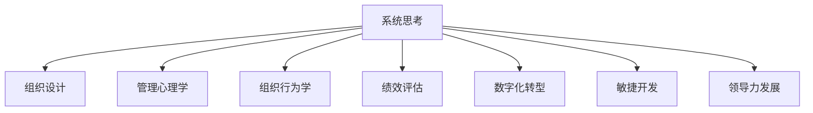

                 

# 系统思考在组织变革中的应用

> 关键词：系统思考,组织变革,组织设计,管理心理学,组织行为学,绩效评估,数字化转型,敏捷开发,领导力发展

## 1. 背景介绍

### 1.1 问题由来
在快速变化的商业环境中，企业面临越来越多的不确定性。如何应对这种复杂多变的环境，保持组织结构的灵活性和创新能力，已成为企业战略的重要议题。传统的组织设计和管理方法往往难以适应这种动态变化，而系统思考为组织变革提供了新的视角和方法。

系统思考是一种将组织视为一个整体，通过深入分析其内部结构、外部环境和互动关系，找到改善和创新的突破点的方法。它强调从全局角度考虑问题，打破原有的思维定势，推动组织在复杂环境中实现动态平衡和持续发展。

### 1.2 问题核心关键点
系统思考在组织变革中的应用主要包括以下几个关键点：

1. **系统视角**：将组织看作一个复杂的系统，分析其结构、行为和环境之间的相互作用。
2. **反馈机制**：建立有效的反馈机制，及时发现问题并调整行动。
3. **跨部门协作**：促进跨部门之间的沟通和协作，形成协同效应。
4. **持续改进**：通过不断优化和调整，使组织适应环境变化，保持竞争优势。
5. **领导力培养**：提升领导者的系统思维能力，推动组织变革的顺利进行。

这些关键点共同构成了系统思考在组织变革中的核心理念和方法论。通过深入理解这些关键点，可以更好地把握系统思考的精髓，应用到实际组织变革中。

## 2. 核心概念与联系

### 2.1 核心概念概述

为更好地理解系统思考在组织变革中的应用，本节将介绍几个密切相关的核心概念：

- **系统思考**：将组织视为一个整体，通过分析其内部结构、外部环境和互动关系，找到改善和创新的突破点的方法。强调从全局角度考虑问题，打破原有的思维定势，推动组织在复杂环境中实现动态平衡和持续发展。

- **组织设计**：研究组织结构、流程、职责等要素的安排和设计，使组织能够高效运作，实现战略目标。

- **管理心理学**：研究人如何在组织中行为，探讨人性、动机、情绪等因素对组织管理和变革的影响。

- **组织行为学**：研究个体和群体在组织中的行为规律，分析其影响因素和作用机制，推动组织变革。

- **绩效评估**：通过系统化的数据和方法，评价组织和个人的绩效表现，发现改进空间，推动组织进步。

- **数字化转型**：利用信息技术，重塑组织结构、流程和运营模式，提升组织效率和创新能力。

- **敏捷开发**：强调快速迭代、持续交付和客户反馈，推动组织灵活适应市场变化，提升产品和服务质量。

- **领导力发展**：培养和提升领导者的系统思维、战略规划和团队管理能力，推动组织变革和创新。

这些核心概念之间的逻辑关系可以通过以下Mermaid流程图来展示：



这个流程图展示了几大核心概念及其之间的关系：

1. 系统思考是组织变革的基础，通过对组织的全面分析和理解，提供变革的方向和方法。
2. 组织设计、管理心理学、组织行为学等子概念，从不同角度提供具体的变革工具和手段。
3. 绩效评估、数字化转型、敏捷开发和领导力发展等概念，进一步推动组织变革的实施和深化。

## 3. 核心算法原理 & 具体操作步骤

### 3.1 算法原理概述

系统思考在组织变革中的应用，本质上是一种系统的、整体的方法论。其核心思想是通过对组织的全面分析和理解，找到改善和创新的突破点，并持续优化和调整，推动组织在复杂环境中实现动态平衡和持续发展。

具体来说，系统思考的应用包括以下几个步骤：

1. **系统建模**：将组织视为一个整体，通过系统建模方法，分析其结构、行为和环境之间的相互作用。
2. **分析问题**：利用系统思考的框架和方法，深入分析组织存在的问题和挑战，找到根本原因。
3. **制定方案**：基于分析结果，制定可行的变革方案，并进行优先级排序。
4. **实施变革**：通过跨部门协作、持续改进等方法，实施变革方案，推动组织进步。
5. **评估反馈**：定期评估变革效果，收集反馈信息，进行持续优化和调整。

### 3.2 算法步骤详解

系统思考在组织变革中的应用步骤非常复杂，需要跨部门、跨学科的协作，其具体操作过程如下：

**Step 1: 建立系统视角**

首先，需要建立一个全面的系统视角，将组织视为一个整体，分析其结构、行为和环境之间的相互作用。具体步骤如下：

1. **确定系统边界**：明确组织的目标、组成要素和影响范围，建立系统的边界。
2. **识别关键要素**：通过系统建模方法，如因果图、系统动力学模型等，识别出影响组织运行的关键要素。
3. **分析系统结构**：研究组织的层次结构、流程、职责等，分析其相互作用关系。

**Step 2: 分析问题**

在建立系统视角的基础上，需要深入分析组织存在的问题和挑战，找到根本原因。具体步骤如下：

1. **识别问题**：通过问卷调查、访谈、数据分析等方法，识别出组织面临的主要问题。
2. **找出根本原因**：利用系统思考的方法，如鱼骨图、因果分析等，深入分析问题的根本原因。
3. **形成假设**：基于分析结果，形成初步的假设和改进方案。

**Step 3: 制定方案**

在分析问题的基础上，需要制定可行的变革方案，并进行优先级排序。具体步骤如下：

1. **制定方案**：基于假设和分析结果，制定详细的变革方案，包括目标、措施、责任人等。
2. **优先级排序**：对制定的方案进行优先级排序，根据紧急程度和重要程度进行资源分配。

**Step 4: 实施变革**

在制定方案后，需要实施变革，推动组织进步。具体步骤如下：

1. **跨部门协作**：促进跨部门之间的沟通和协作，形成协同效应。
2. **资源配置**：根据优先级排序，合理配置资源，确保变革方案的顺利实施。
3. **持续改进**：建立持续改进机制，定期评估变革效果，进行优化和调整。

**Step 5: 评估反馈**

在实施变革后，需要定期评估变革效果，收集反馈信息，进行持续优化和调整。具体步骤如下：

1. **评估效果**：利用绩效评估工具和方法，评估变革效果，分析改进空间。
2. **收集反馈**：通过问卷调查、访谈等方式，收集组织成员的反馈信息，了解变革的接受度和满意度。
3. **优化调整**：根据评估结果和反馈信息，进行持续优化和调整，推动组织进一步发展。

### 3.3 算法优缺点

系统思考在组织变革中的应用具有以下优点：

1. **全局视角**：系统思考强调从全局角度考虑问题，能够避免局部优化导致的整体损失。
2. **持续改进**：通过建立反馈机制，持续优化和调整，使组织能够适应环境变化，保持竞争优势。
3. **跨部门协作**：促进跨部门之间的沟通和协作，形成协同效应，提升组织效率。
4. **数据驱动**：利用绩效评估等数据分析工具，推动基于数据的决策，提高变革的科学性。

同时，该方法也存在一些局限性：

1. **复杂度高**：系统思考的应用过程复杂，需要跨部门、跨学科的协作，操作难度大。
2. **实施成本高**：需要投入大量时间和资源，对组织的资源配置和人员素质要求较高。
3. **短期效果不显著**：系统思考的改进效果往往需要一段时间才能显现，短期内难以看到显著变化。
4. **执行难度大**：需要高水平的领导力和管理能力，才能够顺利实施和推进变革。

尽管存在这些局限性，但系统思考在组织变革中的应用仍是大势所趋。未来相关研究的重点在于如何进一步简化操作流程，提高变革实施的效率和效果，兼顾长期与短期目标。

### 3.4 算法应用领域

系统思考在组织变革中的应用已经广泛应用于多个领域，以下是几个典型的应用场景：

1. **企业战略调整**：通过系统思考，分析企业外部环境和内部结构，制定符合市场变化的企业战略。

2. **流程优化**：利用系统思考的方法，识别出影响组织运行的瓶颈和问题，优化流程，提升效率。

3. **组织文化建设**：通过系统思考，分析和改善组织的文化氛围，推动员工行为和价值观的转变。

4. **绩效管理**：利用系统思考的方法，分析影响绩效的关键因素，制定合理的绩效评估标准和激励机制。

5. **数字化转型**：通过系统思考，分析数字化转型的机遇和挑战，制定全面的数字化战略，推动组织变革。

6. **领导力发展**：通过系统思考，培养和提升领导者的系统思维能力，推动组织变革和创新。

除了这些经典应用外，系统思考还被创新性地应用到更多场景中，如组织架构重塑、创新管理、危机应对等，为组织变革提供了新的思路和方法。随着系统思考理论和方法的不断发展，相信其在组织变革中的应用将更加广泛和深入。

## 4. 数学模型和公式 & 详细讲解 & 举例说明

### 4.1 数学模型构建

系统思考在组织变革中的应用，通常采用系统动力学模型(System Dynamics Model)来建模和分析。系统动力学模型是一种基于反馈机制的动态模型，通过模拟系统在时间维度上的变化，揭示系统的动态行为和相互作用。

**假设条件**：
- 组织为一个复杂系统，由多个子系统组成。
- 子系统之间存在多种类型的反馈机制。
- 系统内部和外部环境存在相互作用。

**系统动力学模型**：
$$
\frac{dS(t)}{dt} = \sum_{i=1}^n A_i \cdot P_i(S(t))
$$

其中，$S(t)$表示系统在时间$t$的总体状态，$A_i$表示第$i$个子系统的反馈系数，$P_i(S(t))$表示第$i$个子系统的状态方程。

### 4.2 公式推导过程

系统动力学模型的推导过程如下：

1. **确定系统边界**：明确组织的目标、组成要素和影响范围，建立系统的边界。
2. **识别关键要素**：通过因果图、反馈图等方法，识别出影响组织运行的关键要素。
3. **分析系统结构**：研究组织的层次结构、流程、职责等，分析其相互作用关系。
4. **建立状态方程**：利用状态方程描述各子系统的动态变化。
5. **模拟系统行为**：通过数值模拟，分析系统在时间维度上的动态行为和相互作用。

### 4.3 案例分析与讲解

以一家制造企业为例，分析其生产效率低下的原因，并提出改进方案。

1. **系统建模**：确定制造企业的系统边界，包括生产流程、库存管理、供应链等子系统。识别出关键要素，如原材料供应、生产速度、库存量等。

2. **分析问题**：通过因果图分析，发现生产效率低下的根本原因在于生产速度和库存量之间的反馈循环。生产速度过快，导致库存积压；库存积压，导致生产速度受阻。

3. **制定方案**：基于分析结果，制定改进方案，包括调整生产速度、优化库存管理、改善供应链等措施。

4. **实施变革**：通过跨部门协作，推动方案的实施，提高生产效率。

5. **评估反馈**：定期评估改进效果，收集反馈信息，进行持续优化和调整。

通过系统思考的方法，制造企业能够更全面、系统地分析问题，找到根本原因，制定科学合理的改进方案，推动组织变革的顺利进行。

## 5. 项目实践：代码实例和详细解释说明

### 5.1 开发环境搭建

在进行系统思考的应用实践前，我们需要准备好开发环境。以下是使用Python进行系统动力学模型建模的环境配置流程：

1. **安装Python**：从官网下载并安装Python，推荐使用最新版本。

2. **安装PyDYNAMO**：利用PyDYNAMO工具包，构建和模拟系统动力学模型。安装命令为：
   ```bash
   pip install pydynamo
   ```

3. **准备数据**：准备系统模型的输入数据，包括系统边界、关键要素、状态方程等。

4. **构建模型**：利用PyDYNAMO构建系统动力学模型，并验证其正确性。

5. **模拟仿真**：运行系统动力学模型，模拟系统的动态行为和相互作用。

6. **分析和优化**：分析仿真结果，提出改进方案，并进一步优化模型。

完成上述步骤后，即可在Python环境下进行系统思考的应用实践。

### 5.2 源代码详细实现

下面我们以一家制造企业为例，给出使用PyDYNAMO进行系统思考建模的Python代码实现。

```python
# 导入PyDYNAMO工具包
from pydynamo import PyDynamo
import numpy as np

# 构建系统动力学模型
dynamo = PyDynamo()

# 定义系统边界
system_boundary = dynamo.create_subsystem('system_boundary', ['生产流程', '库存管理', '供应链'])

# 定义关键要素
production_speed = dynamo.create_state('production_speed', system_boundary, initial_value=10, rate_of_change=0)
inventory_level = dynamo.create_state('inventory_level', system_boundary, initial_value=100, rate_of_change=0)

# 建立状态方程
production_speed.rate_of_change = production_speed * inventory_level - production_speed
inventory_level.rate_of_change = production_speed - inventory_level * 0.1

# 运行模拟仿真
t = np.arange(0, 1000, 0.1)
dynamo.run(t, params={inventory_level.initial_value: 100})

# 分析仿真结果
print(dynamo.log)
```

以上代码实现了对一个简单的制造企业系统动力学模型的构建和模拟仿真。可以看到，利用PyDYNAMO工具包，可以非常方便地构建和分析系统模型，为组织变革提供科学依据。

### 5.3 代码解读与分析

让我们再详细解读一下关键代码的实现细节：

**系统建模**：
- `dynamo.create_subsystem`：创建系统边界，定义系统子系统。
- `dynamo.create_state`：创建系统状态，定义关键要素和状态方程。

**状态方程**：
- `production_speed.rate_of_change = production_speed * inventory_level - production_speed`：描述生产速度和库存量之间的反馈机制。
- `inventory_level.rate_of_change = production_speed - inventory_level * 0.1`：描述库存量随时间变化的动态行为。

**模拟仿真**：
- `np.arange(0, 1000, 0.1)`：定义模拟时间步长。
- `dynamo.run(t, params={inventory_level.initial_value: 100})`：运行模拟仿真，并设置初始条件。

**分析仿真结果**：
- `print(dynamo.log)`：输出模拟结果，分析系统行为和相互作用。

通过上述代码实现，系统思考在组织变革中的应用得到了具体的实践验证。开发者可以根据实际问题，设计更加复杂和细致的系统动力学模型，进一步推动组织变革的实施。

## 6. 实际应用场景

### 6.1 智能制造

系统思考在智能制造领域的应用，通过构建和分析系统的动态行为，推动制造过程的优化和创新。

1. **智能生产**：利用系统思考的方法，分析生产流程中的瓶颈和问题，优化生产速度、库存管理和物料供应，提升生产效率。

2. **供应链管理**：通过系统动力学模型，优化供应链的各个环节，提升供应链的响应速度和稳定性。

3. **设备维护**：通过系统思考的方法，分析设备维护的周期和频次，优化维护策略，延长设备寿命，减少停机时间。

### 6.2 医疗健康

系统思考在医疗健康领域的应用，通过构建和分析系统的动态行为，推动医疗服务的优化和创新。

1. **诊疗流程优化**：利用系统思考的方法，分析诊疗流程中的瓶颈和问题，优化诊疗流程，提高诊疗效率。

2. **资源配置**：通过系统动力学模型，优化医疗资源的配置，提升医院的运营效率和服务质量。

3. **疾病预防**：通过系统思考的方法，分析疾病传播的动态行为，提出预防措施，降低疾病传播风险。

### 6.3 金融服务

系统思考在金融服务领域的应用，通过构建和分析系统的动态行为，推动金融服务的优化和创新。

1. **风险管理**：利用系统思考的方法，分析金融风险的传播路径，提出风险管理策略，降低金融风险。

2. **客户服务**：通过系统动力学模型，优化客户服务的流程和资源配置，提升客户满意度。

3. **投资决策**：通过系统思考的方法，分析市场变化的动态行为，提出投资决策建议，提升投资收益。

### 6.4 未来应用展望

随着系统思考理论和方法的不断发展，其在组织变革中的应用将更加广泛和深入。未来可能的应用场景包括：

1. **数字化转型**：通过系统思考的方法，分析数字化转型的动态行为，推动企业数字化战略的实施。

2. **组织文化建设**：利用系统动力学模型，分析组织文化的动态行为，推动员工行为和价值观的转变。

3. **创新管理**：通过系统思考的方法，分析创新管理的动态行为，推动组织的创新能力提升。

4. **可持续发展**：通过系统思考的方法，分析可持续发展目标的实现路径，推动企业的可持续发展战略。

5. **全球化管理**：利用系统思考的方法，分析全球化管理的动态行为，推动企业的国际化发展。

6. **危机应对**：通过系统思考的方法，分析危机应对的动态行为，提出应对策略，减少危机损失。

## 7. 工具和资源推荐

### 7.1 学习资源推荐

为了帮助开发者系统掌握系统思考的理论基础和实践技巧，这里推荐一些优质的学习资源：

1. **《系统思考：系统动力学与组织变革》**：详细介绍了系统思考的基本原理和方法，提供了丰富的实际案例。
2. **《系统动力学模型与组织变革》**：介绍了系统动力学模型的构建和分析方法，提供系统思考的应用案例。
3. **Coursera系统动力学课程**：由麻省理工学院开设的系统动力学课程，系统讲解系统动力学理论和方法，提供实战练习。
4. **Youtube系统思考视频**：YouTube上有多位专家分享的系统思考视频，涵盖系统思考的基本概念和应用技巧。
5. **SimPy模拟软件**：SimPy是一款开源的模拟软件，可以用于构建和分析系统动力学模型。

通过对这些资源的学习实践，相信你一定能够快速掌握系统思考的精髓，并应用到实际的组织变革中。

### 7.2 开发工具推荐

高效的开发离不开优秀的工具支持。以下是几款用于系统思考建模和分析的常用工具：

1. **PyDYNAMO**：Python的动态系统模拟工具包，提供了构建和分析系统动力学模型的功能。
2. **Vensim**：商业版的系统动力学建模软件，提供强大的建模和分析功能。
3. **AnyLogic**：商业版的仿真建模软件，支持多种类型系统的建模和分析。
4. **SimPy**：开源的仿真建模工具，支持构建和分析复杂系统的动态行为。
5. **JDK**：Java虚拟机，支持系统动力学模型在分布式环境中的仿真和分析。

合理利用这些工具，可以显著提升系统思考的应用效率，推动组织变革的顺利进行。

### 7.3 相关论文推荐

系统思考在组织变革中的应用源于学界的持续研究。以下是几篇奠基性的相关论文，推荐阅读：

1. **《系统动力学模型与组织变革》**：系统动力学方法在组织变革中的应用，探讨如何通过系统动力学模型推动组织变革。
2. **《组织行为系统动力学建模》**：利用系统动力学模型，分析组织行为的变化规律，推动组织变革的实施。
3. **《系统思考与企业战略管理》**：探讨系统思考在企业战略管理中的应用，提升企业的战略规划和执行能力。
4. **《系统思考与创新管理》**：利用系统思考的方法，推动组织的创新管理和创新能力的提升。
5. **《系统思考与组织文化建设》**：探讨系统思考在组织文化建设中的应用，推动员工行为和价值观的转变。

这些论文代表了大系统思考理论和方法的发展脉络。通过学习这些前沿成果，可以帮助研究者把握学科前进方向，激发更多的创新灵感。

## 8. 总结：未来发展趋势与挑战

### 8.1 研究成果总结

本文对系统思考在组织变革中的应用进行了全面系统的介绍。首先阐述了系统思考的基本概念和理论基础，明确了其在全球视角下考虑问题、打破原有思维定势的重要价值。其次，从原理到实践，详细讲解了系统思考的应用步骤和方法，给出了系统思考建模和分析的完整代码实例。同时，本文还广泛探讨了系统思考在智能制造、医疗健康、金融服务等多个领域的应用前景，展示了系统思考方法的巨大潜力。

通过本文的系统梳理，可以看到，系统思考在组织变革中的应用已经取得了显著成效，极大地推动了组织结构的优化和创新能力的提升。未来，伴随系统思考理论和方法的持续演进，相信其在组织变革中的应用将更加广泛和深入，为组织在复杂环境中保持竞争优势提供新的工具和方法。

### 8.2 未来发展趋势

展望未来，系统思考在组织变革中的应用将呈现以下几个发展趋势：

1. **数字化集成**：系统思考将更多地与信息技术结合，构建数字化系统动力学模型，推动数字化转型的实施。
2. **跨学科融合**：系统思考将与更多的学科领域结合，如社会学、经济学、心理学等，提供更加全面和深刻的组织变革方法。
3. **智能决策支持**：系统思考将更多地应用于智能决策支持系统，提供科学合理的决策建议，提升组织的决策水平。
4. **个性化管理**：系统思考将更多地应用于个性化管理，根据员工和客户的特点，提供定制化的管理方案。
5. **全球化视野**：系统思考将更多地应用于全球化管理，分析全球市场和资源配置的动态行为，推动企业的国际化发展。

以上趋势凸显了系统思考方法在组织变革中的广阔前景。这些方向的探索发展，必将进一步提升组织的动态平衡和持续发展能力，为企业的创新和竞争提供强有力的支持。

### 8.3 面临的挑战

尽管系统思考在组织变革中的应用已经取得了显著成效，但在迈向更加智能化、普适化应用的过程中，它仍面临诸多挑战：

1. **复杂度提升**：系统思考在复杂环境中的应用难度较大，需要高水平的专业知识和技能。
2. **数据获取困难**：构建系统动力学模型需要大量数据，数据的获取和处理往往是一个耗时的过程。
3. **结果解释困难**：系统思考的结果往往较为复杂，难以进行直观解释，缺乏可视化手段。
4. **资源投入高**：系统思考的实施需要大量的资源投入，包括人力、物力和时间成本。
5. **技术壁垒**：系统思考的实施需要掌握相关的技术和工具，对于非专业人士而言存在一定的技术壁垒。

尽管存在这些挑战，但系统思考在组织变革中的应用前景依然广阔。未来需要进一步简化操作流程，提高技术可及性，降低实施成本，才能真正实现系统思考的广泛应用。

### 8.4 研究展望

面对系统思考在组织变革中所面临的挑战，未来的研究需要在以下几个方面寻求新的突破：

1. **简化建模流程**：开发更易于操作的系统动力学建模工具，降低建模难度，提高建模效率。
2. **增强可视化**：利用数据可视化技术，增强系统思考结果的解释性和可理解性，提供更加直观的展示手段。
3. **开发自动化工具**：开发自动化系统动力学建模和仿真工具，减少人工干预，提高建模和分析的效率。
4. **多模态集成**：将系统思考与其他技术方法结合，如大数据分析、人工智能等，提供更全面的组织变革方案。
5. **定制化解决方案**：根据不同的组织特性和变革目标，开发定制化的系统思考解决方案，提高应用效果。

这些研究方向的探索，必将引领系统思考在组织变革中的应用走向成熟，为组织的健康发展提供更加科学和高效的方法。面向未来，系统思考方法需要与其他技术和方法结合，多路径协同发力，共同推动组织的持续进步和创新。总之，系统思考在组织变革中的应用将不断深化，为构建更加智能化、动态化的组织结构提供新的路径和方法。

## 9. 附录：常见问题与解答

**Q1: 什么是系统思考？**

A: 系统思考是一种将组织视为一个整体，通过分析其内部结构、外部环境和互动关系，找到改善和创新的突破点的方法。强调从全局角度考虑问题，打破原有的思维定势，推动组织在复杂环境中实现动态平衡和持续发展。

**Q2: 系统思考在组织变革中的应用有哪些关键步骤？**

A: 系统思考在组织变革中的应用主要包括以下几个关键步骤：
1. 系统建模：将组织视为一个整体，通过系统建模方法，分析其结构、行为和环境之间的相互作用。
2. 分析问题：利用系统思考的框架和方法，深入分析组织存在的问题和挑战，找到根本原因。
3. 制定方案：基于分析结果，制定可行的变革方案，并进行优先级排序。
4. 实施变革：通过跨部门协作、持续改进等方法，实施变革方案，推动组织进步。
5. 评估反馈：定期评估变革效果，收集反馈信息，进行持续优化和调整。

**Q3: 如何简化系统思考的应用流程？**

A: 简化系统思考的应用流程可以从以下几个方面入手：
1. 使用易于操作的系统动力学建模工具，降低建模难度。
2. 开发自动化系统动力学建模和仿真工具，减少人工干预。
3. 利用数据可视化技术，增强结果的解释性和可理解性。
4. 开发简化版的系统动力学模型，减少计算复杂度。
5. 提供预构建的模型库，快速应用系统思考方法。

通过这些措施，可以显著提高系统思考的应用效率，降低实施难度，推动组织变革的顺利进行。

**Q4: 系统思考在实际应用中需要注意哪些问题？**

A: 系统思考在实际应用中需要注意以下几个问题：
1. 数据获取困难：构建系统动力学模型需要大量数据，数据的获取和处理往往是一个耗时的过程。
2. 结果解释困难：系统思考的结果往往较为复杂，难以进行直观解释，缺乏可视化手段。
3. 资源投入高：系统思考的实施需要大量的资源投入，包括人力、物力和时间成本。
4. 技术壁垒：系统思考的实施需要掌握相关的技术和工具，对于非专业人士而言存在一定的技术壁垒。
5. 模型复杂度提升：系统思考在复杂环境中的应用难度较大，需要高水平的专业知识和技能。

针对这些问题，需要通过简化操作流程、提高技术可及性、增强可视化等措施，进一步优化系统思考的应用。

**Q5: 系统思考的应用前景如何？**

A: 系统思考在组织变革中的应用前景非常广阔，未来可能的应用场景包括：
1. 数字化转型：通过系统思考的方法，分析数字化转型的动态行为，推动企业数字化战略的实施。
2. 跨学科融合：系统思考将与更多的学科领域结合，如社会学、经济学、心理学等，提供更加全面和深刻的组织变革方法。
3. 智能决策支持：系统思考将更多地应用于智能决策支持系统，提供科学合理的决策建议，提升组织的决策水平。
4. 个性化管理：系统思考将更多地应用于个性化管理，根据员工和客户的特点，提供定制化的管理方案。
5. 全球化视野：系统思考将更多地应用于全球化管理，分析全球市场和资源配置的动态行为，推动企业的国际化发展。

通过这些方向的探索发展，系统思考在组织变革中的应用将更加广泛和深入，为组织的健康发展提供更加科学和高效的方法。

---

作者：禅与计算机程序设计艺术 / Zen and the Art of Computer Programming

