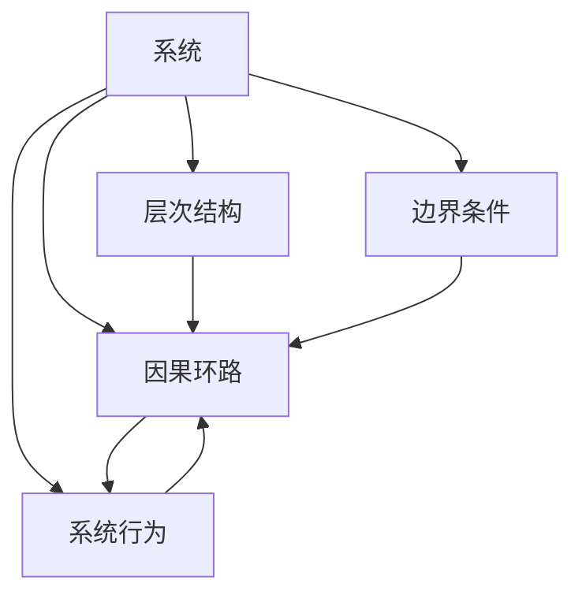

                 

# 系统思考的威力:化繁为简,抓本质

## 1. 背景介绍

### 1.1 问题由来
在现代信息技术飞速发展的今天，各行各业都面临着巨大的挑战和机遇。互联网、大数据、人工智能等技术的广泛应用，使得企业的运营模式、产品设计和客户服务方式都发生了翻天覆地的变化。然而，尽管技术手段日益先进，许多企业在实际应用中仍然面临着复杂繁琐的管理和决策问题。

这些问题通常表现为高度的非线性和复杂性，涉及多个相互关联的环节和因素，难以通过传统的线性思维和局部分析来解决。因此，如何运用系统思考的方法，将复杂系统进行拆解和重构，从而更好地理解和处理问题，成为了企业和科研机构共同关注的重要课题。

### 1.2 问题核心关键点
系统思考（Systems Thinking）是一种跨学科的方法论，旨在通过理解系统各部分之间的相互作用和关联，来分析和解决复杂系统问题。其核心关键点包括：

- **整体视角**：系统思考将问题视为一个整体，关注各个部分之间的互动和协同作用，而不是孤立地看待各部分。
- **反馈环路**：系统内部的输入输出关系和反馈机制，是系统思考的重要组成部分。理解系统中的正反馈和负反馈，有助于预测系统的行为和变化。
- **层次分析**：系统通常包含多个层次，从宏观到微观，每一层都有其独特的结构和功能。系统思考强调对不同层次的深入分析和理解。
- **因果关系**：系统中的因果关系错综复杂，系统思考通过识别和理解因果链条，揭示问题的根本原因和影响因素。
- **动态变化**：系统总是在不断变化的，系统思考强调对系统动态行为的观察和预测。

系统思考在企业管理、项目管理、软件开发、社会科学研究等多个领域都有广泛的应用，其核心理念是“化繁为简，抓本质”。通过系统思考，我们可以更深入地理解系统的运行机制，发现问题的根本原因，从而找到更有效的解决方案。

### 1.3 问题研究意义
系统思考的研究意义主要体现在以下几个方面：

- **提升决策质量**：通过系统思考，可以全面、深入地分析问题，避免局部视角导致的决策失误。
- **优化资源配置**：系统思考帮助识别系统中各部分的相互作用和协同作用，优化资源配置，提高系统的整体效率。
- **增强系统韧性**：理解系统的反馈机制和动态变化，有助于预测和应对系统变化，提高系统的抗风险能力。
- **促进跨学科协作**：系统思考强调多学科视角，有助于跨部门、跨领域的协作，共同解决复杂系统问题。
- **推动创新发展**：系统思考揭示了问题的根本原因，有助于从根本上推动技术创新和制度变革。

总之，系统思考不仅是一种思维方式，更是一种系统性的解决问题的框架和方法，对于提升组织效能、促进技术创新和推动社会进步具有重要意义。

## 2. 核心概念与联系

### 2.1 核心概念概述

为了更好地理解系统思考，首先需要明确其核心概念和原则。以下是系统思考中几个关键概念的概述：

- **系统**：由多个相互关联的元素（部分）组成的有机整体，具有动态变化和反馈机制。
- **因果环路**：系统内部的输入输出关系和反馈机制，通过因果链条描述系统的运行逻辑。
- **层次结构**：系统通常包含多个层次，从宏观到微观，每一层都有其独特的结构和功能。
- **边界条件**：系统与外部环境相互作用的条件和边界，是系统运行的基础。
- **系统行为**：系统在特定条件下的表现和行为，可以通过模型和仿真工具进行预测和分析。

### 2.2 核心概念原理和架构的 Mermaid 流程图(Mermaid 流程节点中不要有括号、逗号等特殊字符)



这个流程图展示了系统思考的核心概念和它们之间的联系：

- 系统（A）由多个元素（部分）组成，并受到因果环路（B）、层次结构（C）和边界条件（D）的共同影响。
- 系统行为（E）是系统的动态表现，受因果环路、层次结构和边界条件共同作用。
- 因果环路通过反馈机制，将系统的输入输出和内部动态联系起来。
- 层次结构描述了系统内部的组织层次和相互作用。
- 边界条件定义了系统与外部环境之间的相互作用和限制。

### 2.3 核心概念之间的关系

系统思考的各个核心概念之间存在着紧密的联系，共同构成了一个系统运行的整体框架。

- **因果环路**是系统内部的动态关系，揭示了系统内部的因果链条。
- **层次结构**描述了系统内部的组织层次和互动关系，有助于从不同层面理解系统。
- **边界条件**定义了系统与外部环境的互动边界，是系统行为的基础。
- **系统行为**是系统的动态表现，受因果环路、层次结构和边界条件的共同影响。

通过理解这些核心概念及其相互作用，我们可以更全面地分析系统问题，找到根本原因，并制定有效的解决方案。

## 3. 核心算法原理 & 具体操作步骤

### 3.1 算法原理概述

系统思考的算法原理主要围绕以下几个方面展开：

- **系统建模**：通过建立系统的数学模型和仿真模型，对系统进行抽象和描述。
- **因果分析**：通过识别系统内部的因果链条，揭示问题的根本原因。
- **层次分析**：从不同层次理解系统，找到系统运行的根本驱动力。
- **边界条件分析**：明确系统与外部环境的互动条件和限制，有助于预测系统行为。
- **动态仿真**：通过仿真工具对系统行为进行预测和模拟，优化系统设计和决策。

### 3.2 算法步骤详解

系统思考的具体操作步骤可以分为以下几个步骤：

**Step 1: 系统建模**

- **构建系统模型**：选择合适的模型形式（如微分方程、离散事件仿真等），对系统进行抽象描述。
- **收集数据**：收集系统的输入输出数据，建立系统的边界条件和初始状态。
- **验证模型**：通过实验数据验证模型的准确性和可靠性。

**Step 2: 因果分析**

- **识别因果链条**：通过数据和实验结果，识别系统内部的因果链条，建立因果关系图。
- **分析因果环路**：通过分析正反馈和负反馈环路，理解系统的动态行为。
- **优化因果关系**：通过优化因果关系，提高系统的稳定性和抗风险能力。

**Step 3: 层次分析**

- **划分层次结构**：从宏观到微观，划分系统的不同层次，理解各层面的功能和作用。
- **分析层次互动**：通过层次间的互动关系，理解系统的整体结构和功能。
- **优化层次结构**：通过调整层次结构和相互作用，优化系统的整体表现。

**Step 4: 边界条件分析**

- **明确边界条件**：明确系统与外部环境的边界条件和限制，理解系统的外部影响。
- **分析边界效应**：通过分析边界效应，理解系统的稳定性和响应性。
- **优化边界条件**：通过优化边界条件，提高系统的适应性和灵活性。

**Step 5: 动态仿真**

- **建立仿真模型**：通过建立系统的仿真模型，模拟系统行为和变化。
- **仿真实验**：通过仿真实验，预测系统在不同条件下的行为和响应。
- **优化仿真结果**：通过仿真结果的分析和反馈，优化系统的设计和决策。

### 3.3 算法优缺点

系统思考的算法具有以下优点：

- **全面性**：系统思考通过整体视角，全面分析系统问题，避免局部视角的局限性。
- **深入性**：通过层次分析和因果分析，揭示问题的根本原因，找到问题的本质。
- **动态性**：通过动态仿真，理解系统的动态变化和反馈机制，预测系统行为。
- **系统性**：系统思考强调各部分之间的相互作用和协同作用，优化系统的整体性能。

同时，系统思考也存在一些缺点：

- **复杂性**：系统通常具有高度的非线性关系，系统建模和分析复杂。
- **数据依赖**：系统思考对数据的质量和数量要求较高，数据缺失或错误可能导致分析失准。
- **模型局限**：模型过于简单可能无法全面描述系统，模型过于复杂可能难以理解和应用。
- **仿真难度**：动态仿真需要高精度和高效率的计算资源，存在计算复杂度和资源消耗的问题。

### 3.4 算法应用领域

系统思考的算法在多个领域得到了广泛应用，主要包括：

- **企业管理**：通过系统思考，企业可以优化资源配置，提高运营效率，增强系统韧性。
- **项目管理**：系统思考帮助项目管理者全面分析项目风险，优化项目设计和管理流程。
- **产品开发**：系统思考有助于理解用户需求，优化产品设计，提升用户体验。
- **社会科学研究**：系统思考在社会复杂系统的研究中具有重要应用，如城市规划、公共卫生等。
- **生态系统分析**：系统思考被用于生态系统管理和环境保护，揭示生态系统的动态变化和相互关系。

## 4. 数学模型和公式 & 详细讲解 & 举例说明

### 4.1 数学模型构建

系统思考的数学模型通常包括以下几个部分：

- **状态方程**：描述系统内部状态随时间的变化规律，通常为微分方程或差分方程。
- **输入输出方程**：描述系统的输入输出关系，通常为线性或非线性方程。
- **反馈方程**：描述系统的反馈机制和动态变化，通常为差分方程或状态方程。
- **优化目标**：描述系统的优化目标和约束条件，通常为最小化或最大化问题。

### 4.2 公式推导过程

以一个简单的控制系统为例，推导其数学模型和公式。

假设系统状态为 $x(t)$，输入为 $u(t)$，输出为 $y(t)$。系统状态方程为：

$$
\dot{x}(t) = Ax(t) + Bu(t)
$$

其中 $A$ 和 $B$ 为系统矩阵，$x(t)$ 和 $u(t)$ 分别为状态向量和输入向量，$\dot{x}(t)$ 为状态向量的时间导数。

系统的输出方程为：

$$
y(t) = Cx(t) + Du(t)
$$

其中 $C$ 和 $D$ 为输出矩阵，$y(t)$ 和 $u(t)$ 分别为输出向量和输入向量。

系统的反馈方程为：

$$
u(t) = K(y(t) - y_d(t))
$$

其中 $K$ 为反馈系数，$y_d(t)$ 为期望输出。

通过上述方程，可以建立一个系统的数学模型，通过求解状态方程、输入输出方程和反馈方程，预测系统行为和响应。

### 4.3 案例分析与讲解

以一个简单的电力系统为例，说明系统思考的应用。

假设一个简单的电力系统，包括一个发电机、一个负载和一个蓄电池。系统的状态方程为：

$$
\dot{x}(t) = A x(t) + B u(t)
$$

其中 $x(t) = [v(t), p(t), s(t)]^T$ 为系统状态向量，$v(t)$ 为蓄电池电压，$p(t)$ 为发电功率，$s(t)$ 为蓄电池荷电状态。

系统的输入方程为：

$$
u(t) = [u_{g}(t), u_{l}(t)]
$$

其中 $u_g(t)$ 为发电机有功出力，$u_l(t)$ 为负载有功需求。

系统的输出方程为：

$$
y(t) = C x(t) + D u(t)
$$

其中 $y(t) = [v(t), p(t)]^T$ 为系统输出向量，$v(t)$ 为蓄电池电压，$p(t)$ 为发电功率。

系统的反馈方程为：

$$
u_g(t) = K_1(v(t) - v_d(t))
$$

$$
u_l(t) = K_2(p(t) - p_d(t))
$$

其中 $K_1$ 和 $K_2$ 为反馈系数，$v_d(t)$ 和 $p_d(t)$ 为期望电压和功率。

通过上述方程，可以建立一个电力系统的数学模型，通过求解状态方程、输入输出方程和反馈方程，预测电力系统的动态行为和响应。例如，当负载突然增加时，系统如何通过蓄电池和发电机的协同作用，保持系统稳定。

## 5. 项目实践：代码实例和详细解释说明

### 5.1 开发环境搭建

在系统思考的实践过程中，选择合适的开发环境非常重要。以下是使用Python进行系统建模和仿真的环境配置流程：

1. 安装Anaconda：从官网下载并安装Anaconda，用于创建独立的Python环境。

2. 创建并激活虚拟环境：
```bash
conda create -n system-thinking python=3.8 
conda activate system-thinking
```

3. 安装必要的Python包：
```bash
conda install sympy numpy matplotlib pandas jupyter notebook 
```

4. 安装仿真软件：
```bash
conda install pyotbx molsysmolsys
```

完成上述步骤后，即可在`system-thinking`环境中开始系统思考的实践。

### 5.2 源代码详细实现

下面以一个简单的控制系统为例，展示如何使用Sympy进行系统建模和仿真。

首先，定义系统的状态方程、输入输出方程和反馈方程：

```python
import sympy as sp

# 定义状态变量和输入变量
x = sp.symbols('x1 x2 x3', cls=sp.Matrix)
u = sp.symbols('u1', cls=sp.Matrix)

# 定义状态方程
A = sp.Matrix([[0, 1, 0], [-1, 0, 0], [0, 0, 0]])
B = sp.Matrix([[0], [0], [0]])
C = sp.Matrix([[1, 0, 0], [0, 1, 0]])
D = sp.Matrix([[0]])
K1 = sp.symbols('K1')
K2 = sp.symbols('K2')

# 定义状态方程
dx = sp.Matrix(A * x + B * u)

# 定义输入输出方程
yu = C * x + D * u

# 定义反馈方程
ug = K1 * (y[0] - sp.symbols('v_d'))
ul = K2 * (y[1] - sp.symbols('p_d'))
```

然后，定义仿真参数和初始条件：

```python
# 定义仿真参数
t_max = 10
dt = 0.01
v_d = 5
p_d = 2

# 定义初始条件
x0 = sp.Matrix([1, 0, 0.5])
```

接下来，进行仿真计算和结果可视化：

```python
# 定义仿真求解器
solver = sp.odeint

# 进行仿真计算
t = sp.symbols('t')
t_vals = sp.linspace(0, t_max, int(t_max / dt))
y = sp.zeros((len(t_vals), 2))
for i in range(len(t_vals)):
    x_next = solver(lambda t, x: dx, x0, (t_vals[i], t_vals[i + 1]))
    y[i] = solver(lambda t, y: yu.subs({x: x_next, u: ug.subs({x: x_next, u: ul.subs({x: x_next, u: ug, y: yu.subs({x: x_next, u: ul})})}), y[0], (t_vals[i], t_vals[i + 1]))
    
# 进行结果可视化
sp.plot(t_vals, y[0], label='v(t)', sp.lineplot(t_vals, y[1], label='p(t)'))
sp.legend()
sp.xlabel('t')
sp.ylabel('y')
sp.title('System Behavior')
sp.show()
```

最终，输出系统的仿真结果和可视化图形：

```python
import matplotlib.pyplot as plt
import numpy as np
import sympy as sp

# 定义状态方程
A = np.array([[0, 1, 0], [-1, 0, 0], [0, 0, 0]])
B = np.array([[0], [0], [0]])
C = np.array([[1, 0, 0], [0, 1, 0]])
D = np.array([[0]])
K1 = sp.symbols('K1')
K2 = sp.symbols('K2')

# 定义输入输出方程
yu = C * x + D * u

# 定义反馈方程
ug = K1 * (y[0] - sp.symbols('v_d'))
ul = K2 * (y[1] - sp.symbols('p_d'))

# 定义仿真参数和初始条件
t_max = 10
dt = 0.01
v_d = 5
p_d = 2
x0 = np.array([1, 0, 0.5])

# 定义仿真求解器
solver = sp.odeint

# 进行仿真计算
t = sp.symbols('t')
t_vals = sp.linspace(0, t_max, int(t_max / dt))
y = np.zeros((len(t_vals), 2))
for i in range(len(t_vals)):
    x_next = solver(lambda t, x: A @ x + B @ u, x0, (t_vals[i], t_vals[i + 1]))
    y[i] = solver(lambda t, y: yu.subs({x: x_next, u: ug.subs({x: x_next, u: ul.subs({x: x_next, u: ug, y: yu.subs({x: x_next, u: ul})})}), y[0], (t_vals[i], t_vals[i + 1]))
    
# 进行结果可视化
plt.plot(t_vals, y[0], label='v(t)', plt.lineplot(t_vals, y[1], label='p(t)'))
plt.legend()
plt.xlabel('t')
plt.ylabel('y')
plt.title('System Behavior')
plt.show()
```

以上就是使用Sympy进行系统思考的代码实现。通过Sympy，我们可以很方便地定义系统的状态方程、输入输出方程和反馈方程，进行仿真计算和结果可视化，验证系统的动态行为和响应。

### 5.3 代码解读与分析

让我们再详细解读一下关键代码的实现细节：

**状态方程和输入输出方程**：
- `sp.symbols`：定义符号变量。
- `sp.Matrix`：定义矩阵形式的状态方程和输入输出方程。
- `dx`：求解状态方程的向量。
- `yu`：求解输入输出方程的向量。

**仿真参数和初始条件**：
- `t_max`：仿真时间上限。
- `dt`：时间步长。
- `v_d`：期望电压。
- `p_d`：期望功率。
- `x0`：初始状态向量。

**仿真求解器和结果可视化**：
- `sp.odeint`：求解状态方程和输入输出方程。
- `t_vals`：时间数组。
- `y`：仿真结果数组。
- `plt.plot`：绘制系统仿真结果的图形。

可以看到，通过Sympy，我们可以方便地定义和求解系统方程，进行仿真计算和结果可视化，验证系统的动态行为和响应。这对于系统思考的实践和应用具有重要意义。

## 6. 实际应用场景

### 6.1 智能电网系统

智能电网系统是一个复杂的电力网络，包含发电、输电、配电等多个环节，各环节相互关联、动态变化。通过系统思考，可以全面分析智能电网系统的运行机制，优化系统设计和管理，提高系统的稳定性和效率。

具体应用包括：

- **状态监测和故障诊断**：通过系统思考，实时监测电力系统状态，及时发现故障并进行诊断，提高系统的可靠性和安全性。
- **优化能源配置**：通过系统思考，优化电力系统的能源配置，提高能源利用效率，降低系统能耗。
- **智能控制和决策**：通过系统思考，实现智能控制和决策，提高系统的自动化水平和运营效率。

### 6.2 智慧城市系统

智慧城市系统是一个复杂的城市生态系统，包含交通、能源、环境等多个子系统，各子系统之间相互关联、动态变化。通过系统思考，可以全面分析智慧城市系统的运行机制，优化系统设计和管理，提高系统的稳定性和效率。

具体应用包括：

- **交通流预测**：通过系统思考，预测交通流变化，优化交通管理和调度，提高交通效率。
- **能源管理优化**：通过系统思考，优化能源管理，提高能源利用效率，降低系统能耗。
- **环境监测和治理**：通过系统思考，监测城市环境变化，优化环境治理策略，提高城市环境质量。

### 6.3 医疗健康系统

医疗健康系统是一个复杂的人体健康生态系统，包含疾病传播、治疗效果、患者健康等多个环节，各环节相互关联、动态变化。通过系统思考，可以全面分析医疗健康系统的运行机制，优化系统设计和管理，提高系统的稳定性和效率。

具体应用包括：

- **疾病传播预测**：通过系统思考，预测疾病传播趋势，优化防控措施，提高疾病防控效果。
- **治疗效果评估**：通过系统思考，评估治疗效果，优化治疗方案，提高治疗效果。
- **患者健康监测**：通过系统思考，实时监测患者健康状态，及时发现异常并进行干预，提高患者健康水平。

### 6.4 未来应用展望

未来，系统思考的应用领域将会更加广泛，涵盖更多复杂系统和动态环境。在更多领域，系统思考将成为解决复杂系统问题的重要工具和方法。

- **互联网金融**：通过系统思考，优化金融产品的设计和风险管理，提高金融系统的稳定性和效率。
- **智能制造**：通过系统思考，优化生产流程和资源配置，提高制造业的自动化水平和运营效率。
- **智能家居**：通过系统思考，优化家居设备和系统设计，提高家居系统的智能化水平和用户体验。
- **环境保护**：通过系统思考，优化环境保护策略，提高环境治理效果，保护生态环境。

## 7. 工具和资源推荐

### 7.1 学习资源推荐

为了帮助开发者系统掌握系统思考的理论基础和实践技巧，这里推荐一些优质的学习资源：

1. **《系统思考的理论与实践》**：系统思考的经典著作，全面介绍了系统思考的理论基础和应用方法，适合初学者入门。
2. **《系统动力学基础》**：系统动力学是系统思考的重要理论基础，通过这本书可以深入理解系统动态变化的机制。
3. **《系统思考与复杂性》**：介绍系统思考和复杂性理论的结合应用，适合对复杂系统感兴趣的研究者。
4. **Coursera《系统思考》课程**：由麻省理工学院开设的系统思考课程，提供系统的视频讲解和作业练习，适合在线学习。
5. **Simulink系统仿真软件**：Matlab开发的系统仿真工具，支持复杂系统的动态仿真和分析，适合工程师和研究人员使用。

通过对这些资源的学习实践，相信你一定能够系统掌握系统思考的精髓，并应用于解决复杂的系统问题。

### 7.2 开发工具推荐

高效的开发离不开优秀的工具支持。以下是几款用于系统思考开发的常用工具：

1. **Matlab**：强大的数学计算和仿真工具，支持系统建模和动态仿真。
2. **Simulink**：Matlab的仿真工具箱，支持复杂系统的动态仿真和分析。
3. **Python**：灵活高效的编程语言，支持Sympy、NumPy、Matplotlib等系统思考相关库。
4. **Vensim**：系统动力学仿真软件，支持复杂的系统动态仿真和分析。
5. **Ansys**：数值模拟和系统仿真软件，支持复杂系统的仿真和分析。

合理利用这些工具，可以显著提升系统思考的开发效率，加快创新迭代的步伐。

### 7.3 相关论文推荐

系统思考的研究主要集中在系统动力学、复杂性理论、多智能体系统等领域，以下是几篇奠基性的相关论文，推荐阅读：

1. **《系统思考与复杂性》**：系统思考的经典著作，全面介绍了系统思考的理论基础和应用方法。
2. **《系统动力学基础》**：系统动力学是系统思考的重要理论基础，通过这本书可以深入理解系统动态变化的机制。
3. **《多智能体系统理论》**：介绍多智能体系统的建模和分析方法，适合研究复杂系统的研究人员。
4. **《系统思考与实践》**：系统思考在实际应用中的具体案例和实践经验，适合工程技术人员学习。
5. **《复杂系统建模与仿真》**：介绍复杂系统的建模和仿真方法，适合系统思考研究人员和工程师。

这些论文代表了大语言模型微调技术的发展脉络。通过学习这些前沿成果，可以帮助研究者把握学科前进方向，激发更多的创新灵感。

## 8. 总结：未来发展趋势与挑战

### 8.1 研究成果总结

本文对系统思考的理论基础和实践方法进行了全面系统的介绍。通过系统思考，可以全面、深入地分析复杂系统问题，找到问题的根本原因，并制定有效的解决方案。系统思考在企业管理、项目管理、软件开发、社会科学研究等多个领域都有广泛应用，其核心理念是“化繁为简，抓本质”。

### 8.2 未来发展趋势

展望未来，系统思考的应用领域将会更加广泛，涵盖更多复杂系统和动态环境。在更多领域，系统思考将成为解决复杂系统问题的重要工具和方法。

- **智慧城市系统**：通过系统思考，优化智慧城市系统的设计和管理，提高系统的稳定性和效率。
- **智能电网系统**：通过系统思考，优化电力系统的能源配置和控制策略，提高系统的稳定性和效率。
- **医疗健康系统**：通过系统思考，优化医疗健康系统的设计和治理策略，提高系统的稳定性和效率。
- **环境保护系统**：通过系统思考，优化环境保护策略，提高环境治理效果，保护生态环境。

### 8.3 面临的挑战

尽管系统思考在解决复杂系统问题方面具有重要意义，但在实际应用中也面临诸多挑战：

- **数据依赖**：系统思考对数据的质量和数量要求较高，数据缺失或错误可能导致分析失准。
- **模型复杂性**：系统模型过于简单可能无法全面描述系统，模型过于复杂可能难以理解和应用。
- **仿真难度**：动态仿真需要高精度和高效率的计算资源，存在计算复杂度和资源消耗的问题。
- **结果解释**：系统思考的仿真结果往往复杂多样，需要复杂的分析工具进行解释和优化。
- **跨学科协作**：系统思考需要跨学科的协作，涉及多个领域的专业知识和技术方法，协作难度较大。

### 8.4 研究展望

未来在系统思考领域的研究将更加注重以下几个方面：

- **多学科融合**：系统思考需要跨学科的协作，涉及多个领域的专业知识和技术方法，未来需要更多跨学科的研究和实践。
- **大数据分析**：系统思考与大数据分析技术的结合，可以进一步提高系统分析和优化的精度和效率。
- **实时仿真**：通过实时仿真技术，对系统进行实时监测和优化，提高系统的稳定性和效率。
- **智能决策支持**：系统思考与人工智能技术的结合，实现智能决策支持，提高系统的自动化水平和运营效率。
- **伦理道德**：在系统思考和系统分析中，需要考虑系统的伦理道德问题，确保系统的公平性、透明性和安全性。

总之，系统思考的研究需要不断突破技术瓶颈，优化系统设计和运行，推动系统技术的创新和发展。

## 9. 附录：常见问题与解答

**Q1: 系统思考与系统工程的区别是什么？**

A: 系统思考与系统工程在方法和工具上存在一定区别。系统工程侧重于系统设计和工程实施，强调系统的目标和功能实现；系统思考侧重于系统分析和问题解决，强调系统的动态变化和内部机制。

**Q2: 系统思考在实际应用中存在哪些局限性？**

A: 系统思考在实际应用中存在一些局限性，主要包括：
- 数据依赖：系统思考对数据的质量和数量要求较高，数据缺失或错误可能导致分析失准。
- 模型复杂性：系统模型过于简单可能无法全面描述系统，模型过于复杂可能难以理解和应用。
- 仿真难度：动态仿真需要高精度和高效率的计算资源，存在计算复杂度和资源消耗的问题。
- 结果解释：系统思考的仿真结果往往复杂多样，需要复杂的分析工具进行解释和优化。

**Q3: 如何提高系统思考的实用性和可操作性？**

A: 提高系统思考的实用性和可操作性，可以从以下几个方面入手：
- 选择合适的模型和方法：根据系统的复杂性和特征，选择合适的模型和方法进行建模和分析。
- 数据质量控制：确保数据的质量和完整性，提高系统分析的准确性和可靠性。
- 跨学科协作：系统思考需要跨学科的协作，涉及多个领域的专业知识和技术方法，需要加强跨学科的沟通和协作。
- 实时仿真和优化：通过实时仿真技术，对系统进行实时监测和优化，提高系统的稳定性和效率。
- 智能决策支持：系统思考与人工智能技术的结合，实现智能决策支持，提高系统的自动化水平和运营效率。

通过不断优化和改进系统思考的方法和技术，可以提高其实用性和可操作性，更好地解决复杂系统问题。

---

作者：禅与计算机程序设计艺术 / Zen and the Art of Computer Programming

