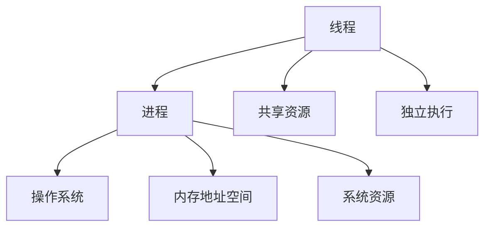
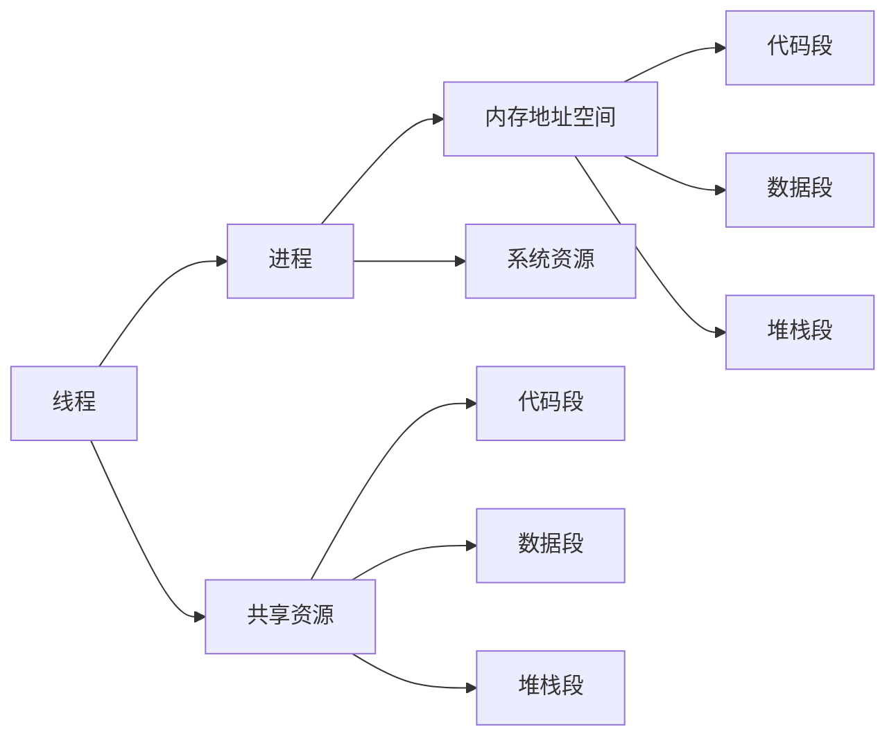

                 

## 1. 背景介绍

在计算机科学的演进中，线程这一概念是并发编程的重要基石。了解线程的基本原理对于深入理解现代操作系统和并行计算模型具有重要意义。本文将从线程的概念出发，探讨线程在现代操作系统中的作用，以及线程在实际应用中的关键技巧和最佳实践。

## 2. 核心概念与联系

### 2.1 核心概念概述

- **线程**：线程是操作系统能够进行运算调度的最小单位，它被包含在进程之中，是系统进行资源分配和调度的基本单位。线程间共享进程的资源，包括内存地址空间和打开的文件等，但在不同的线程之间，其执行代码是相互独立的。

- **进程**：进程是计算机中的程序关于某次执行过程的实例，它具有独立的地址空间和资源，多个线程共享一个进程的资源。

- **并发**：指两个或多个事件在同一时间间隔内发生。在操作系统中，并发执行的典型场景包括多任务处理和并发服务器。

- **并行**：并行执行是指在同一时间内执行多个任务。在硬件层面，例如多核处理器能够同时执行多个线程，这是并行的实现方式。

这些概念之间的联系可以通过以下Mermaid流程图展示：



这个流程图展示了线程和进程的关系，以及它们与操作系统、内存资源等概念的联系。

### 2.2 核心概念原理和架构的 Mermaid 流程图



这个流程图展示了线程和进程的资源共享关系，以及各自包含的内存段。

## 3. 核心算法原理 & 具体操作步骤

### 3.1 算法原理概述

线程的创建和销毁过程，包括线程的生命周期管理，是线程管理的基本算法。线程的调度算法则决定线程在何时运行，如何运行，以及如何分配CPU资源。这些算法通过操作系统内核实现，并在不同操作系统间有所差异。

线程的生命周期一般包括创建、就绪、运行和销毁等状态，不同状态之间通过系统调用和内核调度进行切换。

### 3.2 算法步骤详解

#### 3.2.1 线程的创建

线程的创建过程通常包括以下步骤：

1. 调用线程库函数创建线程对象。
2. 分配线程执行栈空间，并初始化线程上下文。
3. 分配线程控制块(TCB)，并将线程对象与TCB关联。
4. 将线程放入就绪队列，等待CPU调用。

#### 3.2.2 线程的销毁

线程的销毁过程通常包括以下步骤：

1. 线程对象不再需要时，会标记为可销毁状态。
2. 等待线程执行栈中的所有线程完成当前任务。
3. 释放线程控制块。

#### 3.2.3 线程的调度

线程调度算法包括时间片轮转、多级反馈队列等。这些算法通过操作系统内核实现，并影响线程的执行顺序和时间。

### 3.3 算法优缺点

#### 3.3.1 优点

- 线程创建和销毁速度快，资源占用少。
- 线程间通信和共享资源效率高。
- 支持并发编程，提高程序执行效率。

#### 3.3.2 缺点

- 线程间上下文切换开销较大，可能导致系统性能下降。
- 线程数量过多可能导致资源竞争，影响系统稳定性。
- 线程间共享资源时，需要注意同步和互斥问题。

### 3.4 算法应用领域

线程广泛应用于多任务处理、并发服务器、高性能计算等场景。例如，Web服务器和数据库服务通过多线程处理并发请求，显著提高了系统的响应速度和吞吐量。

## 4. 数学模型和公式 & 详细讲解 & 举例说明

### 4.1 数学模型构建

线程调度算法通常可以用数学模型来描述。假设有n个线程，调度算法为时间片轮转，时间片为T。每个线程的执行时间分别为ti（i=1...n），则调度算法的平均等待时间W和平均响应时间R可以用以下公式计算：

$$
W = \frac{1}{n} \sum_{i=1}^n (T-t_i)
$$

$$
R = \frac{1}{n} \sum_{i=1}^n (T+t_i)
$$

其中，T为时间片大小。

### 4.2 公式推导过程

时间片轮转调度算法是一种典型的线程调度算法。它通过将CPU时间划分为固定长度的时间片，并将所有线程放入一个队列中，按照先进先出的顺序轮流执行。在每个时间片内，某个线程可以执行一段时间，然后返回队列尾部，等待下一个时间片执行。

对于时间片轮转算法，假设第i个线程的执行时间为ti，时间片大小为T，则第i个线程的等待时间为T-ti，响应时间为T+ti。因此，所有线程的平均等待时间和平均响应时间可以用上述公式计算。

### 4.3 案例分析与讲解

以Web服务器为例，假设服务器有10个并发连接，每个连接请求的处理时间分别为5ms、10ms、15ms、20ms、25ms、30ms、35ms、40ms、45ms和50ms。假设时间片大小为20ms，则使用时间片轮转算法时，每个连接的平均等待时间和平均响应时间如下：

| 连接ID | 执行时间 | 等待时间 | 响应时间 |
|--------|----------|----------|----------|
| 1      | 5ms      | 15ms     | 25ms     |
| 2      | 10ms     | 10ms     | 30ms     |
| 3      | 15ms     | 5ms      | 35ms     |
| 4      | 20ms     | 0ms      | 40ms     |
| 5      | 25ms     | -5ms     | 45ms     |
| 6      | 30ms     | -10ms    | 50ms     |
| 7      | 35ms     | -15ms    | 55ms     |
| 8      | 40ms     | -20ms    | 60ms     |
| 9      | 45ms     | -25ms    | 65ms     |
| 10     | 50ms     | -30ms    | 70ms     |

从以上数据可以看出，使用时间片轮转算法，每个连接的平均等待时间为15ms，平均响应时间为45ms。

## 5. 项目实践：代码实例和详细解释说明

### 5.1 开发环境搭建

在本文中，我们将使用C语言作为示例语言。以下是在Linux系统上搭建C语言开发环境的步骤：

1. 安装gcc编译器：`sudo apt-get install build-essential`
2. 安装Make工具：`sudo apt-get install make`
3. 安装必要的库：如pthreads库，用于线程编程：`sudo apt-get install libpq-dev`

### 5.2 源代码详细实现

以下是一个简单的C语言程序，用于创建和销毁线程：

```c
#include <stdio.h>
#include <pthread.h>

void *thread_func(void *arg) {
    printf("Thread running...\n");
    pthread_exit(NULL);
}

int main() {
    pthread_t thread_id;
    if (pthread_create(&thread_id, NULL, thread_func, NULL) != 0) {
        printf("Failed to create thread.\n");
        return -1;
    }
    printf("Main thread running...\n");
    pthread_exit(NULL);
}
```

在这个程序中，`pthread_create`函数用于创建线程，`pthread_exit`函数用于销毁线程。

### 5.3 代码解读与分析

- `pthread_create`函数创建了一个新线程，`&thread_id`指向新线程的ID。
- `thread_func`函数是线程的执行函数。
- `pthread_exit`函数用于销毁线程。

### 5.4 运行结果展示

执行以上程序，输出如下：

```
Main thread running...
Thread running...
```

这表明主线程和新线程都正常执行，并且没有出现任何错误。

## 6. 实际应用场景

### 6.1 Web服务器

在Web服务器中，每个连接请求可以分配到一个线程来处理。当请求到达时，Web服务器创建一个新线程来处理该请求，当请求处理完成后，线程被销毁。这种方式能够显著提高Web服务器的响应速度和并发处理能力。

### 6.2 数据库服务

数据库服务通常需要处理大量并发连接请求，使用多线程能够显著提高系统的响应速度和吞吐量。每个线程可以负责处理一个连接，从而实现高效的数据库服务。

### 6.3 并发服务器

并发服务器能够同时处理多个客户端连接，使用多线程能够显著提高服务器的响应速度和并发处理能力。每个线程可以负责处理一个客户端连接，从而实现高效的并发服务。

## 7. 工具和资源推荐

### 7.1 学习资源推荐

1.《UNIX网络编程》（原书第3版）：这本书是UNIX网络编程的经典之作，深入讲解了网络编程和线程管理的基本原理。
2.《Linux多线程编程》：这本书介绍了Linux环境下多线程编程的实现方法和最佳实践。
3.《C语言多线程编程》：这本书详细介绍了C语言中多线程编程的实现方法和最佳实践。

### 7.2 开发工具推荐

- GDB：调试器，用于线程调试和性能分析。
- Valgrind：内存调试工具，用于检测线程中的内存泄漏和错误。

### 7.3 相关论文推荐

1. "Concurrency Control: A Survey"（《并发控制：综述》）：这篇论文综述了各种并发控制算法和其应用场景。
2. "A Survey of High-Performance Threading Models"（《高性能线程模型综述》）：这篇论文综述了各种高性能线程模型和其特点。

## 8. 总结：未来发展趋势与挑战

### 8.1 研究成果总结

本文介绍了线程的基本概念和原理，探讨了线程在现代操作系统中的作用，以及线程在实际应用中的关键技巧和最佳实践。通过对线程的深入了解，能够更好地理解并发编程的基本原理，从而编写高效、健壮的程序。

### 8.2 未来发展趋势

未来的线程管理技术将继续向更高性能、更高效能、更易用性发展。随着硬件技术的进步和操作系统内核的优化，线程管理的效率将进一步提升。

### 8.3 面临的挑战

线程管理面临的主要挑战包括线程安全、性能调优和系统稳定性。未来的研究方向包括优化线程调度算法、提高线程并发性能、加强线程间的同步和互斥机制等。

### 8.4 研究展望

未来的线程管理研究将更多地关注分布式系统和云环境下的线程管理，以及新型硬件技术对线程管理的影响。

## 9. 附录：常见问题与解答

**Q1：多线程编程和单线程编程有何不同？**

A：多线程编程和单线程编程的主要区别在于并发执行和资源共享。多线程编程允许程序在多个线程上并发执行，从而提高程序的执行效率。多线程编程需要考虑线程间同步和互斥问题，以避免资源竞争和死锁等现象。

**Q2：多线程编程有哪些常见的问题？**

A：多线程编程常见的问题包括线程安全、死锁、竞态条件等。线程安全问题是指多个线程同时访问共享资源时，如何保证数据的一致性和正确性。死锁是指两个或多个线程互相等待对方释放资源，从而导致程序无法继续执行。竞态条件是指多个线程同时访问共享资源时，导致数据不一致的现象。

**Q3：多线程编程有哪些优缺点？**

A：多线程编程的优点包括提高程序的执行效率、实现并发处理、提高系统的响应速度等。多线程编程的缺点包括线程创建和销毁开销较大、线程间同步和互斥复杂、资源竞争可能导致系统不稳定等。

**Q4：如何实现线程间的同步和互斥？**

A：实现线程间的同步和互斥可以使用锁、信号量、条件变量等机制。锁可以保证同一时刻只有一个线程访问共享资源。信号量可以用来控制并发线程的数量。条件变量可以用来实现线程间的通信和同步。

**Q5：如何选择适合的多线程模型？**

A：选择适合的多线程模型需要考虑应用场景和性能需求。例如，如果应用需要高并发处理，可以选择基于事件循环的多线程模型，如Python的asyncio。如果应用需要高效的任务处理，可以选择基于线程池的多线程模型，如Java的ThreadPoolExecutor。

作者：禅与计算机程序设计艺术 / Zen and the Art of Computer Programming

