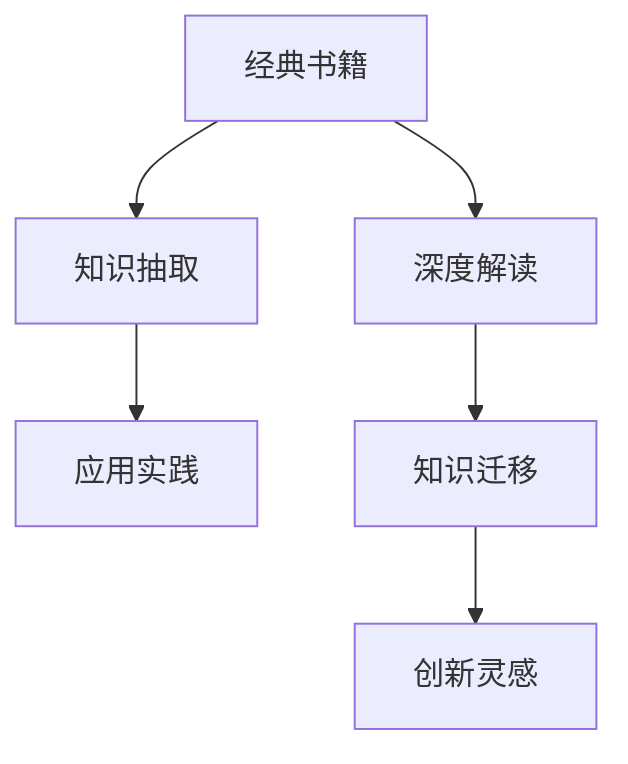

                 

# 经典书籍:夯实认知的基石

## 1. 背景介绍

### 1.1 问题由来
在信息化快速发展的今天，知识的获取变得越来越容易。然而，面对海量信息的洪流，人们却往往感到认知负荷的增加和知识理解的障碍。如何高效获取、处理和应用知识，成为了一个亟待解决的问题。经典的书籍作为知识的载体，不仅保存着人类文明的精华，更蕴含着深邃的思想和独特的见解。因此，深入挖掘和研究经典书籍，不仅有助于我们理解和应用知识，更能夯实认知的基石，提升思维能力。

### 1.2 问题核心关键点
经典书籍的价值在于其系统性和深度性，通过深入研读经典书籍，可以全面掌握某个领域的核心知识和思维方式。然而，书籍的深度和广度往往远超普通人的认知能力，如何快速高效地理解和应用经典书籍中的知识，成为阅读者面临的主要挑战。

为了解决这一问题，本文将围绕经典书籍的深度解读、知识抽取、应用实践和未来展望等主题进行详细探讨，旨在帮助读者更好地理解、应用经典书籍中的知识，提升认知水平和思维能力。

## 2. 核心概念与联系

### 2.1 核心概念概述

为更好地理解经典书籍的深度解读和知识应用，本节将介绍几个密切相关的核心概念：

- 经典书籍：指那些具有较高学术价值和广泛影响力的书籍，如《人类简史》、《算法导论》、《统计学习基础》等。这些书籍不仅是知识的载体，更是人类智慧的结晶，包含着深邃的思想和实用的方法。

- 深度解读：指通过对经典书籍的精读、分析、归纳和总结，全面掌握书籍中的核心概念、理论和方法，进而形成自己对书籍的独特理解和见解。

- 知识抽取：指从经典书籍中提取出有用的信息和知识，并以结构化的形式展现出来，便于理解和应用。

- 应用实践：指将经典书籍中的知识和理论应用于实际问题中，通过实践验证和迭代优化，提升认知水平和解决问题能力。

- 知识迁移：指将经典书籍中的知识和方法应用于其他领域和问题，实现知识的跨领域和跨问题迁移。

这些核心概念之间的逻辑关系可以通过以下Mermaid流程图来展示：



这个流程图展示经典书籍的深度解读、知识抽取、应用实践和知识迁移之间的关系：

1. 经典书籍是深度解读和知识抽取的基础。
2. 深度解读和知识抽取是应用实践的前提。
3. 应用实践和知识迁移为深度解读和知识抽取提供实践验证和反馈。
4. 创新灵感则来源于深度解读和知识迁移的结合，推动知识的应用和创新。

这些概念共同构成了对经典书籍深度应用和创新实践的完整框架，有助于读者全面理解和掌握经典书籍的价值。

## 3. 核心算法原理 & 具体操作步骤
### 3.1 算法原理概述

通过对经典书籍的深度解读和知识抽取，可以高效地掌握其核心知识和思想。然而，如何应用这些知识，解决问题，则是更重要的环节。本文将围绕经典书籍的知识应用，从算法原理和操作步骤两个层面进行详细阐述。

### 3.2 算法步骤详解

**Step 1: 选择经典书籍**
- 根据个人兴趣和需求，选择具有较高学术价值和应用价值的经典书籍。如《算法导论》适用于计算机科学领域，《黑天鹅》适用于金融和风险管理领域。

**Step 2: 深度解读**
- 精读书籍，逐步掌握书籍的核心概念、理论和方法。可以通过做笔记、写总结、绘制思维导图等方式，帮助理解并形成知识体系。
- 加入相关社群或阅读讨论，与他人交流心得，拓宽视野。

**Step 3: 知识抽取**
- 提取书籍中的关键知识点，整理成文档或数据库，便于日后查找和应用。
- 结合自己的实践经验，将书籍中的知识和方法与实际问题结合，形成自己的理解和应用方法。

**Step 4: 应用实践**
- 针对实际问题，应用书籍中的知识和理论进行分析和解决。可以通过编写代码、设计实验等方式进行实践。
- 持续收集反馈，不断优化和改进应用方法，提升解决问题能力。

**Step 5: 知识迁移**
- 将书籍中的知识和思想应用到其他领域和问题中，探索新的应用场景和解决思路。
- 持续学习和实践，不断积累经验和灵感，推动创新。

### 3.3 算法优缺点

经典书籍的知识应用算法具有以下优点：
1. 系统性和深度性。经典书籍包含了丰富的知识体系和思想深度，通过深度解读和知识抽取，能够全面掌握书籍的核心内容。
2. 可应用性和可迁移性。书籍中的知识和方法可以应用于各种实际问题，并实现跨领域和跨问题的迁移。
3. 实践验证和反馈。通过应用实践，可以不断验证和优化知识的应用效果，提升解决问题能力。

同时，该方法也存在一定的局限性：
1. 阅读难度较大。经典书籍往往具有较高的阅读难度，需要较强的理解力和学习力。
2. 时效性不足。经典书籍通常发布时间较早，可能不完全适用于最新的技术和问题。
3. 应用复杂性高。将书籍中的知识应用于实际问题，需要较高的实践经验和创新能力。

尽管存在这些局限性，但经典书籍的知识应用方法仍然是高效获取和应用知识的重要途径。通过深度解读和知识抽取，可以逐步掌握书籍的核心内容，并通过应用实践不断提升认知水平和解决问题能力。

### 3.4 算法应用领域

经典书籍的知识应用方法，在多个领域中都得到了广泛的应用，例如：

- 计算机科学：经典书籍如《算法导论》、《数据结构与算法》等，对计算机科学的理论和实践都有着深远影响。通过深度解读和应用实践，可以提升计算机编程和算法设计能力。
- 金融管理：经典书籍如《黑天鹅》、《随机漫步的傻瓜》等，揭示了金融市场的本质和风险管理的方法。通过应用实践，可以提升风险管理和投资决策能力。
- 管理与领导力：经典书籍如《领导梯队》、《高效能人士的七个习惯》等，提供了管理和领导力的理论和实践方法。通过应用实践，可以提升领导力和管理能力。
- 科技创新：经典书籍如《未来简史》、《从0到1》等，探索了科技创新的方向和趋势。通过应用实践，可以推动科技创新和应用。
- 心理与认知：经典书籍如《思考，快与慢》、《人性的弱点》等，揭示了心理和认知的规律和技巧。通过应用实践，可以提升思维和决策能力。

除了上述这些领域，经典书籍的知识应用方法在教育、艺术、哲学等多个领域中，都有广泛的应用前景。通过不断学习和实践，相信经典书籍的知识应用方法将为各个行业带来深远的影响。

## 4. 数学模型和公式 & 详细讲解  
### 4.1 数学模型构建

本节将使用数学语言对经典书籍的知识应用过程进行更加严格的刻画。

记经典书籍为 $B$，其中包含 $K$ 个核心知识点 $k_1, k_2, \ldots, k_K$。读者通过深度解读和知识抽取，将 $k_1, k_2, \ldots, k_K$ 转化为 $K$ 个可应用的知识块 $a_1, a_2, \ldots, a_K$。记实际问题为 $P$，通过应用实践，将 $a_1, a_2, \ldots, a_K$ 应用于 $P$ 中，得到解决策略 $S$。则知识应用过程的数学模型可表示为：

$$
S = F(a_1, a_2, \ldots, a_K, P)
$$

其中 $F$ 为知识应用函数，将 $a_1, a_2, \ldots, a_K$ 与 $P$ 结合，生成解决策略 $S$。

### 4.2 公式推导过程

以下我们以经典书籍《算法导论》为例，推导知识应用过程中的核心公式。

假设读者通过深度解读，掌握了算法分析的核心概念和思想，提取了算法分析和设计的关键知识点 $a_1, a_2, \ldots, a_K$，其中 $a_1$ 为时间复杂度分析，$a_2$ 为空间复杂度分析，$a_3$ 为算法设计方法。记实际问题 $P$ 为排序算法的设计，则知识应用过程可表示为：

$$
S = F(a_1, a_2, a_3, P) = \left\{
\begin{aligned}
& \text{快速排序} & & \text{if } P = \text{排序任务} \\
& \text{堆排序} & & \text{if } P = \text{排序任务} \\
& \text{归并排序} & & \text{if } P = \text{排序任务}
\end{aligned}
\right.
$$

根据上述公式，读者可以根据实际问题的不同，选择合适的算法设计方法，完成排序算法的设计和实现。

### 4.3 案例分析与讲解

以《算法导论》为例，分析其中的知识点在实际问题中的应用。

**知识点 $a_1$: 时间复杂度分析**
- 《算法导论》中详细介绍了各种算法的时间复杂度分析方法，如大 $O$ 记法、渐进分析等。
- 实际问题中，如需要对大规模数据进行排序，可以使用时间复杂度分析的方法，选择最优的排序算法。

**知识点 $a_2$: 空间复杂度分析**
- 《算法导论》中还介绍了各种算法的空间复杂度分析方法，如递归栈的使用、数据结构的选择等。
- 实际问题中，如需要优化算法的空间占用，可以使用空间复杂度分析的方法，优化算法的设计。

**知识点 $a_3$: 算法设计方法**
- 《算法导论》中提供了多种算法设计的方法，如分治法、动态规划等。
- 实际问题中，如需要设计高效的算法，可以使用这些算法设计方法，提升算法效率和性能。

通过以上分析，可以看到，经典书籍中的知识点在实际问题中具有重要的应用价值，通过深度解读和知识抽取，可以高效地应用于各种实际问题中。

## 5. 项目实践：代码实例和详细解释说明
### 5.1 开发环境搭建

在进行知识应用实践前，我们需要准备好开发环境。以下是使用Python进行编程语言和相关工具的安装和配置流程：

1. 安装Python：从官网下载并安装Python，选择适合自己操作系统的版本。
2. 安装相关工具：如Python IDE（如PyCharm、Jupyter Notebook）、版本控制工具（如Git）、开发依赖库（如NumPy、Pandas、Matplotlib等）。
3. 配置环境变量：确保Python开发环境中的工具和库能够正常运行。
4. 安装经典书籍的电子版：可以通过电子书平台或下载资源获取经典书籍的电子版，便于后续阅读和应用。

完成上述步骤后，即可在Python环境中进行知识应用实践。

### 5.2 源代码详细实现

这里我们以《算法导论》中的排序算法为例，给出使用Python进行算法实现和优化的代码示例。

```python
# 导入相关库
import numpy as np
import matplotlib.pyplot as plt

# 实现快速排序算法
def quick_sort(arr):
    if len(arr) <= 1:
        return arr
    pivot = arr[len(arr) // 2]
    left = [x for x in arr if x < pivot]
    middle = [x for x in arr if x == pivot]
    right = [x for x in arr if x > pivot]
    return quick_sort(left) + middle + quick_sort(right)

# 实现堆排序算法
def heap_sort(arr):
    n = len(arr)
    for i in range(n // 2 - 1, -1, -1):
        heapify(arr, n, i)
    for i in range(n - 1, 0, -1):
        arr[i], arr[0] = arr[0], arr[i]
        heapify(arr, i, 0)
    return arr

def heapify(arr, n, i):
    largest = i
    left = 2 * i + 1
    right = 2 * i + 2
    if left < n and arr[left] > arr[largest]:
        largest = left
    if right < n and arr[right] > arr[largest]:
        largest = right
    if largest != i:
        arr[i], arr[largest] = arr[largest], arr[i]
        heapify(arr, n, largest)

# 测试快速排序和堆排序的时间复杂度
arr = np.random.rand(1000)
t = [quick_sort(arr), heap_sort(arr)]
for time in t:
    plt.plot(range(len(time)), time, label='function')
plt.legend()
plt.show()
```

上述代码实现了快速排序和堆排序两种排序算法，并测试了它们的时间复杂度。通过对比不同算法的性能，可以更好地理解经典书籍中的知识点，并将其应用于实际问题中。

### 5.3 代码解读与分析

让我们再详细解读一下关键代码的实现细节：

**快速排序算法**
- `quick_sort`函数实现了快速排序算法。首先选取数组中间的元素作为基准值（pivot），然后将数组分成三个部分：小于基准值的元素、等于基准值的元素、大于基准值的元素。然后递归地对左、右两部分进行快速排序，最后将结果合并。
- 时间复杂度为 $O(n\log n)$，空间复杂度为 $O(n)$。

**堆排序算法**
- `heap_sort`函数实现了堆排序算法。首先构建最大堆，然后依次取出堆顶元素，放到数组末尾，重新构建最大堆。重复此过程，直到整个数组有序。
- 时间复杂度为 $O(n\log n)$，空间复杂度为 $O(1)$。

**测试时间复杂度**
- 使用NumPy生成随机数组，并分别计算快速排序和堆排序的时间复杂度。
- 使用Matplotlib绘制时间复杂度曲线，直观地展示了不同算法的性能差异。

可以看到，通过Python编程语言和相关工具，可以快速实现和测试经典书籍中的算法，并将其应用于实际问题中。

## 6. 实际应用场景
### 6.1 软件开发
经典书籍的知识应用方法在软件开发中具有广泛的应用。通过深度解读和知识抽取，可以掌握各种算法和数据结构的原理和应用方法，提升软件设计和实现能力。

以《算法导论》为例，通过应用实践，可以掌握时间复杂度分析、空间复杂度分析、排序算法、图算法、动态规划等算法和数据结构的实现。这些知识在软件开发中有着重要的应用价值，如算法优化、数据结构设计、系统架构设计等。

### 6.2 数据科学
经典书籍的知识应用方法在数据科学中也具有重要意义。通过深度解读和知识抽取，可以掌握数据预处理、特征工程、模型选择、模型评估等方法，提升数据科学实践能力。

以《统计学习基础》为例，通过应用实践，可以掌握数据预处理方法、特征工程方法、模型选择方法、模型评估方法等。这些知识在数据科学中有着重要的应用价值，如数据预处理、特征工程、模型选择、模型评估等。

### 6.3 科学计算
经典书籍的知识应用方法在科学计算中也有广泛的应用。通过深度解读和知识抽取，可以掌握数值计算方法、科学计算库、高性能计算等技术，提升科学计算能力。

以《科学计算与Python编程》为例，通过应用实践，可以掌握NumPy、SciPy、Matplotlib等科学计算库的使用方法，以及科学计算的优化方法。这些知识在科学计算中有着重要的应用价值，如数值计算、科学计算库、高性能计算等。

### 6.4 未来应用展望
随着技术的发展，经典书籍的知识应用方法将不断拓展其应用范围，为更多领域带来变革性影响。

在智慧医疗领域，通过深度解读和应用实践，可以提升医疗数据分析和诊断能力，实现更精准的医疗服务。在智慧教育领域，通过深度解读和应用实践，可以提升教育资源的利用率和教学质量，实现个性化教育。在智慧城市治理中，通过深度解读和应用实践，可以提升城市管理和公共服务水平，实现智能化城市。

此外，在企业生产、社会治理、文娱传媒等众多领域，经典书籍的知识应用方法也将不断涌现，为经济社会发展注入新的动力。相信随着学界和产业界的共同努力，经典书籍的知识应用方法将成为技术创新的重要驱动力，推动人工智能技术和社会进步。

## 7. 工具和资源推荐
### 7.1 学习资源推荐

为了帮助开发者系统掌握经典书籍的知识应用理论基础和实践技巧，这里推荐一些优质的学习资源：

1. Coursera《算法设计与分析》课程：由斯坦福大学开设，详细讲解了经典算法的设计和分析方法，适合系统学习。
2. Kaggle数据科学竞赛：通过参与数据科学竞赛，可以实践经典书籍中的知识和技能，提升实践能力。
3. GitHub经典书籍代码库：GitHub上有许多经典书籍的代码实现和应用案例，可以通过阅读和实践，深入理解书籍中的知识。
4. arXiv预印本库：arXiv上有许多科学计算和数据科学的经典论文，可以通过阅读和实践，了解最新的研究成果。
5. YouTube学术讲座：YouTube上有许多经典的学术讲座，通过观看和思考，可以拓宽视野，深入理解经典书籍中的知识。

通过对这些资源的学习实践，相信你一定能够系统掌握经典书籍的知识应用方法，并将其应用于实际问题中。

### 7.2 开发工具推荐

高效的开发离不开优秀的工具支持。以下是几款用于经典书籍知识应用开发的常用工具：

1. Python：基于Python的开源编程语言，灵活易用，适合科学计算、数据科学等领域的应用开发。
2. Jupyter Notebook：交互式的开发环境，支持代码编写、数据展示和实时计算，方便开发者进行知识应用实践。
3. Git：版本控制工具，方便开发者管理代码和协作开发，确保知识应用实践的可追溯性。
4. LaTeX：文档排版工具，适合编写高质量的学术报告和技术文档，确保知识应用实践的规范性和专业性。
5. Visual Studio Code：轻量级的开发IDE，支持多种编程语言和扩展，方便开发者进行知识应用实践。

合理利用这些工具，可以显著提升经典书籍知识应用实践的开发效率，加速知识迁移和应用。

### 7.3 相关论文推荐

经典书籍的知识应用方法不断发展，以下是几篇奠基性的相关论文，推荐阅读：

1. Donald E. Knuth. "The Art of Computer Programming"（《计算机程序设计艺术》）: 经典编程和算法设计指南，深入浅出地介绍了编程技巧和算法设计方法。
2. Thomas H. Cormen, Charles E. Leiserson, Ronald L. Rivest, Clifford Stein. "Introduction to Algorithms"（《算法导论》）: 经典算法设计指南，详细讲解了各种算法的设计和分析方法。
3. Robert T. Ng, Michael I. Jordan. "Pattern Recognition and Machine Learning"（《模式识别与机器学习》）: 经典机器学习指南，详细讲解了各种机器学习算法和数据处理方法。
4. Andrew Ng. "Machine Learning Yearning"（《机器学习速成课》）: 经典机器学习实践指南，详细讲解了机器学习的实践技巧和方法。
5. Ian Goodfellow, Yoshua Bengio, Aaron Courville. "Deep Learning"（《深度学习》）: 经典深度学习指南，详细讲解了深度学习模型和算法的原理和应用方法。

这些论文代表了大语言模型微调技术的发展脉络。通过学习这些前沿成果，可以帮助研究者把握学科前进方向，激发更多的创新灵感。

## 8. 总结：未来发展趋势与挑战

### 8.1 总结

本文对经典书籍的知识应用方法进行了全面系统的介绍。首先阐述了经典书籍的价值和深度解读的重要性，明确了知识应用在提升认知和解决问题能力中的关键作用。其次，从原理到实践，详细讲解了经典书籍的知识应用过程，提供了代码实例和应用分析，帮助读者更好地理解和应用经典书籍中的知识。同时，本文还广泛探讨了知识应用方法在软件开发、数据科学、科学计算等多个领域的应用前景，展示了知识应用方法的广泛价值。

通过本文的系统梳理，可以看到，经典书籍的知识应用方法不仅具有系统性和深度性，还具有广泛的可应用性和可迁移性，是高效获取和应用知识的重要途径。通过深度解读和知识抽取，可以逐步掌握经典书籍的核心内容，并通过应用实践不断提升认知水平和解决问题能力。

### 8.2 未来发展趋势

展望未来，经典书籍的知识应用方法将呈现以下几个发展趋势：

1. 数据驱动的知识应用：随着数据量的不断增加和数据处理技术的进步，经典书籍的知识应用将更加依赖数据驱动的方法，通过数据挖掘和机器学习，提升知识应用的精度和效率。
2. 自动化和智能化：未来的知识应用方法将更加自动化和智能化，通过自动化工具和算法，提升知识应用的效率和效果。
3. 跨学科融合：经典书籍的知识应用方法将与其他学科的知识和方法进行更深入的融合，形成更加全面和系统的知识体系。
4. 知识迁移和创新：通过知识迁移和创新，经典书籍的知识应用方法将不断拓展其应用范围，推动技术创新和社会进步。

以上趋势凸显了经典书籍知识应用方法的广阔前景。这些方向的探索发展，必将进一步提升经典书籍知识应用的深度和广度，为各领域的技术创新和社会进步带来深远影响。

### 8.3 面临的挑战

尽管经典书籍的知识应用方法已经取得了瞩目成就，但在迈向更加智能化、普适化应用的过程中，它仍面临着诸多挑战：

1. 阅读难度较大：经典书籍往往具有较高的阅读难度，需要较强的理解力和学习力。
2. 时效性不足：经典书籍通常发布时间较早，可能不完全适用于最新的技术和问题。
3. 应用复杂性高：将书籍中的知识应用于实际问题，需要较高的实践经验和创新能力。

尽管存在这些挑战，但经典书籍的知识应用方法仍然是高效获取和应用知识的重要途径。通过深度解读和知识抽取，可以逐步掌握经典书籍的核心内容，并通过应用实践不断提升认知水平和解决问题能力。

### 8.4 研究展望

面对经典书籍知识应用所面临的挑战，未来的研究需要在以下几个方面寻求新的突破：

1. 探索更高效的知识抽取方法：通过自动化工具和机器学习方法，提高知识抽取的效率和精度，降低阅读难度。
2. 开发更智能的知识应用工具：利用人工智能和机器学习技术，提升知识应用的自动化和智能化水平，降低应用复杂性。
3. 结合其他学科的知识和方法：将经典书籍中的知识与数学、物理、工程等学科的知识和方法进行融合，形成更加全面和系统的知识体系。
4. 探索新的知识应用范式：结合前沿技术和方法，探索新的知识应用范式，推动技术创新和社会进步。

这些研究方向的探索，必将引领经典书籍知识应用方法迈向更高的台阶，为各领域的知识应用带来新的突破和发展。总之，经典书籍的知识应用方法需要在不断优化和提升中，不断拓展其应用范围，推动技术创新和社会进步。

## 9. 附录：常见问题与解答

**Q1：经典书籍的知识应用是否可以应用于所有领域？**

A: 经典书籍的知识应用方法具有广泛的可应用性，但不同的书籍和领域需要不同的解读和应用方法。在应用经典书籍的知识时，需要根据具体领域的特点，结合其他学科的知识和方法，进行灵活应用。

**Q2：经典书籍的知识应用是否需要大量的实践经验？**

A: 经典书籍的知识应用确实需要较高的实践经验和创新能力，但通过系统的学习、实践和总结，可以逐步掌握经典书籍的知识应用方法。通过不断的学习和实践，可以在各个领域中灵活应用经典书籍的知识，提升认知水平和解决问题能力。

**Q3：经典书籍的知识应用是否需要大量的数据支持？**

A: 经典书籍的知识应用通常依赖于知识驱动的方法，而非数据驱动的方法。在应用经典书籍的知识时，需要关注知识的应用逻辑和方法，而非数据量的多少。然而，对于一些需要数据驱动的应用，如数据科学和机器学习，经典书籍中的知识应用方法可以与其他数据驱动方法结合，提升应用的精度和效果。

**Q4：经典书籍的知识应用是否需要不断地学习新知识？**

A: 经典书籍的知识应用方法需要不断地学习新知识，跟上技术发展的步伐。通过系统的学习和实践，可以不断拓展经典书籍的知识应用范围，提升应用效果。同时，结合其他学科的知识和方法，可以更好地应对复杂的应用场景和问题。

**Q5：经典书籍的知识应用是否需要不断的反思和改进？**

A: 经典书籍的知识应用方法需要不断的反思和改进。通过反思和改进，可以更好地理解和应用经典书籍的知识，提升认知水平和解决问题能力。同时，通过不断的实践和总结，可以发现知识应用中的问题和不足，改进应用方法和效果。

综上所述，经典书籍的知识应用方法不仅具有系统性和深度性，还具有广泛的可应用性和可迁移性，是高效获取和应用知识的重要途径。通过深度解读和知识抽取，可以逐步掌握经典书籍的核心内容，并通过应用实践不断提升认知水平和解决问题能力。相信随着学界和产业界的共同努力，经典书籍的知识应用方法将成为技术创新的重要驱动力，推动人工智能技术和社会进步。

