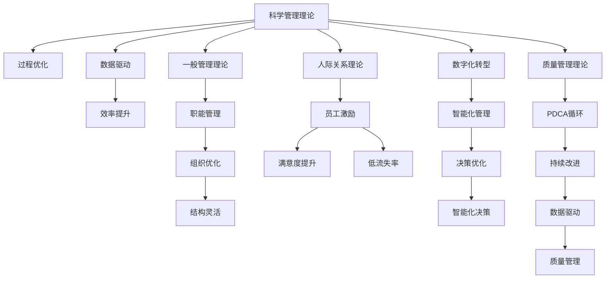

                 

## 1. 背景介绍

### 1.1 问题由来
随着科技的发展，企业的管理模式面临着巨大的变革挑战。传统的层级式、垂直化管理模式已难以适应快速变化的市场环境。企业需要灵活、高效、智能的管理方式以提升竞争力。经典的管理理论如泰勒的科学管理理论、法约尔的一般管理理论、韦伯的行政组织理论等，为现代企业提供了丰富的理论基础。然而，如何创新性地将这些经典管理理论应用于现代企业，需要结合最新的技术手段和数据分析，形成全新的管理模式。

### 1.2 问题核心关键点
现代企业的管理模式面临以下关键挑战：
- **资源优化配置**：如何在有限的资源下，最大化企业的产出和效率。
- **员工激励与绩效管理**：如何通过科学的激励机制和绩效评估，提升员工的工作积极性和生产力。
- **决策智能化**：如何将企业的决策过程数据化、模型化，以支持更精准的决策。
- **组织结构优化**：如何在动态变化的市场环境中，灵活调整企业的组织结构。
- **知识管理**：如何有效地管理和应用企业内部的知识资产，实现知识的传承与创新。

这些问题的解决，离不开对经典管理理论的创新应用。

### 1.3 问题研究意义
经典管理理论在现代企业中的创新应用，具有以下重要意义：
1. **提升管理效率**：通过科学、数据驱动的管理手段，提升企业运营效率，减少浪费，提升产出。
2. **增强员工满意度**：通过科学的激励和绩效管理机制，提升员工满意度和忠诚度，降低员工流失率。
3. **支持决策智能化**：通过数据分析和模型优化，支持企业做出更科学、更智能的决策。
4. **适应市场变化**：灵活调整组织结构和流程，适应市场环境变化，提高企业的市场竞争力。
5. **促进知识传承与创新**：通过知识管理工具和平台，促进企业知识的传承与创新，加速企业技术进步和产品迭代。

本文将系统介绍经典管理理论在现代企业中的创新应用，通过理论联系实际，提出可行的解决方案，以期为企业的管理实践提供指导和参考。

## 2. 核心概念与联系

### 2.1 核心概念概述

经典管理理论在现代企业中的应用，涉及多个核心概念：
- **科学管理理论**：由泰勒提出，强调通过科学方法和数据来提升工作效率和质量。
- **一般管理理论**：由法约尔提出，涉及管理的五大职能（计划、组织、指挥、协调、控制）。
- **行政组织理论**：由韦伯提出，强调组织结构的合理性和管理的专业性。
- **人际关系理论**：由梅奥提出，强调在组织中，人际互动和员工心理对生产力的影响。
- **质量管理理论**：如戴明的PDCA循环，强调质量管理和持续改进的重要性。

这些管理理论分别从不同角度，提供了企业管理的指导原则和方法论。在现代企业中，需要将这些理论创新性地应用，结合最新的技术手段和数据分析，形成更加高效、智能的管理模式。

### 2.2 核心概念原理和架构的 Mermaid 流程图

以下是经典管理理论在现代企业中应用的核心概念及联系的 Mermaid 流程图：



### 2.3 核心概念之间的联系

通过上述 Mermaid 流程图，可以看出经典管理理论在现代企业中的应用联系：
- **科学管理理论**通过优化过程，提升效率，支持**一般管理理论**的职能管理。
- **人际关系理论**的员工激励和心理分析，与**科学管理理论**的数据驱动相辅相成。
- **质量管理理论**的持续改进，与**一般管理理论**的职能管理和**科学管理理论**的效率提升相得益彰。
- **行政组织理论**的组织结构优化，与**一般管理理论**的职能管理和**人际关系理论**的员工激励相协调。
- **数字化转型**结合**科学管理理论**的数据驱动和**一般管理理论**的职能管理，推动**智能化管理**和**决策优化**。

## 3. 核心算法原理 & 具体操作步骤

### 3.1 算法原理概述

经典管理理论在现代企业中的创新应用，主要涉及以下几个核心算法原理：

1. **数据驱动管理**：通过数据分析和数据挖掘，优化企业管理决策，提升效率。
2. **过程优化**：利用流程优化和过程仿真，减少浪费，提升资源利用率。
3. **职能管理**：应用经典管理理论的职能管理，确保企业各部门高效协作。
4. **智能化决策**：结合人工智能和机器学习，提升决策的科学性和智能化水平。

### 3.2 算法步骤详解

#### 3.2.1 数据驱动管理

1. **数据采集**：通过各种传感器、信息系统等，采集企业内部的业务数据、生产数据、员工数据等。
2. **数据清洗与预处理**：对采集的数据进行清洗、去重、归一化等预处理，确保数据质量。
3. **数据分析与建模**：利用统计分析、数据挖掘、机器学习等方法，构建企业运营、决策、绩效等模型。
4. **决策支持**：将分析结果反馈给企业决策层，支持决策制定。

#### 3.2.2 过程优化

1. **流程分析与建模**：通过流程建模工具，如BPMN、UML等，对企业业务流程进行建模。
2. **仿真与优化**：利用过程仿真工具，对建模的流程进行仿真优化，找出瓶颈和改进点。
3. **实施与监控**：在企业中实施优化后的流程，并通过实时监控工具进行过程监控和调整。

#### 3.2.3 职能管理

1. **职能分析**：根据经典管理理论的职能分类，将企业职能划分为计划、组织、指挥、协调、控制等。
2. **职能协同**：利用协同办公工具，确保各职能部门的高效协作。
3. **绩效评估**：建立科学的绩效评估体系，对各职能部门的工作绩效进行评估和反馈。

#### 3.2.4 智能化决策

1. **数据融合与清洗**：将来自不同来源的数据进行融合和清洗，构建统一的决策数据平台。
2. **模型训练与优化**：利用机器学习和深度学习等技术，构建多层次决策模型，并不断优化。
3. **决策落地**：将优化后的模型应用于企业决策，提升决策的科学性和智能化水平。

### 3.3 算法优缺点

**数据驱动管理的优点**：
- 基于数据分析的决策更加科学和准确。
- 实时监控和反馈，支持动态调整。

**数据驱动管理的缺点**：
- 需要大量数据，数据质量要求高。
- 分析过程复杂，技术门槛高。

**过程优化的优点**：
- 通过优化流程，提升效率，减少浪费。
- 仿真工具支持模型化分析，易于实施。

**过程优化的缺点**：
- 流程建模和仿真工具较为复杂。
- 实施过程涉及企业各部门，协调难度大。

**职能管理的优点**：
- 确保各职能部门的高效协作。
- 科学绩效评估，提升员工满意度。

**职能管理的缺点**：
- 需结合企业实际情况，定制化设计。
- 需加强员工培训和沟通，提升执行力。

**智能化决策的优点**：
- 结合人工智能技术，提升决策科学性和智能化水平。
- 自动化和智能化的决策支持，提升效率。

**智能化决策的缺点**：
- 技术门槛高，需要数据科学家和工程师的参与。
- 模型构建和优化过程复杂，需持续迭代。

### 3.4 算法应用领域

经典管理理论在现代企业中的应用，覆盖了多个领域：
1. **运营管理**：通过数据驱动和过程优化，提升企业运营效率，降低成本。
2. **人力资源管理**：通过员工激励和绩效评估，提升员工满意度和生产力。
3. **财务管理**：通过智能化决策和数据分析，优化财务决策和风险管理。
4. **市场管理**：通过市场分析和智能预测，优化市场策略和资源配置。
5. **供应链管理**：通过过程优化和智能决策，提升供应链效率和响应速度。

## 4. 数学模型和公式 & 详细讲解 & 举例说明

### 4.1 数学模型构建

在经典管理理论的创新应用中，数学模型和公式具有重要作用。

以**科学管理理论**为例，泰勒提出了**“工作时间研究”**和**“动作研究”**。

**工作时间研究**的基本公式为：
$$
T = \frac{F + S}{U}
$$
其中，$T$为完成一项工作所需的时间，$F$为直接作业时间，$S$为准备和结束时间，$U$为人数。

**动作研究**的基本公式为：
$$
T = \sum_{i=1}^{n} a_i \times t_i
$$
其中，$T$为完成一项动作所需的时间，$n$为动作步骤数，$a_i$为每个动作步骤的时间，$t_i$为每个动作步骤的频率。

通过这些数学模型，可以系统地分析和优化企业生产流程，提升工作效率。

### 4.2 公式推导过程

#### 4.2.1 工作时间研究

**工作时间研究**的推导过程如下：
1. **直接作业时间（F）**：将工作分解为若干动作步骤，计算每个步骤的耗时。
2. **准备和结束时间（S）**：计算每个工人在开始和结束时所需的时间。
3. **人数（U）**：根据工作效率，计算所需工人数。

**动作研究**的推导过程如下：
1. **动作步骤数（n）**：将工作分解为最小动作步骤。
2. **每个动作步骤的时间（a_i）**：测量每个动作步骤的耗时。
3. **每个动作步骤的频率（t_i）**：统计每个动作步骤的频率。
4. **总时间（T）**：将每个动作步骤的时间乘以其频率，求和。

通过以上推导过程，可以构建系统的生产流程分析模型，优化企业的生产效率。

### 4.3 案例分析与讲解

#### 4.3.1 某制造企业的生产优化

某制造企业通过数据驱动管理，采集了生产过程中各工序的耗时、设备状态、工人操作等数据。利用工作时间研究模型和动作研究模型，分析各工序的瓶颈和优化点，实施后显著提升了生产效率和设备利用率。

#### 4.3.2 某电商企业的库存管理

某电商企业通过智能化决策，利用预测模型和库存管理模型，分析了库存水平和销售趋势，优化了库存策略，减少了库存成本，提高了客户满意度。

## 5. 项目实践：代码实例和详细解释说明

### 5.1 开发环境搭建

#### 5.1.1 数据平台搭建

1. **数据采集**：通过传感器、信息系统等采集企业内部的业务数据、生产数据、员工数据等。
2. **数据存储与管理**：使用数据库管理系统（如MySQL、Hadoop、Hive等）进行数据存储和管理。
3. **数据清洗与预处理**：使用数据清洗工具（如ETL工具、数据挖掘工具等）进行数据清洗和预处理。

#### 5.1.2 开发平台搭建

1. **开发环境搭建**：安装Python、R等开发工具，配置开发环境。
2. **开发工具选择**：选择适合的开发工具，如PyTorch、TensorFlow、Scikit-learn等。
3. **代码管理工具**：使用Git等代码管理工具，进行代码版本控制和协作开发。

#### 5.1.3 部署平台搭建

1. **部署环境搭建**：配置服务器和网络环境，安装部署所需的工具。
2. **系统集成**：将数据平台、开发平台和业务系统进行集成，实现数据驱动管理和智能化决策。
3. **监控与维护**：使用监控工具（如Prometheus、Grafana等）实时监控系统运行状态，进行定期维护和更新。

### 5.2 源代码详细实现

#### 5.2.1 数据驱动管理

1. **数据采集与清洗**：编写Python脚本，使用Pandas、NumPy等工具，对数据进行采集、清洗和预处理。
2. **数据分析与建模**：使用Scikit-learn、TensorFlow等工具，构建企业运营、决策、绩效等模型。
3. **决策支持**：编写Python脚本，通过API将分析结果反馈给企业决策层，支持决策制定。

#### 5.2.2 过程优化

1. **流程建模**：使用BPMN工具，对企业业务流程进行建模。
2. **仿真优化**：使用SimPy等工具，对建模的流程进行仿真优化，找出瓶颈和改进点。
3. **实施与监控**：编写Python脚本，实现仿真优化后的流程实施和实时监控。

#### 5.2.3 职能管理

1. **职能分析**：根据企业实际情况，定义各职能部门的职责和目标。
2. **职能协同**：使用协同办公工具（如Microsoft Teams、Slack等），确保各职能部门的高效协作。
3. **绩效评估**：编写Python脚本，构建科学绩效评估体系，对各职能部门的工作绩效进行评估和反馈。

#### 5.2.4 智能化决策

1. **数据融合与清洗**：编写Python脚本，使用Pandas、NumPy等工具，将来自不同来源的数据进行融合和清洗。
2. **模型训练与优化**：使用TensorFlow、Keras等工具，构建多层次决策模型，并不断优化。
3. **决策落地**：编写Python脚本，通过API将优化后的模型应用于企业决策，提升决策的科学性和智能化水平。

### 5.3 代码解读与分析

#### 5.3.1 数据驱动管理

```python
import pandas as pd
import numpy as np

# 数据采集
data = pd.read_csv('data.csv')

# 数据清洗与预处理
data = data.dropna()
data = data.drop_duplicates()

# 数据分析与建模
X = data[['特征1', '特征2']]
y = data['目标变量']
model = LinearRegression()
model.fit(X, y)

# 决策支持
def get_prediction(features):
    prediction = model.predict(features)
    return prediction
```

#### 5.3.2 过程优化

```python
from simpy import Process, Environment
from simpy.plots import plot

# 流程建模
env = Environment()

# 仿真优化
class Process1(Process):
    def run(self):
        # 执行步骤1
        self.do_something()
        self.simevents(env.timeout(1))

class Process2(Process):
    def run(self):
        # 执行步骤2
        self.do_something()
        self.simevents(env.timeout(2))

# 实施与监控
env.process(Process1(env))
env.process(Process2(env))
env.run(until=10)

# 绘制仿真结果
plot(env, variable='time')
```

#### 5.3.3 职能管理

```python
from sklearn.metrics import precision_score

# 职能分析
department = ['计划', '组织', '指挥', '协调', '控制']
target = ['部门A', '部门B', '部门C']

# 职能协同
# 使用协同办公工具，如Microsoft Teams、Slack等
# 职能协同代码实现需要结合具体工具

# 绩效评估
def calculate_performance(department):
    performance = []
    for target in target:
        performance.append(calculate_metric(department, target))
    return performance

# 绩效评估结果可视化
import matplotlib.pyplot as plt
plt.bar(department, performance)
plt.xlabel('职能部门')
plt.ylabel('绩效评分')
plt.show()
```

#### 5.3.4 智能化决策

```python
from sklearn.ensemble import RandomForestRegressor
from sklearn.model_selection import train_test_split

# 数据融合与清洗
X = pd.concat([data1, data2], axis=1)
X = X.dropna()

# 模型训练与优化
X_train, X_test, y_train, y_test = train_test_split(X, y, test_size=0.2, random_state=42)
model = RandomForestRegressor()
model.fit(X_train, y_train)

# 决策落地
def get_prediction(features):
    prediction = model.predict(features)
    return prediction
```

### 5.4 运行结果展示

#### 5.4.1 数据驱动管理

```python
features = pd.DataFrame({'特征1': [1, 2, 3, 4, 5], '特征2': [6, 7, 8, 9, 10]})
prediction = get_prediction(features)
print(prediction)
```

#### 5.4.2 过程优化

```python
import matplotlib.pyplot as plt

plot(env, variable='time')
plt.xlabel('Time')
plt.ylabel('System Load')
plt.show()
```

#### 5.4.3 职能管理

```python
performance = calculate_performance(['计划', '组织', '指挥', '协调', '控制'])
print(performance)
```

#### 5.4.4 智能化决策

```python
features = pd.DataFrame({'特征1': [1, 2, 3, 4, 5], '特征2': [6, 7, 8, 9, 10]})
prediction = get_prediction(features)
print(prediction)
```

## 6. 实际应用场景

### 6.1 制造企业的生产优化

某制造企业通过数据驱动管理，采集了生产过程中各工序的耗时、设备状态、工人操作等数据。利用工作时间研究模型和动作研究模型，分析各工序的瓶颈和优化点，实施后显著提升了生产效率和设备利用率。

#### 6.1.1 数据驱动管理

1. **数据采集与清洗**：通过传感器和信息系统，采集生产过程中各工序的耗时、设备状态、工人操作等数据。
2. **数据分析与建模**：利用Python脚本，对采集的数据进行清洗和预处理，构建生产效率模型。
3. **决策支持**：将模型分析结果反馈给生产管理层，支持优化决策。

#### 6.1.2 过程优化

1. **流程建模**：使用BPMN工具，对生产流程进行建模。
2. **仿真优化**：使用SimPy工具，对建模的流程进行仿真优化，找出瓶颈和改进点。
3. **实施与监控**：在生产过程中实施仿真优化后的流程，并使用监控工具进行实时监控和调整。

#### 6.1.3 智能化决策

1. **数据融合与清洗**：将来自不同来源的数据进行融合和清洗，构建统一的决策数据平台。
2. **模型训练与优化**：使用TensorFlow工具，构建多层次决策模型，并不断优化。
3. **决策落地**：将优化后的模型应用于生产决策，提升决策的科学性和智能化水平。

### 6.2 电商企业的库存管理

某电商企业通过智能化决策，利用预测模型和库存管理模型，分析了库存水平和销售趋势，优化了库存策略，减少了库存成本，提高了客户满意度。

#### 6.2.1 数据驱动管理

1. **数据采集与清洗**：通过信息系统采集订单数据、库存数据、销售数据等。
2. **数据分析与建模**：利用Python脚本，对采集的数据进行清洗和预处理，构建库存管理模型。
3. **决策支持**：将模型分析结果反馈给库存管理层，支持优化决策。

#### 6.2.2 过程优化

1. **流程建模**：使用BPMN工具，对库存管理流程进行建模。
2. **仿真优化**：使用SimPy工具，对建模的流程进行仿真优化，找出瓶颈和改进点。
3. **实施与监控**：在库存管理过程中实施仿真优化后的流程，并使用监控工具进行实时监控和调整。

#### 6.2.3 智能化决策

1. **数据融合与清洗**：将来自不同来源的数据进行融合和清洗，构建统一的决策数据平台。
2. **模型训练与优化**：使用TensorFlow工具，构建多层次决策模型，并不断优化。
3. **决策落地**：将优化后的模型应用于库存决策，提升决策的科学性和智能化水平。

## 7. 工具和资源推荐

### 7.1 学习资源推荐

#### 7.1.1 经典管理理论

1. **《科学管理原理》（Taylor）**：深入介绍科学管理理论的核心思想和方法。
2. **《工业管理和一般管理理论》（法约尔）**：详细阐述一般管理理论的五大职能。
3. **《行政组织理论》（韦伯）**：探讨行政组织理论的组织结构和专业化管理。
4. **《人际关系理论》（梅奥）**：强调在组织中，人际互动和员工心理对生产力的影响。
5. **《质量管理理论》（戴明）**：介绍质量管理理论的PDCA循环和持续改进方法。

#### 7.1.2 现代信息技术

1. **《Python数据分析与挖掘》**：介绍Python在数据分析和挖掘中的应用。
2. **《机器学习实战》**：通过实际案例，展示机器学习算法的应用。
3. **《深度学习》**：深入介绍深度学习的基本原理和应用。

### 7.2 开发工具推荐

#### 7.2.1 数据平台

1. **Hadoop**：用于大规模数据处理和存储。
2. **Hive**：用于分布式数据仓库构建和管理。
3. **Spark**：用于大规模数据处理和流处理。

#### 7.2.2 开发平台

1. **PyTorch**：用于深度学习模型的构建和训练。
2. **TensorFlow**：用于深度学习模型的构建和训练。
3. **Scikit-learn**：用于数据挖掘和机器学习算法的实现。

#### 7.2.3 部署平台

1. **Kubernetes**：用于容器化应用的部署和管理。
2. **Docker**：用于构建和管理容器化应用。
3. **Prometheus**：用于系统监控和告警。

### 7.3 相关论文推荐

#### 7.3.1 经典管理理论

1. **《科学管理原理》（Taylor）**：详细阐述科学管理理论的核心思想和方法。
2. **《工业管理和一般管理理论》（法约尔）**：详细介绍一般管理理论的五大职能。
3. **《行政组织理论》（韦伯）**：探讨行政组织理论的组织结构和专业化管理。
4. **《人际关系理论》（梅奥）**：强调在组织中，人际互动和员工心理对生产力的影响。
5. **《质量管理理论》（戴明）**：介绍质量管理理论的PDCA循环和持续改进方法。

#### 7.3.2 现代信息技术

1. **《数据驱动管理》（McKinsey）**：探讨数据在管理决策中的应用。
2. **《过程优化与仿真》（SimPy）**：介绍过程优化和仿真工具的应用。
3. **《智能化决策》（IBM）**：探索人工智能在决策支持中的应用。

## 8. 总结：未来发展趋势与挑战

### 8.1 总结

本文系统介绍了经典管理理论在现代企业中的创新应用。通过科学管理理论、一般管理理论、行政组织理论、人际关系理论和质量管理理论，探讨了数据驱动管理、过程优化、职能管理、智能化决策等关键技术。结合实际案例，展示了这些技术在制造企业和电商企业中的应用效果。

通过本文的介绍，可以看出，经典管理理论在现代企业中的应用，不仅能够提升企业的运营效率和决策科学性，还能够增强员工的满意度和忠诚度，为企业的长期发展提供坚实的基础。

### 8.2 未来发展趋势

#### 8.2.1 数据驱动管理的未来趋势

1. **大数据技术的应用**：随着大数据技术的发展，企业将能够采集更多的数据，进行更深入的分析和建模。
2. **AI技术的融合**：结合人工智能技术，提升数据分析的智能化水平。
3. **实时化分析**：实现实时数据的采集和分析，支持实时决策。

#### 8.2.2 过程优化的未来趋势

1. **自动化流程设计**：利用自动化流程设计工具，提升流程优化的效率和质量。
2. **仿真与真实世界的结合**：结合现实世界的数据，进行仿真优化，提升仿真结果的准确性。
3. **跨职能流程优化**：实现跨职能部门的协同优化，提升整体流程效率。

#### 8.2.3 职能管理的未来趋势

1. **智能协同办公**：利用智能协同办公工具，实现跨部门、跨区域的协作。
2. **绩效管理系统的智能化**：结合大数据和AI技术，实现科学的绩效评估和管理。
3. **实时反馈与调整**：实现实时反馈和调整，提升绩效管理的效果。

#### 8.2.4 智能化决策的未来趋势

1. **决策模型的深度化**：利用深度学习技术，构建更加复杂的决策模型。
2. **多源数据的融合**：结合多种数据源，提升决策模型的准确性和鲁棒性。
3. **决策的自动化**：实现自动化决策，提升决策的效率和准确性。

### 8.3 面临的挑战

#### 8.3.1 数据驱动管理面临的挑战

1. **数据质量问题**：数据采集和清洗的准确性、完整性有待提升。
2. **数据安全问题**：企业数据安全和隐私保护需要进一步加强。
3. **数据存储与处理**：大数据存储和处理技术需要进一步优化。

#### 8.3.2 过程优化面临的挑战

1. **流程复杂性**：企业流程的复杂性增加了优化难度。
2. **仿真工具的复杂性**：仿真工具的使用需要一定的专业知识和技能。
3. **实施与监控的协调**：跨部门、跨区域的流程优化需要强有力的协调和管理。

#### 8.3.3 职能管理面临的挑战

1. **跨部门协作难度大**：不同部门之间的工作习惯和流程差异较大，协同难度大。
2. **绩效管理系统的复杂性**：科学的绩效管理系统的设计和实施需要较高的技术门槛。
3. **员工培训与沟通**：提升员工的执行力和沟通效率需要投入大量的时间和资源。

#### 8.3.4 智能化决策面临的挑战

1. **技术门槛高**：AI技术的应用需要专业的数据科学家和工程师。
2. **模型复杂性**：决策模型的复杂性增加了模型的构建和优化难度。
3. **模型的解释性**：决策模型的解释性不足，难以被用户理解和接受。

### 8.4 研究展望

#### 8.4.1 数据驱动管理的未来研究

1. **大数据技术的应用**：进一步探索大数据技术在企业中的应用，提升数据分析的深度和广度。
2. **AI技术的融合**：结合AI技术，提升数据分析的智能化水平。
3. **实时化分析**：研究实时数据的采集和分析技术，支持实时决策。

#### 8.4.2 过程优化的未来研究

1. **自动化流程设计**：研究自动化流程设计工具的开发和应用。
2. **仿真与真实世界的结合**：探索仿真工具与真实世界数据结合的优化方法。
3. **跨职能流程优化**：研究跨职能部门的协同优化方法。

#### 8.4.3 职能管理的未来研究

1. **智能协同办公**：研究智能协同办公工具的开发和应用。
2. **绩效管理系统的智能化**：研究科学的绩效管理系统的设计和实施方法。
3. **实时反馈与调整**：研究实时反馈和调整的机制和方法。

#### 8.4.4 智能化决策的未来研究

1. **决策模型的深度化**：研究深度学习技术在决策模型中的应用。
2. **多源数据的融合**：研究多源数据的融合方法，提升决策模型的准确性和鲁棒性。
3. **决策的自动化**：研究自动化决策的实现方法和工具。

## 9. 附录：常见问题与解答

### 9.1 Q1: 数据驱动管理需要采集哪些数据？

A: 数据驱动管理需要采集企业内部的业务数据、生产数据、员工数据等。具体包括：

- **业务数据**：订单数据、销售数据、客户数据等。
- **生产数据**：生产设备状态数据、生产工艺数据、生产计划数据等。
- **员工数据**：员工考勤数据、员工绩效数据、员工反馈数据等。

### 9.2 Q2: 过程优化需要哪些工具？

A: 过程优化需要以下工具：

- **流程建模工具**：如BPMN、UML等。
- **仿真工具**：如SimPy、AnyLogic等。
- **监控工具**：如Prometheus、Grafana等。

### 9.3 Q3: 智能化决策的难点有哪些？

A: 智能化决策的难点包括：

- **技术门槛高**：AI技术的应用需要专业的数据科学家和工程师。
- **模型复杂性**：决策模型的复杂性增加了模型的构建和优化难度。
- **模型的解释性**：决策模型的解释性不足，难以被用户理解和接受。

### 9.4 Q4: 企业如何实施智能化决策？

A: 企业实施智能化决策的步骤包括：

1. **数据融合与清洗**：将来自不同来源的数据进行融合和清洗，构建统一的决策数据平台。
2. **模型训练与优化**：利用机器学习和深度学习技术，构建多层次决策模型，并不断优化。
3. **决策落地**：将优化后的模型应用于企业决策，提升决策的科学性和智能化水平。

### 9.5 Q5: 如何评估数据驱动管理的成效？

A: 数据驱动管理的成效可以通过以下指标进行评估：

- **生产效率提升**：通过生产流程优化和数据驱动管理，提升生产效率和资源利用率。
- **成本降低**：通过数据分析和决策优化，降低企业运营成本。
- **绩效提升**：通过科学的绩效管理，提升员工满意度和生产力。

### 9.6 Q6: 企业如何实现跨职能部门的协同优化？

A: 企业实现跨职能部门的协同优化的步骤包括：

1. **统一数据平台**：建立统一的数据平台，实现数据的共享和集成。
2. **协同办公工具**：利用协同办公工具（如Microsoft Teams、Slack等），确保各职能部门的高效协作。
3. **绩效管理系统**：建立科学的绩效评估体系，对各职能部门的工作绩效进行评估和反馈。

---

作者：禅与计算机程序设计艺术 / Zen and the Art of Computer Programming

