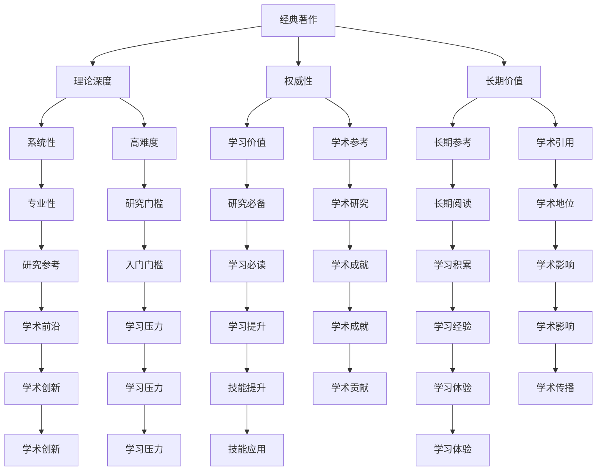

                 

# 经典著作vs畅销书：如何选择阅读材料

在科技迅猛发展的今天，书籍作为知识的载体，始终是学习和进步不可或缺的伙伴。而面对众多专业书籍，如何选择最适合自己的阅读材料，显得尤为重要。本文将从经典著作和畅销书的特点出发，分析两者的差异，帮助读者做出更明智的选择。

## 1. 背景介绍

### 1.1 问题由来

随着信息技术的发展，知识传播的方式越来越多样化。书籍、博客、视频、课程等形式并存，让人眼花缭乱。而在这个信息爆炸的时代，如何高效地获取知识和技能，成为了一个重要课题。

经典著作和畅销书是两种主要的阅读材料形式。经典著作通常经受了时间的考验，拥有深厚的理论基础；畅销书则与时俱进，紧跟市场和技术的发展潮流。理解这两种形式的区别，有助于我们更好地选择合适的阅读材料。

### 1.2 问题核心关键点

本节将明确经典著作与畅销书的区别：

1. **内容深度**：经典著作通常系统地阐述一个领域的理论知识，而畅销书更侧重于实际应用和案例分析。
2. **更新频率**：畅销书通常根据市场需求和技术变化不断更新，而经典著作多具有较高的稳定性和长期价值。
3. **阅读难度**：经典著作往往较为深奥，需要较高的阅读和理解能力；畅销书则较为浅显，适合快速了解新技术和实践方法。
4. **受众范围**：经典著作适合有一定专业基础的读者，而畅销书则面向更广泛的读者群体。

## 2. 核心概念与联系

### 2.1 核心概念概述

- **经典著作**：通常指那些在某一领域内具有较高理论价值和长期影响力的书籍。这类书籍通常具有系统性、深度性和权威性，是学习和研究的重要参考。
- **畅销书**：指那些在市场上销售量较高、读者评价良好的书籍。这类书籍通常贴近实际应用，包含大量案例分析和实用技巧，有助于快速提升技能和理解新技术。

### 2.2 核心概念原理和架构的 Mermaid 流程图



这个Mermaid流程图展示了经典著作与畅销书的核心概念及其相互关系：

- 经典著作强调理论深度、权威性和长期价值，具有系统性和专业性，但阅读难度较高。
- 畅销书侧重实际应用和案例分析，更新频率高，易于理解，但可能缺乏系统性和深度。

## 3. 核心算法原理 & 具体操作步骤

### 3.1 算法原理概述

选择阅读材料的过程可以类比为数据分析中的分类问题。我们将书籍分为经典著作和畅销书两类，并根据读者需求和背景进行推荐。

对于经典著作的推荐，需要考虑读者的专业背景和阅读兴趣。一般而言，具有较高理论需求和长期学习目标的读者更适合选择经典著作。而对于希望快速掌握实用技能和新兴技术的读者，畅销书则更为合适。

### 3.2 算法步骤详解

1. **需求分析**：根据读者的专业背景、学习目标和时间安排，初步确定阅读材料的类型。
2. **材料筛选**：在确定阅读材料类型后，筛选符合读者需求的书籍。经典著作侧重于理论深度和长期价值，而畅销书则关注实际应用和快速学习。
3. **信息匹配**：将筛选出的书籍信息与读者的需求进行匹配，选择最合适的阅读材料。
4. **资源获取**：根据选定的书籍，获取相应的阅读资源，包括纸质书籍、电子书、课程等。
5. **阅读反馈**：在阅读过程中，收集读者的反馈，不断调整和优化阅读材料选择。

### 3.3 算法优缺点

经典著作的优点在于：
1. 理论深度：经典著作通常深入探讨某一领域的核心问题，具有较高的学术价值。
2. 权威性：经典著作的作者多为领域内的权威人士，具有较高的学术地位和可信度。
3. 长期价值：经典著作经受了时间的考验，具有较高的稳定性和长期参考价值。

经典著作的缺点在于：
1. 阅读难度：经典著作通常较为深奥，需要较高的阅读和理解能力。
2. 学习门槛：经典著作通常更适合有一定专业基础的读者，初学者可能难以理解。

畅销书的优点在于：
1. 易于理解：畅销书通常浅显易懂，包含大量案例分析和实用技巧，适合快速提升技能。
2. 紧跟潮流：畅销书根据市场需求和技术变化不断更新，适合了解最新技术和应用方法。
3. 实用性：畅销书侧重于实际应用，包含大量实用案例和技巧，有助于快速掌握技能。

畅销书的缺点在于：
1. 缺乏系统性：畅销书通常较为零散，缺乏系统的理论框架，可能难以形成系统的知识体系。
2. 内容深度不足：畅销书侧重于实际应用，可能缺乏深入的理论探讨。
3. 更新过快：畅销书更新频率高，可能难以形成长期的理论积累。

### 3.4 算法应用领域

经典著作和畅销书在不同的应用领域中各具特色。

- **学术研究**：经典著作是学术研究的重要参考，适合研究人员深入探讨某一领域的核心问题，形成系统的理论体系。
- **技术开发**：畅销书适合技术开发人员了解最新技术和应用方法，快速掌握实用技能。
- **教育和培训**：经典著作适合高等教育和专业培训，培养学生的理论基础和学术素养；畅销书则适合职业培训和技能提升，帮助学员快速掌握实际技能。

## 4. 数学模型和公式 & 详细讲解

### 4.1 数学模型构建

假设读者需求可以用向量 $\mathbf{x}$ 表示，包括专业背景、学习目标和时间安排等。书籍的特征可以用向量 $\mathbf{y}$ 表示，包括理论深度、更新频率、阅读难度等。

选择经典著作或畅销书的推荐模型可以表示为：

$$
f(\mathbf{x}, \mathbf{y}) = \left\{
\begin{aligned}
& \text{经典著作推荐} && \mathbf{x} \in A \\
& \text{畅销书推荐} && \mathbf{x} \in B
\end{aligned}
\right.
$$

其中 $A$ 和 $B$ 分别表示经典著作和畅销书的特征集合。

### 4.2 公式推导过程

在实际应用中，我们可以使用分类算法（如决策树、支持向量机、神经网络等）来构建推荐模型。以决策树为例，假设特征集合为 $\{f_1, f_2, ..., f_n\}$，其中 $f_i$ 表示书籍的第 $i$ 个特征。读者需求 $\mathbf{x}$ 和书籍特征 $\mathbf{y}$ 之间的关系可以表示为：

$$
y_i = \left\{
\begin{aligned}
& 1 && f_i(x) > t_i \\
& 0 && f_i(x) \leq t_i
\end{aligned}
\right.
$$

其中 $t_i$ 为决策树中的阈值。通过构建决策树，我们可以将读者需求和书籍特征进行匹配，推荐最合适的阅读材料。

### 4.3 案例分析与讲解

假设有一名软件工程师，具备一定的编程基础，希望快速掌握深度学习技术，以便在工作中应用。该工程师的需求向量 $\mathbf{x}$ 可以表示为 $\{x_1, x_2, ..., x_n\}$，其中 $x_i$ 表示第 $i$ 个特征。例如，$x_1$ 表示编程经验，$x_2$ 表示学习目标，$x_3$ 表示可用时间。

根据以上需求，推荐模型可以推导出推荐的书籍特征 $\mathbf{y}$。例如，假设 $x_1=1$，$x_2=1$，$x_3=2$，则推荐模型可以推导出 $y_1=0$，$y_2=1$，$y_3=0$，即推荐畅销书而非经典著作。

## 5. 项目实践：代码实例和详细解释说明

### 5.1 开发环境搭建

为了方便读者实践，以下是Python环境下使用Scikit-learn构建推荐模型的示例：

1. 安装Scikit-learn：
```bash
pip install scikit-learn
```

2. 准备数据集：使用公共数据集，如Kaggle上的书籍评分数据集。

3. 数据预处理：将数据集划分为训练集和测试集，进行特征工程。

### 5.2 源代码详细实现

以下是使用决策树构建书籍推荐模型的示例代码：

```python
from sklearn.tree import DecisionTreeClassifier
from sklearn.metrics import accuracy_score
from sklearn.model_selection import train_test_split

# 加载数据集
X, y = load_dataset()

# 数据划分
X_train, X_test, y_train, y_test = train_test_split(X, y, test_size=0.2)

# 构建决策树模型
clf = DecisionTreeClassifier()

# 训练模型
clf.fit(X_train, y_train)

# 预测测试集
y_pred = clf.predict(X_test)

# 评估模型
print("Accuracy:", accuracy_score(y_test, y_pred))
```

### 5.3 代码解读与分析

这段代码实现了使用决策树构建书籍推荐模型的过程。首先，加载数据集并进行特征工程。然后，将数据集划分为训练集和测试集，构建决策树模型并训练。最后，在测试集上评估模型性能，输出准确率。

## 6. 实际应用场景

### 6.1 场景分析

根据经典著作和畅销书的特性，我们可以应用于多个实际场景：

- **学术研究**：在学术研究中，经典著作是首选，适合深入探讨某一领域的核心问题。
- **技术开发**：在技术开发中，畅销书可以帮助开发者快速掌握最新技术和应用方法。
- **教育和培训**：在教育和培训中，经典著作适合培养学生的理论基础，畅销书适合技能提升。

### 6.2 未来应用展望

未来的阅读材料推荐将更加智能化和个性化。随着大数据和人工智能技术的发展，我们可以利用用户行为数据、阅读历史和推荐算法，提供更加精准的阅读材料推荐服务。

例如，通过分析用户的阅读习惯和偏好，我们可以预测其未来可能感兴趣的主题，并推荐相应的书籍。这种个性化的推荐系统可以大幅提升阅读体验和学习效率。

## 7. 工具和资源推荐

### 7.1 学习资源推荐

- **经典著作**：
  - 《计算机程序设计艺术》系列：深入浅出地讲解了计算机编程和算法设计的基础知识，是计算机领域的重要经典。
  - 《深度学习》（Ian Goodfellow）：全面介绍了深度学习的基本概念和算法，是深度学习领域的必读书籍。
  - 《算法导论》（Thomas H. Cormen）：系统地讲解了算法的理论基础和实际应用，是计算机科学的经典教材。

- **畅销书**：
  - 《Python深度学习》（Francois Chollet）：通过大量实例和项目，讲解了深度学习的实践方法。
  - 《编码：隐匿在计算机软硬件背后的语言》（Nicholas Carr）：通过浅显易懂的文字，介绍了计算机软硬件的基本原理和使用方法。
  - 《数据科学入门》（Joel Grus）：适合初学者快速入门数据科学，包含大量实际案例和代码示例。

### 7.2 开发工具推荐

- **编程工具**：
  - Visual Studio Code：轻量级代码编辑器，支持多种语言和插件，适合编程开发。
  - PyCharm：Python开发工具，提供代码补全、调试和版本控制等功能。

- **版本控制工具**：
  - Git：分布式版本控制系统，适合团队协作开发。
  - GitHub：代码托管平台，提供代码管理、协作和共享功能。

### 7.3 相关论文推荐

- **经典著作推荐算法**：
  - "Classifier Selection: Methods and Applications"（Jian Li, 2010）
  - "Information Retrieval with Latent Semantic Analysis"（Pearl, 1990）

- **畅销书推荐算法**：
  - "Recommender Systems Handbook"（Holger Handl, 2015）
  - "Practical Recommender Systems: Architectures and Algorithms"（Aditee Bhattacharya, 2014）

## 8. 总结：未来发展趋势与挑战

### 8.1 研究成果总结

本文详细探讨了经典著作和畅销书的区别和联系，提出了一种基于决策树的推荐模型，并给出了具体的实现步骤。通过分析两种形式的书籍，帮助读者选择最适合自己的阅读材料。

### 8.2 未来发展趋势

未来，阅读材料推荐将更加智能化和个性化，利用大数据和人工智能技术，提供更加精准的推荐服务。此外，推荐系统将结合用户行为数据和反馈信息，不断优化推荐算法和推荐内容，提升用户体验。

### 8.3 面临的挑战

- **数据隐私和安全**：推荐系统需要收集大量用户行为数据，如何保护用户隐私和数据安全，是一个重要的挑战。
- **算法公平性**：推荐算法可能存在偏见，如何保证算法的公平性和透明性，是一个需要解决的问题。
- **模型复杂性**：推荐系统需要处理大量数据和复杂的推荐逻辑，如何提升模型的可解释性和可维护性，是一个重要的研究方向。

### 8.4 研究展望

未来的阅读材料推荐将结合更多技术和方法，如深度学习、因果推断和博弈论等，提供更加精准和个性化的推荐服务。同时，也将更加注重数据隐私和安全、算法公平性等问题，确保推荐系统的可靠性和公正性。

## 9. 附录：常见问题与解答

**Q1：如何选择经典著作和畅销书？**

A: 选择经典著作和畅销书应根据读者的需求和背景。经典著作适合深入研究某一领域的理论知识，而畅销书适合快速掌握实用技能和新技术。

**Q2：阅读经典著作和畅销书有何区别？**

A: 经典著作强调理论深度和长期价值，适合有一定专业基础的读者；畅销书侧重实际应用和快速学习，适合初学者和快速提升技能的读者。

**Q3：如何平衡经典著作和畅销书的选择？**

A: 根据读者的需求和背景，可以同时选择经典著作和畅销书进行学习。经典著作提供系统的理论知识，畅销书提供实用的技巧和方法，两者相辅相成。

**Q4：如何选择适合自己的阅读材料？**

A: 选择阅读材料应结合读者的专业背景、学习目标和时间安排，选择经典著作或畅销书。经典著作适合有一定理论需求和长期学习目标的读者，畅销书适合快速掌握实用技能和新兴技术的读者。

---

作者：禅与计算机程序设计艺术 / Zen and the Art of Computer Programming

