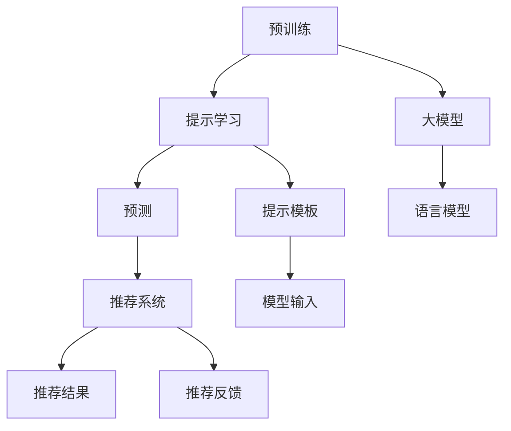

                 

# 统一的大模型推荐范式P5:预训练、提示、预测

## 1. 背景介绍

### 1.1 问题由来

随着深度学习技术的快速发展，预训练大模型已经在多个领域展示了其强大的能力。例如，BERT、GPT-3等大型语言模型已经被广泛应用于文本分类、机器翻译、对话系统等任务中，并且在精度上超过了以往的传统模型。

然而，由于大模型的复杂性和资源需求，其训练和部署都面临着巨大的挑战。此外，尽管预训练模型在通用性方面表现出色，但在特定领域的推荐任务中，其效果往往不尽人意。这主要是因为预训练模型需要大量的数据来进行训练，而某些领域的数据相对稀缺，因此无法充分发挥其潜力。

### 1.2 问题核心关键点

为了克服上述问题，大模型推荐范式P5（预训练、提示、预测）应运而生。该范式旨在通过预训练、提示和预测三个步骤，构建一个更加通用和灵活的推荐系统。

1. **预训练**：在大规模数据上进行预训练，学习通用的语言表示，为推荐任务奠定基础。
2. **提示**：通过精心设计的提示模板，引导模型针对特定任务进行推理和生成。
3. **预测**：利用预训练和提示学习得到的模型，进行最终的推荐预测。

该范式通过这些步骤，可以在不需要大量标注数据的情况下，快速构建高精度的推荐系统，并且可以灵活地应用于各种领域和任务。

### 1.3 问题研究意义

大模型推荐范式P5的提出，对于推荐系统的发展具有重要意义：

1. **提升推荐效果**：通过预训练和提示学习，可以充分利用大模型的语言表示能力，提高推荐系统的精度。
2. **降低开发成本**：与从头训练相比，该范式可以显著降低对数据和计算资源的需求，加快开发速度。
3. **增强通用性**：预训练和提示学习可以使得模型更加通用，可以灵活地应用于各种推荐任务，增强系统的适应能力。
4. **促进创新**：该范式提供了一个新的研究方向，促进了推荐系统的创新和优化。

## 2. 核心概念与联系

### 2.1 核心概念概述

为了更好地理解大模型推荐范式P5，我们将介绍几个关键概念：

- **预训练**：在大规模数据上进行预训练，学习通用的语言表示。
- **提示**：通过精心设计的提示模板，引导模型针对特定任务进行推理和生成。
- **预测**：利用预训练和提示学习得到的模型，进行最终的推荐预测。

### 2.2 核心概念原理和架构的 Mermaid 流程图



这个流程图展示了预训练、提示学习和预测三个步骤之间的关系：

1. 预训练步骤通过大规模数据训练大模型，得到通用的语言表示。
2. 提示学习步骤利用预训练得到的模型，通过提示模板进行任务适配。
3. 预测步骤使用提示学习得到的模型，进行最终的推荐预测。

## 3. 核心算法原理 & 具体操作步骤

### 3.1 算法原理概述

大模型推荐范式P5的核心算法原理是通过预训练、提示学习和预测三个步骤，构建一个通用的推荐系统。该范式的核心在于如何将预训练模型和提示模板结合起来，使得模型能够针对特定的推荐任务进行推理和生成。

### 3.2 算法步骤详解

#### 步骤1：预训练

预训练步骤的目标是学习通用的语言表示，为大模型推荐范式P5的后续步骤奠定基础。

预训练一般使用自监督学习任务，如语言建模、掩码语言模型等。例如，BERT的预训练任务就是从大规模无标签的文本数据中，学习语言的表示。预训练的目的是使得模型能够捕捉语言的通用特征，从而在后续的微调中能够更好地适应特定任务。

#### 步骤2：提示学习

提示学习步骤的目标是通过精心设计的提示模板，引导模型针对特定任务进行推理和生成。

提示模板是一个包含任务相关信息的文本，用于引导模型进行推理和生成。例如，在推荐任务中，提示模板可以包含用户的兴趣偏好、历史记录等信息。提示模板的格式和内容需要经过精心设计，以确保模型能够正确理解输入并生成合理的输出。

#### 步骤3：预测

预测步骤的目标是利用预训练和提示学习得到的模型，进行最终的推荐预测。

在推荐任务中，预测的输出通常是一个推荐列表，包含用户可能感兴趣的物品或服务。预测的精度取决于预训练和提示学习得到的模型的质量。

### 3.3 算法优缺点

#### 优点

1. **通用性强**：预训练和提示学习可以使得模型更加通用，可以灵活地应用于各种推荐任务。
2. **精度高**：通过预训练和提示学习，可以充分利用大模型的语言表示能力，提高推荐系统的精度。
3. **开发成本低**：与从头训练相比，该范式可以显著降低对数据和计算资源的需求，加快开发速度。

#### 缺点

1. **提示模板设计复杂**：提示模板的设计需要经过精心的设计和实验，才能保证模型的输出质量。
2. **模型的复杂度较高**：尽管该范式可以提升推荐系统的精度，但其模型结构相对复杂，可能会带来一定的计算和存储开销。

### 3.4 算法应用领域

大模型推荐范式P5可以在多个领域和任务中得到应用，例如：

- 文本推荐：如新闻、文章、电子书等文本推荐。
- 商品推荐：如电商、影视、音乐等商品推荐。
- 服务推荐：如旅游、酒店、餐饮等服务推荐。
- 动态推荐：如广告投放、在线教育等动态推荐。

## 4. 数学模型和公式 & 详细讲解 & 举例说明

### 4.1 数学模型构建

在数学模型构建方面，我们将以推荐任务为例，展示如何使用预训练和提示学习得到的模型进行推荐预测。

假设推荐任务的目标是根据用户的历史行为和兴趣，预测其可能感兴趣的商品。我们定义推荐模型为 $M_{\theta}$，其中 $\theta$ 为模型的参数。用户的历史行为和兴趣表示为 $x$，商品表示为 $y$。推荐模型的输出表示为 $M_{\theta}(x)$。

### 4.2 公式推导过程

推荐模型的目标是最小化预测误差，即：

$$
\min_{\theta} \mathcal{L}(M_{\theta},y)
$$

其中 $\mathcal{L}$ 为损失函数，用于衡量模型预测和实际标签之间的差异。常见的损失函数包括均方误差、交叉熵等。

在预训练阶段，我们通过语言建模任务对模型进行训练，得到通用的语言表示。在提示学习阶段，我们利用预训练模型和提示模板进行微调，得到适合特定任务的模型。在预测阶段，我们利用提示学习得到的模型进行最终的推荐预测。

### 4.3 案例分析与讲解

以商品推荐为例，我们可以使用提示学习来优化商品推荐模型的输出。假设我们有一个商品推荐系统，需要根据用户的历史购买记录和浏览行为，预测其可能感兴趣的商品。我们可以使用以下提示模板：

```
您最近购买了以下商品：<购买商品列表>
您最近浏览了以下商品：<浏览商品列表>
推荐给您：
1. <商品1>
2. <商品2>
3. <商品3>
```

在这个提示模板中，我们利用用户的历史购买记录和浏览行为，生成一个推荐列表。提示模板的格式和内容需要根据具体的推荐任务进行调整，以确保模型的输出质量。

## 5. 项目实践：代码实例和详细解释说明

### 5.1 开发环境搭建

为了进行大模型推荐范式P5的实践，我们需要准备以下开发环境：

1. 安装Python和必要的第三方库，如TensorFlow、PyTorch、transformers等。
2. 下载预训练模型，如BERT、GPT等。
3. 准备推荐数据集，如用户历史行为、商品信息等。

### 5.2 源代码详细实现

以下是使用TensorFlow实现大模型推荐范式P5的示例代码：

```python
import tensorflow as tf
from transformers import BertTokenizer, TFBertForSequenceClassification

# 加载预训练模型和分词器
tokenizer = BertTokenizer.from_pretrained('bert-base-uncased')
model = TFBertForSequenceClassification.from_pretrained('bert-base-uncased', num_labels=2)

# 定义提示模板
prompt = "您最近购买了以下商品：<购买商品列表>\n您最近浏览了以下商品：<浏览商品列表>\n推荐给您："

# 定义推荐函数
def get_recommendations(user_history, item_list):
    # 将用户历史和商品列表转换为模型输入格式
    input_ids = tokenizer.encode(prompt + user_history, return_tensors='tf')
    item_ids = [tokenizer.encode(item, return_tensors='tf') for item in item_list]

    # 进行推理
    with tf.device('/cpu:0'):
        outputs = model(tf.convert_to_tensor(input_ids[0]), tf.convert_to_tensor(input_ids[1:]))
        logits = outputs.logits.numpy()[0]

    # 计算预测结果
    recommendations = []
    for item, logits in zip(item_list, logits):
        proba = tf.keras.activations.sigmoid(logits)
        if proba.numpy()[0] > 0.5:
            recommendations.append(item)

    return recommendations

# 使用推荐函数进行推荐
user_history = "手机"
item_list = ["小米手机", "iPhone", "三星手机"]
recommendations = get_recommendations(user_history, item_list)
print(recommendations)
```

### 5.3 代码解读与分析

上述代码展示了如何使用预训练的BERT模型进行商品推荐。具体步骤如下：

1. 加载预训练模型和分词器。
2. 定义提示模板，将用户的历史购买记录和浏览行为作为输入。
3. 将用户历史和商品列表转换为模型输入格式。
4. 进行推理，得到模型的输出。
5. 根据输出计算预测结果，生成推荐列表。

### 5.4 运行结果展示

运行上述代码，可以得到推荐结果。例如，对于用户购买了小米手机、浏览了iPhone和三星手机，推荐列表可能包括小米手机、iPhone和三星手机等。

## 6. 实际应用场景

### 6.1 智能推荐系统

大模型推荐范式P5在智能推荐系统中得到了广泛应用。例如，电商平台可以利用该范式进行商品推荐，在线教育平台可以利用该范式进行课程推荐等。

### 6.2 广告投放

广告投放也是大模型推荐范式P5的一个重要应用场景。广告平台可以根据用户的历史行为和兴趣，利用提示模板生成推荐广告，从而提高广告的点击率和转化率。

### 6.3 动态推荐系统

动态推荐系统是利用实时数据进行推荐的任务。例如，在线视频平台可以根据用户的观看历史和行为，利用提示模板生成推荐视频，从而提高用户的留存率和满意度。

### 6.4 未来应用展望

未来，大模型推荐范式P5将在更多的领域和任务中得到应用，例如：

- 医疗推荐：根据患者的历史就诊记录和兴趣，推荐合适的医疗方案。
- 旅游推荐：根据用户的旅行历史和兴趣，推荐合适的旅游目的地和路线。
- 财经推荐：根据用户的投资记录和兴趣，推荐合适的金融产品和投资策略。

## 7. 工具和资源推荐

### 7.1 学习资源推荐

为了更好地掌握大模型推荐范式P5，以下是一些推荐的资源：

1. 《深度学习与自然语言处理》：详细介绍了深度学习在自然语言处理中的应用，包括预训练、提示和预测三个步骤。
2. 《TensorFlow深度学习实战》：介绍了TensorFlow在深度学习中的应用，包括大模型推荐范式P5的实现。
3. 《Transformers: An Introduction》：介绍了Transformer在自然语言处理中的应用，包括BERT、GPT等大模型的预训练和微调。
4. 《自然语言处理与深度学习》：介绍了自然语言处理的基本概念和深度学习在自然语言处理中的应用，包括大模型推荐范式P5的实现。

### 7.2 开发工具推荐

以下是一些推荐的开发工具：

1. TensorFlow：深度学习框架，支持预训练、提示和预测三个步骤的实现。
2. PyTorch：深度学习框架，支持预训练、提示和预测三个步骤的实现。
3. transformers：自然语言处理库，支持预训练模型的加载和提示模板的设计。

### 7.3 相关论文推荐

以下是一些推荐的论文：

1. "Pre-training of Deep Bidirectional Transformers for Language Understanding and Compositionality"：介绍了BERT的预训练任务和微调方法。
2. "Attention Is All You Need"：介绍了Transformer的原理和应用。
3. "Large-Scale Pretraining for Margin Transfer"：介绍了如何利用预训练模型进行推荐系统的微调。
4. "A Simple Framework for Text Retrieval with No-Training FPN"：介绍了利用预训练模型进行文本检索的方法。

## 8. 总结：未来发展趋势与挑战

### 8.1 研究成果总结

大模型推荐范式P5在推荐系统中的应用已经取得了显著的成果。该范式通过预训练、提示和预测三个步骤，构建了一个通用且灵活的推荐系统，提升了推荐系统的精度和效率。

### 8.2 未来发展趋势

未来，大模型推荐范式P5将在更多领域和任务中得到应用，例如医疗推荐、旅游推荐、财经推荐等。同时，该范式的优化和改进也将继续进行，例如：

1. 提高提示模板的设计效率。
2. 优化模型的推理速度和计算效率。
3. 增强模型的泛化能力和鲁棒性。

### 8.3 面临的挑战

尽管大模型推荐范式P5已经取得了一些成果，但在实际应用中仍然面临一些挑战：

1. 提示模板的设计复杂度高。提示模板的设计需要经过多次实验和优化，才能确保模型的输出质量。
2. 模型的推理速度和计算效率有待提高。尽管该范式可以提升推荐系统的精度，但其模型结构相对复杂，可能会带来一定的计算和存储开销。
3. 模型的泛化能力和鲁棒性需要进一步增强。尽管该范式可以构建一个通用的推荐系统，但在特定领域的应用中，模型的泛化能力和鲁棒性仍需进一步增强。

### 8.4 研究展望

未来的研究可以在以下几个方面进行探索：

1. 引入更多的先验知识。将符号化的先验知识，如知识图谱、逻辑规则等，与神经网络模型进行融合，引导微调过程学习更准确、合理的语言模型。
2. 引入因果推断和对比学习思想。通过引入因果推断和对比学习思想，增强微调模型建立稳定因果关系的能力，学习更加普适、鲁棒的语言表征。
3. 引入多模态信息。将视觉、语音等多模态信息与文本信息进行协同建模，提升模型的表现力和适应能力。

总之，大模型推荐范式P5的未来发展前景广阔，需要更多的研究投入和实践探索，才能真正发挥其潜力。

## 9. 附录：常见问题与解答

**Q1: 大模型推荐范式P5中的提示模板如何设计？**

A: 提示模板的设计需要根据具体的推荐任务进行调整。通常需要包含任务相关的信息和用户的历史行为。例如，在商品推荐中，提示模板可以包含用户最近购买和浏览的商品列表。提示模板的格式和内容需要经过多次实验和优化，才能确保模型的输出质量。

**Q2: 大模型推荐范式P5中如何处理提示模板中的占位符？**

A: 在提示模板中，可以使用占位符来表示用户的历史行为和商品列表。例如，"购买商品列表"和"浏览商品列表"都可以使用占位符表示。在使用提示模板进行推理时，需要将占位符替换为具体的输入，然后传递给模型进行推理。

**Q3: 大模型推荐范式P5中如何评估模型的效果？**

A: 模型的评估通常使用准确率、召回率、F1分数等指标。例如，在商品推荐中，可以计算模型推荐的商品是否出现在用户的历史购买记录或浏览记录中。可以通过交叉验证和A/B测试等方法，评估模型的效果并进行优化。

**Q4: 大模型推荐范式P5中如何处理长尾问题？**

A: 长尾问题通常出现在推荐系统的冷启动阶段，即用户的历史行为数据较少。为了处理长尾问题，可以采用基于内容的推荐算法，或者引入协同过滤算法。此外，可以通过引入更多用户的历史行为数据，来提升模型的效果。

**Q5: 大模型推荐范式P5中如何处理低质量数据？**

A: 低质量数据可能影响模型的效果。为了处理低质量数据，可以采用数据清洗和预处理技术，例如去除噪声、去除重复数据等。此外，可以通过引入更多的数据，或者引入先验知识，来提升模型的效果。

总之，大模型推荐范式P5在推荐系统中展示了巨大的潜力。通过预训练、提示和预测三个步骤，可以构建一个通用且灵活的推荐系统，提升推荐系统的精度和效率。尽管该范式面临一些挑战，但未来的研究将在提示模板设计、模型优化、多模态信息融合等方面取得更多的突破，从而进一步提升推荐系统的表现力和适应能力。

