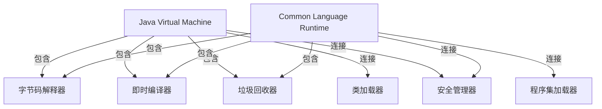

                 

# 编程语言虚拟机：JVM与CLR比较

> 关键词：编程语言虚拟机, JVM, CLR, 动态编译, 即时编译, 解释器, 编译器, 字节码, 垃圾回收, 性能优化

## 1. 背景介绍

### 1.1 问题由来

随着计算机科学的发展，编程语言和编译器技术也经历了许多变革。其中，虚拟机（Virtual Machine, VM）作为一种抽象的运行环境，已经成为现代编程语言生态系统的重要组成部分。目前，世界上主要有两大流行的编程语言虚拟机：Java虚拟机（Java Virtual Machine, JVM）和公共语言运行时（Common Language Runtime, CLR）。这两种虚拟机被广泛应用在多个领域，包括移动应用、大数据、云计算等。但两者在实现方式、设计理念、性能表现等方面存在一定的差异，导致不同的应用场景下有着不同的选择。本文将从虚拟机原理、实现机制、性能比较等角度，详细阐述JVM与CLR的异同点，为开发人员和研究人员提供参考。

### 1.2 问题核心关键点

本文聚焦于以下核心问题：
1. 虚拟机的定义、原理和实现方式是什么？
2. JVM和CLR在机制和功能上有什么差异？
3. 在性能、安全、可移植性等方面，JVM和CLR各具哪些优势和劣势？
4. JVM与CLR的未来发展趋势如何？

通过这些问题，我们将深入理解JVM和CLR的运行机制，并对其应用场景和性能表现进行对比分析。

## 2. 核心概念与联系

### 2.1 核心概念概述

在深入比较之前，我们需要了解几个关键概念：

- **虚拟机**：一种抽象的执行环境，用于运行程序和应用。它为应用提供了一个通用的运行平台，屏蔽了底层的硬件细节，提高了系统的可移植性和兼容性。
- **即时编译（Just-In-Time, JIT）**：一种编译技术，在程序运行时动态编译代码，以提高运行速度和性能。
- **解释器**：一种程序翻译工具，将源代码翻译成机器码并执行。
- **编译器**：一种工具，将高级语言源代码翻译成机器码，通常编译过程在编译时完成。
- **字节码（Bytecode）**：编译后的中间代码，用于在不同平台上执行。
- **垃圾回收（Garbage Collection, GC）**：一种自动的内存管理机制，用于释放不再使用的内存。

这些概念构成了现代编程语言运行时系统的基础，接下来我们将介绍JVM和CLR的基本实现和机制，并比较它们的异同点。

### 2.2 核心概念原理和架构的 Mermaid 流程图



## 3. 核心算法原理 & 具体操作步骤

### 3.1 算法原理概述

JVM和CLR的实现原理大致相同，都是通过一个解释器将字节码翻译成机器码并执行。但在细节上，两者有着显著的差异。

- **JVM**：使用即时编译器在运行时动态编译字节码，生成优化后的机器码。编译器采用基于寄存器的代码生成器，以优化性能。
- **CLR**：采用即时编译器动态编译字节码，但编译器使用更为复杂的代码生成器，支持面向对象的特性。此外，CLR还引入了一些Java平台没有的特性，如元数据（Metadata）和Windows系统支持。

### 3.2 算法步骤详解

1. **字节码解释**：字节码被解释器逐条翻译成机器码，并执行。解释器通常采用解释循环，逐条解析字节码，生成机器码并执行。
2. **即时编译**：在解释器执行过程中，如果检测到频繁执行的代码，就会将该代码段传递给即时编译器进行编译。编译器会生成优化后的机器码，替换掉原始字节码，以便后续执行。
3. **垃圾回收**：通过垃圾回收器自动管理内存，释放不再使用的对象，以避免内存泄漏。

### 3.3 算法优缺点

#### JVM的优点：
- **平台兼容性**：JVM支持跨平台运行，只需安装Java运行环境即可在各种操作系统上运行。
- **热启动**：JVM支持动态类加载和卸载，能够快速启动和停止应用程序。
- **优化工具丰富**：JVM提供多种性能优化工具，如JProfiler、VisualVM等，帮助开发者调试和优化程序。

#### JVM的缺点：
- **性能瓶颈**：解释器执行的效率较低，特别是在大量线程并发执行时，性能瓶颈明显。
- **内存管理复杂**：垃圾回收器需要消耗大量系统资源，特别是在对象生存周期较长的应用中，内存管理复杂。

#### CLR的优点：
- **性能优异**：CLR的即时编译器能够生成高效的机器码，执行速度较快。
- **语言集成度高**：CLR支持多种高级语言，如C#、Visual Basic等，具有良好的语言集成能力。
- **系统安全**：CLR提供严格的安全机制，如Code Access Security (CAS)等，保护系统免受恶意代码攻击。

#### CLR的缺点：
- **跨平台性差**：CLR主要应用于Windows平台，跨平台支持较弱。
- **开发成本高**：CLR的开发需要熟悉C#等特定语言，学习成本较高。
- **复杂性高**：CLR的实现较为复杂，系统架构和内部机制理解难度较大。

### 3.4 算法应用领域

JVM和CLR被广泛应用于多个领域，具体应用如下：

- **JVM**：广泛应用于企业级应用、移动应用、大数据处理、云计算平台等，如Hadoop、Spring、Android等。
- **CLR**：广泛应用于Windows平台下的桌面应用、游戏开发、Web服务、金融系统等，如Unity、Visual Studio、WPF等。

## 4. 数学模型和公式 & 详细讲解 & 举例说明

### 4.1 数学模型构建

JVM和CLR的执行过程可以通过数学模型进行建模。以JVM为例，假设有$n$个字节码指令，执行总时间为$T$，解释器每条指令执行时间为$t$，即时编译器编译时间为$C$，编译后的代码执行时间为$c$，则总执行时间可以表示为：

$$
T = nt + \sum_{i=1}^N C_i + \sum_{i=1}^N c_i
$$

其中，$C_i$表示第$i$次编译的字节码段大小，$c_i$表示编译后的机器码执行时间。

### 4.2 公式推导过程

假设程序总共有$m$条字节码指令，解释器每条指令执行时间为$t$，即时编译器编译时间为$C$，编译后的代码执行时间为$c$，则总执行时间可以表示为：

$$
T = mt + mC + \sum_{i=1}^m c_i
$$

其中，$c_i$表示第$i$次编译后的机器码执行时间。假设编译器能够将$m$条指令编译成$m$段机器码，则总执行时间可以进一步简化为：

$$
T = mt + mC + C'
$$

其中，$C'$表示编译后的代码执行时间。

### 4.3 案例分析与讲解

以Java和C#为例，分析两种语言在JVM和CLR下的性能差异。假设Java程序有$n$条字节码指令，C#程序有$m$条指令，解释器执行时间为$t$，即时编译器编译时间为$C$，编译后的代码执行时间为$c$，则Java程序的执行时间为：

$$
T_{Java} = nt + nC + \sum_{i=1}^n c_i
$$

假设C#程序编译后生成$m$段机器码，编译时间为$C$，编译后的代码执行时间为$c$，则C#程序的执行时间为：

$$
T_{C#} = mt + mC + C'
$$

比较两者，可以发现JVM的性能主要受字节码解释和即时编译器编译的影响，而CLR的性能则受到编译器编译和编译后代码执行的影响。在处理大量线程并发时，JVM的性能瓶颈较为明显，而CLR则可以通过优化编译后的代码执行时间，提升整体性能。

## 5. 项目实践：代码实例和详细解释说明

### 5.1 开发环境搭建

以下是使用Java和C#在JVM和CLR上的环境搭建流程：

#### Java开发环境搭建：

1. 安装Java Development Kit (JDK)。
2. 配置JAVA_HOME环境变量。
3. 安装IDE，如IntelliJ IDEA或Eclipse。
4. 下载并安装必要的依赖库。

#### C#开发环境搭建：

1. 安装Microsoft Visual Studio。
2. 配置Visual Studio环境。
3. 安装.NET Framework或.NET Core。
4. 下载并安装必要的NuGet包。

### 5.2 源代码详细实现

#### Java源代码实现：

```java
public class HelloWorld {
    public static void main(String[] args) {
        System.out.println("Hello, World!");
    }
}
```

#### C#源代码实现：

```csharp
using System;

class HelloWorld {
    static void Main() {
        Console.WriteLine("Hello, World!");
    }
}
```

### 5.3 代码解读与分析

Java和C#的HelloWorld程序执行过程类似，都是在运行时动态编译字节码并执行。但两者在编译和解释机制上有所不同，具体如下：

- **Java**：使用字节码解释器逐条翻译字节码，生成机器码并执行。
- **C#**：使用即时编译器动态编译字节码，生成机器码并执行。

### 5.4 运行结果展示

在执行程序时，可以观察到两者运行时间的差异。Java程序在运行时需要先解释字节码，因此启动时间较长，但执行效率相对稳定。C#程序由于采用了即时编译，启动时间较短，但在高并发场景下可能存在编译延迟，导致性能波动。

## 6. 实际应用场景

### 6.1 企业应用

在企业应用中，JVM和CLR各有优劣：

- **JVM**：适用于跨平台的企业级应用，如Spring Boot、Hibernate等，具有较好的可移植性和稳定性。
- **CLR**：适用于Windows平台下的企业应用，如Windows Forms、WPF等，具有良好的系统集成能力和性能优化。

### 6.2 移动应用

在移动应用开发中，JVM和CLR也有不同的选择：

- **JVM**：适用于Android开发，支持跨平台应用开发，如React Native、Flutter等。
- **CLR**：适用于iOS开发，支持高质量的图形界面和系统集成，如Unity游戏开发。

### 6.3 大数据处理

在大数据处理场景下，JVM和CLR也有不同的应用：

- **JVM**：适用于Hadoop、Spark等大数据处理框架，具有较好的跨平台支持和内存管理能力。
- **CLR**：适用于.NET Framework下的数据处理工具，如LINQ、Entity Framework等，具有丰富的开发工具和语言集成。

### 6.4 未来应用展望

未来，JVM和CLR将进一步发展和优化，以应对新的技术挑战和应用需求：

- **JVM**：将进一步提升即时编译器的优化能力，引入更多高性能编译器和虚拟机优化技术，提升性能和稳定性。
- **CLR**：将进一步完善跨平台支持和语言集成能力，支持更多高级语言和跨平台应用开发。

## 7. 工具和资源推荐

### 7.1 学习资源推荐

1. 《深入理解Java虚拟机》：一本深入讲解JVM原理和技术细节的经典书籍。
2. 《CLR via C#, Fourth Edition》：一本详细介绍CLR实现机制和技术细节的经典书籍。
3. 《Java编程思想》：一本讲解Java编程语言基础和高级特性的经典书籍。
4. MSDN文档：Microsoft官方提供的CLR和.NET平台文档，是学习CLR和.NET开发的重要资源。
5. Java Tutorials：Oracle官方提供的Java编程教程，详细讲解Java开发基础和高级技术。

### 7.2 开发工具推荐

1. IntelliJ IDEA：一款功能强大的Java开发IDE，支持JVM和Android开发。
2. Visual Studio：一款流行的.NET开发IDE，支持CLR和Windows平台开发。
3. Eclipse：一款开源的Java开发IDE，支持JVM和跨平台开发。
4. Unity：一款流行的游戏开发引擎，支持CLR和跨平台开发。

### 7.3 相关论文推荐

1. "Dynamic Compilation of Java and the Java Virtual Machine"：详细介绍了JVM的即时编译机制和技术细节。
2. "Common Language Runtime Architecture"：Microsoft官方论文，详细介绍了CLR的架构和实现机制。
3. "JIT Compilation and Just-In-Time Compilation"：探讨JIT编译技术及其优缺点。
4. "Garbage Collection in Java"：详细介绍了Java垃圾回收机制和技术细节。

## 8. 总结：未来发展趋势与挑战

### 8.1 研究成果总结

本文详细介绍了JVM和CLR的实现原理、应用场景和性能比较。通过对比分析，展示了两者在虚拟机的设计理念、机制和性能上的差异，帮助开发者选择合适的虚拟运行环境。

### 8.2 未来发展趋势

未来，虚拟机的设计和实现将更加注重性能优化和系统安全，以应对新的技术挑战和应用需求：

- **JVM**：将进一步提升即时编译器的优化能力，引入更多高性能编译器和虚拟机优化技术，提升性能和稳定性。
- **CLR**：将进一步完善跨平台支持和语言集成能力，支持更多高级语言和跨平台应用开发。

### 8.3 面临的挑战

虽然虚拟机技术已经取得许多成就，但在发展过程中仍面临诸多挑战：

- **性能优化**：虚拟机需要在性能和安全性之间寻找平衡，避免出现性能瓶颈和安全问题。
- **跨平台支持**：虚拟机需要支持更多平台和架构，以满足多样化的应用需求。
- **系统安全**：虚拟机需要防范恶意代码和攻击，保护系统的安全性和稳定性。

### 8.4 研究展望

未来，虚拟机的研究将更加关注以下几个方向：

- **虚拟机的设计优化**：通过更先进的编译和执行技术，提升虚拟机的执行效率和稳定性。
- **虚拟机的系统安全**：加强虚拟机的安全性设计和防御能力，防范恶意代码和攻击。
- **虚拟机的跨平台支持**：扩展虚拟机的跨平台支持能力，支持更多操作系统和硬件架构。

## 9. 附录：常见问题与解答

**Q1：JVM和CLR的主要区别是什么？**

A：JVM和CLR的主要区别在于：
- **实现机制**：JVM使用字节码解释器进行解释执行，CLR使用即时编译器生成优化后的机器码执行。
- **平台支持**：JVM支持跨平台运行，CLR主要应用于Windows平台。
- **语言集成**：JVM支持多种高级语言，如Java、Scala等，CLR主要支持C#等语言。

**Q2：JVM和CLR在性能上有哪些差异？**

A：JVM和CLR在性能上有以下差异：
- **启动时间**：JVM的启动时间较长，因为需要解释字节码，而CLR的启动时间较短，因为即时编译器能够提前编译代码。
- **执行效率**：JVM的执行效率相对稳定，但存在字节码解释的性能瓶颈，而CLR的执行效率较高，但存在编译延迟，在高并发场景下可能出现性能波动。

**Q3：JVM和CLR的应用场景有何不同？**

A：JVM和CLR的应用场景如下：
- **JVM**：适用于跨平台的企业级应用、移动应用、大数据处理等。
- **CLR**：适用于Windows平台下的企业应用、游戏开发、Web服务等。

**Q4：虚拟机的未来发展方向是什么？**

A：虚拟机的未来发展方向包括：
- **性能优化**：提升虚拟机的执行效率和稳定性，避免性能瓶颈和安全问题。
- **跨平台支持**：支持更多平台和架构，以满足多样化的应用需求。
- **系统安全**：加强虚拟机的安全性设计和防御能力，防范恶意代码和攻击。

---

作者：禅与计算机程序设计艺术 / Zen and the Art of Computer Programming

