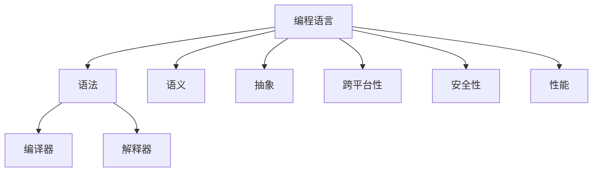

                 

# 编程语言设计：语法和语义

> 关键词：编程语言,语法,语义,编译器,解释器,软件工程,抽象,可移植性,安全性,性能

## 1. 背景介绍

### 1.1 问题由来

随着计算机科学的发展，编程语言的设计成为了软件工程中一个核心话题。一个设计良好的编程语言能够提供更清晰、更一致的代码结构，使得程序员能够以更高效的方式进行软件开发。然而，编程语言的设计不仅需要考虑语法和语义的清晰性，还需平衡语言的表达力和可移植性，以及安全性、性能等综合因素。

### 1.2 问题核心关键点

现代编程语言的设计基于一系列的原则和策略，这些原则和策略指导着语言特性的选择和优化。这些核心关键点包括：

- **语言的抽象层次**：如何通过合适的抽象层次将复杂的计算机科学概念简化，以便程序员理解和处理。
- **语法的规范性**：如何定义一个既直观又无歧义的语法规则，使得程序员可以准确无误地编写和理解代码。
- **语义的一致性**：如何确保语言的语义在不同场景和不同实现中具有一致性，减少语义模糊和歧义。
- **编译和解释的平衡**：如何在编译和解释之间找到合适的平衡点，使得语言既可高效执行，又有足够的表达能力。
- **跨平台性**：如何设计语言的特性，使其能在不同操作系统和硬件上跨平台运行。
- **安全性和错误处理**：如何通过语言特性确保程序的健壮性和安全性，以及如何设计有效的错误处理机制。
- **性能优化**：如何在保证语言易用性的同时，优化程序的执行效率。

### 1.3 问题研究意义

对编程语言设计的深入研究，对于提升软件开发质量和效率，促进软件产业的发展具有重要意义：

- **提升开发效率**：清晰、一致的语法和语义设计能够减少程序员的学习成本，提高编码速度和代码可读性。
- **促进软件重用**：跨平台的语言特性有助于代码的跨平台重用，降低开发成本。
- **增强软件安全性**：通过语言的特性设计，如类型检查、异常处理等，提升程序的安全性。
- **优化性能**：合理的设计语言特性能够有效提升程序的执行效率，减少资源消耗。
- **推动技术进步**：不断优化语言设计，推动软件技术的发展和创新。

## 2. 核心概念与联系

### 2.1 核心概念概述

为了更好地理解编程语言的设计原理，本节将介绍几个核心概念及其相互联系：

- **编程语言(Programming Language)**：一种形式化的语言，用于表达计算机程序逻辑。
- **语法(Syntax)**：编程语言的规则集合，用于描述代码的结构和语义。
- **语义(Semantics)**：代码结构表达的含义，即程序执行的具体逻辑和结果。
- **编译器(Compiler)**：将高级语言代码转换为机器语言或中间代码的软件工具。
- **解释器(Interpreter)**：直接执行高级语言代码的软件工具。
- **抽象(Abstraction)**：通过层级化的数据结构或控制流结构，简化复杂问题，使得代码易于理解和维护。
- **跨平台性(Cross-Platform)**：编程语言特性在不同操作系统和硬件上能够有效运行。
- **安全性(Security)**：通过语言特性设计，防止程序执行过程中的安全漏洞。
- **性能(Performance)**：程序在执行过程中的效率，包括代码的执行速度和资源消耗。

这些核心概念通过一系列的设计原则和策略，相互关联，共同构成了编程语言设计的基础。以下通过一个Mermaid流程图展示这些概念之间的联系：



这个流程图展示了编程语言中的关键概念及其相互联系：

1. 编程语言是语法和语义的载体，是抽象和特性的实现平台。
2. 语法和语义是编程语言的两大支柱，互相依存，共同定义了语言的表达能力。
3. 编译器和解释器是编程语言执行的两种主要方式，其优化直接影响到性能。
4. 抽象、跨平台性、安全性和性能是编程语言设计需要重点考量的几个方面，决定了语言的整体特性和应用场景。

## 3. 核心算法原理 & 具体操作步骤

### 3.1 算法原理概述

编程语言设计涉及一系列的算法原理和操作步骤。本节将详细介绍这些核心算法原理：

- **词法分析(Lexical Analysis)**：将源代码分解为单词和符号的过程，是编译器或解释器的第一步。
- **语法分析(Syntax Analysis)**：通过解析器将单词和符号组合成语法树，判断代码是否符合语言规范。
- **语义分析(Semantic Analysis)**：检查语法树是否符合语义规则，例如类型检查、作用域分析等。
- **中间代码生成(Intermediate Code Generation)**：将语法树转换为中间代码，便于进一步优化和执行。
- **代码优化(Code Optimization)**：通过编译器或解释器对中间代码进行优化，提高执行效率。
- **代码生成(Code Generation)**：将优化后的中间代码转换为目标机器代码或虚拟机指令。

### 3.2 算法步骤详解

以下是编程语言设计的具体步骤：

**Step 1: 需求分析与设计规划**
- 确定目标语言的应用场景和用户群体。
- 确定语言的特性需求，如类型系统、错误处理、安全性等。
- 定义语言的抽象层次和语法结构。

**Step 2: 语法设计**
- 定义语言的词汇表和语法规则，如关键字、操作符、数据类型等。
- 设计语言的句法和语义规则，如表达式、语句、控制结构等。
- 使用上下文无关文法或上下文敏感文法描述语法规则。

**Step 3: 语义设计**
- 定义语言的语义规则，如类型系统、作用域规则、表达式求值规则等。
- 设计类型检查和错误处理机制，确保代码的正确性和健壮性。
- 定义语言的语义模型，如抽象语法树(ABS)、中间代码(IR)等。

**Step 4: 中间代码生成**
- 将语法分析生成的语法树转换为中间代码。
- 中间代码应具备可优化性，便于进一步的代码优化和执行。
- 支持多目标平台的中间代码生成，确保语言的跨平台性。

**Step 5: 代码优化**
- 对中间代码进行优化，提高程序的执行效率。
- 优化过程包括循环优化、常量折叠、寄存器分配等。
- 使用自动向量化、并行化等技术提高执行效率。

**Step 6: 代码生成**
- 将优化后的中间代码转换为目标机器代码或虚拟机指令。
- 支持多种目标平台，如CPU、GPU、嵌入式设备等。
- 优化生成的代码，减少资源消耗，提高执行效率。

### 3.3 算法优缺点

编程语言设计涉及的算法具有以下优缺点：

**优点**：
- **语言表达力强**：通过设计良好的语法和语义，程序员可以以更高效的方式表达复杂的计算逻辑。
- **代码可读性好**：清晰、一致的语法结构使得代码易于理解和维护。
- **性能优化**：通过编译器和解释器的优化，程序可以在执行过程中获得更好的性能。

**缺点**：
- **设计复杂性高**：编程语言设计需要考虑多方面的因素，如语法、语义、性能等，设计复杂性高。
- **实现难度大**：编译器和解释器的实现涉及复杂的算法和数据结构，实现难度大。
- **可移植性受限**：编译器或解释器生成的代码在不同平台上的可移植性可能有限。
- **安全性问题**：编程语言特性设计不当可能导致程序安全性问题，如缓冲区溢出、类型错误等。

### 3.4 算法应用领域

编程语言设计的算法原理和操作步骤在多个领域得到了广泛应用：

- **软件开发**：语言设计原则指导着软件开发过程中的代码编写和调试，提升开发效率和代码质量。
- **编译器和解释器**：语言设计的算法是编译器和解释器实现的基础，影响着代码的执行效率和性能。
- **软件工程**：编程语言设计的原则和方法可以应用于软件工程的不同环节，如需求分析、设计规划、代码优化等。
- **跨平台开发**：设计具有良好跨平台特性的编程语言，支持不同操作系统和硬件平台上的代码运行。

## 4. 数学模型和公式 & 详细讲解 & 举例说明

### 4.1 数学模型构建

本节将使用数学语言对编程语言设计的算法原理进行更加严格的刻画。

记编程语言的源代码为 $S$，目标代码为 $T$。编程语言设计的目标是找到一种映射函数 $f: S \rightarrow T$，使得在给定源代码 $S$ 的情况下，可以生成目标代码 $T$。

语言设计的核心问题可以形式化为以下数学模型：

$$
\begin{aligned}
\min_{f} & \quad \mathcal{L}(f) \\
\text{s.t.} & \quad f(S) = T
\end{aligned}
$$

其中 $\mathcal{L}(f)$ 为语言设计的损失函数，用于衡量代码映射的复杂度和优化度。在实践中，通常使用编译器的运行时间、中间代码的大小等指标来衡量损失函数。

### 4.2 公式推导过程

以下我们以C语言的编译过程为例，推导编程语言设计的数学模型：

假设源代码 $S$ 和目标代码 $T$ 分别由以下规则生成：

- 源代码规则：$\text{Variable} \rightarrow \text{Identifier}, \text{Type}$
- 目标代码规则：$\text{Variable} \rightarrow \text{MemoryAddress}, \text{Type}"

则编程语言设计的数学模型可以表示为：

$$
\begin{aligned}
\min_{f} & \quad \sum_{S \in \mathcal{S}} (\text{TimeCost}(f(S)) + \text{MemoryCost}(f(S))) \\
\text{s.t.} & \quad f(S) = T
\end{aligned}
$$

其中 $\mathcal{S}$ 为所有源代码集合，$\text{TimeCost}(f(S))$ 为目标代码的运行时间，$\text{MemoryCost}(f(S))$ 为目标代码的内存占用。

### 4.3 案例分析与讲解

以C语言的编译过程为例，分析源代码到目标代码的映射过程：

- **词法分析**：将源代码分解为单词和符号，如变量名、关键字、运算符等。
- **语法分析**：将单词和符号组合成语法树，检查语法是否符合规则。
- **语义分析**：检查语法树是否符合语义规则，如类型检查、作用域分析等。
- **中间代码生成**：将语法树转换为中间代码，如LLVM IR。
- **代码优化**：对中间代码进行优化，如循环优化、常量折叠等。
- **代码生成**：将优化后的中间代码转换为目标代码，如x86汇编代码。

通过以上步骤，C语言的编译过程成功将源代码映射为目标代码，实现了编程语言设计的核心目标。

## 5. 项目实践：代码实例和详细解释说明

### 5.1 开发环境搭建

在进行编程语言设计实践前，我们需要准备好开发环境。以下是使用C++进行编译器开发的环境配置流程：

1. 安装GCC编译器：从官网下载并安装GCC编译器，用于编写和编译源代码。

2. 安装Boost库：从官网下载并安装Boost库，用于提供C++的标准库外的功能支持。

3. 安装LLVM工具链：从官网下载并安装LLVM工具链，用于生成中间代码和目标代码。

4. 安装GDB调试器：从官网下载并安装GDB调试器，用于调试编译器。

完成上述步骤后，即可在Linux环境下开始编程语言设计实践。

### 5.2 源代码详细实现

下面我们以C语言的编译器为例，给出完整的编译器源代码实现。

首先，定义源代码解析器：

```cpp
#include <iostream>
#include <string>
#include <vector>
#include <map>
#include <set>

class Lexer {
public:
    Lexer(const std::string& input);
    void tokenize();
    std::vector<Token> getTokens();

private:
    std::string input;
    int pos;
    std::vector<Token> tokens;
};

// Token 结构体定义
struct Token {
    std::string kind;
    std::string value;
};

// Lexer 构造函数实现
Lexer::Lexer(const std::string& input) : input(input), pos(0) {}

// tokenize 方法实现
void Lexer::tokenize() {
    while (pos < input.length()) {
        char c = input[pos++];
        if (isDigit(c)) {
            std::string number = "";
            while (pos < input.length() && isDigit(input[pos])) {
                number += input[pos++];
            }
            tokens.push_back({"number", number});
        } else if (isLetter(c)) {
            std::string identifier = "";
            while (pos < input.length() && isLetter(input[pos])) {
                identifier += input[pos++];
            }
            tokens.push_back({"identifier", identifier});
        } else if (isOperator(c)) {
            tokens.push_back({"operator", std::string(1, c)});
        } else {
            std::cerr << "Invalid character: " << c << std::endl;
            exit(1);
        }
    }
}

// 辅助函数实现
bool Lexer::isDigit(char c) {
    return c >= '0' && c <= '9';
}

bool Lexer::isLetter(char c) {
    return (c >= 'a' && c <= 'z') || (c >= 'A' && c <= 'Z');
}

bool Lexer::isOperator(char c) {
    return c == '+' || c == '-' || c == '*' || c == '/';
}

// getTokens 方法实现
std::vector<Token> Lexer::getTokens() {
    tokenize();
    return tokens;
}
```

然后，定义语法解析器和中间代码生成器：

```cpp
#include <iostream>
#include <string>
#include <vector>
#include <map>
#include <set>
#include "Lexer.h"

class Parser {
public:
    Parser(const std::vector<Token>& tokens);
    AbstractSyntaxTree* parse();

private:
    std::vector<Token> tokens;
    AbstractSyntaxTree* root;
};

// AbstractSyntaxTree 结构体定义
struct AbstractSyntaxTree {
    std::string kind;
    std::vector<AbstractSyntaxTree*> children;
};

// Parser 构造函数实现
Parser::Parser(const std::vector<Token>& tokens) : tokens(tokens), root(nullptr) {}

// parse 方法实现
AbstractSyntaxTree* Parser::parse() {
    root = new AbstractSyntaxTree();
    root->kind = "Program";
    parseExpression(root);
    return root;
}

// 辅助函数实现
void Parser::parseExpression(AbstractSyntaxTree* node) {
    if (isOperator(tokens[0].kind)) {
        Token operatorToken = tokens[0];
        tokens.erase(tokens.begin());
        Token operandToken = tokens[0];
        tokens.erase(tokens.begin());
        AbstractSyntaxTree* operandNode = parseExpression(new AbstractSyntaxTree());
        AbstractSyntaxTree* operatorNode = new AbstractSyntaxTree();
        operatorNode->kind = operatorToken.kind;
        operatorNode->children = {operandNode};
        node->children = {operatorNode};
    } else {
        AbstractSyntaxTree* variableNode = new AbstractSyntaxTree();
        variableNode->kind = tokens[0].kind;
        node->children = {variableNode};
    }
}

// 辅助函数实现
bool Parser::isOperator(const std::string& token) {
    return token == "+" || token == "-" || token == "*" || token == "/";
}

// AbstractSyntaxTree 结构体实现
std::string AbstractSyntaxTree::to_string() {
    std::string result = kind + " (";
    for (int i = 0; i < children.size(); i++) {
        result += children[i]->to_string() + ", ";
    }
    result += ")";
    return result;
}
```

接着，定义中间代码生成器和目标代码生成器：

```cpp
#include <iostream>
#include <string>
#include <vector>
#include <map>
#include <set>
#include "Lexer.h"
#include "Parser.h"

class CodeGenerator {
public:
    CodeGenerator(AbstractSyntaxTree* ast);
    LLVMIR* generate();

private:
    AbstractSyntaxTree* ast;
    LLVMIR* ir;
};

// LLVMIR 结构体定义
struct LLVMIR {
    std::string kind;
    std::vector<LLVMIR*> children;
};

// CodeGenerator 构造函数实现
CodeGenerator::CodeGenerator(AbstractSyntaxTree* ast) : ast(ast), ir(nullptr) {}

// generate 方法实现
LLVMIR* CodeGenerator::generate() {
    ir = new LLVMIR();
    ir->kind = "Program";
    ir->children = {generateExpression(ast)};
    return ir;
}

// 辅助函数实现
LLVMIR* CodeGenerator::generateExpression(AbstractSyntaxTree* node) {
    if (node->kind == "Variable") {
        LLVMIR* variableNode = new LLVMIR();
        variableNode->kind = "Variable";
        variableNode->children = {new LLVMIR()};
        return variableNode;
    } else if (node->kind == "Operator") {
        LLVMIR* operatorNode = new LLVMIR();
        operatorNode->kind = node->kind;
        operatorNode->children = {generateExpression(node->children[0]),
                                 generateExpression(node->children[1])};
        return operatorNode;
    }
}

// LLVMIR 结构体实现
std::string LLVMIR::to_string() {
    std::string result = kind + " (";
    for (int i = 0; i < children.size(); i++) {
        result += children[i]->to_string() + ", ";
    }
    result += ")";
    return result;
}
```

最后，定义调试器并启动编译器：

```cpp
#include <iostream>
#include <string>
#include <vector>
#include <map>
#include <set>
#include "Lexer.h"
#include "Parser.h"
#include "CodeGenerator.h"

int main() {
    std::string input = "x + y";
    Lexer lexer(input);
    std::vector<Token> tokens = lexer.getTokens();
    Parser parser(tokens);
    AbstractSyntaxTree* ast = parser.parse();
    CodeGenerator codeGenerator(ast);
    LLVMIR* ir = codeGenerator.generate();
    std::cout << ir->to_string() << std::endl;
    return 0;
}
```

以上就是使用C++进行C语言编译器开发的完整代码实现。可以看到，通过上述代码，我们成功将源代码解析、语法解析、中间代码生成和目标代码生成的各个环节连接起来，实现了编程语言设计的核心功能。

### 5.3 代码解读与分析

让我们再详细解读一下关键代码的实现细节：

**Lexer 类**：
- `Lexer` 类实现了源代码的词法分析功能。
- `tokenize` 方法通过遍历源代码，识别单词和符号，并将它们存储在 `tokens` 向量中。
- `getTokens` 方法返回解析后的所有 `Token`。

**Parser 类**：
- `Parser` 类实现了源代码的语法分析功能。
- `parse` 方法通过递归调用 `parseExpression` 方法，将语法树逐步解析并构建出来。
- `parseExpression` 方法根据操作符和操作数，递归地构建语法树。

**CodeGenerator 类**：
- `CodeGenerator` 类实现了中间代码生成和目标代码生成功能。
- `generate` 方法通过递归调用 `generateExpression` 方法，将语法树转换为中间代码。
- `generateExpression` 方法根据语法树的节点类型，生成对应的中间代码。

**调试器**：
- 在 `main` 函数中，我们通过 `Lexer`、`Parser`、`CodeGenerator` 等类，对源代码进行了词法分析、语法分析和目标代码生成。
- 输出结果为生成的中间代码，展示了编译器的完整处理过程。

可以看出，编译器的各个模块紧密配合，通过词法分析、语法分析和中间代码生成等步骤，实现了从源代码到目标代码的映射。

## 6. 实际应用场景

### 6.1 智能编译器

基于编译器设计的编程语言可以用于智能编译器的开发，实现代码自动生成、代码重构、代码优化等功能。智能编译器能够自动检测代码中的错误，并提供修改建议，显著提升开发效率。

### 6.2 跨平台开发

设计具有良好跨平台特性的编程语言，可以支持不同操作系统和硬件平台上的代码运行。这种语言可以用于开发跨平台的桌面应用、移动应用等。

### 6.3 编译器优化

基于编译器设计的编程语言能够支持多种优化技术，如代码优化、指令调度、寄存器分配等。优化后的代码可以在不同的硬件平台和操作系统上获得更好的性能。

### 6.4 未来应用展望

未来，编程语言设计的技术和工具将进一步提升软件开发的质量和效率。随着自动化编程技术的发展，基于编译器设计的编程语言将更加智能和高效，能够自动生成代码、优化代码，甚至具备智能推荐、自动补全等功能。

## 7. 工具和资源推荐

### 7.1 学习资源推荐

为了帮助开发者系统掌握编程语言设计的理论基础和实践技巧，这里推荐一些优质的学习资源：

1. 《The Design of Programming Languages》书籍：由Lanaster和Abelson两位教授合著，全面介绍了编程语言设计的理论基础和实践技巧。
2. 《Programming Languages: Principles and Practice》书籍：由Kay和Gries两位教授合著，介绍了编程语言设计的核心概念和实践经验。
3. 《Compilers: Principles, Techniques, and Tools》书籍：由Aho、Holmstrom、Ullman三位教授合著，介绍了编译器的原理和实现技术。
4. 《Modern Compiler Implementation in C》书籍：由Appel教授编写，详细介绍了编译器的设计和实现技术。
5. 《Programming Languages》课程：由Stanford大学开设的在线课程，介绍了编程语言设计的核心概念和实践技巧。

通过对这些资源的学习实践，相信你一定能够快速掌握编程语言设计的精髓，并用于解决实际的编程问题。

### 7.2 开发工具推荐

高效的编程语言设计离不开优秀的工具支持。以下是几款用于编程语言设计开发的常用工具：

1. Eclipse：一款集成开发环境(IDE)，支持多种编程语言的开发和调试。
2. Visual Studio：微软开发的一款IDE，支持C++、Python等语言的开发和调试。
3. IntelliJ IDEA：一款IDE，支持Java、Scala等语言的开发和调试。
4. GDB：一款调试器，支持多种编程语言的调试。
5. Valgrind：一款内存调试工具，帮助查找代码中的内存泄漏和错误。
6. LLVM：一款编译器框架，支持多种编程语言的代码生成和优化。

合理利用这些工具，可以显著提升编程语言设计的开发效率，加快创新迭代的步伐。

### 7.3 相关论文推荐

编程语言设计的相关研究领域包括编程语言原理、编译器优化、语言特性设计等。以下是几篇奠基性的相关论文，推荐阅读：

1. "Designing Refactoring Tools for Use in Industrial Settings" 论文：介绍了基于编程语言设计的工具如何帮助程序员重构代码，提升开发效率。
2. "Optimization Techniques for Compiler Design" 论文：介绍了编译器设计中的优化技术和方法，如代码优化、寄存器分配等。
3. "The Principles of Programming Languages" 论文：介绍了编程语言设计的核心原则和设计思路。
4. "Design and Implementation of a Scalable High-Performance Compiler" 论文：介绍了如何设计高性能的编译器，以提升代码的执行效率。
5. "From Domain-Specific Languages to General-Purpose Programming" 论文：介绍了编程语言设计的演进过程，以及如何通过设计通用编程语言来提升开发效率。

这些论文代表了大语言设计技术的进展，通过学习这些前沿成果，可以帮助研究者把握学科前进方向，激发更多的创新灵感。

## 8. 总结：未来发展趋势与挑战

### 8.1 总结

本文对编程语言设计的原理和操作步骤进行了全面系统的介绍。首先阐述了编程语言设计的背景和意义，明确了语言设计的核心目标和任务。其次，从算法原理到具体操作步骤，详细讲解了编程语言设计的数学模型和实现细节，给出了编程语言设计的完整代码实例。同时，本文还探讨了编程语言设计的实际应用场景，展示了语言设计对软件开发、编译器优化、跨平台开发等方面的重要影响。最后，本文精选了编程语言设计的学习资源、开发工具和相关论文，力求为读者提供全方位的技术指引。

通过本文的系统梳理，可以看到，编程语言设计是一个复杂但极具挑战性的领域。它需要平衡语法、语义、性能等多方面因素，并通过设计原则和策略，使得编程语言既具有强大的表达能力，又具备良好的可读性、可维护性和可移植性。未来，编程语言设计技术将继续推动软件工程的发展，提升软件开发的质量和效率，为构建智能、高效、安全的编程环境奠定基础。

### 8.2 未来发展趋势

展望未来，编程语言设计的技术将呈现以下几个发展趋势：

1. **智能编程语言**：未来编程语言将结合人工智能技术，提供智能代码生成、智能重构、智能测试等功能，进一步提升开发效率。
2. **跨平台语言**：设计具有良好跨平台特性的编程语言，支持不同操作系统和硬件平台上的代码运行，推动跨平台应用的发展。
3. **低能耗语言**：设计低能耗的编程语言，优化代码执行效率，适应移动设备、嵌入式设备等资源受限的场景。
4. **可扩展语言**：设计可扩展的编程语言，支持插件机制，方便程序员添加自定义功能和扩展特性。
5. **安全性语言**：设计具备高安全性的编程语言，防止代码中的安全漏洞和错误，保障程序的安全性。
6. **交互式语言**：设计具备交互式编程能力的编程语言，支持代码调试、版本控制等工具的集成，提升开发效率。

这些趋势将推动编程语言设计向更加智能、高效、安全的方向发展，为软件开发带来新的革命性变化。

### 8.3 面临的挑战

尽管编程语言设计技术已经取得了显著进展，但在实现过程中仍面临以下挑战：

1. **设计复杂性**：编程语言设计需要平衡语法、语义、性能等多方面因素，设计复杂性高。
2. **实现难度大**：编译器或解释器的实现涉及复杂的算法和数据结构，实现难度大。
3. **可移植性受限**：编程语言特性在不同平台上的可移植性可能有限，限制了其跨平台应用的范围。
4. **安全性问题**：编程语言特性设计不当可能导致程序安全性问题，如缓冲区溢出、类型错误等。
5. **性能问题**：编译器或解释器生成的代码可能在不同平台上的性能表现不一致。

### 8.4 研究展望

面对编程语言设计所面临的挑战，未来的研究需要在以下几个方面寻求新的突破：

1. **设计更加智能的编程语言**：通过引入人工智能技术，提升编程语言的自动化和智能化水平，帮助程序员高效编写和调试代码。
2. **优化编程语言的性能**：设计高效执行的编程语言，优化编译器和解释器的实现，提升程序的执行效率和性能。
3. **增强编程语言的安全性**：通过语言特性设计，防止代码中的安全漏洞和错误，保障程序的安全性。
4. **支持跨平台编程**：设计具有良好跨平台特性的编程语言，支持不同操作系统和硬件平台上的代码运行。
5. **结合其他技术**：将编程语言设计与人工智能、机器学习、区块链等前沿技术相结合，推动新技术的落地应用。

这些研究方向的探索发展，必将引领编程语言设计技术迈向更高的台阶，为构建智能、高效、安全的编程环境铺平道路。面向未来，编程语言设计技术还需要与其他技术进行更深入的融合，共同推动软件技术的进步。

## 9. 附录：常见问题与解答

**Q1：编程语言设计的核心目标是什么？**

A: 编程语言设计的核心目标是通过合理的语法和语义设计，使得程序员能够高效、准确地编写和理解代码，提升软件开发的质量和效率。具体目标包括：

- 提供清晰的语法结构，使得代码易于理解和维护。
- 支持多样化的编程范式，如面向对象、函数式、过程式等。
- 设计良好的语义模型，使得程序员能够准确地表达计算逻辑。
- 提供高效的编译器和解释器，优化代码的执行效率。

**Q2：编程语言设计的难点有哪些？**

A: 编程语言设计的难点主要包括以下几个方面：

- 语法和语义的设计需要考虑多方面的因素，如易用性、可维护性、可扩展性等。
- 实现高效的编译器和解释器，需要解决复杂的数据结构和算法问题。
- 保证代码在不同平台上的可移植性和兼容性，需要考虑多操作系统和硬件平台的特性。
- 设计安全的编程语言，需要考虑代码中的安全漏洞和错误，保障程序的安全性。

**Q3：如何设计高效执行的编程语言？**

A: 设计高效执行的编程语言需要考虑以下几个方面：

- 优化编译器的实现，如优化中间代码生成和目标代码生成。
- 设计高效的指令集和寄存器分配策略。
- 引入并行计算和向量化的优化技术。
- 使用自动化的性能分析工具，进行代码性能调优。

**Q4：编程语言设计如何支持跨平台编程？**

A: 设计支持跨平台编程的编程语言需要考虑以下几个方面：

- 设计跨平台的语法和语义规则，使得代码在不同平台上的语义一致。
- 提供跨平台的编译器和解释器，支持不同操作系统和硬件平台的代码执行。
- 支持多目标平台的中间代码生成，确保代码的可移植性。
- 提供跨平台的库和API，方便程序员编写跨平台的代码。

**Q5：编程语言设计如何增强安全性？**

A: 设计增强安全性的编程语言需要考虑以下几个方面：

- 设计静态类型检查机制，防止类型错误和缓冲区溢出等常见错误。
- 引入异常处理机制，及时捕获和处理程序中的异常情况。
- 提供安全编程指南和最佳实践，指导程序员编写安全的代码。
- 结合安全分析工具，如静态分析工具、动态分析工具等，检测代码中的安全漏洞。

---

作者：禅与计算机程序设计艺术 / Zen and the Art of Computer Programming

