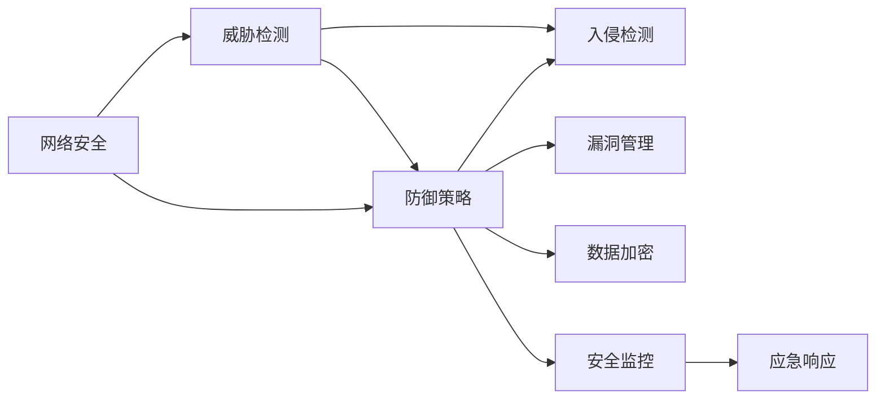

                 

# 网络安全管理：构建全面的数字防御体系

> 关键词：网络安全, 威胁检测, 防御策略, 入侵检测, 漏洞管理, 数据加密, 安全监控, 应急响应

## 1. 背景介绍

在数字化时代，网络安全已成为企业信息安全的核心。然而，传统的网络安全手段往往无法应对不断涌现的安全威胁。近些年，网络攻击手段越发复杂多变，传统防火墙、IDS/IPS等手段逐渐显露出其局限性。如何在当前复杂多变的网络环境下，构建全面的数字防御体系，成为各大企业必须解决的问题。

大公司如亚马逊、Google、Facebook、Tesla等在面临来自多个国家和各种团体的黑客攻击时，无不承认其安全系统的重要性。例如，2021年，Facebook曝光了一起供应链攻击，导致数亿用户信息被曝光。而在汽车行业，Tesla的自动驾驶系统就曾遭到黑客攻击，影响安全行驶。网络安全已不单单是IT部门的工作，而是每个业务部门必须重视的问题。

## 2. 核心概念与联系

为了更好地理解数字防御体系的构建方法，本节将介绍几个关键概念及其联系：

- **网络安全(Network Security)**：保护网络系统免受不法分子的攻击。包括防火墙、IDS/IPS、VPN、DDoS防御、入侵检测、漏洞管理等。

- **威胁检测(Threat Detection)**：识别网络中潜在的安全威胁。包括异常行为分析、威胁情报、网络流量分析等。

- **防御策略(Defense Strategy)**：基于威胁检测的结果，采取相应措施。包括防火墙规则、入侵检测规则、应急响应计划等。

- **入侵检测(IDS, Intrusion Detection System)**：实时监控网络流量，识别并阻止恶意行为。包括基于规则和基于异常检测两种方式。

- **漏洞管理(Vulnerability Management)**：发现并修补系统漏洞，减少安全风险。包括漏洞扫描、补丁管理等。

- **数据加密(Data Encryption)**：保护数据机密性，防止未授权访问。包括对称加密、非对称加密、哈希函数等。

- **安全监控(Security Monitoring)**：实时监测网络活动，及时发现异常行为。包括日志管理、事件分析等。

- **应急响应(Incident Response)**：当发生安全事件时，迅速采取措施，减少损失。包括事件检测、应急预案、恢复策略等。

这些概念之间的关系可以通过以下Mermaid流程图来展示：



这个流程图展示了许多核心概念及其之间的关系：

1. 网络安全是整体的安全体系，包括多个子系统。
2. 威胁检测识别潜在安全威胁，是防御策略的基础。
3. 防御策略基于威胁检测的结果，采取措施。
4. 入侵检测、漏洞管理、数据加密等是防御策略的具体实现。
5. 安全监控和应急响应则是防御策略的重要组成部分。

## 3. 核心算法原理 & 具体操作步骤

### 3.1 算法原理概述

数字防御体系的构建，本质上是一个多层次、多角度的安全防护过程。核心思想是：通过综合运用防火墙、入侵检测、异常行为检测、漏洞扫描等技术手段，构建多层次的防护体系，实现系统级别的安全防护。

形式化地，假设网络系统为 $S$，攻击者为 $A$，防御系统为 $D$，则安全模型可以表示为：

$$
S \rightarrow D \rightarrow \{\text{安全事件}\} \rightarrow A \rightarrow \{\text{防范策略}\} \rightarrow D \rightarrow S
$$

防御系统的目标是确保 $S$ 的安全性，防止 $A$ 的攻击，即：

$$
D(S) = S \land D(S) = S
$$

防御系统的实现需要设计多个子系统，如入侵检测系统、漏洞管理系统、应急响应系统等，通过合理配置和联动，确保防御体系的有效性。

### 3.2 算法步骤详解

构建数字防御体系的步骤如下：

**Step 1: 需求分析与设计**
- 收集业务需求，明确安全要求，包括数据敏感性、访问控制需求、安全等级等。
- 根据需求设计安全策略，包括风险评估、安全目标、合规要求等。
- 选择适合的安全技术，如防火墙、IDS/IPS、VPN、DDoS防御、入侵检测、漏洞管理等。

**Step 2: 系统部署与配置**
- 根据设计方案部署各安全子系统，并配置相应参数。
- 进行网络拓扑规划，划分安全域，确保网络隔离。
- 设置网络流量监控，部署IDS/IPS等检测系统。

**Step 3: 策略配置与联动**
- 配置网络防火墙规则，限制非法访问。
- 配置IDS/IPS策略，设置异常检测规则。
- 配置漏洞管理工具，定期扫描系统漏洞。
- 设置应急响应流程，定期演练。

**Step 4: 监控与审计**
- 实时监测网络流量，及时发现异常行为。
- 定期审计日志和配置，确保系统合规。
- 进行入侵检测与漏洞扫描，及时修复安全漏洞。

**Step 5: 响应与迭代**
- 当检测到安全事件，启动应急响应流程。
- 分析安全事件，识别根本原因。
- 修复漏洞，调整策略。
- 定期评估防御系统效果，持续优化。

### 3.3 算法优缺点

数字防御体系具有以下优点：
1. 全面防护。通过综合运用多种技术手段，构建多层次防护体系，实现系统级别的安全防护。
2. 及时响应。实时监测网络活动，及时发现异常行为，快速响应安全事件。
3. 自动化流程。通过自动化流程，提高防御效率，减少人工干预。

同时，该体系也存在一定的局限性：
1. 技术复杂。涉及多种技术手段和系统配置，需要较高的技术要求。
2. 资源消耗。多层次防护带来较大计算和存储需求，需要较高的硬件投入。
3. 维护成本。多个系统的维护和配置，需要较高的人力资源。
4. 系统耦合。不同系统之间需要协调联动，才能发挥最佳效果。

尽管存在这些局限性，但就目前而言，构建数字防御体系仍是企业网络安全防护的重要手段。未来相关研究的重点在于如何进一步降低维护成本，提高自动化程度，同时兼顾系统的可扩展性和灵活性。

### 3.4 算法应用领域

数字防御体系已经在众多行业领域得到广泛应用，如金融、医疗、政府、教育等。以下是几个典型应用场景：

- **金融行业**：金融机构必须处理大量的敏感信息，如账户信息、交易记录等。数字防御体系帮助金融行业构建了全面的安全防护体系，防止内部数据泄露和外部攻击。例如，某大型银行通过部署防火墙、IDS/IPS、DDoS防御等技术，显著提升了网络安全防护能力。

- **医疗行业**：医疗行业对数据机密性要求极高，特别是病人病历信息。数字防御体系在医疗行业的应用，保障了病人信息的机密性和完整性。例如，某医院通过部署安全监控、应急响应系统，成功防御了多次恶意攻击，确保了网络系统的稳定运行。

- **政府部门**：政府部门处理大量敏感数据，如公民身份信息、国家安全情报等。数字防御体系在政府部门的应用，有助于构建安全可靠的网络环境。例如，某政府部门通过部署入侵检测、漏洞管理等系统，提升了整个网络的安全防护水平。

## 4. 数学模型和公式 & 详细讲解 & 举例说明

### 4.1 数学模型构建

为了更好地理解数字防御体系的设计和实现，本节将使用数学语言对关键流程进行更严格的刻画。

假设网络系统为 $S$，攻击者为 $A$，防御系统为 $D$，安全事件为 $E$，防范策略为 $P$。安全模型的数学模型可以表示为：

$$
S \rightarrow D \rightarrow E \rightarrow P \rightarrow D \rightarrow S
$$

防御系统的目标是确保 $S$ 的安全性，防止 $A$ 的攻击，即：

$$
D(S) = S \land D(S) = S
$$

防御系统的具体实现需要设计多个子系统，如入侵检测系统、漏洞管理系统、应急响应系统等，通过合理配置和联动，确保防御体系的有效性。例如，可以定义以下公式：

$$
D(S) = I(S) + V(S) + M(S)
$$

其中，$I(S)$ 表示入侵检测系统，$V(S)$ 表示漏洞管理系统，$M(S)$ 表示安全监控系统。

### 4.2 公式推导过程

在上述模型中，入侵检测系统 $I(S)$ 的数学公式可以表示为：

$$
I(S) = \max\{0, I_S(S) - T_I\}
$$

其中，$I_S(S)$ 表示入侵检测系统对 $S$ 的检测结果，$T_I$ 表示入侵检测系统的阈值。

漏洞管理系统 $V(S)$ 的数学公式可以表示为：

$$
V(S) = \max\{0, V_S(S) - T_V\}
$$

其中，$V_S(S)$ 表示漏洞管理系统对 $S$ 的检测结果，$T_V$ 表示漏洞管理系统的阈值。

安全监控系统 $M(S)$ 的数学公式可以表示为：

$$
M(S) = \max\{0, M_S(S) - T_M\}
$$

其中，$M_S(S)$ 表示安全监控系统对 $S$ 的检测结果，$T_M$ 表示安全监控系统的阈值。

将这些公式代入 $D(S)$ 的表达式中，得到：

$$
D(S) = I(S) + V(S) + M(S) = \max\{0, I_S(S) - T_I\} + \max\{0, V_S(S) - T_V\} + \max\{0, M_S(S) - T_M\}
$$

最终得到安全模型的总得分，可以表示为：

$$
D(S) = \max\{0, I_S(S) - T_I\} + \max\{0, V_S(S) - T_V\} + \max\{0, M_S(S) - T_M\}
$$

### 4.3 案例分析与讲解

以某大型银行的数字防御体系为例，分析其设计原理和实际应用效果。

**需求分析与设计：**
- 收集金融业务需求，明确安全要求。
- 设计安全策略，包括防火墙规则、IDS/IPS策略、漏洞扫描策略等。
- 选择适合的安全技术，如防火墙、IDS/IPS、DDoS防御、漏洞扫描工具等。

**系统部署与配置：**
- 部署防火墙、IDS/IPS、DDoS防御系统，并配置相应规则。
- 进行网络拓扑规划，划分安全域，确保网络隔离。
- 部署漏洞扫描工具，定期扫描系统漏洞。

**策略配置与联动：**
- 配置防火墙规则，限制非法访问。
- 配置IDS/IPS策略，设置异常检测规则。
- 配置漏洞扫描工具，定期扫描系统漏洞。
- 设置应急响应流程，定期演练。

**监控与审计：**
- 实时监测网络流量，及时发现异常行为。
- 定期审计日志和配置，确保系统合规。
- 进行入侵检测与漏洞扫描，及时修复安全漏洞。

**响应与迭代：**
- 当检测到安全事件，启动应急响应流程。
- 分析安全事件，识别根本原因。
- 修复漏洞，调整策略。
- 定期评估防御系统效果，持续优化。

最终，该银行的数字防御体系通过多层次的安全技术手段，成功防御了多次恶意攻击，保障了网络系统的稳定运行，提升了金融信息的安全防护水平。

## 5. 项目实践：代码实例和详细解释说明

### 5.1 开发环境搭建

在进行数字防御体系开发时，需要准备一系列的环境和工具。以下是搭建开发环境的基本步骤：

1. 安装操作系统：建议选择Linux，如Ubuntu等。
2. 安装Python和pip：通过命令行安装Python 3.x版本和pip。
3. 安装网络安全工具：如Nessus、OpenVAS等漏洞扫描工具，Snort等入侵检测系统。
4. 安装网络监控工具：如Wireshark、tcpdump等流量监控工具。
5. 安装Web应用防火墙：如NGINX、IIS等。
6. 安装日志管理和分析工具：如ELK Stack、Splunk等。

通过这些工具，可以实现网络流量监控、入侵检测、漏洞扫描、日志管理和安全事件响应等功能。

### 5.2 源代码详细实现

以下是使用Python和Snort编写入侵检测系统IDS的代码实现：

```python
from scapy.all import *

# 配置Snort
snort = "snort -A fast -l /tmp/log -c /etc/snort/snort.conf"

# 实时抓取网络流量
live = RawSocket(RawSocket.SRCPORT, 1024, RawSocket.DSTPORT, 443, RawSocket.PROTO, snort)

# 解析网络数据包
for pkt in live:
    # 对每个数据包进行分析
    payload = Snort(pkt)
    if payload:
        # 输出异常信息
        print(payload)
```

该代码实现了实时抓取网络流量，并使用Snort进行入侵检测。

### 5.3 代码解读与分析

**代码实现：**
- 使用scapy库的RawSocket函数，抓取指定端口和协议的实时网络流量。
- 通过Snort函数，解析每个数据包，并输出异常信息。

**代码解读：**
- `snort`: 配置Snort，设置规则文件和日志文件。
- `live`: 使用RawSocket函数，抓取指定端口和协议的实时网络流量。
- `payload`: 解析每个数据包，并输出异常信息。

**代码分析：**
- Snort是一个常用的入侵检测系统，可以通过配置规则文件实现复杂的入侵检测逻辑。
- RawSocket函数提供了抓取网络流量的能力，可以实时监控网络流量，并解析异常数据包。
- 代码实现的入侵检测系统，可以通过配置Snort规则文件，实现自定义的入侵检测逻辑。

**运行结果展示：**
在运行代码后，可以在终端看到实时抓取的网络数据包，并通过Snort解析，输出异常信息。

## 6. 实际应用场景

### 6.1 金融行业

在金融行业，数字防御体系的应用可以大大提升网络安全防护能力，保障金融信息的安全。

**应用场景：**
- **银行**：部署防火墙、IDS/IPS、DDoS防御系统，保障银行网络系统的安全。
- **保险**：部署安全监控、漏洞扫描系统，及时发现和修复系统漏洞。
- **证券**：部署安全事件响应系统，快速应对安全事件，减少损失。

**效果分析：**
- 某银行通过部署数字防御体系，成功防御了多次恶意攻击，保障了网络系统的稳定运行。
- 某保险公司通过漏洞扫描系统，及时发现并修复系统漏洞，降低了安全风险。

### 6.2 医疗行业

在医疗行业，数字防御体系可以保障病人信息的机密性和完整性，防止内部数据泄露和外部攻击。

**应用场景：**
- **医院**：部署安全监控、漏洞扫描系统，保障病人信息的安全。
- **医疗机构**：部署入侵检测、应急响应系统，应对网络攻击。
- **卫生部门**：部署防火墙、DDoS防御系统，保障卫生信息系统的稳定运行。

**效果分析：**
- 某医院通过部署数字防御体系，成功防御了多次恶意攻击，保障了病人信息的机密性和完整性。
- 某医疗机构通过漏洞扫描系统，及时发现并修复系统漏洞，降低了安全风险。

### 6.3 政府部门

在政府部门，数字防御体系可以帮助构建安全可靠的网络环境，保障国家安全信息的安全。

**应用场景：**
- **政府机构**：部署安全监控、入侵检测系统，保障国家安全信息的安全。
- **公共服务部门**：部署防火墙、DDoS防御系统，保障公共服务系统的稳定运行。
- **情报部门**：部署漏洞扫描系统，及时发现和修复系统漏洞。

**效果分析：**
- 某政府机构通过部署数字防御体系，成功防御了多次恶意攻击，保障了国家安全信息的安全。
- 某公共服务部门通过漏洞扫描系统，及时发现并修复系统漏洞，降低了安全风险。

## 7. 工具和资源推荐

### 7.1 学习资源推荐

为了帮助开发者系统掌握数字防御体系的理论基础和实践技巧，这里推荐一些优质的学习资源：

1. 《网络安全经典案例》系列书籍：由网络安全领域专家撰写，深入浅出地介绍了网络安全经典案例和应对策略。

2. 《入侵检测技术》书籍：详细介绍了入侵检测系统的原理和实现方法，包括规则引擎、异常检测、行为分析等。

3. 《网络安全高级课程》：斯坦福大学开设的网络安全高级课程，涵盖网络安全的基础知识和前沿技术。

4. 《网络安全技术与安全管理》：华为公司网络安全培训教材，涵盖了网络安全管理的各个方面。

5. 网络安全社区：如Kali Linux社区、Offensive Security社区，提供丰富的学习资源和实战演练环境。

通过对这些资源的学习实践，相信你一定能够快速掌握数字防御体系的精髓，并用于解决实际的NLP问题。

### 7.2 开发工具推荐

高效的开发离不开优秀的工具支持。以下是几款用于数字防御体系开发的常用工具：

1. Python：灵活的编程语言，广泛用于网络安全领域。
2. Scapy：网络数据包解析工具，支持网络流量抓取和协议分析。
3. Snort：常用的入侵检测系统，提供灵活的规则引擎和实时监控功能。
4. Nessus：漏洞扫描工具，支持大规模网络扫描和漏洞检测。
5. ELK Stack：日志管理和分析工具，支持实时监控和报警。
6. Splunk：日志管理和分析工具，提供强大的搜索和分析能力。

合理利用这些工具，可以显著提升数字防御体系的开发效率，加快创新迭代的步伐。

### 7.3 相关论文推荐

数字防御体系的发展源于学界的持续研究。以下是几篇奠基性的相关论文，推荐阅读：

1. "The Intrusion Detection System Architectures"：介绍入侵检测系统的架构和设计方法。

2. "A Survey on Network Intrusion Detection Techniques"：综述网络入侵检测技术的现状和发展方向。

3. "Network Intrusion Detection Techniques and Tools"：介绍各种网络入侵检测技术及其工具。

4. "Security Testing and Monitoring in Cloud Environments"：介绍云环境下的安全测试和监控方法。

5. "A Survey on Cyber Attacks in IoT"：综述物联网领域的安全攻击和防御技术。

这些论文代表了大数字防御体系的发展脉络。通过学习这些前沿成果，可以帮助研究者把握学科前进方向，激发更多的创新灵感。

## 8. 总结：未来发展趋势与挑战

### 8.1 总结

本文对数字防御体系的构建方法进行了全面系统的介绍。首先阐述了网络安全在数字化时代的重要性和当前安全体系的局限性，明确了数字防御体系的重要性和必要性。其次，从原理到实践，详细讲解了数字防御体系的构建流程和关键步骤，给出了数字防御体系开发的完整代码实例。同时，本文还广泛探讨了数字防御体系在多个行业领域的应用前景，展示了数字防御体系的巨大潜力。

通过本文的系统梳理，可以看到，数字防御体系正在成为网络安全防护的重要手段，极大地提升了网络系统的安全防护能力。未来，伴随数字防御体系的持续演进，必将进一步提升网络系统的安全防护水平，为数字化时代的安全保障提供坚实的基础。

### 8.2 未来发展趋势

展望未来，数字防御体系将呈现以下几个发展趋势：

1. **技术融合**：未来的数字防御体系将融合更多的安全技术和工具，如机器学习、人工智能、大数据等，实现更高效的安全防护。

2. **自动化运维**：通过自动化运维工具，减少人工干预，提高防御效率和响应速度。

3. **云安全**：云环境下的安全防护将成为重要方向，需要构建云平台上的数字防御体系。

4. **零信任架构**：零信任架构将成为未来网络安全的重要方向，需要构建全面的访问控制和授权机制。

5. **多方协同**：未来的数字防御体系将实现多方协同，包括安全产品厂商、安全服务提供商、安全研究机构等。

6. **人工智能**：通过引入人工智能技术，实现智能入侵检测、智能漏洞扫描等，提升防御能力。

这些趋势凸显了数字防御体系的广阔前景。这些方向的探索发展，必将进一步提升网络系统的安全防护能力，为数字化时代的安全保障提供坚实的基础。

### 8.3 面临的挑战

尽管数字防御体系已经取得了瞩目成就，但在迈向更加智能化、普适化应用的过程中，它仍面临着诸多挑战：

1. **技术复杂**：涉及多种技术手段和系统配置，需要较高的技术要求。

2. **资源消耗**：多层次防护带来较大计算和存储需求，需要较高的硬件投入。

3. **维护成本**：多个系统的维护和配置，需要较高的人力资源。

4. **系统耦合**：不同系统之间需要协调联动，才能发挥最佳效果。

尽管存在这些挑战，但就目前而言，构建数字防御体系仍是企业网络安全防护的重要手段。未来相关研究的重点在于如何进一步降低维护成本，提高自动化程度，同时兼顾系统的可扩展性和灵活性。

### 8.4 研究展望

面对数字防御体系所面临的挑战，未来的研究需要在以下几个方面寻求新的突破：

1. **自动化运维**：开发自动化运维工具，减少人工干预，提高防御效率和响应速度。

2. **云安全**：研究云环境下的安全防护方法，构建云平台上的数字防御体系。

3. **零信任架构**：研究零信任架构的实现方法，构建全面的访问控制和授权机制。

4. **多方协同**：研究多方协同机制，提升整体防御能力。

5. **人工智能**：通过引入人工智能技术，实现智能入侵检测、智能漏洞扫描等，提升防御能力。

这些研究方向的探索，必将引领数字防御体系技术迈向更高的台阶，为构建安全可靠的网络环境提供更加坚实的技术基础。

## 9. 附录：常见问题与解答

**Q1：数字防御体系是否适用于所有行业？**

A: 数字防御体系适用于大多数行业，特别是数据敏感性较高的行业，如金融、医疗、政府等。但在某些特定行业，如制造业、农业等，可能不需要复杂的数字防御体系。

**Q2：如何选择适合的安全技术？**

A: 选择适合的安全技术需要根据业务需求和网络特点进行综合评估。一般需要考虑以下几个因素：数据敏感性、访问控制需求、安全等级等。

**Q3：数字防御体系如何应对复杂的攻击手段？**

A: 应对复杂的攻击手段需要综合运用多种安全技术，如防火墙、IDS/IPS、DDoS防御、入侵检测、漏洞管理等。同时需要引入人工智能技术，实现智能入侵检测、智能漏洞扫描等，提升防御能力。

**Q4：数字防御体系是否需要不断更新？**

A: 数字防御体系需要不断更新，以应对新的安全威胁。需要定期扫描系统漏洞，更新安全规则，定期演练应急响应流程。

**Q5：如何评估数字防御体系的效果？**

A: 数字防御体系的效果评估需要从多个维度进行，包括入侵检测率、误报率、响应时间、漏洞修复率等。同时需要定期审计日志和配置，确保系统合规。

---

作者：禅与计算机程序设计艺术 / Zen and the Art of Computer Programming

