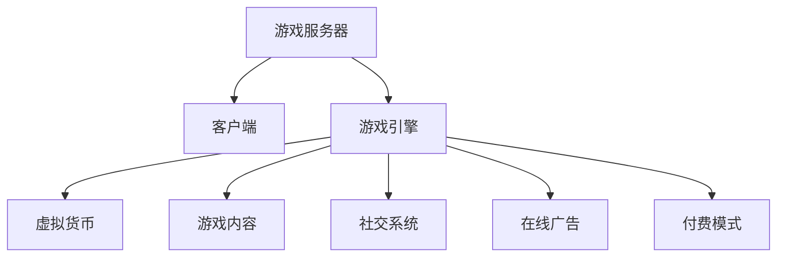

                 

# 网络游戏创业：虚拟世界的商业价值

## 1. 背景介绍

### 1.1 问题由来
近年来，随着信息技术的发展，数字娱乐市场迎来了爆发式增长，其中网络游戏（Online Game）成为了一个最具活力的细分领域。网络游戏不仅提供了丰富的娱乐体验，也为创业者提供了广阔的发展空间。然而，由于游戏行业的复杂性和高门槛，许多初创团队在市场竞争中遭遇重重困难。如何在激烈的市场环境中脱颖而出，找到可持续的商业模式，是游戏创业者所面临的重要挑战。

### 1.2 问题核心关键点
网络游戏创业的核心关键点包括但不限于：
- **用户需求分析**：精准定位目标用户群体，明确其需求和偏好。
- **市场竞争分析**：识别竞争对手的优势和劣势，寻找市场空缺。
- **商业模式设计**：结合产品特性和用户需求，设计创新的盈利模式。
- **技术平台构建**：开发稳定高效的游戏服务器和客户端，保障用户体验。
- **市场推广策略**：选择合适的渠道进行市场推广，提升用户覆盖率。

### 1.3 问题研究意义
研究网络游戏创业的商业模式，对于推动数字娱乐产业的创新和发展，具有重要意义：

1. **促进行业创新**：通过研究游戏创业者的成功经验，可以为行业带来新的商业模式和运营模式。
2. **提升市场竞争力**：掌握市场动态和用户需求，可以帮助企业制定更加有效的竞争策略。
3. **激发创业活力**：通过案例分析和模式创新，为新兴创业者提供宝贵的指导和启示。
4. **增强用户体验**：优化商业模式和市场推广策略，提升游戏产品的吸引力和用户体验。
5. **推动产业发展**：游戏创业的创新和繁荣，将进一步带动整个数字娱乐产业的进步。

## 2. 核心概念与联系

### 2.1 核心概念概述

为更好地理解网络游戏创业的商业模式，本节将介绍几个密切相关的核心概念：

- **游戏服务器（Game Server）**：负责处理游戏中的逻辑和数据存储，是游戏运行的核心。
- **客户端（Client）**：游戏玩家操作游戏界面和交互的主要工具。
- **游戏引擎（Game Engine）**：提供游戏开发和运行的基础框架，支持各种游戏类型的开发。
- **虚拟货币（In-Game Currency）**：游戏中用于购买虚拟商品和服务的货币系统。
- **游戏内容（Game Content）**：包括游戏地图、角色、道具等，是游戏体验的核心。
- **社交系统（Social System）**：支持玩家之间的互动和交流，增强游戏粘性。
- **在线广告（In-Game Advertising）**：在游戏中插入广告，增加收入来源。
- **付费模式（Payment Model）**：游戏公司通过用户付费获取收入的方式。

这些核心概念之间的逻辑关系可以通过以下Mermaid流程图来展示：



这个流程图展示了一些关键组件之间的关联关系：

1. 游戏服务器和客户端是游戏运行的基础。
2. 游戏引擎提供游戏开发和运行的支持。
3. 虚拟货币和游戏内容是游戏体验的关键。
4. 社交系统和在线广告增强了游戏的互动性和收入来源。
5. 付费模式是游戏公司获取收入的主要手段。

这些概念共同构成了网络游戏的基本框架，使得游戏创业者可以围绕这些核心组件进行商业模式的设计和优化。

## 3. 核心算法原理 & 具体操作步骤
### 3.1 算法原理概述

网络游戏创业中的商业模式设计，本质上是多目标优化问题。创业者需要在游戏体验、用户粘性、收入增长等方面找到最优平衡点，以实现可持续发展。这一过程涉及以下几个核心算法原理：

- **用户行为分析**：通过数据分析和用户调研，理解用户的行为模式和偏好。
- **收益模型构建**：设计合理的付费模式，并计算其预期收益。
- **市场定价策略**：根据市场需求和成本，确定虚拟货币和道具的价格。
- **广告投放策略**：优化广告投放的时间和渠道，提高广告效果。
- **社交网络分析**：分析社交系统的影响力，设计有效的社交激励机制。
- **数据分析与优化**：通过数据驱动的方式，持续优化游戏和商业模式。

### 3.2 算法步骤详解

基于上述核心算法原理，网络游戏创业的商业模式设计通常包括以下关键步骤：

**Step 1: 市场调研与需求分析**
- 收集目标用户群体的信息，如年龄、性别、地域等。
- 分析用户对游戏内容和体验的需求，如画质、难度、社交互动等。
- 识别市场竞争环境，评估竞争者的优势和劣势。

**Step 2: 游戏设计和内容制作**
- 确定游戏的核心玩法和特色，设计游戏地图、角色、道具等游戏内容。
- 开发和优化游戏引擎，保障游戏的稳定性和性能。
- 设计和实现虚拟货币系统，保证其稳定性和安全性。

**Step 3: 商业模式设计**
- 选择合适的付费模式，如免费+内购、买断制等。
- 设计合理的虚拟货币和道具价格，平衡用户需求和公司收益。
- 引入广告系统和社交系统，增加收入来源和用户粘性。

**Step 4: 市场推广与用户获取**
- 选择合适的市场推广渠道，如社交媒体、搜索引擎等。
- 制定推广策略，设计广告内容和形式，提高用户曝光率。
- 开展用户测试，收集反馈，优化游戏体验和商业模式。

**Step 5: 数据分析与优化**
- 实时监测用户行为数据，如登录频率、消费行为等。
- 分析数据，识别瓶颈和问题，优化游戏和商业模式。
- 持续改进，保持竞争优势和市场活力。

### 3.3 算法优缺点

基于上述步骤，网络游戏创业中的商业模式设计具有以下优点：

1. **灵活性强**：可以根据市场需求和用户反馈灵活调整商业模式和运营策略。
2. **可扩展性高**：能够适应不同市场环境和用户群体的需求。
3. **收益可控**：通过设计合理的付费模式和价格策略，能够稳定获取收入。

同时，该方法也存在一些局限性：

1. **成本高**：游戏开发和市场推广成本较高，需要大量资金和人力投入。
2. **风险大**：市场竞争激烈，用户需求变化快，商业模式需要不断优化和调整。
3. **技术门槛高**：游戏开发需要高水平的技术支撑，对开发团队的要求较高。
4. **用户流失率高**：用户对游戏内容和付费模式的不满，可能导致高流失率。

尽管存在这些局限性，但通过合理的商业模式设计，游戏创业者仍然可以在激烈的市场竞争中脱颖而出，创造显著的商业价值。

### 3.4 算法应用领域

网络游戏创业中的商业模式设计，已经广泛应用于各种类型的游戏开发和运营中，例如：

- **移动游戏**：如休闲游戏、角色扮演游戏等，通过免费+内购或买断制模式获取收入。
- **桌面游戏**：如桌面卡牌游戏、策略游戏等，通过实体卡包和在线订阅获取收益。
- **多人在线游戏（MMO）**：如MMO角色扮演游戏、竞技游戏等，通过虚拟货币和道具销售增加收入。
- **独立游戏**：如独立开发的像素游戏、沙盒游戏等，通过付费下载或众筹获得资金支持。

除了上述这些经典应用外，游戏创业者还在不断探索新的商业模式，如元宇宙游戏、虚拟现实游戏、NFT游戏等，为游戏行业带来了更多的创新和机遇。

## 4. 数学模型和公式 & 详细讲解  
### 4.1 数学模型构建

本节将使用数学语言对网络游戏创业的商业模式进行更加严格的刻画。

设游戏用户数为 $U$，虚拟货币价格为 $P$，道具价格为 $D$，用户日活跃度为 $A$，用户留存率 $R$，广告收入为 $I$，社交系统影响系数为 $S$。假设用户每日平均消费为 $C$，则游戏的日收益 $R_{\text{daily}}$ 可表示为：

$$
R_{\text{daily}} = U \cdot P \cdot D \cdot A \cdot R \cdot C + I \cdot S
$$

其中，$U$ 和 $A$ 可以通过用户行为数据分析得出，$P$ 和 $D$ 通过市场定价策略确定，$R$ 通过留存率分析计算，$I$ 和 $S$ 通过广告投放和社交网络分析获得。

### 4.2 公式推导过程

根据上述公式，我们可以进一步推导出游戏月收益 $R_{\text{monthly}}$ 的计算公式：

$$
R_{\text{monthly}} = R_{\text{daily}} \cdot 30
$$

通过此公式，游戏创业者可以量化其商业模式的收益预期，并据此进行资源配置和策略调整。

### 4.3 案例分析与讲解

以下是一个简单的案例分析：

假设某游戏公司开发了一款MMO角色扮演游戏，目标用户群体的月活跃用户数为 $U = 10^6$，虚拟货币价格 $P = 1$，道具价格 $D = 0.5$，用户日活跃度 $A = 0.3$，用户留存率 $R = 0.7$，广告收入 $I = 10^5$，社交系统影响系数 $S = 0.8$。用户每日平均消费 $C = 1$。

根据上述公式，该游戏的日收益为：

$$
R_{\text{daily}} = 10^6 \cdot 1 \cdot 0.5 \cdot 0.3 \cdot 0.7 \cdot 1 + 10^5 \cdot 0.8 = 245000
$$

月收益为：

$$
R_{\text{monthly}} = 245000 \cdot 30 = 7350000
$$

可以看到，通过精确计算和数据分析，游戏公司可以制定更加合理的定价策略和推广策略，最大化其商业收益。

## 5. 项目实践：代码实例和详细解释说明
### 5.1 开发环境搭建

在进行商业模式设计项目实践前，我们需要准备好开发环境。以下是使用Python进行数据分析和计算的环境配置流程：

1. 安装Anaconda：从官网下载并安装Anaconda，用于创建独立的Python环境。

2. 创建并激活虚拟环境：
```bash
conda create -n game-analysis python=3.8 
conda activate game-analysis
```

3. 安装必要的Python库：
```bash
conda install pandas numpy matplotlib
```

4. 安装Python分析工具包：
```bash
pip install scikit-learn
```

完成上述步骤后，即可在`game-analysis`环境中开始商业模式设计实践。

### 5.2 源代码详细实现

下面我们以一款假设的MMO游戏为例，给出使用Python进行商业模式数据分析的代码实现。

```python
import pandas as pd
import numpy as np
import matplotlib.pyplot as plt

# 设定游戏相关参数
U = 10**6  # 月活跃用户数
P = 1      # 虚拟货币价格
D = 0.5    # 道具价格
A = 0.3    # 用户日活跃度
R = 0.7    # 用户留存率
I = 10**5  # 广告收入
S = 0.8    # 社交系统影响系数
C = 1      # 用户每日平均消费

# 计算日收益
R_daily = U * P * D * A * R * C + I * S

# 计算月收益
R_monthly = R_daily * 30

# 输出结果
print(f"日收益: {R_daily}")
print(f"月收益: {R_monthly}")
```

以上就是使用Python对MMO游戏商业模式的简单计算代码实现。可以看到，通过Python的强大数据分析能力，可以轻松地计算和优化游戏的商业收益。

### 5.3 代码解读与分析

让我们再详细解读一下关键代码的实现细节：

**游戏参数设定**：
- 通过变量设定，将游戏的各项关键参数进行量化。

**日收益计算**：
- 使用上述公式计算日收益。

**月收益计算**：
- 根据日收益计算月收益。

**结果输出**：
- 通过打印输出结果，直观展示游戏商业模式的收益预期。

这些代码的实现，展示了数据分析在网络游戏商业模式设计中的重要作用。开发者可以通过调整各参数值，快速验证不同策略下的收益变化，从而找到最优的商业模式。

## 6. 实际应用场景
### 6.1 移动游戏

移动游戏凭借其便捷性和易传播性，成为网络游戏市场的重要组成部分。通过精确的商业模式设计，移动游戏可以实现快速用户增长和高效收益。

例如，某游戏公司开发了一款休闲游戏，采用了免费+内购的商业模式。通过精准的市场调研，公司找到了目标用户群体，并设计了多样化的道具和虚拟货币，吸引了大量用户进行内购消费。同时，通过社交系统和广告系统的有效配合，该游戏在短时间内实现了巨大的用户覆盖率和收益增长。

### 6.2 桌面游戏

桌面游戏通常具有较强的社交属性和深度体验。通过设计合理的付费模式和道具系统，桌面游戏能够获取稳定的收益。

某游戏公司开发了一款桌面卡牌游戏，采用实体卡包和在线订阅的商业模式。通过精心设计的卡牌和道具，吸引了大量玩家进行购买。同时，公司通过社交系统增强了玩家的粘性，形成了稳定的用户群体。此外，公司还通过广告系统增加了收入来源，提升了游戏品牌的知名度。

### 6.3 MMO游戏

MMO游戏以其沉浸式体验和高收益潜力受到游戏公司的青睐。通过设计合理的虚拟货币和道具系统，MMO游戏可以实现高收入和长期用户留存。

某游戏公司开发了一款MMO角色扮演游戏，采用了虚拟货币和道具销售的商业模式。通过精细的游戏设计和良好的用户体验，游戏吸引了大量用户进行长期投入。同时，公司通过社交系统和广告系统，进一步增强了用户粘性和收益增长。

### 6.4 独立游戏

独立游戏通常具有独特的创意和个性化的用户体验。通过众筹和独立开发，独立游戏可以实现差异化的竞争优势。

某游戏公司开发了一款独立沙盒游戏，通过众筹获取了资金支持。在游戏设计和运营过程中，公司注重用户反馈，不断优化游戏体验。同时，公司通过广告系统增加了曝光率，吸引更多用户下载和购买。

## 7. 工具和资源推荐
### 7.1 学习资源推荐

为了帮助游戏开发者系统掌握商业模式设计的理论基础和实践技巧，这里推荐一些优质的学习资源：

1. **《网络游戏商业运营与市场营销》**：详细讲解了网络游戏商业模式的各个方面，包括用户分析、市场推广、收入模型等。

2. **《数字娱乐产业管理》**：介绍了数字娱乐产业的整体管理框架，包括游戏开发、运营、营销等环节。

3. **《数据分析与商业智能》**：通过Python等工具，讲解了数据分析在商业模式设计中的应用，提供了丰富的案例分析。

4. **《游戏设计模式》**：系统介绍了游戏设计的各种模式和策略，为游戏创业者提供了宝贵的灵感和指导。

5. **《在线广告营销》**：讲解了在线广告的基本原理和投放策略，帮助游戏公司优化广告效果。

通过对这些资源的学习实践，相信你一定能够快速掌握游戏商业模式设计的精髓，并用于解决实际的商业问题。
###  7.2 开发工具推荐

高效的开发离不开优秀的工具支持。以下是几款用于游戏商业模式设计的常用工具：

1. **Excel**：强大的电子表格工具，适用于数据统计和分析。
2. **Python**：灵活的编程语言，支持数据分析和计算，适用于复杂模型和算法实现。
3. **Tableau**：数据可视化工具，能够将复杂的数据分析结果以直观的图表呈现。
4. **SQL**：用于数据管理和查询，支持大规模数据的处理和分析。
5. **Google Analytics**：网站分析工具，帮助游戏公司了解用户行为和流量来源。

合理利用这些工具，可以显著提升游戏商业模式设计的效率，加快创新迭代的步伐。

### 7.3 相关论文推荐

游戏商业模式设计的相关研究涉及多个学科，以下是几篇奠基性的相关论文，推荐阅读：

1. **《Online Game Revenue Maximization: A Case Study》**：研究了在线游戏的收益最大化策略，通过实例分析展示了游戏公司如何制定最优价格和投放策略。

2. **《Game Monetization Strategies and Trends》**：系统总结了游戏行业的各种付费模式和收益策略，为游戏创业者提供了全面的参考。

3. **《Game Advertising: Best Practices and Metrics》**：介绍了游戏广告的基本原理和最佳实践，帮助游戏公司提高广告效果。

4. **《Social Influence in Online Games》**：分析了社交系统对游戏用户粘性和收入的影响，为社交系统设计提供了理论依据。

5. **《Game Design and Economic Modeling》**：结合经济学原理，探讨了游戏设计和商业模式的优化，为游戏创业者提供了新的思路。

这些论文代表了大游戏商业模式设计的最新研究成果，通过学习这些前沿成果，可以帮助研究者把握学科前进方向，激发更多的创新灵感。

## 8. 总结：未来发展趋势与挑战
### 8.1 总结

本文对网络游戏创业中的商业模式设计进行了全面系统的介绍。首先阐述了游戏创业的背景和重要性，明确了商业模式设计在推动游戏产业发展中的关键作用。其次，从原理到实践，详细讲解了商业模式设计的数学模型和关键步骤，给出了商业模式设计的完整代码实例。同时，本文还探讨了商业模式在移动游戏、桌面游戏、MMO游戏和独立游戏等多个领域的应用前景，展示了商业模式设计的广泛适用性。

通过本文的系统梳理，可以看到，游戏商业模式设计作为网络游戏创业的核心，通过数据驱动和算法优化，为游戏公司提供了可持续发展的解决方案。通过精准的商业模式设计，游戏创业者可以在激烈的市场竞争中脱颖而出，创造显著的商业价值。

### 8.2 未来发展趋势

展望未来，游戏商业模式设计将呈现以下几个发展趋势：

1. **多元化付费模式**：随着用户需求的多样化，游戏公司将探索更多元的付费模式，如订阅制、时间计费、服务增值等。

2. **游戏内经济系统**：通过构建虚拟经济系统，增强游戏的吸引力和用户粘性，如经济模拟、资源交换等。

3. **数据分析与优化**：游戏公司将更加依赖数据分析，实时监测用户行为，优化游戏体验和商业模式。

4. **用户社区建设**：通过构建用户社区，增强游戏的社交属性和用户粘性，如论坛、社交网络等。

5. **跨平台融合**：游戏公司将探索跨平台的游戏体验和商业模式，如云游戏、虚拟现实游戏等。

以上趋势凸显了游戏商业模式设计的广阔前景。这些方向的探索发展，将进一步提升游戏产品的吸引力和用户粘性，推动游戏行业的发展。

### 8.3 面临的挑战

尽管游戏商业模式设计已经取得了显著成果，但在迈向更加智能化、普适化应用的过程中，它仍面临诸多挑战：

1. **市场竞争激烈**：游戏市场竞争异常激烈，如何在激烈的市场环境中保持竞争力，需要不断创新和优化。

2. **用户需求多变**：用户需求快速变化，需要游戏公司灵活调整商业模式和运营策略。

3. **技术门槛高**：游戏开发需要高水平的技术支撑，对开发团队的要求较高。

4. **成本投入高**：游戏开发和市场推广成本较高，需要大量资金和人力投入。

5. **用户流失率高**：用户对游戏内容和付费模式的不满，可能导致高流失率。

6. **法律法规约束**：游戏行业的法律法规较为严格，需要在商业设计中注重合规性。

正视游戏商业模式设计所面临的这些挑战，积极应对并寻求突破，将是大游戏商业模式设计迈向成熟的必由之路。相信随着学界和产业界的共同努力，这些挑战终将一一被克服，游戏商业模式设计必将在构建人机协同的智能时代中扮演越来越重要的角色。

### 8.4 研究展望

面对游戏商业模式设计所面临的种种挑战，未来的研究需要在以下几个方面寻求新的突破：

1. **多元化数据分析**：结合多种数据源，进行深度分析，为商业决策提供更全面的数据支持。

2. **动态定价策略**：根据市场变化和用户行为，实时调整定价策略，提高收益。

3. **用户行为预测**：利用机器学习和深度学习技术，预测用户行为，优化商业模式和广告投放。

4. **多平台融合**：探索跨平台的游戏体验和商业模式，如云游戏、虚拟现实游戏等。

5. **社交网络分析**：深入分析社交网络的影响力，设计有效的社交激励机制。

6. **跨学科合作**：结合经济学、社会学、心理学等多个学科，进行系统性的商业模式设计。

这些研究方向的探索，必将引领游戏商业模式设计的创新和发展，为游戏公司提供新的商业模式和运营策略，推动游戏行业不断进步。

## 9. 附录：常见问题与解答
----------------------------------------------------------------

**Q1: 游戏商业模式设计是否适用于所有类型的游戏？**

A: 游戏商业模式设计虽然具有广泛的适用性，但在不同类型的游戏中，具体的商业模式设计可能需要有所调整。例如，休闲游戏和MMO游戏的商业模式设计有较大差异，需要根据游戏类型进行具体分析。

**Q2: 如何选择合适的付费模式？**

A: 选择合适的付费模式需要综合考虑游戏类型、用户需求、市场环境等因素。通常，免费+内购模式适用于休闲游戏和社交游戏，买断制模式适用于深度体验的游戏。同时，需要结合市场调研，了解用户对不同付费模式的接受程度。

**Q3: 数据分析在商业模式设计中扮演什么角色？**

A: 数据分析是商业模式设计的核心，通过数据驱动的方式，可以更准确地理解用户需求、市场环境和收益预期。数据分析能够帮助游戏公司优化定价策略、广告投放和用户行为预测，从而提升商业收益。

**Q4: 游戏内经济系统如何设计？**

A: 设计游戏内经济系统需要考虑系统的稳定性和复杂度。通常，需要设计合理的货币系统和物品系统，并确保系统规则透明、公平。同时，需要设计有效的市场机制和交易系统，增强系统的吸引力和玩家粘性。

**Q5: 游戏广告如何提升效果？**

A: 优化游戏广告的关键在于选择合适的广告形式和投放渠道。需要根据用户群体和游戏特性，设计符合用户需求的广告内容。同时，需要实时监测广告效果，进行动态调整，以达到最佳广告效果。

---

作者：禅与计算机程序设计艺术 / Zen and the Art of Computer Programming

