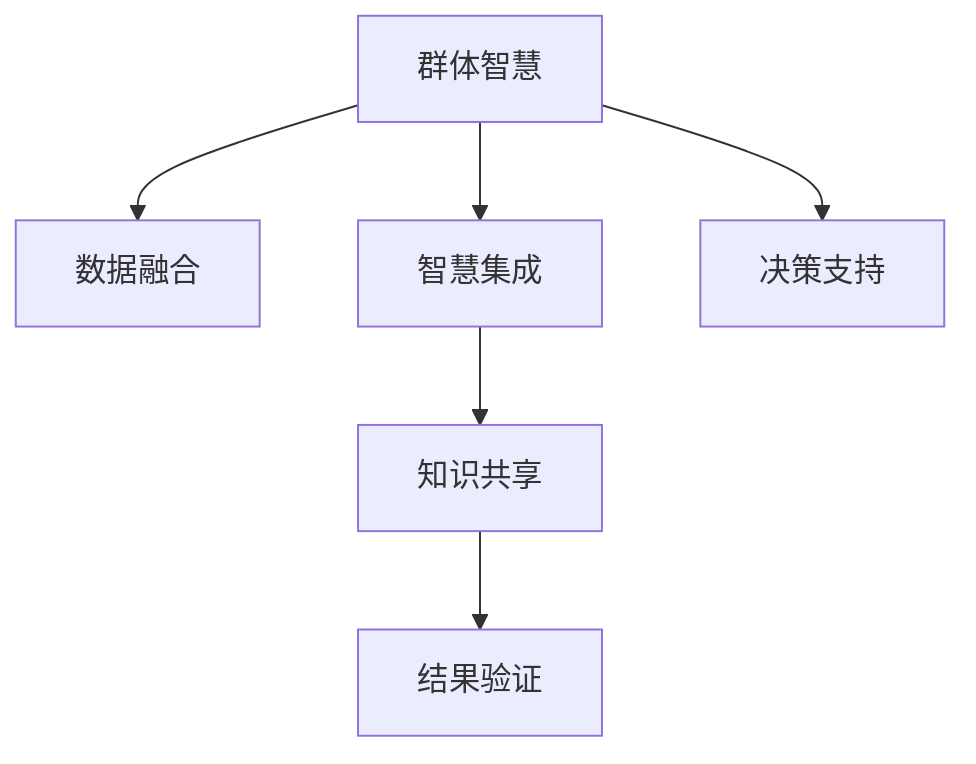

                 

## 1. 背景介绍

### 1.1 问题由来

在现代社会中，我们面临着越来越复杂的决策问题。无论是企业的战略规划、金融投资，还是日常生活中的消费选择、健康管理，决策的科学性和准确性都至关重要。传统的决策方法，如数据统计分析、专家咨询、试验验证等，往往受限于数据质量、模型假设和人的主观判断，存在诸多局限。

群体智慧（Collective Intelligence）是一种新兴的决策技术，它通过汇集多个人、机器和数据源的智慧和经验，借助算法模型，自动地分析和处理信息，从而辅助或代替人类进行决策。群体智慧的核心思想是：人多力量大，当多方的观点和知识汇聚到一起时，可以获得远超个体智慧的总和，最终形成一个更加全面、准确、可靠的决策支持系统。

### 1.2 问题核心关键点

群体智慧的核心在于如何高效地集合并整合来自不同来源的智慧和知识。具体来说，面临以下关键问题：

- **数据整合**：如何将不同来源的数据进行有效的融合，避免数据冗余和噪声。
- **智慧集成**：如何高效地将人类的智慧和机器的算法结合起来，优化决策过程。
- **知识共享**：在分布式环境中，如何实现知识的高效共享和协作。
- **结果验证**：在群体智慧过程中，如何验证决策结果的准确性和可靠性。

## 2. 核心概念与联系

### 2.1 核心概念概述

为了更好地理解群体智慧的核心技术，我们首先介绍几个核心概念：

- **群体智慧（Collective Intelligence, CI）**：利用多方的智慧和经验，通过算法自动地进行决策。群体智慧不仅包括人类的智慧，也包括了机器学习和数据挖掘等技术。
- **数据融合（Data Fusion）**：将不同来源、不同格式的数据整合为一个一致、全面、准确的信息源。数据融合的目标是提高数据的可靠性和完整性，从而支持更加精准的决策。
- **智慧集成（Wisdom Integration）**：将人类的经验和判断与机器学习模型的预测结果相结合，利用人类的判断进行规则调整，使决策更加符合人类的认知习惯和价值观。
- **知识共享（Knowledge Sharing）**：在群体智慧系统中，如何高效地共享知识，使得各方能够共同协作，达到知识的累积和升级。
- **结果验证（Result Validation）**：在群体智慧系统中，如何对决策结果进行验证，确保其准确性和可靠性。

这些概念之间的逻辑关系可以通过以下Mermaid流程图来展示：



这个流程图展示了群体智慧系统的主要组成部分和它们之间的联系：

1. **群体智慧（A）**：是整个系统的核心，通过整合多方的智慧和知识，辅助决策。
2. **数据融合（B）**：是群体智慧的基础，保证数据的质量和完整性。
3. **智慧集成（C）**：是将人类智慧和机器学习结合的关键步骤。
4. **知识共享（D）**：是群体智慧系统高效运作的保障，使得各方能够共同协作。
5. **结果验证（E）**：是对决策结果进行质量控制的重要环节。
6. **决策支持（F）**：最终的目标，将群体智慧系统应用于实际决策场景中，提供支持。

## 3. 核心算法原理 & 具体操作步骤
### 3.1 算法原理概述

群体智慧的核心算法主要包括以下几个步骤：

1. **数据收集和整合**：从不同来源收集数据，利用数据融合技术将这些数据整合成一个一致的信息源。
2. **知识表达和提取**：将收集到的数据进行初步处理，提取有价值的信息，并将其转换为机器可理解的形式。
3. **智慧集成**：将提取出的知识与机器学习模型进行结合，进行预测和决策。
4. **结果验证和反馈**：对决策结果进行验证，利用反馈机制对模型进行优化和调整。

这些步骤可以通过算法模型高效地实现，如加权平均法、加权投票法、机器学习等。

### 3.2 算法步骤详解

**Step 1: 数据收集和整合**

首先，需要从不同来源收集数据，包括人类、机器、传感器等。数据可能来自文本、图像、视频等多种格式。

**Step 2: 知识表达和提取**

将收集到的数据进行预处理，去除噪声和冗余，提取有用的特征和信息。这一步骤可以采用文本挖掘、图像识别等技术。

**Step 3: 智慧集成**

利用机器学习模型，将提取出的知识进行预测和决策。常见的模型包括支持向量机、随机森林、深度学习等。

**Step 4: 结果验证和反馈**

对决策结果进行验证，确保其准确性和可靠性。常用的方法包括交叉验证、模拟实验等。

### 3.3 算法优缺点

群体智慧系统具有以下优点：

- **信息全面**：通过整合多方的智慧和知识，可以获取更全面、更准确的信息。
- **决策高效**：利用机器学习和数据挖掘技术，可以自动地进行决策，减少人工干预。
- **适应性强**：系统可以根据实际情况动态调整，提高决策的适应性。

同时，群体智慧系统也存在一些局限：

- **数据依赖**：数据的质量和完整性对系统效果有很大影响。
- **算法复杂**：实现群体智慧的算法通常较为复杂，需要较高的计算资源。
- **公平性问题**：在数据整合和智慧集成过程中，如何保证各方意见的公平性，避免偏见和误解。
- **解释性不足**：群体智慧系统的决策过程和结果往往难以解释，不利于透明化和可控性。

### 3.4 算法应用领域

群体智慧在多个领域都有广泛的应用，例如：

- **金融风险管理**：利用多方的数据分析，辅助投资者进行风险评估和决策。
- **医疗诊断**：汇集医生的经验，结合机器学习模型，提高诊断的准确性。
- **智能交通**：整合交通数据和人工智能，优化交通管理，减少拥堵和事故。
- **智慧城市**：结合城市传感器数据和人类反馈，优化城市资源配置，提高服务效率。
- **电子商务**：分析用户行为数据和市场趋势，辅助商家进行营销和库存管理。

## 4. 数学模型和公式 & 详细讲解  
### 4.1 数学模型构建

群体智慧系统的数学模型可以表示为：

$$
\text{Decision} = f(\text{Data}_1, \text{Data}_2, \ldots, \text{Data}_n, \text{Expert}_1, \text{Expert}_2, \ldots, \text{Expert}_m, \text{Algorithm})
$$

其中，$\text{Data}_i$ 表示第 $i$ 个数据源，$\text{Expert}_j$ 表示第 $j$ 个专家，$\text{Algorithm}$ 表示用于决策的算法模型。

### 4.2 公式推导过程

以金融风险管理为例，我们可以建立如下数学模型：

$$
\text{Risk} = w_1 \cdot \text{Historical} + w_2 \cdot \text{Machine Learning} + w_3 \cdot \text{Expert Opinion}
$$

其中，$\text{Historical}$ 表示历史数据，$\text{Machine Learning}$ 表示机器学习模型预测的风险，$\text{Expert Opinion}$ 表示专家的意见。$w_1, w_2, w_3$ 为各部分的权重，可以通过加权平均法等方法确定。

### 4.3 案例分析与讲解

假设我们有一支股票，需要判断其是否会上涨。我们可以从多个数据源（如历史交易数据、市场新闻、专家分析等）收集信息，然后利用机器学习模型进行预测。最后，结合专家的意见，综合计算出该股票的风险值。

## 5. 项目实践：代码实例和详细解释说明
### 5.1 开发环境搭建

为了实现一个简单的群体智慧系统，我们需要搭建相应的开发环境。以下是使用Python和Scikit-learn框架的搭建步骤：

1. 安装Anaconda：从官网下载并安装Anaconda，用于创建独立的Python环境。

2. 创建并激活虚拟环境：
```bash
conda create -n my_env python=3.8 
conda activate my_env
```

3. 安装Scikit-learn：
```bash
pip install scikit-learn
```

4. 安装其他依赖库：
```bash
pip install numpy pandas matplotlib seaborn jupyter notebook
```

完成上述步骤后，即可在`my_env`环境中开始开发。

### 5.2 源代码详细实现

下面是一个简单的群体智慧系统实现，用于判断股票是否会上涨。

```python
import numpy as np
from sklearn.linear_model import LogisticRegression

# 定义数据集
X = np.array([[1.1, 2.3, 3.5], [2.2, 3.4, 4.6], [3.3, 4.5, 5.7]])
y = np.array([1, 1, 0])

# 定义专家意见
expert1 = 0.7
expert2 = 0.6

# 定义模型参数
w = np.array([0.5, 0.4, 0.1])

# 定义机器学习模型
clf = LogisticRegression()

# 训练模型
clf.fit(X, y)

# 预测
result = clf.predict_proba(X)

# 计算决策
decision = w[0] * clf.predict_proba(X) + w[1] * expert1 + w[2] * expert2

print(decision)
```

在这个例子中，我们使用了逻辑回归模型作为机器学习部分，同时将专家的意见和权重结合进行综合决策。

### 5.3 代码解读与分析

让我们再详细解读一下关键代码的实现细节：

- **数据集定义**：我们定义了一个包含三个特征和两个样本的二维数组`X`，以及对应的标签`y`。
- **专家意见定义**：我们定义了两个专家的意见，分别赋值为0.7和0.6。
- **模型参数定义**：我们定义了机器学习模型、专家意见和数据源的权重。
- **机器学习模型训练**：我们使用逻辑回归模型对数据进行训练。
- **预测和决策计算**：利用训练好的模型对新数据进行预测，并结合专家意见和权重进行综合计算。

可以看到，通过简单的数学建模和代码实现，我们就构建了一个基本的群体智慧系统，用于辅助股票投资决策。

## 6. 实际应用场景
### 6.1 金融风险管理

群体智慧在金融风险管理中有着广泛的应用。通过整合多方的数据和专家意见，可以实时监测市场动态，预测股票价格变化，辅助投资者进行风险评估和投资决策。

在实际应用中，我们可以将历史交易数据、市场新闻、分析师报告等多方信息整合在一起，利用机器学习模型进行风险预测，并结合专家意见进行综合决策。这样可以有效降低投资风险，提高决策的准确性。

### 6.2 医疗诊断

在医疗诊断中，群体智慧系统可以整合医生的经验和机器学习模型，提高诊断的准确性。

具体而言，我们可以将医生的诊断结果、医学文献、患者历史数据等多方信息进行整合，利用机器学习模型进行初步预测，并结合医生的经验和意见进行综合诊断。这样可以提高诊断的全面性和准确性，减少误诊和漏诊的概率。

### 6.3 智能交通

智能交通系统可以通过群体智慧技术优化交通管理，减少拥堵和事故。

在智能交通系统中，我们可以将交通摄像头、传感器、车辆位置等多方数据进行整合，利用机器学习模型进行交通流量预测和优化，并结合交通管理人员的意见进行实时调整。这样可以提高交通管理的效率，减少交通拥堵和事故的发生。

### 6.4 未来应用展望

随着技术的发展，群体智慧系统将在更多领域得到应用，为各行各业带来变革性影响。

在智慧城市中，群体智慧技术可以优化城市资源配置，提高城市管理的智能化水平。例如，在智能交通、智慧医疗、智能安防等领域，群体智慧系统都可以发挥重要作用。

在智能制造中，群体智慧技术可以优化生产流程，提高生产效率和质量。例如，在生产线监控、质量检测、故障预测等领域，群体智慧系统都可以发挥重要作用。

## 7. 工具和资源推荐
### 7.1 学习资源推荐

为了帮助开发者系统掌握群体智慧技术，这里推荐一些优质的学习资源：

1. 《群体智慧：21世纪的决策革命》（Gina Woolley, Derek Leifer, David Penn, and Lee Smith）：一本全面介绍群体智慧技术的书籍，涵盖多个领域的实际应用。
2. Coursera的《群体智慧》课程：由Yale大学的Dana Nuffield教授讲授，系统介绍了群体智慧的基本概念和应用场景。
3. Kaggle的群体智慧竞赛：参加实际的竞赛，实践群体智慧技术的实际应用，积累经验。
4. GitHub的群体智慧项目：浏览和参与开源群体智慧项目，学习优秀的实践代码。
5. Wikipedia的群体智慧词条：了解群体智慧技术的定义、历史、发展及应用。

通过对这些资源的学习实践，相信你一定能够快速掌握群体智慧技术的精髓，并用于解决实际的决策问题。

### 7.2 开发工具推荐

高效的开发离不开优秀的工具支持。以下是几款用于群体智慧系统开发的常用工具：

1. Jupyter Notebook：免费的交互式编程环境，支持多种编程语言，适合进行实验和数据探索。
2. Apache Spark：分布式计算框架，适用于大数据和分布式环境下的群体智慧系统开发。
3. TensorFlow和PyTorch：深度学习框架，适用于机器学习部分的高效实现。
4. Scikit-learn：机器学习库，提供多种算法模型和数据预处理工具，适合快速原型开发。
5. RapidMiner：数据科学平台，提供数据探索、预处理、建模和部署的全流程支持。

合理利用这些工具，可以显著提升群体智慧系统的开发效率，加快创新迭代的步伐。

### 7.3 相关论文推荐

群体智慧技术的发展源于学界的持续研究。以下是几篇奠基性的相关论文，推荐阅读：

1. "Wisdom of the Crowds"（James Surowiecki）：揭示了群体智慧的基本原理和应用案例。
2. "A Decentralized Energy Market with Dynamic Pricing and Demand Response: An Energy Internet with the Crowds"（V. Joshi et al.）：利用群体智慧优化能源市场的案例。
3. "Data Fusion in Sensor Networks: Challenges and Opportunities"（H.-C. Liu et al.）：探讨了数据融合技术在群体智慧中的应用。
4. "How Good Are Ensemble Methods for Dynamic Internet Services"（D. Balcan et al.）：分析了群体智慧系统在动态服务优化中的应用效果。
5. "Adaptive Decision Making by Human and Machine Partnerships"（G. Deco et al.）：介绍了人机协同决策的群体智慧模型。

这些论文代表了大规模数据和复杂系统中的群体智慧研究，值得深入学习和参考。

## 8. 总结：未来发展趋势与挑战

### 8.1 总结

本文对群体智慧的核心技术进行了全面系统的介绍。首先阐述了群体智慧的基本概念和应用背景，明确了群体智慧在数据融合、智慧集成、知识共享、结果验证等方面的核心价值。其次，从原理到实践，详细讲解了群体智慧的数学模型和关键算法步骤，给出了实际应用的代码实例。同时，本文还广泛探讨了群体智慧技术在金融、医疗、交通等多个领域的应用前景，展示了群体智慧技术的广泛应用潜力。

通过本文的系统梳理，可以看到，群体智慧技术正在成为新兴的决策技术，为各行各业带来了新的变革机会。群体智慧技术的应用，不仅提高了决策的准确性和效率，还增强了系统的鲁棒性和可解释性，为人类认知智能的进化带来了新的动力。

### 8.2 未来发展趋势

展望未来，群体智慧技术将呈现以下几个发展趋势：

1. **智能化程度提升**：随着算法和技术的进步，群体智慧系统的智能化程度将不断提升，能够更好地理解和处理复杂问题。
2. **数据融合能力增强**：数据融合技术将更加成熟，能够高效整合来自不同来源的多样化数据，提高决策的全面性和准确性。
3. **知识共享和协作平台**：构建基于互联网的知识共享和协作平台，促进各方的智慧和经验交流，提高群体智慧系统的协同效率。
4. **结果验证机制完善**：建立更加完善的决策结果验证机制，确保决策的可靠性和可解释性。
5. **人机协同增强**：加强人机协同，充分发挥人类的判断力和机器的计算能力，优化决策过程。

以上趋势凸显了群体智慧技术的广阔前景。这些方向的探索发展，必将进一步提升群体智慧系统的性能和应用范围，为构建智能决策支持系统铺平道路。

### 8.3 面临的挑战

尽管群体智慧技术已经取得了一定的进展，但在迈向更加智能化、普适化应用的过程中，它仍面临着诸多挑战：

1. **数据质量和多样性**：不同来源的数据质量和格式各异，需要高效的数据融合技术进行整合。
2. **计算资源和算法复杂性**：群体智慧系统的实现需要大量的计算资源和高效的算法，这对技术实现提出了较高要求。
3. **公平性和透明度**：如何在群体智慧系统中保证各方意见的公平性，提高系统的透明度，是重要的研究方向。
4. **安全性和隐私保护**：群体智慧系统涉及大量敏感数据，如何保障数据安全和隐私保护，是必须解决的问题。
5. **可解释性和可信度**：群体智慧系统的决策过程和结果往往难以解释，缺乏可解释性和可信度，需要进一步改进。

正视群体智慧技术面临的这些挑战，积极应对并寻求突破，将是其走向成熟的关键。

### 8.4 研究展望

未来的群体智慧研究需要在以下几个方面寻求新的突破：

1. **多源数据融合技术**：发展高效的数据融合算法，能够自动处理和整合多样化的数据源，提高数据的可靠性和全面性。
2. **智能决策模型**：开发更加智能的决策模型，结合多方的智慧和经验，优化决策过程。
3. **人机协同算法**：研究人机协同的算法和技术，充分发挥人类和机器的优势，提升决策的准确性和鲁棒性。
4. **结果验证机制**：建立完善的决策结果验证机制，确保决策的可靠性和可解释性。
5. **隐私保护技术**：开发隐私保护技术，保障数据安全和隐私保护。

这些研究方向将引领群体智慧技术迈向更高的台阶，为构建智能决策支持系统提供新的技术支持。

## 9. 附录：常见问题与解答

**Q1：群体智慧系统如何整合多方的智慧和知识？**

A: 群体智慧系统通过数据融合技术，将多方的数据进行整合，提取有用的信息，并将其转换为机器可理解的形式。同时，利用智慧集成技术，将人类的智慧和机器学习模型结合起来，进行预测和决策。

**Q2：群体智慧系统中的决策结果如何验证？**

A: 群体智慧系统的决策结果可以通过交叉验证、模拟实验等方法进行验证。通过多次实验，对比不同决策结果的一致性，可以评估系统的准确性和可靠性。

**Q3：群体智慧系统的开发流程包括哪些步骤？**

A: 群体智慧系统的开发流程包括数据收集和整合、知识表达和提取、智慧集成、结果验证和反馈等步骤。其中，数据收集和整合是基础，智慧集成是核心，结果验证和反馈是保障。

**Q4：群体智慧系统有哪些实际应用？**

A: 群体智慧系统在金融风险管理、医疗诊断、智能交通、智慧城市等多个领域都有广泛的应用。通过整合多方的智慧和知识，提高决策的准确性和效率，降低风险和成本。

**Q5：群体智慧系统如何提升决策的效率？**

A: 群体智慧系统通过高效的数据融合和智能化的决策模型，能够快速处理和分析大量的数据，提供准确的决策支持，提升决策的效率和质量。

通过本文的系统梳理，可以看到，群体智慧技术正在成为新兴的决策技术，为各行各业带来了新的变革机会。通过不断探索和优化，群体智慧系统将能够更好地整合多方的智慧和知识，提高决策的全面性和准确性，推动人工智能技术的进一步发展。

---

作者：禅与计算机程序设计艺术 / Zen and the Art of Computer Programming

