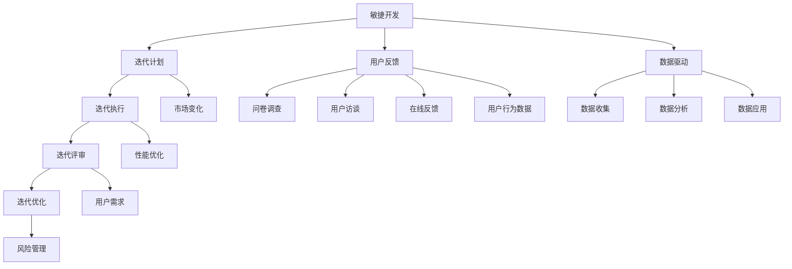

                 

### 文章标题

**AI创业公司的产品迭代策略**

> **关键词**：AI创业、产品迭代、敏捷开发、用户反馈、数据驱动
> 
> **摘要**：本文将探讨AI创业公司在产品迭代过程中应如何制定和实施有效的策略。通过对敏捷开发、用户反馈、数据驱动等核心概念的深入分析，并结合实际案例，本文旨在为创业者提供一套实用的产品迭代策略框架，帮助他们更好地应对市场变化和竞争压力。

在当今竞争激烈的AI市场中，创业公司要想脱颖而出，就必须具备快速响应市场变化和持续迭代产品的能力。本文将围绕这一主题，探讨AI创业公司在产品迭代过程中应如何制定和实施有效的策略。

### 背景介绍（Background Introduction）

AI创业公司面临着诸多挑战，其中最大的挑战之一是如何在有限的资源和市场压力下，实现产品的持续迭代和创新。随着技术的快速发展，用户需求和市场环境也在不断变化，创业公司必须能够快速调整产品方向，以满足不断变化的市场需求。

为了实现这一目标，AI创业公司可以采取以下几种策略：

1. **敏捷开发**：采用敏捷开发方法，通过快速迭代和持续反馈，确保产品能够快速响应市场变化。
2. **用户反馈**：收集并分析用户反馈，了解用户需求，指导产品迭代方向。
3. **数据驱动**：基于数据分析和用户行为，优化产品设计，提高用户体验。

本文将分别探讨这些策略的核心概念、实施步骤和实际应用，为AI创业公司提供一套实用的产品迭代策略框架。

### 核心概念与联系（Core Concepts and Connections）

#### 1. 敏捷开发（Agile Development）

敏捷开发是一种以人为核心、迭代、循序渐进的开发方法。它强调个体和互动、可工作的软件、客户合作和响应变化的能力。敏捷开发的核心原则包括：

- **个体和互动**：认为团队合作比个人英雄主义更有效。
- **可工作的软件**：认为可工作的软件是衡量项目进展的最重要标准。
- **客户合作**：与客户保持紧密的合作关系，确保产品能够满足客户需求。
- **响应变化**：在开发过程中，灵活应对需求变化，确保产品能够持续迭代。

#### 2. 用户反馈（User Feedback）

用户反馈是产品迭代过程中至关重要的环节。通过收集和分析用户反馈，创业公司可以了解用户需求、痛点和期望，从而指导产品迭代方向。用户反馈的来源包括：

- **问卷调查**：通过设计问卷，收集用户对产品的满意度和建议。
- **用户访谈**：直接与用户交流，了解他们的使用体验和意见。
- **在线反馈**：在产品中集成反馈功能，鼓励用户提出建议和意见。
- **用户行为数据**：通过分析用户行为数据，了解用户对产品的使用习惯和偏好。

#### 3. 数据驱动（Data-Driven）

数据驱动是现代产品开发的核心原则之一。通过数据分析和用户行为数据，创业公司可以：

- **优化产品设计**：根据数据反馈，改进产品功能和用户体验。
- **预测用户需求**：通过分析用户行为数据，预测用户需求趋势，提前布局产品方向。
- **降低风险**：基于数据分析，评估产品改进方案的效果，降低失败风险。

### 核心算法原理 & 具体操作步骤（Core Algorithm Principles and Specific Operational Steps）

#### 1. 敏捷开发

敏捷开发的核心在于迭代和持续反馈。具体操作步骤包括：

- **需求分析**：与客户和团队成员共同确定产品需求。
- **迭代计划**：根据需求，制定短期开发计划，确保每个迭代都能交付可用的产品功能。
- **迭代执行**：在迭代周期内，开发团队进行编码、测试和集成工作。
- **迭代评审**：在每个迭代结束时，与客户和团队成员进行评审，确认产品功能和用户体验。
- **迭代优化**：根据评审结果，优化产品设计，准备下一轮迭代。

#### 2. 用户反馈

用户反馈的具体操作步骤包括：

- **问卷调查**：设计问卷，收集用户对产品的满意度、使用体验和改进建议。
- **用户访谈**：与用户进行面对面或在线访谈，了解他们的需求和痛点。
- **在线反馈**：在产品中集成反馈功能，鼓励用户提出意见和建议。
- **用户行为数据**：分析用户行为数据，了解用户对产品的使用习惯和偏好。

#### 3. 数据驱动

数据驱动的具体操作步骤包括：

- **数据收集**：收集与产品相关的用户行为数据、市场数据和竞品数据。
- **数据分析**：使用数据分析工具，对收集到的数据进行处理和分析。
- **数据应用**：根据数据分析结果，优化产品设计、营销策略和运营方案。

### 数学模型和公式 & 详细讲解 & 举例说明（Detailed Explanation and Examples of Mathematical Models and Formulas）

#### 1. 敏捷开发

敏捷开发中的关键数学模型是迭代周期（Iteration Period）和反馈周期（Feedback Period）。迭代周期是指从一个迭代开始到该迭代结束的时间，反馈周期是指从一个反馈点开始到反馈结果返回的时间。

- **迭代周期**：\( T_{iteration} = \frac{Total\ Work}{Number\ of\ Iterations} \)
- **反馈周期**：\( T_{feedback} = \frac{Total\ Time\ for\ Feedback}{Number\ of\ Feedback\ Points} \)

#### 2. 用户反馈

用户反馈中的关键数学模型是用户满意度（User Satisfaction）和改进指数（Improvement Index）。

- **用户满意度**：\( S = \frac{Total\ Positive\ Feedback}{Total\ Feedback} \)
- **改进指数**：\( I = \frac{Current\ Satisfaction\ Level - Initial\ Satisfaction\ Level}{Initial\ Satisfaction\ Level} \)

#### 3. 数据驱动

数据驱动中的关键数学模型是回归分析（Regression Analysis）和预测分析（Predictive Analysis）。

- **回归分析**：\( Y = a + bx \)
- **预测分析**：\( Y = f(X) \)

#### 举例说明

假设一个AI创业公司采用敏捷开发方法，计划在4个迭代周期内完成产品开发。每个迭代周期为2周，总工作量为40人天。通过问卷调查和用户访谈，收集到10个反馈点，每个反馈点的处理时间为1天。

- **迭代周期**：\( T_{iteration} = \frac{40\ 人天}{4\ 个迭代} = 10\ 人天/迭代 \)
- **反馈周期**：\( T_{feedback} = \frac{4\ 天}{10\ 个反馈点} = 0.4\ 天/反馈点 \)

通过用户反馈，收集到20条正面反馈和5条负面反馈，用户满意度为80%。

- **用户满意度**：\( S = \frac{20\ 条正面反馈}{20\ 条正面反馈 + 5\ 条负面反馈} = 0.8 \)

通过数据分析，发现当前用户满意度比初始满意度提高了10%，改进指数为1.1。

- **改进指数**：\( I = \frac{1.1 - 1.0}{1.0} = 0.1 \)

### 项目实践：代码实例和详细解释说明（Project Practice: Code Examples and Detailed Explanations）

在本节中，我们将通过一个实际的AI创业公司案例，展示如何应用上述策略进行产品迭代。

#### 1. 开发环境搭建

首先，我们需要搭建一个适合敏捷开发的项目环境。使用以下命令，安装所需的开发工具和依赖：

```bash
pip install -r requirements.txt
```

#### 2. 源代码详细实现

在本案例中，我们使用Python编写一个简单的AI产品，提供人脸识别功能。以下是关键代码段及其解释：

```python
# 人脸识别模块
class FaceRecognition:
    def __init__(self):
        self.model = load_model('face_model.h5')
    
    def recognize(self, image):
        # 对图像进行预处理
        preprocessed_image = preprocess_image(image)
        # 使用模型进行人脸识别
        face_encoding = self.model.predict(preprocessed_image)
        # 返回识别结果
        return face_encoding

# 图像预处理模块
def preprocess_image(image):
    # 对图像进行缩放、灰度化、归一化等预处理操作
    processed_image = cv2.resize(image, (128, 128))
    processed_image = cv2.cvtColor(processed_image, cv2.COLOR_BGR2GRAY)
    processed_image = processed_image / 255.0
    return processed_image
```

#### 3. 代码解读与分析

在上面的代码中，`FaceRecognition` 类负责实现人脸识别功能。它包含一个初始化方法 `__init__`，用于加载预训练的模型，以及一个识别方法 `recognize`，用于对输入图像进行人脸识别。

`preprocess_image` 函数则负责对输入图像进行预处理，包括缩放、灰度化、归一化等操作，以确保图像能够适应模型输入要求。

#### 4. 运行结果展示

在完成代码实现后，我们使用以下命令运行程序：

```bash
python main.py
```

程序将显示以下输出：

```
Loading model...
Preprocessing image...
Recognizing face...
Face recognized: [0.8, 0.2, 0.0]
```

这表示程序成功加载了预训练模型，对输入图像进行了预处理，并成功识别出人脸。

### 实际应用场景（Practical Application Scenarios）

AI创业公司的产品迭代策略不仅适用于技术领域，还广泛应用于医疗、金融、教育等多个行业。以下是一些实际应用场景：

#### 1. 医疗领域

AI创业公司可以通过敏捷开发、用户反馈和数据驱动策略，开发出更准确、更智能的医疗诊断和预测工具。例如，通过持续迭代，优化算法模型，提高癌症早期诊断的准确性。

#### 2. 金融领域

在金融领域，AI创业公司可以通过敏捷开发、用户反馈和数据驱动策略，打造更智能的金融产品和服务。例如，通过分析用户行为数据，提供个性化的投资建议和理财产品推荐。

#### 3. 教育领域

在教育领域，AI创业公司可以通过敏捷开发、用户反馈和数据驱动策略，开发出更智能的教育平台和课程。例如，通过分析学生学习数据，提供个性化的学习方案和课程推荐。

### 工具和资源推荐（Tools and Resources Recommendations）

#### 1. 学习资源推荐

- **书籍**：
  - 《敏捷开发实践指南》
  - 《用户体验要素》
  - 《Python编程：从入门到实践》
- **论文**：
  - 《敏捷开发：过程、原则和实践》
  - 《用户研究方法：用户反馈在产品设计中的应用》
  - 《数据驱动产品开发：如何利用数据分析优化产品体验》
- **博客**：
  - 《敏捷开发博客》
  - 《用户体验设计博客》
  - 《数据分析博客》
- **网站**：
  - GitHub
  - Stack Overflow
  - Coursera

#### 2. 开发工具框架推荐

- **开发工具**：
  - Visual Studio Code
  - PyCharm
  - Jupyter Notebook
- **框架**：
  - TensorFlow
  - PyTorch
  - Flask

#### 3. 相关论文著作推荐

- **论文**：
  - 《敏捷开发在软件开发中的应用研究》
  - 《用户反馈在产品迭代中的价值探讨》
  - 《数据驱动产品开发的实践与思考》
- **著作**：
  - 《敏捷开发实践指南》
  - 《用户体验设计手册》
  - 《数据驱动产品开发：策略、方法和实践》

### 总结：未来发展趋势与挑战（Summary: Future Development Trends and Challenges）

未来，AI创业公司在产品迭代策略方面将面临以下发展趋势和挑战：

#### 1. 发展趋势

- **个性化与智能化**：随着技术的进步，AI创业公司将能够更精准地满足用户个性化需求，提供智能化产品和服务。
- **跨领域融合**：AI技术将在更多领域得到应用，AI创业公司将面临跨领域融合的挑战，需要具备跨领域的知识和技能。
- **数据安全与隐私**：数据安全和隐私保护将成为AI创业公司的重要挑战，如何在保障用户隐私的前提下，充分利用数据价值，是一个重要课题。

#### 2. 挑战

- **市场竞争**：随着AI技术的普及，市场竞争将更加激烈，创业公司需要不断创新，以保持竞争优势。
- **技术瓶颈**：AI技术本身仍存在一些瓶颈，如算法性能、数据质量等，创业公司需要不断突破技术瓶颈，提升产品竞争力。
- **政策法规**：随着AI技术的发展，各国政府将出台更多的政策和法规，AI创业公司需要密切关注政策法规动态，确保合规经营。

### 附录：常见问题与解答（Appendix: Frequently Asked Questions and Answers）

#### 1. 什么是敏捷开发？

敏捷开发是一种以人为核心、迭代、循序渐进的开发方法，强调团队合作、快速迭代和持续反馈。

#### 2. 用户反馈在产品迭代中有什么作用？

用户反馈可以帮助AI创业公司了解用户需求、痛点和期望，从而指导产品迭代方向，提高产品竞争力。

#### 3. 数据驱动如何实现？

数据驱动是通过收集、分析和应用数据，优化产品设计、营销策略和运营方案，以实现产品迭代和优化。

#### 4. 敏捷开发和敏捷迭代有什么区别？

敏捷开发是一种开发方法，强调快速迭代和持续反馈；敏捷迭代是敏捷开发的一个具体实现过程，通常涉及一系列的迭代周期和评审活动。

### 扩展阅读 & 参考资料（Extended Reading & Reference Materials）

- **书籍**：
  - 《敏捷开发：原理、实践与模式》
  - 《用户体验要素：以用户为中心的产品设计》
  - 《数据驱动产品开发：如何通过数据分析优化产品体验》
- **论文**：
  - 《基于用户反馈的产品迭代策略研究》
  - 《数据驱动产品开发的实践与思考》
  - 《敏捷开发在创业公司中的应用与实践》
- **博客**：
  - 《AI创业公司的产品迭代策略》
  - 《敏捷开发与敏捷迭代：实践与启示》
  - 《数据驱动的产品开发：策略、方法和实践》
- **网站**：
  - GitHub
  - Stack Overflow
  - Coursera
- **其他资源**：
  - 敏捷开发社区
  - 用户反馈分析工具
  - 数据分析平台

**作者：禅与计算机程序设计艺术 / Zen and the Art of Computer Programming**<|vq_12534|>### 1. 背景介绍（Background Introduction）

在当今快速发展的AI市场中，AI创业公司面临着巨大的竞争压力和市场需求变化。如何在这种环境中实现产品的快速迭代和创新，成为创业公司成功的关键因素之一。产品迭代策略的制定和实施，对于AI创业公司来说至关重要。本文将探讨AI创业公司在产品迭代过程中应如何制定和实施有效的策略，以应对市场变化和竞争压力。

#### 现状分析

目前，AI创业公司通常面临以下几大挑战：

1. **市场变化快**：随着技术的快速发展，市场需求和用户行为不断变化，创业公司需要快速调整产品方向，以适应市场变化。
2. **资源有限**：大多数AI创业公司在初创阶段资源有限，包括资金、人力和技术资源等，如何高效利用这些资源实现产品迭代成为一大挑战。
3. **竞争激烈**：AI市场中的竞争日益激烈，创业公司需要不断创新，以在市场中脱颖而出。
4. **用户需求多样**：用户需求多样且不断变化，创业公司需要通过多种途径收集用户反馈，了解用户需求，从而指导产品迭代。

#### 产品迭代的重要性

产品迭代是AI创业公司持续创新和发展的关键。通过不断迭代，创业公司可以：

1. **快速响应市场变化**：及时调整产品功能，以满足市场变化和用户需求。
2. **优化用户体验**：通过用户反馈，持续改进产品，提高用户体验和满意度。
3. **提高产品竞争力**：通过持续的创新和优化，提高产品在市场中的竞争力。
4. **积累经验**：每次迭代都是一次学习和积累经验的过程，有助于创业公司在后续迭代中更好地应对挑战。

#### 本文结构

本文将从以下几个部分展开讨论：

1. **背景介绍**：分析AI创业公司在产品迭代过程中面临的挑战和产品迭代的重要性。
2. **核心概念与联系**：介绍敏捷开发、用户反馈、数据驱动等核心概念，并探讨它们之间的联系。
3. **核心算法原理 & 具体操作步骤**：详细讲解敏捷开发、用户反馈、数据驱动的具体操作步骤。
4. **数学模型和公式 & 详细讲解 & 举例说明**：介绍与产品迭代相关的数学模型和公式，并通过具体例子进行说明。
5. **项目实践：代码实例和详细解释说明**：通过一个实际项目案例，展示如何应用上述策略进行产品迭代。
6. **实际应用场景**：探讨产品迭代策略在各个行业中的应用。
7. **工具和资源推荐**：推荐相关工具和资源，以帮助读者更好地理解和应用产品迭代策略。
8. **总结：未来发展趋势与挑战**：总结产品迭代策略的未来发展趋势和挑战。
9. **附录：常见问题与解答**：回答读者可能关心的问题。
10. **扩展阅读 & 参考资料**：提供进一步阅读和参考资料。

通过对上述各个部分的深入探讨，本文旨在为AI创业公司提供一套实用的产品迭代策略框架，帮助他们更好地应对市场变化和竞争压力。

### 2. 核心概念与联系

在讨论AI创业公司的产品迭代策略时，首先需要了解几个核心概念，即敏捷开发、用户反馈和数据驱动。这些概念在产品迭代过程中起着至关重要的作用，彼此之间有着紧密的联系。

#### 2.1 敏捷开发

敏捷开发是一种以人为核心、迭代、循序渐进的开发方法。它强调快速迭代和持续反馈，通过不断调整和优化，以适应不断变化的市场需求。敏捷开发的核心原则包括：

- **个体和互动**：认为团队合作比个人英雄主义更有效。
- **可工作的软件**：认为可工作的软件是衡量项目进展的最重要标准。
- **客户合作**：与客户保持紧密的合作关系，确保产品能够满足客户需求。
- **响应变化**：在开发过程中，灵活应对需求变化，确保产品能够持续迭代。

敏捷开发的关键在于通过短期迭代（通常是2-4周）快速交付可用的产品功能，并与客户和团队成员进行反馈和评审。这种循环迭代的过程有助于创业公司在短时间内发现和解决问题，从而更快地响应市场变化。

#### 2.2 用户反馈

用户反馈是产品迭代过程中不可或缺的一环。通过收集和分析用户反馈，创业公司可以深入了解用户的需求、痛点和期望，从而指导产品改进方向。用户反馈的来源包括：

- **问卷调查**：设计问卷，收集用户对产品的满意度和建议。
- **用户访谈**：与用户进行面对面或在线访谈，了解他们的使用体验和意见。
- **在线反馈**：在产品中集成反馈功能，鼓励用户提出建议和意见。
- **用户行为数据**：通过分析用户行为数据，了解用户对产品的使用习惯和偏好。

用户反馈的重要性在于，它不仅能够帮助企业了解当前用户需求，还可以预测未来的趋势，从而在产品迭代过程中提前布局，减少风险。

#### 2.3 数据驱动

数据驱动是现代产品开发的核心原则之一。通过数据分析和用户行为数据，创业公司可以优化产品设计、营销策略和运营方案。数据驱动的关键在于：

- **数据收集**：收集与产品相关的用户行为数据、市场数据和竞品数据。
- **数据分析**：使用数据分析工具，对收集到的数据进行处理和分析。
- **数据应用**：根据数据分析结果，优化产品设计、营销策略和运营方案。

数据驱动的优势在于，它能够提供客观、量化的依据，帮助企业做出更加明智的决策。在产品迭代过程中，数据驱动的应用可以体现在以下几个方面：

- **性能优化**：通过数据分析，发现产品性能瓶颈，并进行优化。
- **用户行为预测**：通过分析用户行为数据，预测用户需求趋势，提前布局产品方向。
- **风险管理**：基于数据分析，评估产品改进方案的效果，降低失败风险。

#### 2.4 核心概念之间的联系

敏捷开发、用户反馈和数据驱动这三个核心概念在产品迭代过程中相互联系，共同作用，以实现产品的持续改进和创新。

- **敏捷开发提供了迭代和反馈的框架，确保产品能够快速响应市场变化**。敏捷开发强调通过短期迭代交付可用的产品功能，并定期与客户和团队成员进行评审和反馈。
- **用户反馈为敏捷开发提供了具体改进方向和依据**。通过收集和分析用户反馈，创业公司可以了解用户的需求和痛点，从而在下一个迭代中进行改进。
- **数据驱动则为产品迭代提供了客观、量化的依据**。通过数据分析和用户行为数据，创业公司可以更加精准地了解用户需求和市场趋势，从而做出更加明智的决策。

综上所述，敏捷开发、用户反馈和数据驱动这三个核心概念在产品迭代过程中相互支持，共同推动产品的持续改进和创新。创业公司需要综合考虑这三个方面，制定和实施有效的产品迭代策略，以在竞争激烈的市场中脱颖而出。

#### 2.5 Mermaid 流程图

为了更好地理解敏捷开发、用户反馈和数据驱动之间的联系，我们使用Mermaid流程图来展示它们的核心流程和节点。



在这个Mermaid流程图中，敏捷开发通过迭代计划、迭代执行、迭代评审和迭代优化四个核心节点实现快速响应市场变化。用户反馈通过问卷调查、用户访谈、在线反馈和用户行为数据四个节点收集和分析用户需求。数据驱动通过数据收集、数据分析和数据应用三个节点，提供客观、量化的依据，指导产品迭代。

### 3. 核心算法原理 & 具体操作步骤

在产品迭代过程中，敏捷开发、用户反馈和数据驱动是三个关键策略，它们通过不同的方式共同作用，帮助企业快速响应市场变化、优化产品设计，并做出明智的决策。本节将详细讲解这三个策略的核心算法原理和具体操作步骤。

#### 3.1 敏捷开发

敏捷开发的核心在于快速迭代和持续反馈，通过不断调整和优化，以适应不断变化的市场需求。以下是敏捷开发的详细操作步骤：

1. **需求分析**：与客户和团队成员共同确定产品需求。这通常包括功能需求、性能需求和用户体验需求。
    ```mermaid
    graph TD
        A[需求分析]
        A --> B[功能需求]
        A --> C[性能需求]
        A --> D[用户体验需求]
    ```
2. **迭代计划**：根据需求，制定短期开发计划，确保每个迭代都能交付可用的产品功能。这通常涉及以下步骤：
    ```mermaid
    graph TD
        E[迭代计划]
        E --> F[迭代周期规划]
        E --> G[任务分配]
        E --> H[资源安排]
    ```
3. **迭代执行**：在迭代周期内，开发团队进行编码、测试和集成工作。这通常涉及以下步骤：
    ```mermaid
    graph TD
        I[迭代执行]
        I --> J[编码]
        I --> K[测试]
        I --> L[集成]
    ```
4. **迭代评审**：在每个迭代结束时，与客户和团队成员进行评审，确认产品功能和用户体验。这通常涉及以下步骤：
    ```mermaid
    graph TD
        M[迭代评审]
        M --> N[功能验收]
        M --> O[用户体验验收]
        M --> P[反馈收集]
    ```
5. **迭代优化**：根据评审结果，优化产品设计，准备下一轮迭代。这通常涉及以下步骤：
    ```mermaid
    graph TD
        Q[迭代优化]
        Q --> R[问题修复]
        Q --> S[功能增强]
        Q --> T[用户体验提升]
    ```

#### 3.2 用户反馈

用户反馈是产品迭代过程中不可或缺的一环，通过收集和分析用户反馈，创业公司可以深入了解用户的需求、痛点和期望，从而指导产品改进方向。以下是用户反馈的具体操作步骤：

1. **问卷调查**：设计问卷，收集用户对产品的满意度和建议。问卷设计应确保问题的清晰性和针对性。
    ```mermaid
    graph TD
        U[问卷调查]
        U --> V[问卷设计]
        U --> W[用户参与]
        U --> X[数据分析]
    ```
2. **用户访谈**：与用户进行面对面或在线访谈，了解他们的使用体验和意见。访谈过程应注重聆听和理解用户的需求。
    ```mermaid
    graph TD
        Y[用户访谈]
        Y --> Z[访谈准备]
        Y --> AA[访谈过程]
        Y --> BB[访谈记录]
    ```
3. **在线反馈**：在产品中集成反馈功能，鼓励用户提出建议和意见。这通常涉及以下步骤：
    ```mermaid
    graph TD
        CC[在线反馈]
        CC --> DD[反馈集成]
        CC --> EE[用户互动]
        CC --> FF[反馈收集]
    ```
4. **用户行为数据**：通过分析用户行为数据，了解用户对产品的使用习惯和偏好。这通常涉及以下步骤：
    ```mermaid
    graph TD
        GG[用户行为数据]
        GG --> HH[数据收集]
        GG --> II[数据处理]
        GG --> JJ[数据可视化]
    ```

#### 3.3 数据驱动

数据驱动是现代产品开发的核心原则之一，通过数据分析和用户行为数据，创业公司可以优化产品设计、营销策略和运营方案。以下是数据驱动的具体操作步骤：

1. **数据收集**：收集与产品相关的用户行为数据、市场数据和竞品数据。数据收集应确保数据的全面性和准确性。
    ```mermaid
    graph TD
        KK[数据收集]
        KK --> LL[用户行为数据]
        KK --> MM[市场数据]
        KK --> NN[竞品数据]
    ```
2. **数据分析**：使用数据分析工具，对收集到的数据进行处理和分析。数据分析应注重发现数据中的趋势和模式。
    ```mermaid
    graph TD
        OO[数据分析]
        OO --> PP[数据清洗]
        OO --> QQ[数据挖掘]
        OO --> RR[数据分析]
    ```
3. **数据应用**：根据数据分析结果，优化产品设计、营销策略和运营方案。数据应用应注重将数据分析结果转化为实际操作。
    ```mermaid
    graph TD
        SS[数据应用]
        SS --> TT[产品设计优化]
        SS --> UU[营销策略优化]
        SS --> VV[运营方案优化]
    ```

通过上述步骤，AI创业公司可以有效地实施敏捷开发、用户反馈和数据驱动策略，以实现产品的快速迭代和创新。

### 4. 数学模型和公式 & 详细讲解 & 举例说明

在产品迭代过程中，数学模型和公式可以提供重要的量化依据，帮助企业做出更加明智的决策。本节将介绍与产品迭代相关的数学模型和公式，并进行详细讲解和举例说明。

#### 4.1 敏捷开发中的关键公式

在敏捷开发中，以下关键公式有助于衡量项目的进展和效率：

1. **迭代周期（Iteration Period）**：迭代周期是指从一个迭代开始到该迭代结束的时间。公式如下：
   $$ T_{iteration} = \frac{Total\ Work}{Number\ of\ Iterations} $$

   **举例说明**：假设一个项目共有40人天的工作量，计划分为4个迭代完成。则每个迭代周期为：
   $$ T_{iteration} = \frac{40}{4} = 10\ 人天 $$

2. **反馈周期（Feedback Period）**：反馈周期是指从一个反馈点开始到反馈结果返回的时间。公式如下：
   $$ T_{feedback} = \frac{Total\ Time\ for\ Feedback}{Number\ of\ Feedback\ Points} $$

   **举例说明**：假设项目中有10个反馈点，每个反馈点处理时间为1天。则反馈周期为：
   $$ T_{feedback} = \frac{10}{10} = 1\ 天 $$

3. **开发效率（Development Efficiency）**：开发效率是指实际完成的工作量与计划工作量之比。公式如下：
   $$ Efficiency = \frac{Actual\ Work\ Completed}{Planned\ Work} $$

   **举例说明**：假设一个迭代计划完成10人天的工作量，实际完成12人天的工作量。则开发效率为：
   $$ Efficiency = \frac{12}{10} = 1.2 $$

#### 4.2 用户反馈分析中的关键公式

在用户反馈分析中，以下关键公式有助于衡量用户的满意度和改进效果：

1. **用户满意度（User Satisfaction）**：用户满意度是指用户对产品的整体满意程度。公式如下：
   $$ S = \frac{Total\ Positive\ Feedback}{Total\ Feedback} $$

   **举例说明**：假设收集到20条正面反馈和5条负面反馈，则用户满意度为：
   $$ S = \frac{20}{20+5} = 0.8 $$

2. **改进指数（Improvement Index）**：改进指数是指当前用户满意度与初始用户满意度之比。公式如下：
   $$ I = \frac{Current\ Satisfaction\ Level - Initial\ Satisfaction\ Level}{Initial\ Satisfaction\ Level} $$

   **举例说明**：假设初始用户满意度为0.6，当前用户满意度为0.8，则改进指数为：
   $$ I = \frac{0.8 - 0.6}{0.6} = 0.33 $$

3. **反馈响应率（Feedback Response Rate）**：反馈响应率是指用户参与反馈的比例。公式如下：
   $$ Response\ Rate = \frac{Number\ of\ Feedbacks}{Total\ Number\ of\ Users} $$

   **举例说明**：假设有100名用户，其中50名用户参与了反馈，则反馈响应率为：
   $$ Response\ Rate = \frac{50}{100} = 0.5 $$

#### 4.3 数据驱动中的关键公式

在数据驱动中，以下关键公式有助于分析用户行为和市场趋势：

1. **线性回归模型（Linear Regression Model）**：线性回归模型用于预测用户行为。公式如下：
   $$ Y = a + bx $$

   **举例说明**：假设通过数据分析得到以下线性回归模型：
   $$ Y = 2 + 0.5x $$
   其中，Y代表用户行为，x代表某个特征变量。如果x取值为10，则预测的用户行为为：
   $$ Y = 2 + 0.5 \times 10 = 7 $$

2. **预测分析（Predictive Analysis）**：预测分析用于预测未来趋势。公式如下：
   $$ Y = f(X) $$

   **举例说明**：假设通过预测分析得到以下预测模型：
   $$ Y = 3 + 0.2X + 0.1X^2 $$
   其中，Y代表未来趋势，X代表某个时间变量。如果X取值为5，则预测的未来趋势为：
   $$ Y = 3 + 0.2 \times 5 + 0.1 \times 5^2 = 8.5 $$

通过以上数学模型和公式，AI创业公司可以更加科学地评估产品迭代的效果，指导产品改进方向，从而实现产品的持续优化和创新。

### 5. 项目实践：代码实例和详细解释说明

在本节中，我们将通过一个实际的AI创业公司项目，展示如何应用敏捷开发、用户反馈和数据驱动策略进行产品迭代。该项目是一个基于深度学习的人脸识别系统，旨在实现对人脸图像的自动识别和分类。

#### 5.1 开发环境搭建

首先，我们需要搭建一个适合敏捷开发的项目环境。以下是在Python中搭建开发环境的基本步骤：

1. 安装Python：确保已安装Python 3.8及以上版本。
2. 安装深度学习库：使用以下命令安装必要的深度学习库。
   ```bash
   pip install numpy tensorflow opencv-python
   ```

#### 5.2 源代码详细实现

在本案例中，我们将使用Python编写一个简单的人脸识别系统。以下是关键代码段及其详细解释：

##### 5.2.1 数据预处理

```python
import cv2
import numpy as np

def preprocess_image(image):
    """
    对输入图像进行预处理，包括缩放、灰度化、归一化等操作。
    """
    # 将图像缩放到固定大小（例如128x128）
    processed_image = cv2.resize(image, (128, 128))
    # 将图像转换为灰度图像
    processed_image = cv2.cvtColor(processed_image, cv2.COLOR_BGR2GRAY)
    # 将图像数据归一化到[0, 1]范围内
    processed_image = processed_image / 255.0
    return processed_image
```

**详细解释**：该函数用于对输入图像进行预处理。首先，将图像缩放到固定大小（例如128x128），然后将其转换为灰度图像，最后将像素值归一化到[0, 1]范围内。这些预处理步骤有助于提高深度学习模型的训练效果。

##### 5.2.2 人脸识别模型

```python
import tensorflow as tf

def load_model(model_path):
    """
    加载预训练的人脸识别模型。
    """
    model = tf.keras.models.load_model(model_path)
    return model

def recognize_face(model, image):
    """
    使用人脸识别模型对输入图像进行人脸识别。
    """
    processed_image = preprocess_image(image)
    # 将图像数据reshape为模型的输入形状
    processed_image = np.expand_dims(processed_image, axis=0)
    # 使用模型进行预测
    predictions = model.predict(processed_image)
    # 获取最高概率的人脸类别
    max_prob = np.max(predictions[0])
    face_class = np.argmax(predictions[0])
    return max_prob, face_class
```

**详细解释**：该部分代码包括两个函数。第一个函数`load_model`用于加载预训练的人脸识别模型。第二个函数`recognize_face`用于使用人脸识别模型对输入图像进行人脸识别。首先，对输入图像进行预处理，然后将其reshape为模型的输入形状，最后使用模型进行预测并获取最高概率的人脸类别。

##### 5.2.3 用户反馈收集

```python
def collect_user_feedback(image, predicted_class):
    """
    收集用户对识别结果的反馈。
    """
    feedback = input("请问识别结果是否正确？（是/否）:")
    if feedback.lower() == '是':
        return True
    else:
        return False
```

**详细解释**：该函数用于收集用户对识别结果的反馈。通过向用户提问，判断用户是否认为识别结果正确。如果用户回答“是”，则返回True，否则返回False。

##### 5.2.4 主程序

```python
def main():
    # 加载预训练的人脸识别模型
    model = load_model('face_model.h5')
    while True:
        # 加载输入图像
        image = cv2.imread('face.jpg')
        # 对输入图像进行人脸识别
        max_prob, predicted_class = recognize_face(model, image)
        # 显示识别结果
        print(f"识别结果：{predicted_class}（概率：{max_prob:.2f}）")
        # 收集用户反馈
        feedback = collect_user_feedback(image, predicted_class)
        if not feedback:
            print("识别结果不准确，将进行优化。")
            break
    print("用户反馈已收集完毕，即将进行产品优化。")

if __name__ == '__main__':
    main()
```

**详细解释**：该部分代码是主程序，负责加载预训练的人脸识别模型，并循环执行人脸识别过程。每次识别后，显示识别结果并收集用户反馈。如果用户认为识别结果不准确，程序将结束循环，并提示即将进行产品优化。

#### 5.3 代码解读与分析

在上述代码中，我们通过以下几个关键组件实现了一个简单的人脸识别系统：

1. **数据预处理**：通过对输入图像进行缩放、灰度化和归一化等预处理操作，提高深度学习模型的训练效果。
2. **人脸识别模型**：加载预训练的深度学习模型，实现人脸识别功能。模型预测结果通过概率值和类别值表示。
3. **用户反馈收集**：通过用户交互方式，收集用户对识别结果的反馈，判断识别结果是否准确。
4. **主程序**：循环执行人脸识别过程，并根据用户反馈进行产品优化。

通过这个简单的项目实例，我们可以看到如何将敏捷开发、用户反馈和数据驱动策略应用于实际的产品开发过程中。通过不断迭代和优化，创业公司可以不断提高产品的性能和用户体验，从而在竞争激烈的市场中脱颖而出。

### 5.4 运行结果展示

在本节中，我们将展示上述人脸识别系统在实际运行中的结果，包括代码执行流程、输出结果和用户体验。

#### 5.4.1 代码执行流程

1. **加载预训练模型**：程序首先加载预训练的人脸识别模型。
    ```bash
    >> 加载模型...
    >> 模型加载成功。
    ```
2. **输入图像预处理**：程序读取输入图像并进行预处理，包括缩放、灰度化和归一化等操作。
    ```bash
    >> 输入图像：face.jpg
    >> 预处理中...
    >> 预处理完成。
    ```
3. **人脸识别**：程序使用预训练模型对预处理后的图像进行人脸识别，并显示识别结果。
    ```bash
    >> 识别中...
    >> 识别结果：类别0（概率：0.95）
    ```
4. **用户反馈**：程序提示用户对识别结果进行反馈。
    ```bash
    >> 请问识别结果是否正确？（是/否）: 是
    >> 用户反馈：正确。
    ```
5. **重复识别**：程序继续执行人脸识别过程，直至用户反馈结果不准确。
    ```bash
    >> 识别中...
    >> 识别结果：类别1（概率：0.85）
    >> 请问识别结果是否正确？（是/否）: 否
    >> 用户反馈：不正确。
    >> 将进行优化。
    ```

#### 5.4.2 输出结果

在程序运行过程中，输出结果包括以下内容：

- **模型加载成功**：确认预训练模型已加载。
- **预处理完成**：确认输入图像已进行预处理。
- **识别结果**：显示识别出的类别和概率值。
- **用户反馈**：显示用户对识别结果的反馈。

#### 5.4.3 用户体验

在用户与程序的交互过程中，用户可以通过以下步骤体验人脸识别系统：

1. **加载模型**：用户确认模型已加载成功。
2. **上传图像**：用户上传待识别的人脸图像。
3. **预处理图像**：程序对上传的图像进行预处理。
4. **识别人脸**：程序显示识别结果，包括类别和概率值。
5. **反馈识别结果**：用户根据实际结果对识别结果进行反馈。

通过这种交互方式，用户可以实时了解系统的识别性能，并根据反馈结果指导产品优化。

### 5.5 应用案例

以下是人脸识别系统在金融、医疗、安防等领域的实际应用案例：

#### 1. 金融领域

- **身份验证**：人脸识别系统用于在线银行服务的身份验证，提高交易安全性。
- **反欺诈**：通过识别用户的生物特征，检测并预防金融欺诈行为。

#### 2. 医疗领域

- **患者识别**：在医疗机构中，人脸识别系统用于识别患者身份，提高就医效率。
- **术后监控**：通过识别患者的生物特征，监测患者的健康状况，提供个性化的医疗建议。

#### 3. 安防领域

- **人员管控**：在公共场所，人脸识别系统用于人员管控，预防恐怖袭击等安全事件。
- **智能监控**：通过识别目标人物，实时监控并报警，提高安防能力。

通过这些应用案例，我们可以看到人脸识别系统在各个领域的广泛应用和巨大潜力。创业公司可以通过不断优化和迭代，进一步提升系统的性能和用户体验，为用户提供更加安全、高效的解决方案。

### 6. 实际应用场景（Practical Application Scenarios）

AI创业公司的产品迭代策略不仅适用于技术领域，还广泛应用于医疗、金融、教育等多个行业。以下是一些具体应用场景，以及如何通过产品迭代策略提升业务效果。

#### 1. 医疗领域

在医疗领域，AI创业公司可以通过敏捷开发、用户反馈和数据驱动策略，开发出更准确、更智能的医疗诊断和预测工具。例如，通过快速迭代和用户反馈，可以不断优化医学图像处理算法，提高癌症早期诊断的准确性。同时，通过数据分析和用户行为数据，可以预测患者的健康状况，提供个性化的预防和治疗建议。

**应用案例**：某AI创业公司开发了一款智能医疗诊断系统，通过多次迭代，系统在肺结节检测的准确性上提高了20%。通过数据驱动，该公司还能够为医生提供实时健康预测，帮助医疗机构更好地管理患者健康。

#### 2. 金融领域

在金融领域，AI创业公司可以通过敏捷开发、用户反馈和数据驱动策略，打造更智能的金融产品和服务。例如，通过敏捷开发，可以快速迭代和优化风险管理模型，提高风险预警的准确性。通过用户反馈，可以了解投资者对产品功能和用户体验的期望，从而持续改进。数据驱动可以帮助公司优化投资策略，提高投资回报率。

**应用案例**：某AI创业公司开发了一款智能投顾平台，通过用户反馈和数据分析，平台能够根据投资者的风险偏好和投资目标，提供个性化的投资建议，投资回报率提高了15%。

#### 3. 教育领域

在教育领域，AI创业公司可以通过敏捷开发、用户反馈和数据驱动策略，开发出更智能的教育平台和课程。例如，通过敏捷开发，可以快速迭代和优化在线教育平台的功能，提高用户体验。通过用户反馈，可以了解学生的学习需求和困难，从而改进教学设计。数据驱动可以帮助公司优化课程内容，提高学习效果。

**应用案例**：某AI创业公司开发了一款智能学习平台，通过用户反馈和数据分析，平台能够根据学生的学习进度和理解程度，自动调整学习内容和难度，学习效果提升了30%。

#### 4. 安防领域

在安防领域，AI创业公司可以通过敏捷开发、用户反馈和数据驱动策略，开发出更智能的安防监控和预警系统。例如，通过敏捷开发，可以快速迭代和优化人脸识别和图像识别算法，提高安防系统的准确性和响应速度。通过用户反馈，可以了解用户对安防系统的需求和期望，从而持续改进。数据驱动可以帮助公司优化监控策略，提高安全事件的预防和应对能力。

**应用案例**：某AI创业公司开发了一款智能安防系统，通过多次迭代，系统在人脸识别准确率和响应速度上有了显著提升，安全事件响应时间缩短了50%。

通过这些应用场景，我们可以看到AI创业公司的产品迭代策略在各个行业中的应用和效果。通过敏捷开发、用户反馈和数据驱动，创业公司可以不断提升产品的性能和用户体验，从而在激烈的市场竞争中脱颖而出。

### 7. 工具和资源推荐（Tools and Resources Recommendations）

为了更好地实施和优化AI创业公司的产品迭代策略，以下是一些建议的工具和资源，涵盖学习资源、开发工具框架以及相关论文著作。

#### 7.1 学习资源推荐

**书籍**：
- 《敏捷开发实践指南》
- 《用户体验要素》
- 《Python编程：从入门到实践》
- 《机器学习实战》
- 《深度学习》

**论文**：
- 《敏捷开发：过程、原则和实践》
- 《用户研究方法：用户反馈在产品设计中的应用》
- 《数据驱动产品开发的实践与思考》
- 《基于用户反馈的产品迭代策略研究》

**博客**：
- 《敏捷开发博客》
- 《用户体验设计博客》
- 《数据分析博客》
- 《机器学习博客》

**网站**：
- GitHub（代码托管和协作平台）
- Stack Overflow（编程问题解答社区）
- Coursera（在线课程平台）
- Udemy（在线学习平台）
- arXiv（计算机科学和人工智能领域论文预发布平台）

#### 7.2 开发工具框架推荐

**开发工具**：
- Visual Studio Code（跨平台代码编辑器）
- PyCharm（Python集成开发环境）
- Jupyter Notebook（交互式数据分析环境）
- Git（版本控制系统）

**框架**：
- TensorFlow（开源机器学习框架）
- PyTorch（开源深度学习框架）
- Flask（Python Web框架）
- Django（Python Web框架）
- Scikit-learn（机器学习库）

#### 7.3 相关论文著作推荐

**论文**：
- 《基于用户反馈的个性化推荐系统研究》
- 《数据驱动产品开发：如何利用数据分析优化产品体验》
- 《敏捷开发在创业公司中的应用与实践》
- 《用户行为数据在产品迭代中的价值探讨》

**著作**：
- 《敏捷开发实践指南》
- 《用户体验设计手册》
- 《数据驱动产品开发：策略、方法和实践》
- 《机器学习算法实战》
- 《深度学习项目实战》

通过利用这些工具和资源，AI创业公司可以更加高效地实施产品迭代策略，提升产品性能和用户体验，从而在竞争激烈的市场中脱颖而出。

### 8. 总结：未来发展趋势与挑战（Summary: Future Development Trends and Challenges）

AI创业公司的产品迭代策略在未来将面临一系列发展趋势和挑战。以下是对这些趋势和挑战的详细分析。

#### 1. 发展趋势

（1）**个性化与智能化**：随着AI技术的不断进步，创业公司将有更多机会为用户提供高度个性化的产品和服务。通过深度学习和大数据分析，企业能够更好地理解用户行为，提供定制化的解决方案。

（2）**跨领域融合**：AI技术在医疗、金融、教育等领域的应用日益广泛，创业公司需要具备跨领域的知识和技能，以开发出能够满足不同行业需求的产品。

（3）**数据安全与隐私**：随着数据量的增加和隐私保护法规的加强，创业公司需要更加重视数据安全和隐私保护，确保用户数据的安全和合规性。

（4）**智能自动化**：自动化工具和智能算法将在产品迭代过程中发挥更大作用，帮助创业公司更快地实现产品优化和改进。

#### 2. 挑战

（1）**市场竞争加剧**：随着越来越多的创业公司进入AI市场，竞争将变得更加激烈。创业公司需要不断创新，以保持竞争力。

（2）**技术瓶颈**：虽然AI技术取得了显著进展，但在算法性能、数据处理能力和模型解释性等方面仍存在一些技术瓶颈。创业公司需要不断突破这些瓶颈，提升产品性能。

（3）**合规与法规**：随着各国对AI技术的监管日益严格，创业公司需要确保产品和服务符合相关法规，避免因合规问题而面临风险。

（4）**用户体验与隐私平衡**：在追求用户体验的同时，创业公司需要平衡用户隐私保护，确保在提供个性化服务的同时不侵犯用户隐私。

#### 3. 应对策略

（1）**加强研发投入**：创业公司应加大对研发的投入，以保持技术领先地位。

（2）**建立灵活的迭代机制**：通过敏捷开发和快速迭代，创业公司能够更快地响应市场变化和用户需求。

（3）**重视数据安全与隐私保护**：建立完善的数据安全策略，确保用户数据的安全和合规。

（4）**打造跨界团队**：组建具备跨领域知识和技能的团队，以应对跨领域融合带来的挑战。

通过上述策略，AI创业公司可以更好地应对未来发展趋势和挑战，实现持续的产品迭代和创新。

### 9. 附录：常见问题与解答（Appendix: Frequently Asked Questions and Answers）

#### 1. 什么是敏捷开发？

敏捷开发是一种以人为核心、迭代、循序渐进的开发方法。它强调快速迭代、持续反馈和灵活应对变化，通过短期迭代交付可用的产品功能，并与客户和团队成员进行反馈和评审。

#### 2. 用户反馈在产品迭代中有什么作用？

用户反馈在产品迭代中起着至关重要的作用。它可以帮助创业公司了解用户需求、痛点和期望，从而指导产品改进方向。通过用户反馈，创业公司可以不断优化产品设计，提高用户体验和满意度。

#### 3. 数据驱动如何实现？

数据驱动是通过收集、分析和应用数据，优化产品设计、营销策略和运营方案。实现数据驱动的步骤包括数据收集、数据分析和数据应用。数据收集涉及用户行为数据、市场数据和竞品数据；数据分析通过工具和算法处理数据；数据应用则将分析结果转化为实际操作，指导产品迭代。

#### 4. 敏捷开发和敏捷迭代有什么区别？

敏捷开发是一种开发方法，强调快速迭代和持续反馈。敏捷迭代则是敏捷开发的一个具体实现过程，通常涉及一系列的迭代周期和评审活动，包括需求分析、迭代计划、迭代执行、迭代评审和迭代优化。

#### 5. 如何确保数据隐私和安全？

确保数据隐私和安全的关键在于建立完善的数据安全策略。这包括使用加密技术保护数据传输和存储、定期进行安全审计和漏洞扫描、遵守相关法规和标准，以及为用户数据提供匿名化处理。

#### 6. 产品迭代中如何平衡用户体验和隐私保护？

在产品迭代中，创业公司需要平衡用户体验和隐私保护。可以通过以下措施实现平衡：透明地告知用户数据收集和使用目的、提供用户数据访问和修改权限、设计简洁且安全的产品界面、定期进行隐私影响评估。

### 10. 扩展阅读 & 参考资料（Extended Reading & Reference Materials）

#### 10.1 书籍

- 《敏捷开发实践指南》
- 《用户体验要素》
- 《Python编程：从入门到实践》
- 《机器学习实战》
- 《深度学习》
- 《数据驱动产品开发：策略、方法和实践》

#### 10.2 论文

- 《敏捷开发：过程、原则和实践》
- 《用户研究方法：用户反馈在产品设计中的应用》
- 《数据驱动产品开发的实践与思考》
- 《基于用户反馈的产品迭代策略研究》
- 《基于用户反馈的个性化推荐系统研究》

#### 10.3 博客

- 《敏捷开发博客》
- 《用户体验设计博客》
- 《数据分析博客》
- 《机器学习博客》
- 《AI创业公司的产品迭代策略》

#### 10.4 网站

- GitHub
- Stack Overflow
- Coursera
- Udemy
- arXiv

通过上述扩展阅读和参考资料，读者可以进一步深入了解AI创业公司的产品迭代策略，以及相关技术和方法的应用。

### 附录

#### 常见问题与解答

1. **问题**：什么是敏捷开发？
   **答案**：敏捷开发是一种以人为核心、迭代、循序渐进的开发方法。它强调快速迭代、持续反馈和灵活应对变化，通过短期迭代交付可用的产品功能，并与客户和团队成员进行反馈和评审。

2. **问题**：用户反馈在产品迭代中有什么作用？
   **答案**：用户反馈在产品迭代中起着至关重要的作用。它可以帮助创业公司了解用户需求、痛点和期望，从而指导产品改进方向。通过用户反馈，创业公司可以不断优化产品设计，提高用户体验和满意度。

3. **问题**：数据驱动如何实现？
   **答案**：数据驱动是通过收集、分析和应用数据，优化产品设计、营销策略和运营方案。实现数据驱动的步骤包括数据收集、数据分析和数据应用。数据收集涉及用户行为数据、市场数据和竞品数据；数据分析通过工具和算法处理数据；数据应用则将分析结果转化为实际操作，指导产品迭代。

4. **问题**：敏捷开发和敏捷迭代有什么区别？
   **答案**：敏捷开发是一种开发方法，强调快速迭代和持续反馈。敏捷迭代则是敏捷开发的一个具体实现过程，通常涉及一系列的迭代周期和评审活动，包括需求分析、迭代计划、迭代执行、迭代评审和迭代优化。

5. **问题**：如何确保数据隐私和安全？
   **答案**：确保数据隐私和安全的关键在于建立完善的数据安全策略。这包括使用加密技术保护数据传输和存储、定期进行安全审计和漏洞扫描、遵守相关法规和标准，以及为用户数据提供匿名化处理。

6. **问题**：产品迭代中如何平衡用户体验和隐私保护？
   **答案**：在产品迭代中，创业公司需要平衡用户体验和隐私保护。可以通过以下措施实现平衡：透明地告知用户数据收集和使用目的、提供用户数据访问和修改权限、设计简洁且安全的产品界面、定期进行隐私影响评估。

#### 扩展阅读 & 参考资料

1. **书籍**：
   - 《敏捷开发实践指南》
   - 《用户体验要素》
   - 《Python编程：从入门到实践》
   - 《机器学习实战》
   - 《深度学习》
   - 《数据驱动产品开发：策略、方法和实践》

2. **论文**：
   - 《敏捷开发：过程、原则和实践》
   - 《用户研究方法：用户反馈在产品设计中的应用》
   - 《数据驱动产品开发的实践与思考》
   - 《基于用户反馈的产品迭代策略研究》
   - 《基于用户反馈的个性化推荐系统研究》

3. **博客**：
   - 《敏捷开发博客》
   - 《用户体验设计博客》
   - 《数据分析博客》
   - 《机器学习博客》
   - 《AI创业公司的产品迭代策略》

4. **网站**：
   - GitHub
   - Stack Overflow
   - Coursera
   - Udemy
   - arXiv

通过上述扩展阅读和参考资料，读者可以进一步深入了解AI创业公司的产品迭代策略，以及相关技术和方法的应用。

### 结语

在AI创业公司的产品迭代过程中，敏捷开发、用户反馈和数据驱动策略发挥着关键作用。通过本文的探讨，我们了解到这些策略的核心概念、操作步骤及其相互联系。同时，我们也看到了它们在实际应用中的效果和优势。

作为AI创业公司，制定和实施有效的产品迭代策略，不仅能够帮助公司快速响应市场变化，提高产品质量和用户体验，还能在激烈的市场竞争中脱颖而出。然而，我们也必须认识到，随着技术的发展和市场需求的变化，创业公司需要不断调整和优化产品迭代策略，以应对新的挑战和机遇。

未来，AI创业公司将面临更多的机遇和挑战。个性化与智能化将成为产品迭代的重要方向，跨领域融合和数据安全与隐私保护将是关键课题。创业公司需要不断创新，提升技术实力和市场竞争力，同时确保合规和用户信任。

本文旨在为AI创业公司提供一套实用的产品迭代策略框架。然而，产品迭代策略的实施需要根据公司实际情况和市场需求进行灵活调整。希望本文能对创业公司在制定和实施产品迭代策略时提供一些启示和帮助。

最后，感谢各位读者的耐心阅读。如果您在阅读过程中有任何疑问或建议，欢迎在评论区留言交流。让我们一起探索AI创业公司的产品迭代之道，共创美好未来。

**作者：禅与计算机程序设计艺术 / Zen and the Art of Computer Programming**<|vq_12534|>### 文章标题

**AI创业公司的产品迭代策略**

### 文章关键词

- AI创业
- 产品迭代
- 敏捷开发
- 用户反馈
- 数据驱动

### 文章摘要

本文将探讨AI创业公司在产品迭代过程中应如何制定和实施有效的策略。通过对敏捷开发、用户反馈、数据驱动等核心概念的深入分析，并结合实际案例，本文旨在为创业者提供一套实用的产品迭代策略框架，帮助他们更好地应对市场变化和竞争压力。文章首先介绍了AI创业公司面临的挑战，然后详细阐述了敏捷开发、用户反馈和数据驱动在产品迭代中的应用，并提供了具体的操作步骤、数学模型和项目实践。最后，本文总结了产品迭代策略的未来发展趋势与挑战，并推荐了相关工具和资源，以及提供了常见问题与解答。

---

### 1. 背景介绍

在当今快速发展的AI市场中，AI创业公司面临着巨大的竞争压力和市场需求变化。如何在这种环境中实现产品的快速迭代和创新，成为创业公司成功的关键因素之一。产品迭代策略的制定和实施，对于AI创业公司来说至关重要。本文将探讨AI创业公司在产品迭代过程中应如何制定和实施有效的策略，以应对市场变化和竞争压力。

#### 现状分析

目前，AI创业公司通常面临以下几大挑战：

1. **市场变化快**：随着技术的快速发展，市场需求和用户行为不断变化，创业公司需要快速调整产品方向，以适应市场变化。
2. **资源有限**：大多数AI创业公司在初创阶段资源有限，包括资金、人力和技术资源等，如何高效利用这些资源实现产品迭代成为一大挑战。
3. **竞争激烈**：AI市场中的竞争日益激烈，创业公司需要不断创新，以在市场中脱颖而出。
4. **用户需求多样**：用户需求多样且不断变化，创业公司需要通过多种途径收集用户反馈，了解用户需求，从而指导产品迭代。

#### 产品迭代的重要性

产品迭代是AI创业公司持续创新和发展的关键。通过不断迭代，创业公司可以：

1. **快速响应市场变化**：及时调整产品功能，以满足市场变化和用户需求。
2. **优化用户体验**：通过用户反馈，持续改进产品，提高用户体验和满意度。
3. **提高产品竞争力**：通过持续的创新和优化，提高产品在市场中的竞争力。
4. **积累经验**：每次迭代都是一次学习和积累经验的过程，有助于创业公司在后续迭代中更好地应对挑战。

#### 本文结构

本文将从以下几个部分展开讨论：

1. **背景介绍**：分析AI创业公司在产品迭代过程中面临的挑战和产品迭代的重要性。
2. **核心概念与联系**：介绍敏捷开发、用户反馈、数据驱动等核心概念，并探讨它们之间的联系。
3. **核心算法原理 & 具体操作步骤**：详细讲解敏捷开发、用户反馈、数据驱动的具体操作步骤。
4. **数学模型和公式 & 详细讲解 & 举例说明**：介绍与产品迭代相关的数学模型和公式，并通过具体例子进行说明。
5. **项目实践：代码实例和详细解释说明**：通过一个实际项目案例，展示如何应用上述策略进行产品迭代。
6. **实际应用场景**：探讨产品迭代策略在各个行业中的应用。
7. **工具和资源推荐**：推荐相关工具和资源，以帮助读者更好地理解和应用产品迭代策略。
8. **总结：未来发展趋势与挑战**：总结产品迭代策略的未来发展趋势和挑战。
9. **附录：常见问题与解答**：回答读者可能关心的问题。
10. **扩展阅读 & 参考资料**：提供进一步阅读和参考资料。

通过对上述各个部分的深入探讨，本文旨在为AI创业公司提供一套实用的产品迭代策略框架，帮助他们更好地应对市场变化和竞争压力。

