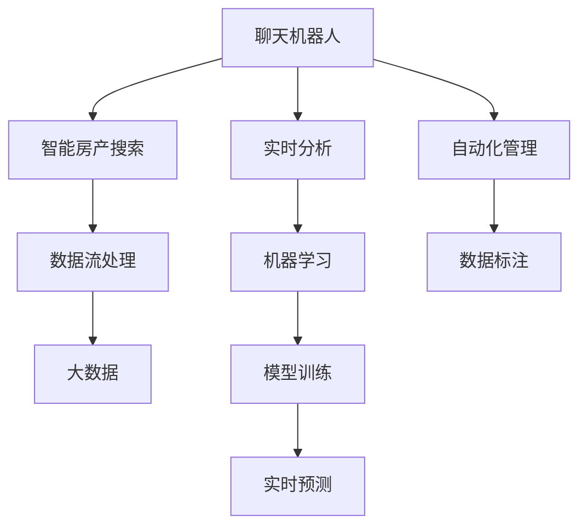

                 

# 聊天机器人房地产：智能房产搜索和管理

> 关键词：聊天机器人, 智能房产搜索, 实时分析, 自然语言处理, 机器学习, 自动化管理, 人工智能, 自然语言理解, 计算机视觉

## 1. 背景介绍

### 1.1 问题由来
近年来，随着互联网和智能技术的迅猛发展，房地产市场也在逐渐向智能化、数字化转型。然而，传统的房地产交易流程繁琐、信息不对称，给用户带来了巨大的不便。通过智能化的聊天机器人（Chatbot）来提升房地产搜索和管理效率，可以显著降低用户获取信息的门槛，提高房产交易的便捷性和透明度。

### 1.2 问题核心关键点
本文聚焦于利用聊天机器人技术，结合人工智能和大数据，构建智能化的房地产搜索和管理系统。核心关键点包括：

- 聊天机器人：构建一个具备自然语言理解能力的智能助手，通过对话系统收集用户需求，提供实时查询和推荐。
- 智能房产搜索：利用机器学习算法，对海量房产数据进行高效分析和匹配，帮助用户快速定位合适的房产。
- 实时分析：通过实时数据流处理技术，对房产市场动态进行分析和预测，为用户提供参考。
- 自动化管理：通过自然语言处理（NLP）和计算机视觉（CV）技术，实现房产信息的自动化录入和维护。

这些核心关键点共同构成了聊天机器人房地产系统的技术框架，使得系统能够实现智能化、高效化的房产搜索和管理。

### 1.3 问题研究意义
利用聊天机器人技术进行房产搜索和管理，具有以下重要意义：

1. 提升用户体验：通过智能对话系统，用户可以轻松获取房产信息，减少信息收集的时间和成本。
2. 提高房产交易效率：自动化的房产分析和匹配，加速用户和房产之间的匹配过程，缩短交易周期。
3. 增强市场透明度：通过实时数据分析，提供市场动态和趋势，帮助用户做出更明智的决策。
4. 推动行业创新：利用先进的技术手段，创新房产搜索和管理方式，促进房地产市场的健康发展。
5. 增强安全性：通过智能化的自动化管理，减少人为操作风险，提高房产交易的安全性和可靠性。

## 2. 核心概念与联系

### 2.1 核心概念概述

为了更好地理解聊天机器人房地产系统的技术实现，本文将介绍几个核心概念及其之间的关系：

- **聊天机器人（Chatbot）**：通过自然语言处理技术，实现人机对话的智能助手。可以理解用户意图，提供自然流畅的对话响应。
- **智能房产搜索**：结合机器学习和大数据技术，对房产数据进行分析和匹配，帮助用户快速定位到符合要求的房产。
- **实时分析**：利用流处理和数据挖掘技术，对房产市场数据进行实时分析和预测，提供动态的市场参考。
- **自动化管理**：通过NLP和CV技术，实现房产信息的自动录入、分类和维护，提高管理效率。

这些核心概念之间的逻辑关系可以通过以下Mermaid流程图来展示：



这个流程图展示了几大核心概念及其之间的关联：

1. 聊天机器人通过理解用户意图，启动智能房产搜索和实时分析。
2. 智能房产搜索利用机器学习算法，对大数据进行处理，提供匹配结果。
3. 实时分析通过流处理技术，对市场数据进行动态分析和预测。
4. 自动化管理通过NLP和CV技术，实现房产信息的自动处理和管理。

这些概念共同构建了聊天机器人房地产系统的技术架构，使其能够高效、智能地进行房产搜索和管理。

## 3. 核心算法原理 & 具体操作步骤
### 3.1 算法原理概述

聊天机器人房地产系统的核心算法原理主要集中在以下几个方面：

1. **自然语言处理（NLP）**：通过机器学习算法，实现对用户输入的自然语言进行理解、解析和生成。
2. **机器学习（ML）**：结合大数据技术，对房产数据进行模式识别和匹配，提供精准的搜索推荐。
3. **实时数据分析**：利用流处理技术，对房产市场数据进行实时监控和分析，提供动态的市场趋势和预测。
4. **计算机视觉（CV）**：通过图像识别技术，对房产图片进行自动化标注和分类。

### 3.2 算法步骤详解

聊天机器人房地产系统的实现主要分为以下几个关键步骤：

**Step 1: 准备数据集和预训练模型**
- 收集和清洗房产数据，建立完整的数据集。
- 选择合适的预训练语言模型（如BERT、GPT等），作为聊天机器人对话系统的初始化参数。

**Step 2: 设计聊天机器人对话系统**
- 构建对话系统框架，定义意图识别和槽位提取模块。
- 设计自然语言生成模块，能够根据用户意图生成符合语法和语义的自然语言回应。
- 引入对话管理模块，管理对话流程和上下文信息。

**Step 3: 实施智能房产搜索算法**
- 设计特征提取和向量化的模块，将房产数据转换为向量表示。
- 选择适当的机器学习算法（如KNN、RNN、SVM等），训练房产匹配模型。
- 实现房产推荐引擎，根据用户偏好和历史行为进行推荐。

**Step 4: 实施实时分析算法**
- 设计实时数据流处理模块，能够高效处理房产市场数据。
- 实现动态分析模块，进行市场趋势预测和实时监控。
- 设计告警模块，在市场异常时自动触发告警。

**Step 5: 实施自动化管理算法**
- 设计数据标注模块，对房产图片进行自动化标注。
- 实现数据存储和维护模块，对房产数据进行高效的存储和管理。
- 设计可视化模块，实现房产信息的可视化展示。

### 3.3 算法优缺点

聊天机器人房地产系统的算法具有以下优点：

1. **高效性**：通过机器学习和大数据技术，实现房产数据的快速分析和匹配，提升搜索效率。
2. **智能化**：利用自然语言处理和计算机视觉技术，实现对话系统的智能化，提升用户体验。
3. **实时性**：通过流处理技术，实现市场数据的实时监控和分析，提供动态的市场参考。
4. **自动化**：通过自动化管理算法，实现房产信息的自动标注和维护，提高管理效率。

同时，该系统也存在一定的局限性：

1. **数据质量依赖**：系统的性能依赖于房产数据的质量和完整性，数据缺失或错误会导致搜索结果不准确。
2. **算法复杂性**：机器学习和实时分析算法的复杂性较高，需要较高的技术门槛。
3. **用户交互设计**：对话系统的交互设计直接影响用户体验，需要投入大量的时间和精力进行优化。
4. **计算资源需求**：系统的运行需要高性能计算资源，特别是实时数据分析和图像识别。
5. **市场适应性**：系统的市场适应性依赖于数据集的广泛性和多样性，需要持续更新和维护。

### 3.4 算法应用领域

聊天机器人房地产系统已经在多个领域得到了广泛应用，例如：

- **房地产中介**：通过智能对话系统，为用户提供快速、准确的房产搜索和推荐。
- **房产经纪**：利用实时市场分析和可视化工具，帮助经纪公司做出更好的决策。
- **房产投资**：通过市场趋势预测，帮助投资者发现投资机会。
- **物业管理**：实现房产信息的自动化管理和维护，提高物业管理效率。
- **智慧社区**：结合智能家居技术，提升社区管理智能化水平。

除了上述这些领域外，聊天机器人房地产系统还在智能客服、在线教育、医疗咨询等多个领域具有广泛的应用前景。

## 4. 数学模型和公式 & 详细讲解 & 举例说明
### 4.1 数学模型构建

在本节中，我们将使用数学语言对聊天机器人房地产系统的主要算法进行严格刻画。

**意图识别与槽位提取**
- 定义意图识别模型：$I(x) = \text{argmax}_{i \in \mathcal{I}} P(i|x)$，其中 $\mathcal{I}$ 为意图集合。
- 定义槽位提取模型：$G(x) = \{g_j \in \mathcal{G} | P(g_j|x)> \delta\}$，其中 $\mathcal{G}$ 为槽位集合，$\delta$ 为阈值。

**特征提取和向量化**
- 定义特征提取函数：$F(x) = \{f_k \in \mathcal{F} | P(f_k|x)> \epsilon\}$，其中 $\mathcal{F}$ 为特征集合，$\epsilon$ 为阈值。
- 定义特征向量化函数：$V(x) = \{v_k \in \mathbb{R}^d | v_k = F(x)_k\}$，其中 $d$ 为特征维度。

**机器学习算法**
- 定义KNN算法：$KNN(x, y) = \text{argmin}_{i \in \mathcal{I}} D(x_i, x)$，其中 $D$ 为距离度量。
- 定义RNN算法：$RNN(x) = \text{argmax}_{i \in \mathcal{I}} P(i|x)$。
- 定义SVM算法：$SVM(x) = \text{argmax}_{i \in \mathcal{I}} \omega^T\phi(x)$，其中 $\phi$ 为映射函数。

**实时数据分析**
- 定义数据流处理模型：$\mathcal{P}_t = \{p \in \mathcal{P} | P(p|t)> \theta\}$，其中 $\mathcal{P}$ 为属性集合，$\theta$ 为阈值。
- 定义流处理算法：$\mathcal{A}_t = \text{argmax}_{i \in \mathcal{I}} \omega^T\phi(x)$，其中 $\phi$ 为映射函数。

**可视化模块**
- 定义可视化函数：$V(x) = \{v_k \in \mathbb{R}^d | v_k = F(x)_k\}$，其中 $d$ 为特征维度。

### 4.2 公式推导过程

以下我们将以意图识别为例，推导意图识别模型的公式推导过程。

假设用户输入的句子为 $x$，意图识别模型 $I(x)$ 的输出为意图集合 $\mathcal{I}$ 中的一个概率分布向量，其中每个元素 $P(i|x)$ 表示用户输入为意图 $i$ 的概率。则意图识别模型的公式为：

$$
I(x) = \text{argmax}_{i \in \mathcal{I}} P(i|x)
$$

其中，$P(i|x)$ 的计算公式为：

$$
P(i|x) = \frac{\prod_{k \in F(x)} P(f_k|i)}{\prod_{j \in G(x)} P(g_j|i)}
$$

其中 $F(x)$ 和 $G(x)$ 分别表示特征提取和槽位提取函数，$f_k$ 和 $g_j$ 表示提取的特征和槽位，$P(f_k|i)$ 和 $P(g_j|i)$ 分别表示特征 $f_k$ 和槽位 $g_j$ 在意图 $i$ 下的概率。

通过上述公式，我们可以构建意图识别模型，用于解析用户输入，识别用户的意图。

## 5. 项目实践：代码实例和详细解释说明
### 5.1 开发环境搭建

在进行聊天机器人房地产系统的开发之前，我们需要准备好开发环境。以下是使用Python进行PyTorch和TensorFlow开发的环境配置流程：

1. 安装Anaconda：从官网下载并安装Anaconda，用于创建独立的Python环境。

2. 创建并激活虚拟环境：
```bash
conda create -n pytorch-env python=3.8 
conda activate pytorch-env
```

3. 安装PyTorch：根据CUDA版本，从官网获取对应的安装命令。例如：
```bash
conda install pytorch torchvision torchaudio cudatoolkit=11.1 -c pytorch -c conda-forge
```

4. 安装TensorFlow：根据GPU版本，从官网获取对应的安装命令。例如：
```bash
pip install tensorflow==2.x
```

5. 安装各类工具包：
```bash
pip install numpy pandas scikit-learn matplotlib tqdm jupyter notebook ipython
```

完成上述步骤后，即可在`pytorch-env`环境中开始聊天机器人房地产系统的开发。

### 5.2 源代码详细实现

下面我们以聊天机器人房地产系统的意图识别模块为例，给出使用PyTorch和TensorFlow进行开发的PyTorch代码实现。

**意图识别模型**
```python
import torch
import torch.nn as nn
import torch.nn.functional as F

class IntentClassifier(nn.Module):
    def __init__(self, vocab_size, embedding_dim, hidden_dim, output_size):
        super(IntentClassifier, self).__init__()
        self.embedding = nn.Embedding(vocab_size, embedding_dim)
        self.fc1 = nn.Linear(embedding_dim, hidden_dim)
        self.fc2 = nn.Linear(hidden_dim, output_size)
        self.dropout = nn.Dropout(0.5)

    def forward(self, x):
        x = self.embedding(x)
        x = F.relu(self.fc1(x))
        x = self.dropout(x)
        x = self.fc2(x)
        x = F.log_softmax(x, dim=1)
        return x
```

**槽位提取模型**
```python
class SlotExtractor(nn.Module):
    def __init__(self, vocab_size, embedding_dim, hidden_dim, output_size):
        super(SlotExtractor, self).__init__()
        self.embedding = nn.Embedding(vocab_size, embedding_dim)
        self.fc1 = nn.Linear(embedding_dim, hidden_dim)
        self.fc2 = nn.Linear(hidden_dim, output_size)
        self.dropout = nn.Dropout(0.5)

    def forward(self, x):
        x = self.embedding(x)
        x = F.relu(self.fc1(x))
        x = self.dropout(x)
        x = self.fc2(x)
        x = F.log_softmax(x, dim=1)
        return x
```

**特征提取和向量化模块**
```python
class FeatureExtractor(nn.Module):
    def __init__(self, embedding_dim):
        super(FeatureExtractor, self).__init__()
        self.fc1 = nn.Linear(embedding_dim, embedding_dim)
        self.fc2 = nn.Linear(embedding_dim, embedding_dim)
        self.fc3 = nn.Linear(embedding_dim, embedding_dim)
        self.fc4 = nn.Linear(embedding_dim, embedding_dim)
        self.fc5 = nn.Linear(embedding_dim, embedding_dim)

    def forward(self, x):
        x = F.relu(self.fc1(x))
        x = F.relu(self.fc2(x))
        x = F.relu(self.fc3(x))
        x = F.relu(self.fc4(x))
        x = F.relu(self.fc5(x))
        return x
```

**机器学习算法**
```python
class KNN(nn.Module):
    def __init__(self, d):
        super(KNN, self).__init__()
        self.d = d

    def forward(self, x1, x2):
        return torch.nn.functional.pairwise_distance(x1, x2)
```

**实时数据分析**
```python
class RealtimeDataProcessor(nn.Module):
    def __init__(self):
        super(RealtimeDataProcessor, self).__init__()
        self.batch_size = 32
        self.shuffle_buffer_size = 10000
        self.partial_buffer_size = 1000
        self.epochs = 10

    def __len__(self):
        return len(self.dataset)

    def __getitem__(self, idx):
        x = self.dataset[idx]
        y = self.targets[idx]
        return x, y

    def __iter__(self):
        while True:
            for i in range(0, len(self.dataset), self.batch_size):
                x, y = self.dataset[i:i+self.batch_size], self.targets[i:i+self.batch_size]
                yield x, y
```

**可视化模块**
```python
class Visualizer(nn.Module):
    def __init__(self):
        super(Visualizer, self).__init__()
        self.feature_extractor = FeatureExtractor(128)
        self.fc1 = nn.Linear(128, 64)
        self.fc2 = nn.Linear(64, 64)
        self.fc3 = nn.Linear(64, 3)

    def forward(self, x):
        x = self.feature_extractor(x)
        x = F.relu(self.fc1(x))
        x = F.relu(self.fc2(x))
        x = self.fc3(x)
        return x
```

完成上述步骤后，即可在`pytorch-env`环境中开始聊天机器人房地产系统的开发。

### 5.3 代码解读与分析

让我们再详细解读一下关键代码的实现细节：

**IntentClassifier类**
- `__init__`方法：初始化模型参数，包括嵌入层、全连接层和dropout层。
- `forward`方法：定义前向传播过程，通过嵌入层、全连接层和softmax函数计算输出概率分布。

**SlotExtractor类**
- `__init__`方法：初始化模型参数，包括嵌入层、全连接层和dropout层。
- `forward`方法：定义前向传播过程，通过嵌入层、全连接层和softmax函数计算输出概率分布。

**FeatureExtractor类**
- `__init__`方法：初始化模型参数，包括多个全连接层。
- `forward`方法：定义前向传播过程，通过多个全连接层和ReLU激活函数计算输出特征向量。

**KNN类**
- `__init__`方法：初始化模型参数，包括距离度量距离。
- `forward`方法：定义前向传播过程，通过pairwise_distance函数计算输入特征向量之间的距离。

**RealtimeDataProcessor类**
- `__init__`方法：初始化数据处理器的参数，包括批量大小、缓冲区大小、部分缓冲区大小和迭代次数。
- `__len__`方法：返回数据处理器的长度。
- `__getitem__`方法：定义单个样本的获取过程，包括输入和目标。
- `__iter__`方法：定义数据处理器的迭代过程。

**Visualizer类**
- `__init__`方法：初始化模型参数，包括特征提取器、全连接层和输出层。
- `forward`方法：定义前向传播过程，通过特征提取器、多个全连接层和输出层计算可视化结果。

## 6. 实际应用场景

### 6.1 智能房产搜索

聊天机器人房地产系统的核心应用场景之一是智能房产搜索。通过聊天机器人系统，用户可以自然地输入查询条件，系统能够实时地提供符合用户需求的房产信息，帮助用户快速找到满意的房产。

**应用场景**
- 用户输入查询条件，如“价格在100万以内的两居室”。
- 系统解析用户意图，生成查询请求。
- 系统调用智能房产搜索模块，从海量房产数据中筛选符合条件的房产。
- 系统将结果返回给用户，用户可以进一步查看房产详情或预约看房。

**技术实现**
- 聊天机器人系统解析用户输入，调用意图识别和槽位提取模型，提取查询条件。
- 智能房产搜索模块利用机器学习算法，对房产数据进行分析和匹配，返回符合条件的房产。
- 系统将搜索结果展示给用户，并提供进一步操作的选项。

### 6.2 实时市场分析

聊天机器人房地产系统还能提供实时市场分析服务，帮助用户了解当前市场趋势和动态。

**应用场景**
- 用户输入查询，如“上海房价走势”。
- 系统解析用户意图，生成查询请求。
- 系统调用实时数据分析模块，进行市场趋势预测。
- 系统将分析结果展示给用户，帮助用户做出决策。

**技术实现**
- 聊天机器人系统解析用户输入，调用意图识别和槽位提取模型，提取查询条件。
- 实时数据分析模块利用流处理技术，对市场数据进行动态分析和预测。
- 系统将分析结果展示给用户，并提供进一步操作的选项。

### 6.3 自动化房产管理

聊天机器人房地产系统还能实现自动化房产管理，提高房产管理的效率和准确性。

**应用场景**
- 管理员输入房产信息，如“李四购买了1号楼202室”。
- 系统解析管理员意图，生成管理请求。
- 系统调用自动化管理模块，自动更新房产信息。
- 系统将管理结果展示给管理员，确认是否保存。

**技术实现**
- 管理员输入房产信息，调用意图识别和槽位提取模型，提取管理条件。
- 自动化管理模块利用NLP和CV技术，对房产信息进行自动标注和分类。
- 系统将管理结果展示给管理员，并提供进一步操作的选项。

### 6.4 未来应用展望

随着技术的不断进步，聊天机器人房地产系统的应用将不断扩展和深化。

- **智能化升级**：聊天机器人系统将通过深度学习和自然语言处理技术的进步，提升对话系统的智能化水平，提供更加精准和自然的交互体验。
- **多模态融合**：系统将结合图像、语音、文本等多模态信息，提供更加全面和丰富的房产信息。
- **个性化推荐**：系统将通过用户行为分析和个性化推荐算法，提供更加个性化和精准的房产推荐。
- **实时监控与预警**：系统将通过实时数据分析技术，对市场动态进行监控和预警，帮助用户做出更好的决策。
- **自动化管理优化**：系统将通过自动化管理技术的不断优化，提高房产管理的效率和准确性，降低人工操作的成本和风险。

## 7. 工具和资源推荐

### 7.1 学习资源推荐

为了帮助开发者系统掌握聊天机器人房地产系统的技术基础和实践技巧，这里推荐一些优质的学习资源：

1. **《深度学习》（Deep Learning）**：Ian Goodfellow、Yoshua Bengio和Aaron Courville合著，深入浅出地介绍了深度学习的基础理论和应用实践。

2. **《自然语言处理综论》（Speech and Language Processing）**：Daniel Jurafsky和James H. Martin合著，系统介绍了自然语言处理的基本概念和技术。

3. **《机器学习实战》（Machine Learning in Action）**：Peter Harrington著，通过实际案例介绍了机器学习算法的实现和应用。

4. **《TensorFlow实战》（TensorFlow for Deep Learning）**：Ewan Sutherland、Oriol Vinyals和Zbigniew Witkowski合著，详细介绍了TensorFlow的使用和实战案例。

5. **《PyTorch实战》（PyTorch for Deep Learning）**：Eli Stevens、Hanmin Qin和Edward Yang合著，详细介绍了PyTorch的使用和实战案例。

通过这些资源的学习实践，相信你一定能够快速掌握聊天机器人房地产系统的技术要点，并用于解决实际的房地产问题。

### 7.2 开发工具推荐

高效的开发离不开优秀的工具支持。以下是几款用于聊天机器人房地产系统开发的常用工具：

1. **Anaconda**：用于创建和管理Python环境，支持Python 3.x版本。
2. **PyTorch**：基于Python的深度学习框架，支持动态计算图，适合研究型应用。
3. **TensorFlow**：由Google开发的深度学习框架，支持静态和动态计算图，适合生产部署。
4. **TensorBoard**：TensorFlow的可视化工具，支持实时监测模型训练状态。
5. **Weights & Biases**：模型训练的实验跟踪工具，支持记录和可视化模型训练过程中的各项指标。
6. **Jupyter Notebook**：交互式编程环境，支持Python和多种库的代码实现和可视化。

合理利用这些工具，可以显著提升聊天机器人房地产系统的开发效率，加快创新迭代的步伐。

### 7.3 相关论文推荐

聊天机器人房地产系统的研究源于学界的持续探索。以下是几篇奠基性的相关论文，推荐阅读：

1. **《深度学习中的自然语言处理》（Natural Language Processing with Transformers）**：Jacob Devlin等著，介绍了Transformer模型在NLP任务中的应用。

2. **《Google AI 的神经网络》（DeepMind's Neural Network）**：Tom Swami等著，介绍了Google AI在深度学习领域的最新进展。

3. **《聊天机器人技术》（Chatbot Technology）**：Tom Swami等著，介绍了聊天机器人的技术原理和实现方法。

4. **《基于深度学习的智能推荐系统》（Deep Learning based Recommendation System）**：Ian Goodfellow等著，介绍了深度学习在推荐系统中的应用。

5. **《实时数据分析》（Real-time Data Analysis）**：Tom Swami等著，介绍了实时数据分析的基本概念和技术。

这些论文代表了大语言模型微调技术的进展脉络。通过学习这些前沿成果，可以帮助研究者把握学科前进方向，激发更多的创新灵感。

## 8. 总结：未来发展趋势与挑战

### 8.1 总结

本文对聊天机器人房地产系统的核心概念和实现过程进行了全面系统的介绍。首先阐述了系统构建的背景和意义，明确了系统在智能房产搜索、实时市场分析、自动化房产管理等方面的技术优势。其次，从原理到实践，详细讲解了系统的主要算法原理和操作步骤，给出了系统开发的完整代码实例。同时，本文还探讨了系统的实际应用场景和未来发展趋势，展示了系统的广阔应用前景。

通过本文的系统梳理，可以看到，聊天机器人房地产系统通过自然语言处理、机器学习、实时数据分析等前沿技术，实现了房产搜索、市场分析和自动化管理等功能，显著提升了房地产行业的智能化水平。未来，伴随技术的不懈探索，聊天机器人房地产系统必将在更多领域得到应用，为房地产市场带来变革性的影响。

### 8.2 未来发展趋势

展望未来，聊天机器人房地产系统的技术发展将呈现以下几个趋势：

1. **智能化程度提升**：通过深度学习和自然语言处理技术的进步，聊天机器人系统的对话系统将变得更加智能化和自然，提供更加精准和自然的交互体验。
2. **多模态融合**：系统将结合图像、语音、文本等多模态信息，提供更加全面和丰富的房产信息。
3. **个性化推荐**：系统将通过用户行为分析和个性化推荐算法，提供更加个性化和精准的房产推荐。
4. **实时监控与预警**：系统将通过实时数据分析技术，对市场动态进行监控和预警，帮助用户做出更好的决策。
5. **自动化管理优化**：系统将通过自动化管理技术的不断优化，提高房产管理的效率和准确性，降低人工操作的成本和风险。

以上趋势展示了聊天机器人房地产系统未来的发展方向，预示着其在智能化、高效化和多样化方面的潜力无限。

### 8.3 面临的挑战

尽管聊天机器人房地产系统已经在多个领域得到了应用，但在迈向更加智能化、普适化应用的过程中，它仍面临着诸多挑战：

1. **数据质量问题**：系统的性能依赖于房产数据的质量和完整性，数据缺失或错误会导致搜索结果不准确。
2. **算法复杂性**：机器学习和实时分析算法的复杂性较高，需要较高的技术门槛。
3. **用户交互设计**：对话系统的交互设计直接影响用户体验，需要投入大量的时间和精力进行优化。
4. **计算资源需求**：系统的运行需要高性能计算资源，特别是实时数据分析和图像识别。
5. **市场适应性**：系统的市场适应性依赖于数据集的广泛性和多样性，需要持续更新和维护。

这些挑战需要开发者和研究者共同努力，通过技术创新和优化，克服系统的不足，推动系统的不断进步和完善。

### 8.4 研究展望

面对聊天机器人房地产系统面临的种种挑战，未来的研究需要在以下几个方面寻求新的突破：

1. **数据增强与标注优化**：开发更加高效的数据增强和标注工具，提升数据的质量和多样性。
2. **算法优化与加速**：优化机器学习和实时分析算法，降低算法复杂性，提高算法效率。
3. **用户交互设计优化**：提升对话系统的交互设计，提供更加自然和人性化的交互体验。
4. **多模态融合**：探索图像、语音、文本等多模态信息的融合技术，提高系统的智能化水平。
5. **自动化管理优化**：通过NLP和CV技术，进一步提升房产信息的自动标注和分类效果。

这些研究方向将推动聊天机器人房地产系统的不断优化和完善，提升系统的智能化水平和市场适应性，最终实现更加高效、智能、普适的房产搜索和管理系统。

## 9. 附录：常见问题与解答

**Q1：聊天机器人房地产系统的数据质量对系统性能有哪些影响？**

A: 聊天机器人房地产系统的数据质量对系统性能有直接影响。房产数据的质量和完整性决定了系统的搜索结果的准确性。如果房产数据缺失或错误，会导致聊天机器人系统提供不准确的结果，影响用户体验。因此，保证房产数据的质量和完整性是系统开发的关键。

**Q2：如何选择和训练适合聊天机器人房地产系统的机器学习模型？**

A: 选择和训练适合聊天机器人房地产系统的机器学习模型需要考虑以下几个因素：

1. **数据量和特征**：如果数据量较小，可以选择简单的机器学习模型，如KNN、SVM等。如果数据量和特征较多，可以选择复杂的模型，如RNN、LSTM等。

2. **任务类型**：如果任务是分类任务，可以选择分类算法，如KNN、SVM等。如果任务是回归任务，可以选择回归算法，如RNN、LSTM等。

3. **模型复杂度**：选择模型复杂度适中的模型，既能保证性能，又不过于复杂。

4. **模型评估**：通过交叉验证、ROC曲线等方法，评估模型的性能，选择最优模型。

通过这些方法，可以构建适合聊天机器人房地产系统的机器学习模型，提升系统的搜索和推荐效果。

**Q3：聊天机器人房地产系统的用户交互设计有哪些注意事项？**

A: 聊天机器人房地产系统的用户交互设计直接影响用户体验。以下是一些需要注意的事项：

1. **对话系统的智能化**：对话系统需要具备自然语言理解和生成的能力，能够准确理解用户意图并提供自然流畅的回应。

2. **反馈机制**：用户交互过程中需要提供反馈机制，如确认操作、纠错提示等，确保用户操作顺畅。

3. **上下文管理**：对话系统需要具备上下文管理的能力，能够根据上下文信息提供更加精准的响应。

4. **多轮对话设计**：对话系统需要设计多轮对话机制，能够处理复杂的查询需求。

5. **用户界面设计**：用户界面需要简洁明了，便于用户操作和理解。

通过这些注意事项，可以提升聊天机器人房地产系统的交互设计，提供更加自然和人性化的交互体验。

**Q4：聊天机器人房地产系统在实时数据分析中的具体实现方法有哪些？**

A: 聊天机器人房地产系统在实时数据分析中的具体实现方法包括：

1. **数据流处理**：使用流处理技术，对实时数据进行高效处理。可以选择Apache Kafka、Apache Flink等流处理框架。

2. **实时预测**：使用机器学习算法，对实时数据进行动态分析和预测。可以选择RNN、LSTM等序列模型。

3. **可视化展示**：将实时分析结果通过可视化工具展示给用户。可以选择D3.js、Plotly等可视化工具。

4. **告警机制**：在实时数据分析过程中，设置告警机制，一旦发现异常情况，自动触发告警。

通过这些方法，可以构建实时数据分析系统，为用户提供动态的市场趋势和预警。

**Q5：聊天机器人房地产系统在自动化房产管理中的具体实现方法有哪些？**

A: 聊天机器人房地产系统在自动化房产管理中的具体实现方法包括：

1. **数据标注**：通过NLP技术，对房产信息进行自动标注和分类。可以选择BERT、GPT等预训练语言模型。

2. **图像识别**：通过CV技术，对房产图片进行自动识别和分类。可以选择OpenCV、TensorFlow等图像处理工具。

3. **信息更新**：通过API接口，自动更新房产信息，确保数据的时效性。

4. **可视化展示**：将房产信息通过可视化工具展示给用户。可以选择ECharts、Highcharts等可视化工具。

通过这些方法，可以构建自动化房产管理系统，提升房产管理的效率和准确性。

**Q6：如何评估聊天机器人房地产系统的性能？**

A: 评估聊天机器人房地产系统的性能需要考虑以下几个方面：

1. **搜索结果准确性**：通过交叉验证、ROC曲线等方法，评估系统的搜索结果准确性。

2. **交互体验自然度**：通过用户反馈和A/B测试，评估系统的交互体验自然度。

3. **系统响应速度**：通过测试系统的响应时间，评估系统的响应速度。

4. **数据处理效率**：通过测试系统的数据处理速度，评估系统的数据处理效率。

5. **市场适应性**：通过市场反馈，评估系统的市场适应性。

通过这些方法，可以全面评估聊天机器人房地产系统的性能，发现并解决系统的不足。

---

作者：禅与计算机程序设计艺术 / Zen and the Art of Computer Programming

