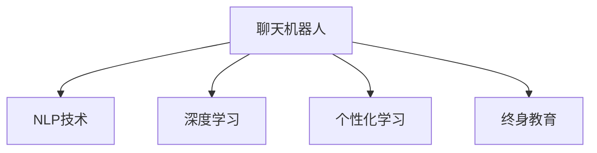

                 

# 聊天机器人教育变革：个性化学习和终身教育

> 关键词：聊天机器人,教育变革,个性化学习,终身教育,自然语言处理(NLP),人工智能(AI),深度学习

## 1. 背景介绍

### 1.1 问题由来
在当前的教育环境中，传统的课堂教学模式面临着诸多挑战，如资源不均衡、师生互动不足、教学内容单一等问题。而随着人工智能技术的不断发展，聊天机器人作为一种新兴的教育工具，逐渐成为推动教育变革的重要力量。

传统的课堂教学模式是以老师为主导，学生被动接受知识的灌输，无法满足每个学生的个性化需求。而聊天机器人通过自然语言处理(NLP)和人工智能(AI)技术，能够提供个性化的学习体验，提升学生的学习兴趣和效果。

### 1.2 问题核心关键点
聊天机器人在教育中的应用，本质上是将大语言模型微调范式引入教育领域，通过个性化的学习路径和互动对话，提升学生的自主学习能力和终身教育能力。具体核心关键点包括：

- **个性化学习**：根据学生的兴趣、需求和学习进度，动态调整教学内容和难度，提供个性化的学习资源和建议。
- **互动对话**：通过自然语言处理技术，使机器人能够理解学生的问题和需求，并提供及时的反馈和指导。
- **终身教育**：利用智能聊天机器人，学生可以在任何时间、任何地点获取学习资源，实现自主学习与终身学习。

## 2. 核心概念与联系

### 2.1 核心概念概述

为更好地理解聊天机器人在教育中的应用，本节将介绍几个密切相关的核心概念：

- **聊天机器人(Chatbot)**：基于NLP和AI技术，能够通过自然语言与人类进行交互的智能系统。
- **自然语言处理(NLP)**：使计算机能够理解和生成自然语言的技术，是聊天机器人的核心能力之一。
- **深度学习(Deep Learning)**：通过多层神经网络，使机器学习模型具备更强的特征提取和分类能力，适用于大规模语言模型的训练。
- **个性化学习(Adaptive Learning)**：根据学生的学习情况和需求，动态调整教学内容和节奏，提供个性化学习方案。
- **终身教育(Lifelong Learning)**：学生可以在不同阶段、不同场所持续获取新知识和技能，实现自我提升和职业发展。

这些核心概念之间的逻辑关系可以通过以下Mermaid流程图来展示：



这个流程图展示聊天机器人及其核心技术之间的关系：

1. 聊天机器人通过NLP技术进行自然语言理解，利用深度学习技术进行知识表示和推理。
2. 通过个性化学习技术，机器人可以根据学生的学习情况动态调整教学内容和进度。
3. 终身教育赋予聊天机器人持续学习的能力，使得学生可以在任何时间地点获取学习资源。

## 3. 核心算法原理 & 具体操作步骤
### 3.1 算法原理概述

聊天机器人教育变革的核心算法原理，是大语言模型微调范式在教育领域的创新应用。其核心思想是：将聊天机器人视作一个智能的“教师”，通过与学生的自然语言互动，动态调整教学策略，提供个性化的学习资源和反馈，最终实现终身学习的目标。

具体来说，聊天机器人教育变革包括以下几个关键步骤：

1. **收集数据**：收集学生的学习行为数据、学习偏好数据、考试成绩等，作为模型微调的基础。
2. **预训练模型选择**：选择合适的预训练模型，如BERT、GPT等，作为聊天机器人的初始化参数。
3. **任务适配层设计**：根据教育任务的需求，设计合适的输出层和损失函数，用于微调。
4. **微调训练**：在学生与聊天机器人互动的过程中，利用学生的反馈数据进行有监督学习，优化模型参数。
5. **个性化学习路径生成**：根据学生的学习情况，动态调整教学内容和节奏，生成个性化的学习路径。
6. **互动对话系统设计**：设计智能问答系统，使聊天机器人能够理解学生的问题，并给出准确的回答和建议。
7. **终身学习支持**：设计知识库和推荐系统，使聊天机器人能够提供丰富的学习资源，支持学生的自主学习和职业发展。

### 3.2 算法步骤详解

以下我们将详细介绍聊天机器人教育变革的具体算法步骤：

**Step 1: 收集教育数据**
- 收集学生的学习行为数据，如点击、阅读、观看时间等。
- 收集学生的学习偏好数据，如喜欢的课程、学科等。
- 收集学生的考试成绩和反馈数据，用于评估模型效果。

**Step 2: 预训练模型选择**
- 选择适合的教育任务的预训练模型，如BERT、GPT等，作为聊天机器人的初始化参数。
- 使用大量的教育文本数据，进行预训练，使得模型学习到教育领域的知识。

**Step 3: 任务适配层设计**
- 根据教育任务的需求，设计合适的输出层和损失函数，用于微调。
- 对于分类任务，通常使用交叉熵损失函数。
- 对于生成任务，通常使用语言模型的解码器输出概率分布，并以负对数似然为损失函数。

**Step 4: 微调训练**
- 将学生与聊天机器人互动的数据，作为监督信号，进行微调。
- 使用AdamW等优化算法，设置合适的学习率和批大小。
- 应用正则化技术，如L2正则、Dropout等，防止过拟合。
- 定期在验证集上评估模型性能，根据性能指标决定是否停止训练。

**Step 5: 个性化学习路径生成**
- 根据学生的学习情况，动态调整教学内容和节奏，生成个性化的学习路径。
- 利用机器学习算法，如协同过滤、决策树等，生成推荐的学习资源。

**Step 6: 互动对话系统设计**
- 设计智能问答系统，使聊天机器人能够理解学生的问题，并给出准确的回答和建议。
- 利用基于Prompt的学习方法，通过精心设计的输入模板，引导机器人按期望方式输出。

**Step 7: 终身学习支持**
- 设计知识库和推荐系统，使聊天机器人能够提供丰富的学习资源，支持学生的自主学习和职业发展。
- 利用多模态学习技术，结合文本、图像、视频等多类型数据，提升知识表示和推理能力。

### 3.3 算法优缺点

聊天机器人教育变革具有以下优点：

1. **个性化学习**：通过与学生的自然语言互动，聊天机器人能够实时了解学生的学习情况，提供个性化的学习资源和建议。
2. **互动对话**：通过自然语言处理技术，使机器人能够理解学生的问题和需求，并提供及时的反馈和指导。
3. **终身教育**：利用智能聊天机器人，学生可以在任何时间、任何地点获取学习资源，实现自主学习与终身学习。
4. **高效便捷**：聊天机器人可以24小时在线服务，不受时间地点限制，极大提升了学习效率。
5. **数据驱动**：通过收集学生的学习行为数据，可以不断优化教学策略，提升学习效果。

同时，该方法也存在一定的局限性：

1. **数据隐私**：学生的学习数据和互动数据可能涉及隐私问题，需要采取严格的保护措施。
2. **模型鲁棒性**：聊天机器人需要具备较强的鲁棒性，以应对各种复杂和多样化的输入。
3. **技术复杂度**：聊天机器人的设计和实现需要较高的技术门槛，对于技术资源有限的学校可能存在挑战。
4. **用户体验**：如果聊天机器人无法理解或回答学生的问题，可能会影响用户体验和学习效果。

尽管存在这些局限性，但就目前而言，聊天机器人教育变革仍是大规模推广个性化学习的重要手段。未来相关研究的重点在于如何进一步提高模型的智能化水平和用户体验，同时兼顾数据隐私和技术复杂度等因素。

### 3.4 算法应用领域

聊天机器人教育变革的应用领域非常广泛，覆盖了教育的各个阶段和各个方面，具体包括：

- **基础教育**：针对K-12学生的数学、语文、英语等基础学科，提供个性化学习资源和辅导。
- **高等教育**：针对大学生和研究生，提供专业课程学习、论文写作指导和职业规划建议。
- **职业培训**：为在职人员提供职业技能培训、行业资讯和职业发展规划。
- **语言学习**：提供多种语言的听说读写练习和互动对话，加速语言学习进程。
- **终身教育**：支持成年人的继续教育和职业发展，提供多样化学习资源和指导。

## 4. 数学模型和公式 & 详细讲解  
### 4.1 数学模型构建

本节将使用数学语言对聊天机器人教育变革的数学模型进行更加严格的刻画。

记聊天机器人为 $R$，预训练模型为 $M_{\theta}$，其中 $\theta$ 为预训练得到的模型参数。假设教育任务为分类任务，给定学生 $S_i$ 与聊天机器人互动的数据 $D_i=\{(x_i,y_i)\}_{i=1}^N, x_i \in \mathcal{X}, y_i \in \{0,1\}$，其中 $0$ 表示错误答案，$1$ 表示正确答案。

定义模型 $M_{\theta}$ 在输入 $x_i$ 上的预测概率为 $\hat{y}=M_{\theta}(x_i) \in [0,1]$，表示学生选择正确答案的概率。真实标签 $y_i \in \{0,1\}$。则分类任务的二分类交叉熵损失函数定义为：

$$
\ell(M_{\theta}(x_i),y_i) = -[y_i\log \hat{y} + (1-y_i)\log (1-\hat{y})]
$$

将其代入经验风险公式，得：

$$
\mathcal{L}(\theta) = -\frac{1}{N}\sum_{i=1}^N [y_i\log M_{\theta}(x_i)+(1-y_i)\log(1-M_{\theta}(x_i))]
$$

在得到损失函数的梯度后，即可带入参数更新公式，完成模型的迭代优化。重复上述过程直至收敛，最终得到适应教育任务的最优模型参数 $\theta^*$。

### 4.2 公式推导过程

以下我们以二分类任务为例，推导交叉熵损失函数及其梯度的计算公式。

假设模型 $M_{\theta}$ 在输入 $x_i$ 上的输出为 $\hat{y}=M_{\theta}(x_i) \in [0,1]$，表示学生选择正确答案的概率。真实标签 $y_i \in \{0,1\}$。则二分类交叉熵损失函数定义为：

$$
\ell(M_{\theta}(x_i),y_i) = -[y_i\log \hat{y} + (1-y_i)\log (1-\hat{y})]
$$

将其代入经验风险公式，得：

$$
\mathcal{L}(\theta) = -\frac{1}{N}\sum_{i=1}^N [y_i\log M_{\theta}(x_i)+(1-y_i)\log(1-M_{\theta}(x_i))]
$$

根据链式法则，损失函数对参数 $\theta_k$ 的梯度为：

$$
\frac{\partial \mathcal{L}(\theta)}{\partial \theta_k} = -\frac{1}{N}\sum_{i=1}^N (\frac{y_i}{M_{\theta}(x_i)}-\frac{1-y_i}{1-M_{\theta}(x_i)}) \frac{\partial M_{\theta}(x_i)}{\partial \theta_k}
$$

其中 $\frac{\partial M_{\theta}(x_i)}{\partial \theta_k}$ 可进一步递归展开，利用自动微分技术完成计算。

在得到损失函数的梯度后，即可带入参数更新公式，完成模型的迭代优化。重复上述过程直至收敛，最终得到适应教育任务的最优模型参数 $\theta^*$。

## 5. 项目实践：代码实例和详细解释说明
### 5.1 开发环境搭建

在进行聊天机器人教育变革实践前，我们需要准备好开发环境。以下是使用Python进行PyTorch开发的环境配置流程：

1. 安装Anaconda：从官网下载并安装Anaconda，用于创建独立的Python环境。

2. 创建并激活虚拟环境：
```bash
conda create -n chatbot-env python=3.8 
conda activate chatbot-env
```

3. 安装PyTorch：根据CUDA版本，从官网获取对应的安装命令。例如：
```bash
conda install pytorch torchvision torchaudio cudatoolkit=11.1 -c pytorch -c conda-forge
```

4. 安装Transformers库：
```bash
pip install transformers
```

5. 安装各类工具包：
```bash
pip install numpy pandas scikit-learn matplotlib tqdm jupyter notebook ipython
```

完成上述步骤后，即可在`chatbot-env`环境中开始教育变革实践。

### 5.2 源代码详细实现

下面我们以聊天机器人辅助学生学习数学为例，给出使用Transformers库对BERT模型进行微调的PyTorch代码实现。

首先，定义数学任务的数据处理函数：

```python
from transformers import BertTokenizer
from torch.utils.data import Dataset
import torch

class MathDataset(Dataset):
    def __init__(self, texts, answers, tokenizer, max_len=128):
        self.texts = texts
        self.answers = answers
        self.tokenizer = tokenizer
        self.max_len = max_len
        
    def __len__(self):
        return len(self.texts)
    
    def __getitem__(self, item):
        text = self.texts[item]
        answer = self.answers[item]
        
        encoding = self.tokenizer(text, return_tensors='pt', max_length=self.max_len, padding='max_length', truncation=True)
        input_ids = encoding['input_ids'][0]
        attention_mask = encoding['attention_mask'][0]
        
        # 对answer进行编码
        encoded_answer = [answer2id[answer] for answer in answer] 
        encoded_answer.extend([answer2id['O']] * (self.max_len - len(encoded_answer)))
        labels = torch.tensor(encoded_answer, dtype=torch.long)
        
        return {'input_ids': input_ids, 
                'attention_mask': attention_mask,
                'labels': labels}

# 答案与id的映射
answer2id = {'O': 0, '正确': 1, '错误': 2}
id2answer = {v: k for k, v in answer2id.items()}

# 创建dataset
tokenizer = BertTokenizer.from_pretrained('bert-base-cased')

train_dataset = MathDataset(train_texts, train_answers, tokenizer)
dev_dataset = MathDataset(dev_texts, dev_answers, tokenizer)
test_dataset = MathDataset(test_texts, test_answers, tokenizer)
```

然后，定义模型和优化器：

```python
from transformers import BertForTokenClassification, AdamW

model = BertForTokenClassification.from_pretrained('bert-base-cased', num_labels=len(answer2id))

optimizer = AdamW(model.parameters(), lr=2e-5)
```

接着，定义训练和评估函数：

```python
from torch.utils.data import DataLoader
from tqdm import tqdm
from sklearn.metrics import classification_report

device = torch.device('cuda') if torch.cuda.is_available() else torch.device('cpu')
model.to(device)

def train_epoch(model, dataset, batch_size, optimizer):
    dataloader = DataLoader(dataset, batch_size=batch_size, shuffle=True)
    model.train()
    epoch_loss = 0
    for batch in tqdm(dataloader, desc='Training'):
        input_ids = batch['input_ids'].to(device)
        attention_mask = batch['attention_mask'].to(device)
        labels = batch['labels'].to(device)
        model.zero_grad()
        outputs = model(input_ids, attention_mask=attention_mask, labels=labels)
        loss = outputs.loss
        epoch_loss += loss.item()
        loss.backward()
        optimizer.step()
    return epoch_loss / len(dataloader)

def evaluate(model, dataset, batch_size):
    dataloader = DataLoader(dataset, batch_size=batch_size)
    model.eval()
    preds, labels = [], []
    with torch.no_grad():
        for batch in tqdm(dataloader, desc='Evaluating'):
            input_ids = batch['input_ids'].to(device)
            attention_mask = batch['attention_mask'].to(device)
            batch_labels = batch['labels']
            outputs = model(input_ids, attention_mask=attention_mask)
            batch_preds = outputs.logits.argmax(dim=2).to('cpu').tolist()
            batch_labels = batch_labels.to('cpu').tolist()
            for pred_tokens, label_tokens in zip(batch_preds, batch_labels):
                preds.append(pred_tokens[:len(label_tokens)])
                labels.append(label_tokens)
                
    print(classification_report(labels, preds))
```

最后，启动训练流程并在测试集上评估：

```python
epochs = 5
batch_size = 16

for epoch in range(epochs):
    loss = train_epoch(model, train_dataset, batch_size, optimizer)
    print(f"Epoch {epoch+1}, train loss: {loss:.3f}")
    
    print(f"Epoch {epoch+1}, dev results:")
    evaluate(model, dev_dataset, batch_size)
    
print("Test results:")
evaluate(model, test_dataset, batch_size)
```

以上就是使用PyTorch对BERT进行数学任务微调的完整代码实现。可以看到，得益于Transformers库的强大封装，我们可以用相对简洁的代码完成BERT模型的加载和微调。

### 5.3 代码解读与分析

让我们再详细解读一下关键代码的实现细节：

**MathDataset类**：
- `__init__`方法：初始化文本、答案、分词器等关键组件。
- `__len__`方法：返回数据集的样本数量。
- `__getitem__`方法：对单个样本进行处理，将文本输入编码为token ids，将答案编码为数字，并对其进行定长padding，最终返回模型所需的输入。

**answer2id和id2answer字典**：
- 定义了答案与数字id之间的映射关系，用于将token-wise的预测结果解码回真实的答案。

**训练和评估函数**：
- 使用PyTorch的DataLoader对数据集进行批次化加载，供模型训练和推理使用。
- 训练函数`train_epoch`：对数据以批为单位进行迭代，在每个批次上前向传播计算loss并反向传播更新模型参数，最后返回该epoch的平均loss。
- 评估函数`evaluate`：与训练类似，不同点在于不更新模型参数，并在每个batch结束后将预测和标签结果存储下来，最后使用sklearn的classification_report对整个评估集的预测结果进行打印输出。

**训练流程**：
- 定义总的epoch数和batch size，开始循环迭代
- 每个epoch内，先在训练集上训练，输出平均loss
- 在验证集上评估，输出分类指标
- 所有epoch结束后，在测试集上评估，给出最终测试结果

可以看到，PyTorch配合Transformers库使得BERT微调的代码实现变得简洁高效。开发者可以将更多精力放在数据处理、模型改进等高层逻辑上，而不必过多关注底层的实现细节。

当然，工业级的系统实现还需考虑更多因素，如模型的保存和部署、超参数的自动搜索、更灵活的任务适配层等。但核心的微调范式基本与此类似。

## 6. 实际应用场景
### 6.1 智能辅导系统

基于聊天机器人的智能辅导系统，可以广泛应用于K-12教育、高等教育以及职业培训等场景。传统教育往往以老师为主导，难以针对每个学生的个性化需求进行辅导，而智能辅导系统可以实时了解学生的学习情况，提供个性化的学习资源和建议。

在技术实现上，可以收集学生的学习行为数据，如点击、阅读、观看时间等，作为模型微调的基础。将文本内容作为模型输入，学生的后续行为（如是否点击、观看等）作为监督信号，在此基础上对预训练语言模型进行微调。微调后的模型能够从文本内容中准确把握学生的兴趣点，生成个性化的学习路径和推荐。

### 6.2 在线教育平台

在线教育平台可以充分利用聊天机器人技术，提供多种形式的学习支持。例如，利用聊天机器人进行学生答疑，提供即时反馈和指导；利用聊天机器人进行课程推荐，推荐学生感兴趣的内容；利用聊天机器人进行个性化学习路径规划，提高学习效率。

通过智能聊天机器人，在线教育平台能够提供24小时在线服务，提升学生的自主学习能力和效果。同时，聊天机器人可以不断学习学生的学习数据，优化教学策略，提供更加个性化和精准的学习支持。

### 6.3 虚拟实验室

虚拟实验室是科学教育的重要组成部分，可以帮助学生进行实验操作和科学探究。利用聊天机器人技术，虚拟实验室可以提供实时互动和指导，提升学生的学习兴趣和实验效果。

在虚拟实验室中，聊天机器人可以实时理解学生的实验操作和问题，提供即时反馈和指导。通过自然语言处理技术，聊天机器人可以识别学生的错误操作，并给出正确的实验步骤和建议。通过推荐系统，聊天机器人可以提供相关实验资源和参考资料，帮助学生更好地理解和掌握科学知识。

### 6.4 未来应用展望

随着聊天机器人技术的不断发展，其在教育领域的应用前景广阔。未来，聊天机器人将更加智能化和个性化，能够更好地适应学生的个性化需求，提供更加高效和有趣的学习体验。

在智能辅导系统中，聊天机器人将能够更加精准地理解和响应学生的学习需求，提供更加个性化和精准的学习资源和建议。在在线教育平台上，聊天机器人将能够提供更加丰富的学习形式和支持，提升学生的自主学习能力和效果。在虚拟实验室中，聊天机器人将能够提供更加实时和互动的实验指导，提升学生的实验能力和科学探究兴趣。

此外，聊天机器人技术还将与其他AI技术进行更深入的融合，如增强现实(AR)、虚拟现实(VR)、游戏化学习等，进一步提升教育体验和效果。相信随着技术的日益成熟，聊天机器人将为教育变革注入新的活力，推动教育公平和质量提升。

## 7. 工具和资源推荐
### 7.1 学习资源推荐

为了帮助开发者系统掌握聊天机器人教育变革的理论基础和实践技巧，这里推荐一些优质的学习资源：

1. 《Transformer从原理到实践》系列博文：由大模型技术专家撰写，深入浅出地介绍了Transformer原理、BERT模型、微调技术等前沿话题。

2. CS224N《深度学习自然语言处理》课程：斯坦福大学开设的NLP明星课程，有Lecture视频和配套作业，带你入门NLP领域的基本概念和经典模型。

3. 《Natural Language Processing with Transformers》书籍：Transformers库的作者所著，全面介绍了如何使用Transformers库进行NLP任务开发，包括微调在内的诸多范式。

4. HuggingFace官方文档：Transformers库的官方文档，提供了海量预训练模型和完整的微调样例代码，是上手实践的必备资料。

5. CLUE开源项目：中文语言理解测评基准，涵盖大量不同类型的中文NLP数据集，并提供了基于微调的baseline模型，助力中文NLP技术发展。

通过对这些资源的学习实践，相信你一定能够快速掌握聊天机器人教育变革的精髓，并用于解决实际的NLP问题。
###  7.2 开发工具推荐

高效的开发离不开优秀的工具支持。以下是几款用于聊天机器人教育变革开发的常用工具：

1. PyTorch：基于Python的开源深度学习框架，灵活动态的计算图，适合快速迭代研究。大部分预训练语言模型都有PyTorch版本的实现。

2. TensorFlow：由Google主导开发的开源深度学习框架，生产部署方便，适合大规模工程应用。同样有丰富的预训练语言模型资源。

3. Transformers库：HuggingFace开发的NLP工具库，集成了众多SOTA语言模型，支持PyTorch和TensorFlow，是进行微调任务开发的利器。

4. Weights & Biases：模型训练的实验跟踪工具，可以记录和可视化模型训练过程中的各项指标，方便对比和调优。与主流深度学习框架无缝集成。

5. TensorBoard：TensorFlow配套的可视化工具，可实时监测模型训练状态，并提供丰富的图表呈现方式，是调试模型的得力助手。

6. Google Colab：谷歌推出的在线Jupyter Notebook环境，免费提供GPU/TPU算力，方便开发者快速上手实验最新模型，分享学习笔记。

合理利用这些工具，可以显著提升聊天机器人教育变革的开发效率，加快创新迭代的步伐。

### 7.3 相关论文推荐

聊天机器人教育变革的研究源于学界的持续研究。以下是几篇奠基性的相关论文，推荐阅读：

1. Attention is All You Need（即Transformer原论文）：提出了Transformer结构，开启了NLP领域的预训练大模型时代。

2. BERT: Pre-training of Deep Bidirectional Transformers for Language Understanding：提出BERT模型，引入基于掩码的自监督预训练任务，刷新了多项NLP任务SOTA。

3. Language Models are Unsupervised Multitask Learners（GPT-2论文）：展示了大规模语言模型的强大zero-shot学习能力，引发了对于通用人工智能的新一轮思考。

4. Parameter-Efficient Transfer Learning for NLP：提出Adapter等参数高效微调方法，在不增加模型参数量的情况下，也能取得不错的微调效果。

5. Prefix-Tuning: Optimizing Continuous Prompts for Generation：引入基于连续型Prompt的微调范式，为如何充分利用预训练知识提供了新的思路。

6. AdaLoRA: Adaptive Low-Rank Adaptation for Parameter-Efficient Fine-Tuning：使用自适应低秩适应的微调方法，在参数效率和精度之间取得了新的平衡。

这些论文代表了大语言模型微调技术的发展脉络。通过学习这些前沿成果，可以帮助研究者把握学科前进方向，激发更多的创新灵感。

## 8. 总结：未来发展趋势与挑战
### 8.1 总结

本文对聊天机器人教育变革进行了全面系统的介绍。首先阐述了聊天机器人技术在教育中的应用背景和核心关键点，明确了其通过大语言模型微调范式，实现个性化学习和终身教育的能力。其次，从原理到实践，详细讲解了微调的数学原理和关键步骤，给出了教育变革任务开发的完整代码实例。同时，本文还广泛探讨了聊天机器人在智能辅导、在线教育、虚拟实验室等多个教育场景中的应用前景，展示了其在推动教育变革方面的巨大潜力。此外，本文精选了教育变革技术的各类学习资源，力求为读者提供全方位的技术指引。

通过本文的系统梳理，可以看到，基于聊天机器人技术的教育变革，正在成为推动教育公平和质量提升的重要力量。通过与学生的自然语言互动，聊天机器人能够提供个性化的学习资源和反馈，提升学生的自主学习能力和效果。得益于大语言模型微调技术的支持，聊天机器人能够在任何时间地点为学生提供高质量的教育服务，实现终身学习。未来，随着技术的不断成熟，聊天机器人将为教育变革注入新的活力，推动教育公平和质量提升。

### 8.2 未来发展趋势

展望未来，聊天机器人教育变革技术将呈现以下几个发展趋势：

1. **智能化提升**：随着技术的进步，聊天机器人将能够更加精准地理解学生的需求，提供更加个性化的学习资源和建议。
2. **多模态融合**：结合图像、视频、声音等多类型数据，提升教育内容的丰富性和多样性。
3. **跨领域应用**：聊天机器人将逐步应用于更多的教育领域，如职业培训、医学教育等，提供更加全面的教育支持。
4. **持续学习**：通过持续学习机制，聊天机器人能够不断更新知识库，适应学生和教育需求的变化。
5. **社会化互动**：通过与其他学生、教师的互动，聊天机器人能够更好地融入教育环境，提升教育体验。
6. **个性化路径生成**：利用机器学习技术，生成个性化的学习路径和推荐，提升学习效果。

这些趋势凸显了聊天机器人教育变革技术的广阔前景。这些方向的探索发展，必将进一步提升教育系统的智能化水平，推动教育公平和质量提升。

### 8.3 面临的挑战

尽管聊天机器人教育变革技术已经取得了瞩目成就，但在迈向更加智能化、普适化应用的过程中，它仍面临着诸多挑战：

1. **数据隐私**：学生的学习数据和互动数据可能涉及隐私问题，需要采取严格的保护措施。
2. **模型鲁棒性**：聊天机器人需要具备较强的鲁棒性，以应对各种复杂和多样化的输入。
3. **技术复杂度**：聊天机器人的设计和实现需要较高的技术门槛，对于技术资源有限的学校可能存在挑战。
4. **用户体验**：如果聊天机器人无法理解或回答学生的问题，可能会影响用户体验和学习效果。
5. **教学一致性**：聊天机器人需要与传统教育模式进行有效融合，保持教学的一致性和连贯性。

尽管存在这些挑战，但就目前而言，聊天机器人教育变革仍是大规模推广个性化学习的重要手段。未来相关研究的重点在于如何进一步提高模型的智能化水平和用户体验，同时兼顾数据隐私和技术复杂度等因素。

### 8.4 研究展望

面对聊天机器人教育变革所面临的种种挑战，未来的研究需要在以下几个方面寻求新的突破：

1. **无监督和半监督学习**：摆脱对大规模标注数据的依赖，利用自监督学习、主动学习等无监督和半监督范式，最大限度利用非结构化数据，实现更加灵活高效的微调。
2. **多模态教育内容**：结合图像、视频、声音等多类型数据，提升教育内容的丰富性和多样性。
3. **跨领域教育应用**：将聊天机器人技术应用于更多的教育领域，如职业培训、医学教育等，提供更加全面的教育支持。
4. **持续学习机制**：通过持续学习机制，聊天机器人能够不断更新知识库，适应学生和教育需求的变化。
5. **社会化互动平台**：构建一个覆盖学校、家庭、社区的社会化互动平台，促进学生、教师、家长之间的互动交流，提升教育效果。
6. **个性化路径生成**：利用机器学习技术，生成个性化的学习路径和推荐，提升学习效果。

这些研究方向的探索，必将引领聊天机器人教育变革技术迈向更高的台阶，为教育变革注入新的活力，推动教育公平和质量提升。面向未来，聊天机器人教育变革技术还需要与其他AI技术进行更深入的融合，如增强现实(AR)、虚拟现实(VR)、游戏化学习等，多路径协同发力，共同推动教育公平和质量提升。总之，聊天机器人教育变革技术需要在数据、算法、工程、业务等多个维度协同发力，才能真正实现人工智能技术在教育领域的应用和推广。

## 9. 附录：常见问题与解答

**Q1：聊天机器人如何适应学生的个性化需求？**

A: 聊天机器人通过与学生的自然语言互动，动态调整教学内容和节奏，生成个性化的学习路径和推荐。具体来说，收集学生的学习行为数据、学习偏好数据、考试成绩等，作为模型微调的基础。将文本内容作为模型输入，学生的后续行为（如是否点击、观看等）作为监督信号，在此基础上对预训练语言模型进行微调。微调后的模型能够从文本内容中准确把握学生的兴趣点，生成个性化的学习路径和推荐。

**Q2：聊天机器人如何提高学生的自主学习能力和效果？**

A: 聊天机器人通过与学生的自然语言互动，实时了解学生的学习情况，提供个性化的学习资源和建议。具体来说，利用自然语言处理技术，使机器人能够理解学生的问题和需求，并提供及时的反馈和指导。通过自然语言生成技术，机器人可以生成适合学生学习的学习资源和建议，提高学生的自主学习能力和效果。

**Q3：聊天机器人如何保持教学的一致性和连贯性？**

A: 聊天机器人需要与传统教育模式进行有效融合，保持教学的一致性和连贯性。具体来说，需要设计合适的任务适配层，将学生的学习行为数据和考试成绩作为监督信号，对预训练语言模型进行微调。微调后的模型能够根据学生的学习情况，动态调整教学内容和节奏，生成个性化的学习路径和推荐。同时，利用知识图谱等专家知识库，提升聊天机器人的教学质量和一致性。

**Q4：聊天机器人如何保护学生的学习数据和隐私？**

A: 聊天机器人需要保护学生的学习数据和隐私，确保数据安全。具体来说，需要采取数据加密、匿名化处理等措施，保护学生的个人信息和隐私。同时，设计合适的算法和技术手段，防止模型泄露学生数据，确保数据隐私安全。

**Q5：聊天机器人如何提高模型的智能化水平和用户体验？**

A: 聊天机器人需要不断提高智能化水平和用户体验，提升教育效果。具体来说，需要利用深度学习、自然语言处理等技术，使聊天机器人具备更加精准的理解和回复能力。同时，优化机器人的交互界面和响应速度，提高用户体验。通过持续学习和迭代优化，不断提升聊天机器人的智能化水平和效果。

这些常见问题及解答，希望能为读者提供更清晰的认识和指导，推动聊天机器人技术在教育领域的广泛应用和深入发展。相信随着技术的不断进步，聊天机器人将在教育变革中发挥更大的作用，为推动教育公平和质量提升贡献力量。

---

作者：禅与计算机程序设计艺术 / Zen and the Art of Computer Programming

