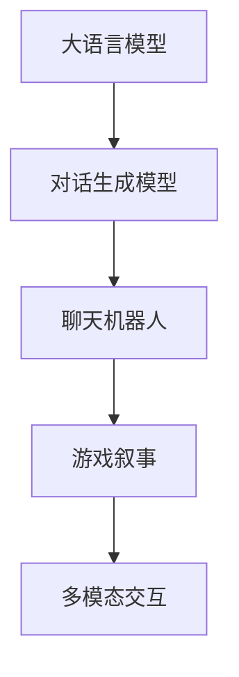

                 

# 聊天机器人游戏开发：互动和叙事

## 1. 背景介绍

### 1.1 问题由来
在现代科技的推动下，人工智能(AI)正逐渐渗透到我们生活的各个领域，其中，聊天机器人作为一种能够模拟人类对话的智能程序，其应用范围越来越广泛。从简单的客服系统到复杂的游戏对话系统，从简单的数据处理到复杂的智能决策，聊天机器人在各行各业中都展现了其强大的潜力。然而，传统的聊天机器人通常只是基于规则或模板的简单对话逻辑，难以与用户进行深度互动。随着AI技术的发展，基于深度学习的对话模型已经被广泛应用于自然语言处理(NLP)和人工智能游戏中，使得聊天机器人能够理解更复杂的语义，并结合游戏情境进行互动。本文将探讨如何将大语言模型应用于聊天机器人游戏开发，特别是在对话互动和叙事方面的创新实践。

### 1.2 问题核心关键点
在聊天机器人游戏开发中，关键点在于如何利用大语言模型的优势，增强与用户的互动性和游戏故事的连贯性。具体来说，需要考虑以下几个方面：
- 如何构建一个高效、稳定的对话系统，使聊天机器人能够理解并回应各种复杂问题。
- 如何设计一个自然、有趣的叙事结构，使游戏情节更具吸引力和沉浸感。
- 如何平衡交互性与游戏性，使玩家能够真正享受游戏的乐趣。
- 如何在资源有限的情况下，最大限度地利用大语言模型的知识库，提升游戏体验。

## 2. 核心概念与联系

### 2.1 核心概念概述

为更好地理解聊天机器人游戏开发中的核心概念，本节将介绍几个密切相关的核心概念：

- 自然语言处理(NLP)：使计算机能够理解、处理、生成人类语言的技术。NLP是大语言模型和聊天机器人开发的基础。
- 大语言模型(Large Language Models, LLMs)：如GPT-3、BERT等预训练模型，通过大规模无标签文本数据学习，具备强大的语言理解和生成能力。
- 对话生成模型(DLG)：能够自动生成连贯对话的AI模型，用于构建自然、流畅的聊天机器人对话。
- 游戏叙事设计(Narrative Design)：涉及游戏情节、角色、世界构建等方面，使游戏更具吸引力和沉浸感。
- 多模态交互(Multimodal Interaction)：结合文本、图像、声音等多模态信息，提升玩家的游戏体验。

这些核心概念之间的逻辑关系可以通过以下Mermaid流程图来展示：



这个流程图展示了大语言模型、对话生成模型、聊天机器人、游戏叙事以及多模态交互之间的联系：

1. 大语言模型通过预训练获得丰富的语言知识，是对话生成模型的基础。
2. 对话生成模型基于大语言模型，能够生成连贯的对话。
3. 聊天机器人基于对话生成模型，具备互动能力。
4. 游戏叙事设计为聊天机器人提供背景和故事线索，增强游戏的沉浸感。
5. 多模态交互为游戏增添更多维度，提升玩家的体验。

## 3. 核心算法原理 & 具体操作步骤

### 3.1 算法原理概述

聊天机器人游戏开发中的对话生成和叙事设计，本质上是一个利用大语言模型的复杂任务。其核心思想是：将大语言模型作为对话生成和叙事设计的"知识库"，通过深度学习模型，构建能够自动生成对话和叙述的游戏对话系统。

形式化地，假设大语言模型为 $M_{\theta}$，其中 $\theta$ 为模型参数。给定游戏对话历史 $D=\{(x_i, y_i)\}_{i=1}^N, x_i \in \mathcal{X}, y_i \in \mathcal{Y}$，其中 $\mathcal{X}$ 为文本输入空间，$\mathcal{Y}$ 为输出文本空间。对话生成模型的目标是最小化文本生成过程中的损失函数，即找到最优参数：

$$
\theta^* = \mathop{\arg\min}_{\theta} \mathcal{L}(M_{\theta},D)
$$

其中 $\mathcal{L}$ 为针对对话生成模型的损失函数，用于衡量模型预测输出与真实标签之间的差异。常见的损失函数包括交叉熵损失、均方误差损失等。

通过梯度下降等优化算法，对话生成模型不断更新模型参数 $\theta$，最小化损失函数 $\mathcal{L}$，使得模型输出逼近真实标签。由于 $\theta$ 已经通过预训练获得了较强的语言生成能力，因此即便在小型对话数据集上训练，也能较快收敛到理想的模型参数 $\hat{\theta}$。

### 3.2 算法步骤详解

聊天机器人游戏开发中的对话生成和叙事设计，通常包括以下几个关键步骤：

**Step 1: 准备预训练模型和数据集**
- 选择合适的预训练对话生成模型 $M_{\theta}$ 作为初始化参数，如GPT-3、BERT等。
- 准备游戏对话历史数据集 $D$，划分为训练集、验证集和测试集。对话数据通常需要标注玩家输入和机器人响应。

**Step 2: 添加任务适配层**
- 根据游戏叙事情节，设计合适的对话生成器、游戏提示生成器等任务适配层。
- 对于对话生成任务，通常使用LSTM、GRU等循环神经网络，或基于Transformer的Seq2Seq模型。
- 对于游戏提示生成任务，可以使用生成对抗网络(GAN)、变分自编码器(VAE)等生成模型。

**Step 3: 设置微调超参数**
- 选择合适的优化算法及其参数，如 Adam、SGD 等，设置学习率、批大小、迭代轮数等。
- 设置正则化技术及强度，包括权重衰减、Dropout、Early Stopping等。
- 确定冻结预训练参数的策略，如仅微调顶层，或全部参数都参与微调。

**Step 4: 执行梯度训练**
- 将训练集数据分批次输入模型，前向传播计算损失函数。
- 反向传播计算参数梯度，根据设定的优化算法和学习率更新模型参数。
- 周期性在验证集上评估模型性能，根据性能指标决定是否触发 Early Stopping。
- 重复上述步骤直到满足预设的迭代轮数或 Early Stopping 条件。

**Step 5: 测试和部署**
- 在测试集上评估生成后的对话和提示，对比微调前后的效果提升。
- 使用微调后的模型对新对话进行推理预测，集成到实际的游戏系统中。
- 持续收集新的对话数据，定期重新微调模型，以适应数据分布的变化。

以上是聊天机器人游戏开发中对话生成和叙事设计的一般流程。在实际应用中，还需要针对具体游戏的情节、角色等特性，对微调过程的各个环节进行优化设计，如改进训练目标函数，引入更多的正则化技术，搜索最优的超参数组合等，以进一步提升模型性能。

### 3.3 算法优缺点

基于大语言模型的对话生成和叙事设计方法具有以下优点：
1. 灵活性强。基于深度学习模型，可以根据具体游戏需求进行灵活调整。
2. 泛化能力强。利用大语言模型的语言生成能力，能够在多种游戏中实现连贯的对话和故事生成。
3. 资源高效。通过参数高效的微调方法，如Adapter、Prefix-Tuning等，可以在资源有限的情况下进行模型优化。
4. 交互体验良好。生成的对话自然流畅，能够提升玩家的游戏体验。

同时，该方法也存在一定的局限性：
1. 数据依赖性强。对话数据需要大量标注，获取成本较高。
2. 模型复杂度高。大语言模型和深度学习模型的训练和推理复杂度较高，计算资源需求大。
3. 模型泛化能力受限。生成的对话和故事可能依赖于预训练模型的固有知识，对于新游戏情节的适应能力较弱。
4. 可解释性不足。深度学习模型通常"黑箱"操作，难以解释其内部生成逻辑。
5. 需要高水平开发人员。模型训练和调试需要具备一定的AI开发经验，对开发人员要求较高。

尽管存在这些局限性，但就目前而言，基于大语言模型的对话生成和叙事设计方法仍在游戏开发中具有较高的应用价值。未来相关研究的重点在于如何进一步降低数据依赖，提高模型的泛化能力，同时兼顾可解释性和伦理安全性等因素。

### 3.4 算法应用领域

基于大语言模型的对话生成和叙事设计方法，已经在聊天机器人游戏开发中得到了广泛应用，涵盖了各种类型的游戏，例如：

- 文字冒险游戏：如《 adventure is worth it 》，结合大语言模型生成角色对话和故事情节，增强游戏的沉浸感。
- 角色扮演游戏(RPG)：如《 The Elder Scrolls V: Skyrim 》，通过对话生成模型生成NPC对话，使游戏世界更加真实。
- 策略游戏：如《 Civilization VI 》，利用大语言模型生成任务提示和剧情，增强游戏策略性。
- 模拟经营游戏：如《 city: Skylines 》，通过生成对话提示，使玩家更容易掌握游戏操作。
- 体育竞技游戏：如《 FIFA 19 》，生成解说员解说，提升游戏娱乐性。

除了上述这些经典游戏外，大语言模型在各种新型游戏中的创新应用也将不断涌现，为游戏开发带来全新的思路和技术。

## 4. 数学模型和公式 & 详细讲解 & 举例说明

### 4.1 数学模型构建

本节将使用数学语言对聊天机器人游戏开发中的对话生成和叙事设计过程进行更加严格的刻画。

假设对话生成模型为 $M_{\theta}$，其中 $\theta$ 为模型参数。假设游戏对话历史为 $D=\{(x_i,y_i)\}_{i=1}^N, x_i \in \mathcal{X}, y_i \in \mathcal{Y}$。

定义模型 $M_{\theta}$ 在输入 $x$ 上的输出为 $\hat{y}=M_{\theta}(x)$，表示模型预测的下一个对话或提示。在对话生成任务中，通常使用交叉熵损失函数 $\ell(M_{\theta}(x),y)$，用于衡量模型输出与真实标签之间的差异。在生成对抗网络中，可以使用对抗损失函数 $L_{GAN}(M_{\theta}, D)$，用于衡量生成器 $M_{\theta}$ 和判别器 $D_{\theta}$ 的表现。

在对话生成任务中，损失函数定义为：

$$
\mathcal{L}(\theta) = \frac{1}{N}\sum_{i=1}^N \ell(M_{\theta}(x_i),y_i)
$$

其中，交叉熵损失函数 $\ell(M_{\theta}(x),y)$ 定义为：

$$
\ell(M_{\theta}(x),y) = -\sum_{i=1}^N y_i \log M_{\theta}(x_i) + (1-y_i) \log (1-M_{\theta}(x_i))
$$

在生成对抗网络中，生成器和判别器的对抗损失函数分别为：

$$
L_{GAN}(M_{\theta}, D) = \mathbb{E}_{x \sim p_{data}(x)} \log D_{\theta}(x) + \mathbb{E}_{z \sim p(z)} \log (1-D_{\theta}(M_{\theta}(z)))
$$

其中，$M_{\theta}$ 为生成器，$D_{\theta}$ 为判别器，$z$ 为生成器的随机噪声，$p_{data}(x)$ 为数据分布，$p(z)$ 为噪声分布。

### 4.2 公式推导过程

以下我们以生成对话任务为例，推导交叉熵损失函数及其梯度的计算公式。

假设模型 $M_{\theta}$ 在输入 $x$ 上的输出为 $\hat{y}=M_{\theta}(x) \in [0,1]$，表示模型预测的下一个对话或提示的概率。真实标签 $y \in \{0,1\}$。则交叉熵损失函数定义为：

$$
\ell(M_{\theta}(x),y) = -y\log \hat{y} + (1-y)\log (1-\hat{y})
$$

将其代入经验风险公式，得：

$$
\mathcal{L}(\theta) = -\frac{1}{N}\sum_{i=1}^N [y_i\log M_{\theta}(x_i)+(1-y_i)\log(1-M_{\theta}(x_i))]
$$

根据链式法则，损失函数对参数 $\theta_k$ 的梯度为：

$$
\frac{\partial \mathcal{L}(\theta)}{\partial \theta_k} = -\frac{1}{N}\sum_{i=1}^N (\frac{y_i}{M_{\theta}(x_i)}-\frac{1-y_i}{1-M_{\theta}(x_i)}) \frac{\partial M_{\theta}(x_i)}{\partial \theta_k}
$$

其中 $\frac{\partial M_{\theta}(x_i)}{\partial \theta_k}$ 可进一步递归展开，利用自动微分技术完成计算。

在得到损失函数的梯度后，即可带入参数更新公式，完成模型的迭代优化。重复上述过程直至收敛，最终得到适应游戏对话生成任务的最优模型参数 $\theta^*$。

### 4.3 案例分析与讲解

假设游戏中的对话生成任务是让角色与玩家进行交互。游戏生成器 $M_{\theta}$ 的输入为游戏历史对话 $x$，输出为角色下一个对话或提示 $\hat{y}$。通过以下步骤，可以构建一个基于大语言模型的对话生成模型：

1. 收集游戏对话历史数据 $D=\{(x_i,y_i)\}_{i=1}^N, x_i \in \mathcal{X}, y_i \in \mathcal{Y}$。
2. 选择合适的预训练模型 $M_{\theta}$，如GPT-3。
3. 添加对话生成器适配层，包括解码器、交叉熵损失函数等。
4. 设置微调超参数，如优化算法、学习率等。
5. 执行梯度训练，不断更新模型参数，最小化损失函数。
6. 在验证集上评估模型性能，调整超参数。
7. 在测试集上测试生成后的对话，对比微调前后的效果提升。
8. 使用微调后的模型对新对话进行推理预测，集成到实际的游戏系统中。

## 5. 项目实践：代码实例和详细解释说明

### 5.1 开发环境搭建

在进行游戏开发前，我们需要准备好开发环境。以下是使用Python进行PyTorch开发的环境配置流程：

1. 安装Anaconda：从官网下载并安装Anaconda，用于创建独立的Python环境。

2. 创建并激活虚拟环境：
```bash
conda create -n pytorch-env python=3.8 
conda activate pytorch-env
```

3. 安装PyTorch：根据CUDA版本，从官网获取对应的安装命令。例如：
```bash
conda install pytorch torchvision torchaudio cudatoolkit=11.1 -c pytorch -c conda-forge
```

4. 安装Transformers库：
```bash
pip install transformers
```

5. 安装各类工具包：
```bash
pip install numpy pandas scikit-learn matplotlib tqdm jupyter notebook ipython
```

完成上述步骤后，即可在`pytorch-env`环境中开始游戏开发。

### 5.2 源代码详细实现

下面我们以生成对话任务为例，给出使用Transformers库对GPT-3模型进行游戏对话生成的PyTorch代码实现。

首先，定义对话生成函数：

```python
from transformers import GPT2LMHeadModel, GPT2Tokenizer

model = GPT2LMHeadModel.from_pretrained('gpt2')
tokenizer = GPT2Tokenizer.from_pretrained('gpt2')

def generate_response(input_tokens):
    input_ids = tokenizer.encode(input_tokens, return_tensors='pt')
    outputs = model.generate(input_ids, max_length=20, top_p=0.9, temperature=0.7)
    response = tokenizer.decode(outputs[0], skip_special_tokens=True)
    return response
```

然后，定义游戏逻辑：

```python
class Game:
    def __init__(self):
        self.player = 'Player'
        self.npc = 'NPC'
        self.history = []
        self.state = 'start'

    def play(self, input_tokens):
        if self.state == 'start':
            self.history.append(self.player)
            self.state = 'player_turn'
        elif self.state == 'player_turn':
            response = generate_response(input_tokens)
            self.history.append(response)
            self.state = 'npc_turn'
        elif self.state == 'npc_turn':
            response = generate_response(self.history[-1])
            self.history.append(response)
            self.state = 'player_turn'
        else:
            raise ValueError('Invalid game state')

        return self.history[-1]
```

最后，启动游戏流程：

```python
game = Game()
game.play('Hello')
```

以上就是使用PyTorch对GPT-3进行游戏对话生成的完整代码实现。可以看到，得益于Transformers库的强大封装，我们可以用相对简洁的代码完成GPT-3模型的加载和对话生成。

### 5.3 代码解读与分析

让我们再详细解读一下关键代码的实现细节：

**Game类**：
- `__init__`方法：初始化游戏状态、角色、历史对话等。
- `play`方法：根据当前状态，选择生成玩家或NPC的对话。

**generate_response函数**：
- 使用GPT-2模型生成响应，并解码成可读文本。
- 设置生成器的参数，如最大长度、top_p、温度等，控制生成质量。

**Game类中play方法**：
- 根据游戏状态，分别生成玩家和NPC的对话。
- 利用历史对话生成NPC的响应，增强游戏交互性和连贯性。

可以看到，PyTorch配合Transformers库使得GPT-3模型的游戏对话生成变得简洁高效。开发者可以将更多精力放在游戏逻辑的设计和优化上，而不必过多关注底层的实现细节。

当然，工业级的系统实现还需考虑更多因素，如用户界面、交互机制、多模态输入输出等。但核心的对话生成过程基本与此类似。

## 6. 实际应用场景

### 6.1 智能客服系统

基于大语言模型的对话生成技术，可以广泛应用于智能客服系统的构建。传统客服往往需要配备大量人力，高峰期响应缓慢，且一致性和专业性难以保证。而使用生成对话模型，可以7x24小时不间断服务，快速响应客户咨询，用自然流畅的语言解答各类常见问题。

在技术实现上，可以收集企业内部的历史客服对话记录，将问题-答案对作为训练数据，训练生成对话模型。微调后的对话模型能够自动理解用户意图，匹配最合适的答案模板进行回复。对于客户提出的新问题，还可以接入检索系统实时搜索相关内容，动态组织生成回答。如此构建的智能客服系统，能大幅提升客户咨询体验和问题解决效率。

### 6.2 金融舆情监测

金融机构需要实时监测市场舆论动向，以便及时应对负面信息传播，规避金融风险。传统的人工监测方式成本高、效率低，难以应对网络时代海量信息爆发的挑战。基于大语言模型的文本生成技术，为金融舆情监测提供了新的解决方案。

具体而言，可以收集金融领域相关的新闻、报道、评论等文本数据，并对其进行主题标注和情感标注。在此基础上训练生成对话模型，使其能够自动判断文本属于何种主题，情感倾向是正面、中性还是负面。将生成对话模型应用到实时抓取的网络文本数据，就能够自动监测不同主题下的情感变化趋势，一旦发现负面信息激增等异常情况，系统便会自动预警，帮助金融机构快速应对潜在风险。

### 6.3 个性化推荐系统

当前的推荐系统往往只依赖用户的历史行为数据进行物品推荐，无法深入理解用户的真实兴趣偏好。基于大语言模型生成对话技术，个性化推荐系统可以更好地挖掘用户行为背后的语义信息，从而提供更精准、多样的推荐内容。

在实践中，可以收集用户浏览、点击、评论、分享等行为数据，提取和用户交互的物品标题、描述、标签等文本内容。将文本内容作为模型输入，用户的后续行为（如是否点击、购买等）作为监督信号，在此基础上训练生成对话模型。生成对话模型能够从文本内容中准确把握用户的兴趣点。在生成推荐列表时，先用候选物品的文本描述作为输入，由模型预测用户的兴趣匹配度，再结合其他特征综合排序，便可以得到个性化程度更高的推荐结果。

### 6.4 未来应用展望

随着大语言模型和对话生成技术的发展，基于生成对话模型的聊天机器人游戏开发将呈现以下几个发展趋势：

1. 模型规模持续增大。随着算力成本的下降和数据规模的扩张，生成对话模型的参数量还将持续增长。超大规模模型蕴含的丰富语言知识，有望支撑更加复杂多变的游戏对话生成。

2. 生成对话的自然性和连贯性提升。借助预训练语言模型和深度学习技术，未来生成的对话将更加自然、连贯，增强游戏的沉浸感。

3. 多模态交互日益重要。结合文本、图像、声音等多模态信息，生成对话模型将提升玩家的游戏体验，实现更加全面的沉浸式交互。

4. 生成对话的可控性和定制性增强。通过精心设计任务适配层，生成对话模型将能够生成符合特定风格和语境的对话，满足不同用户的需求。

5. 生成对话的生成效率提升。开发更加高效的生成算法，优化模型结构，提升生成对话的速度和质量，支持实时的生成和推理。

6. 生成对话的伦理和安全问题受到关注。在未来，生成对话模型将更加注重语义的准确性和伦理的合理性，避免生成有害信息或误导用户。

以上趋势凸显了生成对话模型在游戏开发中的巨大潜力。这些方向的探索发展，必将进一步提升游戏的互动性和娱乐性，为玩家带来更丰富、更真实的游戏体验。

## 7. 工具和资源推荐

### 7.1 学习资源推荐

为了帮助开发者系统掌握生成对话模型和聊天机器人游戏开发的理论基础和实践技巧，这里推荐一些优质的学习资源：

1. 《Dialogue Generation with Sequence-to-Sequence Models》系列博文：由大模型技术专家撰写，深入浅出地介绍了序列生成模型在对话生成中的应用。

2. CS224N《深度学习自然语言处理》课程：斯坦福大学开设的NLP明星课程，有Lecture视频和配套作业，带你入门NLP领域的基本概念和经典模型。

3. 《Natural Language Processing with Transformers》书籍：Transformers库的作者所著，全面介绍了如何使用Transformers库进行NLP任务开发，包括对话生成在内的诸多范式。

4. HuggingFace官方文档：Transformers库的官方文档，提供了海量预训练模型和完整的生成对话样例代码，是上手实践的必备资料。

5. arXiv.org：各类最新的大语言模型和对话生成论文发布平台，了解前沿研究动态。

通过对这些资源的学习实践，相信你一定能够快速掌握生成对话模型的精髓，并用于解决实际的聊天机器人游戏开发问题。
###  7.2 开发工具推荐

高效的开发离不开优秀的工具支持。以下是几款用于生成对话模型开发的常用工具：

1. PyTorch：基于Python的开源深度学习框架，灵活动态的计算图，适合快速迭代研究。大部分预训练语言模型都有PyTorch版本的实现。

2. TensorFlow：由Google主导开发的开源深度学习框架，生产部署方便，适合大规模工程应用。同样有丰富的预训练语言模型资源。

3. Transformers库：HuggingFace开发的NLP工具库，集成了众多SOTA语言模型，支持PyTorch和TensorFlow，是进行生成对话任务开发的利器。

4. Weights & Biases：模型训练的实验跟踪工具，可以记录和可视化模型训练过程中的各项指标，方便对比和调优。与主流深度学习框架无缝集成。

5. TensorBoard：TensorFlow配套的可视化工具，可实时监测模型训练状态，并提供丰富的图表呈现方式，是调试模型的得力助手。

6. Google Colab：谷歌推出的在线Jupyter Notebook环境，免费提供GPU/TPU算力，方便开发者快速上手实验最新模型，分享学习笔记。

合理利用这些工具，可以显著提升生成对话模型的开发效率，加快创新迭代的步伐。

### 7.3 相关论文推荐

生成对话模型和聊天机器人游戏开发的研究源于学界的持续研究。以下是几篇奠基性的相关论文，推荐阅读：

1. Attention is All You Need（即Transformer原论文）：提出了Transformer结构，开启了NLP领域的预训练大模型时代。

2. The Unsupervised Learning of Conversational Models with Latent Structure：提出使用LSTM网络，结合生成对抗网络，生成对话，开启了对话生成模型研究的新方向。

3. A Neural Network Approach to Conversational Monitoring Using Vector Space Models：提出使用向量空间模型，结合神经网络，生成对话，提高了生成对话的自然性。

4. Pre-training with Language Models for Dialogue Generation：提出使用语言模型预训练，提高了对话生成模型的泛化能力。

5. Hierarchical Attention Networks for Document Question Answering：提出使用层次化注意力网络，结合文本生成技术，提升了问答系统的准确性和连贯性。

这些论文代表了大语言模型和对话生成技术的发展脉络。通过学习这些前沿成果，可以帮助研究者把握学科前进方向，激发更多的创新灵感。

## 8. 总结：未来发展趋势与挑战

### 8.1 总结

本文对基于大语言模型的聊天机器人游戏开发进行了全面系统的介绍。首先阐述了聊天机器人游戏开发中的核心概念和核心算法，明确了生成对话模型在游戏开发中的独特价值。其次，从原理到实践，详细讲解了生成对话模型的数学原理和关键步骤，给出了生成对话任务开发的完整代码实例。同时，本文还广泛探讨了生成对话模型在游戏开发中的实际应用场景，展示了其巨大的潜力。最后，本文精选了生成对话模型的各类学习资源，力求为开发者提供全方位的技术指引。

通过本文的系统梳理，可以看到，基于大语言模型的对话生成技术正在成为游戏开发的重要范式，极大地拓展了聊天机器人游戏的互动性和故事性。得益于大语言模型和深度学习技术的突破，未来的聊天机器人游戏将能够更好地理解玩家意图，生成自然流畅的对话，提供更加丰富多样的交互体验。相信随着技术的不断发展，生成对话模型在游戏开发中的应用将会更加广泛，为玩家带来更加真实、沉浸的游戏体验。

### 8.2 未来发展趋势

展望未来，生成对话模型在游戏开发中将呈现以下几个发展趋势：

1. 模型规模持续增大。随着算力成本的下降和数据规模的扩张，生成对话模型的参数量还将持续增长。超大规模模型蕴含的丰富语言知识，有望支撑更加复杂多变的游戏对话生成。

2. 生成对话的自然性和连贯性提升。借助预训练语言模型和深度学习技术，未来生成的对话将更加自然、连贯，增强游戏的沉浸感。

3. 多模态交互日益重要。结合文本、图像、声音等多模态信息，生成对话模型将提升玩家的游戏体验，实现更加全面的沉浸式交互。

4. 生成对话的可控性和定制性增强。通过精心设计任务适配层，生成对话模型将能够生成符合特定风格和语境的对话，满足不同用户的需求。

5. 生成对话的生成效率提升。开发更加高效的生成算法，优化模型结构，提升生成对话的速度和质量，支持实时的生成和推理。

6. 生成对话的伦理和安全问题受到关注。在未来，生成对话模型将更加注重语义的准确性和伦理的合理性，避免生成有害信息或误导用户。

以上趋势凸显了生成对话模型在游戏开发中的巨大潜力。这些方向的探索发展，必将进一步提升游戏的互动性和娱乐性，为玩家带来更丰富、更真实的游戏体验。

### 8.3 面临的挑战

尽管生成对话模型在游戏开发中具有显著优势，但在迈向更加智能化、普适化应用的过程中，仍面临诸多挑战：

1. 数据依赖性强。生成对话数据需要大量标注，获取成本较高。
2. 模型复杂度高。大语言模型和深度学习模型的训练和推理复杂度较高，计算资源需求大。
3. 模型泛化能力受限。生成的对话和故事可能依赖于预训练模型的固有知识，对于新游戏情节的适应能力较弱。
4. 可解释性不足。深度学习模型通常"黑箱"操作，难以解释其内部生成逻辑。
5. 需要高水平开发人员。模型训练和调试需要具备一定的AI开发经验，对开发人员要求较高。

尽管存在这些局限性，但就目前而言，基于大语言模型的对话生成技术仍在游戏开发中具有较高的应用价值。未来相关研究的重点在于如何进一步降低数据依赖，提高模型的泛化能力，同时兼顾可解释性和伦理安全性等因素。

### 8.4 研究展望

面对生成对话模型在游戏开发所面临的挑战，未来的研究需要在以下几个方面寻求新的突破：

1. 探索无监督和半监督生成方法。摆脱对大规模标注数据的依赖，利用自监督学习、主动学习等无监督和半监督范式，最大限度利用非结构化数据，实现更加灵活高效的生成对话。

2. 研究参数高效和计算高效的生成范式。开发更加参数高效的生成方法，在固定大部分预训练参数的情况下，只更新极少量的任务相关参数。同时优化生成对话的计算图，减少前向传播和反向传播的资源消耗，实现更加轻量级、实时性的部署。

3. 融合因果和对比学习范式。通过引入因果推断和对比学习思想，增强生成对话模型建立稳定因果关系的能力，学习更加普适、鲁棒的语言表征，从而提升模型泛化性和抗干扰能力。

4. 引入更多先验知识。将符号化的先验知识，如知识图谱、逻辑规则等，与神经网络模型进行巧妙融合，引导生成对话过程学习更准确、合理的语言模型。同时加强不同模态数据的整合，实现视觉、语音等多模态信息与文本信息的协同建模。

5. 结合因果分析和博弈论工具。将因果分析方法引入生成对话模型，识别出模型决策的关键特征，增强输出解释的因果性和逻辑性。借助博弈论工具刻画人机交互过程，主动探索并规避模型的脆弱点，提高系统稳定性。

6. 纳入伦理道德约束。在生成对话模型的训练目标中引入伦理导向的评估指标，过滤和惩罚有偏见、有害的输出倾向。同时加强人工干预和审核，建立模型行为的监管机制，确保输出符合人类价值观和伦理道德。

这些研究方向的探索，必将引领生成对话模型在游戏开发中迈向更高的台阶，为构建安全、可靠、可解释、可控的智能系统铺平道路。面向未来，生成对话模型还需要与其他人工智能技术进行更深入的融合，如知识表示、因果推理、强化学习等，多路径协同发力，共同推动自然语言理解和智能交互系统的进步。只有勇于创新、敢于突破，才能不断拓展语言模型的边界，让智能技术更好地造福人类社会。

## 9. 附录：常见问题与解答

**Q1：生成对话模型是否适用于所有类型的游戏？**

A: 生成对话模型在游戏开发中具有很强的通用性，但不同类型的游戏可能对对话的要求不同。例如，模拟经营游戏和角色扮演游戏可能需要更丰富的故事线和角色对话，而策略游戏和动作游戏则更加注重任务提示和反馈。因此，在具体应用中，需要根据游戏类型进行适当的调整和优化。

**Q2：如何训练生成对话模型以适应特定游戏情节？**

A: 训练生成对话模型以适应特定游戏情节，通常需要收集并标注大量相关的对话数据，包括角色对白、任务提示、环境描述等。在数据准备充分的情况下，可以通过微调生成对话模型来适应新情节。具体步骤包括：
1. 收集并标注数据集，划分为训练集、验证集和测试集。
2. 选择合适的预训练模型，如GPT-3或BERT。
3. 设计任务适配层，包括解码器、交叉熵损失函数等。
4. 设置微调超参数，如优化算法、学习率等。
5. 执行梯度训练，不断更新模型参数，最小化损失函数。
6. 在验证集上评估模型性能，调整超参数。
7. 在测试集上测试生成后的对话，对比微调前后的效果提升。

**Q3：生成对话模型的性能如何评估？**

A: 生成对话模型的性能评估通常包括多个维度，具体如下：
1. 自然性和连贯性：评估生成的对话是否流畅、自然，是否符合语法规则和语义逻辑。
2. 多样性和新颖性：评估生成对话的多样性，避免模型陷入模式化输出。
3. 相关性和准确性：评估生成对话与真实对话的相关性，确保生成对话符合上下文和用户意图。
4. 鲁棒性和泛化能力：评估模型在不同数据分布、不同对话场景下的表现，确保模型的泛化能力。
5. 交互体验：评估生成对话在游戏中的表现，如玩家满意度、游戏流畅度等。

可以通过人工评价、自动评价指标（如BLEU、ROUGE等）、用户反馈等多种方式进行评估。

**Q4：如何优化生成对话模型的计算效率？**

A: 优化生成对话模型的计算效率，可以从以下几个方面入手：
1. 使用高效的深度学习框架，如PyTorch、TensorFlow等，优化模型的计算图。
2. 采用参数高效的生成算法，如Adapter、Prefix-Tuning等，减少需优化的参数量。
3. 使用GPU/TPU等高性能设备，加速模型的训练和推理。
4. 优化模型结构，如采用层次化注意力网络、融合多模态信息等，提升模型的推理速度。
5. 使用数据增强、对抗训练等技术，提升模型的鲁棒性和泛化能力，减少训练和推理过程中的计算量。

通过这些优化手段，可以显著提升生成对话模型的计算效率，支持大规模、实时性的游戏应用。

**Q5：生成对话模型在实际应用中需要注意哪些问题？**

A: 生成对话模型在实际应用中需要注意以下问题：
1. 数据隐私：在生成对话模型训练中，需要确保数据隐私和安全，避免泄露用户信息。
2. 伦理问题：生成对话模型可能会生成有害或误导性的内容，需要加强对模型输出的监控和审查。
3. 多样性和公平性：生成对话模型需要避免生成有偏见或歧视性的对话，确保输出的多样性和公平性。
4. 计算资源：生成对话模型对计算资源需求较高，需要合理配置计算资源，避免资源浪费。
5. 用户交互：生成对话模型需要与玩家进行自然、流畅的交互，需要不断优化模型的交互体验。

通过合理处理这些问题，可以提升生成对话模型的应用效果，增强玩家的游戏体验。

---

作者：禅与计算机程序设计艺术 / Zen and the Art of Computer Programming

