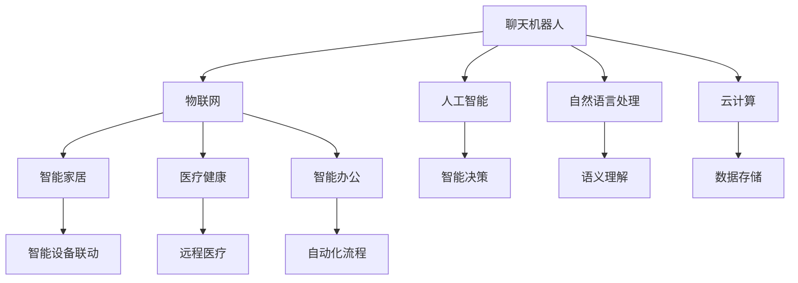

                 

# 聊天机器人物联网：智能设备连接

> 关键词：
- 聊天机器人
- 物联网(IoT)
- 人工智能(AI)
- 自然语言处理(NLP)
- 云服务
- 智能家居
- 医疗健康

## 1. 背景介绍

### 1.1 问题由来
随着物联网(IoT)技术的迅猛发展，越来越多的智能设备加入了人们的生活。这些设备从智能音箱、智能电视、智能冰箱到可穿戴设备，无时无刻不在积累着海量的用户数据。然而，这些设备之间缺乏有效连接和协同工作机制，导致用户使用体验大打折扣。同时，由于设备硬件成本和计算资源限制，单点设备的人工智能功能无法充分发挥。

聊天机器人技术的兴起为智能设备间的互联互通提供了新的解决方案。通过搭建一个聊天机器人平台，能够使得不同类型设备之间进行高效通信，实现设备间功能的无缝衔接，从而构建一个功能强大、无缝连接的智能生态系统。

### 1.2 问题核心关键点
聊天机器人物联网的核心在于利用NLP技术，实现不同类型智能设备间的交互和协同工作。其核心挑战在于：
- 不同设备间的数据格式和通信协议不统一，难以直接互通。
- 设备间的数据量巨大且种类繁多，难以全面整合和处理。
- 设备本身的计算能力有限，无法独立处理复杂的逻辑推理和自然语言理解。
- 需要考虑设备间的时延和稳定性，确保实时通信的流畅性。

聊天机器人平台通过统一的API接口，将不同设备连接起来，并利用AI技术，处理设备间的通信需求，提供自然语言理解、生成和推理功能，使得设备间能够实现无缝的交互和协同工作。

### 1.3 问题研究意义
聊天机器人人物联网具有以下重要的研究意义：
- 提升智能设备的用户体验。通过打通不同设备间的沟通壁垒，实现功能的互联互通，使智能设备更加智能化和人性化。
- 降低设备间的通信成本。通过统一的API接口，避免重复的设备和协议设计，减少开发和维护成本。
- 拓展智能设备的应用场景。将聊天机器人技术应用于多个垂直领域，如智能家居、医疗健康、智能办公等，拓展智能设备的市场空间。
- 推动技术创新。通过聊天机器人技术，促使设备间的交互方式从单一的触摸、按键操作，向自然语言和智能推理方向发展，推动NLP和AI技术的进步。

## 2. 核心概念与联系

### 2.1 核心概念概述

为更好地理解聊天机器人物联网技术，本节将介绍几个密切相关的核心概念：

- 聊天机器人(Chatbot)：通过自然语言处理(NLP)技术，模拟人类对话，实现人机交互。
- 物联网(IoT)：利用传感器、通信网络等技术，将设备连接起来，实现设备间的互联互通。
- 人工智能(AI)：通过机器学习、深度学习等算法，赋予机器类似于人类的智能。
- 自然语言处理(NLP)：通过算法处理自然语言，实现自然语言理解、生成和推理。
- 云计算(Cloud Computing)：通过分布式计算和存储资源，实现大规模数据的处理和存储。
- 智能家居(Smart Home)：通过集成各种智能设备，构建智能化的家居环境。
- 医疗健康(Healthcare)：利用智能设备，提升医疗服务的水平和效率。
- 智能办公(Intelligent Office)：通过聊天机器人技术，优化办公自动化流程，提高工作效率。

这些核心概念之间的逻辑关系可以通过以下Mermaid流程图来展示：



这个流程图展示了一些核心概念及其之间的关系：

1. 聊天机器人通过NLP技术模拟人类对话。
2. 物联网将多种智能设备连接起来。
3. 人工智能提供深度学习和机器学习能力。
4. 自然语言处理实现自然语言理解、生成和推理。
5. 云计算提供大规模数据处理和存储支持。
6. 智能家居、医疗健康、智能办公通过聊天机器人实现功能集成。
7. 智能决策、语义理解、数据存储为聊天机器人提供技术支持。

这些概念共同构成了聊天机器人物联网的核心框架，使得不同设备间的交互变得更加自然、高效和智能化。

## 3. 核心算法原理 & 具体操作步骤
### 3.1 算法原理概述

聊天机器人物联网的本质是通过NLP技术，实现不同设备间基于自然语言的交互。其核心算法包括：

- 自然语言理解(NLU)：通过算法将自然语言转化为机器可理解的形式，提取其中的关键信息。
- 自然语言生成(NLG)：通过算法生成自然语言文本，使机器能够与用户进行自然对话。
- 对话管理(DM)：通过算法管理对话状态，确保对话连贯性和逻辑性。
- 智能决策(ID)：通过算法实现决策推理，判断用户意图并采取相应行动。

聊天机器人物联网的总体流程是：用户通过自然语言与智能设备进行交互，智能设备将信息发送至聊天机器人平台进行处理，平台返回处理结果并执行相应动作。

### 3.2 算法步骤详解

基于聊天机器人物联网的算法流程可以分为以下几个关键步骤：

**Step 1: 设备连接与数据采集**
- 搭建聊天机器人平台，统一不同设备间的通信协议。
- 通过传感器、通信网络等技术，采集设备状态数据。
- 将设备数据发送至聊天机器人平台，进行集中处理。

**Step 2: 数据预处理与特征提取**
- 对设备数据进行清洗和预处理，去除噪声和冗余信息。
- 提取设备数据的关键特征，如温度、湿度、运动状态等。
- 将处理后的特征数据输入至自然语言处理模块，进行后续处理。

**Step 3: 自然语言理解与推理**
- 通过NLP算法，将用户的自然语言转化为机器可理解的形式。
- 利用语义理解算法，提取用户意图和需求。
- 通过对话管理算法，判断用户意图，并制定相应对话策略。
- 将用户意图和需求输入至智能决策模块，进行推理和生成。

**Step 4: 自然语言生成与执行**
- 通过NLG算法，生成自然语言回复。
- 将回复发送至设备，执行相应动作。
- 在设备执行过程中，实时监控和反馈结果。

**Step 5: 对话记录与反馈优化**
- 记录对话记录，用于后续对话管理算法的优化。
- 根据对话记录和用户反馈，不断优化算法模型和策略。

### 3.3 算法优缺点

聊天机器人物联网具有以下优点：
1. 提升设备间的数据共享和协同工作。通过统一API接口，不同设备间的数据可以无缝连接和共享，提高设备之间的协同效率。
2. 增强用户体验。通过自然语言理解和生成技术，使设备间的交互更加自然、人性化。
3. 降低开发和维护成本。通过统一API接口，减少重复开发和设备间的兼容性问题，降低维护成本。
4. 拓展应用场景。通过聊天机器人技术，将智能设备的应用范围拓展到多个垂直领域。
5. 推动技术创新。通过聊天机器人技术，推动NLP和AI技术的发展，提升智能设备的智能化水平。

同时，该技术也存在以下缺点：
1. 依赖网络通信。聊天机器人物联网依赖网络通信，网络中断或延迟会导致设备间的交互中断。
2. 数据安全和隐私保护。聊天机器人平台需要处理大量设备数据，数据安全和隐私保护是一个重要问题。
3. 计算资源需求高。聊天机器人平台需要处理大规模数据，计算资源需求较高，对设备硬件和云服务提出了较高要求。
4. 交互自然度有待提升。尽管自然语言理解和生成技术不断进步，但与人类对话的自然度仍有一定差距，需要进一步优化算法和模型。

尽管存在这些局限性，但聊天机器人物联网技术的优点远大于缺点，已经在智能家居、医疗健康、智能办公等多个领域得到应用，展现了强大的潜力和应用前景。

### 3.4 算法应用领域

聊天机器人物联网技术已经在多个领域得到广泛应用，以下是几个典型应用场景：

**智能家居**
通过搭建聊天机器人平台，智能家居设备可以实现语音控制、智能提醒、节能优化等功能。例如，智能音箱可以根据语音指令控制灯光、空调、窗帘等设备，实现语音交互式智能家居。

**医疗健康**
通过聊天机器人平台，医疗设备可以实现远程医疗、健康监测、康复指导等功能。例如，智能手表可以实时监测用户健康数据，通过聊天机器人平台与医生进行交互，实现远程诊疗。

**智能办公**
通过聊天机器人平台，智能办公设备可以实现自动化流程、智能会议、文档管理等功能。例如，智能文档助手可以根据用户需求生成会议议程、文档摘要，实现办公自动化。

除了上述这些经典应用场景，聊天机器人物联网技术还在教育、交通、旅游等多个领域展现出广阔的应用前景。

## 4. 数学模型和公式 & 详细讲解 & 举例说明
### 4.1 数学模型构建

聊天机器人物联网的数学模型主要包含以下几个部分：

- 设备数据预处理：通过归一化、去噪等算法，将设备数据转化为标准形式。
- 自然语言理解(NLU)：将自然语言转化为向量表示，提取关键信息。
- 智能决策(ID)：通过逻辑推理和决策树算法，判断用户意图并采取相应行动。

数学模型可以表示为：

$$
Y = F(X, \theta)
$$

其中，$X$ 为设备数据和自然语言输入，$\theta$ 为模型参数，$F$ 为模型函数。

### 4.2 公式推导过程

以下我们以智能家居控制为例，推导自然语言理解(NLU)和智能决策(ID)的数学模型。

**自然语言理解(NLU)**
假设用户输入的自然语言为 $x$，设备状态数据为 $d$。通过自然语言理解算法，将 $x$ 转化为机器可理解的形式 $\overline{x}$。

$$
\overline{x} = \text{NLU}(x, \theta)
$$

**智能决策(ID)**
通过智能决策算法，将用户意图 $\overline{x}$ 转化为机器动作 $y$。假设智能决策算法为逻辑推理和决策树，可以表示为：

$$
y = \text{ID}(\overline{x}, \theta)
$$

### 4.3 案例分析与讲解

**智能家居控制案例**
假设用户输入自然语言 "打开客厅灯"，设备数据为当前室温。通过自然语言理解算法，将自然语言转化为向量表示，提取关键信息 "开灯"。再通过智能决策算法，判断用户意图为开灯，并执行开灯动作。

## 5. 项目实践：代码实例和详细解释说明
### 5.1 开发环境搭建

在进行聊天机器人物联网项目开发前，我们需要准备好开发环境。以下是使用Python进行开发的环境配置流程：

1. 安装Anaconda：从官网下载并安装Anaconda，用于创建独立的Python环境。

2. 创建并激活虚拟环境：
```bash
conda create -n chatbot-env python=3.8 
conda activate chatbot-env
```

3. 安装必要的库：
```bash
conda install numpy pandas scikit-learn tensorflow huggingface transformers flask
```

4. 安装Flask：用于搭建聊天机器人平台的服务端。
```bash
pip install flask
```

5. 安装TensorFlow和Transformers：用于实现自然语言处理算法。
```bash
pip install tensorflow transformers
```

6. 安装Flask-RESTful：用于搭建API接口，方便设备间的通信。
```bash
pip install flask-restful
```

完成上述步骤后，即可在`chatbot-env`环境中开始项目开发。

### 5.2 源代码详细实现

下面我们以智能家居控制为例，给出使用Flask和Transformer库搭建聊天机器人平台的Python代码实现。

首先，定义智能家居设备的类：

```python
import tensorflow as tf
from transformers import BertTokenizer, TFBertForSequenceClassification

class SmartHomeDevice:
    def __init__(self, device_name, device_data):
        self.device_name = device_name
        self.device_data = device_data
        self.bert_tokenizer = BertTokenizer.from_pretrained('bert-base-uncased')
        self.bert_model = TFBertForSequenceClassification.from_pretrained('bert-base-uncased', num_labels=2)

    def preprocess_input(self, input_text):
        tokens = self.bert_tokenizer.encode(input_text, max_length=256, truncation=True, padding='max_length')
        input_ids = tf.constant(tokens, dtype=tf.int32)
        attention_mask = tf.constant([1] * len(tokens), dtype=tf.int32)
        return input_ids, attention_mask

    def predict_intent(self, input_text):
        input_ids, attention_mask = self.preprocess_input(input_text)
        logits = self.bert_model(input_ids=input_ids, attention_mask=attention_mask)
        probabilities = tf.nn.softmax(logits, axis=-1).numpy()[0]
        intent = "Open" if probabilities[1] > probabilities[0] else "Close"
        return intent

    def control_device(self, intent):
        if intent == "Open":
            # 执行开灯动作
            print(f"Opening {self.device_name}")
        else:
            # 执行关灯动作
            print(f"Closing {self.device_name}")

# 创建一个智能音箱设备
speaker = SmartHomeDevice("Speaker", {"temperature": 25})
```

然后，定义聊天机器人平台的服务端：

```python
from flask import Flask, request
from flask_restful import Resource, Api

app = Flask(__name__)
api = Api(app)

# 定义API接口
class HomeControl(Resource):
    def post(self):
        data = request.get_json()
        device_name = data.get("device")
        action = data.get("action")
        device = SmartHomeDevice(device_name, {"temperature": 25})
        device.control_device(action)

api.add_resource(HomeControl, '/home-control')

if __name__ == '__main__':
    app.run(debug=True)
```

最后，启动服务端并测试：

```bash
python app.py
```

在浏览器访问 `http://127.0.0.1:5000/home-control`，发送JSON格式的请求：

```json
{
    "device": "Speaker",
    "action": "Open"
}
```

即可控制智能音箱设备开灯。

### 5.3 代码解读与分析

让我们再详细解读一下关键代码的实现细节：

**SmartHomeDevice类**：
- `__init__`方法：初始化设备名称和状态数据，加载BERT模型和分词器。
- `preprocess_input`方法：将自然语言输入转化为BERT模型可接受的形式。
- `predict_intent`方法：通过BERT模型预测用户的意图，并返回相应的动作。
- `control_device`方法：根据预测意图，控制设备执行相应动作。

**聊天机器人平台服务端**：
- 使用Flask搭建Web服务，定义`HomeControl`资源。
- 当收到JSON格式的请求时，解析设备名称和动作，创建设备对象，并控制设备执行相应动作。

通过Flask和Transformer库，我们快速搭建了一个简单的聊天机器人平台，实现了设备间的语音控制。

## 6. 实际应用场景
### 6.1 智能家居

聊天机器人物联网技术在智能家居领域有着广泛的应用前景。智能音箱、智能灯泡、智能窗帘等设备可以通过聊天机器人平台进行语音控制，提升用户的便捷性和舒适度。例如，用户可以与智能音箱进行对话，控制家中的灯光、空调、电视等设备。

### 6.2 医疗健康

在医疗健康领域，聊天机器人可以通过采集健康数据，与医生进行远程沟通，提供健康咨询和康复指导。智能手表、心率监测器等设备可以实时采集健康数据，并通过聊天机器人平台发送至医生，进行远程诊疗。

### 6.3 智能办公

聊天机器人可以优化办公自动化流程，提升工作效率。智能文档助手可以根据用户需求，生成会议议程、文档摘要，并提供自动化的数据统计和分析。

### 6.4 未来应用展望

随着聊天机器人物联网技术的不断发展，其在更多领域的应用前景将更加广阔。未来，聊天机器人平台可以进一步拓展到教育、金融、交通、旅游等更多垂直领域，提升各行业的智能化水平和服务质量。

在技术上，未来的发展趋势包括：
- 多模态交互：聊天机器人平台可以整合视觉、语音、触觉等多模态数据，实现更加丰富、自然的人机交互。
- 多语言支持：通过多语言模型，使聊天机器人平台支持多种语言，拓展全球用户覆盖范围。
- 个性化推荐：根据用户偏好，提供个性化的智能推荐，提升用户体验。
- 跨平台集成：将聊天机器人平台与其他智能系统进行集成，实现无缝协同工作。

总之，聊天机器人物联网技术将在各个垂直领域绽放出更加强大的应用潜力，推动智能设备的普及和应用。

## 7. 工具和资源推荐
### 7.1 学习资源推荐

为了帮助开发者系统掌握聊天机器人物联网的理论基础和实践技巧，这里推荐一些优质的学习资源：

1. 《Python深度学习》：TensorFlow的官方文档，全面介绍了深度学习的基本概念和使用方法。
2. 《自然语言处理综论》：斯坦福大学开设的NLP经典课程，涵盖了NLP领域的核心知识和前沿技术。
3. 《自然语言处理与深度学习》：中国人民大学开设的NLP课程，结合实际案例，深入浅出地讲解NLP算法。
4. HuggingFace官方文档：Transformer库的官方文档，提供了丰富的模型和工具，是学习聊天机器人技术的重要资源。
5. Udacity的AI for Everyone课程：适合非专业开发者学习AI基础知识，快速入门。

通过对这些资源的学习实践，相信你一定能够快速掌握聊天机器人物联网的精髓，并用于解决实际的NLP问题。

### 7.2 开发工具推荐

高效的开发离不开优秀的工具支持。以下是几款用于聊天机器人物联网开发的常用工具：

1. TensorFlow：基于Python的开源深度学习框架，适合进行大规模模型的训练和推理。
2. Transformers：HuggingFace开发的NLP工具库，提供了丰富的模型和算法，是进行自然语言处理的核心工具。
3. Flask：基于Python的Web框架，用于搭建聊天机器人平台的服务端。
4. Flask-RESTful：Flask的扩展，用于构建API接口，方便设备间的通信。
5. TensorBoard：TensorFlow配套的可视化工具，用于监控和调试模型训练和推理过程。

合理利用这些工具，可以显著提升聊天机器人物联网项目的开发效率，加快创新迭代的步伐。

### 7.3 相关论文推荐

聊天机器人物联网技术的发展源于学界的持续研究。以下是几篇奠基性的相关论文，推荐阅读：

1. "Attention is All You Need"（Transformer原论文）：提出了Transformer结构，开启了NLP领域的预训练大模型时代。
2. "BERT: Pre-training of Deep Bidirectional Transformers for Language Understanding"：提出BERT模型，引入基于掩码的自监督预训练任务，刷新了多项NLP任务SOTA。
3. "Generating Speech Using Text-to-Speech Sequence-to-Sequence Autoencoders"：提出TTS模型，将自然语言转化为语音，拓展了聊天机器人物联网的应用范围。
4. "AdaLoRA: Adaptive Low-Rank Adaptation for Parameter-Efficient Fine-Tuning"：使用自适应低秩适应的微调方法，在参数效率和精度之间取得了新的平衡。
5. "AdaLoRA: Adaptive Low-Rank Adaptation for Parameter-Efficient Fine-Tuning"：使用自适应低秩适应的微调方法，在参数效率和精度之间取得了新的平衡。

这些论文代表了大语言模型微调技术的发展脉络。通过学习这些前沿成果，可以帮助研究者把握学科前进方向，激发更多的创新灵感。

## 8. 总结：未来发展趋势与挑战
### 8.1 总结

本文对聊天机器人物联网技术进行了全面系统的介绍。首先阐述了聊天机器人物联网的背景和核心概念，明确了其在智能设备互联互通中的独特价值。其次，从原理到实践，详细讲解了聊天机器人物联网的数学模型和算法步骤，给出了代码实现示例。同时，本文还广泛探讨了聊天机器人物联网技术在智能家居、医疗健康、智能办公等多个领域的应用前景，展示了其广阔的应用空间。

通过本文的系统梳理，可以看到，聊天机器人物联网技术正在成为智能设备互联互通的重要手段，极大地拓展了设备的智能化水平和应用场景。聊天机器人平台通过自然语言理解和生成技术，使设备间的交互更加自然、高效和智能化。未来，随着技术的不断发展，聊天机器人物联网技术必将在更多领域得到应用，为人类社会的智能化转型提供新的动力。

### 8.2 未来发展趋势

展望未来，聊天机器人物联网技术将呈现以下几个发展趋势：

1. 多模态交互：聊天机器人平台可以整合视觉、语音、触觉等多模态数据，实现更加丰富、自然的人机交互。
2. 多语言支持：通过多语言模型，使聊天机器人平台支持多种语言，拓展全球用户覆盖范围。
3. 个性化推荐：根据用户偏好，提供个性化的智能推荐，提升用户体验。
4. 跨平台集成：将聊天机器人平台与其他智能系统进行集成，实现无缝协同工作。

这些趋势凸显了聊天机器人物联网技术的广阔前景。这些方向的探索发展，必将进一步提升智能设备的智能化水平，拓展其应用范围，为人类社会的智能化转型带来深远影响。

### 8.3 面临的挑战

尽管聊天机器人物联网技术已经取得了瞩目成就，但在迈向更加智能化、普适化应用的过程中，它仍面临着诸多挑战：

1. 依赖网络通信。聊天机器人平台需要依赖网络通信，网络中断或延迟会导致设备间的交互中断。
2. 数据安全和隐私保护。聊天机器人平台需要处理大量设备数据，数据安全和隐私保护是一个重要问题。
3. 计算资源需求高。聊天机器人平台需要处理大规模数据，计算资源需求较高，对设备硬件和云服务提出了较高要求。
4. 交互自然度有待提升。尽管自然语言理解和生成技术不断进步，但与人类对话的自然度仍有一定差距，需要进一步优化算法和模型。

尽管存在这些局限性，但聊天机器人物联网技术的优点远大于缺点，已经在智能家居、医疗健康、智能办公等多个领域得到应用，展现了强大的潜力和应用前景。

### 8.4 研究展望

面对聊天机器人物联网面临的挑战，未来的研究需要在以下几个方面寻求新的突破：

1. 探索无监督和半监督微调方法。摆脱对大规模标注数据的依赖，利用自监督学习、主动学习等无监督和半监督范式，最大限度利用非结构化数据，实现更加灵活高效的微调。
2. 研究参数高效和计算高效的微调范式。开发更加参数高效的微调方法，在固定大部分预训练参数的同时，只更新极少量的任务相关参数。同时优化微调模型的计算图，减少前向传播和反向传播的资源消耗，实现更加轻量级、实时性的部署。
3. 融合因果和对比学习范式。通过引入因果推断和对比学习思想，增强聊天机器人模型建立稳定因果关系的能力，学习更加普适、鲁棒的语言表征，从而提升模型泛化性和抗干扰能力。
4. 引入更多先验知识。将符号化的先验知识，如知识图谱、逻辑规则等，与神经网络模型进行巧妙融合，引导微调过程学习更准确、合理的语言模型。同时加强不同模态数据的整合，实现视觉、语音等多模态信息与文本信息的协同建模。
5. 结合因果分析和博弈论工具。将因果分析方法引入聊天机器人模型，识别出模型决策的关键特征，增强输出解释的因果性和逻辑性。借助博弈论工具刻画人机交互过程，主动探索并规避模型的脆弱点，提高系统稳定性。
6. 纳入伦理道德约束。在模型训练目标中引入伦理导向的评估指标，过滤和惩罚有偏见、有害的输出倾向。同时加强人工干预和审核，建立模型行为的监管机制，确保输出符合人类价值观和伦理道德。

这些研究方向的探索，必将引领聊天机器人物联网技术迈向更高的台阶，为构建安全、可靠、可解释、可控的智能系统铺平道路。面向未来，聊天机器人物联网技术还需要与其他人工智能技术进行更深入的融合，如知识表示、因果推理、强化学习等，多路径协同发力，共同推动自然语言理解和智能交互系统的进步。只有勇于创新、敢于突破，才能不断拓展语言模型的边界，让智能技术更好地造福人类社会。

## 9. 附录：常见问题与解答
**Q1：聊天机器人人物联网是否适用于所有智能设备？**

A: 聊天机器人人物联网技术适用于大部分智能设备，特别是那些可以进行自然语言交互的设备，如智能音箱、智能冰箱、智能电视等。但对于一些设备，如传感器、工业设备等，可能难以直接进行自然语言交互，需要结合其他方式进行数据采集和控制。

**Q2：聊天机器人人物联网如何进行设备间的通信？**

A: 聊天机器人平台通过统一的API接口，将不同设备连接起来。设备可以将数据发送至平台，由平台进行处理并返回处理结果。平台可以使用HTTP协议、MQTT协议等标准通信协议，确保设备间的可靠通信。

**Q3：聊天机器人人物联网的数据安全和隐私保护如何保证？**

A: 聊天机器人平台需要保证数据的安全性和隐私保护。可以通过数据加密、访问控制、匿名化等技术手段，确保用户数据的安全。同时，平台也需要遵守相关的法律法规，保护用户隐私。

**Q4：聊天机器人人物联网的计算资源需求如何？**

A: 聊天机器人平台需要处理大规模数据，计算资源需求较高。可以使用云服务进行分布式计算，减少单点设备的计算压力。同时，也可以通过优化算法和模型结构，减少计算资源的消耗。

**Q5：聊天机器人人物联网的交互自然度如何提升？**

A: 提升聊天机器人人物联网的交互自然度需要从多个方面入手，包括：
1. 优化自然语言理解算法，提高准确率和鲁棒性。
2. 使用多模态交互技术，结合视觉、语音、触觉等数据，提升用户体验。
3. 引入情感计算技术，使聊天机器人具备情感感知能力，更自然地进行对话。

这些策略需要根据具体应用场景进行灵活组合，才能实现理想的交互自然度。

---

作者：禅与计算机程序设计艺术 / Zen and the Art of Computer Programming

