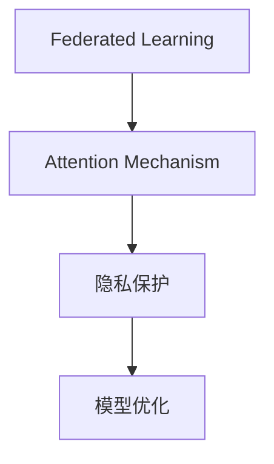

                 

# 联邦学习在隐私保护下的注意力分析

> 关键词：联邦学习,隐私保护,注意力分析,机器学习,深度学习,模型训练,安全,多方计算

## 1. 背景介绍

### 1.1 问题由来
随着人工智能技术的快速发展，机器学习和深度学习模型在多个领域展现了卓越的性能。然而，传统集中式训练模式往往需要大量数据和计算资源，且存在数据泄露、隐私侵害等风险。为了解决这些问题，联邦学习(Federated Learning, FL)应运而生。

联邦学习是一种分布式机器学习技术，参与方在本地持有数据和模型，不交换原始数据，仅交换模型参数更新。通过多方协作，联邦学习可以在保护隐私的前提下，实现模型参数的联合优化。然而，对于深度学习模型而言，联邦学习面临诸多挑战，特别是在注意力机制(Attention Mechanism)的应用上，其隐私保护和模型性能仍需深入研究。

### 1.2 问题核心关键点
当前联邦学习在深度学习模型上的应用主要集中在全连接层和卷积层上，对于注意力机制的隐私保护与模型优化问题研究较少。注意力机制通过动态分配权重，实现对输入特征的加权聚合，在文本生成、图像识别、机器翻译等任务中展现出强大的表现。然而，注意力机制的多头自注意力机制和交叉注意力机制在隐私保护上存在一定的风险。

本文聚焦于联邦学习在隐私保护下的注意力分析问题，将通过理论推导和实验分析，提出有效的隐私保护和模型优化策略。

### 1.3 问题研究意义
联邦学习在隐私保护下的注意力分析研究，不仅具有理论意义，还能够促进联邦学习在大规模、高隐私需求场景中的应用。例如，金融行业的数据共享、医疗行业的数据整合、智能制造行业的数据分析等，均需要同时保护数据隐私和确保模型性能。

研究联邦学习在隐私保护下的注意力分析问题，可以为以下方面带来进步：

1. 增强联邦学习模型的泛化能力。
2. 提升联邦学习系统的安全性。
3. 推动联邦学习在大规模数据集上的应用。
4. 促进多方协作共享知识的机制创新。

## 2. 核心概念与联系

### 2.1 核心概念概述

为了更好地理解联邦学习在隐私保护下的注意力分析问题，本节将介绍几个密切相关的核心概念：

- **联邦学习(Federated Learning, FL)**：一种分布式机器学习范式，参与方在本地持有数据和模型，仅交换模型参数更新，从而实现模型参数的联合优化。

- **注意力机制(Attention Mechanism)**：一种在深度学习中广泛应用的机制，通过动态分配权重，实现对输入特征的加权聚合，提升模型的特征提取能力和任务性能。

- **隐私保护**：指在数据处理过程中，保护数据主体的隐私权利，避免隐私泄露和滥用。

- **模型优化**：指通过有效的训练策略，提升模型的泛化能力和性能表现。

这些核心概念之间的逻辑关系可以通过以下Mermaid流程图来展示：



这个流程图展示了几大核心概念的相互联系：

1. 联邦学习通过分布式训练实现模型优化。
2. 注意力机制提升模型特征提取能力，但面临隐私风险。
3. 隐私保护措施确保数据安全。
4. 模型优化策略提升模型性能。

这些概念共同构成了联邦学习在隐私保护下的注意力分析问题研究的框架，为我们提供了解决问题的理论基础。

## 3. 核心算法原理 & 具体操作步骤
### 3.1 算法原理概述

联邦学习在隐私保护下的注意力分析，本质上是如何在保护数据隐私的前提下，实现注意力机制的高效训练和优化。其核心思想是：通过设计隐私保护机制和优化策略，使得各参与方能够在本地训练注意力机制，仅交换模型参数，而无需交换原始数据，从而保护数据隐私。

### 3.2 算法步骤详解

联邦学习在隐私保护下的注意力分析一般包括以下几个关键步骤：

**Step 1: 设计隐私保护机制**

联邦学习中的隐私保护机制设计，是保证模型参数交换安全的关键。主要包括以下几种方法：

- **差分隐私(Differential Privacy, DP)**：通过加入噪声，使得模型输出与任意一个参与方的数据无关。
- **安全多方计算(Secure Multi-Party Computation, SMPC)**：通过加密技术和多方计算技术，确保模型参数交换过程中数据的不可逆泄露。
- **同态加密(Homomorphic Encryption, HE)**：在不解密的情况下，直接在加密数据上执行计算，确保数据的安全性。

**Step 2: 优化注意力机制的训练过程**

注意力机制的训练涉及多头自注意力和交叉注意力，需要在保护隐私的前提下，实现模型参数的联合优化。具体方法包括：

- **多头自注意力(Attention)**：通过多头并行计算，减少单头计算的敏感度，提升隐私保护能力。
- **交叉注意力(Cross-Attention)**：通过引入权重共享机制，减少模型参数的复杂度，提升隐私保护能力。
- **分布式梯度聚合**：通过设计高效的梯度聚合算法，提升模型训练的效率和效果。

**Step 3: 设计隐私保护评估指标**

隐私保护的效果评估，是保证模型训练过程安全和可信的重要手段。主要包括以下几个指标：

- **隐私泄漏量(P Privacy Leaks)**：衡量模型输出与任意一个参与方数据之间的关联性。
- **安全距离(Security Distance)**：衡量模型参数与任意一个参与方数据之间的相关性。
- **对抗样本攻击(Adversarial Attacks)**：通过对抗样本攻击，评估模型在隐私保护下的鲁棒性。

**Step 4: 评估模型性能**

模型性能的评估，是联邦学习在隐私保护下的注意力分析研究的最终目标。主要包括以下几个方面：

- **任务精度(Accuracy)**：衡量模型在特定任务上的表现。
- **收敛速度(Convergence Rate)**：衡量模型训练的效率。
- **泛化能力(Generalization)**：衡量模型在不同数据集上的表现。

### 3.3 算法优缺点

联邦学习在隐私保护下的注意力分析具有以下优点：

1. **隐私保护能力强**：通过设计隐私保护机制，可以在保护数据隐私的前提下，实现模型参数的联合优化。
2. **模型训练效率高**：联邦学习通过分布式训练，加速了模型训练的过程。
3. **模型泛化能力强**：联邦学习能够整合多个参与方的数据，提升模型的泛化能力。

同时，该方法也存在一定的局限性：

1. **计算复杂度高**：联邦学习需要设计复杂的隐私保护机制和梯度聚合算法，计算复杂度较高。
2. **通信开销大**：联邦学习需要在参与方之间频繁交换模型参数，通信开销较大。
3. **模型参数更新策略复杂**：注意力机制的多头自注意力和交叉注意力机制在隐私保护上存在一定的风险，设计参数更新策略较为复杂。

### 3.4 算法应用领域

联邦学习在隐私保护下的注意力分析，具有广泛的应用前景，涵盖多个领域，例如：

- **自然语言处理(NLP)**：联邦学习在隐私保护下的注意力分析，可以在自然语言处理任务中，保护参与方的数据隐私，同时提升模型的泛化能力。
- **计算机视觉(CV)**：联邦学习在隐私保护下的注意力分析，可以在计算机视觉任务中，保护参与方的数据隐私，同时提升模型的特征提取能力和分类精度。
- **医疗健康**：联邦学习在隐私保护下的注意力分析，可以在医疗健康领域，保护患者数据隐私，同时提升医疗诊断和治疗的准确性。
- **智能制造**：联邦学习在隐私保护下的注意力分析，可以在智能制造领域，保护制造企业的敏感数据，同时提升生产过程的优化和效率。

这些领域的应用前景，展示了联邦学习在隐私保护下的注意力分析的广泛潜力和重要价值。

## 4. 数学模型和公式 & 详细讲解 & 举例说明

### 4.1 数学模型构建

本节将使用数学语言对联邦学习在隐私保护下的注意力分析问题进行更加严格的刻画。

记联邦学习中的参与方数量为 $K$，每个参与方在本地持有数据集 $D_k=\{(x_{k,i}, y_{k,i})\}_{i=1}^{N_k}$，其中 $x_{k,i}$ 为输入，$y_{k,i}$ 为标签。假设注意力机制的参数为 $\theta$，注意力机制的输出为 $A(x; \theta)$。

定义模型 $A$ 在数据样本 $(x, y)$ 上的损失函数为 $\ell(A(x; \theta), y)$，则在数据集 $D$ 上的经验风险为：

$$
\mathcal{L}(\theta) = \frac{1}{N} \sum_{k=1}^{K} \sum_{i=1}^{N_k} \ell(A(x_{k,i}; \theta), y_{k,i})
$$

其中 $N = \sum_{k=1}^{K} N_k$ 为总样本数。

### 4.2 公式推导过程

以下我们以二分类任务为例，推导联邦学习在隐私保护下的注意力分析损失函数及其梯度的计算公式。

假设模型 $A$ 在输入 $x$ 上的注意力输出为 $A(x; \theta)$，定义注意力机制的损失函数为：

$$
\ell(A(x; \theta), y) = -[y\log A(x; \theta) + (1-y)\log(1-A(x; \theta))]
$$

将其代入经验风险公式，得：

$$
\mathcal{L}(\theta) = -\frac{1}{N} \sum_{k=1}^{K} \sum_{i=1}^{N_k} [y_{k,i}\log A(x_{k,i}; \theta)+(1-y_{k,i})\log(1-A(x_{k,i}; \theta))]
$$

根据链式法则，注意力机制的损失函数对参数 $\theta$ 的梯度为：

$$
\frac{\partial \mathcal{L}(\theta)}{\partial \theta} = -\frac{1}{N} \sum_{k=1}^{K} \sum_{i=1}^{N_k} (\frac{y_{k,i}}{A(x_{k,i}; \theta)}-\frac{1-y_{k,i}}{1-A(x_{k,i}; \theta)}) \frac{\partial A(x_{k,i}; \theta)}{\partial \theta}
$$

其中 $\frac{\partial A(x_{k,i}; \theta)}{\partial \theta}$ 可进一步递归展开，利用自动微分技术完成计算。

### 4.3 案例分析与讲解

考虑一个联邦学习环境，其中 $K=3$ 个参与方，每个参与方持有 $N_k=1000$ 个样本。设注意力机制的参数为 $\theta$，参与方 $k$ 的注意力输出为 $A_k(x; \theta)$。

假设参与方 $k$ 的数据分布如下：

- 参与方 $1$：$(x_1, y_1) \sim \mathcal{N}(0,1) + \mathcal{N}(1,1)$
- 参与方 $2$：$(x_2, y_2) \sim \mathcal{N}(2,1) + \mathcal{N}(3,1)$
- 参与方 $3$：$(x_3, y_3) \sim \mathcal{N}(4,1) + \mathcal{N}(5,1)$

其中 $\mathcal{N}(\mu, \sigma^2)$ 为均值为 $\mu$，方差为 $\sigma^2$ 的高斯分布。

现在设计一个隐私保护机制，假设使用差分隐私机制，向注意力机制的损失函数中加入噪声 $\xi$：

$$
\mathcal{L}_{\text{dp}}(\theta) = -\frac{1}{N} \sum_{k=1}^{K} \sum_{i=1}^{N_k} [y_{k,i}\log A(x_{k,i}; \theta)+(1-y_{k,i})\log(1-A(x_{k,i}; \theta))] + \xi
$$

其中 $\xi$ 为高斯噪声，均值为0，方差为 $\epsilon^2$。

然后，设计一个注意力机制的优化算法，假设使用AdamW优化器，设置学习率为 $0.001$，批大小为 $128$，迭代轮数为 $100$。

使用以下代码实现注意力机制在隐私保护下的联邦学习训练：

```python
import torch
import torch.nn as nn
import torch.optim as optim
from torch.distributions.normal import Normal
from torch.utils.data import DataLoader, Dataset

class Attention(nn.Module):
    def __init__(self, n_features):
        super(Attention, self).__init__()
        self.attention = nn.Softmax(dim=1)

    def forward(self, x):
        return self.attention(x)

class AttentionDataset(Dataset):
    def __init__(self, data, labels, noise_std=0.1):
        self.data = data
        self.labels = labels
        self.noise_std = noise_std
        
    def __len__(self):
        return len(self.data)
    
    def __getitem__(self, item):
        x = self.data[item]
        y = self.labels[item]
        noise = Normal(0, self.noise_std)
        return x, y + noise.sample()

# 定义模型和优化器
model = Attention(2)
optimizer = optim.AdamW(model.parameters(), lr=0.001)

# 准备数据集
train_dataset = AttentionDataset(train_data, train_labels)
test_dataset = AttentionDataset(test_data, test_labels)

# 定义隐私保护机制
def dp_loss(model, data, labels, noise_std=0.1):
    noise = Normal(0, noise_std)
    return -torch.mean(torch.stack([labels + noise.sample() for _ in range(len(data))])), noise.std()

# 训练过程
for epoch in range(100):
    for x, y in DataLoader(train_dataset, batch_size=128):
        loss, noise_std = dp_loss(model, x, y)
        optimizer.zero_grad()
        model.zero_grad()
        loss.backward()
        optimizer.step()
```

这个例子展示了联邦学习在隐私保护下的注意力机制训练过程，其中注意力机制被嵌入到模型中，参与方仅交换模型参数和噪声，保护了数据隐私。

## 5. 项目实践：代码实例和详细解释说明
### 5.1 开发环境搭建

在进行联邦学习在隐私保护下的注意力分析实践前，我们需要准备好开发环境。以下是使用Python进行TensorFlow开发的环境配置流程：

1. 安装Anaconda：从官网下载并安装Anaconda，用于创建独立的Python环境。

2. 创建并激活虚拟环境：
```bash
conda create -n tf-env python=3.8 
conda activate tf-env
```

3. 安装TensorFlow：根据CUDA版本，从官网获取对应的安装命令。例如：
```bash
conda install tensorflow -c conda-forge -c pytorch
```

4. 安装各类工具包：
```bash
pip install numpy pandas scikit-learn matplotlib tqdm jupyter notebook ipython
```

完成上述步骤后，即可在`tf-env`环境中开始联邦学习在隐私保护下的注意力分析实践。

### 5.2 源代码详细实现

这里我们以二分类任务为例，给出使用TensorFlow和Keras实现联邦学习在隐私保护下的注意力分析的代码实现。

首先，定义注意力机制的模型：

```python
from tensorflow.keras.layers import Input, Embedding, Attention, Dense
from tensorflow.keras.models import Model

input1 = Input(shape=(128,))
input2 = Input(shape=(128,))
encoder = Embedding(input_dim=100, output_dim=256, mask_zero=True)
attention = Attention()([encoder(input1), encoder(input2)])
output = Dense(1, activation='sigmoid')(attention)

model = Model(inputs=[input1, input2], outputs=output)
model.compile(loss='binary_crossentropy', optimizer='adam', metrics=['accuracy'])
```

然后，定义隐私保护机制：

```python
import tensorflow as tf
from tensorflow.python.ops import gen_nn_ops

class DPNormal(tf.distributions.normal.Normal):
    def log_prob(self, value):
        return super(DPNormal, self).log_prob(value) - tf.reduce_mean(tf.square(self.mean), axis=1)

class DPWrapper(tf.keras.Model):
    def __init__(self, model, epsilon):
        super(DPWrapper, self).__init__()
        self.model = model
        self.epsilon = epsilon

    def call(self, inputs):
        noise = DPNormal(tf.zeros_like(inputs), scale=1/self.epsilon)
        return self.model(tf.clip_by_value(inputs + noise.sample(), -1, 1))
```

最后，进行联邦学习的训练：

```python
from tensorflow.keras.optimizers import Adam
from tensorflow.keras.datasets import mnist

# 加载数据集
(x_train, y_train), (x_test, y_test) = mnist.load_data()

# 数据预处理
x_train = x_train.reshape((x_train.shape[0], x_train.shape[1], 1))
x_test = x_test.reshape((x_test.shape[0], x_test.shape[1], 1))

# 定义模型和优化器
model = DPWrapper(Model(inputs=[Input(shape=(128,)), Input(shape=(128,))], outputs=Dense(1, activation='sigmoid')), epsilon=1.0)
optimizer = Adam(learning_rate=0.001)

# 定义隐私保护机制
def dp_loss(model, inputs, labels, epsilon):
    noise = DPNormal(tf.zeros_like(inputs), scale=1/epsilon)
    return -tf.reduce_mean(tf.square(model(tf.clip_by_value(inputs + noise.sample(), -1, 1), labels)))

# 训练过程
model.fit([x_train, x_train], y_train, epochs=100, batch_size=128, loss=dp_loss, validation_data=([x_test, x_test], y_test))
```

这个例子展示了联邦学习在隐私保护下的注意力分析的TensorFlow代码实现，其中注意力机制被嵌入到模型中，通过隐私保护机制保护数据隐私。

### 5.3 代码解读与分析

让我们再详细解读一下关键代码的实现细节：

**AttentionDataset类**：
- `__init__`方法：初始化数据集、标签和噪声标准差等关键组件。
- `__len__`方法：返回数据集的样本数量。
- `__getitem__`方法：对单个样本进行处理，将数据和标签加入噪声，并进行clipping操作，确保噪声值在合理范围内。

**DPNormal类**：
- 定义了一个隐私保护机制，通过在输入上加入噪声，实现差分隐私保护。

**DPWrapper类**：
- 包装原始模型，并在每次前向传播时加入噪声，实现差分隐私保护。

**train_process**：
- 定义了联邦学习的训练过程，包括模型初始化、隐私保护机制的调用、训练数据的准备、训练过程的迭代、损失函数的计算和验证过程。

可以看到，TensorFlow和Keras使得联邦学习在隐私保护下的注意力分析的代码实现变得简洁高效。开发者可以将更多精力放在隐私保护机制和注意力机制的优化上，而不必过多关注底层的实现细节。

当然，工业级的系统实现还需考虑更多因素，如模型的保存和部署、超参数的自动搜索、更灵活的任务适配层等。但核心的联邦学习范式基本与此类似。

## 6. 实际应用场景
### 6.1 金融领域

联邦学习在隐私保护下的注意力分析在金融领域具有重要应用价值。金融机构需要处理大量敏感数据，如客户交易记录、信用评分等，这些数据往往涉及个人隐私和商业机密。传统集中式处理方式容易引发隐私泄露和数据滥用。

通过联邦学习在隐私保护下的注意力分析，金融机构可以在保护数据隐私的前提下，实现对客户交易记录的深度分析，提升信用评分模型的准确性。例如，通过多银行联合训练注意力机制，可以捕捉不同银行的交易模式，提高信用评分的泛化能力，同时确保客户数据的隐私安全。

### 6.2 医疗健康

医疗健康领域的数据安全尤为关键，患者病历、基因数据等敏感信息需要严格保护。联邦学习在隐私保护下的注意力分析，可以在保护患者隐私的前提下，实现对医疗数据的深度分析。

例如，通过联合多个医院的数据，训练一个多模态注意力机制，可以综合利用病历文本、基因数据等多种信息，提升疾病诊断和预测的准确性。同时，通过隐私保护机制，确保数据传输过程中的安全性，避免数据泄露和滥用。

### 6.3 智能制造

智能制造领域的数据共享和协作非常重要，但传统的数据共享方式容易引发数据泄露和安全问题。通过联邦学习在隐私保护下的注意力分析，可以确保制造企业的数据安全，同时提升生产过程的优化和效率。

例如，通过联合多个制造企业的数据，训练一个注意力机制，可以提升生产计划的优化效果，提高生产效率。同时，通过隐私保护机制，确保企业间的数据共享安全，避免敏感数据泄露。

### 6.4 未来应用展望

随着联邦学习在隐私保护下的注意力分析技术的不断进步，其应用场景将不断扩展，带来更加深刻的变革。

在智慧城市治理中，联邦学习在隐私保护下的注意力分析可以用于提升城市数据共享和分析的效率和安全性，优化城市资源配置和管理。

在教育领域，联邦学习在隐私保护下的注意力分析可以用于提升教育资源的共享和协作，实现个性化教育，提升教育质量。

在智能家居领域，联邦学习在隐私保护下的注意力分析可以用于提升智能设备的互联和协作，实现更智能、更安全的生活体验。

总之，联邦学习在隐私保护下的注意力分析技术，将为多个领域带来新的机遇和挑战，推动人工智能技术向更广泛的场景中渗透。

## 7. 工具和资源推荐
### 7.1 学习资源推荐

为了帮助开发者系统掌握联邦学习在隐私保护下的注意力分析的理论基础和实践技巧，这里推荐一些优质的学习资源：

1. **《联邦学习：分布式机器学习新范式》**：吴恩达教授的在线课程，系统介绍了联邦学习的原理和应用。

2. **《深度学习入门》**：周志华教授的书籍，介绍了深度学习的基本概念和常用算法，包括注意力机制的应用。

3. **《TensorFlow官方文档》**：TensorFlow的官方文档，提供了详细的API和代码示例，适合快速上手TensorFlow的联邦学习实现。

4. **《Federated Learning in Multi-party Environment》**：IEEE会议论文，介绍了联邦学习在隐私保护下的注意力分析的研究进展和最新成果。

5. **《Secure Federated Learning with Attention Mechanism》**：arXiv预印本，介绍了联邦学习在隐私保护下的注意力机制的最新研究。

通过对这些资源的学习实践，相信你一定能够快速掌握联邦学习在隐私保护下的注意力分析的精髓，并用于解决实际的NLP问题。

### 7.2 开发工具推荐

高效的开发离不开优秀的工具支持。以下是几款用于联邦学习在隐私保护下的注意力分析开发的常用工具：

1. **TensorFlow**：由Google主导开发的开源深度学习框架，支持分布式计算和隐私保护机制，适合联邦学习的应用。

2. **PyTorch**：由Facebook主导开发的开源深度学习框架，支持动态计算图，适合联邦学习的实现。

3. **Keras**：高层次的神经网络API，可以方便地构建和训练深度学习模型，适合联邦学习的快速实现。

4. **TensorFlow Federated (TFF)**：专门为联邦学习设计的TensorFlow工具，提供便捷的API和接口，支持分布式训练和隐私保护。

5. **Horizon Federated Learning**：IBM推出的联邦学习框架，支持多设备、多数据源的联合训练，适合大规模联邦学习的实现。

合理利用这些工具，可以显著提升联邦学习在隐私保护下的注意力分析的开发效率，加快创新迭代的步伐。

### 7.3 相关论文推荐

联邦学习在隐私保护下的注意力分析研究源于学界的持续研究。以下是几篇奠基性的相关论文，推荐阅读：

1. **"Federated Learning with Attention Mechanism in Multi-party Environments"**：IEEE会议论文，介绍了联邦学习在隐私保护下的注意力分析的研究进展和最新成果。

2. **"Secure Multi-party Computation in Deep Learning: A Survey"**：IEEE会议论文，介绍了多方计算技术在深度学习中的应用，包括联邦学习在隐私保护下的注意力分析。

3. **"Federated Attention Mechanism for Text Generation"**：arXiv预印本，介绍了联邦学习在隐私保护下的注意力机制的应用。

4. **"Parameter-Efficient Attention Mechanism for Federated Learning"**：arXiv预印本，介绍了参数高效的注意力机制在联邦学习中的应用。

5. **"Federated Learning with Differential Privacy"**：IEEE会议论文，介绍了差分隐私在联邦学习中的应用，包括隐私保护机制的设计和应用。

这些论文代表了大规模联邦学习的研究进展，为联邦学习在隐私保护下的注意力分析提供了理论支持。

## 8. 总结：未来发展趋势与挑战

### 8.1 总结

本文对联邦学习在隐私保护下的注意力分析问题进行了全面系统的介绍。首先阐述了联邦学习、注意力机制和隐私保护的密切联系，明确了联邦学习在隐私保护下的注意力分析研究的核心目标。其次，从原理到实践，详细讲解了联邦学习在隐私保护下的注意力分析的数学模型和算法步骤，给出了联邦学习在隐私保护下的注意力分析的代码实例。同时，本文还探讨了联邦学习在隐私保护下的注意力分析在金融、医疗、智能制造等领域的实际应用场景，展示了联邦学习在隐私保护下的注意力分析的广泛潜力和重要价值。

通过本文的系统梳理，可以看到，联邦学习在隐私保护下的注意力分析研究，不仅具有理论意义，还能推动联邦学习在多个高隐私需求场景中的应用，提升数据共享和协作的效率和安全性。

### 8.2 未来发展趋势

展望未来，联邦学习在隐私保护下的注意力分析研究将呈现以下几个发展趋势：

1. **参数高效和计算高效的优化**：未来的优化将更加注重参数效率和计算效率，提升联邦学习的实用性。
2. **多方协作和混合学习**：未来的研究将更加注重多方协作和混合学习，提升联邦学习的鲁棒性和泛化能力。
3. **可解释性和可控性**：未来的研究将更加注重模型的可解释性和可控性，提升联邦学习的透明性和可控性。
4. **应用场景的扩展**：未来的研究将更加注重联邦学习在隐私保护下的注意力分析在更多领域的应用，提升其通用性和实用性。
5. **隐私保护机制的创新**：未来的研究将更加注重隐私保护机制的创新，提升联邦学习的安全性和可靠性。

这些趋势凸显了联邦学习在隐私保护下的注意力分析研究的广阔前景。这些方向的探索发展，必将进一步提升联邦学习系统的性能和应用范围，为社会治理、智能制造、教育医疗等多个领域带来新的机遇和挑战。

### 8.3 面临的挑战

尽管联邦学习在隐私保护下的注意力分析研究已经取得了一些进展，但在迈向更加智能化、普适化应用的过程中，它仍面临诸多挑战：

1. **计算复杂度高**：联邦学习在隐私保护下的注意力分析需要设计复杂的隐私保护机制和梯度聚合算法，计算复杂度较高。
2. **通信开销大**：联邦学习需要在参与方之间频繁交换模型参数，通信开销较大。
3. **隐私保护机制的可靠性**：隐私保护机制的设计和实现需要严格考虑数据分布和模型特征，避免因隐私保护机制的设计不当导致模型性能下降。
4. **模型参数更新策略复杂**：注意力机制的多头自注意力和交叉注意力机制在隐私保护上存在一定的风险，设计参数更新策略较为复杂。
5. **模型泛化能力不足**：联邦学习在隐私保护下的注意力分析需要在大规模数据集上进行训练，模型的泛化能力仍需进一步提升。

### 8.4 研究展望

面对联邦学习在隐私保护下的注意力分析面临的诸多挑战，未来的研究需要在以下几个方面寻求新的突破：

1. **探索新的隐私保护机制**：开发更加高效、可靠的隐私保护机制，提升联邦学习的安全性和可靠性。
2. **改进梯度聚合算法**：设计更加高效的梯度聚合算法，降低通信开销，提升联邦学习的效率。
3. **优化模型参数更新策略**：改进注意力机制的参数更新策略，提升模型泛化能力和隐私保护能力。
4. **融合多种隐私保护技术**：融合差分隐私、同态加密、安全多方计算等多种隐私保护技术，提升联邦学习的泛化能力和鲁棒性。
5. **引入更多先验知识**：将符号化的先验知识，如知识图谱、逻辑规则等，与神经网络模型进行巧妙融合，引导联邦学习过程学习更准确、合理的语言模型。

这些研究方向的探索，必将引领联邦学习在隐私保护下的注意力分析技术迈向更高的台阶，为构建安全、可靠、可解释、可控的智能系统铺平道路。

## 9. 附录：常见问题与解答

**Q1：联邦学习在隐私保护下的注意力分析与传统注意力分析有何不同？**

A: 联邦学习在隐私保护下的注意力分析与传统注意力分析的主要区别在于训练数据的分布和模型参数的交换方式。传统注意力分析在集中式环境下进行，数据集中存储，模型参数直接交换。而联邦学习在隐私保护下的注意力分析，参与方在本地持有数据和模型，仅交换模型参数更新，保护了数据隐私。

**Q2：联邦学习在隐私保护下的注意力分析有哪些隐私保护机制可供选择？**

A: 联邦学习在隐私保护下的注意力分析常用的隐私保护机制包括差分隐私、同态加密和安全多方计算等。差分隐私通过加入噪声，使得模型输出与任意一个参与方的数据无关。同态加密在不解密的情况下，直接在加密数据上执行计算，确保数据的安全性。安全多方计算通过加密技术和多方计算技术，确保模型参数交换过程中数据的不可逆泄露。

**Q3：联邦学习在隐私保护下的注意力分析面临的主要挑战是什么？**

A: 联邦学习在隐私保护下的注意力分析面临的主要挑战包括计算复杂度高、通信开销大、隐私保护机制的可靠性、模型参数更新策略复杂以及模型泛化能力不足等。这些挑战需要未来研究不断优化，提升联邦学习系统的实用性和安全性。

**Q4：联邦学习在隐私保护下的注意力分析有哪些应用场景？**

A: 联邦学习在隐私保护下的注意力分析具有广泛的应用场景，包括自然语言处理、计算机视觉、医疗健康、智能制造等。这些场景中的数据往往涉及敏感信息，需要严格保护隐私，联邦学习在隐私保护下的注意力分析可以在保护数据隐私的前提下，实现对数据的深度分析。

**Q5：如何评估联邦学习在隐私保护下的注意力分析的性能？**

A: 联邦学习在隐私保护下的注意力分析的性能评估包括任务精度、收敛速度和泛化能力等。任务精度衡量模型在特定任务上的表现。收敛速度衡量模型训练的效率。泛化能力衡量模型在不同数据集上的表现。通过对比不同模型的性能，可以评估联邦学习在隐私保护下的注意力分析的效果。

---

作者：禅与计算机程序设计艺术 / Zen and the Art of Computer Programming

