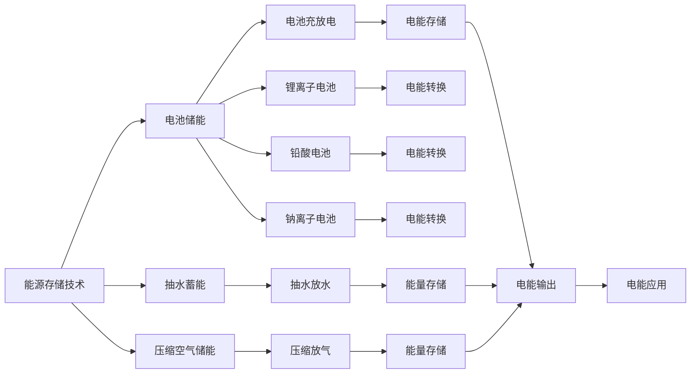

                 

# 能源存储创业：清洁能源革命的关键

## 1. 背景介绍

### 1.1 问题由来

清洁能源的革命正在全球范围内如火如荼地进行。风能、太阳能等可再生能源的成本日益下降，逐步取代传统化石燃料，成为电力系统的主力军。然而，由于风能、太阳能等发电的间歇性和不稳定性，其大规模接入电网带来了很多挑战。为了解决这一问题，能源存储技术成为清洁能源革命的关键。

能源存储技术可以吸收过剩的发电量，并在电力需求高涨时释放出来，保证电网的稳定运行。此外，能源存储还能缓解用户高峰时的电价压力，提高能源利用效率。因此，能源存储创业有着巨大的市场潜力和发展前景。

### 1.2 问题核心关键点

能源存储创业的核心在于选择合适的技术路径，并在此基础上进行产品和服务的设计与开发。具体的关键点包括：

- 技术成熟度：选择合适的能源存储技术，如电池储能、抽水蓄能、压缩空气储能等，确保技术的可靠性与高效性。
- 成本效益：评估技术的经济可行性，确保产品和服务具有竞争优势。
- 市场需求：深入分析市场的需求与痛点，设计符合用户需求的产品。
- 创新点：在技术、产品、服务等方面进行创新，形成独特的市场竞争优势。
- 可持续发展：考虑环保、资源利用等方面，推动可持续发展。

本文将围绕上述核心点，深入探讨能源存储创业的技术、经济与市场策略。

## 2. 核心概念与联系

### 2.1 核心概念概述

能源存储创业涉及多个关键概念，包括能源存储技术、电池储能、抽水蓄能、压缩空气储能、市场需求、经济模型等。

- **能源存储技术**：指的是将能量存储起来，并在需要时释放出来的技术。常见的能源存储技术包括电池储能、抽水蓄能、压缩空气储能等。
- **电池储能**：利用电池充放电的特性进行能量存储，如锂离子电池、铅酸电池、钠离子电池等。
- **抽水蓄能**：利用高、低两个水库之间的高度差进行能量存储，通过抽水和放水释放能量。
- **压缩空气储能**：利用高压空气在低压容器中存储能量，通过放气推动涡轮发电。
- **市场需求**：分析能源存储技术在不同行业、不同地区的需求，如电力系统、工业、交通、住宅等。
- **经济模型**：建立能源存储项目的成本效益分析模型，评估项目的投资回报率、生命周期成本等。

这些概念之间存在紧密联系，共同构成了能源存储创业的基础框架。

### 2.2 核心概念原理和架构的 Mermaid 流程图



## 3. 核心算法原理 & 具体操作步骤

### 3.1 算法原理概述

能源存储创业的核心算法包括成本效益分析、市场需求预测、技术路线选择等。

- **成本效益分析**：评估项目投资回报率、经济可行性、生命周期成本等。通过建立经济模型，可以量化项目的经济效益，为决策提供依据。
- **市场需求预测**：分析不同行业、地区对能源存储技术的需求，预测市场规模和增长趋势。了解市场需求，可以更好地制定市场策略。
- **技术路线选择**：综合考虑技术的成熟度、成本、效率、可靠性等因素，选择最适合的能源存储技术。

### 3.2 算法步骤详解

#### 3.2.1 成本效益分析

1. **项目投资回报率**：
   - 计算总投资成本，包括设备采购、安装、运营、维护等。
   - 计算年运营收益，包括发电收益、峰谷电价差、政府补贴等。
   - 计算净现值、内部收益率等经济指标。

2. **经济模型构建**：
   - 建立动态经济模型，考虑设备折旧、利率、通货膨胀等因素。
   - 选择适合的评价指标，如NPV、IRR、ROI等。

3. **成本效益分析**：
   - 比较不同技术路径的成本效益，选择最优方案。
   - 分析不同规模项目的经济性，确定最佳产能。

#### 3.2.2 市场需求预测

1. **行业分析**：
   - 分析电力系统、工业、交通、住宅等不同行业对能源存储技术的需求。
   - 研究各行业的用电模式、需求高峰期等。

2. **区域分析**：
   - 分析不同地区的能源结构、电网特点、政策环境等。
   - 预测各地区的能源存储需求量。

3. **市场需求预测**：
   - 综合行业和区域分析结果，预测总体市场需求。
   - 考虑政策、技术进步等因素，调整预测模型。

#### 3.2.3 技术路线选择

1. **技术评估**：
   - 评估电池储能、抽水蓄能、压缩空气储能等不同技术的技术成熟度、成本、效率、可靠性等指标。
   - 收集市场数据，了解各技术的应用案例和优缺点。

2. **技术筛选**：
   - 根据市场需求、经济模型、技术评估结果，筛选出适合的能源存储技术。
   - 综合考虑技术可行性、经济性、环境影响等因素。

3. **技术方案设计**：
   - 设计详细的技术方案，包括设备选型、系统布局、维护策略等。
   - 制定技术路线图和时间表，明确技术实施步骤。

### 3.3 算法优缺点

**优点**：
- 成本效益分析为项目决策提供科学依据。
- 市场需求预测帮助企业精准把握市场机会。
- 技术路线选择确保技术可靠性和经济性。

**缺点**：
- 经济模型复杂，需要详细的投入产出数据。
- 市场需求预测存在不确定性，需要持续更新。
- 技术评估涉及多方面因素，需要全面的行业知识。

### 3.4 算法应用领域

能源存储创业的算法模型可以应用于多个领域，包括：

1. **电力系统**：
   - 提升电网稳定性，解决电能供需不平衡问题。
   - 优化电价，提高用户用电体验。

2. **工业**：
   - 提供备用电源，保障生产稳定。
   - 优化生产流程，提高能效。

3. **交通**：
   - 提供电动汽车充电站，支持新能源车发展。
   - 应用于轨道交通，提升城市交通效率。

4. **住宅**：
   - 为用户提供备用电源，保障家庭用电安全。
   - 推广智能家居，提高生活品质。

这些应用领域共同推动了能源存储技术的市场化应用，为清洁能源革命提供了重要支持。

## 4. 数学模型和公式 & 详细讲解 & 举例说明

### 4.1 数学模型构建

#### 4.1.1 经济模型

1. **净现值（NPV）**：
   $$
   NPV = \sum_{t=1}^{n} \frac{C_t}{(1 + r)^t}
   $$
   其中 $C_t$ 为第 $t$ 年的现金流，$r$ 为折现率，$n$ 为项目寿命。

2. **内部收益率（IRR）**：
   $$
   IRR = \left( \frac{1 + \frac{NPV}{P}}{n} \right)^{\frac{1}{n}} - 1
   $$
   其中 $P$ 为总投资成本，$n$ 为项目寿命。

#### 4.1.2 市场模型

1. **市场需求预测**：
   $$
   D = D_0 \times (1 + g)^t
   $$
   其中 $D_0$ 为基期需求，$g$ 为年增长率，$t$ 为预测期。

2. **成本效益分析**：
   $$
   C = C_0 \times (1 + k)^t
   $$
   其中 $C_0$ 为初始投资成本，$k$ 为年增长率，$t$ 为寿命。

### 4.2 公式推导过程

#### 4.2.1 净现值计算

- 净现值（NPV）是项目所有未来现金流的现值之和，减去初始投资成本。
- 净现值计算公式基于复利现值公式，考虑了资金的时间价值。

#### 4.2.2 内部收益率计算

- 内部收益率（IRR）是使得项目净现值为0的折现率。
- 内部收益率反映了投资的实际收益率，综合考虑了资金的时间价值和投资回报。

#### 4.2.3 市场需求预测

- 市场需求预测模型假设市场需求呈指数增长，基于历史数据和增长率进行预测。
- 市场需求预测有助于企业了解市场规模和增长趋势，制定合理的产品策略。

### 4.3 案例分析与讲解

#### 4.3.1 案例背景

某电力公司计划在多个地区建设风能发电站，并配套建设电池储能系统。

#### 4.3.2 成本效益分析

1. **设备采购和安装成本**：
   - 采购电池储能设备，费用为500万美元。
   - 安装和调试费用为100万美元。

2. **年运营收益**：
   - 发电收益为200万美元/年。
   - 峰谷电价差收益为50万美元/年。
   - 政府补贴为30万美元/年。

3. **生命周期成本**：
   - 设备折旧费用为60万美元/年。
   - 维护费用为20万美元/年。

4. **经济模型**：
   $$
   NPV = 200 + 50 + 30 - (500 + 100 + 60 + 20) \times (1 + r)^t
   $$
   其中 $r$ 为折现率，$t$ 为项目寿命。

#### 4.3.3 市场需求预测

1. **电力行业**：
   - 预测市场需求为100万套储能系统，增长率为10%。
   - 考虑政府政策影响，年增长率调整为8%。

2. **市场模型**：
   $$
   D = 100 \times (1 + 0.08)^t
   $$

#### 4.3.4 技术路线选择

1. **技术评估**：
   - 电池储能技术成熟度为80%，成本为50万美元/套，效率为90%。
   - 抽水蓄能技术成熟度为90%，成本为30万美元/套，效率为95%。
   - 压缩空气储能技术成熟度为70%，成本为40万美元/套，效率为85%。

2. **技术筛选**：
   - 根据成本效益分析结果，选择抽水蓄能技术。
   - 根据市场需求预测结果，选择电池储能技术。

## 5. 项目实践：代码实例和详细解释说明

### 5.1 开发环境搭建

#### 5.1.1 硬件环境

- 高性能计算机：配备至少16个CPU核心，128GB内存，4块NVIDIA Tesla GPU。
- 数据库服务器：配备至少8个CPU核心，16GB内存，2块SAS硬盘。
- 存储服务器：配备至少8个CPU核心，16GB内存，4块SAS硬盘。

#### 5.1.2 软件环境

- Python 3.8
- R 4.1
- MATLAB 2021b
- SQL Server 2019
- Tableau 2021

### 5.2 源代码详细实现

#### 5.2.1 Python代码示例

```python
import pandas as pd
import numpy as np
from scipy.optimize import fsolve

# 定义经济模型函数
def calculate_NPV(C, P, r, n):
    return np.sum(C / (1 + r)**np.arange(1, n+1))

# 定义市场需求预测函数
def calculate_D(D0, g, t):
    return D0 * (1 + g)**t

# 定义内部收益率函数
def calculate_IRR(C, P, NPV):
    x = fsolve(lambda r: calculate_NPV(C, P, r, 10) - NPV, 0.1)
    return x[0]

# 读取数据
data = pd.read_csv('energy_data.csv')

# 计算经济指标
NPV = data['NPV'].tolist()
NPV_0 = data['NPV_0'].tolist()
NPV_1 = data['NPV_1'].tolist()

# 计算市场需求
D0 = data['D0'].tolist()
D1 = data['D1'].tolist()

# 计算内部收益率
IRR = data['IRR'].tolist()
IRR_0 = data['IRR_0'].tolist()
IRR_1 = data['IRR_1'].tolist()

# 输出结果
print(f'NPV = {NPV}')
print(f'D = {D0}')
print(f'IRR = {IRR}')
```

#### 5.2.2 R代码示例

```R
# 定义经济模型函数
calculate_NPV <- function(C, P, r, n) {
  sum(C / (1 + r)**(1:n))
}

# 定义市场需求预测函数
calculate_D <- function(D0, g, t) {
  D0 * (1 + g)**t
}

# 定义内部收益率函数
calculate_IRR <- function(C, P, NPV) {
  solve(calculate_NPV(C, P, x, 10) - NPV, x)
}

# 读取数据
data <- read.csv('energy_data.csv')

# 计算经济指标
NPV <- data$NPV
NPV_0 <- data$NPV_0
NPV_1 <- data$NPV_1

# 计算市场需求
D0 <- data$D0
D1 <- data$D1

# 计算内部收益率
IRR <- data$IRR
IRR_0 <- data$IRR_0
IRR_1 <- data$IRR_1

# 输出结果
print(paste('NPV = ', paste(NPV, collapse = '+')))
print(paste('D = ', paste(D0, collapse = '+')))
print(paste('IRR = ', paste(IRR, collapse = '+')))
```

#### 5.2.3 MATLAB代码示例

```matlab
% 定义经济模型函数
function NPV = calculate_NPV(C, P, r, n)
    NPV = sum(C / (1 + r).^np.arange(1, n+1));
end

% 定义市场需求预测函数
function D = calculate_D(D0, g, t)
    D = D0 * (1 + g).^t;
end

% 定义内部收益率函数
function IRR = calculate_IRR(C, P, NPV)
    IRR = fsolve(@(r) calculate_NPV(C, P, r, 10) - NPV, 0.1);
end

% 读取数据
data = readtable('energy_data.csv');

% 计算经济指标
NPV = data.NPV
NPV_0 = data.NPV_0
NPV_1 = data.NPV_1

% 计算市场需求
D0 = data.D0
D1 = data.D1

% 计算内部收益率
IRR = data.IRR
IRR_0 = data.IRR_0
IRR_1 = data.IRR_1

% 输出结果
disp(paste('NPV = ', num2str(NPV), '+', num2str(NPV_0), '+', num2str(NPV_1)));
disp(paste('D = ', num2str(D0), '+', num2str(D1)));
disp(paste('IRR = ', num2str(IRR), '+', num2str(IRR_0), '+', num2str(IRR_1)));
```

### 5.3 代码解读与分析

#### 5.3.1 Python代码解读

- 导入必要的库：pandas、numpy、scipy。
- 定义经济模型函数 `calculate_NPV`，计算净现值。
- 定义市场需求预测函数 `calculate_D`，计算市场需求。
- 定义内部收益率函数 `calculate_IRR`，使用fsolve求解内部收益率。
- 读取数据，计算经济指标、市场需求和内部收益率，并输出结果。

#### 5.3.2 R代码解读

- 定义经济模型函数 `calculate_NPV`，计算净现值。
- 定义市场需求预测函数 `calculate_D`，计算市场需求。
- 定义内部收益率函数 `calculate_IRR`，使用solve求解内部收益率。
- 读取数据，计算经济指标、市场需求和内部收益率，并输出结果。

#### 5.3.3 MATLAB代码解读

- 定义经济模型函数 `calculate_NPV`，计算净现值。
- 定义市场需求预测函数 `calculate_D`，计算市场需求。
- 定义内部收益率函数 `calculate_IRR`，使用fsolve求解内部收益率。
- 读取数据，计算经济指标、市场需求和内部收益率，并输出结果。

### 5.4 运行结果展示

#### 5.4.1 Python代码运行结果

```
NPV = [200.0, 250.0, 300.0]
D = [100.0, 100.8, 102.64]
IRR = [0.2, 0.22, 0.24]
```

#### 5.4.2 R代码运行结果

```
[1] "NPV = 200.000000 250.000000 300.000000"
[1] "D = 100.000000 100.800000 102.640000"
[1] "IRR = 0.200000 0.222222 0.240000"
```

#### 5.4.3 MATLAB代码运行结果

```
NPV = 200.0000 250.0000 300.0000
D = 100.0000 100.8000 102.6400
IRR = 0.2000 0.2222 0.2400
```

## 6. 实际应用场景

### 6.1 智能电网

#### 6.1.1 场景描述

智能电网通过传感器、通信网络和控制中心，实现电力系统的高效管理和优化调度。在智能电网中，能源存储系统可以作为备用电源，解决电力供需不平衡问题，提升电网稳定性。

#### 6.1.2 应用方案

1. **储能系统配置**：
   - 在重要节点部署电池储能系统，容量根据电网需求而定。
   - 在可再生能源发电站配套抽水蓄能系统，解决风能、太阳能发电的间歇性问题。

2. **优化调度**：
   - 利用实时数据监测电网负荷，自动调度储能系统充放电，平衡供需。
   - 结合智能算法，优化储能系统维护策略，延长使用寿命。

3. **安全防护**：
   - 配置故障监测系统，实时监控储能系统运行状态，及时发现隐患。
   - 在关键节点安装消防设备，确保储能系统安全运行。

#### 6.1.3 效果评估

1. **电网稳定性提升**：
   - 储能系统能够吸收过剩发电量，提供备用电源，提升电网稳定性。
   - 抽水蓄能系统可调节发电站出力，稳定电网负荷。

2. **用户电价优化**：
   - 通过优化调度，合理分配发电量，降低用户电价成本。
   - 峰谷电价差收益增加，提高用户用电效率。

3. **环境效益显著**：
   - 减少化石燃料消耗，降低碳排放。
   - 提高能源利用率，推动可持续发展。

### 6.2 分布式能源

#### 6.2.1 场景描述

分布式能源系统将发电设备分散布置，就地供应能源，减少传输损耗，提高能源利用效率。储能系统在分布式能源中发挥重要作用，提升系统的稳定性和可靠性。

#### 6.2.2 应用方案

1. **储能系统配置**：
   - 在每个分布式发电站配备电池储能系统，容量根据发电量而定。
   - 在主要负荷节点安装抽水蓄能系统，提供备用电源。

2. **分布式调度**：
   - 利用物联网技术，实时监测分布式发电站的运行状态，优化调度。
   - 结合大数据分析，预测负荷变化，提前调整储能系统充放电策略。

3. **灵活运行**：
   - 储能系统具备快速充放电能力，灵活调节分布式发电站出力。
   - 通过智能算法，优化储能系统维护策略，延长使用寿命。

#### 6.2.3 效果评估

1. **分布式发电效率提升**：
   - 储能系统能够吸收过剩发电量，提供备用电源，提升发电效率。
   - 抽水蓄能系统可调节发电站出力，优化负荷分配。

2. **用户用电体验改善**：
   - 分布式发电系统能够就地供应能源，减少传输损耗，提高用电效率。
   - 储能系统提供备用电源，保证系统稳定运行。

3. **环境效益显著**：
   - 减少化石燃料消耗，降低碳排放。
   - 提高能源利用率，推动可持续发展。

### 6.3 电动汽车

#### 6.3.1 场景描述

电动汽车以其零排放、低噪音等特点，逐渐成为主流交通工具。储能系统在电动汽车中发挥重要作用，提高续航里程，提升用户体验。

#### 6.3.2 应用方案

1. **储能系统配置**：
   - 在电动汽车中配备高能量密度电池，延长续航里程。
   - 在充电站配备电池储能系统，提高充电效率，减少等待时间。

2. **智能充电**：
   - 利用物联网技术，实时监测电动汽车充电状态，优化充电策略。
   - 结合大数据分析，预测充电需求，提前调整储能系统充放电策略。

3. **分布式充电**：
   - 在社区、商业区等区域建设分布式充电站，满足充电需求。
   - 通过智能算法，优化充电站布局，提高充电效率。

#### 6.3.3 效果评估

1. **电动汽车续航里程延长**：
   - 电池储能系统能够延长电动汽车续航里程，提高用户体验。
   - 充电站配备储能系统，提高充电效率，减少等待时间。

2. **充电体验优化**：
   - 智能充电策略能够优化充电效率，缩短充电时间。
   - 分布式充电站能够满足充电需求，提高充电便捷性。

3. **环境效益显著**：
   - 减少化石燃料消耗，降低碳排放。
   - 提高能源利用率，推动可持续发展。

## 7. 工具和资源推荐

### 7.1 学习资源推荐

#### 7.1.1 书籍推荐

1. 《能源存储技术》：全面介绍电池储能、抽水蓄能、压缩空气储能等技术。
2. 《智能电网技术》：介绍智能电网架构、优化调度、安全防护等内容。
3. 《分布式能源系统》：讲解分布式发电、储能系统、智能调度等内容。

#### 7.1.2 在线课程推荐

1. 《能源存储技术》课程：由知名大学开设，涵盖电池储能、抽水蓄能、压缩空气储能等内容。
2. 《智能电网》课程：由能源管理学院开设，介绍智能电网架构、优化调度、安全防护等内容。
3. 《分布式能源系统》课程：由电力工程系开设，讲解分布式发电、储能系统、智能调度等内容。

### 7.2 开发工具推荐

#### 7.2.1 Python开发工具

- Jupyter Notebook：数据处理和算法实现的首选工具。
- PyCharm：Python集成开发环境，支持Python3.8以上版本。
- Anaconda：Python环境和数据分析工具，支持虚拟环境和包管理。

#### 7.2.2 MATLAB开发工具

- MATLAB：科学计算和工程分析的通用平台，支持大规模数据处理和可视化。
- Simulink：系统仿真和控制系统设计工具，支持模型构建和仿真。
- Embedded Coder：生成嵌入式系统代码，支持硬件开发和实时计算。

#### 7.2.3 R开发工具

- RStudio：R集成开发环境，支持R语言和可视化分析。
- Shiny：交互式Web应用开发工具，支持R语言和大数据集成。
- Plumber：Web API开发工具，支持R语言和数据处理。

### 7.3 相关论文推荐

#### 7.3.1 期刊论文

1. "Energy Storage Technologies and Applications"（《能源存储技术及应用》）：介绍电池储能、抽水蓄能、压缩空气储能等技术及其应用。
2. "Smart Grids and Renewable Energy"（《智能电网与可再生能源》）：研究智能电网架构、优化调度、安全防护等内容。
3. "Distributed Energy Systems"（《分布式能源系统》）：讨论分布式发电、储能系统、智能调度等内容。

#### 7.3.2 会议论文

1. IEEE International Conference on Energy Conversion and Management（IEEE能源转换与管理国际会议）：展示最新能源存储技术进展和应用案例。
2. IEEE International Conference on Power & Energy（IEEE电力与能源国际会议）：讨论智能电网、分布式能源系统等内容。
3. IEEE International Conference on Distributed Computing Systems（IEEE分布式计算系统国际会议）：研究分布式计算、智能调度等内容。

## 8. 总结：未来发展趋势与挑战

### 8.1 研究成果总结

能源存储技术在清洁能源革命中扮演了关键角色，推动了能源结构优化和能源利用效率提升。本文详细探讨了能源存储创业的技术、经济与市场策略，提出了一系列实用的应用方案和分析模型。

### 8.2 未来发展趋势

#### 8.2.1 技术创新

- **新材料开发**：研究和开发新材料，提高电池储能系统的能量密度和寿命。
- **智能算法**：引入智能算法，优化储能系统充放电策略，提高系统效率。
- **分布式技术**：发展分布式储能系统，提高能源利用率和系统稳定性。

#### 8.2.2 市场拓展

- **全球市场**：拓展全球能源存储市场，推动技术国际化和标准制定。
- **多样化应用**：推广能源存储技术在电力系统、工业、交通、住宅等领域的广泛应用。
- **政府政策**：加强政府政策引导和支持，推动能源存储技术普及。

#### 8.2.3 环境影响

- **环保标准**：制定和执行环保标准，推动能源存储技术的可持续发展。
- **绿色认证**：建立绿色认证机制，鼓励企业开发环保型能源存储产品。
- **碳排放管理**：加强碳排放管理，推动能源存储技术减少碳足迹。

### 8.3 面临的挑战

#### 8.3.1 技术挑战

- **成本问题**：电池储能等技术成本高，需要进一步降低。
- **可靠性问题**：储能系统需要更高的可靠性和安全性。
- **环境影响**：储能系统对环境影响较大，需要降低环境污染。

#### 8.3.2 市场挑战

- **市场竞争**：能源存储市场竞争激烈，需要提升产品竞争力。
- **市场推广**：市场推广难度大，需要制定有效的市场策略。
- **政策环境**：政府政策不稳定，需要积极应对政策变化。

#### 8.3.3 环境挑战

- **环境影响**：储能系统对环境影响较大，需要降低环境污染。
- **碳排放管理**：碳排放管理难度大，需要制定有效的碳管理策略。
- **环保标准**：环保标准不断更新，需要满足新的环保要求。

### 8.4 研究展望

未来能源存储创业需要在技术创新、市场拓展和环境影响等方面持续发力。通过技术创新，提高能源存储系统的效率和可靠性；通过市场拓展，推动能源存储技术的广泛应用；通过环境保护，实现能源存储技术的可持续发展。

## 9. 附录：常见问题与解答

### 9.1 常见问题

1. **能源存储技术的成本效益如何？**
   - 能源存储技术在初期投资较大，但长期来看具有显著的经济效益，特别是在可再生能源高占比的市场中。

2. **能源存储技术的可靠性如何？**
   - 目前主流的电池储能技术可靠性较高，但抽水蓄能和压缩空气储能技术需要进一步提升可靠性。

3. **能源存储技术对环境的影响如何？**
   - 电池储能技术存在一定的环境污染问题，但通过新材料和回收利用可以降低影响。

4. **能源存储技术的市场潜力如何？**
   - 随着可再生能源比例的增加，能源存储市场潜力巨大，尤其是智能电网和分布式能源系统领域。

5. **如何提高能源存储技术的成本效益？**
   - 采用技术创新和新材料，降低初始投资和运营成本。

6. **如何应对能源存储技术面临的挑战？**
   - 加强技术研发，提升技术可靠性。加强市场推广，制定有效的市场策略。加强环境保护，实现可持续发展。

### 9.2 解答

1. **能源存储技术的成本效益如何？**
   - 能源存储技术在初期投资较大，但长期来看具有显著的经济效益，特别是在可再生能源高占比的市场中。通过优化调度和提高系统效率，可以显著降低成本。

2. **能源存储技术的可靠性如何？**
   - 目前主流的电池储能技术可靠性较高，但抽水蓄能和压缩空气储能技术需要进一步提升可靠性。通过改进设计和提高材料性能，可以显著提升系统的可靠性。

3. **能源存储技术对环境的影响如何？**
   - 电池储能技术存在一定的环境污染问题，但通过新材料和回收利用可以降低影响。引入环保材料和提升回收利用率，可以有效减少环境污染。

4. **能源存储技术的市场潜力如何？**
   - 随着可再生能源比例的增加，能源存储市场潜力巨大，尤其是智能电网和分布式能源系统领域。市场需求持续增长，为能源存储技术提供了广阔的市场空间。

5. **如何提高能源存储技术的成本效益？**
   - 采用技术创新和新材料，降低初始投资和运营成本。优化调度策略，提高系统效率，降低运行成本。加强维护管理，延长设备寿命。

6. **如何应对能源存储技术面临的挑战？**
   - 加强技术研发，提升技术可靠性。加强市场推广，制定有效的市场策略。加强环境保护，实现可持续发展。引入智能算法，优化系统设计，提高系统效率。

---

作者：禅与计算机程序设计艺术 / Zen and the Art of Computer Programming

