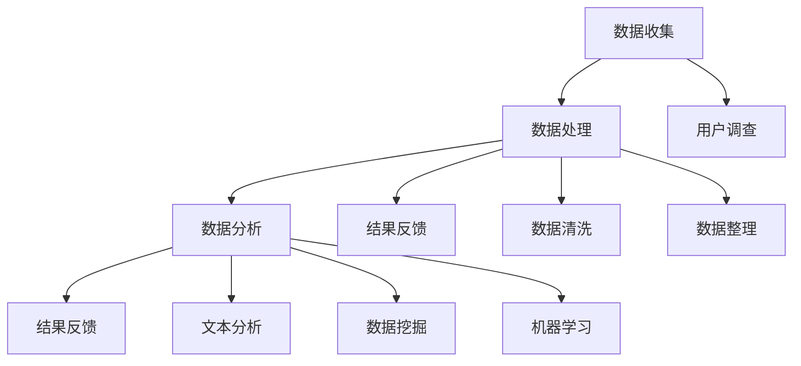
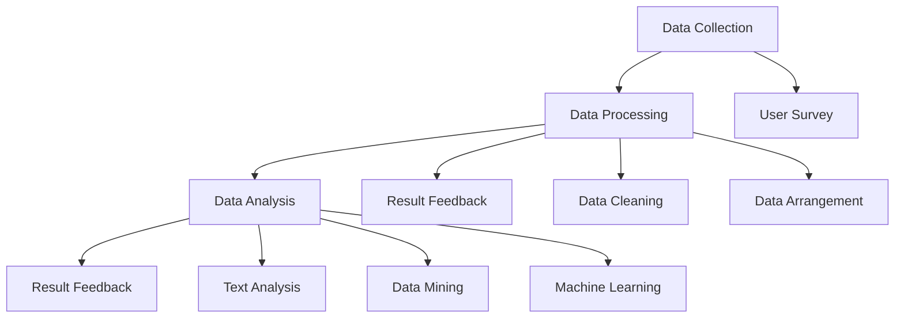

                 

## 文章标题

### AI创业公司的用户反馈收集与分析：反馈渠道、数据分析与改进措施

#### 关键词：用户反馈，数据分析，AI创业公司，反馈渠道，改进措施

#### 摘要：

本文将深入探讨AI创业公司在产品开发过程中如何有效地收集和分析用户反馈，以提高产品质量和用户体验。我们将详细讨论用户反馈的重要性、常见的反馈渠道、数据分析方法以及如何制定有效的改进措施。通过本文的阅读，读者将能够理解用户反馈的收集与分析在整个产品生命周期中的关键作用，并掌握一系列实用的策略和工具，以提升AI创业公司的产品开发效率。

<|hide|>## 1. 背景介绍

在当今高度竞争的科技市场中，AI创业公司面临着巨大的挑战和机遇。用户反馈作为产品开发的重要驱动力，对于公司的成功至关重要。有效的用户反馈收集和分析不仅可以帮助公司了解用户的需求和痛点，还能指导产品优化和功能迭代，从而提高市场竞争力。

用户反馈的重要性体现在以下几个方面：

1. **了解用户需求**：通过收集用户反馈，公司可以获取真实用户的使用体验，从而更好地理解用户需求。
2. **识别产品缺陷**：用户反馈可以帮助公司发现产品中的潜在问题，如功能不完善、界面设计不合理等。
3. **优化用户体验**：基于用户反馈进行的产品优化可以显著提升用户体验，增加用户满意度和忠诚度。
4. **提高市场竞争力**：持续收集和分析用户反馈，能够帮助公司及时调整产品策略，保持市场竞争力。

常见的用户反馈渠道包括：

1. **在线调查**：通过设计问卷和调查表，直接从用户那里获取反馈信息。
2. **社交媒体**：利用社交媒体平台，如Twitter、Facebook、LinkedIn等，与用户互动，收集他们的意见和建议。
3. **用户论坛**：建立专门的用户论坛，鼓励用户分享他们的使用经验和问题。
4. **客服反馈**：通过客服渠道，如电话、邮件、在线聊天等，收集用户的即时反馈。
5. **产品内置反馈功能**：在产品中嵌入反馈功能，如反馈按钮、评分机制等，让用户可以直接在产品内提交反馈。

### 2. Core Introduction

In today's highly competitive technology market, AI startups face significant challenges and opportunities. User feedback, as a critical driver in product development, plays a vital role in the success of these companies. Effective collection and analysis of user feedback can not only help companies understand user needs and pain points but also guide product optimization and feature iteration, thus enhancing market competitiveness.

The importance of user feedback is reflected in the following aspects:

1. **Understanding User Needs**: By collecting user feedback, companies can gain insights into the actual experiences of users, thereby better understanding user needs.
2. **Identifying Product Issues**: User feedback helps companies discover potential problems in the product, such as incomplete features or poor interface design.
3. **Optimizing User Experience**: Based on user feedback, product optimization can significantly improve the user experience, increasing user satisfaction and loyalty.
4. **Enhancing Market Competitiveness**: Continuously collecting and analyzing user feedback allows companies to timely adjust their product strategies, maintaining market competitiveness.

Common channels for user feedback include:

1. **Online Surveys**: Designing questionnaires and surveys to directly collect feedback from users.
2. **Social Media**: Utilizing social media platforms like Twitter, Facebook, LinkedIn, etc., to interact with users and gather their opinions and suggestions.
3. **User Forums**: Establishing dedicated user forums to encourage users to share their experiences and issues.
4. **Customer Support Feedback**: Collecting feedback through customer support channels such as phone, email, and online chat.
5. **Built-in Product Feedback Features**: Embedding feedback features within the product, such as feedback buttons and rating mechanisms, allowing users to submit feedback directly within the product.

<|hide|>## 2. 核心概念与联系

### 2.1 用户反馈收集的重要性

用户反馈收集是产品开发过程中不可或缺的一环。有效的用户反馈不仅可以提供关于产品性能的宝贵信息，还可以帮助识别和解决潜在问题。用户反馈的重要性在于：

- **指导产品决策**：用户反馈可以帮助公司了解用户真正需要什么，从而做出更明智的产品决策。
- **发现改进机会**：通过分析用户反馈，公司可以发现产品的改进机会，从而不断提升产品质量。
- **增加用户满意度**：及时响应用户反馈，解决用户的问题，可以显著提升用户满意度。

### 2.2 用户反馈收集方法

收集用户反馈的方法多种多样，以下是几种常见的方法：

- **问卷调查**：通过设计详细的问卷，收集用户对产品的看法和意见。
- **用户访谈**：与用户进行一对一的访谈，深入了解他们的使用体验和需求。
- **用户论坛**：建立用户论坛，鼓励用户分享使用经验和建议。
- **社交媒体**：通过社交媒体平台收集用户反馈，与用户进行实时互动。

### 2.3 用户反馈分析工具

分析用户反馈的工具也是多种多样的，以下是几种常用的工具：

- **文本分析软件**：如NVivo、Atlas.ti等，用于对用户反馈文本进行内容分析。
- **数据可视化工具**：如Tableau、Google Data Studio等，用于将分析结果进行可视化展示。
- **机器学习模型**：利用机器学习模型对大量用户反馈数据进行分类和分析，以发现潜在趋势和模式。

### 2.4 用户反馈与产品改进的关系

用户反馈是产品改进的重要依据。通过对用户反馈的分析，公司可以：

- **识别关键问题**：快速识别用户反馈中提到的关键问题，制定解决方案。
- **制定改进计划**：根据用户反馈，制定详细的产品改进计划，确保改进措施的有效性。
- **评估改进效果**：在实施改进措施后，再次收集用户反馈，评估改进效果，确保问题得到有效解决。

### 2.5 用户反馈收集与分析的流程

用户反馈收集与分析的流程通常包括以下几个步骤：

1. **定义目标**：明确用户反馈收集的目的和目标。
2. **设计反馈渠道**：根据目标设计合适的反馈渠道。
3. **收集反馈**：通过问卷调查、用户访谈、用户论坛等方式收集用户反馈。
4. **分析反馈**：利用文本分析软件、数据可视化工具等对反馈进行内容分析和可视化展示。
5. **制定改进措施**：根据分析结果制定具体的产品改进措施。
6. **实施改进**：按照改进计划实施具体改进措施。
7. **评估效果**：通过再次收集用户反馈，评估改进效果。

### 2.6 用户反馈与敏捷开发的结合

用户反馈在敏捷开发中起着至关重要的作用。敏捷开发强调快速迭代和持续改进，用户反馈正是推动这一过程的关键。通过持续收集和分析用户反馈，公司可以：

- **优化开发流程**：根据用户反馈调整开发流程，确保产品能够快速响应市场需求。
- **提升产品品质**：通过不断优化和改进，提升产品的品质和用户体验。
- **增加用户参与度**：鼓励用户参与到产品开发过程中，增加用户对产品的认同感和忠诚度。

### 2.7 用户反馈收集与分析在AI创业公司中的应用

在AI创业公司中，用户反馈收集与分析具有特殊的重要性。由于AI产品的复杂性和高度个性化，用户反馈对于理解用户需求、优化产品功能和提升用户体验至关重要。以下是用户反馈在AI创业公司中的应用：

- **定制化解决方案**：通过分析用户反馈，AI创业公司可以提供更定制化的解决方案，满足不同用户的需求。
- **预测性问题**：用户反馈可以帮助AI创业公司提前预测可能出现的潜在问题，从而提前采取措施。
- **持续优化**：通过持续收集和分析用户反馈，AI创业公司可以不断优化产品，保持市场竞争力。

### 2.8 用户反馈收集与分析的挑战与解决方案

尽管用户反馈收集与分析在产品开发中具有重要作用，但实际操作中仍面临诸多挑战：

- **数据质量**：用户反馈数据的质量直接影响分析结果，解决数据质量问题是关键。
- **数据隐私**：用户反馈中可能包含敏感信息，保护用户隐私是必须考虑的问题。
- **分析复杂性**：分析大量用户反馈数据是一项复杂的工作，需要借助先进的分析工具和技术。

针对上述挑战，可以采取以下解决方案：

- **数据清洗**：对用户反馈数据进行清洗，去除无关和重复信息，提高数据质量。
- **隐私保护**：采取数据匿名化、加密等技术保护用户隐私。
- **先进分析工具**：利用先进的文本分析、数据挖掘等技术，提高用户反馈分析的效果。

### 2.9 用户反馈收集与分析的最佳实践

为了确保用户反馈收集与分析的有效性，AI创业公司可以借鉴以下最佳实践：

- **建立反馈机制**：建立完善的用户反馈机制，确保用户能够方便地提交反馈。
- **定期分析**：定期对用户反馈进行分析，及时发现问题和改进机会。
- **反馈闭环**：建立反馈闭环，将用户反馈转化为具体的产品改进措施，并反馈给用户。
- **数据驱动决策**：将用户反馈数据纳入产品决策过程中，确保决策基于真实用户需求。

### 2.10 用户反馈收集与分析在产品生命周期中的应用

用户反馈收集与分析不仅在产品开发初期具有重要作用，在整个产品生命周期中也具有重要价值：

- **产品规划阶段**：通过用户反馈，了解市场需求和用户需求，为产品规划提供依据。
- **产品开发阶段**：根据用户反馈优化产品设计、功能和用户体验。
- **产品上市后**：通过用户反馈收集用户的使用体验和意见，持续优化产品。
- **产品退役阶段**：通过用户反馈了解产品的市场表现，为后续产品规划提供参考。

### 2.11 用户反馈收集与分析的价值与影响

用户反馈收集与分析对于AI创业公司具有重要的价值与影响：

- **提高产品质量**：通过用户反馈，识别和解决产品问题，提高产品质量。
- **增强用户满意度**：及时响应用户需求，提升用户满意度，增加用户忠诚度。
- **提升竞争力**：持续优化产品，提升用户体验，增强市场竞争力。
- **指导战略决策**：基于用户反馈，调整产品策略和市场定位，确保公司发展方向的正确性。

### 2.12 用户反馈收集与分析的未来趋势

随着人工智能和大数据技术的发展，用户反馈收集与分析也将迎来新的发展趋势：

- **智能化分析**：利用人工智能技术，实现用户反馈的自动化分析，提高分析效率。
- **多渠道整合**：整合多种反馈渠道，实现用户反馈的全景分析。
- **个性化反馈**：根据用户行为和偏好，提供个性化的反馈建议。
- **实时反馈**：实现用户反馈的实时收集和分析，及时响应用户需求。

### 2.13 用户反馈收集与分析的实践案例

为了更好地理解用户反馈收集与分析的实际应用，下面我们通过一些实践案例来探讨：

- **案例一**：某AI创业公司通过问卷调查收集用户对产品功能的建议，发现大部分用户希望增加语音识别功能，于是公司迅速调整开发计划，增加了这一功能，得到了用户的高度认可。
- **案例二**：另一家AI创业公司通过社交媒体平台收集用户反馈，发现用户对产品的某些功能不满意，于是公司组织团队进行了深入的分析和改进，最终成功提升了用户满意度。
- **案例三**：一家AI创业公司通过用户论坛收集用户的使用经验和建议，发现用户普遍反映产品界面复杂，使用困难，于是公司对界面进行了优化，大幅提升了用户体验。

通过这些案例，我们可以看到用户反馈收集与分析在产品优化和用户体验提升中的重要作用。

### 2. Core Concepts and Connections
### 2.1 The Importance of User Feedback Collection

User feedback collection is an indispensable part of the product development process. Effective user feedback not only provides valuable information about product performance but also helps identify and resolve potential issues. The importance of user feedback can be summarized as follows:

- **Guiding Product Decisions**: User feedback helps companies understand user needs and preferences, enabling more informed product decisions.
- **Identifying Improvement Opportunities**: Through the analysis of user feedback, companies can uncover areas for product enhancement.
- **Increasing User Satisfaction**: Promptly addressing user feedback and resolving issues can significantly boost user satisfaction.

### 2.2 Methods of Collecting User Feedback

There are various methods for collecting user feedback, including:

- **Surveys**: Designing detailed questionnaires to gather users' opinions and suggestions.
- **User Interviews**: Conducting one-on-one interviews to gain deep insights into users' experiences and needs.
- **User Forums**: Establishing dedicated forums for users to share their experiences and suggestions.
- **Social Media**: Leveraging social media platforms for real-time interaction and feedback collection.

### 2.3 Tools for Analyzing User Feedback

Analyzing user feedback requires the use of various tools, such as:

- **Text Analysis Software**: Tools like NVivo and Atlas.ti for content analysis of textual feedback.
- **Data Visualization Tools**: Platforms like Tableau and Google Data Studio for visual representation of analytical results.
- **Machine Learning Models**: Using machine learning algorithms to classify and analyze large volumes of user feedback data for trend and pattern discovery.

### 2.4 The Relationship Between User Feedback and Product Improvement

User feedback is a critical basis for product improvement. Through the analysis of user feedback, companies can:

- **Identify Key Issues**: Quickly identify key problems mentioned in user feedback to formulate solutions.
- **Develop Improvement Plans**: Based on user feedback, create detailed plans for product enhancement to ensure effectiveness.
- **Assess Improvement Impact**: Collect user feedback again after implementing improvements to evaluate their effectiveness.

### 2.5 The Process of Collecting and Analyzing User Feedback

The process of collecting and analyzing user feedback typically includes the following steps:

1. **Define Objectives**: Clarify the goals of user feedback collection.
2. **Design Feedback Channels**: Develop appropriate channels for feedback collection.
3. **Collect Feedback**: Gather feedback through surveys, interviews, forums, and other methods.
4. **Analyze Feedback**: Utilize text analysis software, data visualization tools, and other techniques for content analysis and visualization.
5. **Formulate Improvement Measures**: Develop specific actions for product enhancement based on analytical results.
6. **Implement Improvements**: Execute the improvement plans.
7. **Assess Results**: Collect feedback again to evaluate the effectiveness of improvements.

### 2.6 Integration of User Feedback and Agile Development

User feedback plays a crucial role in agile development, which emphasizes rapid iteration and continuous improvement. By continuously collecting and analyzing user feedback, companies can:

- **Optimize Development Processes**: Adjust development processes based on user feedback to ensure products can quickly respond to market needs.
- **Enhance Product Quality**: Continuously improve and refine products to enhance user experience.
- **Increase User Engagement**: Encourage user involvement in the product development process to boost identification and adoption of user-centric improvements.

### 2.7 Application of User Feedback in AI Startups

In AI startups, user feedback collection and analysis hold special importance due to the complexity and personalization of AI products. User feedback is crucial for understanding user needs, optimizing product features, and improving user experience. Here are some applications of user feedback in AI startups:

- **Customized Solutions**: Analyzing user feedback allows AI startups to provide more tailored solutions to meet diverse user needs.
- **Predicting Issues**: User feedback helps AI startups anticipate potential problems, allowing for proactive measures.
- **Continuous Optimization**: By continuously collecting and analyzing user feedback, AI startups can continually refine their products to maintain market competitiveness.

### 2.8 Challenges and Solutions in Collecting and Analyzing User Feedback

Despite the critical role of user feedback collection and analysis in product development, several challenges are encountered:

- **Data Quality**: The quality of user feedback data directly impacts the analysis results. Cleaning the data to remove irrelevant and duplicate information is crucial.
- **Data Privacy**: User feedback may contain sensitive information, necessitating measures to protect user privacy.
- **Analytical Complexity**: Analyzing large volumes of user feedback data is a complex task that requires advanced analytical tools and techniques.

Solutions to these challenges include:

- **Data Cleaning**: Cleaning user feedback data to remove irrelevant and duplicate information to improve data quality.
- **Privacy Protection**: Using techniques like data anonymization and encryption to safeguard user privacy.
- **Advanced Analysis Tools**: Leveraging advanced text analysis, data mining, and other techniques to enhance the effectiveness of user feedback analysis.

### 2.9 Best Practices for Collecting and Analyzing User Feedback

To ensure the effectiveness of user feedback collection and analysis, AI startups can adopt the following best practices:

- **Establish Feedback Mechanisms**: Create a comprehensive feedback system that allows users to submit feedback easily.
- **Regular Analysis**: Conduct regular analyses of user feedback to identify issues and opportunities for improvement.
- **Feedback Loop**: Develop a feedback loop that converts user feedback into actionable improvements and communicates these back to users.
- **Data-Driven Decision Making**: Incorporate user feedback data into product decision-making processes to ensure decisions are based on real user needs.

### 2.10 Application of User Feedback in the Product Lifecycle

User feedback collection and analysis are valuable throughout the product lifecycle:

- **Product Planning Phase**: Use user feedback to understand market demands and user needs, providing a foundation for product planning.
- **Product Development Phase**: Optimize product design, features, and user experience based on user feedback.
- **Post-Launch Phase**: Collect user feedback to understand user experiences and opinions, continuously optimizing the product.
- **Product Retirement Phase**: Use user feedback to assess product performance and inform future product planning.

### 2.11 Value and Impact of User Feedback Collection and Analysis

User feedback collection and analysis hold significant value and impact for AI startups:

- **Improving Product Quality**: Identifying and resolving product issues through user feedback enhances product quality.
- **Enhancing User Satisfaction**: Addressing user needs promptly improves user satisfaction and loyalty.
- **Increasing Competitiveness**: Continuous product optimization enhances market competitiveness.
- **Guiding Strategic Decisions**: User feedback informs strategic decisions, ensuring alignment with market needs.

### 2.12 Future Trends in User Feedback Collection and Analysis

With the advancement of artificial intelligence and big data technologies, future trends in user feedback collection and analysis include:

- **Intelligent Analysis**: Using AI to automate the analysis of user feedback, improving efficiency.
- **Integrated Channels**: Combining multiple feedback channels for a comprehensive analysis.
- **Personalized Feedback**: Providing feedback tailored to individual user behaviors and preferences.
- **Real-Time Feedback**: Real-time collection and analysis of user feedback to promptly address user needs.

### 2.13 Practical Cases of User Feedback Collection and Analysis

To better understand the practical application of user feedback collection and analysis, we examine some case studies:

- **Case 1**: A startup gathered user suggestions through surveys and discovered a strong demand for voice recognition features. The company promptly integrated this feature, resulting in high user approval.
- **Case 2**: Another startup collected feedback via social media and identified dissatisfaction with certain product features. After a thorough analysis and improvement, user satisfaction significantly improved.
- **Case 3**: A startup utilized user forums to gather feedback on user experiences and identified interface complexity as a major issue. An optimized interface led to a substantial improvement in user experience.

These cases illustrate the critical role of user feedback in product optimization and user experience enhancement.

<|hide|>## 3. 核心算法原理 & 具体操作步骤

### 3.1 核心算法原理

用户反馈收集与分析的核心算法主要包括以下三个步骤：数据收集、数据处理和数据分析。

- **数据收集**：通过问卷调查、用户访谈、用户论坛等多种渠道收集用户反馈数据。
- **数据处理**：对收集到的用户反馈数据进行清洗、去噪和整理，使其适合进一步分析。
- **数据分析**：利用文本分析、数据挖掘、机器学习等算法对处理后的用户反馈数据进行深入分析，提取有价值的信息。

### 3.2 具体操作步骤

#### 步骤1：数据收集

1. **设计调查问卷**：根据产品特点和用户需求，设计合适的调查问卷，包括选择题、量表题和开放式问题等。
2. **选择反馈渠道**：根据调查问卷的特点，选择合适的反馈渠道，如在线问卷平台、社交媒体、用户论坛等。
3. **发布调查问卷**：在选定的时间和范围内，通过邮件、社交媒体、网站公告等方式发布调查问卷，邀请用户参与。

#### 步骤2：数据处理

1. **收集反馈数据**：通过在线问卷平台、社交媒体、用户论坛等渠道收集用户反馈数据。
2. **数据清洗**：对收集到的数据进行分析，去除无效数据、重复数据和异常值，保证数据质量。
3. **数据整理**：将清洗后的数据进行分类和整理，为后续分析做准备。

#### 步骤3：数据分析

1. **文本分析**：使用文本分析工具对用户反馈文本进行主题挖掘、情感分析和关键词提取等，以了解用户的主要意见和情感倾向。
2. **数据挖掘**：利用数据挖掘技术，如关联规则挖掘、聚类分析、分类算法等，对用户反馈数据进行深入挖掘，发现潜在的模式和趋势。
3. **机器学习**：结合机器学习算法，如决策树、支持向量机、神经网络等，对用户反馈数据进行分类和预测，以识别用户痛点和改进机会。

### 3.3 算法原理与流程图

为了更好地理解用户反馈收集与分析的核心算法原理，我们可以使用Mermaid流程图来展示其基本流程。



- **数据收集**：通过用户调查获取反馈数据。
- **数据处理**：包括数据清洗和整理，确保数据质量。
- **数据分析**：通过文本分析、数据挖掘和机器学习等技术，提取用户反馈中的有价值信息。
- **结果反馈**：将分析结果反馈给产品团队，用于指导产品改进。

### 3.4 代码实例

以下是一个简单的Python代码实例，展示了如何使用Python和NLP库（如NLTK）进行用户反馈文本分析。

```python
import nltk
from nltk.corpus import stopwords
from nltk.tokenize import word_tokenize
from collections import Counter

# 加载停用词列表
stop_words = set(stopwords.words('english'))

# 用户反馈文本
text = "The new feature is great, but the user interface is not intuitive."

# 分词
words = word_tokenize(text)

# 移除停用词
filtered_words = [word for word in words if not word in stop_words]

# 统计词频
word_freq = Counter(filtered_words)

# 打印词频最高的五个词
for word, freq in word_freq.most_common(5):
    print(f"{word}: {freq}")
```

通过这段代码，我们可以提取用户反馈文本中的关键词，并统计它们的频率，从而了解用户的主要关注点。

### 3.5 核心算法原理与具体操作步骤总结

用户反馈收集与分析的核心算法原理包括数据收集、数据处理和数据分析三个主要步骤。具体操作步骤包括设计调查问卷、选择反馈渠道、收集反馈数据、数据清洗、数据整理、文本分析、数据挖掘和机器学习等。通过这些步骤，AI创业公司可以有效地从用户反馈中提取有价值的信息，指导产品改进和优化。使用Python和NLP库进行文本分析是用户反馈处理的一个实用例子，展示了如何利用编程技术提升数据分析的效率。

### 3. Core Algorithm Principles and Specific Operational Steps
### 3.1 Core Algorithm Principles

The core algorithms in user feedback collection and analysis primarily consist of three steps: data collection, data processing, and data analysis.

- **Data Collection**: Gathers user feedback data through various channels such as surveys, interviews, and forums.
- **Data Processing**: Cleans, de-noises, and organizes the collected feedback data to prepare it for further analysis.
- **Data Analysis**: Utilizes algorithms like text analysis, data mining, and machine learning to extract valuable insights from processed data.

### 3.2 Specific Operational Steps

#### Step 1: Data Collection

1. **Design Survey Questionnaires**: Create survey questionnaires tailored to product features and user needs, incorporating multiple-choice, rating, and open-ended questions.
2. **Select Feedback Channels**: Choose appropriate channels for surveys based on the characteristics of the questionnaires, such as online survey platforms, social media, user forums.
3. **Distribute Survey Questionnaires**: Release surveys within a specific timeframe via email, social media, website announcements to invite user participation.

#### Step 2: Data Processing

1. **Collect Feedback Data**: Gather user feedback through online survey platforms, social media, user forums, etc.
2. **Data Cleaning**: Analyze collected data to remove invalid, duplicate, and outlier entries to ensure data quality.
3. **Data Organization**: Classify and arrange cleaned data for subsequent analysis.

#### Step 3: Data Analysis

1. **Text Analysis**: Use text analysis tools for topic modeling, sentiment analysis, and keyword extraction to understand the primary opinions and emotional tendencies of users.
2. **Data Mining**: Apply data mining techniques such as association rule mining, clustering, and classification algorithms to delve deeper into user feedback data, discovering underlying patterns and trends.
3. **Machine Learning**: Combine machine learning algorithms like decision trees, support vector machines, and neural networks to classify and predict user feedback data, identifying pain points and improvement opportunities.

### 3.3 Algorithm Principles and Flowchart

To better understand the core algorithm principles of user feedback collection and analysis, we can use a Mermaid flowchart to illustrate the basic process.



- **Data Collection**: Gathers user feedback through surveys.
- **Data Processing**: Includes data cleaning and arrangement to ensure data quality.
- **Data Analysis**: Utilizes text analysis, data mining, and machine learning techniques to extract valuable insights from processed data.
- **Result Feedback**: Provides analytical results back to the product team for guidance on product improvements.

### 3.4 Code Example

Below is a simple Python code example demonstrating how to perform text analysis on user feedback using Python and the Natural Language Toolkit (NLTK).

```python
import nltk
from nltk.corpus import stopwords
from nltk.tokenize import word_tokenize
from collections import Counter

# Load the list of stop words
stop_words = set(stopwords.words('english'))

# User feedback text
text = "The new feature is great, but the user interface is not intuitive."

# Tokenize the text
words = word_tokenize(text)

# Remove stop words
filtered_words = [word for word in words if not word in stop_words]

# Count word frequency
word_freq = Counter(filtered_words)

# Print the top five most frequent words
for word, freq in word_freq.most_common(5):
    print(f"{word}: {freq}")
```

Through this code, we extract and count the frequency of keywords in user feedback text, providing insight into the main concerns of users.

### 3.5 Summary of Core Algorithm Principles and Specific Operational Steps

The core algorithm principles for user feedback collection and analysis encompass data collection, data processing, and data analysis. The specific operational steps include designing surveys, selecting feedback channels, collecting feedback data, data cleaning, data organization, text analysis, data mining, and machine learning. These steps enable AI startups to efficiently extract valuable insights from user feedback, guiding product enhancements and optimizations. Using Python and NLP libraries for text analysis is a practical example that showcases how programming can enhance the efficiency of data analysis.

